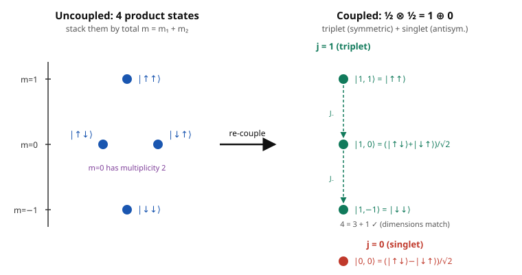

# Group & Representation Theory · Lesson 4.5: Adding angular momenta

> ⏱ ~15 min · Module 4: Lie groups and Lie algebras · Builds on: [4.4 Representations of $\mathfrak{su}(2)$ — angular momentum](04-04-su2-representations-angular-momentum.md) · Unlocks: [4.6 Roots, weights, and a taste of $SU(3)$](04-06-roots-weights-su3.md)

## Why this matters

Two electrons, each spin-$\tfrac12$. A proton and an electron in hydrogen. An orbital angular momentum $\ell$ combined with a spin $s$. Every time a quantum system has *two* sources of angular momentum, physics asks the same question: what values can the **total** angular momentum take? The answer — that spins $j_1$ and $j_2$ combine into totals ranging from $|j_1-j_2|$ up to $j_1+j_2$ — is memorized by every physics student as the "addition of angular momenta" rule. What they rarely see is that it is nothing but the **decomposition of a tensor product of $\mathfrak{su}(2)$ representations** (the machinery of [3.1](03-01-tensor-products.md)–[3.2](03-02-clebsch-gordan-decomposition.md)), now applied to a continuous group. This lesson closes that loop: the Clebsch–Gordan coefficients in the back of every quantum textbook are a change of basis you can *derive*.

## The idea

Put two spinning systems side by side. If system 1 lives in the spin-$j_1$ representation (dimension $2j_1+1$) and system 2 in spin-$j_2$ (dimension $2j_2+1$), the combined system lives in the **tensor product** — the space of all pairs, dimension $(2j_1+1)(2j_2+1)$. That's the honest arena, but it's reducible: it doesn't have a single well-defined total spin. Decomposing it into irreducibles sorts the combined states into sharp-total-spin bundles.

Here's the shortcut that makes it easy. The total $J_z$ is just $J_z^{(1)} + J_z^{(2)}$ — spin projections along $z$ **add like ordinary numbers**, $m = m_1 + m_2$. So list every product state by its $m$ value and count how many sit at each level. A spin-$j$ multiplet contributes exactly one state to each of $m = j, j-1, \dots, -j$. Reading the $m$-histogram from the top down, you can peel off multiplets one at a time — and out falls the rule $j = j_1+j_2,\ j_1+j_2-1,\ \dots,\ |j_1-j_2|$, each total appearing once. It's Tetris with weights.

## The formal version

**The tensor product of $\mathfrak{su}(2)$ irreps.** Let $D_{j}$ denote the spin-$j$ irrep of $\mathfrak{su}(2)$ (dimension $2j+1$, with $J_z$-eigenstates $|j,m\rangle$, $m=-j,\dots,j$). Then

$$D_{j_1} \otimes D_{j_2} \;=\; \bigoplus_{j\,=\,|j_1-j_2|}^{\,j_1+j_2} D_{j},$$

the sum running in **integer steps**, each $j$ appearing **exactly once**.

In words: combining spin $j_1$ with spin $j_2$ gives every total spin from $|j_1-j_2|$ to $j_1+j_2$, once each.

**Why the range and multiplicity are forced (weight counting).** On the product space the generators act as $J_a = J_a^{(1)}\otimes I + I\otimes J_a^{(2)}$ (the Lie-algebra "product rule" from [3.1](03-01-tensor-products.md)). In particular $J_z(|j_1,m_1\rangle|j_2,m_2\rangle) = (m_1+m_2)|j_1,m_1\rangle|j_2,m_2\rangle$, so the $J_z$-eigenvalue of a product state is $m=m_1+m_2$. Let $N(m)$ be the number of product states with total projection $m$. Each irrep $D_j$ contributes $+1$ to $N(m)$ for every $|m|\le j$, so

$$\#\{\text{copies of } D_j\} \;=\; N(m{=}j) - N(m{=}j{+}1).$$

In words: the number of spin-$j$ multiplets is how many *new* states appear when you step the $m$-histogram down from $j+1$ to $j$. This determines the whole decomposition mechanically.

**Dimension check.** Both sides must have the same dimension:

$$(2j_1+1)(2j_2+1) \;=\; \sum_{j=|j_1-j_2|}^{j_1+j_2}(2j+1).$$

**Coupled vs. uncoupled bases.** The product space has two natural orthonormal bases for the *same* vectors:

- **Uncoupled:** $|j_1,m_1\rangle|j_2,m_2\rangle$ — simultaneous eigenstates of $J_z^{(1)}$ and $J_z^{(2)}$ (each part's projection is sharp). Good for writing down states.
- **Coupled:** $|j,m\rangle$ — simultaneous eigenstates of the *total* $J^2$ and $J_z$ (total spin and its projection are sharp). Good for physics, because rotations act irreducibly on each $j$-block.

The overlap between them is a set of real numbers, the **Clebsch–Gordan (CG) coefficients**:

$$|j,m\rangle \;=\; \sum_{m_1+m_2=m} \underbrace{\langle j_1\,m_1\,;\,j_2\,m_2\,|\,j\,m\rangle}_{\text{CG coefficient}}\;|j_1,m_1\rangle|j_2,m_2\rangle.$$

**How to compute them.** Start from the unique top state $|j_1+j_2,\,j_1+j_2\rangle = |j_1,j_1\rangle|j_2,j_2\rangle$ (only one product state has maximal $m$). Apply the total lowering operator $J_- = J_-^{(1)} + J_-^{(2)}$ repeatedly, using $J_-|j,m\rangle = \sqrt{j(j+1)-m(m-1)}\,|j,m-1\rangle$ on each side, to fill out the whole $j=j_1+j_2$ ladder. For the next lower $j$, take the top state of *that* multiplet to be the combination in the $m = j_1+j_2-1$ subspace **orthogonal** to the one you already have (normalized, with the standard sign), then lower again. Repeat down to $|j_1-j_2|$. This is exactly the [3.2](03-02-clebsch-gordan-decomposition.md) Clebsch–Gordan procedure — the label "Clebsch–Gordan" *comes from* this $\mathfrak{su}(2)$ problem.

## Picture

The four uncoupled states stack up as an $m$-histogram $N(1)=1,\ N(0)=2,\ N(-1)=1$. Peeling off the top multiplet ($j=1$: one state each at $m=1,0,-1$) leaves exactly one state at $m=0$ — the $j=0$ singlet. That's $\tfrac12\otimes\tfrac12 = 1\oplus 0$, read straight off the picture.

## Worked examples

**Example 1 (the two-electron spins: $\tfrac12\otimes\tfrac12 = 1\oplus 0$, with all CG coefficients).**

Write $|{\uparrow}\rangle=|\tfrac12,\tfrac12\rangle$, $|{\downarrow}\rangle=|\tfrac12,-\tfrac12\rangle$. On spin-$\tfrac12$, $J_-|{\uparrow}\rangle=|{\downarrow}\rangle$ and $J_-|{\downarrow}\rangle=0$ (since $\sqrt{\tfrac12\cdot\tfrac32-\tfrac12\cdot(-\tfrac12)}=1$).

*Top of the triplet.* Maximal $m=1$ is unique:
$$|1,1\rangle = |{\uparrow\uparrow}\rangle.$$

*Lower once.* Using $J_-|1,1\rangle=\sqrt{1\cdot2-1\cdot0}\,|1,0\rangle=\sqrt2\,|1,0\rangle$ on the left, and $J_-=J_-^{(1)}+J_-^{(2)}$ on the right:
$$J_-|{\uparrow\uparrow}\rangle = |{\downarrow\uparrow}\rangle + |{\uparrow\downarrow}\rangle \;\Rightarrow\; \sqrt2\,|1,0\rangle = |{\uparrow\downarrow}\rangle+|{\downarrow\uparrow}\rangle \;\Rightarrow\; |1,0\rangle = \tfrac{1}{\sqrt2}\big(|{\uparrow\downarrow}\rangle+|{\downarrow\uparrow}\rangle\big).$$

*Lower again.* $J_-|1,0\rangle=\sqrt2\,|1,-1\rangle$, while $J_-\tfrac{1}{\sqrt2}(|{\uparrow\downarrow}\rangle+|{\downarrow\uparrow}\rangle)=\tfrac{1}{\sqrt2}(|{\downarrow\downarrow}\rangle+|{\downarrow\downarrow}\rangle)=\sqrt2\,|{\downarrow\downarrow}\rangle$, so
$$|1,-1\rangle = |{\downarrow\downarrow}\rangle.$$

The three **triplet** states are symmetric under swapping the two particles. The remaining $j=0$ **singlet** lives in the $m=0$ subspace, orthogonal to $|1,0\rangle$ and normalized (Condon–Shortley sign: coefficient of the higher $m_1$ positive):
$$|0,0\rangle = \tfrac{1}{\sqrt2}\big(|{\uparrow\downarrow}\rangle-|{\downarrow\uparrow}\rangle\big),$$
which is **antisymmetric**. Reading off the coefficients:
$$\langle \tfrac12\,\tfrac12;\tfrac12\,{-}\tfrac12\,|\,1\,0\rangle=\tfrac{1}{\sqrt2},\quad \langle \tfrac12\,{-}\tfrac12;\tfrac12\,\tfrac12\,|\,1\,0\rangle=\tfrac{1}{\sqrt2},\quad \langle \tfrac12\,\tfrac12;\tfrac12\,{-}\tfrac12\,|\,0\,0\rangle=\tfrac{1}{\sqrt2},\quad \langle \tfrac12\,{-}\tfrac12;\tfrac12\,\tfrac12\,|\,0\,0\rangle=-\tfrac{1}{\sqrt2}.$$

*The physics.* For two electrons (fermions) the **total** state must be antisymmetric under exchange (Pauli). If they share the same spatial orbital — a symmetric spatial wavefunction — the spin part must be antisymmetric, forcing the **singlet**: the two electrons in a filled orbital are locked into $|0,0\rangle$. This symmetric/antisymmetric split is the $\mathrm{Sym}^2\oplus\Lambda^2$ decomposition of [3.1](03-01-tensor-products.md): the symmetric square is the triplet, the antisymmetric square the singlet, and $2\otimes 2 = 3\oplus 1$ is that split wearing spin labels.

**Example 2 (orbital-meets-spin: $1\otimes\tfrac12 = \tfrac32\oplus\tfrac12$ by weight counting).**

Spin-1 has $m_1\in\{1,0,-1\}$, spin-$\tfrac12$ has $m_2\in\{\tfrac12,-\tfrac12\}$. Tabulate $m=m_1+m_2$:

| $m$ | product states $(m_1,m_2)$ | $N(m)$ |
|----|----|----|
| $3/2$ | $(1,\tfrac12)$ | 1 |
| $1/2$ | $(1,-\tfrac12),\ (0,\tfrac12)$ | 2 |
| $-1/2$ | $(0,-\tfrac12),\ (-1,\tfrac12)$ | 2 |
| $-3/2$ | $(-1,-\tfrac12)$ | 1 |

Copies of $D_j$ $= N(j)-N(j{+}1)$: at $j=\tfrac32$, $N(\tfrac32)-N(\tfrac52)=1-0=1$; that multiplet uses one state from each level, dropping the histogram to $0,1,1,0$. At $j=\tfrac12$, $N(\tfrac12)-N(\tfrac32)=2-1=1$. So $1\otimes\tfrac12=\tfrac32\oplus\tfrac12$. Dimension check: $3\cdot2=6=4+2$. ✓

Read off two CG coefficients by lowering the top state $|\tfrac32,\tfrac32\rangle=|1,1\rangle|\tfrac12,\tfrac12\rangle$. With $J_-|\tfrac32,\tfrac32\rangle=\sqrt{\tfrac32\cdot\tfrac52-\tfrac32\cdot\tfrac12}\,|\tfrac32,\tfrac12\rangle=\sqrt3\,|\tfrac32,\tfrac12\rangle$, and $J_-^{(1)}|1,1\rangle=\sqrt2\,|1,0\rangle$, $J_-^{(2)}|\tfrac12,\tfrac12\rangle=|\tfrac12,-\tfrac12\rangle$:
$$\sqrt3\,|\tfrac32,\tfrac12\rangle = \sqrt2\,|1,0\rangle|\tfrac12,\tfrac12\rangle + |1,1\rangle|\tfrac12,-\tfrac12\rangle \;\Rightarrow\; |\tfrac32,\tfrac12\rangle = \sqrt{\tfrac23}\,|1,0\rangle|\tfrac12,\tfrac12\rangle + \sqrt{\tfrac13}\,|1,1\rangle|\tfrac12,-\tfrac12\rangle.$$
So $\langle 1\,0;\tfrac12\,\tfrac12\,|\,\tfrac32\,\tfrac12\rangle=\sqrt{2/3}$ and $\langle 1\,1;\tfrac12\,{-}\tfrac12\,|\,\tfrac32\,\tfrac12\rangle=\sqrt{1/3}$ — exactly the entries in a standard CG table. The $j=\tfrac12$ partner is the orthogonal combination, $|\tfrac12,\tfrac12\rangle=\sqrt{\tfrac13}\,|1,0\rangle|\tfrac12,\tfrac12\rangle-\sqrt{\tfrac23}\,|1,1\rangle|\tfrac12,-\tfrac12\rangle$.

## Watch out

- **You might think spins add like scalars — $j = j_1+j_2$.** Only the *projections* $m$ add. The total $j$ takes a whole *range* of values because $J^2 \ne (J^{(1)})^2+(J^{(2)})^2$; the cross term $2\,\vec J^{(1)}\!\cdot\!\vec J^{(2)}$ is what spreads $j$ from $|j_1-j_2|$ to $j_1+j_2$.
- **You might think the singlet is "no angular momentum, so it's trivial."** $|0,0\rangle$ is invariant under rotations, but it is a genuine, highly *entangled* two-particle state — you cannot write it as a single product $|{\cdot}\rangle|{\cdot}\rangle$. That entanglement is the whole content of the Pauli-locked electron pair (and of Bell's inequality experiments).
- **You might drop the sign in $|0,0\rangle$ and use the symmetric combination.** The singlet is the *antisymmetric* $\tfrac{1}{\sqrt2}(|{\uparrow\downarrow}\rangle-|{\downarrow\uparrow}\rangle)$; the symmetric one is the $m=0$ member of the triplet. Same two kets, opposite sign, totally different total spin.
- **You might forget that CG coefficients carry a sign convention.** The magnitudes are forced by lowering and orthogonality, but the overall sign of each new multiplet's top state is a *convention* (Condon–Shortley). Tables agree only because everyone uses the same one.

## One-liner

> Combining spins is decomposing a tensor product of $\mathfrak{su}(2)$ irreps: projections add ($m=m_1+m_2$), and weight-counting peels the totals off from $j_1+j_2$ down to $|j_1-j_2|$, one multiplet at a time.

## Problems

**P1 (🟢)** State the total-spin content of each tensor product, and verify the dimension count on both sides.
(a) $2\otimes 1$.  (b) $\tfrac32\otimes 1$.

**P2 (🟡)** By starting from the top state and applying $J_-=J_-^{(1)}+J_-^{(2)}$, construct all four coupled states of $\tfrac12\otimes\tfrac12$ (the triplet ladder and the singlet), giving each Clebsch–Gordan coefficient. Then say which of the four are symmetric under particle exchange and which is antisymmetric.

**P3 (🔴, optional)** Decompose $1\otimes 1$ by weight counting, confirming $1\otimes1=2\oplus1\oplus0$ and the dimension count. Then build the top state $|j,j\rangle$ of each total $j$ in terms of the spin-1 product states $|m_1\rangle|m_2\rangle$ — in particular, produce the $j=0$ singlet explicitly.

Solutions

**P1** The rule gives $j$ from $|j_1-j_2|$ to $j_1+j_2$ in integer steps.

(a) $2\otimes1$: $j=1,2,3$, i.e. $2\otimes1 = 3\oplus2\oplus1$. Dimensions: $5\cdot3=15$ and $7+5+3=15$. ✓
(b) $\tfrac32\otimes1$: $j=\tfrac12,\tfrac32,\tfrac52$, i.e. $\tfrac32\otimes1=\tfrac52\oplus\tfrac32\oplus\tfrac12$. Dimensions: $4\cdot3=12$ and $6+4+2=12$. ✓

**P2** With $|{\uparrow}\rangle=|\tfrac12,\tfrac12\rangle$, $|{\downarrow}\rangle=|\tfrac12,-\tfrac12\rangle$ and $J_-|{\uparrow}\rangle=|{\downarrow}\rangle$, $J_-|{\downarrow}\rangle=0$:

Top: $|1,1\rangle=|{\uparrow\uparrow}\rangle$. Lower ($J_-|1,1\rangle=\sqrt2|1,0\rangle$):
$$J_-|{\uparrow\uparrow}\rangle=|{\downarrow\uparrow}\rangle+|{\uparrow\downarrow}\rangle \;\Rightarrow\; |1,0\rangle=\tfrac{1}{\sqrt2}(|{\uparrow\downarrow}\rangle+|{\downarrow\uparrow}\rangle).$$
Lower again ($J_-|1,0\rangle=\sqrt2|1,-1\rangle$): $J_-\tfrac1{\sqrt2}(|{\uparrow\downarrow}\rangle+|{\downarrow\uparrow}\rangle)=\tfrac1{\sqrt2}\cdot2|{\downarrow\downarrow}\rangle=\sqrt2|{\downarrow\downarrow}\rangle$, so $|1,-1\rangle=|{\downarrow\downarrow}\rangle$.

Singlet (orthogonal to $|1,0\rangle$ in the $m=0$ space, unit norm, Condon–Shortley sign):
$$|0,0\rangle=\tfrac{1}{\sqrt2}(|{\uparrow\downarrow}\rangle-|{\downarrow\uparrow}\rangle).$$
CG coefficients: $\langle\tfrac12\tfrac12;\tfrac12{-}\tfrac12|1\,0\rangle=\langle\tfrac12{-}\tfrac12;\tfrac12\tfrac12|1\,0\rangle=\tfrac1{\sqrt2}$; $\langle\tfrac12\tfrac12;\tfrac12{-}\tfrac12|0\,0\rangle=\tfrac1{\sqrt2}$, $\langle\tfrac12{-}\tfrac12;\tfrac12\tfrac12|0\,0\rangle=-\tfrac1{\sqrt2}$; and the stretched states have CG $=1$.

Exchange symmetry: the three triplet states $|1,1\rangle,|1,0\rangle,|1,-1\rangle$ are **symmetric** (swapping the two labels leaves them fixed); the singlet $|0,0\rangle$ is **antisymmetric** (it changes sign). This is $2\otimes2 = \mathrm{Sym}^2\oplus\Lambda^2 = 3\oplus1$.

**P3** Spin-1 has $m\in\{1,0,-1\}$. Write product states $|m_1\rangle|m_2\rangle$ as $|m_1;m_2\rangle$. Histogram of $m=m_1+m_2$:

| $m$ | states | $N(m)$ |
|----|----|----|
| $2$ | $(1,1)$ | 1 |
| $1$ | $(1,0),(0,1)$ | 2 |
| $0$ | $(1,-1),(0,0),(-1,1)$ | 3 |
| $-1$ | $(0,-1),(-1,0)$ | 2 |
| $-2$ | $(-1,-1)$ | 1 |

Copies of $D_j=N(j)-N(j{+}1)$: $j=2\!:1{-}0=1$; $j=1\!:2{-}1=1$; $j=0\!:3{-}2=1$. So $1\otimes1=2\oplus1\oplus0$. Dimensions $3\cdot3=9=5+3+1$. ✓

Top states. Use $J_-^{(1,2)}|1,\pm1\rangle=\sqrt2|1,0\rangle$, $J_-^{(1,2)}|1,0\rangle=\sqrt2|1,-1\rangle$.

- $j=2$: $|2,2\rangle=|1;1\rangle$ (unique maximal $m$).
- $j=1$: build the $m=1$ subspace. Lowering $|2,2\rangle$ ($J_-|2,2\rangle=\sqrt{2\cdot3-2\cdot1}\,|2,1\rangle=2|2,1\rangle$) gives $J_-|1;1\rangle=\sqrt2(|0;1\rangle+|1;0\rangle)$, so $|2,1\rangle=\tfrac1{\sqrt2}(|1;0\rangle+|0;1\rangle)$. The $j=1$ top state is the orthogonal, normalized (antisymmetric) combination:
$$|1,1\rangle_{\text{tot}}=\tfrac1{\sqrt2}(|1;0\rangle-|0;1\rangle).$$
- $j=0$: the singlet is the vector in the 3-dimensional $m=0$ space orthogonal to both $|2,0\rangle$ and $|1,0\rangle_{\text{tot}}$. Lowering gives $|2,0\rangle=\tfrac{1}{\sqrt6}(|1;-1\rangle+2|0;0\rangle+|-1;1\rangle)$ and $|1,0\rangle_{\text{tot}}=\tfrac1{\sqrt2}(|1;-1\rangle-|-1;1\rangle)$. Writing $|0,0\rangle=a|1;-1\rangle+b|0;0\rangle+c|-1;1\rangle$: orthogonality to $|2,0\rangle$ gives $a+2b+c=0$, to $|1,0\rangle_{\text{tot}}$ gives $a-c=0$; so $a=c$, $b=-a$, and normalization $3a^2=1$ yields
$$\boxed{\;|0,0\rangle=\tfrac{1}{\sqrt3}\big(|1;-1\rangle-|0;0\rangle+|-1;1\rangle\big).\;}$$
This is the rotation-invariant combination of two spin-1 objects — the same "trace" that pairs a vector with a co-vector.

## Flashback

**From Lesson 4.4 (Representations of $\mathfrak{su}(2)$):** In the spin-1 irrep, write the matrix of the raising operator $J_+$ in the ordered basis $\{|1,1\rangle,|1,0\rangle,|1,-1\rangle\}$.

Solution

Use $J_+|j,m\rangle=\sqrt{j(j+1)-m(m+1)}\,|j,m+1\rangle$ with $j=1$:
$$J_+|1,-1\rangle=\sqrt{2-0}\,|1,0\rangle=\sqrt2\,|1,0\rangle,\quad J_+|1,0\rangle=\sqrt{2-0}\,|1,1\rangle=\sqrt2\,|1,1\rangle,\quad J_+|1,1\rangle=0.$$
As a matrix (column = input state $|1,1\rangle,|1,0\rangle,|1,-1\rangle$ left to right; row = output in the same order):
$$J_+ = \begin{pmatrix} 0 & \sqrt2 & 0 \\ 0 & 0 & \sqrt2 \\ 0 & 0 & 0 \end{pmatrix}.$$
Strictly upper-triangular — raising pushes each rung up and annihilates the top. (Its transpose is $J_-$, and $J_x=\tfrac12(J_++J_-)$ recovers the familiar Hermitian spin-1 matrix.)

## Connections

- **Backward:** this is [3.1](03-01-tensor-products.md)'s tensor product and [3.2](03-02-clebsch-gordan-decomposition.md)'s Clebsch–Gordan decomposition applied to $\mathfrak{su}(2)$ — the continuous-group instance of the *same* finite-group math. The ladder operators and $|j,m\rangle$ multiplets are exactly [4.4](04-04-su2-representations-angular-momentum.md); the symmetric/antisymmetric split of the triplet vs. singlet is the $\mathrm{Sym}^2\oplus\Lambda^2$ of [3.1](03-01-tensor-products.md).
- **Forward:** [4.6](04-06-roots-weights-su3.md) generalizes weight-counting to $SU(3)$, where tensoring the fundamental $\mathbf 3$ (a quark) with itself and with $\bar{\mathbf 3}$ builds mesons and baryons — $\mathbf3\otimes\bar{\mathbf3}=\mathbf8\oplus\mathbf1$ is the higher-rank cousin of $\tfrac12\otimes\tfrac12=1\oplus0$.
- **Sideways (quantum mechanics):** this *is* the addition-of-angular-momenta chapter of [quantum mechanics](../../quantum-mechanics/syllabus.md) — coupled vs. uncoupled bases, CG tables, the singlet/triplet of two electrons, and the Pauli-exclusion locking of a filled orbital into the antisymmetric singlet. Everything a physics course presents as tables to memorize, you can now derive from representation theory.
