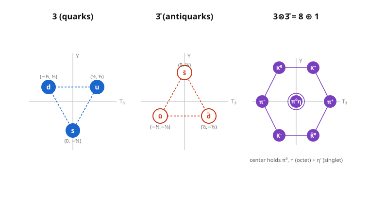

# Group & Representation Theory · Lesson 4.6: Roots, weights, and a taste of $SU(3)$

> ⏱ ~15 min · Module 4: Lie groups and Lie algebras · Builds on: [4.5 Adding angular momenta](04-05-adding-angular-momenta.md) · Unlocks: end of course — the [syllabus](../syllabus.md) map, and [QFT](../../qft/syllabus.md) as the sequel

## Why this matters

In 1961 there were dozens of "elementary" particles and no order to them — a zoo. Then Gell-Mann and Ne'eman noticed the mesons and baryons fell into neat geometric patterns: triangles, hexagons, a perfect triangle of ten. The patterns had a gap, and they bet a particle lived there. Three years later the $\Omega^-$ showed up exactly where the geometry said it must — mass and all.

Those patterns are **weight diagrams of $SU(3)$**. Everything this course built — a representation is a group as matrices (1.1), characters (2.1), tensor products (3.1), the su(2) ladder that IS angular momentum (4.4) — converges here into the single most consequential picture in physics: **the particle multiplets of the Standard Model are irreducible representations, and the quark triangle is a weight diagram.** This is the payoff. Let's read it off.

## The idea

In [4.4](04-04-su2-representations-angular-momentum.md) you diagonalized *one* operator, $J_z$, and labeled each basis state by its eigenvalue $m$. The ladder operators $J_\pm$ shuffled you between $m$-values in steps of $1$. That machinery — **diagonalize what you can, label states by eigenvalues, move between them with ladders** — is the whole game. It just gets bigger.

The generalization asks: *how many operators can we diagonalize at once?* For su(2) the answer is one ($J_z$ alone; $J_x, J_y$ don't commute with it). For su(3) it's **two**. So instead of a single number $m$ on a line, each state gets a **pair** of numbers — a point in a *plane*. Plot every state of a representation as a point, and the representation becomes a constellation. The ladders become arrows between the stars. That's a weight diagram, and for su(3) the fundamental one is a triangle whose three corners are the up, down, and strange quarks.

## The formal version

**Cartan subalgebra (the operators you diagonalize).** A *Cartan subalgebra* $\mathfrak{h}$ is a maximal set of generators that all commute with one another, hence are simultaneously diagonalizable. Its dimension is the **rank** of the algebra.
- *In words:* the biggest batch of "measure-at-once" quantum numbers.
- su(2): $\mathfrak{h} = \{J_z\}$, **rank 1**.
- su(3): $\mathfrak{h} = \{T_3, Y\}$, **rank 2** — physicists take *isospin* $T_3$ and *hypercharge* $Y$.

**Weights (the labels).** A *weight* is the tuple of simultaneous eigenvalues of the Cartan generators on a basis state $|\lambda\rangle$: $T_3|\lambda\rangle = t_3|\lambda\rangle$, $Y|\lambda\rangle = y\,|\lambda\rangle$, giving the weight $(t_3, y)$.
- *In words:* a state's address in eigenvalue-space. For su(2) the address is the single number $m$; for su(3) it's a point $(t_3,y)$ in the plane.

**Roots (the steps).** The remaining, non-Cartan generators come in raising/lowering pairs. A *root* is the weight of a generator viewed inside the **adjoint representation** (the algebra acting on itself) — equivalently, the vector a ladder operator *adds* to a state's weight.
- *In words:* roots are the arrows the ladders push you along. su(2)'s roots are $\pm 1$ (the two arrows of $J_\pm$). su(3) has **six roots**, arranged as a regular hexagon — six ladder operators, each stepping between quark weights.

**Weight diagram.** Plot the weights of a representation as points in $\mathbb{R}^{\text{rank}}$. Irreducible reps are exactly the "connected, root-generated" clusters — apply every ladder to one state and you sweep out the whole irrep, never leaving it (Schur, [1.5](01-05-schur-lemma.md), guarantees there's nothing to leave to).

**One line on the grand generalization.** Each simple Lie algebra is encoded by a **Dynkin diagram** — a tiny graph of its roots ($\mathfrak{su}(3)$'s is two linked nodes, $\circ\!-\!\circ$). Classifying *all* simple Lie algebras = classifying those diagrams ($A_n, B_n, C_n, D_n$ + five exceptionals). That's the summit of the theory; we're taking the view from just below it.

## Picture

The **3** is a triangle, its conjugate **3̄** the same triangle inverted (every weight negated — antiquarks carry opposite charges), and multiplying them assembles the meson hexagon-plus-center. The center is doubly occupied: two octet states ($\pi^0,\eta$) sit there plus one singlet ($\eta'$), which is why $3\otimes\bar 3 = 8\oplus 1$ and not just $9$.

## Worked examples

**Example 1 — the fundamental 3 and its conjugate; rank 2.**
The three quark weights $(t_3,y)$ are
$$u=(\tfrac12,\tfrac13),\qquad d=(-\tfrac12,\tfrac13),\qquad s=(0,-\tfrac23).$$
Plotted, they form an equilateral triangle centered at the origin (the weights of any irrep sum to zero — the Cartan generators are traceless). Two coordinates per state $\Rightarrow$ we diagonalized two commuting operators $\Rightarrow$ **rank 2**. The conjugate rep $\bar 3$ has the negated weights
$$\bar u=(-\tfrac12,-\tfrac13),\quad \bar d=(\tfrac12,-\tfrac13),\quad \bar s=(0,\tfrac23),$$
the inverted triangle. Because these two triangles aren't related by any rotation of the plane, $3\not\cong\bar 3$ — su(3) is the first algebra in this course whose fundamental is **not** self-conjugate (contrast su(2), where $\bar 2\cong 2$). That inequivalence is *why* quarks and antiquarks are physically distinct.

**Example 2 — mesons: $3\otimes\bar 3 = 8\oplus 1$ by adding weights.**
A meson is a quark–antiquark pair, so its states live in $3\otimes\bar 3$. The weight of a product state is the **sum** of the factor weights (exactly as $m$-values *added* when combining angular momenta in [4.5](04-05-adding-angular-momenta.md)). Add each quark weight to each antiquark weight — $3\times3=9$ states:

| | $\bar u\,(-\tfrac12,-\tfrac13)$ | $\bar d\,(\tfrac12,-\tfrac13)$ | $\bar s\,(0,\tfrac23)$ |
|---|---|---|---|
| $u\,(\tfrac12,\tfrac13)$ | $(0,0)$ | $(1,0)\ \pi^+$ | $(\tfrac12,1)\ K^+$ |
| $d\,(-\tfrac12,\tfrac13)$ | $(-1,0)\ \pi^-$ | $(0,0)$ | $(-\tfrac12,1)\ K^0$ |
| $s\,(0,-\tfrac23)$ | $(-\tfrac12,-1)\ K^-$ | $(\tfrac12,-1)\ \bar K^0$ | $(0,0)$ |

Six states land on distinct outer points (the hexagon: $K^+,K^0,\pi^+,\pi^-,K^-,\bar K^0$); **three** pile up at the origin $(0,0)$. A triple-degenerate center can't be one irrep — the root operators split it into an octet piece (two central states, giving the hexagon-with-doubled-center **8**) and a leftover invariant combination $\tfrac{1}{\sqrt3}(u\bar u+d\bar d+s\bar s)$ that every ladder annihilates: a **singlet 1**. Hence
$$3\otimes\bar 3 = 8\oplus 1,\qquad 9 = 8+1.\ \checkmark$$
Physically: the meson **nonet** — the octet ($\pi,K,\bar K,\eta$) plus the singlet $\eta'$.

**And baryons, in one breath.** Three quarks: $3\otimes3\otimes3 = 10\oplus 8\oplus 8\oplus 1$ (count: $27=10+8+8+1\ \checkmark$). The symmetric piece is the **decuplet 10**, a triangular array of ten weights. Its three corners are three identical quarks: $uuu=\Delta^{++}$, $ddd=\Delta^-$, and $sss$ at the bottom tip — which was the empty slot. That tip is the $\Omega^-$, predicted from the geometry and found in 1964. The **Eightfold Way** is literally these weight diagrams.

## Watch out

- **Weights vs. roots.** Weights label a *representation's* states (where the points are); roots are the special weights of the *adjoint* rep (the arrows between points). The adjoint of su(3) is the **8** — its weight diagram is the meson octet's hexagon, and its six outer weights *are* the six roots. Same picture, two jobs.
- **Rank $\neq$ dimension.** su(3) is an **8-dimensional** algebra (eight generators, the Gell-Mann matrices) but has **rank 2** (only two commute at once). Don't conflate "how many generators" with "how many you can diagonalize together."
- **The center's multiplicity is the whole subtlety.** The outer hexagon weights are non-degenerate, but interior weights can be hit more than once. Reading off $8\oplus1$ vs. a naive "$9$" hinges entirely on correctly counting that the origin is triply occupied and splits $2+1$. Weight *multiplicity*, not just weight *location*, carries the decomposition.
- **$\bar 3\neq 3$.** Negating weights is a genuine reflection here, not a rotation back onto the same triangle. Conjugate reps are only automatically equivalent for su(2)-type (pseudoreal/real) cases — don't carry that habit into su(3).

## One-liner

> Diagonalize the commuting generators, label each state by its list of eigenvalues (a *weight*), and let the ladder operators (*roots*) connect them — the quark triangle, the meson octet, and the baryon decuplet are just the weight diagrams of $SU(3)$'s smallest representations.

## Problems

**P1 (🟢)** You're handed three states with weights $(t_3,y)$: state A $=(-\tfrac12,\tfrac13)$, state B $=(0,-\tfrac23)$, state C $=(\tfrac12,\tfrac13)$. Place them in the $(T_3,Y)$ plane and identify which quark ($u$, $d$, or $s$) each one is. Then state the rank of su(3) and justify it from the diagram.

**P2 (🟡)** Using weight-addition, verify that combining a $u$ quark $(\tfrac12,\tfrac13)$ with the antiquarks of $\bar 3$ produces the top row of the meson table, and explain — in terms of weight *multiplicity* — why the nine $q\bar q$ states organize as $8\oplus1$ rather than as a single irreducible **9**.

**P3 (🔴)** For baryons ($3\otimes3\otimes3$): (a) add weights to find the three *extreme* (corner) states of the pattern and identify them as $\Delta^{++}$, $\Delta^-$, and $\Omega^-$; (b) confirm the full decomposition $3\otimes3\otimes3 = 10\oplus8\oplus8\oplus1$ by a dimension count, and say which multiplet's bottom corner was the famous prediction.

Solutions

**P1.** Plotting: A and C sit at the same height $y=\tfrac13$ with $t_3=-\tfrac12$ and $+\tfrac12$ (the two top corners); B sits low at $(0,-\tfrac23)$ (the bottom corner). Matching to the fundamental weights: **A $= d$**, **B $= s$**, **C $= u$**. They form an equilateral triangle centered at the origin (weights sum to zero: $(-\tfrac12+0+\tfrac12,\ \tfrac13-\tfrac23+\tfrac13)=(0,0)\ \checkmark$). **Rank $=2$**: each state carries *two* independent eigenvalue labels ($t_3$ and $y$), so we diagonalized two mutually commuting generators — the diagram lives in a 2-D plane, and its dimension is the rank.

**P2.** Add $u=(\tfrac12,\tfrac13)$ to each antiquark weight (component-wise):
$$u+\bar u=(\tfrac12-\tfrac12,\ \tfrac13-\tfrac13)=(0,0);\quad u+\bar d=(1,0)=\pi^+;\quad u+\bar s=(\tfrac12,1)=K^+.$$
That's the top row — $\checkmark$. Now the split. Doing this for all three quarks gives six distinct outer weights (each occupied *once*) and the origin occupied *three* times ($u\bar u, d\bar d, s\bar s$). An irrep's weight multiplicities are fixed by its shape: the hexagon-with-center pattern of the **8** wants the origin doubly occupied, and a **1** is a single state at the origin. $6\text{ outer}+2\text{ center}=8$ and $1\text{ center}=1$ accounts for all $6+3=9$ states with the center's multiplicity $3=2+1$. Concretely the singlet is the ladder-invariant combination $\tfrac{1}{\sqrt3}(u\bar u+d\bar d+s\bar s)$ (annihilated by every root operator — the "colorless/flavor-blind" trace), and the orthogonal two central combinations complete the octet. A single **9** would need a *different* multiplicity profile and no invariant subspace; the existence of that ladder-killed state forces reducibility (Schur, [1.5](01-05-schur-lemma.md)). Hence $8\oplus1$.

**P3.**
(a) Extreme states maximize/minimize the coordinates, so they're the "all the same quark" products (each pushes the weight furthest in one direction):
$$uuu=(\tfrac32,1)=\Delta^{++},\qquad ddd=(-\tfrac32,1)=\Delta^-,\qquad sss=(0,-2)=\Omega^-.$$
(Check $s$: $3\times(0,-\tfrac23)=(0,-2)$.) These are the three corners of a downward triangular array — the decuplet.
(b) Dimension count: $3\otimes3\otimes3$ has $3^3=27$ states. The claimed pieces total $10+8+8+1=27\ \checkmark$. (Route: $3\otimes3=6\oplus\bar3$, then $6\otimes3=10\oplus8$ and $\bar3\otimes3=8\oplus1$, giving $10\oplus8\oplus8\oplus1$.) The prediction lived at the **decuplet (10)**'s bottom corner: the $sss$ state $\Omega^-$, whose mass Gell-Mann read off from the even spacing of the decuplet's rows before it was discovered.

## Flashback

**From [Lesson 4.4](04-04-su2-representations-angular-momentum.md) (su(2) reps / angular momentum).** For the spin-$1$ representation of su(2) ($j=1$), (a) list the weights (the $J_z$ eigenvalues $m$), (b) give the su(2) roots and say what $J_\pm$ does to the top state $|1,1\rangle$, and (c) explain in one sentence how this 1-D "weight diagram" is the rank-1 shadow of today's su(3) triangle.

Solution

(a) For $j=1$ the weights are $m\in\{+1,0,-1\}$ — three equally spaced points on a line (the 1-D weight diagram). (b) The su(2) roots are $\pm1$: $J_+$ adds $1$ to $m$, $J_-$ subtracts $1$. Acting on the top state, $J_+|1,1\rangle=0$ (nothing above the ceiling — it's annihilated, marking the highest weight), while $J_-|1,1\rangle\propto|1,0\rangle$ steps down one rung. (c) su(2) is **rank 1**, so its weight "diagram" is a line and its roots are $\pm1$ on that line; su(3) is **rank 2**, so weights become points $(t_3,y)$ in a plane and the two $J_\pm$-arrows fan out into six roots forming a hexagon — the su(2) ladder is the one-dimensional silhouette of the su(3) machinery. (This spin-1 triplet is, not coincidentally, the *adjoint* of su(2), just as the meson octet is the adjoint of su(3).)

## Connections

- **Backward — this is [4.4](04-04-su2-representations-angular-momentum.md)/[4.5](04-05-adding-angular-momenta.md) generalized.** The Cartan subalgebra is su(2)'s lone $J_z$ grown to $\{T_3,Y\}$; roots are $J_\pm$ grown to six ladder operators; and "weights add under tensor products" is exactly [4.5](04-05-adding-angular-momenta.md)'s rule that $m$-values add when you combine angular momenta. Multiplets are built by [3.1](03-01-tensor-products.md)–[3.2](03-02-clebsch-gordan-decomposition.md)'s tensor-product decomposition — $3\otimes\bar3=8\oplus1$ is Clebsch–Gordan in a plane, and the singlet's existence is Schur ([1.5](01-05-schur-lemma.md)) reading off an invariant subspace.
- **The arc of the whole course.** From "a representation is a group written as matrices" ([1.1](01-01-what-is-a-representation.md)) → Maschke and Schur guaranteeing clean decompositions ([1.4](01-04-maschke-theorem.md)–[1.5](01-05-schur-lemma.md)) → characters as the fingerprint of an irrep ([2.1](02-01-characters.md)) → tensor products combining systems ([3.1](03-01-tensor-products.md)) → Lie groups/algebras as continuous symmetry ([4.1](04-01-lie-groups.md)–[4.2](04-02-lie-algebras-exponential-map.md)) → su(2) = spin ([4.4](04-04-su2-representations-angular-momentum.md)). The payoff: the Standard Model's gauge group $U(1)\times SU(2)\times SU(3)$ and every particle multiplet in it **are** representation theory. The quark triangle is a weight diagram. Full course map: the [syllabus](../syllabus.md).
- **Forward — [QFT](../../qft/syllabus.md) (the sequel).** There $SU(3)$ returns as the *color* gauge symmetry of the strong force (Yang–Mills), $SU(2)\times U(1)$ as the electroweak sector — the same algebras, now made *local* and dynamical. This lesson's weights become the charges that couple to gauge fields.
- **Sideways — quantum mechanics & particle physics.** In quantum mechanics ([QM syllabus](../../quantum-mechanics/syllabus.md)) these diagrams are hadron spectroscopy: isospin $T_3$, the **Eightfold Way**, and the $\Omega^-$ prediction are textbook su(3) flavor symmetry. In plain language: the reason there are families of particles that look like rotated copies of each other is that nature's symmetries act by *representations*, and a representation, decomposed, is exactly a family. That is the entire course in one sentence — and a fitting place to stop.
