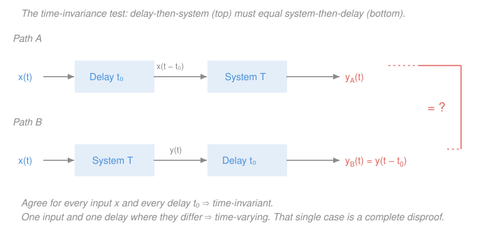

# Signals & Systems · Lesson 1.3: Systems and their properties

> ⏱ ~15 min · Module 1: Signals and LTI systems · Builds on: [1.1 Signals: the continuous and discrete worlds](01-01-signals-continuous-discrete.md), [1.2 The elementary signals](01-02-elementary-signals.md) · Unlocks: 1.4 (convolution in continuous time)

## Why this matters

Everything after this lesson — convolution, frequency response, transfer functions, filters, the FFT — is a theorem about **LTI systems**: systems that are *linear* and *time-invariant*. Those two adjectives are the admission ticket. An amplifier, an RC circuit, a suspension, a moving-average filter: all LTI, all analyzable with one toolkit. A multiplier that squares its input, or a gain that drifts over the day: not LTI, and the toolkit silently gives wrong answers.

So the skill this lesson buys you is a **verdict with a proof**. Not "this feels linear" — an argument from the definition that a grader (or a design review) would accept. It's five yes/no questions and one proof template that answers all of them.

## The idea

Step up one level of abstraction. In [1.1](01-01-signals-continuous-discrete.md) a signal was a *function*: feed it a time, get a number. A **system** is a machine that eats an entire signal and emits an entire signal — a function *of functions*, an **operator**. Feed in the whole history of the input voltage, get back the whole history of the output voltage.

That "whole signal in, whole signal out" framing is the point, and it's what makes systems feel different from ordinary functions. The output at one instant is *not* obliged to depend only on the input at that instant. A running average leans on the recent past. A capacitor remembers everything that ever flowed through it. So you cannot describe a system by tabulating "input value → output value"; you have to say how the whole waveform is transformed.

With that in mind, here are the five questions you ask any system, in plain English first:

- **Linear?** Does mixing inputs mix the outputs the same way — no cross-terms, no surprises? Double the input, double the output; add two inputs, add their outputs.
- **Time-invariant?** Does the machine own a calendar? If you run the same experiment tomorrow, do you get the same result, just later?
- **Causal?** Can it see the future, or only the past and present?
- **Stable?** Can a well-behaved input make it blow up?
- **Memoryless?** Does it need a notebook, or only the value in front of it right now?

## The formal version

Write the system as an operator $T$ acting on a whole signal:

$$y = T\{x\}, \qquad\text{continuous: } x(t)\mapsto y(t), \qquad\text{discrete: } x[n]\mapsto y[n].$$

*In words: $T$ takes the input signal as a single object and returns the output signal as a single object.* The notation $y(t) = T\{x\}(t)$ is deliberately fussy — it stops you from thinking $T$ is just a formula applied pointwise.

**The proof template.** Every property below is proved the same way, and this is the whole method:

> **Assume the definition's hypothesis, compute both sides independently, compare.**
> If they agree *for all inputs and all parameters* → property holds. If you can exhibit **one** input where they differ → property fails, and that single counterexample is a complete disproof.

### Linearity

Two conditions, for any inputs $x_1, x_2$ with outputs $y_1 = T\{x_1\}$, $y_2 = T\{x_2\}$, and any constant $a$ (possibly complex):

$$\textbf{additivity: } T\{x_1 + x_2\} = y_1 + y_2, \qquad \textbf{homogeneity: } T\{a\,x\} = a\,T\{x\}.$$

Together they collapse into the single **superposition** test, which is what you actually use:

$$T\{a_1 x_1 + a_2 x_2\} = a_1 y_1 + a_2 y_2 \quad\text{for all } a_1,a_2,x_1,x_2 .$$

*In words: the system's response to a recipe of inputs is the same recipe of the individual responses.*

**Corollary (the zero-in-zero-out test).** Put $a = 0$ into homogeneity: $T\{0\} = 0\cdot T\{x\} = 0$. *In words: a linear system fed the all-zero signal must output the all-zero signal.* This is a free 5-second screening test.

**The standard trap.** Is $y(t) = 2x(t) + 3$ linear? It has a straight-line graph, so it *looks* linear. It is not — it is **affine**. Homogeneity fails:

$$T\{a x\} = 2a\,x(t) + 3, \qquad a\,T\{x\} = a\big(2x(t)+3\big) = 2a\,x(t) + 3a .$$

These agree only when $3 = 3a$, i.e. $a = 1$. Equivalently, feed in $x = 0$: the output is $3 \ne 0$, so the zero-in-zero-out test already kills it. That constant offset — a DC bias, a sensor's zero error — is exactly the kind of "+3" that breaks linearity in practice. (The fix engineers use: split the system into a linear part plus a known constant, analyze the linear part, add the constant back at the end.)

### Time-invariance

Let $y = T\{x\}$. The system is **time-invariant** if, for every input $x$ and every shift $t_0$,

$$T\{x(t - t_0)\} = y(t - t_0).$$

*In words: delaying the input by $t_0$ delays the output by $t_0$ and changes nothing else.* Discrete version: $T\{x[n-n_0]\} = y[n-n_0]$.

The reliable way to test it is the **two-path (commuting) diagram** in the Picture below:

- **Path A — delay, then run.** Form $x_d(t) = x(t-t_0)$, push it through $T$, call the result $y_A(t)$.
- **Path B — run, then delay.** Compute $y = T\{x\}$ first, then shift: $y_B(t) = y(t - t_0)$.

Time-invariant $\iff$ $y_A = y_B$ always. The classic **time-varying** systems, both of which fail this test, are:

- $y(t) = x(2t)$ — time *scaling*. The clock rate is baked in, so a delayed input comes out delayed by the wrong amount.
- $y(t) = t\,x(t)$ — a gain that grows with the calendar. Its discrete twin $y[n] = n\,x[n]$ is proved out fully in Example 1.

### Causality

$T$ is **causal** if $y(t_0)$ depends only on $x(t)$ for $t \le t_0$ — never on the future. Equivalently: if two inputs agree for all $t \le t_0$, their outputs agree at $t_0$.

*In words: the system can use the present and the past, but it cannot peek ahead.* Every physical system running in real time is causal. Non-causal systems are perfectly usable **offline**, where "the future" is just data already sitting in a file: a centered smoothing filter $y[n] = \tfrac13\big(x[n-1]+x[n]+x[n+1]\big)$ is non-causal and completely routine on a recorded audio track — and impossible in a live microphone path, where $x[n+1]$ has not happened yet.

### BIBO stability

$T$ is **bounded-input bounded-output stable** if: whenever there is a finite $B_x$ with $|x(t)| \le B_x$ for all $t$, there is a finite $B_y$ with $|y(t)| \le B_y$ for all $t$.

*In words: you can't make the output run off to infinity with an input that never does.* Note the quantifiers — stability must hold for **every** bounded input, so a single bounded input producing an unbounded output is a complete disproof.

### Memory and invertibility

**Memoryless** (instantaneous): $y(t_0)$ depends only on $x(t_0)$. Examples: $y = 3x$, $y = x^2$. Anything involving $x$ at another time — a delay, a difference, an integral — **has memory**. Memoryless $\Rightarrow$ causal, always (you can't peek ahead if you don't look anywhere else at all).

**Invertible**: distinct inputs give distinct outputs, so an inverse system $T^{-1}$ exists with $T^{-1}\{T\{x\}\} = x$. The delay $y(t) = x(t-2)$ is invertible (advance by 2). The squarer $y(t) = x^2(t)$ is not — it destroys the sign, and no machine can recover it. Invertibility is what makes an equalizer or a channel-undo filter conceivable at all; it returns in Module 4.

### The payoff

$$\boxed{\text{LTI} \;=\; \text{linear} \;+\; \text{time-invariant}}$$

Why this exact pair, and not any other two properties? Because together they let one measurement describe the system completely. Time-invariance says the response to a shifted impulse is the shifted response. Linearity says you may add up scaled copies. And [1.2](01-02-elementary-signals.md) showed any signal is a sum (or integral) of scaled, shifted impulses. Chain those: measure the response $h$ to a *single* impulse, and you can predict the output for *every* input by superposing shifted copies of $h$. That sum has a name — convolution — and it is [1.4](01-04-convolution-continuous-time.md). Everything downstream (frequency response, transfer functions, poles and zeros, filter design) is a consequence of that one move. Linearity alone won't do it; time-invariance alone won't either.

## Picture

## Worked examples

**Example 1 (the full five-property proof: $y[n] = n\,x[n]$).** A discrete system that multiplies each sample by its own index.

*Linear?* Let $x[n] = a_1x_1[n] + a_2x_2[n]$. Compute both sides.

$$T\{a_1x_1+a_2x_2\}[n] = n\big(a_1x_1[n] + a_2x_2[n]\big) = a_1\big(n\,x_1[n]\big) + a_2\big(n\,x_2[n]\big) = a_1y_1[n] + a_2y_2[n].$$

They match for all $a_1,a_2,x_1,x_2$. **Linear ✓.**

*Time-invariant?* Run both paths with shift $n_0$.

$$\text{Path A (delay first): } x_d[n] = x[n-n_0] \;\Longrightarrow\; y_A[n] = n\,x_d[n] = n\,x[n-n_0].$$
$$\text{Path B (system first): } y[n] = n\,x[n] \;\Longrightarrow\; y_B[n] = y[n-n_0] = (n-n_0)\,x[n-n_0].$$

The gain in Path A is $n$; in Path B it is $n - n_0$. Their difference is $y_A[n] - y_B[n] = n_0\,x[n-n_0]$, nonzero whenever $n_0 \ne 0$ and the input isn't dead there. **Time-varying ✗.**

A concrete counterexample nails it. Take $x[n] = \delta[n]$ and $n_0 = 2$. Path A: the delayed input is $\delta[n-2]$, and $n\,\delta[n-2] = 2\,\delta[n-2]$ — a spike of height 2 at $n=2$. Path B: first $y[n] = n\,\delta[n] = 0$ (the impulse's only nonzero sample sits at $n=0$, where the multiplier is zero), so delaying gives $y_B[n] = 0$. Height 2 versus identically zero. Same box, same delay, different answers — disproof complete.

*Memoryless?* $y[n]$ uses only $x[n]$. **Memoryless ✓**, hence **causal ✓** (the factor $n$ is not "the future"; it's a known gain schedule, not input data).

*BIBO stable?* Take $x[n] = 1$ for all $n$, bounded by $B_x = 1$. Then $y[n] = n$, which exceeds any proposed bound. **Not stable ✗.**

*Invertible?* Recover $x[n] = y[n]/n$ for $n \ne 0$ — but at $n=0$ the output is $0$ no matter what $x[0]$ was, so that sample is unrecoverable. **Not invertible ✗.**

Verdict: linear but time-varying — so **not LTI**, and none of Module 2's machinery applies to it.

**Example 2 (why you'd care: the running integrator).** $y(t) = \displaystyle\int_{-\infty}^{t} x(\tau)\,d\tau$ — the accumulate-everything-so-far system. Physically it *is* a capacitor: $v_C(t) = \tfrac{1}{C}\int_{-\infty}^{t} i(\tau)\,d\tau$ ([`circuits` 3.1](../../circuits/lessons/03-01-capacitors-and-inductors.md)).

*Linear ✓* — immediately, since the integral of a sum is the sum of integrals and constants pull out.

*Time-invariant?* Path A: feed $x_d(t) = x(t-t_0)$, giving $y_A(t) = \int_{-\infty}^{t} x(\tau - t_0)\,d\tau$. Substitute $\sigma = \tau - t_0$ (so $d\sigma = d\tau$; the lower limit $\tau=-\infty$ maps to $\sigma=-\infty$ and the upper limit $\tau = t$ maps to $\sigma = t - t_0$):

$$y_A(t) = \int_{-\infty}^{\,t-t_0} x(\sigma)\,d\sigma = y(t-t_0) = y_B(t).$$

**Time-invariant ✓.**

*Causal ✓* (only $\tau \le t$ appears). *Has memory* — all of it. *BIBO stable?* Feed the bounded step $x = u(t)$, $|x| \le 1$. Then $y(t) = t\,u(t)$, a ramp to infinity. **Not stable ✗.**

So: LTI, causal, unstable. That combination is not pathological — it's the ideal integrator, and the reason a real op-amp integrator needs a resistor across the capacitor to bleed off the accumulated DC. Note also what "LTI" bought: because the integrator is LTI, its response to *any* input is fixed once you know its response to an impulse, which is $\int_{-\infty}^t \delta(\tau)d\tau = u(t)$ — the unit step. That single fact will regenerate the whole system in [1.4](01-04-convolution-continuous-time.md).

## Watch out

- **You might think a straight-line rule like $y = 2x + 3$ is linear** — it's the graph of a line, after all. Actually it's *affine*, and it fails both homogeneity and the zero-in-zero-out test. "Linear" in systems means **superposition**, a strictly stronger demand than "graphs as a line." Any constant offset breaks it.
- **You might think a time-varying *input* makes a system time-varying.** Actually time-invariance says nothing about whether the signals change — every interesting signal changes. It's about whether the *box* changes: does the same experiment, delayed, give the same result, delayed? A fixed resistor is time-invariant no matter how wildly the current swings; a potentiometer someone is turning is not.
- **You might think one bounded input surviving proves BIBO stability.** Actually the definition is universally quantified: stability must hold for *every* bounded input, so passing one test proves nothing, while failing one test (as $u(t)$ does for the integrator) proves instability outright. Disproofs need one case; proofs need a general bound.

## One-liner

> A system is an operator on whole signals, and every property is proved the same way — assume the definition's hypothesis, compute both sides, compare — with linear + time-invariant being the pair that turns the entire system into one impulse response.

## Problems

**P1 (🟢)** For the continuous-time system $y(t) = 5\,x(t-2)$: prove linearity and time-invariance from the definitions, then classify it as causal/non-causal, memoryless/with-memory, and BIBO stable/unstable (with a bound).

**P2 (🟡)** The amplitude modulator $y(t) = x(t)\cos(3t)$ (this is [4.5](04-05-modulation.md) in miniature). Give a full verdict with proof on linearity and time-invariance — prove the one that holds, and disprove the other with an explicit input and shift.

**P3 (🔴)** The time-reversal system $y[n] = x[-n]$. Determine linearity, time-invariance, causality, BIBO stability, and invertibility — proving or disproving each. Is it LTI?

Solutions

**P1** *Linearity.* Let the input be $a_1x_1 + a_2x_2$. Then

$$T\{a_1x_1+a_2x_2\}(t) = 5\big(a_1x_1(t-2) + a_2x_2(t-2)\big) = a_1\big(5x_1(t-2)\big) + a_2\big(5x_2(t-2)\big) = a_1y_1(t) + a_2y_2(t). \;\checkmark$$

*Time-invariance.* Path A: $x_d(t) = x(t-t_0)$, so $y_A(t) = 5\,x_d(t-2) = 5\,x\big((t-2)-t_0\big) = 5\,x(t - 2 - t_0)$. Path B: $y_B(t) = y(t-t_0) = 5\,x\big((t-t_0)-2\big) = 5\,x(t-t_0-2)$. Identical for every $x$ and every $t_0$. ✓ So the system is **LTI**.

*Causality.* $y(t_0) = 5x(t_0-2)$ uses the input 2 seconds ago — past only. **Causal ✓.**

*Memory.* It needs $x(t-2)$, not $x(t)$. **Has memory** (a 2-second buffer).

*BIBO stability.* If $|x(t)| \le B_x$ for all $t$, then $|y(t)| = 5|x(t-2)| \le 5B_x$ for all $t$, a finite bound. **Stable ✓.**

*Check.* A pure gain-and-delay is the most benign system there is: LTI, causal, stable. Its impulse response is $h(t) = 5\,\delta(t-2)$, which is exactly what convolving in [1.4](01-04-convolution-continuous-time.md) will reproduce.

**P2** *Linearity — holds.* With $x = a_1x_1 + a_2x_2$:

$$T\{a_1x_1+a_2x_2\}(t) = \big(a_1x_1(t) + a_2x_2(t)\big)\cos(3t) = a_1\big(x_1(t)\cos 3t\big) + a_2\big(x_2(t)\cos 3t\big) = a_1y_1(t)+a_2y_2(t). \;\checkmark$$

The multiplying factor $\cos(3t)$ doesn't care which input it hits, so it distributes. **Linear ✓.**

*Time-invariance — fails.* Path A: $x_d(t) = x(t-t_0)$ gives $y_A(t) = x(t-t_0)\cos(3t)$ — the carrier is *not* shifted, because the box always multiplies by $\cos(3t)$. Path B: $y_B(t) = y(t-t_0) = x(t-t_0)\cos\big(3(t-t_0)\big)$ — here the carrier *is* shifted. The two differ.

Explicit counterexample: take $x(t) = 1$ for all $t$, and $t_0 = \pi/6$. Then

$$y_A(t) = \cos(3t), \qquad y_B(t) = \cos\!\big(3t - \tfrac{\pi}{2}\big) = \sin(3t).$$

At $t = 0$: $y_A(0) = \cos 0 = 1$ but $y_B(0) = \sin 0 = 0$. One input, one shift, different outputs. **Time-varying ✗** — so the modulator is **not LTI**, which is precisely why modulation can *move* a signal's spectrum to a new frequency band (an LTI system can only scale the frequencies already present; it can never create a new one).

*Check.* The system is also memoryless and causal, and BIBO stable since $|y(t)| = |x(t)||\cos 3t| \le |x(t)| \le B_x$.

**P3** *Linearity.* With $x = a_1x_1 + a_2x_2$, evaluating the combined signal at index $-n$:

$$T\{a_1x_1+a_2x_2\}[n] = a_1x_1[-n] + a_2x_2[-n] = a_1y_1[n] + a_2y_2[n]. \;\checkmark \;\textbf{Linear.}$$

*Time-invariance.* Path A: $x_d[n] = x[n-n_0]$, so $y_A[n] = x_d[-n] = x[-n-n_0]$. Path B: $y_B[n] = y[n-n_0] = x\big[-(n-n_0)\big] = x[-n+n_0]$. The shifts have **opposite signs** — reversal flips the direction a delay travels.

Counterexample: $x[n] = \delta[n]$, $n_0 = 1$. Path A: input $\delta[n-1]$, output $\delta[-n-1]$, a spike at $n = -1$. Path B: $y[n] = \delta[-n] = \delta[n]$, delayed by 1 gives a spike at $n = +1$. Spike at $-1$ versus spike at $+1$. **Time-varying ✗.**

*Causality.* $y[-2] = x[2]$: the output two samples *before* time zero requires the input two samples *after* it. **Non-causal ✗** — which is exactly right, since you can only reverse a recording you already have in full.

*BIBO stability.* If $|x[n]| \le B_x$ for all $n$, then $|y[n]| = |x[-n]| \le B_x$ for all $n$ (reversal permutes the samples, it doesn't grow them). **Stable ✓.**

*Invertibility.* Applying the system twice returns $x[-(-n)] = x[n]$, so $T^{-1} = T$. **Invertible ✓.**

*Is it LTI?* No — linear but time-varying. Linearity alone is not enough; the convolution machinery of [1.4](01-04-convolution-continuous-time.md) and [1.5](01-05-convolution-discrete-time.md) does **not** apply here.

## Flashback

**From Lesson 1.2 (The elementary signals):** Evaluate, using the sifting property of the continuous-time impulse:

$$\text{(a) } \int_{-1}^{4} \big(t^2 + 2\big)\,\delta(t-3)\,dt, \qquad \text{(b) } \int_{-1}^{4} \cos(\pi t)\,\delta(t+2)\,dt.$$

Solution

Sifting says $\int g(t)\,\delta(t - t_1)\,dt = g(t_1)$ — **provided the impulse's location $t_1$ lies inside the interval of integration.** Outside it, the integrand is zero everywhere on the interval and the integral is zero. So always locate the spike first.

**(a)** The impulse sits at $t_1 = 3$, and $3 \in (-1, 4)$ ✓. So the integral picks off $g(3)$ with $g(t) = t^2 + 2$:

$$\int_{-1}^{4}(t^2+2)\,\delta(t-3)\,dt = 3^2 + 2 = 11.$$

**(b)** Write $\delta(t+2) = \delta\big(t - (-2)\big)$: the impulse sits at $t_1 = -2$, which is **outside** $[-1,4]$. Over the whole interval of integration the impulse is identically zero, so

$$\int_{-1}^{4}\cos(\pi t)\,\delta(t+2)\,dt = 0.$$

*Check.* The trap in (b) is autopilot — writing $\cos(-2\pi) = 1$ without checking the limits. The impulse's argument is $t + 2$, which vanishes at $t = -2$, not $t = +2$; and even that location is off the table here. Sifting is always two steps: **locate the spike, then check it's in range.**

## Connections

- **Backward:** the shift operation $x(t) \mapsto x(t-t_0)$ tested here is straight out of [1.1](01-01-signals-continuous-discrete.md), and the impulse $\delta[n]$ used as a probe in Example 1's counterexample is from [1.2](01-02-elementary-signals.md) — impulses make ruthless test inputs precisely because they are concentrated at one instant.
- **Forward:** [1.4 Convolution in continuous time](01-04-convolution-continuous-time.md) cashes in the LTI hypothesis: linearity plus time-invariance plus the impulse decomposition gives $y = x * h$, and [1.5](01-05-convolution-discrete-time.md) does the discrete version. BIBO stability gets a checkable test in terms of $h$ there, and reappears as "poles in the left half-plane" in [2.5](02-05-transfer-functions-poles-zeros.md) and "poles inside the unit circle" in [4.2](04-02-discrete-transfer-functions-z-plane.md). Stability of *feedback* loops is the central preoccupation of [control-systems](../../control-systems/syllabus.md).
- **Sideways:** a constant-coefficient linear ODE such as $a\,y'' + b\,y' + c\,y = x$ defines an LTI system — that's why its solution splits into homogeneous plus particular pieces ([`ode-refresher` 2.1](../../ode-refresher/lessons/02-01-second-order-constant-coefficient.md)); "constant coefficients" *is* time-invariance, and "linear ODE" *is* superposition. A circuit of fixed resistors, capacitors, and inductors ([`circuits` 3.3](../../circuits/lessons/03-03-second-order-rlc.md)) is the physical incarnation: change a component value mid-experiment and you've broken time-invariance; add a diode and you've broken linearity.
