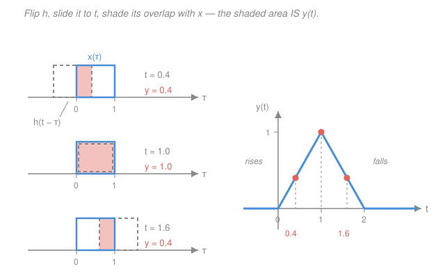

# Signals & Systems · Lesson 1.4: Convolution in continuous time

> ⏱ ~15 min · Module 1: Signals and LTI systems · Builds on: [1.2 The elementary signals](01-02-elementary-signals.md), [1.3 Systems and their properties](01-03-systems-and-properties.md) · Unlocks: [1.5 Convolution in discrete time](01-05-convolution-discrete-time.md), [2.1 Eigenfunctions and the frequency response](02-01-eigenfunctions-frequency-response.md)

## Why this matters

This is the keystone. Everything before it was vocabulary; everything after it is a change of coordinates on the result you're about to derive.

Here is the claim, and it should sound too good to be true. Take a system you know nothing about except that it is linear and time-invariant. Tap it once — one infinitely short, unit-area kick — and record what comes out. That single recorded waveform now lets you predict the system's output for **every** input it will ever see, forever. You never need the differential equation, the circuit diagram, or the mass and spring constants. An LTI system *is* its impulse response.

The operation that turns "input plus impulse response" into "output" is **convolution**, and it is the reason an RC circuit rounds off a square pulse ([`circuits` 3.2](../../circuits/lessons/03-02-first-order-rc-rl-transients.md)), a room adds reverb, a camera lens blurs a point of light into a smudge, and a moving average smooths a noisy price series. Same integral every time.

## The idea

In [1.2](01-02-elementary-signals.md) you learned to *dismantle* a signal: the sifting property says any $x(t)$ is a continuous stack of impulses, one at each instant $\tau$, each weighted by the value $x(\tau)$.

Now push that stack through a system, and use the two properties from [1.3](01-03-systems-and-properties.md):

- **Time-invariance** says the system doesn't own a clock. If the kick at $t=0$ produces a wiggle $h(t)$, then a kick at $t=\tau$ produces *the same wiggle, arriving $\tau$ seconds later*: $h(t-\tau)$.
- **Linearity** says the system never mixes its responses. Each impulse in the stack gets its own private copy of $h$, scaled by that impulse's weight, and the copies simply pile up.

So the output is a **superposition of shifted, scaled copies of $h$** — one copy launched at every instant, its size set by the input at that instant. That pile-up is convolution. Intuitively: *the input is a schedule of when to fire the system, and $h$ is what one firing looks like.* The output is the input **smeared** by the shape of $h$. A sharp input through a sluggish system (long, slow $h$) comes out blurred; through a fast system (short, spiky $h$) it comes out nearly unchanged.

## The formal version

**Setup.** Let $T\{\cdot\}$ denote an LTI system: it maps an input signal to an output signal. Define its **impulse response**

$$h(t) \;\equiv\; T\{\delta(t)\},$$

the output when the input is the unit impulse. *In words: $h$ is what the system does when you tap it once at $t=0$.*

**Derivation.** Start from the sifting decomposition of the input ([1.2](01-02-elementary-signals.md)), where $\tau$ is a dummy time variable:

$$x(t) = \int_{-\infty}^{\infty} x(\tau)\,\delta(t-\tau)\,d\tau.$$

Apply the system to both sides, $y = T\{x\}$. The integral is a (continuous) weighted sum of the signals $\delta(t-\tau)$, with weights $x(\tau)$ that are *constants* as far as the system is concerned — they don't depend on $t$. **Linearity** therefore lets $T$ pass through the integral sign and past the weights:

$$y(t) = T\Big\{\int_{-\infty}^{\infty} x(\tau)\,\delta(t-\tau)\,d\tau\Big\} = \int_{-\infty}^{\infty} x(\tau)\,T\{\delta(t-\tau)\}\,d\tau.$$

Now **time-invariance**: since $T\{\delta(t)\} = h(t)$, a shifted input gives an equally shifted output, $T\{\delta(t-\tau)\} = h(t-\tau)$. Substituting:

$$\boxed{\;y(t) = (x*h)(t) = \int_{-\infty}^{\infty} x(\tau)\,h(t-\tau)\,d\tau\;}$$

*In words: to get the output at time $t$, weight every past and future input value $x(\tau)$ by how much the system still remembers a kick delivered $t-\tau$ seconds ago, and add it all up.*

The punchline, stated loudly: **two numbers' worth of information about a system — "it's linear" and "it doesn't age" — collapse it completely into one function $h$.** Knowing $h$ is knowing everything.

**Mechanics: flip, shift, multiply, integrate.** Read $h(t-\tau)$ as a function of the integration variable $\tau$, with $t$ frozen:

1. **Flip.** $h(-\tau)$ is $h$ reversed in time.
2. **Shift.** $h(t-\tau) = h(-(\tau - t))$ is that reversal slid right by $t$. Bigger $t$ pushes it further right.
3. **Multiply.** Form the product $x(\tau)\,h(t-\tau)$ — nonzero only where the two overlap.
4. **Integrate.** The area under that product is the single number $y(t)$. Slide $t$ and repeat to trace out the whole output.

**Limits of integration — the part people actually get wrong.** The $-\infty$ to $\infty$ limits are honest but useless. The integrand is nonzero *only on the overlap of the two supports*, so the real work is:

$$\text{limits} = \big\{\,\tau : x(\tau) \neq 0\,\big\} \;\cap\; \big\{\,\tau : h(t-\tau) \neq 0\,\big\}.$$

That intersection **changes as $t$ moves**, which is why convolution answers are piecewise. Get in the habit of writing down both support conditions as inequalities in $\tau$ before integrating anything.

**Algebraic properties.** All three follow from the integral by a change of variables or by swapping the order of integration:

- **Commutative:** $x*h = h*x$. (Substitute $\sigma = t-\tau$; the integral turns into $\int h(\sigma)x(t-\sigma)\,d\sigma$.) *In words: it makes no difference which signal you flip* — so **flip whichever one is simpler**, usually the one that's a plain box or a step.
- **Associative:** $(x*h_1)*h_2 = x*(h_1*h_2)$. *In words: a **cascade** of two LTI systems is one LTI system with $h = h_1 * h_2$* — and since convolution commutes, the order of the two boxes doesn't change the overall behavior.
- **Distributive:** $x*(h_1+h_2) = x*h_1 + x*h_2$. *In words: two systems wired in **parallel** with their outputs summed have $h = h_1 + h_2$.*
- **Identity:** $x*\delta = x$, and $x*\delta(t-T) = x(t-T)$. *In words: convolving with a shifted impulse is a pure delay* — a perfect echo unit.
- **Duration adds:** if $x$ lasts $T_1$ seconds and $h$ lasts $T_2$, then $y$ lasts $T_1+T_2$. Convolution always spreads.

**Reading properties straight off $h$.** The classifications from [1.3](01-03-systems-and-properties.md) become one-line tests:

- **Causality** $\iff h(t) = 0$ for $t<0$. *In words: the system cannot start responding before it is kicked.* (Then the upper limit collapses to $\tau \le t$: only the past contributes.)
- **BIBO stability** $\iff \displaystyle\int_{-\infty}^{\infty} |h(t)|\,dt < \infty$; $h$ is called *absolutely integrable*. *In words: the total amount of "ring" from one kick must be finite.* Sufficiency is one line — if $|x| \le M$ everywhere then
  $$|y(t)| = \Big|\int h(\tau)x(t-\tau)d\tau\Big| \le M\int|h(\tau)|\,d\tau,$$
  which is finite. Necessity runs the other way: feed the bounded input $x(t) = \operatorname{sgn}\big(h(-t)\big)$, which never exceeds 1 in size; then $y(0) = \int |h(\tau)|\,d\tau$ exactly, so a divergent integral means an unbounded output.

**Step response.** Put $x = u$, the unit step, and use commutativity (flip $u$, since it's simpler):

$$s(t) \;\equiv\; (u*h)(t) = \int_{-\infty}^{\infty} h(\tau)\,u(t-\tau)\,d\tau = \int_{-\infty}^{t} h(\tau)\,d\tau,$$

because $u(t-\tau)=1$ exactly when $\tau \le t$. *In words: the step response is the running integral of the impulse response.* Differentiating,

$$h(t) = \frac{ds}{dt}.$$

That's the practical route to $h$ in a lab: you can't generate a true impulse, but you can flip a switch and record $s(t)$, then differentiate.

## Picture

Both signals here are unit-height boxes on $[0,1]$ — the case worked in Example 2. At $t=0.4$ the flipped $h$ has slid only partway on and the overlap has width $0.4$; at $t=1$ the two boxes coincide and the overlap is maximal; at $t=1.6$ the flipped $h$ is sliding off the far end and the overlap has shrunk to $0.4$ again. Each shaded area is *one point* on the triangle at right.

## Worked examples

**Example 1 (the canonical one: step into a first-order system).** Let $x(t) = u(t)$ and $h(t) = e^{-at}u(t)$ with $a>0$ — this $h$ is exactly the RC lowpass of [`circuits` 3.2](../../circuits/lessons/03-02-first-order-rc-rl-transients.md), with $a = 1/RC$. Then

$$y(t) = \int_{-\infty}^{\infty} u(\tau)\,e^{-a(t-\tau)}u(t-\tau)\,d\tau.$$

Write down the two support conditions:

- $u(\tau) \neq 0 \implies \tau \ge 0$,
- $u(t-\tau) \neq 0 \implies t-\tau \ge 0 \implies \tau \le t$.

So the integrand lives on $0 \le \tau \le t$. **If $t<0$ that interval is empty and $y(t)=0$** — this is where the limits come from, and it is the whole difficulty of the problem. For $t \ge 0$, pull $e^{-at}$ (a constant in $\tau$) out front:

$$y(t) = \int_{0}^{t} e^{-a(t-\tau)}\,d\tau = e^{-at}\int_0^t e^{a\tau}\,d\tau = e^{-at}\cdot\frac{e^{at}-1}{a} = \frac{1}{a}\left(1-e^{-at}\right).$$

$$\boxed{\;y(t) = \frac{1}{a}\left(1-e^{-at}\right)u(t)\;}$$

*Check.* Differentiate back: for $t>0$, $y' = e^{-at}$, so $y' + ay = e^{-at} + (1-e^{-at}) = 1 = x(t)$ ✓ — the system really is $y'+ay=x$. Limits: $y(0)=0$ (nothing has accumulated yet) and $y(\infty) = 1/a = \int_0^\infty h$, the DC gain ✓. Since $x=u$, this $y$ *is* the step response $s(t)$, and indeed $ds/dt = e^{-at} = h(t)$ for $t>0$ ✓.

**Example 2 (two boxes → a triangle, with full case analysis).** Let both signals be the unit box: $x(t) = h(t) = 1$ for $0 \le t \le 1$, zero elsewhere. Support conditions in $\tau$:

- $x(\tau)\neq 0 \implies 0 \le \tau \le 1$,
- $h(t-\tau)\neq 0 \implies 0 \le t-\tau \le 1 \implies t-1 \le \tau \le t$.

So the integrand is 1 on the intersection $[0,1] \cap [t-1,\,t]$ and 0 elsewhere, and $y(t)$ is just the **length of that intersection**. Sliding $t$ from $-\infty$ to $\infty$, the intersection passes through four regimes:

| region | intersection $[0,1]\cap[t-1,t]$ | $y(t)$ |
|---|---|---|
| $t < 0$ | empty (flipped $h$ entirely left of $x$) | $0$ |
| $0 \le t < 1$ | $[0,\,t]$ — sliding *on* | $\displaystyle\int_0^t 1\,d\tau = t$ |
| $1 \le t < 2$ | $[t-1,\,1]$ — sliding *off* | $\displaystyle\int_{t-1}^{1} 1\,d\tau = 2-t$ |
| $t \ge 2$ | empty (flipped $h$ entirely right of $x$) | $0$ |

Notice the boundary at $t=1$: that's the moment the *leading* edge of the flipped $h$ passes the right end of $x$, so the binding limit switches from "$t$" to "$1$". **Every case boundary in a convolution is an edge crossing an edge.** The result is a triangle of height 1 on $[0,2]$.

*Check.* Continuity at $t=1$: $t \to 1$ and $2-t \to 1$ ✓. Duration $= 1+1 = 2$ ✓ (durations add). Total area: $\int y = \tfrac12 \cdot 2 \cdot 1 = 1$, which must equal $\big(\int x\big)\big(\int h\big) = 1 \cdot 1$ ✓ — a check worth remembering, and one you'll prove in general as the $\omega = 0$ case of the convolution theorem in [`fourier-analysis` 2.3](../../fourier-analysis/lessons/02-03-convolution-theorem.md).

## Watch out

- **You might think the flip is optional bookkeeping.** It isn't — $h(t-\tau)$ genuinely runs *backwards* in $\tau$. The reason is causal common sense: at time $t$, the input from long ago ($\tau$ small) is being multiplied by the *late, faded* part of $h$, while the input that just arrived ($\tau \approx t$) meets $h(0)$, the fresh part. Reversal encodes "older input, older memory." Correlation — the same integral *without* the flip — is a different operation entirely.
- **You might integrate from $-\infty$ to $\infty$ (or reflexively from $0$ to $t$) and skip the case analysis.** That's the single biggest source of wrong answers. The limits are the intersection of two supports and they *change with $t$*; a convolution of two finite-duration signals essentially always has three or more regions. Write both inequalities in $\tau$ first, every time.
- **You might let $t$ leak into the integrand as a variable.** Inside the integral, $t$ is a frozen constant and $\tau$ is the only variable — which is exactly why $e^{-at}$ could be pulled outside in Example 1. If you ever find yourself writing $d t$ inside a convolution integral, something has gone wrong.
- **You might read "$h$ decays to zero" as "stable."** Decay is necessary but not sufficient: $h(t) = \frac{1}{t+1}u(t)$ decays to 0 yet $\int_0^\infty \frac{dt}{t+1}$ diverges, so the system is *not* BIBO stable. The test is on the area of $|h|$, not on the limit of $h$.

## One-liner

> Linearity plus time-invariance means every input is a stack of impulses and every output is a stack of shifted, scaled copies of $h$ — so $y = x*h$, and the only hard part is figuring out where the two supports overlap.

## Problems

**P1 (🟢)** A continuous-time LTI system has impulse response $h(t) = e^{-3t}u(t)$. (a) Is it causal? (b) Is it BIBO stable? Justify both directly from $h$. (c) Find its step response $s(t)$, and verify $h = ds/dt$.

**P2 (🟡)** Compute $y = x*h$ in full, with explicit case analysis, for the rectangular pulse $x(t) = u(t) - u(t-2)$ (height 1, on $0\le t\le 2$) and $h(t) = e^{-t}u(t)$.

**P3 (🔴)** Two identical LTI systems, each with impulse response $h_1(t) = h_2(t) = e^{-t}u(t)$, are connected in **cascade** (the output of the first feeds the second). (a) Find the overall impulse response $h(t)$. (b) Is the cascade BIBO stable? (c) In one sentence, why is $h(0)=0$ for the cascade even though $h_1(0)=1$?

Solutions

**P1**

**(a) Causal.** $h(t) = e^{-3t}u(t)$ contains the factor $u(t)$, so $h(t)=0$ for all $t<0$. The system produces no output before the kick arrives. ✓

**(b) BIBO stable.** Test absolute integrability. Since $h \ge 0$, $|h| = h$:

$$\int_{-\infty}^{\infty}|h(t)|\,dt = \int_0^{\infty} e^{-3t}\,dt = \left[-\tfrac13 e^{-3t}\right]_0^{\infty} = 0 - \left(-\tfrac13\right) = \tfrac13 < \infty.$$

The area is finite, so the system is BIBO stable. ✓

**(c) Step response.** Using $s(t) = \int_{-\infty}^{t} h(\tau)\,d\tau$: for $t<0$ the integrand is identically 0, so $s(t)=0$. For $t \ge 0$,

$$s(t) = \int_0^t e^{-3\tau}\,d\tau = \left[-\tfrac13 e^{-3\tau}\right]_0^t = \tfrac13\left(1-e^{-3t}\right),$$

so $s(t) = \tfrac13\left(1-e^{-3t}\right)u(t)$.

*Verify.* For $t>0$, $\dfrac{ds}{dt} = \tfrac13 \cdot 3e^{-3t} = e^{-3t} = h(t)$ ✓. Sanity: $s(0)=0$ and $s(\infty) = \tfrac13$, matching the DC gain $\int_0^\infty h = \tfrac13$ from part (b) ✓.

**P2** Flip $h$ (it's the simpler support to track here) and use $y(t) = \int x(\tau)h(t-\tau)\,d\tau$. Support conditions in $\tau$:

- $x(\tau) \neq 0 \implies 0 \le \tau \le 2$;
- $h(t-\tau) \neq 0 \implies t-\tau \ge 0 \implies \tau \le t$.

Intersection: $[0,2] \cap (-\infty,\,t]$. Three regions:

**Region 1, $t<0$:** intersection empty ⟹ $y(t)=0$.

**Region 2, $0 \le t < 2$** (flipped $h$ sliding onto the pulse): limits $0$ to $t$.

$$y(t) = \int_0^t 1\cdot e^{-(t-\tau)}\,d\tau = e^{-t}\int_0^t e^{\tau}\,d\tau = e^{-t}\left(e^{t}-1\right) = 1-e^{-t}.$$

**Region 3, $t \ge 2$** (the whole pulse is now in the past; upper limit pinned at the pulse's right edge): limits $0$ to $2$.

$$y(t) = \int_0^2 e^{-(t-\tau)}\,d\tau = e^{-t}\int_0^2 e^{\tau}\,d\tau = e^{-t}\left(e^{2}-1\right).$$

Collecting,

$$y(t) = \begin{cases} 0, & t<0,\\[2pt] 1-e^{-t}, & 0 \le t < 2,\\[2pt] \left(e^{2}-1\right)e^{-t}, & t \ge 2.\end{cases}$$

*Checks.* Continuity at $t=2$: from below $1-e^{-2} \approx 0.865$; from above $(e^2-1)e^{-2} = 1-e^{-2}$ ✓. Alternative derivation by linearity: $x = u(t)-u(t-2)$, so $y = s(t)-s(t-2)$ with $s(t) = (1-e^{-t})u(t)$ from Example 1 at $a=1$. For $t\ge2$ that gives $(1-e^{-t}) - (1-e^{-(t-2)}) = e^{-(t-2)}-e^{-t} = e^{-t}(e^2-1)$ ✓. Behavior: the output charges up toward 1 while the pulse is on, then decays exponentially once it switches off — exactly an RC circuit's response to a rectangular pulse.

**P3**

**(a)** By associativity, the cascade is a single LTI system with $h = h_1 * h_2$:

$$h(t) = \int_{-\infty}^{\infty} e^{-\tau}u(\tau)\,e^{-(t-\tau)}u(t-\tau)\,d\tau.$$

Supports: $\tau \ge 0$ and $\tau \le t$, so the integral runs $0$ to $t$ and vanishes for $t<0$. For $t\ge 0$ the exponentials combine to a constant in $\tau$:

$$h(t) = \int_0^t e^{-\tau}e^{-(t-\tau)}\,d\tau = \int_0^t e^{-t}\,d\tau = e^{-t}\int_0^t d\tau = t\,e^{-t}.$$

$$h(t) = t\,e^{-t}u(t).$$

**(b) Stable.** $h \ge 0$, so integrate by parts (or use $\int_0^\infty t^n e^{-t}dt = n!$ with $n=1$):

$$\int_0^{\infty} t e^{-t}\,dt = \left[-t e^{-t}\right]_0^{\infty} + \int_0^{\infty} e^{-t}\,dt = 0 + 1 = 1 < \infty.$$

The area is finite, so the cascade is BIBO stable. ✓

(Also expected: the DC gain of the cascade should be the product of the two DC gains, $1 \times 1 = 1$ ✓.)

**(c)** At $t=0^+$ the first system has only just begun to respond, so the second system has received essentially no input yet — it takes a finite amount of accumulated input to move a system with memory. Formally the overlap interval $[0,t]$ has zero length at $t=0$, so the integral is 0. This is the general lesson that convolution *smooths*: the sharp jump of $h_1$ at the origin has been rounded off, and the peak has been delayed (to $t=1$, where $h'=0$).

## Flashback

**From Lesson 1.2 (The elementary signals):** Evaluate each integral using the sifting property. (a) $\displaystyle\int_{-\infty}^{\infty}\left(t^2+3t\right)\delta(t-2)\,dt$. (b) $\displaystyle\int_{-\infty}^{\infty} e^{-t}\cos(\pi t)\,u(t)\,\delta(t+1)\,dt$.

Solution

**(a)** Sifting says $\int g(t)\delta(t-t_0)\,dt = g(t_0)$ — the impulse picks out the value of the smooth factor at its location. Here $t_0 = 2$ and $g(t) = t^2+3t$:

$$\int_{-\infty}^{\infty}\left(t^2+3t\right)\delta(t-2)\,dt = g(2) = 4 + 6 = 10.$$

**(b)** The impulse sits at $t_0 = -1$ (note the sign: $\delta(t+1) = \delta(t-(-1))$). The smooth factor is $g(t) = e^{-t}\cos(\pi t)u(t)$, so

$$g(-1) = e^{1}\cos(-\pi)\,u(-1) = e \cdot (-1) \cdot 0 = 0.$$

The answer is **0** — the step $u$ has switched *off* at the impulse's location, so there is nothing there to sift. The trap is grabbing $e^{1}\cos(\pi) = -e$ and forgetting to evaluate $u$ too.

*Check.* In (a), sanity-test the sign convention on a simpler case: $\int \delta(t-2)\,dt = 1$, and scaling $g$ by a constant scales the result, both consistent ✓.

## Connections

- **Backward:** this lesson is nothing but [1.2](01-02-elementary-signals.md)'s sifting decomposition pushed through [1.3](01-03-systems-and-properties.md)'s two structural properties. Linearity is what let $T$ move inside the integral; time-invariance is what turned $T\{\delta(t-\tau)\}$ into $h(t-\tau)$. Drop either one and no such formula exists. The convolution integral is also the same object as the particular solution built in [`ode-refresher` 2.4](../../ode-refresher/lessons/02-04-variation-of-parameters.md) — variation of parameters, read as "input convolved with the system's Green's function."
- **Forward:** [1.5](01-05-convolution-discrete-time.md) redoes all of this with sums instead of integrals, where "flip and slide" becomes something you can literally do on a strip of paper. Then [2.1](02-01-eigenfunctions-frequency-response.md) delivers the payoff: feed $e^{st}$ into $y = x*h$ and it comes out *unchanged in shape*, merely scaled by $H(s) = \int h(t)e^{-st}dt$. Complex exponentials are the eigenfunctions of every LTI system, and $h$ turns into a frequency response.
- **Sideways:** that payoff is the **convolution theorem** — convolution in time is multiplication in frequency — proved in [`fourier-analysis` 2.3](../../fourier-analysis/lessons/02-03-convolution-theorem.md). It is why nobody computes a long convolution by hand: transform, multiply, transform back. The two-boxes-make-a-triangle result of Example 2 is the time-domain twin of the fact that a $\operatorname{sinc}$ squared is the transform of a triangle.
