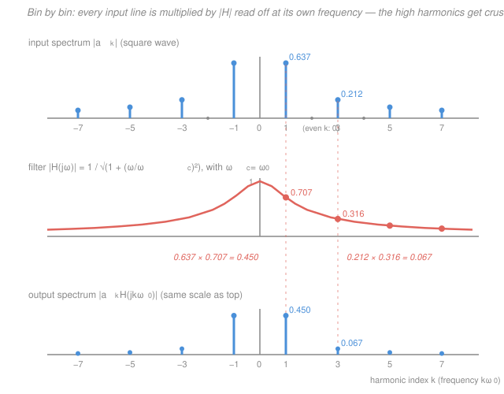

# Signals & Systems · Lesson 2.2: Fourier series for periodic signals

> ⏱ ~15 min · Module 2: Frequency-domain analysis — Fourier and Laplace · Builds on: [2.1 Eigenfunctions and the frequency response](02-01-eigenfunctions-frequency-response.md), [`fourier-analysis` 1.1](../../fourier-analysis/lessons/01-01-periodic-functions-fourier-coefficients.md) · Unlocks: 2.3 (the continuous-time Fourier transform)

## Why this matters

You already know how to find Fourier coefficients — that was [`fourier-analysis` Module 1](../../fourier-analysis/lessons/01-01-periodic-functions-fourier-coefficients.md). What you have *not* seen is the reason an engineer bothers. In [2.1](02-01-eigenfunctions-frequency-response.md) you proved that a complex exponential passes through an LTI system unchanged in shape, merely scaled by $H(j\omega)$. Fourier series says any periodic signal **is** a stack of complex exponentials. Put those two facts together and something remarkable happens: to push a square wave through a filter you do not convolve, do not solve a differential equation, do not integrate anything. You multiply a list of numbers, one harmonic at a time. That is the single most-used computation in audio, power electronics, and communications, and it is what this lesson is for.

## The idea

A periodic signal repeats every $T$ seconds. That rigid repetition is a severe constraint, and it pays a dividend: the only sinusoids that can live inside a $T$-periodic signal are the ones that themselves fit a whole number of cycles into $T$. Frequencies in between would drift out of step and break the repetition. So the signal's frequency content is not a smear — it is a **discrete set of spikes**, at the fundamental $\omega_0=2\pi/T$ and its integer multiples. Draw those spike heights against frequency and you get a **line spectrum**: a picket fence, one picket per harmonic. That picture *is* the signal, in a different coordinate system.

Now the payoff. An LTI system does not mix frequencies — that is what linearity plus time-invariance buys you. Feed it $e^{j\omega t}$ and you get back the *same* frequency, resized by the complex number $H(j\omega)$. So when you feed it a picket fence, each picket is handled **independently**: the system walks along the fence and rescales every picket by the value of $|H|$ *at that picket's own frequency*, rotating its phase by $\angle H$ there. Nothing moves sideways. The output is the same fence with different heights.

That reframes filtering as something almost clerical. A low-pass filter is a rule that says "leave the short-frequency pickets alone, shrink the tall-frequency ones." Point it at a square wave — whose sharp corners are built entirely out of high harmonics — and watch the corners melt.

## The formal version

**The synthesis and analysis pair.** Let $x(t)$ be periodic with fundamental period $T$ (seconds) and fundamental angular frequency $\omega_0 = 2\pi/T$ (rad/s). Then

$$\boxed{\;x(t)=\sum_{k=-\infty}^{\infty}a_k\,e^{jk\omega_0 t},\qquad a_k=\frac{1}{T}\int_{T}x(t)\,e^{-jk\omega_0 t}\,dt\;}$$

where $\int_T$ means over any one full period, and $a_k$ is the (complex) **Fourier series coefficient** of the $k$-th harmonic. *In words: build the signal by stacking pure rotating exponentials at multiples of $\omega_0$; find how much of each is present by correlating the signal against that exponential and averaging over a period.* This is [`fourier-analysis` 1.1](../../fourier-analysis/lessons/01-01-periodic-functions-fourier-coefficients.md)'s complex form with the period restored ($x \mapsto 2\pi t/T$) and $i$ renamed $j$; the orthogonality argument that produces the $a_k$ formula is derived there and not repeated here.

Two facts to keep at your fingertips:

- $a_0=\frac1T\int_T x\,dt$ is the **average (DC) value** — the $k=0$ "harmonic" is a constant.
- If $x(t)$ is **real**, then $a_{-k}=a_k^*$ (**conjugate symmetry**). So $|a_{-k}|=|a_k|$: the magnitude spectrum is mirror-symmetric about $\omega=0$, and negative-frequency lines carry no new information — they are the bookkeeping that lets two counter-rotating exponentials add up to a real cosine.

**Bridge to the real form.** If you learned Fourier series as $x(t)=\tfrac{A_0}{2}+\sum_{k\ge1}\big(A_k\cos k\omega_0 t+B_k\sin k\omega_0 t\big)$, conjugate symmetry collapses the pair $\{a_k,a_{-k}\}$ into one real cosine:

$$x(t)=a_0+2\sum_{k=1}^{\infty}|a_k|\cos\!\big(k\omega_0 t+\angle a_k\big),\qquad\text{i.e.}\quad A_k=2\,\mathrm{Re}\,a_k,\quad B_k=-2\,\mathrm{Im}\,a_k .$$

*In words: the $k$-th harmonic is one cosine of amplitude $2|a_k|$ and phase $\angle a_k$; the complex form just splits it into two half-height counter-rotating pieces.*

**Harmonics and the line spectrum.** The frequency $k\omega_0$ is the **$k$-th harmonic** ($k=1$ the fundamental, $k=2$ the second harmonic, and so on). Plotting $|a_k|$ versus $k\omega_0$ gives the **magnitude line spectrum** — nonzero only at isolated multiples of $\omega_0$, zero everywhere between. Plotting $\angle a_k$ gives the phase spectrum. A periodic signal's spectrum is *discrete*, period and spacing locked together: the longer the period, the closer the lines. Push $T\to\infty$ (one lone pulse, never repeating) and the lines crowd together into a continuum — that limit is the Fourier transform, and it is exactly how [2.3](02-03-continuous-time-fourier-transform.md) opens.

**Parseval — where the power sits.** For a periodic signal, average power (watts, if $x$ is a voltage across 1 ohm) is

$$P=\frac1T\int_T|x(t)|^2\,dt=\sum_{k=-\infty}^{\infty}|a_k|^2 .$$

*In words: total average power equals the sum of the powers of the individual harmonics — no cross-terms, because distinct harmonics are orthogonal.* This is [`fourier-analysis` 1.4](../../fourier-analysis/lessons/01-04-mean-square-parseval.md)'s Parseval identity in power units. It is what a spectrum analyzer displays, and it lets you answer "how much of this signal actually matters?" by adding up $|a_k|^2$ until you have most of it.

**The payoff: term-by-term filtering.** Suppose $x(t)$ periodic drives an LTI system with frequency response $H(j\omega)$ ([2.1](02-01-eigenfunctions-frequency-response.md)). Because $e^{jk\omega_0 t}$ is an eigenfunction — the system returns $H(jk\omega_0)e^{jk\omega_0 t}$ — linearity lets you handle the sum one term at a time:

$$\boxed{\;y(t)=\sum_{k=-\infty}^{\infty}a_k\,H(jk\omega_0)\,e^{jk\omega_0 t}\;}\qquad\text{i.e.}\quad b_k=a_k\,H(jk\omega_0).$$

*In words: the output is periodic with the same period, and its $k$-th coefficient is the input's $k$-th coefficient times the frequency response evaluated at that harmonic's own frequency.* No convolution integral appears anywhere. Three consequences worth naming:

1. **The output is periodic with the same $T$.** An LTI system can never invent a new frequency, so it cannot change the period. (Distortion that adds harmonics — a guitar overdrive pedal — is exactly a *non*linear system.)
2. **Magnitude and phase act separately:** $|b_k|=|a_k|\,|H(jk\omega_0)|$ and $\angle b_k=\angle a_k+\angle H(jk\omega_0)$. Amplitudes multiply; phases add.
3. **You only ever need $H$ at a countable set of points** — the harmonic frequencies. Everything in between is irrelevant for this input.

## Picture

Read it top to bottom as a multiplication. The top fence is the square wave's $|a_k|$. The middle curve is $|H(j\omega)|$, a continuous function of frequency — but only its values *at the pickets* are ever used. The bottom fence is the product, picket by picket. The fundamental loses a factor $0.707$; the third harmonic loses $0.316$; the seventh loses $0.141$. The fence does not just shrink, it **tilts** — and that tilt is the filtering.

## Worked examples

**Example 1 (the square wave's coefficients).** Let $x(t)$ be the odd square wave of period $T$: $x(t)=+1$ for $0<t<T/2$ and $x(t)=-1$ for $T/2<t<T$. Its average is zero, so $a_0=0$. For $k\neq0$, with $\omega_0 T=2\pi$ (so $\omega_0 T/2=\pi$):

$$a_k=\frac1T\left[\int_0^{T/2}e^{-jk\omega_0 t}dt-\int_{T/2}^{T}e^{-jk\omega_0 t}dt\right]
=\frac{1}{T}\cdot\frac{\big(e^{-jk\pi}-1\big)-\big(1-e^{-jk\pi}\big)}{-jk\omega_0}
=\frac{2\big((-1)^k-1\big)}{-jk\omega_0 T}.$$

Now split on parity. If $k$ is **even**, $(-1)^k-1=0$: the coefficient vanishes. If $k$ is **odd**, $(-1)^k-1=-2$, and $\omega_0T=2\pi$, so

$$a_k=\frac{-4}{-jk\,2\pi}=\frac{2}{j\pi k}=-\,\frac{2j}{\pi k},\qquad |a_k|=\frac{2}{\pi|k|},\quad \angle a_k=-90^\circ\ (k>0).$$

$$\boxed{\;a_k=\begin{cases}-\dfrac{2j}{\pi k}, & k \text{ odd}\\[4pt] 0,& k\text{ even}\end{cases}}$$

**Only odd harmonics survive, and their size falls off like $1/|k|$.** (The even ones die because the square wave has half-wave symmetry: $x(t+T/2)=-x(t)$.) Sanity checks: $a_{-k}=+2j/(\pi k)=a_k^*$ ✓ (real signal). And combining the $\pm k$ pair, $a_ke^{jk\omega_0t}+a_{-k}e^{-jk\omega_0t}=-\tfrac{2j}{\pi k}\big(e^{jk\omega_0t}-e^{-jk\omega_0t}\big)=\tfrac{4}{\pi k}\sin k\omega_0 t$, giving the familiar

$$x(t)=\frac{4}{\pi}\left[\sin\omega_0 t+\tfrac13\sin3\omega_0t+\tfrac15\sin5\omega_0t+\cdots\right].\;✓$$

*Power bookkeeping.* Since $|x|=1$ everywhere, $P=1$. Parseval must agree: $\sum_k|a_k|^2=2\sum_{k\ \mathrm{odd}>0}\big(\tfrac{2}{\pi k}\big)^2=\tfrac{8}{\pi^2}\sum_{k\ \mathrm{odd}}\tfrac1{k^2}=\tfrac{8}{\pi^2}\cdot\tfrac{\pi^2}{8}=1$ ✓ (using $\sum_{k\ \mathrm{odd}}1/k^2=\pi^2/8$ from [`fourier-analysis` 1.4](../../fourier-analysis/lessons/01-04-mean-square-parseval.md)). Numerically the fundamental alone holds $8/\pi^2=81.1\%$ of the power, and harmonics $1,3,5,7$ together hold $95.0\%$. A square wave is, energetically, mostly a sine wave with a garnish.

That garnish is what makes the corners. Truncating the series at some finite $k$ gives an overshooting ripple near each jump that refuses to shrink — the Gibbs phenomenon, dissected in [`fourier-analysis` 1.3](../../fourier-analysis/lessons/01-03-convergence-pointwise-uniform-gibbs.md).

**Example 2 (why you'd care — a square wave through an RC low-pass).** Take a 1 kHz square wave: $T=1$ ms, $f_0 = 1$ kHz, $\omega_0=2\pi(1000)\approx6283$ rad/s. Drive an RC low-pass filter with

$$H(j\omega)=\frac{1}{1+j\omega/\omega_c},\qquad |H(j\omega)|=\frac{1}{\sqrt{1+(\omega/\omega_c)^2}},\qquad \angle H(j\omega)=-\arctan(\omega/\omega_c),$$

with cutoff placed right at the fundamental, $\omega_c=\omega_0$ (so $RC=1/\omega_c\approx159\ \mu\mathrm{s}$ — say $R=1.59$ k$\Omega$, $C=100$ nF; this is [`circuits` 4.2](../../circuits/lessons/04-02-impedance-phasor-analysis.md)'s voltage divider between $R$ and $1/j\omega C$). Then $|H(jk\omega_0)|=1/\sqrt{1+k^2}$, and the whole computation is a table:

| $k$ | $\lvert a_k\rvert=\frac{2}{\pi k}$ | $\lvert H(jk\omega_0)\rvert$ | $\lvert b_k\rvert$ | $\angle H$ |
|---|---|---|---|---|
| 1 | 0.6366 | $1/\sqrt2=0.7071$ | 0.4502 | $-45.0^\circ$ |
| 3 | 0.2122 | $1/\sqrt{10}=0.3162$ | 0.0671 | $-71.6^\circ$ |
| 5 | 0.1273 | $1/\sqrt{26}=0.1961$ | 0.0250 | $-78.7^\circ$ |
| 7 | 0.0909 | $1/\sqrt{50}=0.1414$ | 0.0129 | $-81.9^\circ$ |

Doubling the pairs into real cosines, $y(t)=\sum_{k\ \mathrm{odd}>0}\tfrac{4}{\pi k}|H(jk\omega_0)|\sin\!\big(k\omega_0 t+\angle H(jk\omega_0)\big)$:

$$y(t)\approx 0.900\sin(\omega_0t-45^\circ)+0.134\sin(3\omega_0t-71.6^\circ)+0.050\sin(5\omega_0t-78.7^\circ)+\cdots$$

**What got crushed.** In the input, the third harmonic stood at $1/3$ of the fundamental. In the output it stands at $0.0671/0.4502=0.149$ — under a *sixth*. The fifth fell from $0.200$ to $0.055$. The output is $97\%$ fundamental by power (total output power $\approx0.416$ W versus $1$ W in), so on a scope the square wave comes out looking like a slightly lopsided sine.

**Why the corners round.** For $k\gg1$, $|H(jk\omega_0)|\approx\omega_c/(k\omega_0)=1/k$, so the output coefficients decay like $\tfrac{2}{\pi k}\cdot\tfrac1k \sim 1/k^2$ instead of $1/k$. That exponent is not cosmetic: [`fourier-analysis` 1.4](../../fourier-analysis/lessons/01-04-mean-square-parseval.md) established that $1/k$ decay is the signature of a **jump** while $1/k^2$ decay is the signature of a **continuous function with a kink**. The filter has literally converted a discontinuity into a continuous ramp — the visible rounding of the edges on the oscilloscope is that change of exponent. Sharp corners *are* high harmonics; remove them and there is no corner left to draw.

## Watch out

- **You might think you evaluate $H$ at "the frequency of the signal."** A periodic signal has no single frequency. You evaluate $H$ separately at *every* harmonic $k\omega_0$, and each one gets its own gain and its own phase shift. Reusing $H(j\omega_0)$ for all of them is the single most common error here.
- **You might ignore the phase and wonder why the shape is wrong.** Magnitudes alone do not determine a waveform. In Example 2 each harmonic is delayed by a *different* angle ($-45^\circ$, $-71.6^\circ$, $-78.7^\circ$, …), which slides the harmonics relative to one another and skews the shape. A filter with $\angle H$ proportional to $\omega$ (linear phase) delays everything equally and preserves shape; the RC filter does not.
- **You might read a line spectrum as if it were continuous.** There is genuinely *nothing* at $1.5\omega_0$ — not "a small amount," but zero. Only when the signal stops being periodic does the spectrum fill in ([2.3](02-03-continuous-time-fourier-transform.md)).
- **You might expect negative-frequency lines to mean something physical.** They do not, for real signals; $a_{-k}=a_k^*$ makes them redundant mirrors. They exist so that $e^{jk\omega_0t}$ and $e^{-jk\omega_0t}$ can add to a real cosine.

## One-liner

> A periodic signal is a picket fence of harmonics at multiples of $\omega_0$, and an LTI system filters it by rescaling each picket by $H$ at that picket's own frequency: $b_k=a_k H(jk\omega_0)$, no convolution required.

## Problems

**P1 (🟢)** A system has frequency response $H(j\omega)=\dfrac{1}{1+j\omega/100}$. The input is the periodic signal

$$x(t)=2+3\cos(100t)+\cos(300t)\qquad (\omega\text{ in rad/s}).$$

Find the output $y(t)$ in real cosine form.

**P2 (🟡)** For the odd square wave of Example 1, what fraction of the average power is carried by the fundamental alone, and by harmonics $k=\pm1,\pm3,\pm5$ together? (Use $\sum_{k\ \mathrm{odd}\ge1}1/k^2=\pi^2/8$.) In one sentence, say what your answer implies about how a truncated reconstruction *looks*.

**P3 (🔴)** You want the RC low-pass of Example 2 to suppress a 1 kHz square wave's third harmonic to below $\tfrac18$ of the fundamental *in the output*. (a) Show that no first-order RC filter can push this ratio below $1/9$, no matter how low you set $\omega_c$. (b) Find the $RC$ that achieves exactly $1/8$, and the corresponding cutoff frequency $f_c$ in Hz.

Solutions

**P1** The input's fundamental is $\omega_0=100$ rad/s, and it contains only $k=0$ (DC), $k=1$, and $k=3$. Evaluate $H$ at each harmonic's own frequency.

- $k=0$, $\omega=0$: $H(j0)=1$. The DC term passes untouched: $2$.
- $k=1$, $\omega=100$: $H(j100)=\dfrac{1}{1+j}$, so $|H|=\dfrac{1}{\sqrt2}=0.7071$ and $\angle H=-\arctan(1)=-45^\circ$. The term $3\cos(100t)$ becomes $3(0.7071)\cos(100t-45^\circ)=2.121\cos(100t-45^\circ)$.
- $k=3$, $\omega=300$: $H(j300)=\dfrac{1}{1+3j}$, so $|H|=\dfrac{1}{\sqrt{10}}=0.3162$ and $\angle H=-\arctan(3)=-71.6^\circ$. The term $\cos(300t)$ becomes $0.316\cos(300t-71.6^\circ)$.

$$y(t)=2+2.121\cos(100t-45^\circ)+0.316\cos(300t-71.6^\circ).$$

*Check.* The output is still periodic with $T=2\pi/100$ ✓ (no new frequencies). The higher harmonic was attenuated more than the lower one, and the DC not at all — the ordering $1>0.707>0.316$ is exactly what "low-pass" means ✓. Each harmonic got its *own* phase lag ✓.

**P2** From Example 1, $|a_k|=2/(\pi|k|)$ for odd $k$, and total power $P=1$.

Fundamental (both lines $k=\pm1$):
$$|a_1|^2+|a_{-1}|^2=2\left(\frac{2}{\pi}\right)^2=\frac{8}{\pi^2}=0.8106\quad\Rightarrow\quad \mathbf{81.1\%}.$$

Adding $k=\pm3$ and $k=\pm5$:
$$\frac{8}{\pi^2}\left(1+\frac19+\frac1{25}\right)=0.8106\,(1+0.1111+0.0400)=0.8106\times1.1511=\mathbf{0.9331}\;\Rightarrow\;\mathbf{93.3\%}.$$

*(Consistency: continuing over all odd $k$ gives $\tfrac{8}{\pi^2}\cdot\tfrac{\pi^2}{8}=1$ ✓, matching $P=\tfrac1T\int_T 1\,dt=1$.)*

**Implication.** Three harmonics already capture 93% of the *power*, so a 3-term reconstruction looks broadly right — correct height, correct period, recognizably square. But the missing 7% is entirely high-frequency, and high frequencies are what build corners: the truncated waveform has visibly rounded, ringing edges even though it is energetically almost perfect. Power convergence is fast; shape convergence at the jumps is not (that gap is the Gibbs phenomenon).

**P3** Write $r=\omega_0/\omega_c=\omega_0RC$. In the output, $|b_k|=\dfrac{2}{\pi k}\cdot\dfrac{1}{\sqrt{1+(kr)^2}}$, so the third-to-fundamental ratio is

$$\rho=\frac{|b_3|}{|b_1|}=\frac{1}{3}\cdot\frac{\sqrt{1+r^2}}{\sqrt{1+9r^2}}.$$

The leading $\tfrac13$ is the input's own ratio; the square-root factor is the extra help the filter gives.

**(a)** The factor $\sqrt{\dfrac{1+r^2}{1+9r^2}}$ decreases monotonically in $r$ (numerator grows with coefficient 1, denominator with coefficient 9), and its limit as $r\to\infty$ is $\sqrt{1/9}=1/3$. Hence

$$\rho>\frac13\cdot\frac13=\frac19\approx0.111\quad\text{for every finite }r.$$

*Interpretation:* a first-order filter's magnitude eventually rolls off like $1/\omega$, so at high frequency it can only buy you one extra factor of $3$ between the first and third harmonic — never more. Beating $1/9$ requires a steeper filter (higher order), which is exactly the motivation for [4.4 Filter design basics](04-04-filter-design-basics.md).

**(b)** Set $\rho=1/8$:

$$\frac13\sqrt{\frac{1+r^2}{1+9r^2}}=\frac18\;\Longrightarrow\;\sqrt{\frac{1+r^2}{1+9r^2}}=0.375\;\Longrightarrow\;\frac{1+r^2}{1+9r^2}=0.140625.$$

$$1+r^2=0.140625+1.265625\,r^2\;\Longrightarrow\;0.859375=0.265625\,r^2\;\Longrightarrow\;r^2=3.2353,\;\;r=1.7987.$$

With $\omega_0=2\pi(1000)=6283.2$ rad/s:

$$RC=\frac{r}{\omega_0}=\frac{1.7987}{6283.2}=2.863\times10^{-4}\ \mathrm{s}\approx 286\ \mu\mathrm{s},\qquad f_c=\frac{1}{2\pi RC}=\mathbf{556\ Hz}.$$

*Check.* Direct evaluation: $|H(j\omega_0)|=1/\sqrt{1+3.2353}=0.4859$, $|H(j3\omega_0)|=1/\sqrt{1+9(3.2353)}=1/\sqrt{30.118}=0.1822$. Ratio $=\tfrac13(0.1822/0.4859)=\tfrac13(0.3750)=0.1250=1/8$ ✓. And $556 < 1000$ Hz, i.e. the cutoff sits *below* the fundamental — consistent with (a), where getting near the $1/9$ floor demands squashing even the fundamental hard.

## Flashback

**From Lesson 1.4 (Convolution in continuous time):** A causal LTI system has impulse response $h(t)=e^{-2t}u(t)$. Find its step response $s(t)$, and state $s(\infty)$. Then check that $s(\infty)$ agrees with the DC gain $H(j0)$ that this lesson would use for the $k=0$ harmonic. *(Fresh variant — different time constant from Module 1's worked case, plus the frequency-domain cross-check.)*

Solution

The step response is the convolution of $h$ with $u$, which for a causal $h$ is just its running integral:

$$s(t)=(h*u)(t)=\int_{-\infty}^{t}h(\tau)\,d\tau=\int_0^t e^{-2\tau}\,d\tau=\left[\frac{e^{-2\tau}}{-2}\right]_0^t=\frac{1-e^{-2t}}{2},\qquad t\ge0,$$

so $s(t)=\tfrac12\big(1-e^{-2t}\big)u(t)$, and $s(\infty)=\tfrac12$.

*Frequency-domain cross-check.* A step is, after the transient dies, a constant — the $k=0$ harmonic. The gain a system applies to a constant is $H(j0)$, obtained by setting $\omega=0$ in $H(j\omega)=\int_{-\infty}^{\infty}h(t)e^{-j\omega t}dt$ ([2.1](02-01-eigenfunctions-frequency-response.md)):

$$H(j0)=\int_{-\infty}^{\infty}h(t)\,dt=\int_0^{\infty}e^{-2t}\,dt=\tfrac12 .$$

Same number ✓ — as it must be, since $s(\infty)=\int_0^\infty h$ is the *same integral*. This is the general fact that **DC gain $=$ final value of the step response $=$ area under the impulse response**, and it is the $k=0$ row of every table like Example 2's.

*Check.* $s(0)=0$ ✓ (a causal system starts from rest), $s$ increases monotonically to $\tfrac12$, and $\int_0^\infty|h|\,dt=\tfrac12<\infty$ confirms BIBO stability from [1.3](01-03-systems-and-properties.md) ✓.

## Connections

- **Backward:** this lesson is [2.1](02-01-eigenfunctions-frequency-response.md)'s eigenfunction property applied to a *sum* of eigenfunctions. It is also the reason you never needed the convolution integral of [1.4](01-04-convolution-continuous-time.md) here — periodic-input filtering is convolution in disguise, done in coordinates where it is multiplication. And the coefficient machinery itself is imported wholesale from [`fourier-analysis` 1.1](../../fourier-analysis/lessons/01-01-periodic-functions-fourier-coefficients.md) and [1.4](../../fourier-analysis/lessons/01-04-mean-square-parseval.md).
- **Forward:** [2.3](02-03-continuous-time-fourier-transform.md) lets $T\to\infty$, so the line spectrum's spacing $\omega_0=2\pi/T$ shrinks to zero and the fence becomes a continuous curve $X(j\omega)$ — same idea, aperiodic signals. Later, [3.4](03-04-discrete-fourier-transform.md)'s DFT is the fully discrete cousin: finitely many lines, computed from finitely many samples, which is what any instrument actually reports.
- **Sideways (circuits):** for a *single* sinusoid this whole apparatus collapses to phasor analysis — [`circuits` 4.1](../../circuits/lessons/04-01-sinusoids-and-phasors.md) and [4.2](../../circuits/lessons/04-02-impedance-phasor-analysis.md) are precisely the $k=1$ row of Example 2's table. Fourier series is what upgrades phasors from "one tone" to "any repeating waveform," which is why power engineers can talk about harmonic distortion on a 60 Hz line at all.
