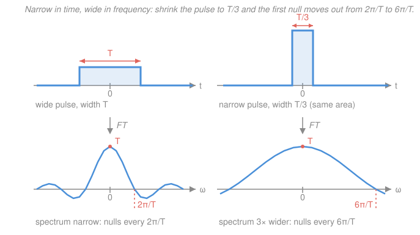

# Signals & Systems · Lesson 2.3: The continuous-time Fourier transform of signals

> ⏱ ~15 min · Module 2: Frequency-domain analysis · Builds on: [2.1 Eigenfunctions and the frequency response](02-01-eigenfunctions-frequency-response.md), [2.2 Fourier series for periodic signals](02-02-fourier-series-periodic-signals.md), [`fourier-analysis` 2.1](../../fourier-analysis/lessons/02-01-series-to-fourier-transform.md) · Unlocks: [2.4 The Laplace transform and the ROC](02-04-laplace-transform-roc.md)

## Why this matters

Almost nothing an engineer measures repeats. A keystroke, a radar return, a step on a power rail, one bit on a wire — each happens once and is gone. Fourier *series* ([2.2](02-02-fourier-series-periodic-signals.md)) can't touch these; the Fourier *transform* can, and it hands you the single number that dominates every hardware datasheet: **bandwidth**. Why does a faster link need more spectrum? Why does an oscilloscope's rise-time spec follow from its "-3 dB" number? Why does a 1 GHz clock edge splatter interference across a board? All one answer, and it lives in this lesson.

The *theory* — when the transform exists, what it preserves — you already did in [`fourier-analysis` Module 2](../../fourier-analysis/lessons/02-01-series-to-fourier-transform.md). This lesson is the engineer's working layer: the pairs you must know cold, what the picture means, and how to read a bandwidth off it.

## The idea

A periodic signal has a **line spectrum**: energy only at the harmonics $\omega_0, 2\omega_0, 3\omega_0, \dots$, with nothing in between. Now stretch the period $T$. The harmonics sit at spacing $\omega_0 = 2\pi/T$, so doubling $T$ packs the lines twice as densely. Push $T \to \infty$ — a single non-repeating pulse *is* a signal of infinite period — and the lines merge into a **continuous curve**. The discrete list of coefficients becomes a function of a continuous frequency variable.

That merge costs you something, and the bookkeeping is worth one sentence: each individual line's height $a_k$ shrinks to zero (a lone pulse has zero average power at any one frequency), so we track the *density* instead — precisely, $a_k \to X(jk\omega_0)/T$, where $X$ is the transform of one period. The derivation is [`fourier-analysis` 2.1](../../fourier-analysis/lessons/02-01-series-to-fourier-transform.md); take the picture and move on.

The payoff is the picture, not the algebra. A spectrum answers: *what frequencies is this signal built out of, and how much of each?* And the single most useful fact in it turns out to be a tradeoff — **you cannot be narrow in time and narrow in frequency at once**. Squeeze a pulse and its spectrum spreads. That is why speed costs bandwidth.

## The formal version

**The transform pair.** For a continuous-time signal $x(t)$ (volts, say, with $t$ in seconds),

$$\boxed{\;X(j\omega) = \int_{-\infty}^{\infty} x(t)\,e^{-j\omega t}\,dt, \qquad x(t) = \frac{1}{2\pi}\int_{-\infty}^{\infty} X(j\omega)\,e^{j\omega t}\,d\omega\;}$$

where $\omega$ is angular frequency in rad/s and $j=\sqrt{-1}$. *In words: the first integral asks "how much of the pure oscillation at frequency $\omega$ is hiding in $x$?" by correlating $x$ against it; the second rebuilds $x$ by adding every frequency back up.*

Two notational commitments for this whole course:

- **We use $\omega$, not $f$.** With $\omega = 2\pi f$ ($f$ in Hz), the $2\pi$ has to live *somewhere* — here it sits as the lone $1/2\pi$ on the inverse. That asymmetry is a **convention choice, not physics**; `fourier-analysis` puts the $2\pi$ in the exponent instead and gets a symmetric pair. Every constant you lift from a book must be checked against its convention. Ours is Oppenheim's, universal in engineering.
- **The argument is written $j\omega$, not $\omega$.** That looks redundant now; it pays off in [2.4](02-04-laplace-transform-roc.md), where $X(s)$ with $s=\sigma+j\omega$ is the same object off the imaginary axis, and $X(j\omega)$ is literally $X(s)$ evaluated at $s=j\omega$.

**The pairs you must know cold.** Sinc convention for this course: $\operatorname{sinc}(\theta) \equiv \dfrac{\sin\theta}{\theta}$, the **unnormalized** one, value $1$ at $\theta=0$. (Numerical libraries usually mean $\sin(\pi\theta)/(\pi\theta)$ — check before you trust a plot.) Here $a>0$ and $\omega_0$ is a fixed frequency in rad/s.

| $x(t)$ | $X(j\omega)$ | what it says |
|---|---|---|
| $\delta(t)$ | $1$ | an impulse contains **every** frequency equally |
| $1$ | $2\pi\delta(\omega)$ | a constant is pure DC |
| $u(t)$ | $\dfrac{1}{j\omega} + \pi\delta(\omega)$ | a step = DC offset plus a $1/\omega$ tail from the jump |
| $e^{-at}u(t)$ | $\dfrac{1}{a+j\omega}$ | one-pole low-pass shape |
| $e^{-a\lvert t\rvert}$ | $\dfrac{2a}{a^2+\omega^2}$ | symmetric in time ⟹ real spectrum |
| $1$ for $\lvert t\rvert<T/2$, else $0$ | $T\operatorname{sinc}\!\left(\dfrac{\omega T}{2}\right)$ | box ↔ sinc |
| $\dfrac{\sin(Wt)}{\pi t}$ | $1$ for $\lvert\omega\rvert<W$, else $0$ | sinc ↔ box (the ideal filter) |
| $e^{j\omega_0 t}$ | $2\pi\delta(\omega-\omega_0)$ | one frequency, one spike |
| $\cos(\omega_0 t)$ | $\pi[\delta(\omega-\omega_0)+\delta(\omega+\omega_0)]$ | **the impulse pair** |
| $\sin(\omega_0 t)$ | $-j\pi[\delta(\omega-\omega_0)-\delta(\omega+\omega_0)]$ | same pair, rotated in phase |

Three of these deserve a line of derivation, because they are the ones people mis-remember.

*The box.* With $x(t)=1$ on $\lvert t\rvert<T/2$,
$$X(j\omega)=\int_{-T/2}^{T/2}e^{-j\omega t}dt=\frac{e^{j\omega T/2}-e^{-j\omega T/2}}{j\omega}=\frac{2\sin(\omega T/2)}{\omega}=T\operatorname{sinc}\!\left(\frac{\omega T}{2}\right),$$
using $e^{j\theta}-e^{-j\theta}=2j\sin\theta$. Note $X(0)=T$ — **the value at DC is always the total area** $\int x\,dt$, a free sanity check on every transform you compute.

*The impulse.* $\int\delta(t)e^{-j\omega t}dt=e^{-j\omega\cdot 0}=1$ by the sifting property of [1.2](01-02-elementary-signals.md). Flat, forever. This is the "hit it and listen" principle: strike a bell, or kick a circuit with a spike, and you have driven it at *all* frequencies at once — so what comes back out is the system's own frequency response, unmasked. Impulse testing is an entire lab technique falling out of one line of algebra.

*The step.* Its integral doesn't converge, so pin it down by differentiating: $du/dt=\delta(t)$, and the derivative rule ([`fourier-analysis` 2.2](../../fourier-analysis/lessons/02-02-properties-derivative-rule.md)) gives $j\omega\,U(j\omega)=1$. That forces $U(j\omega)=1/(j\omega)+c\,\delta(\omega)$ — the extra impulse is invisible to the equation because $\omega\delta(\omega)=0$. Fix $c$ from the step's average value $\tfrac12$, whose transform is $\tfrac12\cdot 2\pi\delta(\omega)=\pi\delta(\omega)$. So $c=\pi$.

**Duality, and the tradeoff it exposes.** If $x(t)\leftrightarrow X(j\omega)$, then $X(jt)\leftrightarrow 2\pi x(-\omega)$: swapping the roles of the two domains re-uses the same pair. That's why box ↔ sinc runs both ways — a box *in time* has a sinc spectrum, and a sinc *in time* has a box spectrum (an ideal brick-wall filter, which will haunt [4.4](04-04-filter-design-basics.md)).

Now read the box pair again. Width in time is $T$; the first null of the sinc is at $\omega T/2=\pi$, i.e.

$$\omega_{\text{null}}=\frac{2\pi}{T} \qquad\Longrightarrow\qquad T\cdot\omega_{\text{null}}=2\pi = \text{constant.}$$

*In words: halve the pulse duration and you exactly double its bandwidth.* Compress in time, spread in frequency — the engineer's face of the uncertainty principle proved in [`fourier-analysis` 2.4](../../fourier-analysis/lessons/02-04-plancherel-uncertainty.md). Physically: **a short event needs a wide band to carry it**. A 1 Mbit/s link sends symbols of duration $1\ \mu\mathrm{s}$, so its first-null bandwidth is $1/T = 1$ MHz. Want 100 Mbit/s? You need roughly 100 MHz of spectrum, and no cleverness in the modulator escapes it. That single sentence is why spectrum is auctioned for billions.

**Magnitude and phase.** $X(j\omega)$ is complex, so plot two curves: $\lvert X(j\omega)\rvert$ (how much of each frequency) and $\angle X(j\omega)$ (how each frequency is *aligned* in time). People stare at magnitude and ignore phase, which is backwards — phase encodes *where things happen*: keep a signal's magnitude spectrum and scramble its phase and you get noise, while keeping the phase and flattening the magnitude leaves the structure clearly recognizable. (For real $x(t)$, $X(-j\omega)=X(j\omega)^*$, so magnitude is even and phase is odd — the negative-frequency half is redundant.)

**Bandwidth, as actually quoted.** "Bandwidth" is not one definition; know the two you'll meet:

- **-3 dB (half-power) bandwidth:** the frequency where $\lvert X\rvert$ falls to $1/\sqrt2 \approx 0.707$ of its peak, since $20\log_{10}(1/\sqrt2)=-3.01$ dB and power drops to half. For $e^{-at}u(t)$, $\lvert X\rvert = 1/\sqrt{a^2+\omega^2}$ hits $1/(a\sqrt2)$ at exactly $\omega=a$. Every filter datasheet quotes this one.
- **First-null bandwidth:** the first zero of the spectrum, $\omega=2\pi/T$ for a pulse of width $T$. Used for pulses and digital symbols, where the sinc's main lobe holds about 90% of the energy.

**Closing the loop with systems.** In [2.1](02-01-eigenfunctions-frequency-response.md) you defined the frequency response as $H(j\omega)=\int h(t)e^{-j\omega t}dt$ — that is *exactly* this lesson's transform applied to the impulse response. **The frequency response is the Fourier transform of $h(t)$; they were never two things.** And since $y=x*h$, the convolution theorem ([`fourier-analysis` 2.3](../../fourier-analysis/lessons/02-03-convolution-theorem.md)) gives

$$y(t)=x(t)*h(t) \qquad\Longleftrightarrow\qquad Y(j\omega)=X(j\omega)\,H(j\omega).$$

*In words: the flip-and-slide integral of [1.4](01-04-convolution-continuous-time.md) becomes ordinary multiplication, one frequency at a time.* Dually, multiplying in time convolves in frequency (with a $1/2\pi$): multiply a signal by $\cos(\omega_0t)$ and you convolve its spectrum with the impulse pair, which just *copies the spectrum to* $\pm\omega_0$. That is amplitude modulation, and it is why the impulse-pair row of the table is the one to memorize — [4.5](04-05-modulation.md) is built on it.

## Picture

## Worked examples

**Example 1 (mechanical — a pulse and its spectrum).** A rectangular voltage pulse of height 1 V and width $T=1$ ms, centered at $t=0$.

$$X(j\omega)=T\operatorname{sinc}\!\left(\frac{\omega T}{2}\right)=10^{-3}\,\frac{\sin(5\times10^{-4}\,\omega)}{5\times10^{-4}\,\omega} \quad (\text{V}\cdot\text{s}).$$

Read it off: $X(0)=10^{-3}$ V·s, matching the area $1\ \text{V}\times 1\ \text{ms}$. First null at $\omega=2\pi/T=6283$ rad/s, i.e. $f=1/T=1$ kHz. Sidelobes decay like $1/\omega$ — slowly, because the pulse has *jump discontinuities*, and sharp corners in time always buy you a heavy-tailed spectrum. Real transmitters round the corners for exactly this reason.

**Example 2 (why you'd care — bandwidth sets rise time).** Take the RC low-pass of [`circuits` 3.2](../../circuits/lessons/03-02-first-order-rc-rl-transients.md), $R=1\ \mathrm{k\Omega}$, $C=1\ \mu\mathrm{F}$, so $RC=10^{-3}$ s. Its impulse response is $h(t)=\frac{1}{RC}e^{-t/RC}u(t)$, and by the exponential row of the table (with $a=1/RC$, scaled by $1/RC$),

$$H(j\omega)=\frac{1}{RC}\cdot\frac{1}{\frac{1}{RC}+j\omega}=\frac{1}{1+j\omega RC}.$$

The -3 dB bandwidth is $\omega_c=1/RC=1000$ rad/s, i.e. $f_c=159$ Hz. Now feed it the Example 1 pulse. The output spectrum is the *product* $X(j\omega)H(j\omega)$: the pulse's content out past 159 Hz — which is most of it, since its main lobe runs to 1 kHz — gets attenuated, and what emerges has rounded, sagging edges instead of vertical ones.

Quantitatively, a one-pole filter's 10–90% rise time is $t_r = RC\ln 9 = 2.20\,RC$, and since $f_c = 1/(2\pi RC)$,

$$t_r=\frac{2.20}{2\pi f_c}=\frac{0.35}{f_c}=\frac{0.35}{159}\approx 2.2\ \mathrm{ms}.$$

The filter needs 2.2 ms to respond and the pulse is over in 1 ms — it barely gets off the ground. That $t_r \approx 0.35/f_{-3\text{dB}}$ is printed on every oscilloscope datasheet, and you just derived it from a transform pair.

## Watch out

- **You might think a wider pulse has a wider spectrum** — the opposite is true. Wide in time ⟹ *narrow* in frequency. The confusion comes from height: a taller-and-narrower pulse has a *bigger* spectrum at DC only if its area grew. Track width and area separately.
- **You might drop the $2\pi$ in the impulse pairs.** It is $1 \leftrightarrow 2\pi\delta(\omega)$, not $\delta(\omega)$, and $\cos(\omega_0t)\leftrightarrow\pi[\cdots]$, not $\tfrac12[\cdots]$. The factor is an artifact of putting the $1/2\pi$ on the inverse transform — verify any impulse pair by running it *backwards* through the inverse integral, which is one line of sifting.
- **You might read a magnitude plot as the whole story.** Two signals can share a magnitude spectrum exactly and look nothing alike; an all-pass filter has $\lvert H\rvert=1$ at every frequency and can still smear a sharp pulse into a mess. Phase is where the timing lives.

## One-liner

> The spectrum $X(j\omega)=\int x(t)e^{-j\omega t}dt$ says what frequencies a one-off signal is made of — and because $T\cdot\omega_{\text{null}}=2\pi$, anything brief in time is broad in frequency, which is why speed costs bandwidth.

## Problems

**P1 (🟢)** For $x(t)=e^{-3t}u(t)$: find $X(j\omega)$, evaluate its magnitude and phase at $\omega=3$ rad/s, and state the -3 dB bandwidth in rad/s.

**P2 (🟡)** A rectangular pulse has height 1 V and width $T=2$ ms, centered at $t=0$. (a) Write $X(j\omega)$ in sinc form. (b) Give the first-null bandwidth in Hz. (c) Give $X(0)$ with units, and say what it represents. (d) If the pulse width is halved, what happens to the null bandwidth?

**P3 (🔴)** Find the transform of a **pulsed tone**: $x(t)=\cos(\omega_0 t)$ for $\lvert t\rvert<T/2$ and $0$ otherwise — a cosine burst of finite length. Do the integral directly, and then say in one sentence how the answer relates to the box pair and the impulse pair.

Solutions

**P1** Straight from the definition, with $a=3$:

$$X(j\omega)=\int_0^{\infty}e^{-3t}e^{-j\omega t}dt=\int_0^{\infty}e^{-(3+j\omega)t}dt=\left[\frac{e^{-(3+j\omega)t}}{-(3+j\omega)}\right]_0^{\infty}=\frac{1}{3+j\omega},$$

the upper limit vanishing because $\lvert e^{-(3+j\omega)t}\rvert=e^{-3t}\to0$. At $\omega=3$:

$$\lvert X(j3)\rvert=\frac{1}{\lvert 3+3j\rvert}=\frac{1}{\sqrt{18}}=\frac{1}{3\sqrt2}\approx0.236,\qquad \angle X(j3)=-\arctan\!\left(\frac33\right)=-45^\circ.$$

For the bandwidth, $\lvert X(j\omega)\rvert=1/\sqrt{9+\omega^2}$ peaks at $\omega=0$ with value $\tfrac13$. Setting $1/\sqrt{9+\omega^2}=\tfrac{1}{3\sqrt2}$ gives $9+\omega^2=18$, so $\omega_c=3$ rad/s.

*Check.* The -3 dB point landing at $\omega=a=3$ is exactly where the phase hits $-45^\circ$ — the two agree, as they must for a single pole. Units: $x$ dimensionless, $X$ in seconds ✓.

**P2** (a) With $T=2\times10^{-3}$ s,

$$X(j\omega)=T\operatorname{sinc}\!\left(\frac{\omega T}{2}\right)=2\times10^{-3}\,\frac{\sin(10^{-3}\omega)}{10^{-3}\omega}\ \ \text{V}\cdot\text{s}.$$

(b) First null where $\omega T/2=\pi$, so $\omega=2\pi/T=2\pi/(2\times10^{-3})=3142$ rad/s, and

$$f=\frac{\omega}{2\pi}=\frac{1}{T}=\frac{1}{2\times10^{-3}}=500\ \text{Hz}.$$

(c) $X(0)=T=2\times10^{-3}$ V·s = 2 mV·s. It is the area under the pulse — the DC (zero-frequency) content, since $e^{-j0t}=1$ makes the defining integral just $\int x\,dt$.

(d) Halving to $T=1$ ms doubles the null bandwidth to $f=1/T=1$ kHz. The product $T\cdot\omega_{\text{null}}=2\pi$ is fixed.

*Check.* Sanity on (b): a 2 ms pulse is *longer* than Example 1's 1 ms pulse and correctly has *half* its bandwidth (500 Hz vs 1 kHz) ✓.

**P3** Write the cosine as exponentials, $\cos\omega_0t=\tfrac12(e^{j\omega_0t}+e^{-j\omega_0t})$, and integrate over the burst:

$$X(j\omega)=\frac12\int_{-T/2}^{T/2}\left(e^{j\omega_0t}+e^{-j\omega_0t}\right)e^{-j\omega t}\,dt =\frac12\int_{-T/2}^{T/2}e^{-j(\omega-\omega_0)t}dt+\frac12\int_{-T/2}^{T/2}e^{-j(\omega+\omega_0)t}dt.$$

Each integral is the box computation with $\omega$ replaced by a shifted frequency. Using $\int_{-T/2}^{T/2}e^{-j\alpha t}dt=\dfrac{2\sin(\alpha T/2)}{\alpha}=T\operatorname{sinc}\!\left(\dfrac{\alpha T}{2}\right)$:

$$\boxed{\;X(j\omega)=\frac{T}{2}\left[\operatorname{sinc}\!\left(\frac{(\omega-\omega_0)T}{2}\right)+\operatorname{sinc}\!\left(\frac{(\omega+\omega_0)T}{2}\right)\right]}$$

**The relationship:** the burst is (box) × (cosine), so its spectrum is the box's sinc *convolved* with the cosine's impulse pair — and convolving with $\pi[\delta(\omega-\omega_0)+\delta(\omega+\omega_0)]$, then dividing by $2\pi$, simply plants a half-height copy of the sinc at $+\omega_0$ and another at $-\omega_0$. That is exactly amplitude modulation, previewed ([4.5](04-05-modulation.md)).

*Check.* Two independent confirmations. (i) Setting $\omega_0=0$ collapses the burst to a plain box and the formula to $T\operatorname{sinc}(\omega T/2)$ ✓. (ii) Letting $T\to\infty$, each $\tfrac{T}{2}\operatorname{sinc}$ term concentrates all its area at its own center — becoming an impulse — and recovers $\pi[\delta(\omega-\omega_0)+\delta(\omega+\omega_0)]$, the infinite cosine ✓. A finite burst is a *smeared* line spectrum; the shorter the burst, the more smeared. Any real measurement of a "pure tone" has this width.

## Flashback

**From Lesson 1.4 (Convolution in continuous time):** An LTI system has impulse response $h(t)=e^{-2t}u(t)$. Find its **step response** $s(t)$ — the output when the input is the unit step $u(t)$ — using the convolution integral.

Solution

The step response is $s=u*h$. Write the convolution integral and let $h$ do the work:

$$s(t)=\int_{-\infty}^{\infty}u(\tau)\,h(t-\tau)\,d\tau = \int_{-\infty}^{\infty}h(\tau)\,u(t-\tau)\,d\tau,$$

using commutativity. The factor $h(\tau)=e^{-2\tau}u(\tau)$ kills everything with $\tau<0$, and $u(t-\tau)$ kills everything with $\tau>t$. For $t<0$ those windows don't overlap, so $s(t)=0$. For $t\ge0$:

$$s(t)=\int_0^{t}e^{-2\tau}d\tau=\left[\frac{e^{-2\tau}}{-2}\right]_0^{t}=\frac{1-e^{-2t}}{2}.$$

So $s(t)=\tfrac12\left(1-e^{-2t}\right)u(t)$ — the step response is the running integral of the impulse response, rising from 0 to a final value of $\tfrac12$.

*Check, using this lesson.* In the frequency domain $S(j\omega)=U(j\omega)H(j\omega)$, with $H(j\omega)=\frac{1}{2+j\omega}$ and $U(j\omega)=\frac{1}{j\omega}+\pi\delta(\omega)$:

$$S(j\omega)=\frac{1}{j\omega(2+j\omega)}+\frac{\pi\delta(\omega)}{2}=\frac12\left(\frac{1}{j\omega}+\pi\delta(\omega)\right)-\frac12\cdot\frac{1}{2+j\omega},$$

by partial fractions $\frac{1}{j\omega(2+j\omega)}=\frac12\left(\frac{1}{j\omega}-\frac{1}{2+j\omega}\right)$, and using $\delta(\omega)/(2+j\omega)=\delta(\omega)/2$. Reading the rows of the table backwards: that is $\tfrac12 u(t)-\tfrac12 e^{-2t}u(t)$ ✓ — same answer, no integral slid. This is the whole argument for changing domains.

## Connections

- **Backward:** this is [2.1](02-01-eigenfunctions-frequency-response.md)'s $H(j\omega)$ set free from systems and applied to *any* signal — and the aperiodic limit of [2.2](02-02-fourier-series-periodic-signals.md)'s line spectrum, with the derivation done in [`fourier-analysis` 2.1](../../fourier-analysis/lessons/02-01-series-to-fourier-transform.md). It turns [1.4](01-04-convolution-continuous-time.md)'s convolution integral into multiplication.
- **Forward:** [2.4](02-04-laplace-transform-roc.md) replaces $j\omega$ with $s=\sigma+j\omega$ so that growing signals (like $u(t)$, which needed a distributional patch here) transform cleanly; [3.1](03-01-sampling-nyquist-shannon.md) needs the impulse pairs to explain spectral replication; [4.5](04-05-modulation.md) is P3 taken seriously.
- **Sideways (circuits):** the phasor analysis of [`circuits` 4.2](../../circuits/lessons/04-02-impedance-phasor-analysis.md) is this transform restricted to a *single* frequency. An impedance $Z(j\omega)$ is a frequency response; the Fourier transform is what lets you use it on a signal that isn't a pure sinusoid, by decomposing the signal into ones that are.
