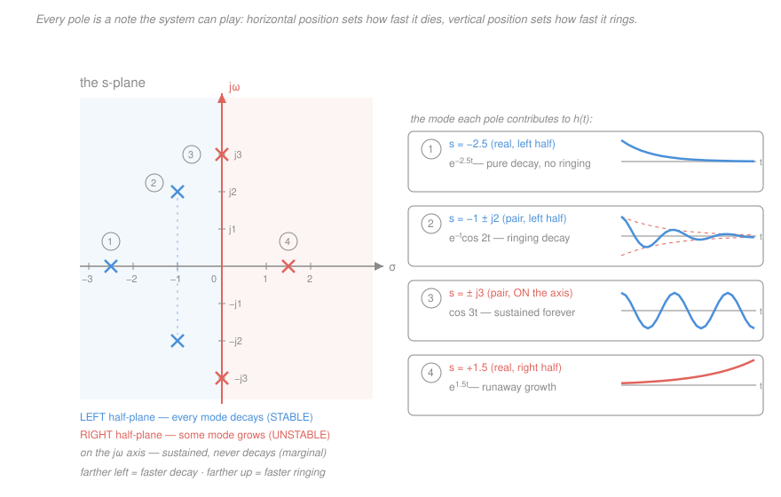
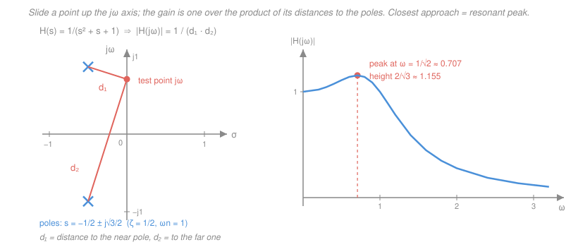

# Signals & Systems · Lesson 2.5: Transfer functions — poles, zeros, and stability

> ⏱ ~15 min · Module 2: Frequency-domain analysis — Fourier and Laplace · Builds on: [2.4 The Laplace transform and the ROC](02-04-laplace-transform-roc.md), [2.1 Eigenfunctions and the frequency response](02-01-eigenfunctions-frequency-response.md) · Unlocks: [2.6 Solving systems with Laplace](02-06-solving-systems-with-laplace.md), and the z-plane in [4.2](04-02-discrete-transfer-functions-z-plane.md)

## Why this matters

This is the lesson where the engineering superpower shows up. Hand an engineer a differential equation and they will not solve it — they will factor two polynomials, plot a handful of dots on a plane, and tell you: *this thing rings at about 5 rad/s, settles in a second, and it's stable.* No integration, no initial conditions, no characteristic equation solved by hand. A **picture of dots replaces solving a differential equation.**

That is not a shortcut for lazy people. It's a change of representation that makes the answer *visible*. Once you can read an s-plane, you can also **design**: "this pole is too close to the axis, it rings too long — move it left." That single sentence is the whole of `control-systems`, and it's unavailable to anyone who only knows how to solve ODEs.

## The idea

[2.1](02-01-eigenfunctions-frequency-response.md) showed that feeding $e^{st}$ into an LTI system gives back $H(s)\,e^{st}$ — same exponential, just scaled. So $H(s)$ is a *gain dial*, one complex number for every complex frequency $s$.

Now ask the mischievous question: **is there an $s$ where the dial reads infinity?** If there is — call it a **pole** — then at that one frequency the system produces output from nothing. That's not a bug; it's the system's confession about what it *naturally does when left alone*. A bell has a pole at its ringing frequency. Poles are the system's own repertoire of behaviors, its **modes**.

And here's the geometry. A complex $s = \sigma + j\omega$ has two coordinates, and $e^{st} = e^{\sigma t}e^{j\omega t}$ splits accordingly: the **horizontal** coordinate $\sigma$ rides an envelope $e^{\sigma t}$ (shrinking if left, growing if right), the **vertical** coordinate $\omega$ spins a sinusoid at that frequency. So a pole's position *is* a picture of the waveform it produces:

- **Left** of the vertical axis → that mode dies out. **Right** → it blows up. **On** the axis → it rings forever.
- **Near the horizontal axis** → slow or no wiggle. **Far up** → fast ringing.

A **zero** is the opposite: a frequency where the dial reads *zero*, so that input is annihilated. Poles say what the system does on its own; zeros say what it refuses to pass.

## The formal version

**The transfer function.** For an LTI system with impulse response $h(t)$, define

$$H(s) \;=\; \int_{-\infty}^{\infty} h(t)\,e^{-st}\,dt \;=\; \frac{Y(s)}{X(s)},$$

where $s = \sigma + j\omega$ is complex frequency ($\sigma$ in nepers/s, $\omega$ in rad/s), and $X(s), Y(s)$ are the Laplace transforms of input and output. *In words: the transfer function is the Laplace transform of the impulse response, and it is also just "output over input" in the s-domain.* The second equality is convolution-becomes-multiplication from [1.4](01-04-convolution-continuous-time.md): $y = x * h \Rightarrow Y(s) = H(s)X(s)$.

**Why it's a ratio of polynomials.** Take any system described by a constant-coefficient ODE, with input $x(t)$ and output $y(t)$. Apply the differentiation property from [2.4](02-04-laplace-transform-roc.md) — with zero initial conditions, $\dfrac{d}{dt} \leftrightarrow s$, so $\dfrac{d^k y}{dt^k} \leftrightarrow s^k Y(s)$. Every derivative becomes a *power of $s$*, and the calculus collapses into algebra:

$$\sum_{k=0}^{N} a_k \frac{d^k y}{dt^k} = \sum_{k=0}^{M} b_k \frac{d^k x}{dt^k}
\;\;\xrightarrow{\ \mathcal{L}\ }\;\;
\Big(\sum_{k=0}^{N} a_k s^k\Big) Y(s) = \Big(\sum_{k=0}^{M} b_k s^k\Big) X(s),$$

$$\boxed{\;H(s) = \frac{b_M s^M + \cdots + b_1 s + b_0}{a_N s^N + \cdots + a_1 s + a_0} = \frac{N(s)}{D(s)}\;}$$

*In words: differentiating $k$ times is the same as multiplying by $s^k$, so an ODE with constant coefficients always turns into one polynomial divided by another.* Concretely, the mass–spring–damper $m\ddot y + c\dot y + ky = x(t)$ becomes $(ms^2 + cs + k)Y(s) = X(s)$, so $H(s) = 1/(ms^2+cs+k)$. Set $m=c=k=1$ and you get $H(s) = 1/(s^2+s+1)$ — the system we'll dissect below.

**Poles and zeros.** Factor both polynomials:

$$H(s) = K\,\frac{(s-z_1)(s-z_2)\cdots(s-z_M)}{(s-p_1)(s-p_2)\cdots(s-p_N)}.$$

The **zeros** $z_i$ are the roots of the numerator ($H(z_i)=0$); the **poles** $p_k$ are the roots of the denominator ($|H(s)| \to \infty$ as $s \to p_k$). $K$ is a real gain constant. Together with $K$, the pole and zero locations determine $H(s)$ *completely* — which is why a plot of them is a complete blueprint. **Plot convention: poles are ×, zeros are ○.** Because the $a_k, b_k$ are real, complex poles and zeros always come in **conjugate pairs**, so every plot is mirror-symmetric about the real axis.

**Poles are the transient modes.** Split $H$ by partial fractions (distinct poles): $H(s) = \sum_k \dfrac{A_k}{s-p_k}$. Inverting term by term — each $\dfrac{A_k}{s-p_k}$ is the transform of $A_k e^{p_k t}u(t)$ —

$$h(t) = \sum_k A_k e^{p_k t}\,u(t).$$

A conjugate pair $p = \sigma \pm j\omega$ with residues $A, A^*$ combines into a real waveform:

$$\boxed{\;\text{pole at } s = \sigma + j\omega \;\longrightarrow\; \text{mode } \; e^{\sigma t}\cos(\omega t + \phi)\;}$$

*In words: each pole hands the impulse response one term — an exponential envelope set by how far left or right it sits, times a sinusoid whose pitch is how far up it sits.* Reading off the two numbers:

- **Time constant** $\tau = 1/|\sigma|$ (seconds): the mode falls to $1/e$ of its size in $\tau$, and is essentially gone after $4\tau$. The *rightmost* pole has the largest $\tau$, so it dominates the tail.
- **Ring frequency** $\omega$ (rad/s): one oscillation every $2\pi/\omega$ seconds.

| Pole location | $\sigma$ | $\omega$ | Mode in $h(t)$ | Looks like |
|---|---|---|---|---|
| Real, left half | $<0$ | $0$ | $e^{\sigma t}$ | pure exponential decay |
| Real, right half | $>0$ | $0$ | $e^{\sigma t}$ | runaway growth |
| At the origin | $0$ | $0$ | constant | never returns (an integrator) |
| Complex pair, left | $<0$ | $\ne 0$ | $e^{\sigma t}\cos(\omega t+\phi)$ | damped ringing |
| Complex pair, **on** the axis | $0$ | $\ne 0$ | $\cos(\omega t+\phi)$ | sustained oscillation |
| Complex pair, right | $>0$ | $\ne 0$ | $e^{\sigma t}\cos(\omega t+\phi)$ | growing oscillation |

**Stability.** For a **causal** system, [2.4](02-04-laplace-transform-roc.md) says the ROC is the right half-plane to the right of the rightmost pole, and BIBO stability ⟺ the ROC contains the $j\omega$ axis (that's exactly $\int|h|\,dt < \infty$). Put those together:

$$\boxed{\;\text{causal LTI system is BIBO stable}\;\iff\;\text{every pole has } \mathrm{Re}\{p_k\} < 0\;}$$

*In words: a causal system is stable exactly when all its poles sit strictly inside the open left half-plane.* Strictly — a pole *on* the axis is **marginally stable**, not stable: it rings forever, and the right bounded input drives it to infinity. Zeros are irrelevant to this verdict; they contribute no modes.

**The canonical second-order system.** Almost every system you'll meet has this shape:

$$H(s) = \frac{\omega_n^2}{s^2 + 2\zeta\omega_n s + \omega_n^2},
\qquad \text{poles} \;\; s = -\zeta\omega_n \pm j\,\omega_n\sqrt{1-\zeta^2}.$$

Here $\omega_n > 0$ is the **natural frequency** (rad/s) — the rate it would ring with no damping — and $\zeta \ge 0$ is the dimensionless **damping ratio**. *In words: $\omega_n$ sets the distance of the poles from the origin, and $\zeta$ swings them around a circle of that radius.* The three regimes are just the discriminant:

- $\zeta > 1$ — **overdamped**: two distinct *real* negative poles. Two decaying exponentials, no overshoot.
- $\zeta = 1$ — **critically damped**: a repeated real pole at $-\omega_n$. Fastest settle with no overshoot (modes $e^{-\omega_n t}$ and $t e^{-\omega_n t}$).
- $0 < \zeta < 1$ — **underdamped**: a complex pair, real part $-\zeta\omega_n$, imaginary part $\omega_d = \omega_n\sqrt{1-\zeta^2}$ (the **damped** ring frequency). Decaying oscillation.
- $\zeta = 0$ — poles land on the $j\omega$ axis at $\pm j\omega_n$: undamped, rings forever.

This is the single most reused system in engineering, and you have now met it three times in three uniforms. It is *the same equation* as the mass–spring–damper in [`ode-refresher` 2.2](../../ode-refresher/lessons/02-02-oscillations-damping.md) (there written $x'' + 2\gamma x' + \omega_0^2 x = 0$, so $\gamma = \zeta\omega_n$) and the series RLC loop in [`circuits` 3.3](../../circuits/lessons/03-03-second-order-rlc.md) (with $\omega_n = 1/\sqrt{LC}$ and $\zeta = \tfrac{R}{2}\sqrt{C/L}$). Mass ↔ inductance, damper ↔ resistance, spring ↔ 1/capacitance — and $\zeta$ is the one number all three share.

**Reading the magnitude response geometrically.** The frequency response is just $H(s)$ evaluated on the $j\omega$ axis: $H(j\omega) = H(s)\big|_{s=j\omega}$. Take the magnitude of the factored form:

$$|H(j\omega)| = |K|\,\frac{\prod_i |j\omega - z_i|}{\prod_k |j\omega - p_k|}
= |K|\,\frac{(\text{distances from the point } j\omega \text{ to the zeros})}{(\text{distances from the point } j\omega \text{ to the poles})}.$$

*In words: to get the gain at frequency $\omega$, put your finger on the $j\omega$ axis at height $\omega$, measure the straight-line distance to every zero and every pole, and divide the zero-distances by the pole-distances.* This is the payoff that makes pole–zero plots worth learning — you can *see* the frequency response by sliding a point up the axis:

- Slide past a **pole** that's close to the axis: its distance gets small, you're dividing by a small number, the gain **spikes**. That is **resonance**, and the closer the pole (the smaller $\zeta$), the taller and sharper the peak.
- Slide past a **zero**: you're multiplying by a small distance, the gain **dips**. A zero sitting exactly *on* the axis at $\pm j\omega_0$ gives distance exactly zero, so $|H(j\omega_0)| = 0$ — that frequency is killed completely. That's a **notch filter**.

For the canonical second-order system the peak (when it exists) is at

$$\omega_{\text{peak}} = \omega_n\sqrt{1-2\zeta^2}\quad(\text{only if }\zeta < \tfrac{1}{\sqrt2}\approx 0.707),
\qquad |H|_{\max} = \frac{1}{2\zeta\sqrt{1-\zeta^2}}.$$

*In words: a second-order system only resonates if it's underdamped enough; damp it past $\zeta = 0.707$ and the response just sags from DC with no peak at all.*

## Picture

## Worked examples

**Example 1 (mechanical — read the whole system without solving anything).** Given

$$H(s) = \frac{10(s+1)}{(s+2)(s^2+2s+26)}.$$

*Zeros:* one, at $s = -1$ (numerator root). *Poles:* $s = -2$, and from $s^2+2s+26=0$, $s = \frac{-2\pm\sqrt{4-104}}{2} = -1 \pm j5$. Three poles, one zero.

Now read it off, no ODE solved:

1. **Stable?** All three poles have negative real part ($-2$, $-1$, $-1$), so yes — provided the system is causal.
2. **Does it ring?** Yes: the complex pair sits at $\omega = 5$ rad/s, so $h(t)$ contains $e^{-t}\cos(5t+\phi)$, one oscillation every $2\pi/5 \approx 1.26$ s.
3. **How long until it settles?** Two time constants compete: $\tau = 1/2 = 0.5$ s from the real pole, $\tau = 1/1 = 1$ s from the pair. The *slower* one (rightmost pole) dominates, so the tail dies as $e^{-t}$ and is gone after roughly $4\tau = 4$ s.
4. **DC gain?** $H(0) = \dfrac{10(1)}{(2)(26)} = \dfrac{10}{52} \approx 0.192$ — a steady input is attenuated to about a fifth.

The impulse response is $h(t) = \big(Ae^{-2t} + Be^{-t}\cos(5t+\phi)\big)u(t)$; we never needed $A$, $B$, or $\phi$ to answer any of the four questions.

**Example 2 (why you'd care — resonance, geometrically).** Take the mass–spring–damper with $m=c=k=1$, i.e.

$$H(s) = \frac{1}{s^2+s+1}.$$

*Match the canonical form:* $\omega_n^2 = 1 \Rightarrow \omega_n = 1$ rad/s, and $2\zeta\omega_n = 1 \Rightarrow \zeta = \tfrac12$. Underdamped. *Poles:*

$$s = \frac{-1 \pm \sqrt{1-4}}{2} = -\frac12 \pm j\frac{\sqrt3}{2},$$

matching $-\zeta\omega_n \pm j\omega_n\sqrt{1-\zeta^2} = -\tfrac12 \pm j\sqrt{3}/2$. Both have real part $-\tfrac12 < 0$, so the system is **stable**, with $\tau = 2$ s and damped ring frequency $\omega_d = \sqrt3/2 \approx 0.866$ rad/s.

*Where does it resonate?* Since $\zeta = 0.5 < 0.707$, there is a peak. Directly: $H(j\omega) = \dfrac{1}{(1-\omega^2) + j\omega}$, so

$$|H(j\omega)|^2 = \frac{1}{(1-\omega^2)^2 + \omega^2} = \frac{1}{\omega^4 - \omega^2 + 1}.$$

Let $u = \omega^2$; the denominator is $u^2 - u + 1$, minimized at $u = \tfrac12$, i.e. $\omega = 1/\sqrt2 \approx 0.707$ rad/s, where it equals $\tfrac34$. So

$$|H|_{\max} = \frac{1}{\sqrt{3/4}} = \frac{2}{\sqrt3} \approx 1.155,$$

agreeing with the formulas $\omega_n\sqrt{1-2\zeta^2} = \sqrt{1/2}$ and $\tfrac{1}{2\zeta\sqrt{1-\zeta^2}} = \tfrac{1}{\sqrt{3}/2} = 2/\sqrt3$. ✓

*Now the same answer by measuring distances.* The poles are $p_{1,2} = -\tfrac12 \pm j\tfrac{\sqrt3}{2}$, so $|H(j\omega)| = 1/(d_1 d_2)$ with $d_k = |j\omega - p_k|$. At $\omega = 1/\sqrt2 = 0.7071$:

$$d_1 = \sqrt{\tfrac14 + (0.7071-0.8660)^2} = 0.5246, \qquad
d_2 = \sqrt{\tfrac14 + (0.7071+0.8660)^2} = 1.6507,$$

$$|H| = \frac{1}{0.5246 \times 1.6507} = \frac{1}{0.8660} = 1.155. \;✓$$

Same number, obtained with a ruler. Compare $\omega = 0$: there $d_1 = d_2 = 1$, so $|H| = 1$. As you slide up from 0, the *near* pole's distance $d_1$ shrinks fast while the *far* pole's $d_2$ grows slowly — the product falls, the gain rises. Past $\omega \approx 0.707$ the far pole's growth wins and the gain falls off. **That tug-of-war is resonance.** Physically: you are shaking the mass near the rhythm it wants to move at, so each push arrives in step with the motion and the amplitude builds — [`ode-refresher` 2.3](../../ode-refresher/lessons/02-03-forcing-resonance.md)'s driven oscillator, seen from above.

## Watch out

- **You might think "poles in the left half-plane" *is* the definition of stability.** It isn't — it's the definition *plus the assumption of causality*. The rule is really "the ROC contains the $j\omega$ axis." The same $H(s) = 1/(s+2)$ describes a stable causal $e^{-2t}u(t)$ (ROC $\mathrm{Re}\{s\} > -2$) and an unstable anticausal signal (ROC $\mathrm{Re}\{s\} < -2$) — one pole in the left half-plane, two different verdicts. Algebra alone never decides; the ROC does.
- **You might think a second-order system has one frequency.** It has three, and they're all different. For $H = 1/(s^2+s+1)$: $\omega_n = 1$ (natural), $\omega_d = \sqrt3/2 \approx 0.866$ (what $h(t)$ actually rings at), and $\omega_{\text{peak}} = 1/\sqrt2 \approx 0.707$ (where $|H(j\omega)|$ maxes). They collapse together only as $\zeta \to 0$; the more damping, the more they spread.
- **You might think a zero can rescue an unstable pole.** It can't. Zeros contribute no modes and never appear in the stability test, and "cancelling" a right-half-plane pole with a zero is a paper trick — in the real system that mode is still there, unobserved and growing. (Zeros *in* the right half-plane are also perfectly fine for stability; they only distort phase. Also note: **repeated** poles give modes $t^{m}e^{\sigma t}$, which still decay if $\sigma<0$ — the rule survives.)

## One-liner

> Poles are the modes: left means decay, right means blow-up, height means ringing — so stability is "all × strictly left of the axis," and the gain at $\omega$ is just the product of distances to the zeros over the product of distances to the poles.

## Problems

**P1 (🟢)** A causal system obeys $\dfrac{d^2y}{dt^2} + 5\dfrac{dy}{dt} + 6y = 2x(t)$. Find $H(s)$ and its poles, state whether the system is stable, and say whether its impulse response rings.

**P2 (🟡)** A canonical second-order system has $\omega_n = 4$ rad/s and $\zeta = 0.25$. Locate its poles, classify the damping, give the time constant and the ring period of $h(t)$, and find the frequency at which $|H(j\omega)|$ peaks.

**P3 (🔴)** A causal system has $H(s) = \dfrac{s^2+4}{s^2+s+4}$. Find its poles and zeros, decide whether it is stable, and evaluate $|H(j\omega)|$ at $\omega = 0$, $\omega = 2$, and $\omega \to \infty$. What kind of filter is this? Verify the value at $\omega = 2$ using the distance rule rather than by substitution.

Solutions

**P1** Apply $\dfrac{d}{dt} \leftrightarrow s$ with zero initial conditions: $(s^2+5s+6)Y(s) = 2X(s)$, so

$$H(s) = \frac{2}{s^2+5s+6} = \frac{2}{(s+2)(s+3)}.$$

Poles at $s = -2$ and $s = -3$; no zeros. Both poles have negative real part and the system is causal, so it is **BIBO stable**. Both poles are **real**, so $\omega = 0$ for each mode — $h(t)$ is a sum of pure exponentials with **no ringing**.

*Check.* Partial fractions: $\dfrac{2}{(s+2)(s+3)} = \dfrac{A}{s+2} + \dfrac{B}{s+3}$ with $A = \dfrac{2}{-2+3} = 2$ and $B = \dfrac{2}{-3+2} = -2$, giving $h(t) = (2e^{-2t} - 2e^{-3t})u(t)$ — decaying, non-oscillating ✓. Cross-check with the canonical form: $\omega_n = \sqrt6 \approx 2.449$ and $2\zeta\omega_n = 5 \Rightarrow \zeta = 5/(2\sqrt6) \approx 1.021 > 1$, i.e. **overdamped**, which is exactly the two-real-poles case ✓.

**P2** Poles at $s = -\zeta\omega_n \pm j\omega_n\sqrt{1-\zeta^2}$:

$$-\,(0.25)(4) = -1, \qquad 4\sqrt{1-0.0625} = 4\sqrt{0.9375} = \sqrt{16 \times 0.9375} = \sqrt{15} \approx 3.873,$$

so $s = -1 \pm j\sqrt{15}$. Since $0 < \zeta < 1$, the system is **underdamped** — a decaying oscillation. From the pole coordinates:

$$\tau = \frac{1}{|\sigma|} = \frac{1}{1} = 1\ \mathrm{s}, \qquad T_{\text{ring}} = \frac{2\pi}{\omega_d} = \frac{2\pi}{\sqrt{15}} \approx 1.62\ \mathrm{s}.$$

Because $\zeta = 0.25 < 1/\sqrt2$, a peak exists:

$$\omega_{\text{peak}} = \omega_n\sqrt{1-2\zeta^2} = 4\sqrt{1-0.125} = 4\sqrt{0.875} = \sqrt{14} \approx 3.742\ \mathrm{rad/s}.$$

*Check.* Sanity on ordering: $\omega_{\text{peak}} \approx 3.742 < \omega_d \approx 3.873 < \omega_n = 4$ ✓, as it must be. The peak height is $\dfrac{1}{2\zeta\sqrt{1-\zeta^2}} = \dfrac{1}{0.5\sqrt{0.9375}} \approx 2.07$ — light damping, so a pole near the axis and a gain over 2× at resonance ✓. Note the envelope decays by $1/e$ each 1 s while a full ring takes 1.62 s, so you'd see roughly one visible overshoot (about 44 percent) before it settles.

**P3** *Zeros:* $s^2+4 = 0 \Rightarrow s = \pm j2$ — a conjugate pair sitting **on** the $j\omega$ axis. *Poles:*

$$s = \frac{-1 \pm \sqrt{1-16}}{2} = -\frac12 \pm j\frac{\sqrt{15}}{2} \approx -0.5 \pm j1.936.$$

Both poles have real part $-\tfrac12 < 0$ and the system is causal, so it is **stable**. (The zeros are on the axis, which is fine — zeros never enter the stability test.)

Magnitudes, with $H(j\omega) = \dfrac{4-\omega^2}{(4-\omega^2) + j\omega}$:

$$|H(j0)| = \frac{4}{4} = 1, \qquad |H(j2)| = \frac{4-4}{\;\cdot\;} = 0, \qquad |H(j\omega)| \xrightarrow[\omega\to\infty]{} \frac{\omega^2}{\omega^2} = 1.$$

So it passes DC, passes high frequencies, and completely annihilates $\omega = 2$ rad/s: a **notch (band-stop) filter** tuned to 2 rad/s.

*Distance-rule verification at $\omega = 2$.* Put the test point at $s = j2$ and measure:

- to the zero at $+j2$: distance $|j2 - j2| = 0$;
- to the zero at $-j2$: distance $|j2 + j2| = 4$;
- to the poles: $|j2 - (-0.5 + j1.936)| = \sqrt{0.5^2 + 0.064^2} \approx 0.504$ and $|j2 - (-0.5 - j1.936)| = \sqrt{0.5^2+3.936^2} \approx 3.968$.

$$|H(j2)| = \frac{0 \times 4}{0.504 \times 3.968} = 0.$$

The numerator distance is exactly zero because the test point *lands on* the zero — that's the geometric picture of a notch, and it's why an on-axis zero kills its frequency exactly rather than merely attenuating it.

*Check.* One frequency off the notch: at $\omega = 1$, distances to the zeros are $|j - j2| = 1$ and $|j + j2| = 3$ (product 3), and to the poles $\approx 1.0616$ and $\approx 2.9788$ (product $\approx 3.1623 = \sqrt{10}$), giving $|H(j1)| \approx 3/\sqrt{10} \approx 0.949$. Direct substitution: $\left|\dfrac{4-1}{(4-1)+j}\right| = \dfrac{3}{\sqrt{10}} \approx 0.949$ ✓ — near-unity just 1 rad/s away from a total null.

## Flashback

**From Lesson 2.4 (The Laplace transform and the ROC):** Find the bilateral Laplace transform of the **left-sided** signal $x(t) = -e^{-2t}u(-t)$, together with its region of convergence. Then say what this has to do with today's stability rule.

Solution

The step $u(-t)$ is 1 for $t < 0$ and 0 for $t > 0$, so the integral runs over the negative axis:

$$X(s) = \int_{-\infty}^{0} -e^{-2t}e^{-st}\,dt = -\int_{-\infty}^{0} e^{-(s+2)t}\,dt = \left[\frac{e^{-(s+2)t}}{s+2}\right]_{-\infty}^{0} = \frac{1}{s+2} - \lim_{t\to-\infty}\frac{e^{-(s+2)t}}{s+2}.$$

Write $s = \sigma + j\omega$. As $t \to -\infty$, $|e^{-(s+2)t}| = e^{-(\sigma+2)t} = e^{(\sigma+2)|t|}$, which vanishes only if $\sigma + 2 < 0$. Hence

$$X(s) = \frac{1}{s+2}, \qquad \text{ROC: } \mathrm{Re}\{s\} < -2.$$

**The point.** This is the *identical algebraic expression* as the transform of the causal signal $e^{-2t}u(t)$ — only the ROC differs (a right half-plane $\mathrm{Re}\{s\} > -2$ there, a left half-plane here). One pole, at $s = -2$, comfortably in the left half-plane, yet this signal is **not** absolutely integrable: $-e^{-2t}$ blows up as $t \to -\infty$, and correspondingly its ROC does not contain the $j\omega$ axis. That is precisely the caveat in today's boxed rule — "all poles in the left half-plane ⟹ stable" is a theorem about *causal* systems. The pole picture alone is never the whole story; the ROC is what makes it one.

*Check.* At $s = -3$ (inside the ROC), the formula gives $1/(-3+2) = -1$; direct integration gives $-\int_{-\infty}^{0} e^{t}\,dt = -1$ ✓.

## Connections

- **Backward:** the ratio-of-polynomials structure comes from [2.4](02-04-laplace-transform-roc.md)'s differentiation property ($d/dt \leftrightarrow s$), the stability rule is that lesson's ROC statement wearing a pole–zero costume, and $H(j\omega)$ is just [2.1](02-01-eigenfunctions-frequency-response.md)'s frequency response — $H(s)$ restricted to the vertical axis. The BIBO definition being tested here is from [1.3](01-03-systems-and-properties.md).
- **Forward:** [2.6](02-06-solving-systems-with-laplace.md) turns partial fractions into actual closed-form solutions with initial conditions, and shows how feedback $\tfrac{H}{1+GH}$ *moves* poles — the design move this lesson makes thinkable. In [4.2](04-02-discrete-transfer-functions-z-plane.md) the whole picture reappears in the z-plane with one substitution: the stable region is no longer the left half-plane but the **inside of the unit circle**, and the distance-measuring trick for $|H|$ works there verbatim.
- **Sideways:** the canonical second-order system is literally the same object as the damped oscillator in [`ode-refresher` 2.2](../../ode-refresher/lessons/02-02-oscillations-damping.md), the driven-resonance analysis in [`ode-refresher` 2.3](../../ode-refresher/lessons/02-03-forcing-resonance.md), and the series RLC circuit in [`circuits` 3.3](../../circuits/lessons/03-03-second-order-rlc.md) — ODE roots, RLC discriminant, and s-plane poles are three names for one pair of complex numbers. Deliberately placing those poles (rather than merely finding them) is the subject of [`control-systems`](../../control-systems/syllabus.md).
