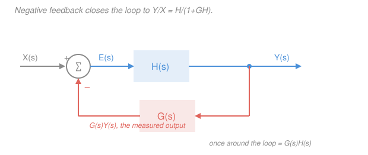

# Signals & Systems · Lesson 2.6: Solving systems with Laplace

> ⏱ ~15 min · Module 2: Frequency-domain analysis — Fourier and Laplace · Builds on: [2.4 The Laplace transform and the ROC](02-04-laplace-transform-roc.md), [2.5 Transfer functions: poles, zeros, and stability](02-05-transfer-functions-poles-zeros.md), [`ode-refresher` 4.1](../../ode-refresher/lessons/04-01-laplace-transform.md) · Unlocks: 3.1 (sampling), and all of [`control-systems`](../../control-systems/syllabus.md)

## Why this matters

[2.5](02-05-transfer-functions-poles-zeros.md) gave you $H(s)$ and taught you to read a system's personality off its poles. But real hardware doesn't start from nothing: the capacitor already has charge, the flywheel is already spinning, the tank is already half full. This lesson is the "now use it" step — you'll take a differential equation *with* its initial conditions and grind it into an answer using nothing but algebra and one systematic trick (partial fractions).

Then comes the payoff that built an industry. Wrap a system in **feedback** — measure the output, subtract it from the input — and the closed loop's transfer function is one line of algebra, $H/(1+GH)$. That single fraction explains why a cheap, drifting amplifier can be made precise, and why a sluggish motor can be made fast. It is the entire premise of [`control-systems`](../../control-systems/syllabus.md).

## The idea

Three moves, and only the third takes skill.

**Move 1: transform.** Every derivative becomes a multiplication by $s$, and — the good part — the initial conditions *fall out of the transform itself* as extra constants. Your ODE turns into a polynomial equation. **Move 2: solve.** Isolate $Y(s)$. It's algebra; there is nothing to be clever about. **Move 3: invert.** $Y(s)$ is a ratio of polynomials, and no table has your exact ratio in it. So you shatter it into pieces that *are* in the table — one piece per pole. That shattering is **partial fractions**, and it is genuinely the whole job. Learn it properly and inverse Laplace stops being scary.

Compare this to [variation of parameters](../../ode-refresher/lessons/02-04-variation-of-parameters.md): there you found a homogeneous solution, hunted a particular solution, added them, *then* fought the initial conditions with a linear system in $c_1, c_2$. Laplace does all of that in one pass. The initial conditions were never a separate step — they entered on line one and rode along.

And once everything is algebra, wiring two systems together is algebra too. Cascade? Multiply. Feedback loop? Solve a one-line equation. That's the second half of the lesson.

## The formal version

### The unilateral transform and its derivative rules

Because we care about systems that start at a definite moment, use the **unilateral** (one-sided) Laplace transform

$$X(s) = \int_{0^-}^{\infty} x(t)\,e^{-st}\,dt,$$

where $s = \sigma + j\omega$ is complex and the lower limit is $0^-$, meaning "an instant *before* zero." *In words: total up the signal from just before the clock starts, weighted by a decaying exponential.* That $0^-$ is not pedantry: if the input contains an impulse $\delta(t)$ sitting exactly at the origin, starting at $0^-$ captures its full area inside the integral (rather than half of it, or none), so a hammer-blow at $t=0$ behaves correctly and the initial conditions you plug in are the *pre-kick* ones you actually know.

The two rules that do all the work:

$$\boxed{\;\mathcal{L}\{x'\} = sX(s) - x(0^-), \qquad \mathcal{L}\{x''\} = s^2X(s) - s\,x(0^-) - x'(0^-)\;}$$

*In words: each derivative costs you a factor of $s$, and pays you back the initial conditions as subtracted constants.* (Both come from integrating by parts; see [`ode-refresher` 4.1](../../ode-refresher/lessons/04-01-laplace-transform.md).)

**The recipe.** (1) Transform every term of the ODE — the initial conditions appear automatically. (2) Collect and solve for $Y(s)$. (3) Invert by partial fractions plus the table.

### Partial fractions: the three cases

Write $Y(s) = N(s)/D(s)$ with $\deg N < \deg D$. Factor $D$; every root (pole) contributes a term.

**Case 1 — distinct real poles.** For $D(s) = (s-p_1)(s-p_2)\cdots$, write $Y = \sum_k \dfrac{A_k}{s-p_k}$ with the **cover-up method**:

$$A_k = \big[(s-p_k)\,Y(s)\big]_{\,s=p_k}$$

*In words: delete the factor you're solving for, then evaluate what's left at that pole.* Example: $Y = \dfrac{2s+5}{(s+1)(s+3)}$ gives $A_1 = \dfrac{2(-1)+5}{-1+3} = \dfrac32$ and $A_2 = \dfrac{2(-3)+5}{-3+1} = \dfrac12$, so $y(t) = \left(\tfrac32 e^{-t} + \tfrac12 e^{-3t}\right)u(t)$.

**Case 2 — a repeated pole.** A double pole at $s=-a$ needs *two* terms, $\dfrac{A}{s+a} + \dfrac{B}{(s+a)^2}$ — one alone can't match a general numerator. Cover-up gets the highest power; a derivative gets the rest:

$$B = \big[(s+a)^2Y(s)\big]_{s=-a}, \qquad A = \frac{d}{ds}\big[(s+a)^2Y(s)\big]_{s=-a}.$$

*In words: multiply out the repeated factor, evaluate for the top coefficient, differentiate once for the next one down.* Example: $Y = \dfrac{1}{s(s+1)^2} = \dfrac{1}{s} + \dfrac{A}{s+1} + \dfrac{B}{(s+1)^2}$. Here $(s+1)^2Y = 1/s$, so $B = -1$ and $A = \left[-1/s^2\right]_{s=-1} = -1$, giving $y(t) = \left(1 - e^{-t} - te^{-t}\right)u(t)$. The pair $\dfrac{1}{(s+a)^2} \leftrightarrow te^{-at}u(t)$ is why repeated poles produce that $t\,e^{-at}$ ramp-then-decay.

**Case 3 — a complex-conjugate pair.** *Do not* split these into two complex first-order terms and chase conjugate residues — that path is arithmetic misery and ends with $e^{(-1+2j)t}$ terms you have to reassemble anyway. Instead **complete the square** and match the two real shifted pairs

$$e^{-\sigma t}\cos\omega t \;\longleftrightarrow\; \frac{s+\sigma}{(s+\sigma)^2+\omega^2}, \qquad e^{-\sigma t}\sin\omega t \;\longleftrightarrow\; \frac{\omega}{(s+\sigma)^2+\omega^2}.$$

The step everyone stalls on, done explicitly for $Y = \dfrac{s+4}{s^2+2s+5}$:

$$s^2+2s+5 = \underbrace{(s^2+2s+1)}_{(s+1)^2}+4 = (s+1)^2 + 2^2 \quad\Rightarrow\quad \sigma = 1,\ \omega = 2.$$

Now force the numerator to speak in $(s+1)$ as well — write $s+4 = (s+1) + 3$:

$$Y = \frac{(s+1)}{(s+1)^2+2^2} + \frac{3}{2}\cdot\frac{2}{(s+1)^2+2^2} \quad\Longrightarrow\quad y(t) = e^{-t}\!\left(\cos 2t + \tfrac32\sin 2t\right)u(t).$$

*In words: the real part of the pole ($-\sigma$) sets the decay envelope, the imaginary part ($\pm j\omega$) sets the ringing frequency, and the numerator split sets how much cosine versus sine.* One real answer, no complex numbers ever written down.

### Natural vs. forced, zero-input vs. zero-state

Solving for $Y(s)$ always produces a sum you can read term by term:

$$Y(s) = \underbrace{\frac{\text{(initial-condition terms)}}{D(s)}}_{\textbf{natural / zero-input}} \;+\; \underbrace{H(s)X(s)}_{\textbf{forced / zero-state}}.$$

*In words: one chunk is what the system does because of where it started, the other is what it does because of what you fed it.* **Zero-input response** = set the input to zero, keep the initial conditions. **Zero-state response** = set the initial conditions to zero, keep the input; that's the $H(s)X(s)$ multiplication you met in [1.4](01-04-convolution-continuous-time.md) as a convolution. Superposition means the true answer is their sum.

### Initial and final value theorems

Two shortcuts that read a signal's endpoints straight off $X(s)$ without inverting:

$$x(0^+) = \lim_{s\to\infty} sX(s), \qquad x(\infty) = \lim_{s\to 0} sX(s).$$

*In words: large $s$ sees only the earliest instant, small $s$ sees only the long run.* The final value theorem carries a hard condition: **all poles of $sX(s)$ must lie strictly in the left half-plane** (plus, at most, the single pole at $s=0$ that a settling step response has). Otherwise it lies — see Watch out.

### Feedback: the closed-loop transfer function

Forward path $H(s)$, feedback path $G(s)$, output subtracted from input. Three lines:

$$E(s) = X(s) - G(s)Y(s), \qquad Y(s) = H(s)E(s) = H(s)\big[X(s) - G(s)Y(s)\big],$$
$$\big[1 + G(s)H(s)\big]Y(s) = H(s)X(s) \quad\Longrightarrow\quad \boxed{\;T(s) = \frac{Y(s)}{X(s)} = \frac{H(s)}{1+G(s)H(s)}\;}$$

*In words: the closed loop is the forward path divided by one-plus-the-loop-gain.* Two consequences do all the engineering work:

1. **Insensitivity.** If the loop gain is large, $|G H| \gg 1$, then $T \approx H/(GH) = 1/G$. The closed-loop behavior depends on $G$ — your cheap, precise measurement network — and barely on $H$, the expensive, drifting, temperature-dependent hardware. This is why an op-amp with a wildly uncertain open-loop gain gives you an amplifier accurate to a fraction of a percent.
2. **Pole movement.** The closed-loop poles are the roots of $1 + G(s)H(s) = 0$, which are *not* the poles of $H$. One line: with $H(s) = \dfrac{K}{s+1}$ and unity feedback $G=1$, $T(s) = \dfrac{K}{s+1+K}$ — the pole slides from $-1$ to $-(1+K)$, so the system gets $(1+K)$ times faster. Choosing feedback to place poles where you want them *is* [`control-systems`](../../control-systems/syllabus.md).

## Picture

Trace the loop once: $X$ enters, the measured $GY$ is subtracted, the difference $E$ drives $H$. Because $Y$ appears on both sides, you don't "follow the signal around forever" — you solve for it, and the infinite chase collapses into the single fraction $H/(1+GH)$.

## Worked examples

**Example 1 (mechanical — the full recipe with a nonzero initial condition).** Solve $y' + 2y = 4u(t)$ with $y(0^-) = 3$. (An RC circuit with 3 V already on the capacitor, switched onto a 4-unit source; compare [`circuits` 3.2](../../circuits/lessons/03-02-first-order-rc-rl-transients.md).)

Transform, using $\mathcal{L}\{y'\} = sY - y(0^-)$ and $\mathcal{L}\{u(t)\} = 1/s$:

$$sY - 3 + 2Y = \frac{4}{s} \quad\Longrightarrow\quad (s+2)Y = \frac{4}{s} + 3 \quad\Longrightarrow\quad Y(s) = \underbrace{\frac{3}{s+2}}_{\text{natural}} + \underbrace{\frac{4}{s(s+2)}}_{\text{forced}}.$$

The split is visible before any inversion: the $3$ came from the initial condition, the $4/s$ from the input. Cover-up on the forced term: at $s=0$, $4/(0+2) = 2$; at $s=-2$, $4/(-2) = -2$. So $\dfrac{4}{s(s+2)} = \dfrac{2}{s} - \dfrac{2}{s+2}$, and

$$y(t) = 3e^{-2t} + 2 - 2e^{-2t} = \big(2 + e^{-2t}\big)u(t).$$

*Checks.* $y(0^+) = 3$ ✓, matching the initial condition; also $\lim_{s\to\infty} sY = \lim_{s\to\infty}\left[\frac{3s}{s+2} + \frac{4}{s+2}\right] = 3$ ✓. Final value: $\lim_{s\to 0} sY = 0 + \frac{4}{2} = 2$ ✓, which is the DC gain $H(0) = 1/2$ times the input height $4$. The pole at $s=-2$ is in the LHP, so the FVT is legal here.

**Example 2 (why you'd care — feedback fixes bad hardware and moves the pole).** A motor amplifier has $H(s) = \dfrac{K}{s+2}$, where the manufacturer only promises $K = 100$ to within $\pm50\%$. Close the loop with a precision resistive divider $G = 0.2$ (cheap and stable to 0.1 percent):

$$T(s) = \frac{K/(s+2)}{1 + 0.2K/(s+2)} = \frac{K}{s + 2 + 0.2K}.$$

*Insensitivity.* DC gain is $T(0) = \dfrac{K}{2+0.2K}$. At the nominal $K = 100$: $\dfrac{100}{22} = 4.545$. If $K$ sags to $50$: $\dfrac{50}{12} = 4.167$. A **50 percent** collapse in the hardware gain produced an **8.3 percent** change at the output — and both sit near the ideal $1/G = 5$, which is where $T$ heads as $K\to\infty$.

*Pole movement.* Open loop, the pole is at $s = -2$ (time constant 0.5 s). Closed loop with $K=100$, it's at $s = -22$ (time constant 0.045 s) — **eleven times faster**, from the same motor, for free. You traded gain (4.5 instead of 50) for speed and accuracy. That trade, made deliberately, is control engineering.

## Watch out

- **You might think the final value theorem always works.** It doesn't, and it fails *silently*. For $X(s) = \dfrac{1}{s-1}$ (an unstable $e^{t}$), $\lim_{s\to0} sX = 0$ — a confident, wrong "it settles to zero." For $X(s) = \dfrac{\omega}{s^2+\omega^2}$ (a pure $\sin\omega t$, poles on the axis), you again get $0$, but the signal never settles at all. **Check the poles first:** every pole of $sX(s)$ must be strictly in the left half-plane. If any pole is on or right of the imaginary axis, the theorem does not apply. The initial value theorem has no such restriction.
- **You might use $y(0^+)$ where the rule wants $y(0^-)$.** They differ exactly when the input contains an impulse or a step that instantaneously jumps a state. The transform rules take the *pre*-kick value $y(0^-)$; $y(0^+)$ is an *output* of the calculation (get it from the IVT), never an input to it.
- **You might do partial fractions on an improper fraction.** If $\deg N \ge \deg D$, the expansion is invalid until you long-divide first: $\dfrac{s+3}{s+1} = 1 + \dfrac{2}{s+1}$, whose inverse is $\delta(t) + 2e^{-t}u(t)$. That constant term *is* an impulse — a real and physical piece of the answer, not an artifact.
- **You might drop the "$+1$" in $H/(1+GH)$.** That $1$ is the entire content of feedback. Without it you'd have $1/G$ always; with it you get stability limits, pole placement, and the possibility of a loop that oscillates when $1+GH = 0$ on the imaginary axis.

## One-liner

> Transform the ODE and the initial conditions ride along for free; partial fractions — cover-up, derivative, complete-the-square — turn $Y(s)$ back into time; and closing a loop is just $H/(1+GH)$, which buys insensitivity to $H$ and lets you move the poles.

## Problems

**P1 (🟢)** Find $y(t)$ for each, using the right partial-fraction case: (a) $Y(s) = \dfrac{4s+10}{(s+1)(s+3)}$, (b) $Y(s) = \dfrac{2s+3}{(s+1)^2}$.

**P2 (🟡)** A forward path $H(s) = \dfrac{10}{s+2}$ is placed in a unity-feedback loop ($G = 1$). (a) Find $T(s)$ and its pole. (b) Compare the open- and closed-loop DC gains. (c) The open-loop step response settles in roughly $4\tau$ seconds, where $\tau$ is the time constant. By what factor did closing the loop speed that up?

**P3 (🔴)** Solve $y'' + 2y' + 5y = 5\,u(t)$ with $y(0^-) = 0$, $y'(0^-) = 2$, by Laplace. Then verify your answer against both initial conditions and against the $t\to\infty$ behavior predicted by the final value theorem.

Solutions

**P1(a)** Distinct real poles at $s=-1$ and $s=-3$; use cover-up.

$$A = \left[\frac{4s+10}{s+3}\right]_{s=-1} = \frac{-4+10}{2} = 3, \qquad B = \left[\frac{4s+10}{s+1}\right]_{s=-3} = \frac{-12+10}{-2} = 1.$$

So $Y = \dfrac{3}{s+1} + \dfrac{1}{s+3}$ and $y(t) = \big(3e^{-t} + e^{-3t}\big)u(t)$.

*Check.* $y(0^+) = 3 + 1 = 4$, and the IVT gives $\lim_{s\to\infty} s\cdot\frac{4s+10}{s^2+4s+3} = 4$ ✓.

**P1(b)** Repeated pole at $s=-1$, so two terms: $Y = \dfrac{A}{s+1} + \dfrac{B}{(s+1)^2}$. Multiply through by $(s+1)^2$: that leaves $2s+3$, so

$$B = \big[2s+3\big]_{s=-1} = 1, \qquad A = \left[\frac{d}{ds}(2s+3)\right]_{s=-1} = 2.$$

Hence $y(t) = \big(2e^{-t} + te^{-t}\big)u(t)$.

*Check.* Recombine: $\dfrac{2}{s+1} + \dfrac{1}{(s+1)^2} = \dfrac{2(s+1)+1}{(s+1)^2} = \dfrac{2s+3}{(s+1)^2}$ ✓.

**P2(a)** $T(s) = \dfrac{H}{1+GH} = \dfrac{10/(s+2)}{1 + 10/(s+2)} = \dfrac{10}{s+2+10} = \dfrac{10}{s+12}$. Single pole at $s = -12$.

**(b)** Open-loop DC gain $H(0) = 10/2 = 5$. Closed-loop DC gain $T(0) = 10/12 = 0.833$. Feedback *cost* you a factor of $6$ in gain — the price of the other two benefits. (Note $1/G = 1$ here, and $0.833$ is on its way there; the loop gain $GH(0) = 5$ is large-ish but not huge.)

**(c)** Time constants are $\tau = 1/|p|$: open loop $\tau = 1/2 = 0.5$ s, closed loop $\tau = 1/12 \approx 0.083$ s. Settling time shrinks by a factor of **6** — exactly the factor of gain you gave up. Gain traded for speed, one for one.

**P3** Transform each term with $\mathcal{L}\{y''\} = s^2Y - s\,y(0^-) - y'(0^-)$ and $\mathcal{L}\{y'\} = sY - y(0^-)$, using $y(0^-)=0$, $y'(0^-)=2$:

$$\big(s^2Y - 0 - 2\big) + 2\big(sY - 0\big) + 5Y = \frac{5}{s} \quad\Longrightarrow\quad (s^2+2s+5)\,Y = \frac{5}{s} + 2,$$

$$Y(s) = \underbrace{\frac{2}{s^2+2s+5}}_{\text{natural (zero-input)}} + \underbrace{\frac{5}{s\,(s^2+2s+5)}}_{\text{forced (zero-state)}}.$$

Expand the forced term as $\dfrac{A}{s} + \dfrac{Bs+C}{s^2+2s+5}$ (a complex pair gets a *linear* numerator, not two terms). Cover-up gives $A = \left[\frac{5}{s^2+2s+5}\right]_{s=0} = 1$. Then clear denominators:

$$5 = (s^2+2s+5) + s(Bs+C) = (1+B)s^2 + (2+C)s + 5 \;\Longrightarrow\; B = -1,\; C = -2.$$

So the forced term is $\dfrac{1}{s} - \dfrac{s+2}{s^2+2s+5}$, and combining with the natural term:

$$Y(s) = \frac{1}{s} + \frac{2 - (s+2)}{s^2+2s+5} = \frac{1}{s} - \frac{s}{s^2+2s+5}.$$

Complete the square: $s^2+2s+5 = (s+1)^2 + 2^2$, so $\sigma = 1$, $\omega = 2$. Rewrite the numerator in $(s+1)$: $s = (s+1) - 1$.

$$-\frac{s}{(s+1)^2+2^2} = -\frac{(s+1)}{(s+1)^2+2^2} + \frac{1}{2}\cdot\frac{2}{(s+1)^2+2^2}.$$

Reading the shifted cosine/sine pairs:

$$y(t) = \Big(1 - e^{-t}\cos 2t + \tfrac12 e^{-t}\sin 2t\Big)u(t).$$

*Check the initial conditions.* $y(0^+) = 1 - 1 + 0 = 0$ ✓. Differentiate:

$$y'(t) = e^{-t}\cos 2t + 2e^{-t}\sin 2t - \tfrac12 e^{-t}\sin 2t + e^{-t}\cos 2t,$$

so $y'(0^+) = 1 + 0 - 0 + 1 = 2$ ✓.

*Check $t\to\infty$.* Poles of the system are $s = -1 \pm 2j$, strictly in the left half-plane, so the FVT is legal: $\lim_{s\to 0} sY(s) = 1 - 0 = 1$. And indeed the $e^{-t}$ envelope kills both oscillating terms, leaving $y(\infty) = 1$ ✓ — which is the DC gain $5/5 = 1$ times the unit step height. The answer is a damped ring settling onto $1$.

## Flashback

**From Lesson 1.4 (Convolution in continuous time):** An LTI system has impulse response $h(t) = e^{-3t}u(t)$. Find its step response $s(t)$ by the convolution integral — then confirm the same answer in three lines of Laplace algebra.

Solution

*By convolution.* With $x(t) = u(t)$, for $t \ge 0$ (both factors vanish outside $0 \le \tau \le t$):

$$s(t) = \int_{-\infty}^{\infty} h(\tau)\,u(t-\tau)\,d\tau = \int_0^t e^{-3\tau}\,d\tau = \left[\frac{e^{-3\tau}}{-3}\right]_0^t = \frac{1}{3}\big(1 - e^{-3t}\big),$$

so $s(t) = \tfrac13\big(1-e^{-3t}\big)u(t)$.

*By Laplace.* $H(s) = \dfrac{1}{s+3}$ and $X(s) = \dfrac{1}{s}$, so $S(s) = H(s)X(s) = \dfrac{1}{s(s+3)}$. Cover-up: at $s=0$, $1/3$; at $s=-3$, $1/(-3)$. Thus $S(s) = \dfrac{1/3}{s} - \dfrac{1/3}{s+3}$ and $s(t) = \tfrac13\big(1-e^{-3t}\big)u(t)$ ✓ — same answer, no integral.

*Check.* $s(0^+) = 0$ ✓ (the system starts at rest); $s(\infty) = 1/3 = H(0)$, the DC gain ✓; and the FVT agrees, $\lim_{s\to0} s\cdot\frac{1}{s(s+3)} = \frac13$, legitimately, since the only other pole is at $s=-3$ in the LHP.

## Connections

- **Backward:** the transform, the ROC, and the standard pairs came from [2.4](02-04-laplace-transform-roc.md); the poles you're now expanding around are exactly the poles you learned to read in [2.5](02-05-transfer-functions-poles-zeros.md), and each partial-fraction term *is* one transient mode. The zero-state response $H(s)X(s)$ is the convolution of [1.4](01-04-convolution-continuous-time.md) wearing an algebra disguise.
- **Forward:** everything here transfers verbatim to discrete time in Module 4 — [4.1](04-01-z-transform-and-roc.md) and [4.2](04-02-discrete-transfer-functions-z-plane.md) run the same partial-fraction machinery on $H(z)$, with "left half-plane" replaced by "inside the unit circle."
- **Sideways:** Example 1 is literally the RC transient of [`circuits` 3.2](../../circuits/lessons/03-02-first-order-rc-rl-transients.md) with the initial capacitor voltage as $y(0^-)$, and P3's damped ring is the series RLC of [`circuits` 3.3](../../circuits/lessons/03-03-second-order-rlc.md). Against [`ode-refresher` 2.4](../../ode-refresher/lessons/02-04-variation-of-parameters.md), notice what you *didn't* do: no homogeneous solution, no particular solution, no solving for $c_1, c_2$ at the end. And $1 + G(s)H(s) = 0$ — the closed-loop characteristic equation — is the single expression [`control-systems`](../../control-systems/syllabus.md) spends an entire course manipulating.
