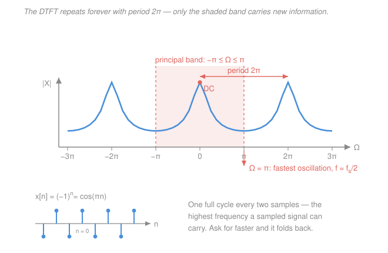

# Signals & Systems · Lesson 3.3: The discrete-time Fourier transform

> ⏱ ~15 min · Module 3: Sampling and the discrete-time world · Builds on: [3.1 Sampling and the Nyquist–Shannon theorem](03-01-sampling-nyquist-shannon.md), [3.2 Aliasing and reconstruction](03-02-aliasing-and-reconstruction.md), [2.3 The continuous-time Fourier transform](02-03-continuous-time-fourier-transform.md) · Unlocks: 3.4 (the DFT), 4.1 (the z-transform)

## Why this matters

After [3.1](03-01-sampling-nyquist-shannon.md) and [3.2](03-02-aliasing-and-reconstruction.md) your signal is no longer a curve — it is a list of numbers $x[n]$. Every question you had in the continuous world is still live: what frequencies are in there, what will this filter do to them, is that hum at 60 Hz. The **discrete-time Fourier transform (DTFT)** is the tool that answers them, and it is the last conceptual step before everything a computer actually runs — the DFT ([3.4](03-04-discrete-fourier-transform.md)), the FFT ([3.5](03-05-the-fft.md)), and the z-transform ([4.1](04-01-z-transform-and-roc.md)). It also delivers the punchline of this whole module: a discrete signal's spectrum is **periodic**, and that periodicity *is* the aliasing you already met, viewed from the other side.

## The idea

The recipe is the one from [2.3](02-03-continuous-time-fourier-transform.md), unchanged: to find out how much of frequency $\Omega$ is in a signal, multiply the signal by $e^{-j\Omega n}$ (a probe rotating at that frequency) and add up the result. Constructive interference means "yes, that frequency is present"; cancellation means "no". The only edit is that time is now a list, so $\int dt$ becomes $\sum_n$.

But one thing genuinely changes, and it changes everything. In continuous time, frequency $\omega$ is *radians per second* and there is no upper limit — you can always wiggle faster. In discrete time there is no "second" anywhere in sight; there is only the sample index $n$. So the natural frequency variable $\Omega$ is **radians per sample**, and now there *is* a ceiling: the fastest a list of numbers can possibly wiggle is up, down, up, down — one full cycle per two samples. That is $\Omega = \pi$. Ask for $\Omega = 1.1\pi$ and the samples you get back are indistinguishable from a slower wiggle. You have run out of distinct frequencies.

The spectrum has no choice but to reflect that: it must **repeat every $2\pi$**. This is exactly the spectral replication of [3.1](03-01-sampling-nyquist-shannon.md) — where sampling copied the original spectrum to every multiple of the sampling rate — seen from inside the discrete world instead of from the continuous one. Same single phenomenon, two vantage points. Continuous side: sampling smears copies of $X(j\omega)$ across the $\omega$ axis. Discrete side: the sequence's own spectrum is $2\pi$-periodic in $\Omega$. Neither is more true; they are the same picture with different axis labels.

There is a pleasing symmetry hiding here too. In [2.2](02-02-fourier-series-periodic-signals.md), a signal *periodic in time* had a *discrete* spectrum (harmonics). Now a signal *discrete in time* has a *periodic* spectrum. Periodicity in one domain and discreteness in the other are the same statement read forwards and backwards.

## The formal version

**Definition (DTFT).** For a sequence $x[n]$ ($n$ an integer),

$$\boxed{\;X(e^{j\Omega}) = \sum_{n=-\infty}^{\infty} x[n]\,e^{-j\Omega n}\;}$$

where $\Omega$ is the **discrete-time frequency in radians per sample**. *In words: slide the whole sequence against a rotating probe of frequency $\Omega$ and total up the agreement.* The result is a **continuous** function of $\Omega$ (you may ask about any frequency you like) that is generally complex: $\lvert X(e^{j\Omega})\rvert$ is the magnitude spectrum, $\angle X(e^{j\Omega})$ the phase.

**Inverse DTFT.**

$$x[n] = \frac{1}{2\pi}\int_{2\pi} X(e^{j\Omega})\,e^{j\Omega n}\,d\Omega$$

*In words: rebuild the sequence by adding up all its frequency components.* The notation $\int_{2\pi}$ means the integral runs over **any** interval of length $2\pi$ — usually $[-\pi,\pi]$ or $[0,2\pi]$ — because, as we are about to prove, the integrand repeats and one period contains the whole story.

**Why "$X(e^{j\Omega})$" and not "$X(\Omega)$"?** It looks like fussy notation and it is not. In [4.1](04-01-z-transform-and-roc.md) you will define the z-transform $X(z) = \sum_n x[n] z^{-n}$ for complex $z$. Setting $z = e^{j\Omega}$ — a point on the **unit circle** of the complex plane — gives exactly the sum above. Writing the argument as $e^{j\Omega}$ records that fact: *the DTFT is the z-transform evaluated on the unit circle.* It also explains the periodicity for free, since going once around the circle ($\Omega \to \Omega + 2\pi$) returns you to the same point $z$.

**The defining property: $2\pi$-periodicity.** Because $n$ is an **integer**, $e^{-j2\pi n} = 1$, so

$$X\!\left(e^{j(\Omega+2\pi)}\right) = \sum_n x[n]e^{-j(\Omega+2\pi)n} = \sum_n x[n]e^{-j\Omega n}\underbrace{e^{-j2\pi n}}_{=\,1} = X(e^{j\Omega}).$$

*In words: shifting the frequency by $2\pi$ radians per sample changes nothing at all.* One line, and it is the whole character of discrete-time frequency. There are only $2\pi$ radians-per-sample worth of distinct frequencies in existence; everything else is a relabelling. (The continuous-time proof fails at exactly this step: $t$ is not an integer, so $e^{-j2\pi t} \neq 1$, and $X(j\omega)$ need not repeat.)

**Reading the frequency axis.** Within one period, take $-\pi \le \Omega \le \pi$ (the **principal band**):

- $\Omega = 0$ — **DC**: $e^{j0n} = 1$, a constant sequence. $X(e^{j0}) = \sum_n x[n]$ is just the sum of the samples.
- $\Omega$ small — slow oscillation, many samples per cycle.
- $\Omega = \pi$ — the **fastest possible discrete oscillation**. Here $e^{j\pi n} = \cos(\pi n) + j\sin(\pi n) = (-1)^n$, since $\sin(\pi n) = 0$ for every integer $n$. So the highest discrete frequency is the alternating sequence $+1, -1, +1, -1,\dots$ — one cycle per two samples, and there is nothing faster.
- $\Omega$ beyond $\pi$ — you are **folding back**, which is [3.2](03-02-aliasing-and-reconstruction.md)'s aliasing in its native habitat: $\Omega = 1.9\pi$ is the same sequence as $\Omega = -0.1\pi$.

**Back to physical units.** Sampling $x(t)$ every $T$ seconds ($f_s = 1/T$ samples per second) gives $x[n] = x(nT)$, so a continuous tone $e^{j\omega t}$ becomes $e^{j\omega T n}$, i.e.

$$\Omega = \omega T = \frac{2\pi f}{f_s} \qquad\text{(rad/sample)}.$$

*In words: divide the physical frequency by the sample rate and scale by $2\pi$.* Then $\Omega = \pi \iff f = f_s/2$: **the top of the discrete frequency axis is the Nyquist frequency**, precisely as [3.1](03-01-sampling-nyquist-shannon.md) promised. A tone at $\Omega = \pi/4$ sampled at $f_s = 48$ kHz sits at $f = 6$ kHz.

**Convergence.** The sum converges uniformly whenever $x[n]$ is **absolutely summable**, $\sum_n \lvert x[n]\rvert < \infty$; finite-energy sequences ($\sum_n \lvert x[n]\rvert^2 < \infty$) converge in the mean-square sense. Neither covers a constant or a pure sinusoid, which never die out — so, exactly as in [2.3](02-03-continuous-time-fourier-transform.md) and [`fourier-analysis` 3.3](../../fourier-analysis/lessons/03-03-fourier-transforms-distributions.md), we allow **impulses in $\Omega$** and get transforms in the distributional sense.

**Essential pairs.**

| $x[n]$ | $X(e^{j\Omega})$ | comment |
|---|---|---|
| $\delta[n]$ | $1$ | one sample, perfectly flat — every frequency in equal measure |
| $\delta[n-n_0]$ | $e^{-j\Omega n_0}$ | magnitude 1, phase linear in $\Omega$: a shift is pure delay |
| $a^n u[n]$, $\lvert a\rvert < 1$ | $\dfrac{1}{1 - a e^{-j\Omega}}$ | the workhorse — derived below |
| $1$ for all $n$ | $2\pi\!\!\displaystyle\sum_{k=-\infty}^{\infty}\!\!\delta(\Omega - 2\pi k)$ | DC only, and periodic as it must be |
| $e^{j\Omega_0 n}$ | $2\pi\!\!\displaystyle\sum_{k=-\infty}^{\infty}\!\!\delta(\Omega - \Omega_0 - 2\pi k)$ | one spike per period |
| $x[n]=1$ for $0 \le n \le N-1$, else 0 | $e^{-j\Omega(N-1)/2}\,\dfrac{\sin(\Omega N/2)}{\sin(\Omega/2)}$ | Dirichlet kernel — the "aliased sinc" |

**Deriving the workhorse.** For $x[n] = a^n u[n]$ with $\lvert a\rvert < 1$, the step $u[n]$ kills every negative index, so

$$X(e^{j\Omega}) = \sum_{n=0}^{\infty} a^n e^{-j\Omega n} = \sum_{n=0}^{\infty}\left(a e^{-j\Omega}\right)^{n} = \frac{1}{1 - a e^{-j\Omega}},$$

a geometric series with ratio $r = ae^{-j\Omega}$, summable because $\lvert r\rvert = \lvert a\rvert \lvert e^{-j\Omega}\rvert = \lvert a \rvert < 1$ for every $\Omega$. *In words: a decaying exponential sequence has a smooth, pole-free spectrum, and the whole derivation is one geometric series.*

**On the rectangular pulse.** Summing the same way, $\sum_{n=0}^{N-1}e^{-j\Omega n} = \dfrac{1 - e^{-j\Omega N}}{1 - e^{-j\Omega}}$; pulling a half-angle factor out of top and bottom via $1 - e^{-j\theta} = e^{-j\theta/2}\left(2j\sin\tfrac{\theta}{2}\right)$ gives the table entry. This is the discrete cousin of the box-to-sinc pair from [2.3](02-03-continuous-time-fourier-transform.md): near $\Omega = 0$ the denominator $\sin(\Omega/2) \approx \Omega/2$, so it *is* a sinc there — but unlike a true sinc it repeats every $2\pi$, which is why it is called the aliased sinc. At $\Omega \to 0$ its value is $N$, the sum of the samples, as it must be.

**Properties (the short list).** With $x[n] \leftrightarrow X(e^{j\Omega})$ and $h[n] \leftrightarrow H(e^{j\Omega})$:

| property | statement |
|---|---|
| linearity | $a\,x_1[n] + b\,x_2[n] \;\leftrightarrow\; a X_1(e^{j\Omega}) + b X_2(e^{j\Omega})$ |
| time shift | $x[n-n_0] \;\leftrightarrow\; e^{-j\Omega n_0} X(e^{j\Omega})$ |
| **convolution** | $(x * h)[n] \;\leftrightarrow\; X(e^{j\Omega})\,H(e^{j\Omega})$ |

The last one is why the DTFT is worth having. Proof in one line: substitute $y[n] = \sum_k x[k]h[n-k]$ into the definition, swap the sums, and let $m = n-k$:

$$Y(e^{j\Omega}) = \sum_k x[k]\sum_m h[m]e^{-j\Omega(m+k)} = \underbrace{\sum_k x[k]e^{-j\Omega k}}_{X(e^{j\Omega})}\;\underbrace{\sum_m h[m]e^{-j\Omega m}}_{H(e^{j\Omega})}.$$

The convolution sum you ground out by hand in [1.5](01-05-convolution-discrete-time.md) is *multiplication* here. $H(e^{j\Omega})$ is the **frequency response** of the discrete system — the discrete twin of $H(j\omega)$ from [2.1](02-01-eigenfunctions-frequency-response.md).

One more freebie: if $x[n]$ is **real**, then $X(e^{-j\Omega}) = X(e^{j\Omega})^*$, so the magnitude spectrum is even. Combined with periodicity, everything is determined by $0 \le \Omega \le \pi$ — which is why real-signal spectra are almost always plotted on just that half-band.

## Picture

## Worked examples

**Example 1 (mechanical — a decaying exponential).** Take $x[n] = \left(\tfrac12\right)^n u[n]$. Straight from the workhorse pair with $a = \tfrac12$:

$$X(e^{j\Omega}) = \frac{1}{1 - \tfrac12 e^{-j\Omega}}.$$

For the magnitude, expand the denominator using $e^{-j\Omega} = \cos\Omega - j\sin\Omega$:

$$\left\lvert 1 - a e^{-j\Omega}\right\rvert^2 = (1 - a\cos\Omega)^2 + (a\sin\Omega)^2 = 1 - 2a\cos\Omega + a^2,$$

so $\lvert X(e^{j\Omega})\rvert = \big(1 - 2a\cos\Omega + a^2\big)^{-1/2}$. With $a = \tfrac12$:

| $\Omega$ | $\lvert X\rvert$ | |
|---|---|---|
| $0$ | $1/\sqrt{1 - 1 + 0.25} = 2$ | DC gain, and indeed $\sum_n (\tfrac12)^n = 2$ ✓ |
| $\pi/2$ | $1/\sqrt{1 - 0 + 0.25} \approx 0.894$ | |
| $\pi$ | $1/\sqrt{1 + 1 + 0.25} = 1/1.5 = 2/3$ | the Nyquist end |

Three sanity checks. First, the DC value matches summing the sequence directly. Second, the magnitude leans on $\Omega$ only through $\cos\Omega$, which is manifestly $2\pi$-periodic and even — periodicity and conjugate symmetry, visible in the formula. Third, big at $\Omega=0$ and small at $\Omega=\pi$ means this sequence is dominated by slow content: if it were a filter's impulse response, it would be **low-pass**. That is exactly the spectrum shape drawn in the Picture.

**Example 2 (why you'd care — a two-point averager).** Smooth a noisy sequence by averaging neighbours: $y[n] = \tfrac12\big(x[n] + x[n-1]\big)$, an LTI system with impulse response $h[n] = \tfrac12\big(\delta[n] + \delta[n-1]\big)$. By linearity and the shift pair,

$$H(e^{j\Omega}) = \tfrac12\left(1 + e^{-j\Omega}\right) = \tfrac12 e^{-j\Omega/2}\left(e^{j\Omega/2} + e^{-j\Omega/2}\right) = e^{-j\Omega/2}\cos\!\left(\tfrac{\Omega}{2}\right),$$

using $e^{j\theta} + e^{-j\theta} = 2\cos\theta$. So $\lvert H(e^{j\Omega})\rvert = \lvert\cos(\Omega/2)\rvert$: gain **1** at DC ($\Omega=0$) and gain **0** at $\Omega = \pi$. A low-pass filter that annihilates the fastest discrete frequency exactly.

Now use the convolution property. Feed in $x[n] = 1 + (-1)^n$ — a constant plus a full-amplitude Nyquist wiggle. Frequency-domain reasoning: the DC part gets gain 1, the $\Omega=\pi$ part gets gain 0, so the output should be the constant $1$. Time-domain check:

$$y[n] = \tfrac12\Big(1 + (-1)^n + 1 + (-1)^{n-1}\Big) = \tfrac12\big(2 + 0\big) = 1,$$

since $(-1)^n$ and $(-1)^{n-1}$ are always opposite. ✓ The filter's whole behaviour was readable off $H(e^{j\Omega})$ without convolving anything — that is the payoff.

## Watch out

- **You might think $\Omega$ is a frequency in rad/s.** It is radians per *sample*, and a sample index carries no seconds. A bare $\Omega$ tells you nothing physical until someone hands you $f_s$; only then does $f = \Omega f_s / 2\pi$ mean hertz. The same sequence sampled at 8 kHz or 48 kHz has the *identical* DTFT and two very different physical spectra.
- **You might think bigger $\Omega$ always means faster.** Only up to $\pi$. Past that you are on the way back down: $\Omega = 1.9\pi$ produces the same samples as $\Omega = -0.1\pi$, a *slow* oscillation. Discrete frequency is a circle, not a line — which is exactly what "$z$ on the unit circle" is telling you, and it is also why the inverse transform integrates over **one period only**, never from $-\infty$ to $\infty$.
- **You might expect $X(e^{j\Omega})$ to be a discrete list too.** It is not: a discrete signal has a *continuous* (and periodic) spectrum. Getting a finite list of numbers back out requires sampling this curve, which is precisely the DFT of [3.4](03-04-discrete-fourier-transform.md).

## One-liner

> The DTFT is the same correlate-against-$e^{-j\Omega n}$ recipe with an integral swapped for a sum — but because $n$ is an integer the spectrum must repeat every $2\pi$, so discrete frequency runs out at $\Omega = \pi$: one cycle per two samples, which is Nyquist wearing different clothes.

## Problems

**P1 (🟢)** Let $x[n] = (0.8)^n u[n]$. (a) Write $X(e^{j\Omega})$. (b) Evaluate $\lvert X\rvert$ at $\Omega = 0$ and $\Omega = \pi$, and say whether this sequence is low-pass or high-pass in character. (c) If these samples came from sampling at $f_s = 8$ kHz, what physical frequency does $\Omega = \pi/4$ correspond to?

**P2 (🟡)** The **first-difference** system is $y[n] = x[n] - x[n-1]$. (a) Find $H(e^{j\Omega})$ and show $\lvert H(e^{j\Omega})\rvert = 2\lvert\sin(\Omega/2)\rvert$. (b) Give the gain at $\Omega = 0$ and at $\Omega = \pi$ and classify the filter. (c) Confirm both gains by pushing $x[n] = 1$ and $x[n] = (-1)^n$ through the difference equation directly.

**P3 (🔴)** Find the DTFT of the two-sided sequence $x[n] = a^{\lvert n\rvert}$ with $0 < a < 1$. Show that it is real, even, and $2\pi$-periodic, and check your answer at $\Omega = 0$ against summing the sequence directly.

Solutions

**P1** (a) The workhorse pair with $a = 0.8$ (legitimate, since $\lvert 0.8\rvert < 1$):

$$X(e^{j\Omega}) = \frac{1}{1 - 0.8\,e^{-j\Omega}}.$$

(b) At $\Omega = 0$, $e^{-j\Omega} = 1$, so $X = 1/(1-0.8) = 1/0.2 = 5$. At $\Omega = \pi$, $e^{-j\pi} = -1$, so $X = 1/(1+0.8) = 1/1.8 = 5/9 \approx 0.556$. The DC gain is $5 \big/ \tfrac59 = 9$ times the Nyquist gain, so slow content dominates: **low-pass**.

(c) $f = \dfrac{\Omega f_s}{2\pi} = \dfrac{(\pi/4)(8000)}{2\pi} = \dfrac{8000}{8} = 1000$ Hz.

*Check.* Both gains are real and positive, as they must be: at $\Omega = 0$ and $\Omega = \pi$ the probe $e^{-j\Omega n}$ is real ($1$ and $(-1)^n$), so the sum is real. And $X(e^{j0}) = \sum_n 0.8^n = 1/(1-0.8) = 5$ ✓. At $\Omega=\pi$ the sum is the alternating $\sum_n (-0.8)^n = 1/(1+0.8)$ ✓. Sanity on (c): $\Omega = \pi/4$ is one eighth of the way around a full $2\pi$ turn, and $f_s/8 = 1$ kHz ✓.

**P2** (a) The impulse response is $h[n] = \delta[n] - \delta[n-1]$, so by linearity and the shift pair $H(e^{j\Omega}) = 1 - e^{-j\Omega}$. Factor out the half angle:

$$1 - e^{-j\Omega} = e^{-j\Omega/2}\left(e^{j\Omega/2} - e^{-j\Omega/2}\right) = e^{-j\Omega/2}\cdot 2j\sin\!\left(\tfrac{\Omega}{2}\right),$$

using $e^{j\theta} - e^{-j\theta} = 2j\sin\theta$. Since $\lvert e^{-j\Omega/2}\rvert = 1$ and $\lvert j\rvert = 1$,

$$\lvert H(e^{j\Omega})\rvert = 2\left\lvert\sin\!\left(\tfrac{\Omega}{2}\right)\right\rvert.$$

(b) At $\Omega = 0$: $2\sin 0 = 0$. At $\Omega = \pi$: $2\sin(\pi/2) = 2$. Zero gain at DC, maximum gain at the fastest frequency — a **high-pass** filter. (It is the discrete derivative, and differentiation always favours fast wiggles.)

(c) Constant input $x[n] = 1$: $y[n] = 1 - 1 = 0$, matching gain 0 ✓. Nyquist input $x[n] = (-1)^n$: $y[n] = (-1)^n - (-1)^{n-1} = (-1)^n + (-1)^n = 2(-1)^n$, an output twice the input, matching gain 2 ✓.

*Check.* This is the exact mirror of Example 2's averager, whose magnitude was $\lvert\cos(\Omega/2)\rvert$ — sum versus difference, low-pass versus high-pass, and the two magnitudes (after the averager's factor $\tfrac12$) satisfy $\cos^2(\Omega/2) + \sin^2(\Omega/2) = 1$.

**P3** Split the sum at $n=0$, being careful not to double-count that term:

$$X(e^{j\Omega}) = \sum_{n=-\infty}^{\infty} a^{\lvert n\rvert}e^{-j\Omega n} = \sum_{n=0}^{\infty}a^n e^{-j\Omega n} + \sum_{n=1}^{\infty}a^{n}e^{\,j\Omega n},$$

where the second sum used $m = -n$ on the negative side. Both are geometric with ratio of modulus $a < 1$:

$$X(e^{j\Omega}) = \frac{1}{1 - ae^{-j\Omega}} + \frac{ae^{j\Omega}}{1 - ae^{j\Omega}}.$$

Put them over the common denominator $\left(1 - ae^{-j\Omega}\right)\left(1 - ae^{j\Omega}\right) = 1 - a\left(e^{j\Omega} + e^{-j\Omega}\right) + a^2 = 1 - 2a\cos\Omega + a^2$. The numerator is

$$\left(1 - ae^{j\Omega}\right) + ae^{j\Omega}\left(1 - ae^{-j\Omega}\right) = 1 - ae^{j\Omega} + ae^{j\Omega} - a^2 = 1 - a^2,$$

the exponentials cancelling exactly. Hence

$$X(e^{j\Omega}) = \frac{1 - a^2}{1 - 2a\cos\Omega + a^2}.$$

It depends on $\Omega$ only through $\cos\Omega$, so it is **real**, **even** ($\cos$ is even), and **$2\pi$-periodic** — all three at a glance. It is also positive, since $0 < a < 1$ makes $1 - 2a\cos\Omega + a^2 \ge (1-a)^2 > 0$.

*Check at $\Omega = 0$.* The formula gives $\dfrac{1-a^2}{(1-a)^2} = \dfrac{(1-a)(1+a)}{(1-a)^2} = \dfrac{1+a}{1-a}$. Summing directly: $\sum_n a^{\lvert n\rvert} = 1 + 2\sum_{n=1}^{\infty}a^n = 1 + \dfrac{2a}{1-a} = \dfrac{1+a}{1-a}$ ✓. (Concretely at $a = \tfrac12$ both give $3$.) Being real and even is what we expect: $x[n]$ is itself real and even, and a real even sequence always has a real even spectrum.

## Flashback

**From Lesson 1.5 (Convolution in discrete time):** A causal LTI system has impulse response $h[n] = \delta[n] + 2\delta[n-1]$. Compute $y = x * h$ for the input $x[n] = \{2, -1, 3\}$ (samples at $n = 0, 1, 2$; zero elsewhere), and verify your answer with a DC check using today's convolution property.

Solution

The impulse response is $h[0] = 1$, $h[1] = 2$, zero elsewhere, so the convolution sum $y[n] = \sum_k x[k]h[n-k]$ collapses to just two terms, $y[n] = x[n] + 2x[n-1]$:

$$\begin{aligned}
y[0] &= x[0] = 2,\\
y[1] &= x[1] + 2x[0] = -1 + 4 = 3,\\
y[2] &= x[2] + 2x[1] = 3 - 2 = 1,\\
y[3] &= 2x[2] = 6,
\end{aligned}$$

and $y[n] = 0$ elsewhere. So $y[n] = \{2, 3, 1, 6\}$ for $n = 0,1,2,3$.

*Check (length).* Convolving a length-3 sequence with a length-2 sequence gives length $3 + 2 - 1 = 4$ ✓.

*Check (DC, via today's lesson).* Evaluating the convolution property at $\Omega = 0$ says the sum of the output samples equals the product of the two sums, since $Y(e^{j0}) = X(e^{j0})H(e^{j0})$. Here $\sum x[n] = 2 - 1 + 3 = 4$ and $\sum h[n] = 1 + 2 = 3$, so the output must sum to $12$. And indeed $2 + 3 + 1 + 6 = 12$ ✓.

## Connections

- **Backward:** the recipe is [2.3](02-03-continuous-time-fourier-transform.md)'s Fourier transform with $\int dt \to \sum_n$, and the convolution property closes the loop on the convolution sum of [1.5](01-05-convolution-discrete-time.md) — grinding sums becomes multiplying spectra. The $2\pi$-periodicity is [3.1](03-01-sampling-nyquist-shannon.md)'s spectral replication and [3.2](03-02-aliasing-and-reconstruction.md)'s folding, restated from inside the discrete world.
- **Forward:** [3.4](03-04-discrete-fourier-transform.md) samples this continuous curve at $N$ evenly spaced points to get something a computer can hold, and [3.5](03-05-the-fft.md) computes those points fast. [4.1](04-01-z-transform-and-roc.md) lets $z$ leave the unit circle, and the DTFT becomes the special case $z = e^{j\Omega}$ — which is why [4.2](04-02-discrete-transfer-functions-z-plane.md) can read a filter's frequency response geometrically off the pole–zero map, and why [4.4](04-04-filter-design-basics.md)'s designs are stated in terms of $\Omega$.
- **Sideways (Fourier analysis):** the duality is exact. A periodic function of time has discrete Fourier coefficients ([`fourier-analysis` 1.1](../../fourier-analysis/lessons/01-01-periodic-functions-fourier-coefficients.md)); here a discrete sequence has a periodic spectrum. In fact $X(e^{j\Omega})$, being $2\pi$-periodic in $\Omega$, *is* a Fourier series — and the samples $x[n]$ are its coefficients. The transform and the series are one construction seen from two sides.
