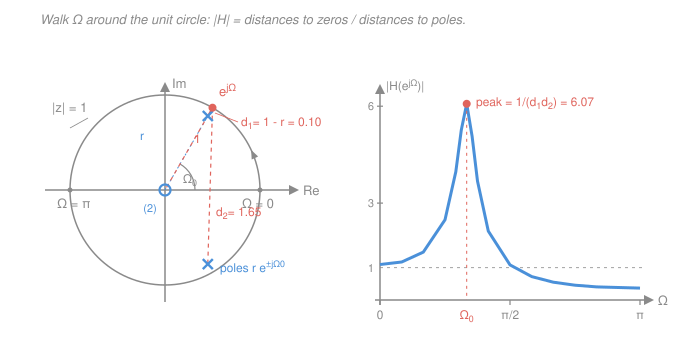

# Signals & Systems · Lesson 4.2: Discrete transfer functions and the z-plane

> ⏱ ~15 min · Module 4: The z-transform and filtering · Builds on: [4.1 The z-transform and its ROC](04-01-z-transform-and-roc.md), [2.5 Transfer functions: poles, zeros, and stability](02-05-transfer-functions-poles-zeros.md), [3.3 The discrete-time Fourier transform](03-03-discrete-time-fourier-transform.md) · Unlocks: 4.3 (difference equations and realizations)

## Why this matters

You are about to get the single most useful picture in digital signal processing. Mark a handful of ×'s and ○'s on a plane, and without computing anything you can say: is this filter stable, does it ring, at what rate does it ring, is it low-pass or high-pass, and roughly what does its magnitude response look like. Engineers *design* filters by dragging those marks around.

[2.5](02-05-transfer-functions-poles-zeros.md) did this for continuous time, where the verdict was "poles in the left half-plane." The discrete story is the same idea with a circle instead of a half-plane — and, pleasingly, the reasoning behind it is *simpler* than the continuous version. The genuinely new payoff is a construction with no continuous-time equivalent in ease: reading the whole frequency response off the picture using nothing but a ruler.

## The idea

Two moves, both borrowed from Module 2 and re-pointed at the z-plane.

**Move 1: modes.** An LTI system's impulse response, broken into pieces, is a sum of terms — one per pole. In continuous time a pole at $s = p$ contributes $e^{pt}$, and you had to inspect the *real part* of $p$ to know whether that grows or decays. In discrete time a pole at $z = p$ contributes $p^{\,n}$ — literally the pole number, raised to the sample index. Does $p^n$ die out? Only if $|p| < 1$. That is the entire stability argument, and it needs no exponentials and no case analysis. Multiply a number smaller than one by itself forever and it goes to zero; multiply a number bigger than one by itself forever and it explodes. So **the boundary is the unit circle**, and it is a boundary for the dumbest possible reason.

**Move 2: distances.** In [4.1](04-01-z-transform-and-roc.md) you saw that the DTFT is just the z-transform evaluated on the unit circle: $H(e^{j\Omega})$ is $H(z)$ with $z$ standing at angle $\Omega$ on that circle. So the frequency response isn't a separate object — it is a *walk*. Start at $z = 1$ (the point $\Omega = 0$, DC), stroll counterclockwise, and at $\Omega = \pi$ you're at $z = -1$, the fastest discrete frequency.

Now recall that a rational $H(z)$ is a product of factors $(z - \text{zero})$ over a product of factors $(z - \text{pole})$. Each factor's magnitude is a *distance* in the plane. So as you walk, the gain is a running product of distances to the ○'s divided by distances to the ×'s. Pass close to a pole and you're dividing by something small — the gain spikes. Pass close to a zero and you're multiplying by something small — the gain dips. Land exactly *on* a zero and the gain is zero: that frequency is annihilated.

That's the whole lesson. A filter is a landscape of magnets (poles, which lift the response) and sinkholes (zeros, which pull it down), and the frequency response is the elevation profile along one circular hiking trail.

## The formal version

### The system function

For a discrete LTI system with impulse response $h[n]$, the **system function** (discrete transfer function) is the z-transform of $h[n]$:

$$H(z) = \sum_{n=-\infty}^{\infty} h[n]\,z^{-n} = \frac{Y(z)}{X(z)},$$

where $X(z)$, $Y(z)$ are the z-transforms of input and output. *In words: convolution $y = x * h$ in time becomes plain multiplication $Y = XH$ in the z-domain, exactly as [1.5](01-05-convolution-discrete-time.md)'s sum becomes a product.* Every $H(z)$ carries a region of convergence; throughout this lesson we take the system **causal** ($h[n] = 0$ for $n < 0$), so by [4.1](04-01-z-transform-and-roc.md) the ROC is the *outside* of a disc: $|z| > \max_i |p_i|$.

### Two conventions, and how to switch

Textbooks split on how to write a rational $H(z)$, and this trips up everyone at least once.

**Negative powers** (the DSP / difference-equation convention — what you read straight off a recursion, and what MATLAB and SciPy expect):

$$H(z) = \frac{b_0 + b_1 z^{-1} + \cdots + b_M z^{-M}}{1 + a_1 z^{-1} + \cdots + a_N z^{-N}}.$$

**Positive powers** (the pole–zero convention — what you factor and plot):

$$H(z) = K\,\frac{(z - z_1)(z - z_2)\cdots}{(z - p_1)(z - p_2)\cdots}.$$

To convert, **multiply numerator and denominator by $z^{L}$ with $L = \max(M, N)$**, then factor. Concretely:

$$H(z) = \frac{1 + z^{-2}}{1 - 0.9\,z^{-1}} \;\xrightarrow{\;\times\, z^2/z^2\;}\; \frac{z^2 + 1}{z^2 - 0.9z} = \frac{(z - j)(z + j)}{z\,(z - 0.9)}.$$

Zeros at $z = \pm j$; poles at $z = 0$ **and** $z = 0.9$. Note what happened: the negative-power form showed one denominator root, but the system really has two poles — one of them sitting at the origin, invisible until you cleared the $z^{-1}$'s. *In words: the $z^{-1}$ form hides poles and zeros at $z = 0$; only the positive-power form shows you the true count.* After clearing, the number of zeros always equals the number of poles ($= L$).

### Poles, zeros, and the map

A **pole** is a value of $z$ where $|H(z)| \to \infty$ (a root of the denominator); a **zero** is where $H(z) = 0$ (a root of the numerator). Plotted in the complex **z-plane**, poles are marked $\times$ and zeros $\circ$, with a small superscript count for repeats. For a system with real coefficients $a_k, b_k$ — every physically realizable filter — complex poles and zeros come in **conjugate pairs**, so the map is always mirror-symmetric about the real axis.

### Stability

$$\boxed{\;\text{causal and BIBO-stable}\iff \text{every pole satisfies } |p| < 1\;}$$

*In words: for a causal system, all poles must sit strictly inside the unit circle.* The proof is Move 1 made precise. Partial-fraction $H(z)$ into first-order terms (distinct poles):

$$H(z) = \sum_k \frac{A_k}{1 - p_k z^{-1}} \quad\Longrightarrow\quad h[n] = \sum_k A_k\, p_k^{\,n}\, u[n],$$

and BIBO stability is $\sum_n |h[n]| < \infty$ (from [1.3](01-03-systems-and-properties.md)). For a single mode, $\sum_{n\ge 0} |p|^n$ is a geometric series: it converges to $1/(1-|p|)$ when $|p| < 1$ and diverges otherwise. Done — no integrals, no real parts.

Equivalently in ROC language: *stable* means the ROC contains the unit circle (so the DTFT exists); *causal* means the ROC is $|z| > \max|p_i|$; both at once forces $\max|p_i| < 1$.

**Contrast with the s-plane.** Same theorem, different geometry:

| | continuous ([2.5](02-05-transfer-functions-poles-zeros.md)) | discrete (here) |
|---|---|---|
| plane variable | $s = \sigma + j\omega$ | $z = re^{j\Omega}$ |
| mode from pole $p$ | $e^{pt}$ | $p^{\,n}$ |
| stable region | left half-plane, $\operatorname{Re} p < 0$ | inside unit circle, $\lvert p\rvert < 1$ |
| frequency axis | the $j\omega$ axis (a line) | the unit circle (a loop) |
| marginal | poles on the $j\omega$ axis | poles on the unit circle |

The two are linked by $z = e^{sT}$ ($T$ = sample period, seconds): the exponential map wraps the left half-plane onto the inside of the unit disc, and folds the infinite $j\omega$ axis onto a circle you can traverse in $2\pi$ — which is exactly why discrete spectra are $2\pi$-periodic ([3.3](03-03-discrete-time-fourier-transform.md)).

### Pole location ↔ mode behavior

Write a pole in polar form, $p = r e^{j\Omega_0}$. Then $p^{\,n} = r^{\,n} e^{j\Omega_0 n}$, and for a real-coefficient system the conjugate partner combines with it to give

$$h[n] \;\supset\; 2|A|\,r^{\,n}\cos(\Omega_0 n + \phi)\,u[n].$$

*In words: the **radius** $r$ sets how fast the mode decays, and the **angle** $\Omega_0$ sets how fast it oscillates (in radians per sample).* Two knobs, cleanly separated. Closer to the circle ($r \to 1$) means slower decay — more ringing.

| pole $p$ | mode $p^{\,n}$ | behavior |
|---|---|---|
| $0.9$ (real, positive) | $0.9^n$ | smooth decay, no sign changes |
| $0.5$ (real, positive, small $r$) | $0.5^n$ | fast smooth decay |
| $-0.9$ (real, **negative**) | $(-0.9)^n$ | decay with **alternating sign** — oscillation at $\Omega = \pi$ |
| $0.9\,e^{\pm j\pi/3}$ (conjugate pair) | $0.9^n\cos(\tfrac{\pi}{3}n + \phi)$ | damped sinusoid, 6 samples per cycle |
| $1$ (on the circle) | $1^n = 1$ | never decays — marginal, **not** stable |
| $-1$ (on the circle) | $(-1)^n$ | forever alternating — marginal |
| $1.1$ (outside) | $1.1^n$ | grows without bound |
| $0$ (origin) | $\delta[n]$-like | no dynamics at all — pure delay |

The **real negative pole is the row with no continuous-time analogue.** In the s-plane, a real pole gives $e^{pt}$, which never oscillates — oscillation requires an imaginary part. In the z-plane, $p = -0.9$ gives $-0.9,\ +0.81,\ -0.729,\ \ldots$: it flips sign every sample. And that is not an accident of the algebra — it *is* the conjugate-pair formula at $\Omega_0 = \pi$, since $(-r)^n = r^n\cos(\pi n)$. A negative real pole is a mode ringing at the highest frequency the sample rate can represent ([3.3](03-03-discrete-time-fourier-transform.md)), which is why such a filter comes out high-pass.

### The geometric frequency response

Here is the payoff. Evaluate the factored form on the unit circle, $z = e^{j\Omega}$:

$$\boxed{\;\bigl|H(e^{j\Omega})\bigr| = |K|\;\frac{\prod_k \bigl|e^{j\Omega} - z_k\bigr|}{\prod_i \bigl|e^{j\Omega} - p_i\bigr|}\;}$$

*In words: the gain at frequency $\Omega$ is the product of the distances from the point $e^{j\Omega}$ to every zero, divided by the product of the distances to every pole.* The phase is the matching sum:

$$\angle H(e^{j\Omega}) = \angle K + \sum_k \angle\bigl(e^{j\Omega} - z_k\bigr) - \sum_i \angle\bigl(e^{j\Omega} - p_i\bigr).$$

Since these are literal distances between points you have drawn, you can sketch $|H|$ with a ruler. Reading rules that follow immediately:

- **Poles near $\Omega = 0$** (i.e. near $z = +1$) → the shortest pole-distance happens at DC → **low-pass**.
- **Poles near $\Omega = \pi$** (near $z = -1$) → gain peaks at the top frequency → **high-pass**.
- **A conjugate pole pair at angle $\pm\Omega_0$** → gain peaks near $\Omega_0$ → **band-pass**, sharper as $r \to 1$.
- **A zero exactly on the unit circle at angle $\Omega_0$** → distance zero → $|H(e^{j\Omega_0})| = 0$ exactly. A perfect **notch**.
- **Anything at the origin** contributes distance $|e^{j\Omega} - 0| = 1$ for every $\Omega$ — it never changes $|H|$, only phase. Poles/zeros at $z=0$ are pure delay.

Only $\Omega \in [0, \pi]$ needs plotting: $|H|$ is $2\pi$-periodic and, for real coefficients, even in $\Omega$.

## Picture

## Worked examples

**Example 1 (the one-pole low-pass — every number checked).** Take the system of the module's boss problem, $y[n] = x[n] + 0.9\,y[n-1]$, whose system function is

$$H(z) = \frac{1}{1 - 0.9 z^{-1}} = \frac{z}{z - 0.9}.$$

One pole at $z = 0.9$, one zero at $z = 0$. Since $|0.9| < 1$, it is stable; $h[n] = 0.9^n u[n]$ decays smoothly.

Now walk the circle. The zero at the origin sits at distance $1$ from every point of the circle, so it drops out entirely and

$$\bigl|H(e^{j\Omega})\bigr| = \frac{1}{\bigl|e^{j\Omega} - 0.9\bigr|}.$$

- $\Omega = 0$: the point is $z = 1$, distance to the pole $= |1 - 0.9| = 0.1$, so $|H| = 1/0.1 = 10$.
- $\Omega = \pi/2$: the point is $z = j$, distance $= |{-0.9} + j| = \sqrt{0.81 + 1} = \sqrt{1.81} \approx 1.3454$, so $|H| \approx 0.7433$.
- $\Omega = \pi$: the point is $z = -1$, distance $= |-1 - 0.9| = 1.9$, so $|H| = 1/1.9 \approx 0.5263$.

Is the fall monotonic? Square the distance: $|e^{j\Omega} - 0.9|^2 = 1 - 1.8\cos\Omega + 0.81 = 1.81 - 1.8\cos\Omega$, which increases steadily as $\Omega$ runs $0 \to \pi$. So $|H|$ falls monotonically from $10$ to $0.526$ — a **low-pass filter**, with a DC-to-Nyquist gain ratio of $10/0.5263 \approx 19$. All of that from one distance.

**Example 2 (a resonator — the figure, computed).** Put a conjugate pole pair at $r = 0.9$, $\Omega_0 = \pi/3$, with a double zero at the origin:

$$H(z) = \frac{z^2}{(z - 0.9e^{j\pi/3})(z - 0.9e^{-j\pi/3})} = \frac{z^2}{z^2 - 0.9z + 0.81} = \frac{1}{1 - 0.9z^{-1} + 0.81 z^{-2}}$$

(using $2r\cos\Omega_0 = 2(0.9)(0.5) = 0.9$ and $r^2 = 0.81$). Stable: both poles have $|p| = 0.9 < 1$. The impulse response is a damped sinusoid $\propto 0.9^n\cos(\tfrac{\pi}{3}n + \phi)$ — it rings for roughly $1/(1-0.9) = 10$ samples' worth of decay.

Now the ruler. The two zeros at the origin again contribute distance $1$ each, so $|H| = 1/(d_1 d_2)$ where $d_1, d_2$ are the distances to the two poles.

- **At $\Omega = \Omega_0 = \pi/3$:** the point $e^{j\pi/3}$ lies on the *same ray* as the pole $0.9e^{j\pi/3}$, so $d_1 = 1 - 0.9 = 0.1$ exactly. The far pole is at $0.45 - j0.7794$, giving $d_2 = |0.05 + j1.6454| \approx 1.6462$. Hence $|H| \approx 1/(0.1 \times 1.6462) = 1/0.16462 \approx 6.07$.
- **At $\Omega = 0$:** distance to each pole is $|1 - 0.45 \mp j0.7794| \approx 0.9539$, so $|H| \approx 1/0.91 \approx 1.099$.
- **At $\Omega = \pi$:** distance to each pole is $|-1 - 0.45 \mp j0.7794| \approx 1.6462$, so $|H| \approx 1/2.71 \approx 0.369$.

A **band-pass** centered at $\Omega_0$: gain $6.07$ in the band versus $1.10$ at DC and $0.37$ at Nyquist. And notice *why* the peak is tall — one short distance, $1 - r$, in the denominator. Push $r$ to $0.99$ and that distance becomes $0.01$: a ten-times-sharper, ten-times-longer-ringing resonator, at the price of sitting ten times closer to instability. That trade — selectivity against ringing and margin — is the whole of filter design, and it is why [4.4](04-04-filter-design-basics.md) exists.

## Watch out

- **You might think a pole *on* the unit circle is "borderline stable, close enough."** It is not stable. A pole at $z = 1$ gives $h[n] = u[n]$, so $\sum_n |h[n]| = \infty$: a bounded input (a step) produces an unbounded output. The condition is the strict inequality $|p| < 1$, and $|p| = 1.001$ is genuinely unstable — $1.001^{\,n}$ passes $10^{4}$ before $n = 10^{4}$. "Just outside" is not a mild defect.
- **You might count poles from the $z^{-1}$ form and get it wrong.** $\dfrac{1 + z^{-2}}{1 - 0.9z^{-1}}$ looks like one pole; it has two (at $z = 0.9$ and $z = 0$). Always clear to positive powers before you count or plot. Consolation: origin poles and zeros never affect $|H(e^{j\Omega})|$ — their distance to the circle is always $1$ — so they only cost you delay, not shape.
- **You might expect the peak to land exactly at the pole's angle.** It lands *near* it. The near-pole distance is minimized exactly at $\Omega_0$, but the far pole's distance is still changing, so the true maximum drifts slightly — in Example 2 the peak sits at about $59.8^\circ$ rather than $60^\circ$, converging to $\Omega_0$ as $r \to 1$. Nearby zeros can pull it further. Read the map for the *shape*; compute if you need the exact peak.

## One-liner

> A pole is a magnet and a zero is a sinkhole: walk $\Omega$ around the unit circle and your gain is (distances to zeros)/(distances to poles) — and if every pole stays strictly inside the circle, $p^{\,n}$ dies and the system never blows up.

## Problems

**P1 (🟢)** A causal system has $H(z) = \dfrac{1 - 0.5z^{-1}}{1 + 0.7z^{-1}}$. (a) Rewrite it in positive powers and list all poles and zeros. (b) Is it stable? (c) Compute the DC gain $|H(e^{j0})|$ and the Nyquist gain $|H(e^{j\pi})|$, and classify the filter.

**P2 (🟡)** A causal system has a conjugate pole pair at $0.9e^{\pm j\pi/4}$ and a double zero at $z = 0$. (a) Write $H(z)$ in both conventions. (b) Using the distance construction, compute $|H|$ at $\Omega = 0$, $\Omega = \pi/4$, and $\Omega = \pi$. (c) What is it, and how does the peak compare with Example 2's?

**P3 (🔴)** Design a causal filter that removes the frequency $\Omega_0 = \pi/3$ *completely* while leaving all other frequencies nearly untouched (a notch). (a) Place zeros to kill $\pi/3$ and write the resulting all-zero $H(z)$; check its gains at $\Omega = 0$ and $\Omega = \pi$ and explain why this is not yet "nearly untouched." (b) Add a conjugate pole pair at $0.95e^{\pm j\pi/3}$ and recompute those two gains. Is it still stable?

Solutions

**P1** (a) Multiply top and bottom by $z$ (here $M = N = 1$, so $L = 1$):

$$H(z) = \frac{1 - 0.5z^{-1}}{1 + 0.7z^{-1}}\cdot\frac{z}{z} = \frac{z - 0.5}{z + 0.7}.$$

One zero at $z = 0.5$, one pole at $z = -0.7$.

(b) $|-0.7| = 0.7 < 1$, strictly inside the unit circle, and the system is causal → **stable**.

(c) DC ($z = 1$): by distances, numerator $|1 - 0.5| = 0.5$, denominator $|1 - (-0.7)| = 1.7$, so

$$|H(e^{j0})| = \frac{0.5}{1.7} \approx 0.294.$$

Nyquist ($z = -1$): numerator $|-1 - 0.5| = 1.5$, denominator $|-1 + 0.7| = 0.3$, so

$$|H(e^{j\pi})| = \frac{1.5}{0.3} = 5.$$

**High-pass**, by a factor of $5/0.294 \approx 17$. *Check against the map:* the pole is real and **negative**, i.e. at angle $\Omega = \pi$ — the walk passes closest to it at the top frequency, lifting the response there. Meanwhile the zero at $z = 0.5$ sits at angle $0$, dragging DC down. Both marks agree: high-pass. ✓

**P2** (a) With $r = 0.9$ and $\Omega_0 = \pi/4$: the denominator is $z^2 - 2r\cos(\Omega_0)z + r^2$ with $2(0.9)\cos(\pi/4) = 1.8/\sqrt2 \approx 1.2728$ and $r^2 = 0.81$:

$$H(z) = \frac{z^2}{z^2 - 1.2728\,z + 0.81} = \frac{1}{1 - 1.2728\,z^{-1} + 0.81\,z^{-2}}.$$

(b) The two zeros at the origin sit at distance $1$ from every point of the circle, so $|H| = 1/(d_1 d_2)$, with the poles at $0.9e^{\pm j\pi/4} = 0.6364 \pm j0.6364$.

*At $\Omega = 0$* ($z = 1$): each distance is $|1 - 0.6364 \mp j0.6364| = \sqrt{0.3636^2 + 0.6364^2} = \sqrt{0.5372} \approx 0.7330$. Product $\approx 0.5372$, so $|H| \approx 1.862$.

*At $\Omega = \pi/4$*: the point $e^{j\pi/4}$ is on the same ray as the near pole, so $d_1 = 1 - 0.9 = 0.1$ exactly. The far pole is $0.6364 - j0.6364$, so
$$d_2 = \bigl|(0.7071 - 0.6364) + j(0.7071 + 0.6364)\bigr| = |0.0707 + j1.3435| \approx 1.3454,$$
giving $|H| \approx 1/(0.1 \times 1.3454) = 1/0.13454 \approx 7.43$.

*At $\Omega = \pi$* ($z = -1$): each distance is $|-1 - 0.6364 \mp j0.6364| = \sqrt{1.6364^2 + 0.6364^2} = \sqrt{3.0828} \approx 1.7558$. Product $\approx 3.0828$, so $|H| \approx 0.324$.

(c) A **band-pass** centered at $\Omega = \pi/4$ — half the center frequency of Example 2, so it passes a slower oscillation (8 samples per cycle instead of 6). Its peak, $7.43$, is *higher* than Example 2's $6.07$ even though $r$ is identical: the near-pole distance is $0.1$ in both cases, but here the two poles are closer together (angle $\pi/4$ instead of $\pi/3$), so the *far*-pole distance at the peak is smaller ($1.345$ vs. $1.646$) and divides less away.

*Check.* Directly from the polynomial at $z = e^{j\pi/4}$: $z^2 = j$, $-1.2728z = -0.9 - j0.9$, plus $0.81$ gives $-0.09 + j0.1$, whose magnitude is $\sqrt{0.0081 + 0.01} = \sqrt{0.0181} \approx 0.13454$ ✓ — the same number the ruler gave.

**P3** (a) To annihilate $\Omega_0 = \pi/3$, put a zero **on** the unit circle at $z = e^{j\pi/3}$, plus its conjugate at $e^{-j\pi/3}$ (required for real coefficients). Their product is $z^2 - 2\cos(\pi/3)z + 1 = z^2 - z + 1$, since $2\cos(\pi/3) = 1$. Taking a double pole at the origin so the filter is causal:

$$H(z) = \frac{z^2 - z + 1}{z^2} = 1 - z^{-1} + z^{-2}.$$

At $\Omega = \pi/3$: $1 - e^{-j\pi/3} + e^{-j2\pi/3} = 1 - (0.5 - j0.866) + (-0.5 - j0.866) = 0$ ✓ — killed exactly.

But the other gains are bad: at $\Omega = 0$, $|1 - 1 + 1| = 1$; at $\Omega = \pi$, $|1 + 1 + 1| = 3$. The notch is **broad**, and it boosts high frequencies threefold. Geometrically: with only two zeros and nothing to balance them, the distance product varies wildly all the way around the circle.

(b) Add poles just inside the circle at the *same angle*, $0.95e^{\pm j\pi/3}$. Their factor is $z^2 - 2(0.95)\cos(\pi/3)z + 0.95^2 = z^2 - 0.95z + 0.9025$:

$$H(z) = \frac{z^2 - z + 1}{z^2 - 0.95z + 0.9025}.$$

At $\Omega = \pi/3$ the numerator is still exactly $0$, so the notch is untouched. Elsewhere the pole distances nearly cancel the zero distances:

- $\Omega = 0$: $\dfrac{|1 - 1 + 1|}{|1 - 0.95 + 0.9025|} = \dfrac{1}{0.9525} \approx 1.050$.
- $\Omega = \pi$: $\dfrac{|1 + 1 + 1|}{|1 + 0.95 + 0.9025|} = \dfrac{3}{2.8525} \approx 1.052$.

(A midpoint check, $\Omega = \pi/2$: numerator $|-1 - j + 1| = 1$, denominator $|-1 - 0.95j + 0.9025| = |{-0.0975} - 0.95j| \approx 0.955$, so $|H| \approx 1.047$.)

So the response is essentially flat at $\approx 1.05$ everywhere except a bottomless, narrow hole at $\pi/3$ — exactly the notch specification. **Stable**, since $|p| = 0.95 < 1$.

*Check on the mechanism.* Each pole sits at radius $0.95$ directly "beneath" its zero at radius $1$, only $0.05$ away. Far from $\Omega_0$ the two distances are nearly equal and their ratio is $\approx 1$; only when the walk arrives at $\Omega_0$ does the numerator distance hit $0$ while the denominator distance stays at $0.05$. Moving the poles to $0.99$ would narrow the notch further; moving them to $1$ would cancel the zeros outright and destroy the filter. ✓

## Flashback

**From Lesson 4.1 (The z-transform and its ROC):** Find the z-transform $X(z)$ and its ROC for the causal sequence $x[n] = (-0.6)^n u[n] + 2\,(0.4)^n u[n]$. Then express $X(z)$ in positive powers and say — using this lesson's rule — whether a system with $H(z) = X(z)$ would be stable. *(Fresh variant: two poles, one of them negative.)*

Solution

Use the standard causal pair $a^n u[n] \leftrightarrow \dfrac{1}{1 - az^{-1}}$ with ROC $|z| > |a|$, applied term by term (the transform is linear):

$$X(z) = \frac{1}{1 + 0.6z^{-1}} + \frac{2}{1 - 0.4z^{-1}},\qquad \text{ROC: } |z| > 0.6 \;\cap\; |z| > 0.4 \;=\; |z| > 0.6 .$$

*In words: the ROC of a sum is the intersection, so the larger pole radius wins.* Combining over a common denominator:

$$X(z) = \frac{(1 - 0.4z^{-1}) + 2(1 + 0.6z^{-1})}{(1 + 0.6z^{-1})(1 - 0.4z^{-1})} = \frac{3 + 0.8z^{-1}}{1 + 0.2z^{-1} - 0.24z^{-2}}.$$

Now clear to positive powers by multiplying top and bottom by $z^2$:

$$X(z) = \frac{3z^2 + 0.8z}{z^2 + 0.2z - 0.24} = \frac{z\,(3z + 0.8)}{(z + 0.6)(z - 0.4)}.$$

Poles at $z = -0.6$ and $z = 0.4$; zeros at $z = 0$ and $z = -0.8/3 \approx -0.267$.

Both poles have magnitude below $1$ ($0.6$ and $0.4$), so a causal system with this $H(z)$ is **stable** — equivalently, the ROC $|z| > 0.6$ contains the unit circle, so the DTFT exists.

*Check.* Expand the negative-power form's first few terms: $x[0] = 1 + 2 = 3$, matching the numerator's leading $3$; and $x[1] = -0.6 + 0.8 = 0.2$, while long-dividing $(3 + 0.8z^{-1})/(1 + 0.2z^{-1} - \ldots)$ gives $3 + (0.8 - 0.6)z^{-1} = 3 + 0.2z^{-1}$ ✓. Sanity on the map: the negative pole at $-0.6$ is the alternating-sign mode $(-0.6)^n$, exactly the "real negative pole" row of this lesson's table. ✓

## Connections

- **Backward:** this is [2.5](02-05-transfer-functions-poles-zeros.md) transplanted — same modes-from-poles logic, with "left half-plane" replaced by "inside the unit circle" via $z = e^{sT}$. The ROC bookkeeping that makes the causal-and-stable claim airtight is [4.1](04-01-z-transform-and-roc.md), and "walk the unit circle" is only meaningful because the DTFT of [3.3](03-03-discrete-time-fourier-transform.md) *is* $H(z)$ restricted to $|z| = 1$. The stability criterion itself traces to the BIBO definition in [1.3](01-03-systems-and-properties.md).
- **Forward:** [4.3](04-03-difference-equations-realizations.md) shows that the $b_k$ and $a_k$ of the negative-power form are literally the coefficients of a difference equation and the multipliers in a block diagram — and that a filter with *no* poles outside the origin is FIR, while any genuine pole makes it IIR. [4.4](04-04-filter-design-basics.md) turns "drag the ×'s and ○'s" into an actual design procedure and explains why the brick wall is unreachable.
- **Sideways:** the same unit-circle test governs any linear iteration $\mathbf{x}_{k+1} = A\mathbf{x}_k$ — it converges exactly when every eigenvalue of $A$ has magnitude below $1$, the discrete cousin of the eigenvalue-sign criterion in [`ode-refresher` 3.1](../../ode-refresher/lessons/03-01-linear-systems-eigenvalues.md). Numerical analysts call that number the spectral radius and use it to decide whether an iterative solver converges (`numerical-analysis`); control engineers use the identical picture to place closed-loop poles for a digital controller ([`control-systems`](../../control-systems/syllabus.md)). And evaluating a transfer function on the frequency axis to get gain and phase is the same move as reading an impedance at a given frequency in [`circuits` 4.2](../../circuits/lessons/04-02-impedance-phasor-analysis.md).
