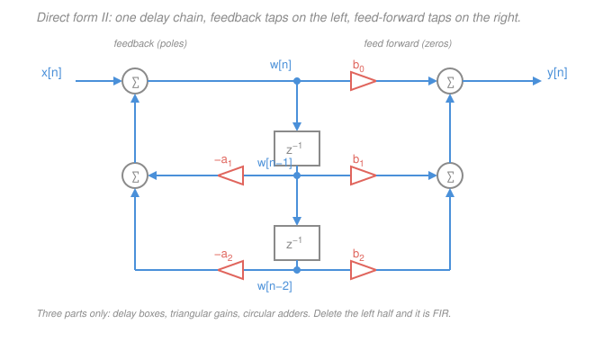

# Signals & Systems · Lesson 4.3: Difference equations and realizations

> ⏱ ~15 min · Module 4: The z-transform and filtering · Builds on: [4.1 The z-transform and its ROC](04-01-z-transform-and-roc.md), [4.2 Discrete transfer functions and the z-plane](04-02-discrete-transfer-functions-z-plane.md), [1.5 Convolution in discrete time](01-05-convolution-discrete-time.md) · Unlocks: 4.4 (filter design basics)

## Why this matters

Everything so far has been analysis: given a system, predict what it does. This lesson runs the arrow backwards. A **difference equation** is not an abstraction — it is a line of code and a wiring diagram at the same time. Once you can turn $H(z)$ into a difference equation, you can implement any filter you design in about four lines of a loop, or hand a hardware engineer a schematic made of three parts.

And it forces the one design decision that dominates real DSP: **FIR or IIR?** No feedback, or feedback? That choice sets your cost in multiplies, your memory in delay registers, whether the thing can ever go unstable, and whether it distorts the *shape* of your waveform. Every filter you meet in [4.4](04-04-filter-design-basics.md), in `communications`, or inside an audio plugin has already made this choice.

## The idea

A discrete system that you can actually build has to compute `y[n]` from numbers it already has. What does it have on hand? The current input, some past inputs it stored, and some past outputs it stored. That's it. So the most general buildable recipe looks like:

> **new output = (a weighted blend of recent inputs) + (a weighted blend of recent outputs).**

Those two blends have names worth internalizing:

- **Feed-forward** — the input terms. Signal flows one way, in and out. No echo.
- **Feedback** — the output terms. The machine's own past output is stirred back into its next output.

Feedback is the whole story. Without it, whatever you put in eventually flushes out: after the last stored input sample passes, the system forgets you existed. Its impulse response is **finite**. With feedback, the output feeds itself forever — each pass scaled by some factor, so it decays (or explodes) but never truly ends. Its impulse response is **infinite**. Hence the two names, FIR and IIR.

Here's the bargain in one sentence: feedback buys enormous sharpness for almost no arithmetic, and charges you stability risk and phase distortion. The rest of the lesson is that sentence made precise.

## The formal version

### The general difference equation

A **linear constant-coefficient difference equation (LCCDE)** of order $N$:

$$\sum_{k=0}^{N} a_k\, y[n-k] \;=\; \sum_{m=0}^{M} b_m\, x[n-m].$$

Here $x[n]$ is the input, $y[n]$ the output, $n$ the integer sample index; the $b_m$ are $M+1$ real constants and the $a_k$ are $N+1$ real constants. We always **normalize $a_0 = 1$** (divide through by it), which lets us solve for the newest output:

$$\boxed{\,y[n] \;=\; \underbrace{\sum_{m=0}^{M} b_m\,x[n-m]}_{\text{feed-forward}} \;-\; \underbrace{\sum_{k=1}^{N} a_k\, y[n-k]}_{\text{feedback}}\,}$$

*In words: the new output is a weighted sum of the last $M+1$ inputs, minus a weighted sum of the last $N$ outputs.* Note the **minus** — it is an artifact of moving the $y$ terms across the equals sign, and it is the single most common sign error in this material.

### Transforming it

Apply the z-transform. The only property needed is the **time-shift** rule from [4.1](04-01-z-transform-and-roc.md): delaying a signal by $d$ samples multiplies its transform by $z^{-d}$,

$$x[n-d] \;\longleftrightarrow\; z^{-d}X(z).$$

*In words: $z^{-1}$ is the algebraic symbol for "one sample ago."* Transform term by term (the z-transform is linear):

$$\sum_{k=0}^{N} a_k z^{-k} Y(z) \;=\; \sum_{m=0}^{M} b_m z^{-m} X(z),$$

and since $H(z) = Y(z)/X(z)$,

$$\boxed{\,H(z) \;=\; \frac{\displaystyle\sum_{m=0}^{M} b_m z^{-m}}{\displaystyle\sum_{k=0}^{N} a_k z^{-k}} \;=\; \frac{b_0 + b_1 z^{-1} + \cdots + b_M z^{-M}}{1 + a_1 z^{-1} + \cdots + a_N z^{-N}}\,}$$

*In words: the difference equation's coefficients are literally the coefficients of $H(z)$ — feed-forward taps on top, feedback taps on the bottom.* No integration, no solving. You read them off.

Two consequences you should be able to state instantly:

- The **numerator** coefficients ($b$) place the **zeros**; the **denominator** coefficients ($a$) place the **poles**. So from [4.2](04-02-discrete-transfer-functions-z-plane.md): stability is decided entirely by the feedback coefficients.
- **The reverse direction is how you implement.** Given a designed $H(z)$, cross-multiply $Y(z)\sum a_k z^{-k} = X(z)\sum b_m z^{-m}$ and read each $z^{-d}$ back as a delay. Design happens in the z-plane; deployment happens in the difference equation.

### The three building blocks

Every discrete LTI system, without exception, is built from exactly three parts:

| Block | Symbol | What it does |
|---|---|---|
| **Unit delay** | $z^{-1}$ box | stores one sample and hands it over next tick |
| **Multiplier (gain)** | triangle labeled $c$ | scales by a constant |
| **Adder** | circle with $\Sigma$ | sums its inputs |

That's the entire hardware vocabulary. Delays cost memory (a register per delay); multipliers cost the most silicon and the most time; adders are nearly free. So **counting delays and multiplies is how you price a filter.**

**Direct form I** is the literal transcription of the boxed difference equation: run the input down a chain of $M$ delays, tap it with the $b$'s, sum; run the output down a separate chain of $N$ delays, tap with the $-a$'s, sum into the same node. Total: $M + N$ delays.

**Direct form II** halves that. Write $H(z)$ as a cascade of two systems,

$$H(z) \;=\; \underbrace{\frac{1}{A(z)}}_{\text{all-pole}} \cdot \underbrace{B(z)}_{\text{all-zero}}, \qquad A(z)=\sum_k a_k z^{-k},\quad B(z)=\sum_m b_m z^{-m}.$$

Direct form I applies $B$ first, then $1/A$. But **cascaded LTI systems commute** — their transfer functions just multiply, and multiplication of scalars commutes, so $B\cdot\frac1A = \frac1A\cdot B$ ([1.5](01-05-convolution-discrete-time.md)'s commutativity of convolution, seen in the z-domain). Swap the order: apply $1/A$ first, producing an intermediate signal $w[n]$, then apply $B$ to it:

$$w[n] = x[n] - \sum_{k=1}^{N} a_k\,w[n-k], \qquad y[n] = \sum_{m=0}^{M} b_m\, w[n-m].$$

*In words: run one recursion to get a scratch signal, then take a weighted sum of that scratch signal's history.* Now **both** chains delay the *same* signal $w[n]$ — so you keep one chain and tap it from both sides. Delays drop from $M+N$ to $\max(M,N)$, which is why direct form II is called the **canonical** form. Same output, same multiplies, half the memory.

## Picture



Read it as a flow: $x[n]$ enters the left adder, becomes $w[n]$, and slides down the delay chain. Every tap point feeds **both** directions — left through $-a_k$ back into the input adder, right through $b_m$ out to the output adder. Cover the left half with your thumb and you are looking at an FIR filter.

## Worked examples

### Example 1 — equation to $H(z)$ (analysis direction)

$$y[n] - 0.5\,y[n-1] + 0.06\,y[n-2] \;=\; x[n] + 2\,x[n-1].$$

Read off coefficients: $b_0=1,\ b_1=2$; $a_0=1,\ a_1=-0.5,\ a_2=0.06$. So

$$H(z) = \frac{1 + 2z^{-1}}{1 - 0.5z^{-1} + 0.06z^{-2}}.$$

Multiply top and bottom by $z^2$ to find roots: $H(z) = \dfrac{z(z+2)}{z^2 - 0.5z + 0.06}$. Poles:

$$z = \frac{0.5 \pm \sqrt{0.25 - 0.24}}{2} = \frac{0.5 \pm 0.1}{2} = 0.3,\ 0.2.$$

Both inside the unit circle, so by [4.2](04-02-discrete-transfer-functions-z-plane.md) the causal system is **stable**. Zero at $z=-2$, outside the unit circle — perfectly legal; zeros never threaten stability. It is **IIR** ($N=2$ feedback taps). Cost: 4 multiplies, and in direct form II only $\max(2,1)=2$ delays instead of direct form I's $2+1=3$.

### Example 2 — $H(z)$ to code (implementation direction)

You designed a smoother and it came out as

$$H(z) = \frac{0.2 + 0.2z^{-1}}{1 - 0.6z^{-1}}.$$

Cross-multiply: $Y(z)\big(1 - 0.6z^{-1}\big) = X(z)\big(0.2 + 0.2z^{-1}\big)$, then read each $z^{-1}$ as "one sample ago":

$$y[n] - 0.6\,y[n-1] = 0.2\,x[n] + 0.2\,x[n-1] \;\Longrightarrow\; y[n] = 0.2\,x[n] + 0.2\,x[n-1] + 0.6\,y[n-1].$$

Sanity check the gains: $H(1) = \frac{0.4}{0.4} = 1$ (unity at DC) and $H(-1) = \frac{0.2-0.2}{1.6} = 0$ (kills Nyquist exactly — the zero sits at $z=-1$). A low-pass, as intended.

Now confirm direct form II gives the identical output. Feed a unit impulse, $x = \{1,0,0,0,\dots\}$, with everything initially zero.

*Direct form I* (the equation above): $y[0]=0.2$; $y[1]=0.2(0)+0.2(1)+0.6(0.2)=0.32$; $y[2]=0.6(0.32)=0.192$; $y[3]=0.6(0.192)=0.1152$.

*Direct form II*: first $w[n] = x[n] + 0.6\,w[n-1]$ gives $w = \{1,\ 0.6,\ 0.36,\ 0.216\}$; then $y[n] = 0.2\,w[n] + 0.2\,w[n-1]$ gives

$$0.2,\quad 0.2(0.6)+0.2(1)=0.32,\quad 0.2(0.36)+0.2(0.6)=0.192,\quad 0.2(0.216)+0.2(0.36)=0.1152 .$$

Identical, as the commuting argument promised — and the closed form $h[0]=0.2$, $h[n]=0.32(0.6)^{n-1}$ for $n\ge1$ agrees too.

## FIR vs. IIR

### FIR — all zeros, no feedback

Set $N=0$, so the denominator is just $1$:

$$y[n] = \sum_{m=0}^{M} b_m\,x[n-m], \qquad H(z) = \sum_{m=0}^{M} b_m z^{-m}.$$

Put in an impulse and $y[n] = b_n$: the **impulse response is the coefficient list itself**, length $M+1$, then zero forever. Three consequences:

- **Always stable.** $\sum_n |h[n]| = \sum_m |b_m|$ is a finite sum of finitely many numbers, so BIBO stability from [1.3](01-03-systems-and-properties.md) is automatic. You cannot build an unstable FIR filter. (Its only poles sit at $z=0$, harmlessly.)
- **Can have exactly linear phase.** If the taps are symmetric, $b_m = b_{M-m}$, then $H(e^{j\Omega}) = A(\Omega)\,e^{-j\Omega M/2}$ with $A$ real — the phase is a straight line in $\Omega$, so the **group delay** $-\,d\phi/d\Omega = M/2$ samples is the *same at every frequency*. Every frequency component is held up equally, so the waveform arrives delayed but **undistorted in shape**. This is the main reason to choose FIR: it matters enormously for audio, images, and data pulses where shape carries the information.
- **Expensive for a sharp cutoff.** With no poles to do the heavy lifting, sharpness comes only from piling on taps — a steep filter can need hundreds.

**The moving average.** Averaging the last $L$ samples (this is the $L$-point moving average; many books call the length $M$, but we are already using $M$ for the LCCDE order):

$$y[n] = \frac{1}{L}\sum_{k=0}^{L-1} x[n-k], \qquad H(z) = \frac{1}{L}\sum_{k=0}^{L-1} z^{-k} = \frac{1}{L}\cdot\frac{1 - z^{-L}}{1 - z^{-1}}.$$

Its $h[n]$ is a length-$L$ box of height $1/L$, and its taps are trivially symmetric, so it is exactly linear phase with group delay $(L-1)/2$ samples. The numerator vanishes when $z^{L}=1$, i.e. at $z = e^{j2\pi k/L}$; the $k=0$ root $z=1$ cancels against the denominator, leaving **zeros on the unit circle at $\Omega = 2\pi k/L$ for $k = 1,\dots,L-1$**.

*Verify for $L=4$:* $H(z) = \tfrac14(1 + z^{-1} + z^{-2} + z^{-3}) = \tfrac14\,\frac{z^3+z^2+z+1}{z^3}$, and $z^3+z^2+z+1 = (z+1)(z^2+1)$, so the zeros are $z = -1,\ j,\ -j$ — sitting at $\Omega = \pi,\ \pi/2,\ 3\pi/2$, exactly the nonzero multiples of $2\pi/4$. Those are the frequencies the average annihilates completely, which is precisely why a 4-point average is a low-pass: DC survives ($H(1)=1$), and the tones that fit a whole number of cycles into 4 samples average to nothing.

### IIR — poles, feedback, infinite memory

Take the syllabus's one-liner:

$$y[n] = x[n] + 0.9\,y[n-1] \qquad\Longrightarrow\qquad H(z) = \frac{1}{1 - 0.9z^{-1}}, \qquad h[n] = 0.9^{\,n}u[n].$$

Stare at the cost: **one multiply and one add per output sample, one delay register.** And yet $h[n]$ never reaches zero — an *infinite* impulse response squeezed out of a two-term recipe. That compression is the entire case for IIR. A pole at $z=0.9$ sits close to the unit circle and produces a sharp low-pass peak (DC gain $H(1)=1/0.1=10$; Nyquist gain $H(-1)=1/1.9\approx0.526$) that an FIR filter would need dozens of taps to imitate.

The price:

- **It can be unstable.** Change $0.9$ to $1.1$ and $h[n]=1.1^n$ blows up. Feedback means an arithmetic slip — or coefficient rounding in fixed-point hardware — can push a pole outside the unit circle.
- **It cannot have exactly linear phase.** Linear phase demands a symmetric impulse response; a causal, infinitely long $h[n]$ has no center to be symmetric about. So IIR filters delay different frequencies by different amounts and *reshape* the waveform, even when the magnitude response is perfect.

| | FIR | IIR |
|---|---|---|
| Feedback | none ($N=0$) | yes ($N\ge1$) |
| $h[n]$ | finite, $=\{b_m\}$ | infinite |
| Stability | guaranteed | must be checked |
| Exactly linear phase | possible (symmetric taps) | impossible |
| Cost for a sharp cutoff | high (many taps) | very low |

## Running it as a loop

The difference equation *is* the program. Two practical points:

**Initial rest.** For the system to be genuinely LTI you assume **initial rest**: if $x[n]=0$ for $n<n_0$, then $y[n]=0$ for $n<n_0$ too. Concretely, you zero the delay registers before you start. Nonzero initial conditions add a term that doesn't scale with the input, breaking the zero-in-zero-out test from [1.3](01-03-systems-and-properties.md) — the same "+3" that made $y=2x+3$ affine rather than linear.

**The loop.** For $y[n] = x[n] + 0.9\,y[n-1]$ with a unit impulse:

```
y_prev = 0                      # initial rest: y[-1] = 0
for n in 0, 1, 2, 3:
    x_n  = 1 if n == 0 else 0   # unit impulse
    y_n  = x_n + 0.9 * y_prev   # the difference equation, verbatim
    emit y_n
    y_prev = y_n                # this line IS the z-inverse-one box
```

Tracing it: $y[0] = 1 + 0.9(0) = 1$; $y[1] = 0 + 0.9(1) = 0.9$; $y[2] = 0.9(0.9) = 0.81$; $y[3] = 0.9(0.81) = 0.729$. Against $h[n]=0.9^n$: $0.9^0=1$, $0.9^1=0.9$, $0.9^2=0.81$, $0.9^3=0.729$. ✓ The closed form and the loop are the same object.

That last assignment, `y_prev = y_n`, is worth pausing on: a delay element in a diagram, a $z^{-1}$ in algebra, and a variable holding a value until the next iteration are three notations for one thing.

## Watch out

- **You might drop the minus sign on the feedback taps.** The LCCDE is written with *all* terms on the left ($\sum a_k y[n-k] = \dots$), so solving for $y[n]$ flips the sign of every $a_k$ for $k\ge1$. In the diagram the feedback gains are $-a_1, -a_2,\dots$, not $a_1, a_2$. Guard: after converting, feed in an impulse and check the first two samples against $H(z)$'s expansion.
- **You might think direct form II is a different filter because $w[n]$ looks nothing like the signals you expect.** In Example 2, $w = \{1, 0.6, 0.36, \dots\}$ is not the input and not the output — it is an internal scratch signal with no physical meaning. Only $y[n]$ must match, and it does. (Caution in fixed-point hardware: $w[n]$ can grow much larger than $x$ or $y$ and overflow, which is why real designs cascade small second-order sections.)
- **You might think "FIR = no poles" means FIR has no memory.** It has plenty — $M$ delay registers' worth. "Finite impulse response" means the memory *empties out* after $M+1$ samples, not that it doesn't exist. Memoryless would be $M=0$.

## One-liner

> A difference equation's coefficients *are* its transfer function — numerator = feed-forward = zeros, denominator = feedback = poles — and the presence of that denominator is the whole FIR/IIR bargain: no feedback buys guaranteed stability and linear phase, feedback buys sharpness for almost nothing.

## Problems

**P1 (🟢)** A system obeys $y[n] = 0.5\,x[n] - 0.3\,x[n-1] + 0.4\,y[n-2]$. Find $H(z)$, classify it FIR or IIR, decide whether the causal system is stable, and say how many delay elements direct form II needs.

**P2 (🟡)** Consider the 3-point moving average $y[n] = \tfrac13\big(x[n] + x[n-1] + x[n-2]\big)$. (a) Give $h[n]$ and $H(z)$. (b) Find its zeros and state which discrete frequency $\Omega$ (rad/sample) it annihilates. (c) What is its DC gain, and its group delay in samples?

**P3 (🔴)** You are given $H(z) = \dfrac{1 - z^{-1}}{1 - 0.8z^{-1}}$. (a) Write the difference equation and the direct form II pair $(w[n],\,y[n])$. (b) Using initial rest, compute the first four samples of the **step** response ($x[n]=u[n]$). (c) Explain the result: what does this filter do to a constant input, and why does the zero's location predict it?

<details>
<summary>Solutions</summary>

**P1** Move the output term left to put it in standard LCCDE form:

$$y[n] - 0.4\,y[n-2] = 0.5\,x[n] - 0.3\,x[n-1] \;\Longrightarrow\; H(z) = \frac{0.5 - 0.3z^{-1}}{1 - 0.4z^{-2}}.$$

So $b_0 = 0.5,\ b_1 = -0.3$ ($M=1$) and $a_1 = 0,\ a_2 = -0.4$ ($N=2$). Since $N\ge1$ there is feedback: **IIR**.

Poles: multiply through by $z^2$ to get $\dfrac{z(0.5z - 0.3)}{z^2 - 0.4}$, so $z^2 = 0.4$ and

$$z = \pm\sqrt{0.4} \approx \pm 0.632 .$$

Both have magnitude $0.632 < 1$, inside the unit circle, so the causal system is **stable**.

Direct form II needs $\max(M,N) = \max(1,2) = \mathbf{2}$ delays (direct form I would need $1+2=3$).

*Check.* The single zero is at $0.5z = 0.3 \Rightarrow z = 0.6$, inside the unit circle — irrelevant to stability, but a fine consistency check that the numerator has order 1. ✓

**P2**

**(a)** Impulse in, coefficients out: $h[n] = \{\tfrac13, \tfrac13, \tfrac13\}$ for $n=0,1,2$ and zero elsewhere. Therefore

$$H(z) = \tfrac13\big(1 + z^{-1} + z^{-2}\big).$$

**(b)** Multiply by $z^2/z^2$: $H(z) = \dfrac{z^2 + z + 1}{3z^2}$. Set the numerator to zero:

$$z = \frac{-1 \pm \sqrt{1-4}}{2} = \frac{-1 \pm j\sqrt3}{2} = e^{\pm j 2\pi/3}.$$

Magnitude $\sqrt{\tfrac14 + \tfrac34} = 1$, so both zeros are **on the unit circle** at angles $\pm 2\pi/3$. A zero on the unit circle at angle $\Omega_0$ kills that frequency exactly, so the filter annihilates $\Omega = 2\pi/3$ rad/sample. This matches the general rule $\Omega = 2\pi k/L$ with $L=3$, $k=1$ (and $k=2$ is the same frequency read as negative).

**(c)** DC gain $H(e^{j0}) = H(1) = \tfrac13(1+1+1) = \mathbf{1}$ — an average must pass a constant unchanged. Group delay $(L-1)/2 = (3-1)/2 = \mathbf{1}$ sample, constant across all frequencies since the taps are symmetric.

*Check.* Feed $x[n]=\cos(2\pi n/3)$, three samples per cycle, values $1, -\tfrac12, -\tfrac12$ repeating: any three consecutive samples sum to $0$, so the output is identically zero. ✓ That is the annihilated frequency, confirmed by hand.

**P3**

**(a)** Cross-multiply $Y(z)(1 - 0.8z^{-1}) = X(z)(1 - z^{-1})$ and read $z^{-1}$ as one sample of delay:

$$y[n] - 0.8\,y[n-1] = x[n] - x[n-1] \;\Longrightarrow\; y[n] = x[n] - x[n-1] + 0.8\,y[n-1].$$

Direct form II ($b_0=1,\ b_1=-1,\ a_1=-0.8$, so the feedback gain $-a_1 = +0.8$):

$$w[n] = x[n] + 0.8\,w[n-1], \qquad y[n] = w[n] - w[n-1].$$

One delay element, since $\max(M,N)=\max(1,1)=1$.

**(b)** Initial rest: $y[-1]=0$, $x[-1]=0$. With $x[n]=1$ for $n\ge0$:

$$\begin{aligned} y[0] &= 1 - 0 + 0.8(0) = 1,\\ y[1] &= 1 - 1 + 0.8(1) = 0.8,\\ y[2] &= 1 - 1 + 0.8(0.8) = 0.64,\\ y[3] &= 1 - 1 + 0.8(0.64) = 0.512. \end{aligned}$$

So the step response is $s[n] = 0.8^{\,n}u[n]$: $\{1,\ 0.8,\ 0.64,\ 0.512,\dots\}$.

*Cross-check with direct form II:* $w[n] = x[n] + 0.8w[n-1]$ gives $w = \{1,\ 1.8,\ 2.44,\ 2.952\}$, and $y[n]=w[n]-w[n-1]$ gives $1,\ 0.8,\ 0.64,\ 0.512$. ✓ Same output from a very different-looking internal signal.

**(c)** The filter is a **DC blocker (high-pass)**: fed a constant, its output decays geometrically to zero. The zero at $z = 1$ is the reason — $H(1) = \frac{1-1}{1-0.8} = 0$, so the gain at DC is exactly zero and no constant can survive in steady state. Algebraically, the step's z-transform is $\frac{1}{1-z^{-1}}$, and

$$S(z) = H(z)\cdot\frac{1}{1-z^{-1}} = \frac{1-z^{-1}}{(1-0.8z^{-1})(1-z^{-1})} = \frac{1}{1-0.8z^{-1}} \;\Longrightarrow\; s[n] = 0.8^{\,n}u[n],$$

confirming the hand iteration exactly. The numerator zero at $z=1$ **cancels the step's pole at $z=1$** — that cancellation is what removes the permanent component and leaves only the decaying transient from the pole at $z=0.8$ (inside the unit circle, hence stable). ✓

</details>

## Flashback

**From Lesson 1.5 (Convolution in discrete time):** An FIR system has impulse response $h[n] = \{1, -1\}$ for $n = 0, 1$. Compute its output $y[n] = x[n] * h[n]$ for the input $x[n] = \{1, 2, 3\}$ at $n = 0,1,2$, using the convolution sum. State the length of the result before you compute it. *(Fresh variant — different sequences from 1.5, and now you can also read off what this filter does.)*

<details>
<summary>Solution</summary>

Length first: convolving a length-3 sequence with a length-2 sequence gives length $3 + 2 - 1 = 4$, spanning $n=0$ to $n=3$.

The convolution sum is $y[n] = \sum_{k} x[k]\,h[n-k]$; with only two nonzero $h$ values, $h[0]=1$ and $h[1]=-1$, this collapses to $y[n] = x[n] - x[n-1]$:

$$\begin{aligned} y[0] &= x[0] - x[-1] = 1 - 0 = 1,\\ y[1] &= x[1] - x[0] = 2 - 1 = 1,\\ y[2] &= x[2] - x[1] = 3 - 2 = 1,\\ y[3] &= x[3] - x[2] = 0 - 3 = -3. \end{aligned}$$

So $y[n] = \{1,\ 1,\ 1,\ -3\}$.

*Check.* Summing an output is the same as multiplying the sums (evaluate both transforms at $z=1$): $\sum_n y[n] = \big(\sum_n x[n]\big)\big(\sum_n h[n]\big) = (6)(1-1) = 0$, and indeed $1+1+1-3 = 0$. ✓

*And now, with this lesson:* $h=\{1,-1\}$ means $H(z) = 1 - z^{-1}$, a first-difference FIR filter with a zero at $z=1$ — a discrete derivative that kills DC. That is why the three constant-slope steps produced a constant $1$, and why everything sums to zero. It is also exactly the numerator of P3.

</details>

## Connections

- **Backward:** this is [4.1](04-01-z-transform-and-roc.md)'s shift property cashed in — $z^{-1}$ stops being algebra and becomes a hardware register. The pole/zero verdicts come from [4.2](04-02-discrete-transfer-functions-z-plane.md), and the FIR case is just [1.5](01-05-convolution-discrete-time.md)'s convolution sum with a finite $h[n]$: an FIR filter *is* convolution with its coefficient list. The initial-rest condition is [1.3](01-03-systems-and-properties.md)'s linearity requirement in disguise.
- **Forward:** [4.4 Filter design basics](04-04-filter-design-basics.md) chooses the $b$'s and $a$'s to hit a specification, and the FIR/IIR tradeoff here is the first fork in that road. The feedback loop drawn in the figure is the same loop that becomes the feedback interconnection $\tfrac{H}{1+GH}$ of [2.6](02-06-solving-systems-with-laplace.md) and the central object of `control-systems` — see its [syllabus](../../control-systems/syllabus.md).
- **Sideways:** difference equations are to discrete systems what the constant-coefficient ODEs of [`ode-refresher` 2.1](../../ode-refresher/lessons/02-01-second-order-constant-coefficient.md) are to continuous ones — same characteristic-polynomial machinery, with $z$-powers replacing $e^{rt}$. And the RC low-pass of [`circuits` 3.2](../../circuits/lessons/03-02-first-order-rc-rl-transients.md) becomes, when you sample it, precisely a one-pole IIR filter of the form $y[n] = (1-\alpha)x[n] + \alpha\,y[n-1]$ — the same exponential decay, now a single line of code.
