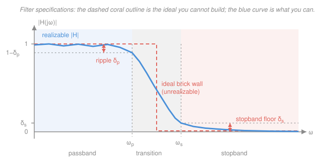

# Signals & Systems · Lesson 4.4: Filter design basics

> ⏱ ~15 min · Module 4: The z-transform and filtering · Builds on: [2.3 The continuous-time Fourier transform](02-03-continuous-time-fourier-transform.md), [4.2 Discrete transfer functions and the z-plane](04-02-discrete-transfer-functions-z-plane.md), [4.3 Difference equations and realizations](04-03-difference-equations-realizations.md) · Unlocks: 4.5 (modulation)

## Why this matters

Everything so far has been *analysis*: here is a system, what does it do? This lesson flips it. Here is what I want done to my signal — now build the system. That is filtering, and it is the single most-used deliverable in all of signal processing: the anti-aliasing filter in front of every ADC, the tone controls on a stereo, the 60 Hz notch that kills mains hum in an EKG, the smoothing on a noisy sensor, the moving average under a stock chart.

And the lesson has a punchline. The filter you *want* — perfect passage below a cutoff, perfect annihilation above it — is not merely hard to build. It is **provably unbuildable**, for a reason that falls straight out of the Fourier pair you already know. Once you see why, every real filter stops looking like a botched approximation and starts looking like what it is: a negotiated settlement.

## The idea

A filter is a system chosen for the *shape* of its magnitude response $|H(j\omega)|$. From [2.1](02-01-eigenfunctions-frequency-response.md) you know why that shape is the whole story: a sinusoid at frequency $\omega$ enters an LTI system and leaves as a sinusoid at the *same* frequency, scaled by $|H(j\omega)|$ and shifted by $\angle H(j\omega)$. So designing a filter means sculpting one curve — decide, frequency by frequency, what survives.

Sculpting it perfectly means a cliff: gain exactly $1$ up to the cutoff, exactly $0$ after. Nobody gets that. What you actually get is a curve that sags a little where it should be flat, slides down over a finite stretch where you wanted a cliff, and settles to *small* rather than *zero*. So real specifications are written as a **tolerance corridor** — "stay within this much of 1 out here, get below this much of 1 out there, and you may use this much frequency room in between." Design is then the art of buying a narrower in-between with the least payment in ripple, delay, and arithmetic.

## The formal version

### Specification vocabulary

For a low-pass filter (the picture below shows all of these at once):

- **Passband** — frequencies you intend to keep, $0 \le \omega \le \omega_p$.
- **Stopband** — frequencies you intend to kill, $\omega \ge \omega_s$.
- **Transition band** — the gap $\omega_p < \omega < \omega_s$, where you make no promises. Its width is the price of the design.
- **Passband ripple** $\delta_p$ — how far $|H|$ is allowed to wander from 1 inside the passband.
- **Stopband attenuation** $\delta_s$ — the ceiling $|H|$ must stay under in the stopband.
- **Cutoff frequency** $\omega_c$ — by universal convention, the **$-3$ dB point**.

### Decibels, and the half-power trap

For an amplitude ratio like $|H|$, the decibel value is

$$\boxed{\;|H|_{\mathrm{dB}} = 20\log_{10}|H|\;}$$

*In words: express the gain as a power of ten, then count in twentieths.* Gain 1 is 0 dB; gain 10 is $+20$ dB; gain $1/10$ is $-20$ dB; gain $1/2$ is $20\log_{10}0.5 = -6.02$ dB.

The factor 20 (not 10) is because dB were defined for **power**, and power goes as amplitude squared: $10\log_{10}|H|^2 = 20\log_{10}|H|$. Which brings us to the cutoff. Set

$$|H| = \frac{1}{\sqrt2} \approx 0.7071 \;\Longrightarrow\; 20\log_{10}\!\left(\tfrac{1}{\sqrt2}\right) = -3.01\ \text{dB}.$$

Why *that* number? Because $\left(1/\sqrt2\right)^2 = 1/2$ exactly. **The $-3$ dB point is where the output carries half the power** — not half the amplitude. Half the *amplitude* is $-6$ dB, a different and much deeper cut. Readers conflate these constantly; when someone says "the cutoff," they mean $0.707$ of the amplitude and $0.5$ of the power.

### The four types, and their pole–zero fingerprints

Using the z-plane reading rules from [4.2](04-02-discrete-transfer-functions-z-plane.md) — gain is large near a pole, small near a zero, evaluated as you walk the unit circle from $z=1$ (DC) to $z=-1$ (Nyquist):

- **Low-pass** — keeps low frequencies. Pole(s) near $z=1$, zero(s) at $z=-1$.
- **High-pass** — keeps high frequencies. Zero(s) at $z=1$, pole(s) near $z=-1$.
- **Band-pass** — keeps a middle band. A conjugate pole pair just inside the circle at $z = re^{\pm j\Omega_0}$, with zeros at $z = \pm1$ killing both ends.
- **Band-stop / notch** — kills one narrow band. A conjugate zero pair *on* the circle at $z = e^{\pm j\Omega_0}$ (exact annihilation at $\Omega_0$), with poles just inside at the same angle so the response returns to 1 elsewhere.

### Why the brick wall is unbuildable

Take the ideal low-pass literally: $H(j\omega) = 1$ for $|\omega| \le \omega_c$ and $0$ otherwise — a rectangle in frequency. Ask what its impulse response is. By the transform pair from [2.3](02-03-continuous-time-fourier-transform.md), the inverse transform of a rectangle is a **sinc**:

$$h(t) = \frac{1}{2\pi}\int_{-\omega_c}^{\omega_c} e^{j\omega t}\,d\omega = \frac{e^{j\omega_c t} - e^{-j\omega_c t}}{2\pi j t} = \frac{\sin(\omega_c t)}{\pi t}.$$

*In words: a perfect cliff in frequency is an infinitely long ringing wiggle in time.* Now look at that function and notice two things.

1. It never ends. $h(t)$ decays only like $1/t$, so the filter's memory of any input is infinite.
2. **It is even: $h(-t) = h(t)$, so $h(t) \ne 0$ for $t < 0$.** The filter produces output *before* the impulse arrives.

Property 2 is the kill shot. A system with $h(t) \ne 0$ for $t<0$ is **non-causal** — by the definition in [1.3](01-03-systems-and-properties.md), it responds to an input it has not received yet. No physical device, and no real-time algorithm, can do that. The ideal filter is not expensive; it is *forbidden*.

Nor can you rescue it by chopping. Truncate the sinc to a finite window and you have destroyed the exact rectangle: the truncated transform overshoots and ripples near the cutoff, and refuses to stop overshooting as you lengthen the window — that is **Gibbs' phenomenon**, exactly as in [`fourier-analysis` 1.3](../../fourier-analysis/lessons/01-03-convergence-pointwise-uniform-gibbs.md). Sharpness in one domain always costs you spread in the other.

So here is the central fact of the whole discipline, and it never goes away:

> **A sharper transition must be paid for — in passband ripple, in delay, or in computation. There is no design that avoids all three.**

Every named filter family below is just a different currency to pay in.

### The first-order RC low-pass, completely

The cheapest real filter: a resistor $R$ (ohms) in series with a capacitor $C$ (farads), output taken across the capacitor. Using impedances $Z_R = R$ and $Z_C = 1/(sC)$ in a voltage divider ([`circuits` 4.2](../../circuits/lessons/04-02-impedance-phasor-analysis.md)):

$$H(s) = \frac{Z_C}{Z_R + Z_C} = \frac{1/(sC)}{R + 1/(sC)} = \frac{1}{1 + sRC}.$$

Read it off:

- **Pole** at $1 + sRC = 0$, i.e. $s = -1/RC$ — real, negative, so stable, and its distance from the origin is $1/\tau$ where $\tau = RC$ is the time constant you met in [`circuits` 3.2](../../circuits/lessons/03-02-first-order-rc-rl-transients.md). *The transient decay rate and the filter cutoff are the same number seen from two domains.*
- **Cutoff** $\omega_c = 1/RC$ (rad/s).
- **Magnitude**, setting $s = j\omega$:

$$|H(j\omega)| = \frac{1}{|1 + j\omega RC|} = \frac{1}{\sqrt{1 + (\omega RC)^2}}.$$

At $\omega = \omega_c = 1/RC$ this is $1/\sqrt{1+1} = 1/\sqrt2$ — the $-3$ dB point, as advertised. At $\omega = 10\,\omega_c$, $|H| = 1/\sqrt{1+100} = 1/\sqrt{101} \approx 0.0995 \approx 1/10$, which is $-20.0$ dB. One decade up, 20 dB down: first-order filters roll off at **$-20$ dB/decade** (equivalently $-6$ dB/octave). That is a gentle slope — the "cliff" is a ramp a hundred-fold wide.

*Numbers.* $R = 1\ \mathrm{k\Omega}$, $C = 1\ \mathrm{\mu F}$ gives $RC = 10^{-3}$ s, so $\omega_c = 1000$ rad/s and $f_c = \omega_c/2\pi \approx 159$ Hz.

**The high-pass twin.** Same two parts, output taken across the *resistor* instead:

$$H(s) = \frac{Z_R}{Z_R + Z_C} = \frac{R}{R + 1/(sC)} = \frac{sRC}{1 + sRC}, \qquad |H(j\omega)| = \frac{\omega RC}{\sqrt{1+(\omega RC)^2}}.$$

The denominator — hence the **pole at $s=-1/RC$ — is identical**. What changed is a **zero at $s = 0$**, and that single zero does all the work: it forces $H(0) = 0$, killing DC, while $|H| \to 1$ as $\omega \to \infty$. At $\omega_c$ it again gives $1/\sqrt2$. *In words: putting a zero at DC is exactly the operation that converts a low-pass into a high-pass.* Same poles, same cutoff, opposite sense.

### The discrete analog: the one-pole IIR

Sample the same idea. The recursion

$$y[n] = (1-\alpha)\,x[n] + \alpha\,y[n-1], \qquad 0 \le \alpha < 1$$

is a first-order IIR filter in the direct form of [4.3](04-03-difference-equations-realizations.md). Take the z-transform ([4.1](04-01-z-transform-and-roc.md), delay $\to z^{-1}$):

$$Y(z) = (1-\alpha)X(z) + \alpha z^{-1}Y(z) \;\Longrightarrow\; \boxed{\;H(z) = \frac{1-\alpha}{1-\alpha z^{-1}}\;}$$

with a single **pole at $z = \alpha$** (inside the unit circle, so stable). The $(1-\alpha)$ out front is a normalizer: at DC, $z = 1$, so $H(1) = (1-\alpha)/(1-\alpha) = 1$ — unity DC gain, no free amplification.

*In words: each new output is a weighted blend of the new input and the previous output.* Larger $\alpha$ pushes the pole toward $z=1$, which by the geometric rule of [4.2](04-02-discrete-transfer-functions-z-plane.md) makes the peak at DC narrower and taller relative to everything else: **narrower passband, more smoothing, longer memory** (the impulse response $h[n] = (1-\alpha)\alpha^n u[n]$ decays over roughly $1/(1-\alpha)$ samples).

**Design formula.** Matching the discrete pole to the continuous one, $\alpha \approx e^{-\omega_c T}$, where $T$ is the sampling period and $\omega_c$ the desired cutoff in rad/s.

*Numbers.* Sample at $f_s = 1000$ Hz ($T = 1$ ms) and want $f_c = 50$ Hz, so $\omega_c T = 2\pi(50)(0.001) = 0.3142$ and $\alpha = e^{-0.3142} = 0.730$. Checking exactly: $|H(e^{j0.3142})| = 0.710$, i.e. $-2.97$ dB — about 1% off the target $-3.01$ dB.

This recursion is the **exponential moving average**, and it is everywhere: sensor smoothing, audio de-clicking, network round-trip-time estimation, and — under exactly that name — the smoothed price line traders draw on charts, where $\alpha$ near 1 is a slow long-memory average and $\alpha$ near 0 is a twitchy fast one (see [`mathematical-finance`](../../mathematical-finance/syllabus.md)). It is the same pole, doing the same job.

### What real design uses (menu only)

- **Butterworth** — maximally flat passband, no ripple anywhere, gentlest rolloff for its order.
- **Chebyshev** — deliberately admits ripple (in the passband, or the stopband for type II) and is rewarded with a much sharper transition at the same order.
- **Elliptic (Cauer)** — ripple in *both* bands, sharpest possible transition for the order.
- **Windowed-sinc** and **Parks–McClellan** — the FIR routes: truncate the ideal sinc with a taper, or optimize the coefficients to minimize the worst-case error.

Names only here; each is a specific way of spending the ripple/delay/computation budget.

## Picture

## Worked examples

**Example 1 (mechanical — meet a spec).** An audio line must pass everything below 1 kHz and attenuate 10 kHz by at least 30 dB. Can one RC section do it?

Put the cutoff at $f_c = 1$ kHz. Then 10 kHz is one decade up, and a first-order filter delivers $-20$ dB there — short by 10 dB. Cascading two isolated sections gives $-40$ dB at 10 kHz, which clears the spec, but the passband edge now sags twice as much: at $f_c$ each section contributes $1/\sqrt2$, so together $|H| = 1/2$, i.e. $-6$ dB rather than $-3$. That is the tradeoff in miniature — the second stage bought stopband attenuation and paid in passband droop (and in a second stage of hardware). A second-order Butterworth is the same order of complexity but redistributes the error to keep the passband flat.

**Example 2 (why you'd care — the anti-aliasing filter).** [3.1](03-01-sampling-nyquist-shannon.md) says sampling at $f_s$ is safe only if the signal is band-limited below $f_s/2$; [3.2](03-02-aliasing-and-reconstruction.md) says anything above folds back and is *unrecoverable*. So every ADC needs a low-pass filter in front of it. But the ideal one is the brick wall, and it does not exist — so real converters do the only thing possible: **oversample.** Sample at, say, $4\times$ the needed rate so the transition band has somewhere to live between the highest signal frequency and $f_s/2$, then use a modest analog filter there and finish the job digitally after sampling. The unrealizability theorem is not academic; it is why your audio interface runs at 96 kHz for 20 kHz of music.

## Watch out

- **You might think $-3$ dB means "half."** It means half the *power*, and $1/\sqrt2 \approx 0.707$ of the amplitude. Half the amplitude is $-6$ dB. If you ever write $20\log_{10}(0.5) = -3$, you have mixed the two conventions.
- **You might think 10 vs. 20 is a matter of taste.** It is not: use $10\log_{10}$ for a power ratio and $20\log_{10}$ for an amplitude/voltage ratio. They agree numerically only because $|H|^2$ is the power ratio.
- **You might think sharper is simply better.** A sharper filter has more ripple, more group delay, or more arithmetic — and a sharp filter's long impulse response *rings*, smearing transients in time. In audio and control, a gentle filter often sounds and behaves better than a surgical one.
- **You might read $\alpha$ as a cutoff.** In $y[n] = (1-\alpha)x[n] + \alpha y[n-1]$, $\alpha$ is a pole location; the cutoff depends on the sample rate too, via $\alpha \approx e^{-\omega_c T}$. The *same* $\alpha$ at a different $f_s$ is a different filter.

## One-liner

> The ideal filter's impulse response is a sinc, which is nonzero before $t=0$ — so a brick wall is not hard but non-causal, and every real filter buys transition sharpness with ripple, delay, or computation.

## Problems

**P1 (🟢)** An RC low-pass has $R = 10\ \mathrm{k\Omega}$ and $C = 10\ \mathrm{nF}$. Find the cutoff frequency $f_c$ in Hz, and give $|H|$ in dB at $\omega = \omega_c$ and at $\omega = 100\,\omega_c$.

**P2 (🟡)** You are smoothing a sensor sampled at $f_s = 1000$ Hz and want a cutoff at $f_c = 20$ Hz using the one-pole IIR $y[n] = (1-\alpha)x[n] + \alpha y[n-1]$. Find $\alpha$, write the difference equation with numbers, verify the DC gain is 1, and compute the gain at Nyquist ($z = -1$) in dB.

**P3 (🔴)** For the ideal low-pass $H(j\omega) = 1$ for $|\omega| \le \omega_c$ and $0$ otherwise: (a) derive $h(t)$; (b) evaluate $h(0)$; (c) evaluate $h$ at the specific time $t = -\pi/(2\omega_c)$ and say what the result means physically.

Solutions

**P1** The time constant is

$$RC = (10 \times 10^{3}\ \Omega)(10 \times 10^{-9}\ \mathrm{F}) = 10^{-4}\ \mathrm{s},$$

so $\omega_c = 1/RC = 10^4$ rad/s and

$$f_c = \frac{\omega_c}{2\pi} = \frac{10^4}{2\pi} \approx 1592\ \mathrm{Hz} \approx 1.59\ \mathrm{kHz}.$$

At $\omega = \omega_c$: $\omega RC = 1$, so $|H| = 1/\sqrt{1+1} = 1/\sqrt2 = 0.7071$, and

$$20\log_{10}(0.7071) = -3.01\ \text{dB}.$$

At $\omega = 100\,\omega_c$: $\omega RC = 100$, so

$$|H| = \frac{1}{\sqrt{1 + 100^2}} = \frac{1}{\sqrt{10001}} = 0.0100, \qquad 20\log_{10}(0.0100) = -40.0\ \text{dB}.$$

*Check.* Two decades above cutoff at $-20$ dB/decade predicts exactly $-40$ dB, and the exact value differs from $1/100$ only in the fifth decimal place. ✓

**P2** Sampling period $T = 1/1000 = 0.001$ s; target $\omega_c = 2\pi(20) = 125.66$ rad/s. Then

$$\omega_c T = 2\pi(20)(0.001) = 0.12566, \qquad \alpha \approx e^{-0.12566} = 0.8819.$$

So $1-\alpha = 0.1181$ and the filter is

$$y[n] = 0.1181\,x[n] + 0.8819\,y[n-1].$$

DC gain: put $z = 1$ in $H(z) = (1-\alpha)/(1-\alpha z^{-1})$:

$$H(1) = \frac{1-\alpha}{1-\alpha} = \frac{0.1181}{0.1181} = 1. \;\checkmark$$

(Equivalently: a constant input $x[n] = c$ settles to $y = (1-\alpha)c + \alpha y \Rightarrow y = c$.)

Nyquist gain: put $z = -1$, so $z^{-1} = -1$:

$$H(-1) = \frac{1-\alpha}{1+\alpha} = \frac{0.1181}{1.8819} = 0.06275,$$

$$20\log_{10}(0.06275) = -24.05\ \text{dB}.$$

*Check.* The result is positive, real, and far below 1 — a low-pass, as intended: DC passes untouched (0 dB) and the fastest representable oscillation is cut by 24 dB. The impulse response decays over about $1/(1-\alpha) \approx 8.5$ samples, i.e. roughly 8.5 ms at 1 kHz, which is the right ballpark for a 20 Hz (50 ms period) cutoff. ✓

**P3** (a) Inverse Fourier transform, integrating only over the band where $H = 1$:

$$h(t) = \frac{1}{2\pi}\int_{-\infty}^{\infty} H(j\omega)e^{j\omega t}\,d\omega = \frac{1}{2\pi}\int_{-\omega_c}^{\omega_c} e^{j\omega t}\,d\omega = \frac{1}{2\pi}\left[\frac{e^{j\omega t}}{jt}\right]_{-\omega_c}^{\omega_c} = \frac{e^{j\omega_c t} - e^{-j\omega_c t}}{2\pi j t}.$$

Using $e^{j\theta} - e^{-j\theta} = 2j\sin\theta$:

$$h(t) = \frac{2j\sin(\omega_c t)}{2\pi j t} = \frac{\sin(\omega_c t)}{\pi t}.$$

(b) At $t=0$ the expression is $0/0$; expand $\sin(\omega_c t) = \omega_c t - (\omega_c t)^3/6 + \cdots$:

$$h(0) = \lim_{t\to0}\frac{\omega_c t}{\pi t} = \frac{\omega_c}{\pi}.$$

(c) At $t = -\pi/(2\omega_c)$ we have $\omega_c t = -\pi/2$, so $\sin(\omega_c t) = -1$, and $\pi t = -\pi^2/(2\omega_c)$:

$$h\!\left(-\frac{\pi}{2\omega_c}\right) = \frac{-1}{-\pi^2/(2\omega_c)} = \frac{2\omega_c}{\pi^2} \ne 0.$$

Physically: the filter's response to an impulse arriving at $t=0$ is already nonzero a quarter-period *before* the impulse exists. The system would have to know the future, so it is non-causal and cannot be built as a real-time device. (Offline, on a recorded file, you *can* run it — you simply delay the output, which is why a long-delay linear-phase filter is the closest legal approximation.)

*Check.* $h$ is even, $h(-t) = \sin(-\omega_c t)/(-\pi t) = \sin(\omega_c t)/(\pi t) = h(t)$, so every nonzero value at $t>0$ has a twin at $t<0$ — the non-causality is not an edge case but half the impulse response. ✓

## Flashback

**From Lesson 3.2 (Aliasing and reconstruction):** A pure tone at 1400 Hz is sampled at $f_s = 1000$ Hz with no anti-aliasing filter. (a) What apparent frequency appears in the samples? (b) What is the highest cutoff an ideal anti-aliasing filter could have used, and what would it have done to this tone?

Solution

(a) Sampling replicates the spectrum at every multiple of $f_s$, so the sampled data contains the tone at $1400 - k(1000)$ for all integers $k$. The representable band is $|f| \le f_s/2 = 500$ Hz, and the replica landing inside it is $k = 1$:

$$f_{\text{apparent}} = 1400 - 1000 = 400\ \mathrm{Hz}.$$

The 1400 Hz tone is indistinguishable from a genuine 400 Hz tone in the samples, and no post-processing can separate them — the information is gone.

(b) The filter must remove everything at or above the Nyquist frequency $f_s/2 = 500$ Hz, so its cutoff must be at most 500 Hz. Since $1400 > 500$, the tone would have been in the stopband and suppressed *before* sampling — which is the whole point: aliasing is prevented, never cured.

*Check.* Sanity on the fold: $400 < 500$ ✓, and $1400$ and $400$ differ by exactly one $f_s$ ✓. Note this lesson's punchline biting immediately — an ideal 500 Hz brick wall is unbuildable, so a real converter either oversamples or accepts a little leakage just above 500 Hz. ✓

## Connections

- **Backward:** the filter *is* its frequency response ([2.1](02-01-eigenfunctions-frequency-response.md)); the brick wall dies on the rectangle–sinc pair from [2.3](02-03-continuous-time-fourier-transform.md) and the causality definition from [1.3](01-03-systems-and-properties.md); the shapes are read off the pole–zero map of [4.2](04-02-discrete-transfer-functions-z-plane.md) and implemented as the difference equations of [4.3](04-03-difference-equations-realizations.md). The RC pole is literally the time constant of [`circuits` 3.2](../../circuits/lessons/03-02-first-order-rc-rl-transients.md).
- **Forward:** [4.5 A taste of modulation](04-05-modulation.md) shifts spectra so that many signals share one channel — which only works if you can then *filter* one of them back out, so band-pass design is the enabling technology there and in [`communications`](../../communications/syllabus.md).
- **Sideways:** the same first-order lag is the workhorse of feedback design — a low-pass in the loop is a lag compensator, and its pole placement is the opening move of [`control-systems`](../../control-systems/syllabus.md). And the discrete version is the exponential moving average, the same recursion used to smooth prices and to estimate network latency: one pole, three fields.
