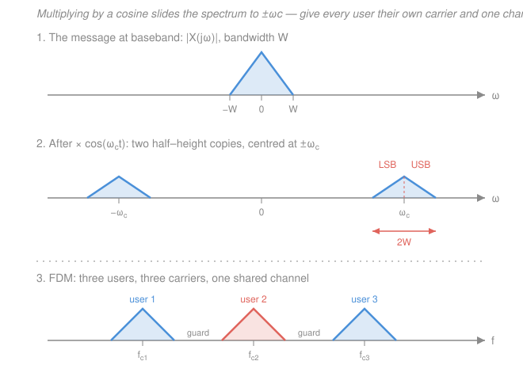

# Signals & Systems · Lesson 4.5: A taste of modulation

> ⏱ ~15 min · Module 4: The z-transform and filtering · Builds on: [2.3 The continuous-time Fourier transform](02-03-continuous-time-fourier-transform.md), [3.1 Sampling and the Nyquist–Shannon theorem](03-01-sampling-nyquist-shannon.md), [4.4 Filter design basics](04-04-filter-design-basics.md) · Unlocks: [`communications`](../../communications/syllabus.md) · **Last lesson of the course**

## Why this matters

Two awkward engineering facts, both fixed by the same trick.

**Everyone's voice lives in the same neighborhood.** Telephone-quality speech is band-limited to roughly 0–4 kHz. So is yours, and mine, and everybody else's. Put two of them on one wire — or one patch of air — and their spectra sit exactly on top of each other. The sum is unrecoverable, and no filter can save you: a filter selects by *frequency*, and these two signals occupy the same frequencies. You have one piece of spectral real estate and a queue of people who all want that same piece.

**And a low-frequency signal cannot be radiated.** An antenna radiates efficiently only when its length is comparable to a wavelength — a quarter wave is the usual rule of thumb. With $\lambda = c/f$ and $c = 3\times10^8$ m/s, a 3 kHz tone has

$$\lambda = \frac{3\times10^8\ \mathrm{m/s}}{3\times10^{3}\ \mathrm{Hz}} = 10^{5}\ \mathrm{m} = 100\ \text{km},$$

so you would need a 25 km antenna to transmit it. Move the same message up to a 1 MHz carrier and $\lambda = 300$ m, quarter wave 75 m — a broadcast mast. Up at 100 MHz, $\lambda = 3$ m, quarter wave 0.75 m — the whip on a car roof.

One fix serves both problems: **take the signal's spectrum and slide it up to a high frequency, and give each user a different destination.** That is modulation, and it rests on a property you already own.

## The idea

Picture the frequency axis as land. Baseband — the strip from 0 to a few kHz — is a single crowded downtown lot that every message is born on. Modulation is a moving van: it picks the whole spectrum up and sets it down, *shape unchanged*, centered on whatever frequency you've rented. Once your message sits at 900 kHz and mine at 910 kHz, we are no longer fighting: a band-pass filter can pluck out either one, because now we differ in the only thing a filter can see.

The van is remarkably cheap to hire. Multiplying a signal by a cosine is the entire mechanism, and the trip is reversible: multiply by the same cosine again, low-pass what comes out, and your message is back at baseband.

That is **amplitude modulation** — the message rides on the carrier's *height*. There is a second way to hide a message in a fast oscillation: leave the height alone and let the message wobble the carrier's *pitch*. That's **frequency modulation**, and it is a genuinely different animal — nonlinear, harder to analyze, better in noise.

## The formal version

Throughout, $x(t)$ is the real message (the "baseband" signal), band-limited so that $X(j\omega) = 0$ for $|\omega| > W$, where $W$ is the message bandwidth in rad/s; the same bandwidth in hertz is $f_m = W/2\pi$. The **carrier** is $\cos(\omega_c t)$ with carrier frequency $\omega_c$ (rad/s), and always $\omega_c \gg W$.

### The modulation property

From [2.3](02-03-continuous-time-fourier-transform.md), multiplication in time is convolution in frequency (with the $1/2\pi$ the engineering convention forces), and the transform of a cosine is a pair of impulses:

$$x(t)p(t) \;\longleftrightarrow\; \tfrac{1}{2\pi}X(j\omega) * P(j\omega), \qquad \cos(\omega_c t) \;\longleftrightarrow\; \pi\big[\delta(\omega-\omega_c)+\delta(\omega+\omega_c)\big].$$

Convolving anything with a shifted impulse just relocates it, so the result is two relocated copies of $X$. It is faster to get there straight from Euler's formula. Two lines:

$$x(t)\cos(\omega_c t) = \tfrac12 x(t)e^{j\omega_c t} + \tfrac12 x(t)e^{-j\omega_c t},$$

and the frequency-shift property $x(t)e^{j\omega_0 t} \leftrightarrow X(j(\omega-\omega_0))$ applied to each term gives

$$\boxed{\;x(t)\cos(\omega_c t) \;\longleftrightarrow\; \tfrac12 X\big(j(\omega-\omega_c)\big) + \tfrac12 X\big(j(\omega+\omega_c)\big).\;}$$

*In words: multiplying by a carrier makes two half-height copies of the spectrum, one centered at $+\omega_c$ and one at $-\omega_c$, with the shape completely untouched.*

This is the single most reused property in all of communications. Every mixer, every superheterodyne receiver, every up- and down-conversion stage in a radio is this one line of algebra wearing hardware.

### Sidebands

Look at the copy sitting at $+\omega_c$. It spans $\omega_c - W$ to $\omega_c + W$. The half below the carrier is the **lower sideband (LSB)**, the half above is the **upper sideband (USB)**, and the transmitted signal therefore occupies

$$B_{\text{DSB}} = 2W \ \ \text{rad/s} \qquad (\,= 2f_m\ \text{Hz}\,).$$

*In words: modulating costs you a factor of two in bandwidth — the message goes out twice, once mirrored.* Note what $B$ does **not** depend on: the carrier frequency. $\omega_c$ decides *where* the signal sits, $W$ decides *how wide* it is.

Three variants you should be able to name (details are [`communications`](../../communications/syllabus.md)):

- **DSB-SC** (double sideband, suppressed carrier) — exactly what we derived: both sidebands, nothing at $\omega_c$ itself. Most power-efficient, but the receiver must manufacture its own carrier.
- **Conventional AM** — transmit $[A + x(t)]\cos(\omega_c t)$ with $A$ large enough that $A + x(t) > 0$ always; then the *envelope* of the waveform literally traces the message, and a diode plus an RC low-pass ("envelope detector") recovers it. That is why 1920s radios could be built for pocket change — at the cost of a carrier line that carries no information and most of the power.
- **SSB** (single sideband) — for a real message the two sidebands are redundant, so filter one away and occupy $W$ instead of $2W$: twice as many users in the same band, paid for with a sharp filter and a fussier receiver.

### Getting it back: coherent detection

Multiply the received signal by the same carrier a second time and use $\cos^2\theta = \tfrac12(1+\cos 2\theta)$:

$$x(t)\cos^2(\omega_c t) = \frac{x(t)}{2} + \frac{x(t)}{2}\cos(2\omega_c t).$$

*In words: the second multiplication splits the signal into a clean copy of the message back at baseband, plus junk parked way up at $2\omega_c$.* The junk occupies $2\omega_c \pm W$, nowhere near baseband, so a **low-pass filter** with cutoff anywhere between $W$ and $2\omega_c - W$ deletes it; scale by 2 and you have $x(t)$ exactly.

That filter is the one you designed in [4.4](04-04-filter-design-basics.md). The whole reason a modest, realizable low-pass suffices here is that modulation put an enormous gap between what you want and what you don't — which is the same lesson as the [4.4](04-04-filter-design-basics.md) transition band, seen from the other side.

One catch: **the local cosine must match the incoming one in phase.** If the receiver uses $\cos(\omega_c t + \Delta\phi)$, the product-to-sum identity gives a baseband term $\tfrac12 x(t)\cos(\Delta\phi)$ — the message survives but shrinks by $\cos(\Delta\phi)$, and at $\Delta\phi = 90^\circ$ it vanishes entirely. Real receivers lock the local oscillator to the transmitter with a phase-locked loop or a transmitted pilot tone; how, and what it costs, is [`communications`](../../communications/syllabus.md).

### Frequency modulation, in intuition only

Write any sinusoid as $y(t) = A\cos\big(\theta(t)\big)$, where $\theta(t)$ is the **total phase** (rad). Define the **instantaneous frequency**

$$\omega_i(t) = \frac{d\theta}{dt} \quad (\text{rad/s}).$$

*In words: the instantaneous frequency is how fast the phase is currently turning.* Sanity check: for a plain carrier $\theta = \omega_c t + \phi$, this gives $\omega_i = \omega_c$, constant, as it must.

FM makes the message drive that quantity:

$$\omega_i(t) = \omega_c + k_f\,x(t) \;\;\Longrightarrow\;\; \theta(t) = \omega_c t + k_f\!\int_{-\infty}^{t}\! x(\tau)\,d\tau, \qquad y(t) = A\cos\big(\theta(t)\big),$$

with $k_f$ the frequency-deviation constant (rad/s per unit of $x$). *In words: loud message, carrier momentarily runs fast; quiet message, it drifts back to $\omega_c$.*

Now notice where $x$ ended up: **inside a cosine.** FM is *nonlinear* in the message — double $x$ and you do not double $y$, so superposition fails, and no tidy "shift the spectrum" statement exists. Its spectrum is genuinely hard (an infinite set of Bessel-weighted sidebands). Engineers use the empirical **Carson's rule**:

$$B_{\text{FM}} \approx 2(\Delta f + f_m),$$

where $\Delta f$ is the peak frequency deviation in Hz and $f_m$ the highest message frequency in Hz. *In words: FM's bandwidth is roughly twice the sum of how far the carrier swings and how fast the message wiggles it.*

Why bother, given all that? Because most channel noise perturbs a waveform's **amplitude**, and FM carries nothing in the amplitude — a receiver can run the signal through a hard *limiter* that flattens the envelope, throwing the noise away with it, before measuring frequency. FM buys noise immunity with bandwidth.

### Multiplexing: the point of the whole exercise

**FDM (frequency-division multiplexing).** Give user $k$ their own carrier $\omega_{c,k}$, spaced so their $2W$-wide slots tile the channel with small guard bands between. Every user's message is at baseband, but every user's *transmission* is somewhere else, and a band-pass filter followed by a coherent detector extracts exactly one of them. The shared channel has been partitioned in **frequency**.

**TDM (time-division multiplexing)** is the dual: partition in **time** instead. This is only possible because of [3.1](03-01-sampling-nyquist-shannon.md) — a band-limited signal is fully captured by its samples, so the wire sits idle between one user's samples and you can interleave everyone else's there.

Those are the two great sharing strategies, and both are direct consequences of things taught in this course: FDM of the modulation property, TDM of the sampling theorem.

### What this lesson deliberately does not do

Everything about how well modulation works in a *real* channel: noise and signal-to-noise ratio, optimal detection and matched filters, digital modulation (ASK, FSK, PSK, QAM), carrier and timing synchronization, error-control coding, and channel capacity. Those need random signals, which this course excluded on purpose. They are the subject of [`communications`](../../communications/syllabus.md), with the capacity limit itself in [`information-theory`](../../information-theory/syllabus.md).

## Picture

## Worked examples

**Example 1 (mechanical — put a station on the dial).** A message band-limited to 5 kHz DSB-modulates a carrier at $f_c = 1000$ kHz.

*Where does it land?* The spectrum copies to $\pm 1000$ kHz, each copy spanning $1000 \pm 5$ kHz:

$$995\ \text{kHz} \ \text{to}\ 1005\ \text{kHz}, \qquad B = 2 \times 5 = 10\ \text{kHz}.$$

Ten kilohertz per station is exactly the channel spacing of the AM broadcast band in North America (540, 550, 560 kHz, …) — the grid is Carson-free arithmetic, just $2W$.

*Getting it back.* Multiply by $\cos(2\pi\cdot 10^6 t)$ again. The product has one copy of the message at baseband (0–5 kHz) and one centered at $2f_c = 2000$ kHz. The low-pass filter must pass 5 kHz and stop 1995 kHz — a transition ratio of nearly 400:1. A single-pole RC at $f_{\text{cut}} = 10$ kHz already does it: at 2000 kHz its magnitude is

$$|H| = \frac{1}{\sqrt{1+(f/f_{\text{cut}})^2}} \approx \frac{10}{2000} = 0.005 \;\Rightarrow\; 20\log_{10}(0.005) \approx -46\ \text{dB},$$

while at 5 kHz it costs $1/\sqrt{1+0.25} = 0.894$, about 1 dB of droop. Compare that to the brick-wall agony of [4.4](04-04-filter-design-basics.md): separating things that are *far apart* in frequency is easy, and modulation's job was precisely to move them far apart.

**Example 2 (why you'd care — the FM band).** Broadcast FM uses peak deviation $\Delta f = 75$ kHz and audio up to $f_m = 15$ kHz. Carson's rule:

$$B_{\text{FM}} \approx 2(75 + 15) = 180\ \text{kHz}.$$

Which is why FM stations are spaced 200 kHz apart (88.1, 88.3, 88.5 MHz, …) — 180 kHz of signal plus 20 kHz of guard band. Now price it: FM spends $180/15 = 12$ times the message bandwidth, while DSB AM would spend $2 \times 15 = 30$ kHz, only twice. FM burns six times the spectrum of AM for the same audio — and gets back the hiss-free sound you actually hear. That is a naked bandwidth-for-quality trade, and [`information-theory`](../../information-theory/syllabus.md) is where it finally gets priced exactly.

## Watch out

- **You might think a higher carrier means a wider transmission.** It doesn't. $B = 2W$ whether you modulate onto 1 MHz or 1 GHz — the carrier chooses the address, the message chooses the lot size. (What a higher carrier *does* buy is room: more non-overlapping slots exist up there, which is why every new radio service is allocated higher than the last.)
- **You might think any oscillator at $\omega_c$ will demodulate.** Phase is not free: a static error $\Delta\phi$ scales the output by $\cos(\Delta\phi)$ and kills it dead at $90^\circ$. A *frequency* error $\Delta\omega$ is worse — the factor becomes $\cos(\Delta\omega\, t)$, so the message fades in and out.
- **You might try to apply the spectral-shift rule to FM.** You can't: $x(t)$ sits inside a cosine, so FM is nonlinear and superposition does not hold. Carson's rule is an engineering approximation, not a theorem — it is a fitted 98-percent-power rule, and the true FM spectrum has infinitely many sidebands.

## One-liner

> Multiplying by $\cos(\omega_c t)$ picks a spectrum up and sets it down at $\pm\omega_c$ without changing its shape — so give every user a different $\omega_c$ and one channel carries them all; multiply and low-pass to bring yours home.

## Problems

**P1 (🟢)** A voice signal band-limited to 4 kHz is DSB-modulated onto a carrier at $f_c = 900$ kHz. (a) What frequency band does the transmission occupy, and what is its total bandwidth? (b) Which range is the lower sideband and which the upper? (c) If instead only the upper sideband is transmitted (SSB), what band and bandwidth?

**P2 (🟡)** A cable offers the band from 1.000 MHz to 2.000 MHz for FDM. Each user is a 4 kHz voice signal, DSB-modulated, and each is allotted a 2 kHz guard band above its sidebands. (a) How many users fit? (b) Give the carrier frequency of the $k$-th user, and check it for $k = 1$ and the last user. (c) How many users fit if you switch to SSB with a 1 kHz guard band?

**P3 (🔴)** A receiver gets $r(t) = x(t)\cos(\omega_c t)$ but its local oscillator runs at the right frequency with a phase error: it produces $\cos(\omega_c t + \Delta\phi)$. (a) Show that after multiplying and low-pass filtering, the output is $\tfrac12 x(t)\cos(\Delta\phi)$. (b) For what phase error is the recovered *power* down by 3 dB (a factor of two)? (c) What happens at $\Delta\phi = 90^\circ$?

Solutions

**P1** (a) The modulation property puts a copy of the spectrum at $\pm f_c$, each copy running $f_c \pm W$ with $W = 4$ kHz:

$$900 - 4 = 896\ \text{kHz} \quad\text{to}\quad 900 + 4 = 904\ \text{kHz}, \qquad B = 2W = 8\ \text{kHz}.$$

(b) LSB is the half *below* the carrier, 896–900 kHz; USB is the half *above*, 900–904 kHz.

(c) Upper sideband only: 900–904 kHz, bandwidth 4 kHz — half of the DSB figure, which is the whole selling point of SSB.

*Check.* The bandwidth never used the number 900, as it shouldn't: $B = 2W$ is independent of the carrier. ✓

**P2** (a) Available band: $2.000 - 1.000 = 1.000$ MHz $= 1000$ kHz. Each user's DSB transmission is $2 \times 4 = 8$ kHz wide, plus 2 kHz of guard, so each user consumes a **10 kHz slot**:

$$N = \frac{1000\ \text{kHz}}{10\ \text{kHz}} = 100 \ \text{users}.$$

(b) Slot $k$ starts at $1000 + 10(k-1)$ kHz; the 8 kHz of signal fills the first 8 kHz of the slot, so the carrier sits at its center, 4 kHz in:

$$f_{c,k} = 1004 + 10(k-1)\ \text{kHz}.$$

Check $k=1$: $f_c = 1004$ kHz, signal 1000–1008 kHz, guard 1008–1010 kHz. ✓ Check $k=100$: $f_c = 1004 + 990 = 1994$ kHz, signal 1990–1998 kHz, guard 1998–2000 kHz — the last slot ends exactly at the top of the band. ✓

(c) SSB occupies 4 kHz, plus a 1 kHz guard, so the slot is 5 kHz:

$$N = \frac{1000}{5} = 200\ \text{users},$$

exactly double. Halving each user's bandwidth doubles the channel's population — the arithmetic reason SSB was worth its extra hardware on long-haul telephone carriers.

**P3** (a) Multiply, then use $\cos A\cos B = \tfrac12[\cos(A-B) + \cos(A+B)]$ with $A = \omega_c t$ and $B = \omega_c t + \Delta\phi$, so $A - B = -\Delta\phi$ and $A + B = 2\omega_c t + \Delta\phi$:

$$r(t)\cos(\omega_c t + \Delta\phi) = x(t)\cos(\omega_c t)\cos(\omega_c t + \Delta\phi) = \frac{x(t)}{2}\Big[\cos(\Delta\phi) + \cos(2\omega_c t + \Delta\phi)\Big].$$

Since $\Delta\phi$ is a constant, the first term is just $x(t)$ scaled — it lives at baseband, $|\omega| \le W$. The second term is $x(t)$ shifted to $\pm 2\omega_c$. A low-pass filter with cutoff between $W$ and $2\omega_c - W$ removes the second term, leaving

$$y(t) = \tfrac12 x(t)\cos(\Delta\phi). \qquad \checkmark$$

(b) Power goes as amplitude squared, so the recovered power is scaled by $\cos^2(\Delta\phi)$. Set that to $\tfrac12$:

$$\cos^2(\Delta\phi) = \tfrac12 \;\Longrightarrow\; |\cos(\Delta\phi)| = \tfrac{1}{\sqrt2} \approx 0.707 \;\Longrightarrow\; \Delta\phi = 45^\circ.$$

*Check.* $10\log_{10}(1/2) = -3.01$ dB ✓ — and 45 degrees is a *small* misalignment to give up half your power to, which is exactly why receivers spend real hardware on carrier phase locking.

(c) $\cos(90^\circ) = 0$, so the output is identically zero — the "quadrature null." A carrier and a carrier 90 degrees away from it are invisible to each other, which sounds like a disaster but is actually exploited: two independent messages can share one carrier frequency, one on $\cos(\omega_c t)$ and one on $\sin(\omega_c t)$, each recovered without seeing the other. That is quadrature amplitude modulation, and it belongs to [`communications`](../../communications/syllabus.md).

## Flashback

**From [Lesson 3.2 (Aliasing and reconstruction)](03-02-aliasing-and-reconstruction.md):** A pure tone at 7 kHz is sampled at $f_s = 10$ kHz. (a) Is it aliased? (b) What apparent frequency shows up in the samples? (c) What anti-aliasing filter would have prevented the problem, and what would it have cost? *(Fresh variant — new numbers, and part (c) is new.)*

Solution

(a) The Nyquist frequency (the highest frequency the sample rate can represent) is $f_s/2 = 5$ kHz. Since $7 > 5$, the tone is undersampled and **is** aliased. Avoiding it would have needed $f_s \ge 2 \times 7 = 14$ kHz.

(b) Sampling replicates the spectrum at every multiple of $f_s$: the tone's images sit at $7 + 10k$ kHz for all integers $k$. The one that falls into the baseband window $|f| \le 5$ kHz is

$$7 - 10 = -3\ \text{kHz} \;\Longrightarrow\; \text{apparent frequency } 3\ \text{kHz}.$$

A reconstructor sees a 3 kHz tone and has no way to know it was ever anything else.

(c) An anti-aliasing low-pass filter ahead of the sampler with cutoff at or below $f_s/2 = 5$ kHz. The cost is honest but total: it doesn't rescue the 7 kHz tone, it **deletes** it. That is the whole bargain of anti-aliasing — losing content you can't represent is strictly better than having it reappear disguised as content you can, corrupting a band that was otherwise clean.

*Check.* Folding sanity: with $f_s = 10$ kHz, frequencies $5 \to 5$, $7 \to 3$, $10 \to 0$ — the axis folds back at the Nyquist frequency, and $7$ is 2 kHz above the fold, landing 2 kHz below it. ✓

## Connections

- **Backward:** the entire lesson is one property from [2.3](02-03-continuous-time-fourier-transform.md) — multiplication in time is convolution in frequency, and convolving with the impulse pair $\pi[\delta(\omega-\omega_c)+\delta(\omega+\omega_c)]$ is a shift. The demodulator's low-pass filter is the design problem of [4.4](04-04-filter-design-basics.md), and its easy life here is the mirror image of why the brick wall there was hard. TDM exists only because of the sampling theorem of [3.1](03-01-sampling-nyquist-shannon.md), and the multiplication–convolution duality itself is proved in [`fourier-analysis` 2.3](../../fourier-analysis/lessons/02-03-convolution-theorem.md).
- **Forward:** [`communications`](../../communications/syllabus.md) picks up exactly where this stops — noise, SNR, detection, synchronization, and digital modulation — and [`information-theory`](../../information-theory/syllabus.md) says how much can be pushed through a channel of a given bandwidth at all.
- **Sideways (circuits):** a mixer is a multiplier, and the phasor arithmetic of [`circuits` 4.1](../../circuits/lessons/04-01-sinusoids-and-phasors.md) is the same product-to-sum identity used in the demodulator. The antenna argument that opened the lesson is a wavelength argument from [`em-refresher`](../../em-refresher/syllabus.md).
- **The whole arc, in one breath.** You started with a signal, then a system that acts on it; you found that an LTI system is completely described by its response to a single impulse, so its action on anything is a convolution. Convolution was painful, so you changed coordinates: complex exponentials are the eigenfunctions, and in their basis convolution became multiplication — Fourier series, Fourier transform, Laplace. Poles and zeros then let you read stability and resonance off a picture. Sampling carried the whole apparatus into the discrete world without losing anything, the DFT and FFT made it computable, the z-transform gave discrete systems their own pole–zero map, and filter design let you *choose* a frequency response instead of merely reading one. This lesson is where that machinery pays rent: because you can shape and shift spectra at will, a single wire or a single sky can carry thousands of conversations at once, each one landing back at baseband intact. Every radio, phone, modem, and Wi-Fi link you have ever used is that sentence, built.
