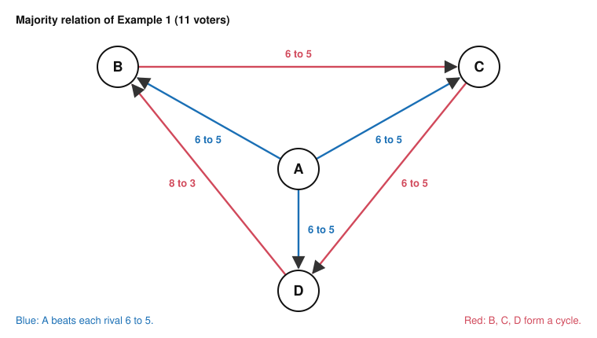

# Social Choice · Lesson 1.1: Profiles, rules and the majority relation

> ⏱ ~15 min · Module 1: The aggregation problem · Builds on: [`grad-game-theory` 5.1](../../grad-game-theory/lessons/05-01-social-choice-impossibility.md), [`proofs-primer` 2.1](../../proofs-primer/lessons/02-01-direct-proof-definitions.md) · Unlocks: [1.2 May's theorem](01-02-mays-theorem.md)

## Why this matters

Every theorem in this course says "no function of this type satisfies these axioms" or "only this one does". You cannot check such a claim until you know which type of function it is about, and "voting rule" names at least three. This lesson fixes the objects, says what an axiom about them asserts, and then studies the relation every later lesson consults: who beats whom head to head. It ends with a surprise: pairwise majority can produce any pattern of wins and losses whatsoever.

## The idea

Eleven people face four options. You can ask the group three different questions. *Rank all four* returns an ordering. *Pick one* returns a winner. *Which options are winners?* returns a set, which matters when the honest answer is a tie. Each question defines a different machine.

An axiom is a property of the machine over **every** possible input, not of one election. "Anonymous" does not mean "this count treated everyone fairly". It means: take any ballot box, reshuffle which voter cast which ballot, and the output never moves. Refuting an axiom takes one input and one reshuffle that moves the output: a counterexample, this course's signature skill.

The most natural thing to compute from ballots is the set of head-to-head results. The happy case is an option that wins all of its head-to-heads. But head-to-heads need not fit together into a ranking: [`grad-game-theory` 5.1](../../grad-game-theory/lessons/05-01-social-choice-impossibility.md) showed three options chasing each other in a cycle. That cycle is the tip of something much larger.

## The objects and the result

**Profiles.** Voters $N = \{1, \dots, n\}$; a finite set of alternatives $A$ with $|A| = m \ge 2$. A strict ranking is a relation $\succ$ on $A$ that is complete (any two distinct alternatives are compared), transitive ($x \succ y$ and $y \succ z$ imply $x \succ z$) and antisymmetric; $\mathcal{L}(A)$ is the set of them. Voter $i$ holds $\succ_i \in \mathcal{L}(A)$. A **[profile](../reference.md#profile)** is $\mathbf{P} = (\succ_1, \dots, \succ_n) \in \mathcal{L}(A)^n$, written in tables as "5: C ≻ A ≻ D ≻ B" (five voters, that ranking). A **domain** $\mathcal{D} \subseteq \mathcal{L}(A)^n$ is the set of profiles a rule must handle; the **unrestricted domain** is all of $\mathcal{L}(A)^n$. *In words:* a profile is the full contents of the ballot box, and the domain says which ballot boxes can occur.

**Three kinds of rule.** Let $\mathcal{R}(A)$ be the complete, transitive weak orders on $A$ (ties allowed).

- A **[social welfare function](../reference.md#social-welfare-function)** is $F : \mathcal{D} \to \mathcal{R}(A)$. *In words:* ballots in, a social ranking out.
- A **[social choice function](../reference.md#social-choice-function)** is $f : \mathcal{D} \to A$. *In words:* ballots in, one winner out.
- A **social choice correspondence** is $C : \mathcal{D} \to 2^A \setminus \{\varnothing\}$. *In words:* ballots in, a non-empty set of tied winners out.

$C$ is **resolute** if $|C(\mathbf{P})| = 1$ for every $\mathbf{P}$; a resolute correspondence is a social choice function. A **tie-breaking rule** turns a correspondence into a function, for instance by a fixed order of $A$ or by voter 1's ballot. Example 2 shows what tie-breaking costs.

**Axioms are properties of the function.** For a permutation $\sigma$ of $N$, let $\mathbf{P}^\sigma = (\succ_{\sigma(1)}, \dots, \succ_{\sigma(n)})$: the same ballots, reassigned to voters. For a permutation $\pi$ of $A$, let $\pi\mathbf{P}$ rename each alternative $x$ as $\pi(x)$ on every ballot. On the unrestricted domain, which is closed under both operations:

- **[Anonymity](../reference.md#anonymity):** $f(\mathbf{P}^\sigma) = f(\mathbf{P})$ for every $\mathbf{P}$ and every $\sigma$. *In words:* only how many voters cast each ranking matters, not who cast it.
- **[Neutrality](../reference.md#neutrality):** $f(\pi\mathbf{P}) = \pi(f(\mathbf{P}))$ for every $\mathbf{P}$ and every $\pi$. *In words:* rename the candidates and the winner is renamed with them; no candidate is favoured by its label.

For a welfare function or a correspondence, apply $\pi$ to the output ranking or set. The dictatorship "$f(\mathbf{P})$ is voter 1's top choice" is neutral but not anonymous. To show an axiom fails, exhibit one profile and one permutation.

**The majority relation.** Let $n(x, y)$ be the number of voters with $x \succ_i y$. The **[majority relation](../reference.md#majority-relation)** is

$$x \, M \, y \iff n(x, y) > n(y, x),$$

and the **weak majority relation** is $x \, R \, y \iff n(x, y) \ge n(y, x)$. *In words:* $x \, M \, y$ says $x$ wins the head-to-head outright; $x \, R \, y$ says $x$ at least ties it. $R$ is always complete; $M$ is always asymmetric (never both $x \, M \, y$ and $y \, M \, x$) but may leave a pair unranked.

A **[Condorcet winner](../reference.md#condorcet-winner)** is an $x$ with $x \, M \, y$ for every $y \ne x$; a **Condorcet loser** is an $x$ with $y \, M \, x$ for every $y \ne x$. By asymmetry there is at most one of each. The three-voter cycle of [`grad-game-theory` 5.1](../../grad-game-theory/lessons/05-01-social-choice-impossibility.md) has neither.

**Proposition 1.** If $n$ is odd and every ballot is strict, then $M$ is a **tournament**: for all distinct $x, y$, exactly one of $x \, M \, y$ and $y \, M \, x$ holds. *In words:* an odd electorate never ties a head-to-head.

*Proof.*

1. Each voter ranks $x$ and $y$ strictly, so $n(x, y) + n(y, x) = n$.
2. If $n(x, y) = n(y, x)$, then $n = 2\,n(x, y)$ is even, contradicting the hypothesis. So the two counts differ.
3. Exactly one count is larger, so exactly one of $x \, M \, y$, $y \, M \, x$ holds. ∎

Proposition 1 delivers completeness. It says nothing about transitivity, and the next theorem shows nothing can.

**[McGarvey's theorem](../reference.md#mcgarveys-theorem)** (David McGarvey, "A theorem on the construction of voting paradoxes", *Econometrica*, 1953). Let $T$ be any tournament on a finite set $A$ with $m$ elements. There is a profile of strict rankings with $n = m(m-1)$ voters whose majority relation is exactly $T$, and adding one voter gives an odd electorate with the same majority relation. *In words:* majority voting can produce every pattern of head-to-head results, cycles included.

*Proof.*

1. **Gadget.** Fix an ordered pair $(x, y)$ and list the other alternatives in some order $z_1, \dots, z_{m-2}$. Take two voters:
$$x \succ y \succ z_1 \succ \dots \succ z_{m-2}, \qquad z_{m-2} \succ \dots \succ z_1 \succ x \succ y.$$
2. Both put $x$ above $y$, so on $\{x, y\}$ the gadget contributes $n(x, y) - n(y, x) = +2$.
3. On any other pair the two voters disagree: the first puts $x$ and $y$ above every $z_k$, the second below; and the second reverses the first's order of the $z$'s. So every other pair gets margin $0$.
4. Add one gadget for each of the $\binom{m}{2}$ arcs $(x, y)$ of $T$. Margins add over voters, so each pair's margin is $+2$ in $T$'s direction and $M = T$, with $2\binom{m}{2} = m(m-1)$ voters.
5. Add one more voter with any ranking. Every margin changes by $\pm 1$ and stays positive in $T$'s direction, and $n$ is now odd. ∎

Far fewer voters suffice (Stearns, 1959; later Erdős and Moser); only existence matters here.

**Where the argument is weakest.** Step 1 uses rankings such as $z_{m-2} \succ \dots \succ x \succ y$ freely: the proof needs the unrestricted domain. Restrict the ballots, for instance to rankings that are single-peaked on a line, and the gadgets are no longer available; there the majority relation is forced to be transitive ([3.3](03-03-single-peakedness-black-and-moulin.md)). So McGarvey's theorem is exactly as strong as the domain assumption, and Module 3 is a study of what happens without it. The theorem is also pure existence: every pattern *can* occur, and it says nothing about how often one *does* ([1.4](01-04-how-often-do-cycles-happen.md)).

## Picture

The majority relation of Example 1. A Condorcet winner exists, yet $M$ is not transitive.

## Worked examples

**Example 1 (clean): the majority relation of eleven voters.**

| Voters | Ranking |
|---|---|
| 1 | A ≻ B ≻ C ≻ D |
| 2 | B ≻ D ≻ A ≻ C |
| 5 | C ≻ A ≻ D ≻ B |
| 3 | D ≻ B ≻ A ≻ C |

Each group has a different top choice, so call them the A-first (1 voter), B-first (2), C-first (5) and D-first (3) groups. For each pair, add the groups that put the first alternative above the second:

- A vs B: A-first and C-first, so $n(A, B) = 1 + 5 = 6$ and A wins 6 to 5. A vs C: A-, B- and D-first, $1 + 2 + 3 = 6$, so 6 to 5. A vs D: A- and C-first, 6 to 5.
- B vs C: A-, B- and D-first, 6 to 5. C vs D: A- and C-first, 6 to 5. B vs D: only A- and B-first, so B gets 3 and D wins 8 to 3.

So A is the Condorcet winner, and among the rest $B \, M \, C$, $C \, M \, D$, $D \, M \, B$: a cycle. Each of B, C, D beats one rival, so there is no Condorcet loser. $n = 11$ is odd, so $M$ is a tournament, as Proposition 1 promised, but not a transitive one.

The three output types now part company. A has one first-place vote out of eleven, so a social choice function that counts first places (plurality) picks C, with 5. A correspondence that returns the Condorcet winner returns $\{A\}$. A social welfare function that respects $M$ must still break the B, C, D cycle somehow, and $M$ alone does not say how.

**Example 2 (where the hypothesis bites): even electorates.** Proposition 1 needed $n$ odd. Drop it and anonymity, neutrality and resoluteness collide.

**Claim.** Let $m = 2$, $A = \{a, b\}$, and $n$ even. No resolute social choice function on the unrestricted domain is both anonymous and neutral.

*Proof.*

1. Let $\mathbf{P}$ have $n/2$ voters with $a \succ b$ and $n/2$ with $b \succ a$ (possible because $n$ is even).
2. Let $\pi$ swap $a$ and $b$. Then $\pi\mathbf{P}$ contains the same two ballots, $n/2$ of each, cast by the other halves of the electorate, so $\pi\mathbf{P} = \mathbf{P}^\sigma$ for a $\sigma$ that swaps the halves.
3. Anonymity gives $f(\pi\mathbf{P}) = f(\mathbf{P}^\sigma) = f(\mathbf{P})$. Neutrality gives $f(\pi\mathbf{P}) = \pi(f(\mathbf{P}))$.
4. So $f(\mathbf{P}) = \pi(f(\mathbf{P}))$, but $\pi$ fixes neither $a$ nor $b$. Contradiction. ∎

With $n$ odd, simple majority is resolute, anonymous and neutral, and Proposition 1 is exactly what makes it resolute. With $n$ even, every way out gives something up. Break ties alphabetically: anonymous, not neutral (on $\mathbf{P}$ it picks $a$; on $\pi\mathbf{P}$, the same ballots, it still picks $a$, where neutrality demands $b$). Break ties by voter 1's ballot: neutral, not anonymous. Or drop resoluteness and return $\{a, b\}$ on a tie: the majority correspondence, anonymous and neutral, which is the object [1.2](01-02-mays-theorem.md) characterizes.

## Watch out

- **You might think an odd number of voters guarantees a Condorcet winner, but actually** it guarantees only that $M$ is complete. McGarvey's theorem realizes every tournament with an odd electorate, cycles included.
- **You might think a Condorcet winner makes $M$ transitive, but actually** Example 1 has one and a cycle beneath it. "Who wins" and "how does the group rank the rest" are different questions, answered by different objects.
- **You might think resoluteness is a harmless technicality, but actually** with an even electorate it forces a choice between anonymity and neutrality (Example 2). Every tie-break spends one of them, which is why May's theorem is stated for a correspondence.

## One-liner

> A voting rule is a function from ballot boxes to a ranking, a winner or a set of winners; axioms constrain it on every box at once; and with an odd electorate pairwise majority always answers every head-to-head but can arrange the answers into any pattern at all.

## Problems

**P1 (🟢) *(Formal.)*** Seven voters rank W, X, Y, Z:

| Voters | Ranking |
|---|---|
| 3 | W ≻ X ≻ Y ≻ Z |
| 2 | Y ≻ X ≻ Z ≻ W |
| 2 | Z ≻ Y ≻ X ≻ W |

(a) Compute $n(x, y)$ for all six pairs, the majority relation $M$, and the Condorcet winner and loser if they exist.
(b) Find the plurality winner (most first places). Is $M$ transitive? One sentence relating the two answers.

**P2 (🟡) *(Formal (a)–(c).)*** A rule $g$ on $A = \{A, B, C\}$ accepts any number of voters $n \ge 1$. If $n$ is odd, $g$ picks voter 1's top choice. If $n$ is even, $g$ picks the plurality winner, breaking ties alphabetically (A before B before C).

(a) Show $g$ is not anonymous: give a profile and a permutation of voters that changes the outcome, with the smallest $n$ for which this is possible, and say why no smaller $n$ works.
(b) Show $g$ is not neutral, again with the smallest possible $n$.
(c) Prove that $g$ restricted to odd $n$ is neutral.

**P3 (🔴, optional) *(Formal (a) · Exegetical (b).)*** An invented committee memo: "Our bylaws require an odd number of members. So majority rule always gives us a clear choice: with no ties possible, one option must beat all the others."

(a) Build a profile with five voters and three alternatives on which no alternative beats both others. Show all three pairwise counts.
(b) In 80 words or fewer: what does an odd membership guarantee, what property does the memo confuse it with, and which theorem in this lesson shows the memo fails for every number of alternatives from three up?

Solutions

**P1** *(Formal.)*

(a) W is ranked first by the 3 and last by the other 4, so W loses every pair 3 to 4: $n(W, X) = n(W, Y) = n(W, Z) = 3$.

X vs Y: only the first group puts X above Y, so Y wins 4 to 3. X vs Z: the first two groups put X above Z, so X wins 5 to 2. Y vs Z: the first two groups put Y above Z, so Y wins 5 to 2.

$M$: $Y \, M \, X$, $Y \, M \, Z$, $Y \, M \, W$, $X \, M \, Z$, $X \, M \, W$, $Z \, M \, W$. Condorcet winner Y; Condorcet loser W.

(b) First places: W 3, Y 2, Z 2, X 0. Plurality elects W. $M$ is transitive, the ordering $Y \succ X \succ Z \succ W$. So the plurality winner is the Condorcet loser, even though the majority relation here is a perfectly coherent ranking: the trouble lies in the rule, not in any cycle.

**Wrong turns:** reading X vs Y off the first group alone (X above Y for 3 voters) and forgetting that both other groups put Y above X. Concluding that a coherent $M$ means every reasonable rule agrees with it.

---

**P2** *(Formal (a)–(c).)*

(a) For $n = 3$: $\mathbf{P} = (A \succ B \succ C,\ B \succ A \succ C,\ B \succ A \succ C)$ gives $g(\mathbf{P}) = A$. Swap voters 1 and 2: the new voter 1 holds $B \succ A \succ C$, so the outcome is B. No smaller $n$ works: with $n = 1$ the only permutation is the identity, and with $n = 2$ the rule counts first places, which do not depend on who cast which ballot (alphabetical tie-breaking uses the candidates' names, not the voters').

(b) For $n = 2$: $\mathbf{P} = (A \succ B \succ C,\ B \succ A \succ C)$ is a 1–1 plurality tie between A and B, so $g(\mathbf{P}) = A$. Let $\pi$ swap A and B: $\pi\mathbf{P} = (B \succ A \succ C,\ A \succ B \succ C)$, again a tie, so $g(\pi\mathbf{P}) = A$, while neutrality requires $\pi(A) = B$. No smaller $n$: with $n = 1$, $g$ is voter 1's top, which is neutral by (c).

(c) For odd $n$, renaming moves voter 1's top along with everything else: the top of $\pi(\succ_1)$ is $\pi$ applied to the top of $\succ_1$. So $g(\pi\mathbf{P}) = \pi(g(\mathbf{P}))$ for every profile and every $\pi$. ∎

**Wrong turns:** "proving" non-anonymity in the even case by pointing at the tie-break, which favours a candidate, not a voter. Checking neutrality by renaming the ballots but not the output.

---

**P3** *(Formal (a) · Exegetical (b), strict.)*

**Accept:** any five strict rankings of three alternatives in which every alternative loses at least one pairwise count, with all three counts shown.

(a) Model answer: 2: A ≻ B ≻ C, 2: B ≻ C ≻ A, 1: C ≻ A ≻ B. A beats B 3 to 2; B beats C 4 to 1; C beats A 3 to 2. Each alternative loses once, so none beats both others, and $M$ is the cycle $A \, M \, B \, M \, C \, M \, A$.

**Must hit, strict (b):**

- Odd membership guarantees that no pairwise vote ties: $M$ is complete (Proposition 1).
- The memo confuses completeness with transitivity, or with the existence of a Condorcet winner.
- McGarvey's theorem: every tournament, including a cyclic one, is the majority relation of some profile, and of one with an odd number of voters.

**Wrong turns:** answering "the memo is right only with two options" without naming the property; citing Arrow's theorem, which is about social welfare functions satisfying several axioms, not about what majority's head-to-heads can look like.

**Model answer (b):** An odd membership guarantees only that every head-to-head has a winner, so the majority relation is complete. The memo slides from that to transitivity, or to a Condorcet winner, which completeness does not give. McGarvey's theorem shows that for any number of alternatives from three up, some profile with an odd number of voters produces a cycle, so no option beats all the others.

## Connections

- **Backward:** [`grad-game-theory` 5.1](../../grad-game-theory/lessons/05-01-social-choice-impossibility.md) introduced social welfare and social choice functions and the three-voter cycle; this lesson makes the objects precise and shows the cycle is one of every possible pattern. The transitivity proofs are [`proofs-primer` 2.1](../../proofs-primer/lessons/02-01-direct-proof-definitions.md)'s "unpack the definition" move.
- **Forward:** [1.2](01-02-mays-theorem.md) characterizes the majority correspondence of Example 2 by anonymity, neutrality and one more axiom. [1.3](01-03-arrow-as-a-map.md) restates Arrow's axioms for social welfare functions. [1.4](01-04-how-often-do-cycles-happen.md) asks how often McGarvey's cycles actually occur. Copeland and Kemeny ([2.3](02-03-condorcet-methods-and-kemeny.md)) are two ways to turn a tournament into a winner or a ranking, and [3.3](03-03-single-peakedness-black-and-moulin.md) is where restricting the domain makes $M$ transitive.
- **Sideways:** a tournament is also a round-robin sports league (every pair plays once, no draws), and "who is the champion of a league with a cycle?" is the same question. [`political-philosophy` 5.4](../../political-philosophy/lessons/05-04-does-social-choice-wound-democracy.md) takes up whether such cycles threaten democratic legitimacy; McGarvey's theorem supplies the possibility, never the frequency.
