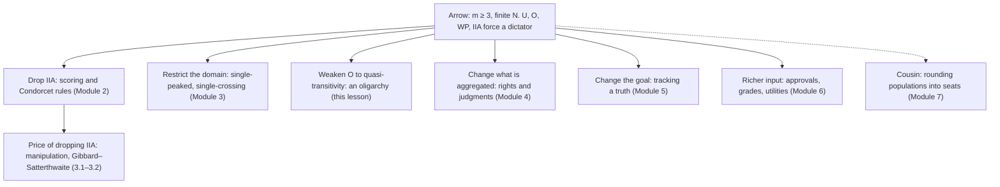

# Social Choice · Lesson 1.3: Arrow as a map

> ⏱ ~15 min · Module 1: The aggregation problem · Builds on: [1.1 Profiles, rules and the majority relation](01-01-profiles-rules-and-the-majority-relation.md), [1.2 May's theorem](01-02-mays-theorem.md) · Unlocks: [1.4 How often do cycles happen?](01-04-how-often-do-cycles-happen.md), [2.1 Scoring rules](02-01-scoring-rules.md)

## Why this matters

[1.2](01-02-mays-theorem.md) gave a clean positive answer: with two alternatives, simple majority is the one rule with May's four properties. Add a third alternative and that answer collapses. Arrow's theorem says exactly how. Its proof belongs to [`grad-game-theory` 5.1](../../grad-game-theory/lessons/05-01-social-choice-impossibility.md). This lesson uses the theorem as a **map**: five conditions that cannot all hold, so every positive result in this course is a choice of which one to give up. Learn the map and you can place each later lesson on it.

## The idea

Make five reasonable demands of a rule that turns everyone's ranking into society's ranking. It works on any ballots. It returns a genuine ranking. It agrees with a unanimous electorate. It decides "x or y?" by looking only at how people rank x against y. Nobody gets to dictate. Each familiar rule keeps four and drops one. Majority drops the ranking: it can cycle. The Borda count drops the "only x against y" rule: it reads how far apart voters place x and y. Dictatorship keeps everything except the last demand. Arrow's theorem says this pattern is forced. With three or more alternatives, **no rule keeps all five.**

So the useful question is not "which rule is perfect?" It is "which demand will you drop, and what do you get for it?" Module 2 drops independence, Module 3 restricts the ballots allowed, and Modules 4–6 change what gets aggregated.

## The theorem

**Setup.** Voters $N = \{1, \dots, n\}$, finite; alternatives $A$, $|A| = m$. $\mathcal{L}(A)$ is the set of strict rankings of $A$; $\mathcal{R}(A)$ is the set of *weak orders* (complete, transitive, ties allowed). A profile $\mathbf{P} = (\succ_1, \dots, \succ_n)$ lists one strict ranking per voter. A **social welfare function** is a map

$$F : \mathcal{L}(A)^n \to \mathcal{R}(A), \qquad \mathbf{P} \mapsto \succsim_F,$$

with strict part $\succ_F$ and indifference $\sim_F$. *In words:* every possible profile goes in, a complete transitive social ranking comes out.

Writing $F$ this way builds two conditions into the type:

- **[Unrestricted domain](../reference.md#unrestricted-domain) (U):** $F$ is defined on all of $\mathcal{L}(A)^n$. *In words:* no profile may be refused.
- **Social ordering (O):** $F(\mathbf{P})$ is complete and transitive. *In words:* the output is a real ranking, never a cycle.

Three more are conditions on $F$:

- **[Weak Pareto](../reference.md#weak-pareto) (WP):** if $x \succ_i y$ for every $i$, then $x \succ_F y$. *In words:* society follows a unanimous electorate.
- **[Independence of irrelevant alternatives](../reference.md#independence-of-irrelevant-alternatives) (IIA):** if profiles $\mathbf{P}$ and $\mathbf{P}'$ have every voter ranking $x$ against $y$ the same way, then $F(\mathbf{P})$ and $F(\mathbf{P}')$ rank $x$ against $y$ the same way. *In words:* society's verdict on a pair depends only on the voters' verdicts on that pair.
- **[Non-dictatorship](../reference.md#non-dictatorship) (ND):** there is no voter $d$ such that $x \succ_d y$ implies $x \succ_F y$ for every profile and every pair.

**[Arrow's theorem](../reference.md#arrows-theorem)** (Kenneth Arrow, *Social Choice and Individual Values*, 1951; the conditions above are the form he restated in the 1963 second edition). If $m \ge 3$ and $N$ is finite, every $F : \mathcal{L}(A)^n \to \mathcal{R}(A)$ that satisfies WP and IIA is dictatorial.

*In words:* with three or more options, a rule that always outputs a ranking, follows unanimity and looks only at pairwise information hands all power to one voter.

**The proof, in one paragraph (cited, not repeated).** Call a coalition $S$ *decisive* for $x$ over $y$ if $x \succ_F y$ whenever everyone in $S$ ranks $x$ above $y$. WP makes $N$ decisive for every pair. *Field expansion:* using U, IIA, transitivity and a third alternative, a coalition decisive for one pair is decisive for every pair. *Contraction:* split a decisive $S$ into two parts; one cleverly chosen profile plus transitivity makes one part decisive. Since $N$ is finite, repeated halving ends at a single voter, and that voter is the dictator. [`grad-game-theory` 5.1](../../grad-game-theory/lessons/05-01-social-choice-impossibility.md) runs the argument. Note where each hypothesis is used: $m \ge 3$ in field expansion, transitivity in both steps, finiteness in the halving. With infinitely many voters the halving need not stop, and non-dictatorial rules exist.

**What each condition excludes.** Every row drops exactly one condition. Each row was checked exhaustively on all 216 profiles of three voters over three alternatives; the failures hold in general.

| Rule | Drops | How it fails |
|---|---|---|
| Majority relation $M$ ([1.1](01-01-profiles-rules-and-the-majority-relation.md)) | O | can cycle (a Condorcet cycle) |
| Borda count (2, 1, 0 points) | IIA | Example 1 below |
| Dictatorship of voter 1 | ND | — |
| A fixed ranking, whatever the ballots | WP | ignores unanimity |
| Majority on single-peaked profiles, $n$ odd (Module 3) | U | refuses some profiles |
| Pareto extension rule (below) | transitivity, keeping quasi-transitivity | Example 2 below |

**Why IIA is the contested condition.** U and O describe the job, WP is close to uncontroversial, and dictatorship is the conclusion everyone wants to avoid. IIA is where critics push. It forbids two kinds of information. **Positional:** where $z$ sits between $x$ and $y$ on a ballot. **Intensity:** how strongly a voter prefers $x$ to $y$, which a ranking reveals only through what lies between them. A Borda defender says positions are a crude but honest measure of intensity, and that ignoring them throws away evidence. An IIA defender answers that a rule which reads positions rewards voters who place a rival's challenger strategically. IIA rules out more than intensity, though: in P1 you will show it also rules out the Copeland ranking, which uses nothing but pairwise majorities.

**Weakening the ordering.** Call $\succsim_F$ *[quasi-transitive](../reference.md#quasi-transitivity)* if its strict part $\succ_F$ is transitive, while indifference need not be. *In words:* "strictly better than" chains, but "as good as" may not. Amartya Sen (1969, *Review of Economic Studies*) showed that U, WP, IIA and ND are compatible with a complete, quasi-transitive social relation. The standard witness is the **Pareto extension rule**:

$$x \succ_F y \iff x \succ_i y \text{ for every } i \in N; \qquad \text{otherwise } x \sim_F y.$$

*In words:* society strictly prefers $x$ only when everyone does, and is indifferent otherwise.

The escape has a price. Allan Gibbard's **[oligarchy theorem](../reference.md#oligarchy-theorem)** (a 1969 manuscript, published 2014): if $m \ge 3$, $N$ is finite, and $F$ satisfies U, WP and IIA with a complete quasi-transitive output, then there is a nonempty set $O \subseteq N$ of *oligarchs* such that

1. if every $i \in O$ has $x \succ_i y$, then $x \succ_F y$ (the oligarchy is decisive), and
2. if some $i \in O$ has $x \succ_i y$, then not $y \succ_F x$ (each oligarch has a veto).

*In words:* quasi-transitivity spreads Arrow's dictator into a committee whose members are jointly decisive and individually able to block. $|O| = 1$ is dictatorship. $O = N$ is the Pareto extension rule: everyone holds a veto, so society decides almost nothing.

**Where the argument is weakest.** The critic's target is IIA. Without it, possibility returns at once: Borda keeps U, O, WP and ND. But the cost moves elsewhere rather than disappearing. Rules that read positions invite strategic placement of third alternatives, and [3.2](03-02-proving-gibbard-satterthwaite.md) will show that a non-dictatorial rule choosing one winner, with at least three possible outcomes, is manipulable in any case. A second line of attack is empirical: U demands an answer on every profile, but if real electorates rarely produce the troublesome ones, the theorem's bite depends on how often they occur ([1.4](01-04-how-often-do-cycles-happen.md)). A third targets the input: Arrow fed on bare rankings, and Module 6 asks what richer information buys. The theorem itself is silent on which concession is right. Whether any of this damages democracy is argued in [`political-philosophy` 5.4](../../political-philosophy/lessons/05-04-does-social-choice-wound-democracy.md).

## The map

Each solid arrow is one of the [escape routes](../reference.md#escape-routes). The dashed arrow is a family resemblance: apportionment has its own impossibility, with integers in place of rankings.

## Worked examples

**Example 1 (clean): Borda violates IIA.** Five voters, Borda scores 2, 1, 0.

| Profile | Ballots | Borda scores | Social A vs B |
|---|---|---|---|
| $\mathbf{P}$ | 3: A ≻ B ≻ C, 2: B ≻ C ≻ A | B 7, A 6, C 2 | B above A |
| $\mathbf{P}'$ | 3: A ≻ B ≻ C, 2: B ≻ A ≻ C | A 8, B 7, C 0 | A above B |

In $\mathbf{P}$: $A = 3 \cdot 2 = 6$, $B = 3 \cdot 1 + 2 \cdot 2 = 7$, $C = 2 \cdot 1 = 2$. Moving C to the bottom of the two B-first ballots gives $A = 6 + 2 = 8$, $B = 7$, $C = 0$. In both profiles the same three voters rank A above B and the same two rank B above A. Only C moved, yet society's A-versus-B verdict reversed. That is an IIA violation. Mechanism: in $\mathbf{P}$ the B-voters put C *between* B and A, so their B-over-A preference was worth 2 points instead of 1. Note too that in $\mathbf{P}$, A beats B 3–2 and C 3–2, so A is the Condorcet winner, yet Borda ranks it second. [2.1](02-01-scoring-rules.md) takes that tension up.

**Example 2 (where the hypothesis bites): the Pareto extension rule on $\mathbf{P}$.** Take $\mathbf{P}$ again. The only unanimous pair is B over C (5–0), so $B \succ_F C$. A versus B is split 3–2 and A versus C is split 3–2, so $A \sim_F B$ and $A \sim_F C$.

- *Quasi-transitive:* the strict part is the single pair $B \succ_F C$, which cannot form a broken chain. In general, if all voters prefer $x$ to $y$ and all prefer $y$ to $z$, each voter's own transitivity gives $x$ over $z$ for all.
- *Not transitive:* $C \sim_F A$ and $A \sim_F B$, so $C \succsim_F A$ and $A \succsim_F B$; transitivity would give $C \succsim_F B$, but $B \succ_F C$.
- *The oligarchy:* $O = N$. Any one voter can block any strict social preference, and here society settles only one of three pairs, on a profile where majority rule produced a clean ranking (A over B over C).

So Sen's possibility is real, and Gibbard's theorem shows it was bought by spreading the dictator's power into a veto for everyone.

## Watch out

- **You might think IIA means "removing a losing candidate should not change the winner."** That spoiler condition is about shrinking the menu. Arrow's IIA compares two *profiles* over the same set $A$: same pairwise ballots on $\{x, y\}$, same social verdict on $\{x, y\}$. Related ideas, different conditions; check which one a claim uses.
- **You might think Arrow shows majority rule fails on every profile.** It says no rule meets all five conditions on *all* profiles. On a profile with a transitive majority relation, majority works fine. And the hypothesis $m \ge 3$ is essential: with two alternatives, May's theorem gives a rule satisfying everything.
- **You might think dropping full transitivity is a free lunch.** The oligarchy theorem keeps U, WP and IIA and finds a decisive committee with individual vetoes. Weakening the output relocates the concentration of power; it does not remove it.

## One-liner

> Arrow lists five conditions you cannot have together once there are three alternatives; every rule in this course is a decision about which one to drop, and dropping one has a cost of its own.

## Problems

**P1 (🟢)** *(Formal (a)–(b).)* The **Copeland ranking** scores each alternative by (pairwise majority wins) minus (pairwise majority losses) and ranks by score, ties allowed. Five voters: 2: A ≻ B ≻ C, 2: B ≻ A ≻ C, 1: C ≻ A ≻ B.

(a) Compute every $n(x, y)$, the majority relation and the Copeland ranking.

(b) Build a five-voter profile $\mathbf{P}'$ in which every voter ranks A against B exactly as in (a), but the Copeland ranking does not put A strictly above B. Then say in one sentence where the "irrelevant" information got into a rule that uses only pairwise majorities.

**P2 (🟡)** *(Formal (a)–(c).)* Three voters. The **committee rule** with $O = \{1, 2\}$ sets $x \succ_F y$ iff voters 1 and 2 both rank $x$ above $y$, and $x \sim_F y$ otherwise.

(a) Profile: voter 1: B ≻ C ≻ A, voter 2: C ≻ A ≻ B, voter 3: A ≻ C ≻ B. Find $\succsim_F$ on all three pairs and exhibit a failure of transitivity.

(b) Prove the rule satisfies WP, IIA and quasi-transitivity on every profile. One line each.

(c) Prove that voter 1 has a veto but is not a dictator, and that voter 3 has no veto.

**P3 (🔴, optional)** *(Evaluative.)* A colleague says: "IIA is an unreasonable demand. Of course a voter who puts C between B and A cares more about B over A, and a good rule should listen." In 150 words or fewer, say whether IIA is a reasonable condition, stating precisely what Arrow's theorem forbids and what dropping IIA costs.

Solutions

**P1** *(Formal (a)–(b))*

(a) $n(A, B) = 2 + 1 = 3$, $n(B, A) = 2$; $n(A, C) = 4$, $n(C, A) = 1$; $n(B, C) = 4$, $n(C, B) = 1$. Majority relation: $A \, M \, B$, $A \, M \, C$, $B \, M \, C$, transitive. Copeland scores: A $2 - 0 = 2$, B $1 - 1 = 0$, C $0 - 2 = -2$. Ranking A ≻ B ≻ C.

**Accept:** any five-voter profile in which each voter's A-versus-B ranking matches the original (the same three voters put A above B) and whose Copeland ranking has B at least as high as A, with the scores shown.

(b) Model answer: let the two B ≻ A ≻ C voters report B ≻ C ≻ A; keep the others. Now $n(A, B) = 3$ (unchanged), $n(C, A) = 2 + 1 = 3$ so $C \, M \, A$, and $n(B, C) = 4$ so $B \, M \, C$. The majority relation is the cycle $A \, M \, B \, M \, C \, M \, A$; every score is $1 - 1 = 0$, so $A \sim_F B$. The A-versus-B verdict changed from strict to tie with no voter changing their A-versus-B ranking: IIA fails. The information came through **C**: A's score counts A's contest with C, which depends on where voters place C relative to A.

**Wrong turns:** changing some voter's A-versus-B order (then the test is void); concluding Copeland satisfies IIA "because it only uses majorities," when IIA concerns the *social* verdict on one pair, and Copeland's verdict on A, B depends on the C-contests.

---

**P2** *(Formal (a)–(c))*

(a) Voters 1 and 2 agree only on C over A (B ≻ C ≻ A and C ≻ A ≻ B both have C above A). They split on A versus B (1: B, 2: A) and on B versus C (1: B, 2: C). So $C \succ_F A$, $A \sim_F B$, $B \sim_F C$. Failure: $A \succsim_F B$ and $B \succsim_F C$, but not $A \succsim_F C$, since $C \succ_F A$. (Voter 3 ranks A above C and is overridden.)

(b)

- WP: if every voter ranks $x$ above $y$, voters 1 and 2 do, so $x \succ_F y$.
- IIA: whether $x \succ_F y$, $y \succ_F x$ or $x \sim_F y$ depends only on how voters 1 and 2 rank $x$ against $y$.
- Quasi-transitivity: if $x \succ_F y$ and $y \succ_F z$, voters 1 and 2 each rank $x$ above $y$ above $z$, so each ranks $x$ above $z$ by their own transitivity, so $x \succ_F z$.

(c) Veto: if voter 1 ranks $x$ above $y$, then not both of 1 and 2 rank $y$ above $x$, so $y \succ_F x$ is impossible. Not a dictator: on the profile 1: A ≻ B ≻ C, 2: B ≻ A ≻ C, 3: A ≻ B ≻ C, voter 1 ranks A above B but $A \sim_F B$. Voter 3 has no veto: in (a), voter 3 ranks A above C, yet $C \succ_F A$.

**Wrong turns:** "proving" transitivity of $\succsim_F$ in (b), which (a) refutes: only the strict part chains. Taking a veto to mean the power to *impose*; a veto only blocks the opposite strict preference.

---

**P3** *(Evaluative)*

**Must hit, any verdict:**

- States the theorem exactly: for $m \ge 3$ and finitely many voters, no rule on the unrestricted domain with complete transitive output satisfies WP, IIA and ND. It does not say any particular rule is bad, nor that cycles are common.
- Says what IIA excludes: positional and intensity information, and (P1) any use of an $x$-versus-$z$ contest in the $x$-versus-$y$ verdict.
- Names a real cost of dropping it: exposure to strategic placement of third alternatives, or spoiler-style reversals as in Example 1. Optionally notes that Gibbard–Satterthwaite makes the strategic defence comparative, not absolute.
- Engages the colleague's premise: whether ballot position is evidence of intensity.

**Wrong turns:** saying Arrow proves democracy impossible; equating Arrow's IIA with the menu-deletion spoiler condition.

**Model answer, one of several:** Arrow forbids any non-dictatorial rule over three or more options that always returns a transitive ranking, respects unanimity and decides each pair on pairwise ballots alone. IIA is the cheapest condition to drop, since Borda keeps the rest. The colleague's premise is shaky, though: a C placed between B and A shows only that the voter ranks C there, not how much B beats A. Borda turns position into intensity by fiat, and voters can manufacture "intensity" by burying a rival's challenger. I would keep IIA as a strong default rather than an absolute demand, and accept that every rule pays somewhere.

## Flashback

**From Lesson [1.1](01-01-profiles-rules-and-the-majority-relation.md) (Profiles, rules and the majority relation):** *(Formal (a)–(b).)* Six voters rank A, B, C, D: 3: D ≻ B ≻ A ≻ C, 2: C ≻ B ≻ D ≻ A, 1: A ≻ B ≻ C ≻ D.

(a) Compute $n(x, y)$ for all six pairs and the majority relation $M$. Which pairs does $M$ leave unranked? Is there a Condorcet winner or a Condorcet loser?

(b) A seventh voter joins. Which alternatives can that one ballot make the Condorcet winner, and which ballots do it? Prove in two sentences that no other alternative can be made the winner.

Solution

**Worked arithmetic (a):**

- B vs A: B is above A on the 3 D-first and 2 C-first ballots, so $n(B, A) = 5$, $n(A, B) = 1$: $B \, M \, A$.
- B vs C: the D-first and A-first ballots, $n(B, C) = 4$, $n(C, B) = 2$: $B \, M \, C$.
- D vs A: the D-first and C-first ballots, $n(D, A) = 5$, $n(A, D) = 1$: $D \, M \, A$.
- A vs C: the D-first and A-first ballots, $n(A, C) = 4$, $n(C, A) = 2$: $A \, M \, C$.
- B vs D: $n(B, D) = 2 + 1 = 3 = n(D, B)$. C vs D: $n(C, D) = 2 + 1 = 3 = n(D, C)$. Both pairs are unranked.

No Condorcet winner: B and D each tie a contest. No Condorcet loser: A beats C, and C ties D. With $n = 6$ even, Proposition 1 does not apply and $M$ is not a tournament. Note that B, first on no ballot, has the best head-to-head record.

**Worked arithmetic (b):**

- One ballot raises each $n(x, y)$ by at most 1. With seven voters, $x$ is the Condorcet winner iff $n(x, y) \ge 4$ for every rival $y$, so among the original six $x$ needs $n(x, y) \ge 3$: it must already beat or tie every rival. Only B and D do. A trails B 1 to 5 and C trails A and B 2 to 4, so one ballot cannot lift either to 4.
- B wins with exactly the 12 ballots ranking B above D: its counts against A (5) and C (4) already suffice.
- D wins with exactly the 8 ballots ranking D above both B and C: its count against A is already 5.
- The other 4 ballots, those with C above D above B (A anywhere), give a tournament with no Condorcet winner. C ≻ D ≻ B ≻ A, for instance, yields $D \, M \, B$, $C \, M \, D$, $B \, M \, C$: a cycle. (12 + 8 + 4 = 24, all checked by script.)

**Wrong turns:** writing $B \, M \, D$ or $D \, M \, B$ for a 3–3 pair; $M$ leaves it unranked, and only the weak relation $R$ holds both ways. Reading B's zero first places as weakness. Assuming every seventh ballot produces a Condorcet winner because $n$ becomes odd: Proposition 1 gives a tournament, not a winner, and four ballots leave a cycle.

## Connections

- **Backward:** [1.1](01-01-profiles-rules-and-the-majority-relation.md) defined the majority relation that drops O; [1.2](01-02-mays-theorem.md) is the $m = 2$ case where nothing needs to be dropped. The proof is [`grad-game-theory` 5.1](../../grad-game-theory/lessons/05-01-social-choice-impossibility.md); [`grad-micro` 6.5](../../grad-micro/lessons/06-05-social-choice-welfare.md) states the theorem in welfare economics.
- **Forward:** [1.4](01-04-how-often-do-cycles-happen.md) measures how often O actually fails; [2.1](02-01-scoring-rules.md)–[2.4](02-04-monotonicity-and-participation.md) explore the rules without IIA; [3.2](03-02-proving-gibbard-satterthwaite.md) uses Arrow as a black box; [3.3](03-03-single-peakedness-black-and-moulin.md) drops U; [4.4](04-04-the-list-pettit-impossibility.md) recovers Arrow as a judgment-aggregation result; [6.3](06-03-utilities-in-possibility-out.md) shows which interpersonal comparisons escape.
- **Sideways:** IIA's ban on intensity is the ordinal, non-comparable information that [`decision-theory` 5.2](../../decision-theory/lessons/05-02-interpersonal-comparison-and-social-welfare-functions.md) shows is too poor for any non-dictatorial welfare function. Whether the impossibility wounds democracy is [`political-philosophy` 5.4](../../political-philosophy/lessons/05-04-does-social-choice-wound-democracy.md)'s question.
