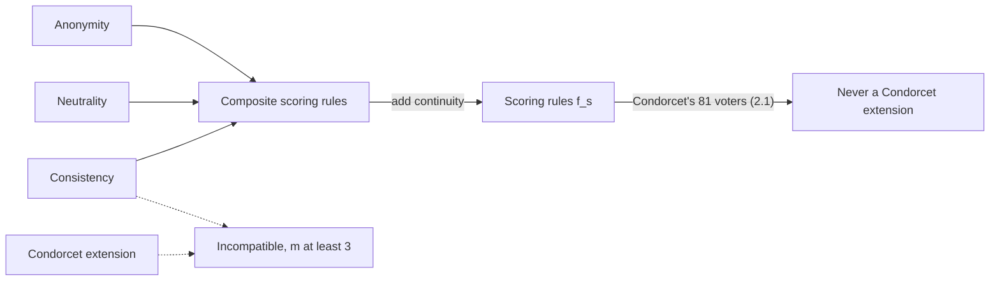

# Social Choice · Lesson 2.2: Consistency and Young's characterization

> ⏱ ~15 min · Module 2: Voting rules and their axioms · Builds on: [1.1 Profiles, rules and the majority relation](01-01-profiles-rules-and-the-majority-relation.md), [2.1 Scoring rules](02-01-scoring-rules.md) · Unlocks: [2.3 Condorcet methods and Kemeny](02-03-condorcet-methods-and-kemeny.md)

## Why this matters

[2.1](02-01-scoring-rules.md) showed that scoring rules and pairwise majorities can disagree: Condorcet's own 81-voter example has a [Condorcet winner](../reference.md#condorcet-winner) that loses under every scoring vector. That could be an accident of one profile. This lesson shows it is not. One axiom about combining electorates is satisfied by every scoring rule, characterizes them (with three more axioms), and is violated by every rule that always elects the Condorcet winner. The Borda–Condorcet quarrel of the 1780s turns out to be a quarrel about a single axiom.

## The idea

A party runs a primary in two regions and counts each region separately. Suppose both regions pick Ana. Shouldn't the pooled count pick Ana too? That is consistency: if separate electorates agree on a winner, merging them changes nothing. If they disagree, the axiom says nothing.

Scoring rules pass it for a bookkeeping reason: a candidate's total score in the merged electorate is just the sum of her regional scores. If she tops both columns, she tops their sum.

Pairwise majority has no such additive summary at the level of *winners*. The pairwise counts do add, but "who beats everybody" is not a sum of anything. A region with a majority cycle has no Condorcet winner, so a Condorcet rule must choose there on some other basis. Merge that region with one whose Condorcet winner is Ana, and the cycle's margins can hand the pooled electorate a different Condorcet winner. Ana won both regions and loses the merged count.

## The theorem

**Setting.** Alternatives $A$, $|A| = m$, fixed. Electorates vary: a profile $\mathbf{P}$ may have any finite number $n \ge 1$ of voters, each with a strict ranking $\succ_i$. A social choice correspondence $f$ maps every profile to a nonempty set $f(\mathbf{P}) \subseteq A$ of tied winners. If $\mathbf{P}_1$ and $\mathbf{P}_2$ are profiles of disjoint electorates, $\mathbf{P}_1 + \mathbf{P}_2$ is the profile of their union, and $k\mathbf{P}$ is $\mathbf{P}$ with every voter cloned $k$ times. $n(x,y)$ counts voters ranking $x$ above $y$.

**[Consistency](../reference.md#consistency)** (also called reinforcement):

$$f(\mathbf{P}_1) \cap f(\mathbf{P}_2) \ne \varnothing \ \Longrightarrow\ f(\mathbf{P}_1 + \mathbf{P}_2) = f(\mathbf{P}_1) \cap f(\mathbf{P}_2).$$

*In words:* whoever wins in both parts wins the whole, and nobody else does.

**[Continuity](../reference.md#continuity)** (the Archimedean property): if $f(\mathbf{P}_2) = \{x\}$, then for every $\mathbf{P}_1$ there is a $k$ with $f(\mathbf{P}_1 + j\mathbf{P}_2) = \{x\}$ for all $j \ge k$.

*In words:* enough copies of an electorate that elects $x$ outright swamp any fixed minority.

**[Scoring rules](../reference.md#scoring-rule).** For $s \in \mathbb{R}^m$, voter $i$ gives $s_k$ points to her $k$-th ranked alternative; $S_{\mathbf{P}}(x)$ is the total, and $f_s(\mathbf{P}) = \arg\max_x S_{\mathbf{P}}(x)$. A *composite* scoring rule uses vectors $s^1, \dots, s^k$: maximize $S^1$, break remaining ties by $S^2$, and so on.

**Theorem (J. Smith 1973; H. Peyton Young 1975, "Social choice scoring functions").** Let $f$ be a social choice correspondence on a fixed finite $A$ with a variable electorate.

1. $f$ is [anonymous](../reference.md#anonymity), [neutral](../reference.md#neutrality) and consistent if and only if it is a composite scoring rule.
2. $f$ is anonymous, neutral, consistent and continuous if and only if it is a scoring rule $f_s$ for a single $s$.

*In words:* "treat voters alike, treat candidates alike, respect agreement between electorates" leaves nothing but adding up points by rank. Note what it does *not* assert: $s$ need not be decreasing. Requiring $s_1 \ge \dots \ge s_m$ takes a further monotonicity axiom, and the constant vector (everyone always ties) passes all four axioms.

**Proof of the easy direction (consistency).** Let $W_j = f_s(\mathbf{P}_j)$, $M_j = \max_x S_{\mathbf{P}_j}(x)$, and suppose some $x^* \in W_1 \cap W_2$.

1. Scores add over disjoint electorates: $S_{\mathbf{P}_1+\mathbf{P}_2}(x) = S_{\mathbf{P}_1}(x) + S_{\mathbf{P}_2}(x)$, since each voter's points depend only on her own ballot.
2. For every $x$, $S_{\mathbf{P}_1+\mathbf{P}_2}(x) \le M_1 + M_2$, with equality iff $S_{\mathbf{P}_1}(x) = M_1$ and $S_{\mathbf{P}_2}(x) = M_2$, i.e. iff $x \in W_1 \cap W_2$.
3. $x^*$ attains $M_1 + M_2$, so the bound is the maximum, and the maximizers are exactly $W_1 \cap W_2$. ∎

For a composite rule, apply the same argument to the score vectors $(S^1, \dots, S^k)$ ordered lexicographically. Anonymity and neutrality are immediate. For continuity, if $f_s(\mathbf{P}_2) = \{x\}$ with lead $g > 0$ over every rival, then in $\mathbf{P}_1 + j\mathbf{P}_2$ $x$'s lead is at least $jg - D$, where $D$ is $x$'s largest deficit in $\mathbf{P}_1$. Take $k > D/g$.

**The hard direction (sketch).** Anonymity makes a profile a count vector $v \in \mathbb{Z}_{\ge 0}^{m!}$, one entry per ranking, and turns union into vector addition. Consistency gives $f(kv) = f(v)$, so $f$ extends to rational vectors. Then $C_x = \{v : f(v) = \{x\}\}$ is closed under addition and positive scaling, a convex cone, and the cones for distinct $x, y$ are disjoint. Separate $C_x$ from $C_y$ by a hyperplane through the origin (the weak form of the theorem in [`grad-game-theory` 1.1](../../grad-game-theory/lessons/01-01-convex-sets-functions-separating-hyperplanes.md)). A linear functional on count vectors is a weight per ranking, and neutrality forces that weight to be $s_{r(x)} - s_{r(y)}$, where $r(x)$ is $x$'s position in ranking $r$, for one $s$ shared by all pairs. Continuity stops profiles on the hyperplane from being sorted by anything else; without it, a second vector can break those ties, which is where composite rules come from.

**Proposition.** With $m = 3$, no Condorcet extension is consistent. A [Condorcet extension](../reference.md#condorcet-extension) is a correspondence with $f(\mathbf{P}) = \{x\}$ whenever $x$ is $\mathbf{P}$'s Condorcet winner.

*In words:* a rule that always elects the Condorcet winner must sometimes let two regions agree and the merged electorate overrule them. William Zwicker (2016, "Introduction to the theory of voting") states it for every $m \ge 3$; the extension is straightforward if $f$ is also Pareto. Proof: Example 2.

**Corollary.** No scoring rule, simple or composite, is a Condorcet extension. 2.1's 81-voter profile showed this for every decreasing score vector; the corollary covers every rule Young's axioms allow.

**Where the argument is weakest.** Consistency is a condition on a *family* of elections with different electorates, and it binds only when the parts agree. A Condorcet partisan rejects it: the merged electorate's pairwise majorities are new facts, and a region's choice in a cycle was never an endorsement to be inherited. Drop consistency and the Condorcet methods of [2.3](02-03-condorcet-methods-and-kemeny.md) come back. Ask consistency of output *rankings* instead of winners and Kemeny's rule satisfies it alongside Condorcet consistency (Young and Levenglick 1978).

## Picture

Solid arrows: Young's characterization. Dotted: the proposition. Consistency is the hinge between the two families.

## Worked examples

**Example 1 (clean): Borda across districts.** Borda is $s = (2, 1, 0)$.

| District | Profile | A | B | C | Winners |
|---|---|---|---|---|---|
| North | 2: A ≻ B ≻ C, 1: B ≻ A ≻ C | 5 | 4 | 0 | {A} |
| East | 1: A ≻ B ≻ C, 1: B ≻ A ≻ C | 3 | 3 | 0 | {A, B} |
| North + East | | 8 | 7 | 0 | {A} |
| South | 1: B ≻ C ≻ A, 2: C ≻ B ≻ A | 0 | 4 | 5 | {C} |
| North + South | | 5 | 8 | 5 | {B} |

North and East share A, and the union elects $\{A\} = \{A\} \cap \{A, B\}$, as the theorem requires. North and South share nobody, so consistency is silent, and the pooled count elects B, who won neither district. That is no violation; the axiom constrains only agreement.

**Example 2 (where the hypothesis bites): the proof of the proposition.** Take the six-voter cycle

$$\mathbf{P}_1:\ 2\colon B \succ A \succ C,\quad 2\colon A \succ C \succ B,\quad 2\colon C \succ B \succ A.$$

B beats A 4–2, A beats C 4–2, C beats B 4–2: no Condorcet winner. Relabeling $B \to A \to C \to B$ maps $\mathbf{P}_1$ to itself.

Now take $\mathbf{P}_2$: 2: A ≻ B ≻ C, 1: B ≻ C ≻ A. A beats B 2–1 and C 2–1, so A is its Condorcet winner. In the 9-voter union, B beats A 5–4, B beats C 5–4, and A beats C 6–3: **B** is the Condorcet winner.

Let $f$ be any Condorcet extension and pick $X \in f(\mathbf{P}_1)$.

1. If $X = A$: $f(\mathbf{P}_2) = \{A\}$, so consistency demands $f(\mathbf{P}_1 + \mathbf{P}_2) = \{A\}$. Condorcet consistency demands $\{B\}$. Contradiction.
2. If $X = C$ or $X = B$: apply the relabeling once or twice to $\mathbf{P}_2$. That fixes $\mathbf{P}_1$ and gives a $\mathbf{P}_2'$ with Condorcet winner $X$ whose union with $\mathbf{P}_1$ has Condorcet winner A or C respectively, never $X$. The same contradiction follows.

Every case is contradictory, so $f$ is not consistent. ∎ The script checks all three relabelings. Note that a single copy of the cycle is not enough: with margins of 1 the union only ties A with B. Doubling the cycle is what flips the merged electorate.

Borda, by contrast, scores $\mathbf{P}_1$ 6–6–6, $\mathbf{P}_2$ A 4, B 4, C 1, and the union A 10, B 10, C 7: winners $\{A, B\} = \{A, B, C\} \cap \{A, B\}$. Consistent, and blind to B's Condorcet win.

## Watch out

- **You might think two electorates with the same Condorcet winner can produce a different one when merged.** They cannot: if $n_j(x,y) > n_j(y,x)$ in both parts, adding gives the same strict inequality (P2a). Every counterexample needs one part *without* a Condorcet winner.
- **You might drop the variable electorate.** Consistency compares elections of different sizes. On a fixed set of $n$ voters the axiom has no content, and Young's theorem has nothing to say.
- **You might read "scoring rule" as "sensible scoring rule."** Young's axioms allow any $s \in \mathbb{R}^m$, including $s = (0, 0, 1)$, which elects whoever has the most last places. Decreasing scores come from an extra monotonicity condition, and singling out Borda among scoring rules takes more axioms again (Young 1974, "An axiomatization of Borda's rule"; Nitzan and Rubinstein 1981 for Borda's ranking).

## One-liner

> Points add and majorities don't: consistency plus anonymity and neutrality leaves exactly the scoring rules, and no rule that always crowns the Condorcet winner survives it.

## Problems

**P1 (🟢) *(Formal (a)–(b).)*** Two electorates use Borda, $s = (2, 1, 0)$. $E_1$: 3: A ≻ B ≻ C, 1: B ≻ C ≻ A, 1: C ≻ B ≻ A. $E_2$: 2: A ≻ B ≻ C, 1: B ≻ C ≻ A, 1: C ≻ B ≻ A.

(a) Find the Borda winners of $E_1$, $E_2$ and $E_1 + E_2$, and confirm consistency.
(b) Find the Condorcet winner of $E_1 + E_2$, if any. One sentence: what does the pair (a)–(b) illustrate?

**P2 (🟡) *(Formal (a)–(b).)*** (a) Prove: if $x$ is the Condorcet winner of $\mathbf{P}_1$ and of $\mathbf{P}_2$, it is the Condorcet winner of $\mathbf{P}_1 + \mathbf{P}_2$.
(b) Maximin elects $\arg\max_x \min_{y \ne x} n(x, y)$. Let $\mathbf{C}$ be one copy of Example 2's cycle: 1 each of B ≻ A ≻ C, A ≻ C ≻ B, C ≻ B ≻ A. Find an electorate $\mathbf{P}_2$ of at most three voters on which maximin elects $\{A\}$ but maximin on $\mathbf{C} + \mathbf{P}_2$ does not elect $\{A\}$. Conclude that maximin is not consistent.

**P3 (🔴, optional) *(Formal (a) · Exegetical (b).)*** Rule $g$: elect the plurality winners; break ties among them by Borda score. Let $\mathbf{T}$: 1 each of A ≻ C ≻ B, B ≻ A ≻ C, C ≻ A ≻ B, and $\mathbf{S}$: 1: B ≻ C ≻ A.

(a) Show $g(\mathbf{T}) = \{A\}$ but $g(\mathbf{S} + j\mathbf{T}) = \{B\}$ for every $j \ge 1$. What does plain Borda elect on $\mathbf{S} + j\mathbf{T}$ for $j \ge 2$?
(b) In 80 words or fewer: which axiom of Young's theorem does $g$ fail, what does that axiom rule out, and why is $g$ still consistent?

Solutions

**P1** *(Formal (a)–(b).)*

(a) Borda points per ballot: A ≻ B ≻ C gives (A, B, C) = (2, 1, 0); B ≻ C ≻ A gives (0, 2, 1); C ≻ B ≻ A gives (0, 1, 2).

- $E_1$: A $= 6$, B $= 3 + 2 + 1 = 6$, C $= 1 + 2 = 3$. Winners $\{A, B\}$.
- $E_2$: A $= 4$, B $= 2 + 2 + 1 = 5$, C $= 3$. Winner $\{B\}$.
- $E_1 + E_2$ (5: A ≻ B ≻ C, 2: B ≻ C ≻ A, 2: C ≻ B ≻ A): A $= 10$, B $= 11$, C $= 6$. Winner $\{B\}$.

$\{A, B\} \cap \{B\} = \{B\}$, as consistency requires. (Shortcut: the union's scores are the sums 6 + 4, 6 + 5, 3 + 3.)

(b) In the union A beats B 5–4 and C 5–4: **A is the Condorcet winner**, yet Borda elects B. Borda is consistent and not Condorcet-consistent, exactly the split the corollary predicts.

**Wrong turns:** treating a Borda tie in $E_1$ as a violation (correspondences return tied sets; consistency intersects them). Recounting the union from scratch and slipping; the scores simply add.

---

**P2** *(Formal (a)–(b).)*

(a) Fix $y \ne x$. Since the electorates are disjoint, $n_{\mathbf{P}_1 + \mathbf{P}_2}(x, y) = n_{\mathbf{P}_1}(x, y) + n_{\mathbf{P}_2}(x, y)$, and likewise for $n(y, x)$. By hypothesis $n_{\mathbf{P}_j}(x, y) > n_{\mathbf{P}_j}(y, x)$ for $j = 1, 2$. Adding the two strict inequalities gives $n(x, y) > n(y, x)$ in the union. This holds for every $y$, so $x$ is the union's Condorcet winner. ∎

(b) **Accept:** any $\mathbf{P}_2$ of at most three voters with maximin$(\mathbf{P}_2) = \{A\}$ and maximin$(\mathbf{C} + \mathbf{P}_2) \ne \{A\}$, with the tallies shown. (Seven such multisets exist; the script lists them.)

Model answer: $\mathbf{P}_2$ = 1: A ≻ B ≻ C. Maximin scores are A $= \min(1, 1) = 1$, B $= 0$, C $= 0$, so $\{A\}$. On $\mathbf{C}$ every candidate wins one pair 2–1 and loses one 1–2, so all three have maximin score 1 and maximin elects $\{A, B, C\}$. The intersection is $\{A\}$. In the 4-voter union, $n(A,B) = 2$, $n(B,A) = 2$, $n(A,C) = 3$, $n(C,A) = 1$, $n(B,C) = 2$, $n(C,B) = 2$. Maximin scores: A $= \min(2, 3) = 2$, B $= \min(2, 2) = 2$, C $= \min(1, 2) = 1$. Maximin elects $\{A, B\} \ne \{A\}$, so consistency fails.

**Wrong turns:** looking for a $\mathbf{P}_2$ whose union gives B a strict Condorcet win: with one copy of the cycle (margins of 1) that cannot happen, but a tie is already enough to break consistency. Forgetting to check $f(\mathbf{C})$: the intersection must be nonempty for the axiom to bind.

---

**P3** *(Formal (a) · Exegetical (b), strict.)*

(a) On $\mathbf{T}$ plurality is 1–1–1, a three-way tie. Borda: A $= 2 + 1 + 1 = 4$, B $= 0 + 2 + 0 = 2$, C $= 1 + 0 + 2 = 3$. So $g(\mathbf{T}) = \{A\}$. On $\mathbf{S} + j\mathbf{T}$, plurality gives A $= j$, B $= j + 1$, C $= j$, so B is the unique plurality winner and no tie-break is reached: $g = \{B\}$ for every $j$. Plain Borda on $\mathbf{S} + j\mathbf{T}$ gives A $4j$, B $2j + 2$, C $3j + 1$: a three-way tie at $j = 1$, and $\{A\}$ for all $j \ge 2$, as continuity requires.

**Must hit, strict (b):**

- $g$ fails continuity: $\mathbf{T}$ elects A outright, yet no number of copies of $\mathbf{T}$ outweighs one extra voter.
- Continuity rules out lexicographic priority: a second criterion that counts only when the first is exactly tied, so the first criterion's ties can never be swamped by repetition.
- $g$ is still consistent because it is a composite scoring rule: the score pairs (plurality, Borda) add across electorates, and a lexicographic maximum in both parts stays maximal in the sum.

**Wrong turns:** saying $g$ violates consistency; it does not ($\mathbf{S}$ and $\mathbf{T}$ have different winners, so consistency is silent). Saying continuity fails because $\mathbf{T}$ has a plurality tie: the failure is that the tie-break's verdict, $\{A\}$, never survives a perturbation.

**Model answer (b):** $g$ fails continuity. Continuity says an electorate that elects $x$ outright, copied enough times, overwhelms any fixed addition. Composite rules break that: A wins $\mathbf{T}$ only on the tie-break, and the tie in plurality persists under copying, so one B-voter decides forever. $g$ stays consistent because the (plurality, Borda) scores add across electorates and lexicographic maxima survive addition.

## Flashback

**From Lesson [1.4](01-04-how-often-do-cycles-happen.md) (How often do cycles happen?):** *(Formal (a) · Exegetical (b).)* A **cyclic culture**: each voter independently holds A ≻ B ≻ C, B ≻ C ≻ A or C ≻ A ≻ B, each with probability $1/3$, and no other ranking occurs. Let $a$, $b$, $c$ be the numbers of voters holding each, with $n = a + b + c$ odd.

(a) Show that there is no Condorcet winner iff $a$, $b$ and $c$ are all less than $n/2$. Then compute the exact probability of no Condorcet winner for $n = 3$ and $n = 5$, and compare the $n = 3$ value with impartial culture's.

(b) In two sentences: what happens to this probability as $n \to \infty$, and why does that not contradict Tsetlin, Regenwetter and Grofman's result from 1.4?

Solution

**Worked arithmetic (a):**

- A is above B on the A ≻ B ≻ C and C ≻ A ≻ B ballots, so $n(A, B) = a + c = n - b$, and $A \, M \, B$ iff $b < n/2$. Likewise $n(B, C) = a + b = n - c$ and $n(C, A) = b + c = n - a$.
- If all three counts are below $n/2$, then $A \, M \, B$, $B \, M \, C$ and $C \, M \, A$: a cycle, no Condorcet winner. Since $n$ is odd, no count equals $n/2$. If one exceeds it, say $b$, the other two are below it, so $B \, M \, A$ and $B \, M \, C$ and B is the Condorcet winner; $a$ and $c$ are symmetric.
- $n = 3$: all counts below 1.5 forces $(a, b, c) = (1, 1, 1)$, realized by $3! = 6$ of the $3^3 = 27$ equally likely sequences. Probability $6/27 = 2/9$.
- $n = 5$: all counts at most 2 forces a permutation of $(1, 2, 2)$: 3 compositions, each realized by $5!/(1!\,2!\,2!) = 30$ sequences. Probability $90/243 = 10/27 \approx 0.370$.
- Impartial culture gives $1/18$ at $n = 3$; this culture gives four times as much. (All values checked by script, by enumeration and by the count formula.)

**Must hit, strict (b):**

- The probability tends to 1. Each voter puts A above B, B above C and C above A with probability $2/3$ each, so by the law of large numbers all three majorities go the cyclic way with probability tending to 1 (exact computation gives 0.979 at $n = 51$).
- Tsetlin, Regenwetter and Grofman's result covers three alternatives and cultures whose own pairwise majorities are not cyclic. This culture's majorities are the cycle itself, so it lies outside the hypothesis; the result never said that every departure from impartial culture lowers the cycle probability.

**Wrong turns:** reaching for impartial culture's 12 of 216; here only 27 equally likely sequences exist at $n = 3$. Reading "correlated cultures cycle less" as a law: the direction depends on which way the culture leans. In (a), proving only one direction of the "iff".

**Model answer (b):** The probability tends to 1, because each pairwise contest goes the cyclic way for an expected two-thirds of voters and the law of large numbers makes all three margins positive. Tsetlin, Regenwetter and Grofman's result is restricted to cultures whose own majorities are not cyclic, and this culture's majorities are exactly the cycle, so it falls outside their hypothesis, as 1.4's third Watch out anticipates.

## Connections

- **Backward:** [2.1](02-01-scoring-rules.md) defined scoring rules and showed the 81-voter clash with Condorcet; this lesson explains it by an axiom. [1.1](01-01-profiles-rules-and-the-majority-relation.md)'s anonymity and neutrality are two of Young's four hypotheses, and its majority relation is the object that does not add.
- **Forward:** [2.3](02-03-condorcet-methods-and-kemeny.md) gives up consistency for winners and recovers it for rankings with Kemeny (Young–Levenglick). [2.4](02-04-monotonicity-and-participation.md)'s participation axiom, that no voter is ever better off abstaining, is consistency's one-voter cousin.
- **Sideways:** the hard direction is a separating-hyperplane argument, the same tool as [`grad-game-theory` 1.1](../../grad-game-theory/lessons/01-01-convex-sets-functions-separating-hyperplanes.md). The districts reading connects to [`political-institutions` 1.1](../../political-institutions/lessons/01-01-anatomy-of-an-electoral-system-plurality-and-runoff.md): a rule that is not consistent can let every district agree and the national count overrule them all.
