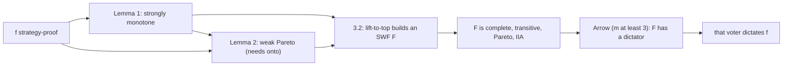

# Social Choice · Lesson 3.1: Manipulation and the first half of Gibbard–Satterthwaite

> ⏱ ~15 min · Module 3: Strategy and restricted domains · Builds on: [2.1 Scoring rules](02-01-scoring-rules.md), [2.4 Monotonicity and participation](02-04-monotonicity-and-participation.md) · Unlocks: [3.2 Proving Gibbard–Satterthwaite](03-02-proving-gibbard-satterthwaite.md)

## Why this matters

Module 2 ran every rule on *sincere* ballots. Real voters read polls. If a voter can get a better winner by misreporting, the ballots a rule receives are no longer the preferences it was designed to aggregate, and every axiom in Module 2 is a statement about the wrong profile. The [Gibbard–Satterthwaite theorem](../reference.md#gibbard-satterthwaite-theorem) says this is unavoidable: every non-dictatorial rule with three or more possible winners can be gamed. [`grad-game-theory` 5.1](../../grad-game-theory/lessons/05-01-social-choice-impossibility.md) states it; this lesson and the next prove it. Here you learn to find manipulations, and you prove the two lemmas that carry strategy-proofness into Arrow's world.

## The idea

A five-person hiring committee uses the [Borda count](../reference.md#borda-count) on four candidates. You rank B first and A second. The polls say A edges B by a point. So you file B first and A *last*. Moving A from second to last costs A two points and gives the two candidates you dropped A below one point each. A falls behind B, and B wins. You have **buried** A: told a lie that hurt your second choice to save your first.

Burying works because Borda reads your whole ranking, so lowering A helps everyone else. Instant runoff is gamed differently. Its counts move one vote at a time, and its eliminations can be steered: you can rank a candidate first so that someone *else* goes out (**compromise**), or even rank your least favourite first to change who survives (**push-over**). The theorem says these are not quirks of two rules. Any rule that is not a dictatorship and can elect three or more candidates has a profile where some voter gains by lying.

The proof has a clean architecture. Strategy-proofness, a condition about lies, turns out to imply two conditions about *outcomes*: a strong monotonicity and the Pareto principle. With those two in hand, [3.2](03-02-proving-gibbard-satterthwaite.md) builds an Arrovian social welfare function and lets Arrow finish.

## The result

**Setting.** Voters $N = \{1, \dots, n\}$; alternatives $A$ with $|A| = m$; $\mathcal{L}(A)$ is the set of strict rankings of $A$. A profile is $\mathbf{P} = (\succ_1, \dots, \succ_n) \in \mathcal{L}(A)^n$. A [social choice function](../reference.md#social-choice-function) $f : \mathcal{L}(A)^n \to A$ picks one winner at every profile. It is *resolute* (ties are broken by a fixed rule, which is part of $f$) and has *unrestricted domain* (every profile of strict rankings is allowed). Write $(\succ_i', \mathbf{P}_{-i})$ for $\mathbf{P}$ with voter $i$'s ranking replaced by $\succ_i'$.

**[Manipulation](../reference.md#manipulation).** Voter $i$ manipulates $f$ at $\mathbf{P}$ if some $\succ_i'$ gives

$$f(\succ_i', \mathbf{P}_{-i}) \succ_i f(\mathbf{P}).$$

*In words:* with everyone else's ballots fixed, a lie gets $i$ an outcome $i$ truly prefers.

**[Strategy-proofness](../reference.md#strategy-proofness).** $f$ is strategy-proof if no voter can manipulate it at any profile. *In words:* truth-telling is a dominant strategy, best whatever the others report.

**Dictatorial; onto.** $f$ is dictatorial if some voter $d$ has $f(\mathbf{P}) = $ the top of $\succ_d$ at every $\mathbf{P}$. $f$ is onto if every alternative wins at some profile.

**Theorem (Gibbard 1973; Satterthwaite 1975).** Let $|A| \ge 3$, and let $f$ be a resolute social choice function on the unrestricted domain $\mathcal{L}(A)^n$ that is onto. If $f$ is strategy-proof, then $f$ is dictatorial.

*In words:* with three or more alternatives that can all win, the only rule where nobody ever gains by lying is a dictatorship.

Every hypothesis matters. If the range is a set $R$ with $|R| \ge 3$ but not all of $A$, the conclusion becomes "some voter's favourite *in $R$* always wins". With $|R| = 2$ the theorem says nothing (P3). Gibbard proved it for general game forms, Satterthwaite for voting procedures; the two were independent. ([`game-theory-refresher` 4.2](../../game-theory-refresher/lessons/04-02-mechanism-design.md) has the statement in its mechanism-design setting.)

**[Strong monotonicity](../reference.md#strong-monotonicity).** $f$ is strongly monotone if, whenever $f(\mathbf{P}) = x$ and $\mathbf{P}'$ satisfies

$$\text{for all } i \text{ and all } y: \quad x \succ_i y \implies x \succ_i' y,$$

then $f(\mathbf{P}') = x$. *In words:* if the winner does not fall against anything in anyone's ranking, it still wins, however the rest of the rankings are shuffled. This is far stronger than [2.4](02-04-monotonicity-and-participation.md)'s monotonicity, which only allows raising $x$ with everything else frozen.

**Lemma 1.** If $f$ is strategy-proof, it is strongly monotone.

*Proof.* Let $f(\mathbf{P}) = x$ and let $\mathbf{P}'$ be as in the definition. Change one voter at a time: $\mathbf{P}^0 = \mathbf{P}$ and $\mathbf{P}^k = (\succ_1', \dots, \succ_k', \succ_{k+1}, \dots, \succ_n)$, so $\mathbf{P}^n = \mathbf{P}'$. We show $f(\mathbf{P}^{k-1}) = x \Rightarrow f(\mathbf{P}^k) = x$; induction on $k$ then gives $f(\mathbf{P}') = x$.

1. Suppose $f(\mathbf{P}^{k-1}) = x$ and $f(\mathbf{P}^k) = y \ne x$. The two profiles differ only in voter $k$'s ranking: $\succ_k$ in $\mathbf{P}^{k-1}$, $\succ_k'$ in $\mathbf{P}^k$.
2. If $y \succ_k x$: at $\mathbf{P}^{k-1}$, voter $k$ with true ranking $\succ_k$ reports $\succ_k'$ and gets $y$ instead of $x$. That is a manipulation, contradicting strategy-proofness.
3. Otherwise $x \succ_k y$ (rankings are strict and $y \ne x$). By the hypothesis on $\mathbf{P}'$, $x \succ_k' y$.
4. Then at $\mathbf{P}^k$, voter $k$ with true ranking $\succ_k'$ reports $\succ_k$ and gets $x$ instead of $y$. Again a manipulation, a contradiction.
5. So $y = x$. $\blacksquare$

*In words:* if the outcome ever moves along the path, the voter who moved it either wanted the new outcome (and lied to get it) or wanted the old one (and could lie to get it back).

**Lemma 2 ([weak Pareto](../reference.md#weak-pareto)).** If $f$ is strategy-proof and onto, then whenever $x \succ_i y$ for every voter $i$, $f(\mathbf{P}) \ne y$.

*Proof.*

1. Suppose $x \succ_i y$ for all $i$ but $f(\mathbf{P}) = y$.
2. Since $f$ is onto, some profile $\mathbf{P}^*$ has $f(\mathbf{P}^*) = x$.
3. Build $\mathbf{P}''$: every voter ranks $x$ first, $y$ second, the rest in any fixed order.
4. From $\mathbf{P}^*$ to $\mathbf{P}''$: $x$ is everyone's top in $\mathbf{P}''$, so it beats everything it beat before. By Lemma 1, $f(\mathbf{P}'') = x$.
5. From $\mathbf{P}$ to $\mathbf{P}''$: in $\mathbf{P}$, $x$ is above $y$ for everyone, so whatever $y$ beats in $\succ_i$ is not $x$. In $\succ_i''$, $y$ beats every alternative except $x$. So $y$ beats in $\mathbf{P}''$ everything it beat in $\mathbf{P}$, and Lemma 1 gives $f(\mathbf{P}'') = y$.
6. Then $x = y$, contradicting step 1. $\blacksquare$

*In words:* a strategy-proof rule that can elect anything never elects an option everyone ranks below some other option. In particular, if everyone ranks $x$ first, $x$ wins.

**Where the argument is weakest.** Lemma 1 is a bare consequence of the definition, so the pressure falls on the hypotheses. *Unrestricted domain:* the proof builds profiles at will ($\mathbf{P}''$, every intermediate $\mathbf{P}^k$). Restrict the rankings voters can hold and those profiles may not exist; [3.3](03-03-single-peakedness-black-and-moulin.md) shows that on single-peaked domains strategy-proof, non-dictatorial rules do exist. *Resoluteness:* rules that output sets or lotteries need their own theory, not covered here. And the theorem asserts only that a manipulation *exists* at *some* profile. It says nothing about how often, or whether a voter could know enough about the others' ballots to find it.

## Picture

This lesson proves the left half: strategy-proofness gives the two outcome conditions. [3.2](03-02-proving-gibbard-satterthwaite.md) feeds them into Arrow's theorem.

## Worked examples

**Example 1 (clean): burying under Borda.** Scores $s = (3, 2, 1, 0)$. Five voters:

| Voters | Ranking | A | B | C | D |
|---|---|---|---|---|---|
| 1 | A ≻ B ≻ C ≻ D | 3 | 2 | 1 | 0 |
| 2 | B ≻ A ≻ D ≻ C | 2 each | 3 each | 0 | 1 each |
| 2 | C ≻ A ≻ B ≻ D | 2 each | 1 each | 3 each | 0 |
| | **Total** | **11** | **10** | **7** | **2** |

A wins. A is also the Condorcet winner: it beats B 3–2, C 3–2 and D 5–0. One B-voter now reports B ≻ D ≻ C ≻ A. A loses 2, while D and C each gain 1: A 9, B 10, C 8, D 3, so B wins. The voter truly prefers B to A, so this is a manipulation. Reporting B ≻ C ≻ D ≻ A also works (A 9, B 10, C 9, D 2), and those two are the only single-voter lies that win outright. The lie also unseats a Condorcet winner. Burying is Borda's characteristic weakness, because a voter can lower a rival without lowering her own favourite.

**Example 2 (where resoluteness bites): Lemma 1 turns a monotonicity failure into a manipulation.** [Instant runoff](../reference.md#instant-runoff) (counting as in [`political-institutions` 1.2](../../political-institutions/lessons/01-02-ranked-ballots-the-alternative-vote-and-stv.md)) on 25 voters. To make it resolute, a tie for last place eliminates the alphabetically later candidate.

$$\mathbf{P}: \quad 7: A \succ B \succ C, \qquad 8: B \succ A \succ C, \qquad 10: C \succ A \succ B.$$

First count A 7, B 8, C 10. A goes out and A's ballots go to B, so B wins 15–10. Now four C-voters raise B to the top, reporting B ≻ C ≻ A. B has not fallen against anything in anyone's ranking. Yet the first count is A 7, B 12, C 6; C goes out, C's six ballots go to A, and A wins 13–12. That is 2.4's monotonicity failure, and so a failure of strong monotonicity. By Lemma 1, IRV must be manipulable somewhere. The proof says where: switch the four voters one at a time.

| $k$ voters switched | First count (A, B, C) | Out | Winner |
|---|---|---|---|
| 0 | 7, 8, 10 | A | B, 15–10 |
| 1 | 7, 9, 9 | A | B, 16–9 |
| 2 | 7, 10, 8 | A | B, 17–8 |
| 3 | 7, 11, 7 (tie) | C | A, 14–11 |
| 4 | 7, 12, 6 | C | A, 13–12 |

The outcome first moves at $k = 3$, from B to A. Voter 3's true ranking is C ≻ A ≻ B, so $A \succ_3 B$: that is step 2 of the proof. At $\mathbf{P}^2$, voter 3 gets A instead of B by ranking her *least* favourite candidate first. This is a push-over. Notice that it runs through the tie-break. Reverse the tie-break and the switch happens at $k = 4$ instead, with the same move. Every resolute version of IRV has a manipulable profile, but which profile it is depends on how ties are broken. (At $\mathbf{P}^2$ voter 3 could also just rank A first: A 8, B 10, C 7, and A wins 15–10. The lemma promises *a* manipulation, not the cleverest.)

## Watch out

- **You might think the theorem says every voter can manipulate at every profile, but actually** it says only that some voter can at some profile. In P1 below, only the four A-voters can gain; no B- or C-voter has a profitable lie.
- **You might think range and resoluteness are technicalities, but actually** they are hypotheses people drop. With two alternatives, simple majority ([1.2](01-02-mays-theorem.md)) is strategy-proof, anonymous and neutral. With a range of two out of three alternatives, Lemma 2 fails (P3). With ties left unbroken, $f$ is not a function into $A$ at all. Lemma 2 really needs onto, because its step 2 takes a profile at which $x$ wins.
- **You might think Borda is monotone, so it is safe from Lemma 1, but actually** it is monotone only in 2.4's weak sense. Take Example 1's two profiles. B is the burying voter's top in both, and nobody else changed, so strong monotonicity says that if B wins after the lie it must also win before. It does not. Any manipulation exhibits a strong-monotonicity failure in this way.

## One-liner

> A lie that pays is a winner that moved when it should not have: strategy-proofness forces strong monotonicity and, with onto, Pareto, and those two are all Arrow needs.

## Problems

**P1 (🟢) *(Formal (a)–(b).)*** Twelve voters use instant runoff: 4: A ≻ B ≻ C, 3: B ≻ C ≻ A, 5: C ≻ B ≻ A. (a) Find the IRV winner and the Condorcet winner. (b) Find a single voter and a misreport that gets that voter an outcome they strictly prefer. Name the kind of manipulation.

**P2 (🟡) *(Formal.)*** Prove the converse of Lemma 1 on the unrestricted domain: a strongly monotone social choice function is strategy-proof. *Hint:* suppose voter $i$ gains, $f(\mathbf{P}) = x$ and $f(\succ_i', \mathbf{P}_{-i}) = y$ with $y \succ_i x$. Consider the ranking $\succ_i''$ that puts $y$ first and $x$ second.

**P3 (🔴, optional) *(Formal (a) · Exegetical (b).)*** There are three alternatives $a, b, c$, and $n \ge 2$ voters rank all three. The ballot lists only $a$ and $b$. Each voter counts for whichever of the two she ranks higher, the majority wins, and a tie goes to $a$. (a) Prove the rule is strategy-proof, and give a profile at which it picks an alternative every voter ranks below another. (b) In two sentences or fewer: which hypothesis of Gibbard–Satterthwaite fails, and which hypothesis of Lemma 2?

Solutions

**P1** *(Formal (a)–(b).)*

(a) First count: A 4, B 3, C 5. No majority (7 needed), so B goes out. B's three ballots go to C, so C wins 8–4. B is the Condorcet winner: B beats A 8–4 (the B- and C-voters) and B beats C 7–5 (the A- and B-voters). This is the centre squeeze: the candidate who wins every head-to-head is eliminated first.

**Accept (b):** any A ≻ B ≻ C voter who ranks B first. Model answer below.

(b) One A-voter reports B ≻ A ≻ C (B ≻ C ≻ A works equally well). First count: A 3, B 4, C 5. A goes out, and A's three remaining ballots go to B, so B wins 7–5. The voter truly ranks B ≻ C, so she gains. This is a compromise: abandoning a favourite who cannot win for a second choice who can. By exhaustive check, these are the only profitable single-voter misreports. The C-voters already win, and no B-voter's report changes the outcome from C.

**Wrong turns:** sending B's ballots to A in (a); B-voters rank C second. Thinking a B-voter can rescue B: if a B-voter defects to A, B is eliminated even faster (A 5, B 2, C 5), and C still wins 7–5.

**P2** *(Formal.)*

1. Suppose $f$ is strongly monotone but voter $i$ manipulates at $\mathbf{P}$: $f(\mathbf{P}) = x$, $f(\succ_i', \mathbf{P}_{-i}) = y$, $y \succ_i x$ (so $y \ne x$).
2. Let $\succ_i''$ put $y$ first, $x$ second, and the rest in any order. Let $\mathbf{Q} = (\succ_i'', \mathbf{P}_{-i})$.
3. From $(\succ_i', \mathbf{P}_{-i})$ to $\mathbf{Q}$: only voter $i$ changes, and $y$ is her top in $\succ_i''$, so $y$ beats everything it beat before. Strong monotonicity gives $f(\mathbf{Q}) = y$.
4. From $\mathbf{P}$ to $\mathbf{Q}$: if $x \succ_i z$ then $z \ne y$, since $y \succ_i x$. In $\succ_i''$, $x$ beats everything except $y$, so $x \succ_i'' z$. Others are unchanged. Strong monotonicity gives $f(\mathbf{Q}) = x$.
5. So $x = y$, a contradiction. Hence $f$ is strategy-proof. $\blacksquare$

With Lemma 1, this makes strategy-proofness and strong monotonicity equivalent on the unrestricted domain (Muller and Satterthwaite, 1977). Gibbard–Satterthwaite can equally be read as: an onto, strongly monotone rule on three or more alternatives is dictatorial.

**Wrong turns:** using $\succ_i''$ with $x$ first. Then step 3 fails, because $y$ falls below $x$. Forgetting to check step 4's case $z = y$, which is exactly why $y$ must sit *above* $x$ in $\succ_i''$.

**P3** *(Formal (a) · Exegetical (b), strict.)*

(a) A voter's ballot affects the outcome only through which of $a, b$ she counts for, and $c$ can never win. If the winner is her preferred one of $a, b$, nothing she reports can do better. If it is the other one, then sincerely she already counts for her preferred one, and any report either leaves her count unchanged or moves it to the winner, which cannot unseat the winner. So no lie ever helps. Pareto violation: everyone reports $c \succ a \succ b$. The rule picks $a$, but every voter ranks $c$ above $a$.

**Must hit, strict (b):**

- Gibbard–Satterthwaite: the range is $\{a, b\}$, only two alternatives, so the onto (range at least 3) hypothesis fails. The rule is not dictatorial, even on its range, when $n \ge 2$.
- Lemma 2: onto fails, so step 2 (a profile where the dominating $c$ wins) is unavailable. Strategy-proofness alone does not give Pareto.

**Wrong turns:** saying unrestricted domain fails (voters may hold any ranking of all three). Calling the rule dictatorial: with two voters who disagree, the tie goes to $a$, overruling whoever prefers $b$.

**Model answer (b):** The range has two elements, so the theorem's onto, range-at-least-three hypothesis fails and a non-dictatorial strategy-proof rule is allowed. Lemma 2 also needs onto, which is why this strategy-proof rule can still pick a Pareto-dominated $a$.

## Flashback

**From Lesson [2.3](02-03-condorcet-methods-and-kemeny.md) (Condorcet methods and Kemeny):** *(Formal (a)–(b).)* Fifteen voters: 3: A ≻ B ≻ C, 3: B ≻ A ≻ C, 4: B ≻ C ≻ A, 5: C ≻ A ≻ B.

(a) Find the three pairwise tallies, the Kemeny ranking with its score, and the maximin winner.
(b) Prove: with three alternatives and strict rankings, if the majority relation is a cycle whose three margins are distinct, the Kemeny ranking is unique and its top is the maximin winner. Five sentences or fewer.

Solution

(a) A beats B 8–7 (the A ≻ B ≻ C and C ≻ A ≻ B voters), B beats C 10–5, C beats A 9–6: a cycle with margins 1, 5 and 3. The Kemeny ceiling is $8 + 10 + 9 = 27$. By 2.3's Proposition 1 the cheapest overrule is A over B, margin 1, which gives **B ≻ C ≻ A, score 26** (check: $n(B,C) + n(B,A) + n(C,A) = 10 + 7 + 9$). The runner-up, A ≻ B ≻ C, overrules C over A and scores 24. Maximin: A's worst contest is 6 (against C), B's is 7 (against A), C's is 5 (against B), so **B wins**. Copeland, for contrast, ties all three at 0.

(b) Write the cycle $a \to b \to c \to a$.

1. No ranking obeys all three arrows or reverses all three, since either would be cyclic; reversing exactly one arrow does give a ranking (reversing $a \to b$ gives $b \succ c \succ a$).
2. By 2.3's Proposition 1 a ranking scores the ceiling minus the margins it overrules. Margins are positive and distinct, so the unique maximizer overrules only the smallest-margin arrow, say $a \to b$, and its top is $b$.
3. Each candidate loses exactly one contest, and its tally there is below $n/2$ while its win is above, so its maximin score is its losing tally; for $b$ that is $n(b,a) = (n - \mu(a,b))/2$.
4. That is largest when the margin is smallest, so the maximin winner is also $b$, the candidate who lost most narrowly. ∎

**Wrong turns:** reversing the *largest* margin, or electing the candidate with the biggest win; Kemeny's top is the narrowest loser, and it is a coincidence of this profile that B also has the biggest win. In (b), asserting that the cheapest reversal yields a ranking without checking it, which step 1 does.

## Connections

- **Backward:** [2.4](02-04-monotonicity-and-participation.md)'s IRV monotonicity failure is, by Lemma 1, a certificate of manipulability (Example 2). [2.1](02-01-scoring-rules.md)'s Borda count is the burying example. [1.2](01-02-mays-theorem.md)'s majority rule is the two-alternative case the theorem leaves alone.
- **Forward:** [3.2](03-02-proving-gibbard-satterthwaite.md) uses Lemmas 1 and 2 to build a social welfare function by lifting pairs to the top, then invokes Arrow. [3.3](03-03-single-peakedness-black-and-moulin.md) drops unrestricted domain and finds strategy-proof rules that are not dictatorships.
- **Sideways:** strategy-proofness is dominant-strategy incentive compatibility from [`grad-game-theory` 5.2](../../grad-game-theory/lessons/05-02-revelation-principle-incentive-compatibility.md). By the revelation principle, Gibbard–Satterthwaite rules out every dominant-strategy mechanism, not just direct ballots. Adding money, as in [VCG](../../grad-game-theory/lessons/05-03-dominant-strategy-mechanisms-vcg.md), leaves the ordinal setting and escapes it. Strong monotonicity reappears in implementation theory as Maskin monotonicity, the necessary condition for Nash implementation (Maskin, circulated 1977, published 1999). Why voters desert hopeless candidates in practice, the compromise of P1 at scale, belongs to [`political-economy`](../../political-economy/syllabus.md).
