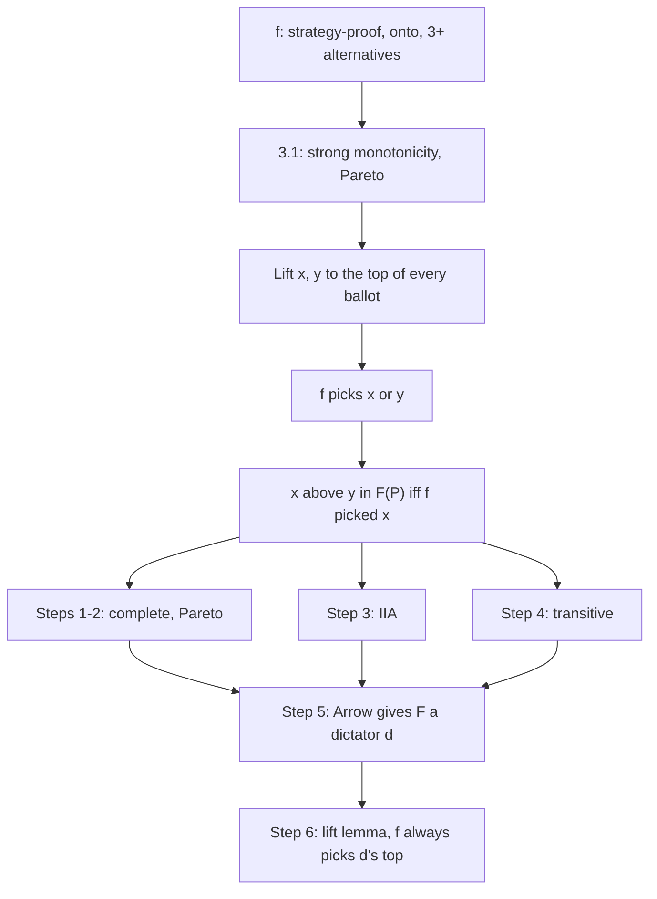

# Social Choice · Lesson 3.2: Proving Gibbard–Satterthwaite

> ⏱ ~15 min · Module 3: Strategy and restricted domains · Builds on: [3.1 Manipulation and the first half of Gibbard–Satterthwaite](03-01-manipulation-and-strategy-proofness.md), [1.3 Arrow as a map](01-03-arrow-as-a-map.md) · Unlocks: [3.3 Single-peakedness: Black and Moulin](03-03-single-peakedness-black-and-moulin.md)

## Why this matters

[3.1](03-01-manipulation-and-strategy-proofness.md) proved that any rule that cannot be gamed is strongly monotone and, if every alternative can win, Pareto. This lesson builds an Arrovian ranking rule out of such a choice rule, lets [Arrow's theorem](../reference.md#arrows-theorem) force a dictator, and carries the dictator back. [`grad-game-theory` 5.1](../../grad-game-theory/lessons/05-01-social-choice-impossibility.md) states the theorem; the proof is this course's. It also locates manipulation's source: a rule nobody can game satisfies IIA unasked.

## The idea

A choice rule names one winner; Arrow's theorem is about rankings. To extract a ranking, ask the rule about every pair: "if $x$ and $y$ were everyone's top two, each voter keeping her own order between them, which would you pick?" Rank $x$ above $y$ when it says $x$.

Strategy-proofness makes the answers behave. By 3.1, a rule nobody can game keeps its winner whenever nothing passes the winner on any ballot. Once $x$ and $y$ top every ballot, all that can still matter is who prefers $x$ to $y$, so the answers depend only on pairwise opinions: IIA for free. Pareto comes from 3.1, transitivity from one more lift, and Arrow gives the ranking a dictator, who dictates the choice rule too. Run backwards, the proof is a diagnostic: where a familiar rule's answers fail to form a ranking, a manipulation is hiding nearby.

## The proof

**Setting.** Voters $N = \{1, \dots, n\}$; alternatives $A$ with $|A| = m$; voter $i$'s strict ranking $\succ_i$; profile $\mathbf{P} = (\succ_1, \dots, \succ_n)$. A social choice function $f$ picks one alternative at every profile of strict rankings (it is *resolute*: a fixed rule breaks ties). $f$ is *onto* if every alternative wins at some profile; [strategy-proof](../reference.md#strategy-proofness) if no voter, at any profile, gets an outcome she strictly prefers by misreporting; *dictatorial* if some voter $d$'s top is $f(\mathbf{P})$ at every profile.

**[Gibbard–Satterthwaite theorem](../reference.md#gibbard-satterthwaite-theorem)** (Gibbard 1973; Satterthwaite 1975). If $m \ge 3$ and $f$ is onto and strategy-proof on the domain of all profiles of strict rankings, then $f$ is dictatorial.

*In words:* when three or more alternatives can win, the only rules under which honesty is always a dominant strategy hand the decision to one voter.

The usual statement says "a range of at least three" instead; a standard step, not given here, shows a strategy-proof rule ignores alternatives outside its range, reducing that version to this one.

**From 3.1** (proved there):

- **[Strong monotonicity](../reference.md#strong-monotonicity).** If $f(\mathbf{P}) = w$, and at $\mathbf{P}'$ every alternative that any voter ranked below $w$ is still below $w$ on her ballot, then $f(\mathbf{P}') = w$.
- **Pareto.** If every voter ranks $x$ above $y$, then $f(\mathbf{P}) \ne y$.

**Lifting.** For $S \subseteq A$, $\mathbf{P}^S$ is the profile in which every voter moves the members of $S$ to the top of her ranking, keeping her own order inside $S$ and inside the rest. Write $\mathbf{P}^{xy}$ for $\mathbf{P}^{\{x,y\}}$.

**Lift lemma.** If $f(\mathbf{P}) = w$ and $w \in S$, then $f(\mathbf{P}^S) = w$.

*Proof.* Take any voter and any $z$ she ranks below $w$. If $z \in S$, lifting keeps the order inside $S$, so $z$ stays below $w$. If $z \notin S$, $z$ now sits below all of $S$, including $w$. Strong monotonicity gives $f(\mathbf{P}^S) = w$. ∎

**The [lift-to-top construction](../reference.md#lift-to-top-construction).** For each profile define a relation on $A$:

$$x \, F(\mathbf{P}) \, y \iff f(\mathbf{P}^{xy}) = x.$$

*In words:* $F$ ranks $x$ above $y$ when $f$ picks $x$ after both are lifted to the top of every ballot.

**Claim.** If $f$ is onto and strategy-proof, then every $F(\mathbf{P})$ is a strict ranking, and $F$ satisfies weak Pareto and IIA.

1. **Complete and asymmetric.** In $\mathbf{P}^{xy}$ every voter ranks $x$ and $y$ above every other $z$, so Pareto rules out each $z$: $f(\mathbf{P}^{xy}) \in \{x, y\}$. Since $\mathbf{P}^{xy} = \mathbf{P}^{yx}$, exactly one of $x \, F(\mathbf{P}) \, y$ and $y \, F(\mathbf{P}) \, x$ holds.
2. **Weak Pareto.** If every voter ranks $x$ above $y$, they still do in $\mathbf{P}^{xy}$, so $f(\mathbf{P}^{xy}) \ne y$; by step 1 it is $x$.
3. **[IIA](../reference.md#independence-of-irrelevant-alternatives).** If every voter orders $x$ and $y$ the same way in $\mathbf{P}$ and $\mathbf{P}'$, then $f(\mathbf{P}^{xy}) = f(\mathbf{P}'^{xy})$. This is one application of strong monotonicity; you prove it in P2.
4. **Transitive.** By step 1, if transitivity fails then $F(\mathbf{P})$ has a 3-cycle $x \to y \to z \to x$ (if $x F y$, $y F z$ and not $x F z$, then $z F x$). Let $Q = \mathbf{P}^{xyz}$. By Pareto, $f(Q) \in \{x, y, z\}$; call it $a$, and let $b$ be the alternative before $a$ in the cycle, so $f(\mathbf{P}^{ab}) = b$.
   - (i) The lift lemma applied to $Q$ with $S = \{a, b\}$ gives $f(Q^{ab}) = a$.
   - (ii) Lifting $\{x, y, z\}$ kept every voter's order of $a$ and $b$, so $Q$ and $\mathbf{P}$ agree on $\{a, b\}$; step 3 gives $f(Q^{ab}) = f(\mathbf{P}^{ab}) = b$.

   Contradiction, so $F(\mathbf{P})$ is a strict ranking.
5. **Arrow.** $F$ is defined on every profile of strict rankings, returns a strict ranking, and satisfies weak Pareto and IIA, with $m \ge 3$. By Arrow's theorem (proved in [`grad-game-theory` 5.1](../../grad-game-theory/lessons/05-01-social-choice-impossibility.md), restated in [1.3](01-03-arrow-as-a-map.md); its standard proofs run unchanged when everyone, society included, ranks strictly) there is a voter $d$ such that $x \succ_d y$ implies $x \, F(\mathbf{P}) \, y$ at every profile.
6. **Back to $f$.** Fix $\mathbf{P}$ and let $b = f(\mathbf{P})$. For every $c \ne b$ the lift lemma gives $f(\mathbf{P}^{bc}) = b$, so $b \, F(\mathbf{P}) \, c$: the winner is the top of $F(\mathbf{P})$. Voter $d$'s top also beats every $c$ in $F(\mathbf{P})$, so it is that same top. So $f$ always picks $d$'s top. ∎

This reduction is the textbook route, given in this form by David Schmeidler and Hugo Sonnenschein (1978); Philip Reny (2001) instead proves both theorems with one direct argument.

**Where manipulability comes from.** Read the proof contrapositively: if a rule's $F(\mathbf{P})$ is not a ranking (step 4), or the winner $f(\mathbf{P})$ is not its top (step 6), strong monotonicity fails somewhere, and 3.1's lemma turns that failure into a manipulation. For any [scoring rule](../reference.md#scoring-rule) with $s_1 > s_2$, $F$ is the pairwise majority relation. On $\mathbf{P}^{xy}$, with $a = n(x,y)$ and $b = n(y,x)$, $x$ scores $a s_1 + b s_2$ and $y$ scores $b s_1 + a s_2$, so $x$ beats $y$ exactly when $a > b$. Any other $z$ scores at most $n s_3 \le n s_2$, while the lifted pair averages $n(s_1 + s_2)/2 > n s_2$, so the larger of them beats $z$. So for plurality and Borda steps 1–3 are automatic, and with an odd number of voters step 4 fails exactly on profiles with a Condorcet cycle. In that precise sense manipulation is the strategic shadow of Condorcet's paradox, though not its only source: Example 1 has no cycle.

**Where the argument is weakest.** The steps are tight, so a critic attacks the hypotheses:

- *Unrestricted domain.* Every step needs the lifted ballots to be admissible. On single-peaked preferences most lifts leave the domain, and the median rule is strategy-proof and not dictatorial ([3.3](03-03-single-peakedness-black-and-moulin.md)).
- *Resoluteness.* Step 1 needs one winner. With lotteries, Allan Gibbard (1977) showed the strategy-proof random rules are mixtures of rules that depend on one voter's ballot or choose between two fixed alternatives; random dictatorship survives. For set-valued rules, John Duggan and Thomas Schwartz (2000) recover an impossibility only after assuming how voters rank sets.
- *Worst-case incentives.* One gainful lie at one profile breaks strategy-proofness. Lying can still be hard: the liar needs the other ballots, and for some rules finding the lie is computationally hard (Bartholdi, Tovey and Trick 1989).

What the critic cannot do is reject IIA, as many of Arrow's critics do: step 3 derives it. And $m \ge 3$ is needed: with two alternatives, majority rule ([1.2](01-02-mays-theorem.md)) is strategy-proof and not dictatorial.

## Picture

## Worked examples

**Example 1 (clean): the construction run on Borda.** Five voters, four alternatives: 2: D ≻ A ≻ B ≻ C, 2: B ≻ C ≻ A ≻ D, 1: A ≻ B ≻ D ≻ C. [Borda](../reference.md#borda-count) (3, 2, 1, 0) gives A 9, B 10, C 4, D 7, so $f(\mathbf{P}) = B$. Lifting A and B gives 2: A ≻ B ≻ D ≻ C, 2: B ≻ A ≻ C ≻ D, 1: A ≻ B ≻ D ≻ C.

| Pair | $n(x,y)$ to $n(y,x)$ | Borda on $\mathbf{P}^{xy}$ | $F(\mathbf{P})$ |
|---|---|---|---|
| A, B | 3–2 | A 13, B 12 | A over B |
| A, C | 3–2 | A 13, C 12 | A over C |
| A, D | 3–2 | A 13, D 12 | A over D |
| B, C | 5–0 | B 15, C 10 | B over C |
| B, D | 3–2 | B 13, D 12 | B over D |
| C, D | 2–3 | D 13, C 12 | D over C |

$F(\mathbf{P})$ is A ≻ B ≻ D ≻ C, the majority ranking, with Condorcet winner A on top. Steps 1–4 all pass here. Step 6 does not: $f(\mathbf{P}) = B$, yet $f(\mathbf{P}^{AB}) = A$, although lifting A and B moved nothing from below B to above it on any ballot. Strong monotonicity fails, and here the manipulation is right at $\mathbf{P}$. A D ≻ A ≻ B ≻ C voter who reports A ≻ D ≻ C ≻ B makes the scores A 10, B 9, C 5, D 6, electing A, whom she prefers to B.

**Example 2 (where the proof bites): a cycle.** Seven voters: 3: A ≻ B ≻ C, 2: B ≻ C ≻ A, 2: C ≻ A ≻ B; Borda (2, 1, 0), ties broken alphabetically. Majorities: A beats B 5–2, B beats C 5–2, C beats A 4–3. The lifted profiles give $f(\mathbf{P}^{AB}) = A$ (12 to 9), $f(\mathbf{P}^{BC}) = B$ (12 to 9) and $f(\mathbf{P}^{AC}) = C$ (11 to 10). So $F(\mathbf{P})$ is the cycle A → B → C → A: step 4 fails. Run it anyway: $Q = \mathbf{P}^{ABC} = \mathbf{P}$, $f(Q) = A$ (A 8, B 7, C 6), and A's predecessor in the cycle is C. Lifting A and C turns B ≻ C ≻ A into C ≻ A ≻ B and A ≻ B ≻ C into A ≻ C ≻ B; nothing passes A, so the lift lemma demands A, but Borda picks C. The manipulation sits at the lifted profile, 3: A ≻ C ≻ B, 4: C ≻ A ≻ B, where C wins 11 to 10. One A ≻ C ≻ B voter who reports A ≻ B ≻ C makes it A 10, B 1, C 10, and the tie goes to A, whom she prefers. No single voter can gain at $\mathbf{P}$ itself; the proof promises a manipulation somewhere along the lift.

## Watch out

- **You might think Gibbard–Satterthwaite assumes IIA, like Arrow.** Step 3 *derives* it from strategy-proofness, so objections to IIA as a normative demand do not touch this theorem.
- **You might think "three or more alternatives" means three names on the ballot.** The hypothesis concerns possible *winners*: onto with $m \ge 3$, or a range of at least three. A rule with three names on the ballot but only two possible winners can be strategy-proof and not dictatorial (P3).
- **You might think $F(\mathbf{P})$ always has $f(\mathbf{P})$ on top.** Only for a strategy-proof $f$ (step 6). In Example 1 they come apart, and the gap is a manipulation.

## One-liner

> Ask a strategy-proof rule who wins when each pair is lifted to the top: the answers form an Arrovian ranking, Arrow makes it a dictatorship, and the dictator of the ranking dictates the choice.

## Problems

**P1 (🟢) *(Formal (a)–(b).)*** $f$ is the dictatorship of voter 2: it picks the top of $\succ_2$. Profile: voter 1: B ≻ D ≻ A ≻ C; voter 2: C ≻ A ≻ D ≻ B; voter 3: D ≻ B ≻ C ≻ A.

(a) Write out $\mathbf{P}^{AD}$ and $\mathbf{P}^{BD}$ and find $f$ on each. Then give $F(\mathbf{P})$ in full as a ranking.
(b) Prove that for every profile, $F(\mathbf{P}) = \succ_2$.

**P2 (🟡) *(Formal.)*** Prove step 3. Let $f$ be onto and strategy-proof, and suppose every voter orders $x$ and $y$ the same way in $\mathbf{P}$ and $\mathbf{P}'$. Show $f(\mathbf{P}^{xy}) = f(\mathbf{P}'^{xy})$, using only step 1 and strong monotonicity.

**P3 (🔴, optional) *(Exegetical (a), (c) · Formal (b).)*** Three voters, alternatives A, B, C. The rule $g$ picks whichever of A and B a majority ranks higher, and never looks at C.

(a) Is $g$ strategy-proof? Onto? Dictatorial? Which hypothesis of the theorem does it fail?
(b) Every voter reports C ≻ A ≻ B. Compute $g$ on $\mathbf{P}^{AB}$, $\mathbf{P}^{AC}$ and $\mathbf{P}^{BC}$, give $F(\mathbf{P})$, and name the step of the proof that fails.
(c) In one sentence each: where does the proof use onto, and where does it use $m \ge 3$?

Solutions

**P1** *(Formal (a)–(b).)*

(a) Lifting keeps each voter's order inside the pair and inside the rest.

- $\mathbf{P}^{AD}$: voter 1 D ≻ A ≻ B ≻ C; voter 2 A ≻ D ≻ C ≻ B; voter 3 D ≻ A ≻ B ≻ C. Voter 2's top is A, so $f(\mathbf{P}^{AD}) = A$: A over D.
- $\mathbf{P}^{BD}$: voter 1 B ≻ D ≻ A ≻ C; voter 2 D ≻ B ≻ C ≻ A; voter 3 D ≻ B ≻ C ≻ A. Voter 2's top is D: D over B.
- The other four pairs the same way: A over B, C over A, C over B, C over D.

$F(\mathbf{P})$ is C ≻ A ≻ D ≻ B, voter 2's ranking.

(b) Fix $\mathbf{P}$ and $x \ne y$. In $\mathbf{P}^{xy}$ voter 2's top two are $x$ and $y$, in her original order, so her top is $x$ exactly when $x \succ_2 y$. $f$ picks voter 2's top, so $x \, F(\mathbf{P}) \, y$ iff $x \succ_2 y$. ∎

**Wrong turns:** computing the pairwise majority relation instead (here it is D ≻ B ≻ C ≻ A, nothing like $F$); $F$ is defined through $f$, not through counting. Re-sorting the non-lifted alternatives when lifting: they keep each voter's order.

---

**P2** *(Formal.)*

Let $w = f(\mathbf{P}^{xy})$. By step 1, $w \in \{x, y\}$; let $v$ be the other one. Fix a voter $i$. In $\mathbf{P}^{xy}$ her top two are $x$ and $y$ in her order; in $\mathbf{P}'^{xy}$ they are the same two in the same order, because she orders $x$ and $y$ the same way in both profiles. So the set she ranks below $w$ is $A \setminus \{w\}$ in both lifted profiles if she ranks $w$ above $v$, and $A \setminus \{w, v\}$ in both if not. Nothing below $w$ in $\mathbf{P}^{xy}$ rises above it in $\mathbf{P}'^{xy}$, for any voter, so strong monotonicity gives $f(\mathbf{P}'^{xy}) = w$. ∎

**Wrong turns:** applying strong monotonicity from $\mathbf{P}$ to $\mathbf{P}'$ directly. Those profiles can differ everywhere else, and $f(\mathbf{P})$ need not be $x$ or $y$; the lift is what makes the lower sets match. Skipping step 1: if $w$ could be some third $z$, its lower set would depend on where $z$ sat, and the argument would fail.

---

**P3** *(Exegetical (a), (c), strict · Formal (b).)*

**Must hit, strict (a):**

- Strategy-proof: a voter affects $g$ only through her A-versus-B order, and reversing it can only move the outcome away from the one she prefers.
- Not onto: C never wins, so the range is {A, B}, only two alternatives.
- Not dictatorial: with three voters, any voter is outvoted when the other two agree against her.
- It fails "range of at least three" (onto with $m \ge 3$). There are three names but two possible winners.

(b) $\mathbf{P}^{AB}$: all A ≻ B ≻ C, so $g = A$. $\mathbf{P}^{AC}$: all C ≻ A ≻ B, which is $\mathbf{P}$ itself; all rank A over B, so $g = A$. $\mathbf{P}^{BC}$: all C ≻ B ≻ A, so $g = B$. Hence $F(\mathbf{P})$ is A ≻ B ≻ C, although every voter ranks C first. Step 2 (weak Pareto) fails: everyone ranks C above A, yet A is over C. The Pareto lemma behind it fails for $g$, which picks A at a profile where everyone prefers C.

**Must hit, strict (c):**

- Onto is used only through the Pareto lemma from 3.1, which steps 1, 2 and 4 rely on.
- $m \ge 3$ is used only in step 5, because Arrow's theorem needs three alternatives. With two, majority rule meets every condition (1.2).

**Wrong turns:** answering (a) with "it fails $m \ge 3$" because only two candidates matter; $m = 3$ here, and the failure is in the range. Expecting step 1 to fail in (b): here $g(\mathbf{P}^{AC}) = A$ happens to land in the pair, so completeness survives and Pareto is what breaks.

## Flashback

**From Lesson [2.4](02-04-monotonicity-and-participation.md) (Monotonicity and participation):** *(Formal (a) · Exegetical (b).)* A tasting club ranks three wines A, B, C with a "strong feelings" count: each ballot gives 1 point to its first choice, 0 to its middle choice and 1 to its last, so $s = (1, 0, 1)$. Ties go to the alphabetically earliest wine.

(a) Build an electorate of three voters and a group of two newcomers who all cast the same sincere ballot, such that the top score is unique both before and after they vote, and their voting moves the winner from their second choice to their last. Show both tallies.

(b) In two sentences: which step of 2.4's proof that scoring rules satisfy participation (Proposition 2) fails for this count, and why can no *single* newcomer produce such a paradox when the top score is unique before and after?

Solution

**Accept (a):** any three-voter electorate and two identical added ballots meeting the conditions, with both tallies shown.

**Worked answer (a), one of several:** Electorate 2: A ≻ B ≻ C, 1: A ≻ C ≻ B. Scores: A 3 (three first places), B 1 (last on the A ≻ C ≻ B ballot), C 2 (last on both A ≻ B ≻ C ballots). **A wins**, uniquely. Two newcomers with B ≻ A ≻ C vote: B gains 2, A gains 0, C gains 2. Scores A 3, B 3, C 4: **C wins**, uniquely. The newcomers rank A second and C last, so voting cost them their second choice for their last. Adding identical ballots one at a time, participation fails at one of the steps, as 2.4 notes for any group failure.

**Must hit, strict (b):**

- Step 1 fails. It needs $s$ non-increasing, so that a ballot gives $w$ at least as many points as any $y$ it ranks lower; here the ballot's middle choice gets 0 and its last gets 1, so ranking A above C handed C the larger share.
- One ballot changes each score by 0 or 1, so the gap $S(y) - S(w)$ moves by at most 1. Scores are integers, so a strict lead for $w$ can shrink at most to a tie, and a tie contradicts a unique top score afterwards. A single newcomer can hurt herself only through the tie-break.

**Wrong turns:** newcomers who rank the old winner first: that gives it 1 point and the ballot's last choice 1 point, so no rival gains on it and it cannot be unseated. Using one newcomer and a tie: that is a paradox too, but the tie-break produces it, and the stem excludes it. Thinking Young's theorem rules this count out: read as a correspondence, without the tie-break, it is anonymous, neutral, consistent and continuous, and decreasing scores come only from a further condition ([2.2](02-02-consistency-and-youngs-characterization.md)).

## Connections

- **Backward:** [3.1](03-01-manipulation-and-strategy-proofness.md)'s two lemmas are the only places strategy-proofness enters. [1.3](01-03-arrow-as-a-map.md) restated Arrow and [`grad-game-theory` 5.1](../../grad-game-theory/lessons/05-01-social-choice-impossibility.md) proved it; here it is a black box. Example 2's cycle is the [1.1](01-01-profiles-rules-and-the-majority-relation.md) majority relation failing transitivity, now read as a manipulation.
- **Forward:** every assumption in the Where-weakest list is an escape route. [3.3](03-03-single-peakedness-black-and-moulin.md) and [3.4](03-04-single-crossing-and-value-restriction.md) restrict the domain, which breaks the lifts; [6.1](06-01-approval-voting.md) and [6.2](06-02-range-voting-and-majority-judgment.md) change the ballot, so this ranking-input proof no longer applies, though Gibbard's 1973 version for general game forms still reaches them, as 6.2 explains.
- **Sideways:** strategy-proofness is truth-telling as a dominant strategy in a direct mechanism, the object of the revelation principle ([`grad-game-theory` 5.2](../../grad-game-theory/lessons/05-02-revelation-principle-incentive-compatibility.md)). VCG ([`grad-game-theory` 5.3](../../grad-game-theory/lessons/05-03-dominant-strategy-mechanisms-vcg.md)) escapes this theorem by adding money, which leaves the unrestricted domain of rankings behind. The refresher statement is in [`game-theory-refresher` 4.2](../../game-theory-refresher/lessons/04-02-mechanism-design.md).
