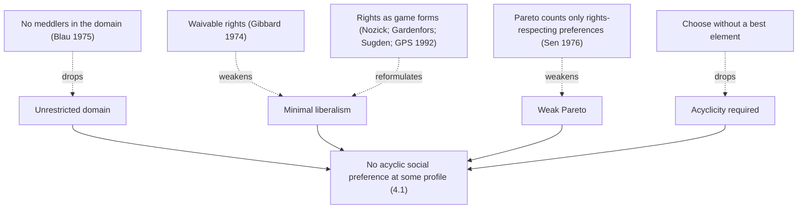

# Social Choice · Lesson 4.2: Answers to Sen

> ⏱ ~15 min · Module 4: Rights and reasons · Builds on: [4.1 Sen's liberal paradox](04-01-sens-liberal-paradox.md), [1.3 Arrow as a map](01-03-arrow-as-a-map.md) · Unlocks: [4.3 The doctrinal paradox and the discursive dilemma](04-03-the-doctrinal-paradox-and-the-discursive-dilemma.md)

## Why this matters

[4.1](04-01-sens-liberal-paradox.md) proved [Sen's liberal paradox](../reference.md#sens-liberal-paradox): unrestricted domain, minimal liberalism and weak Pareto leave some profile with no acyclic social preference. The replies since 1970 do not dispute the proof. They dispute which premise to blame, and each reply is a claim about what a right *is*. This lesson states the main answers at full strength, proves the two small theorems that sort them, and isolates the crux: is a right a constraint on how society ranks outcomes, or on which moves people may make?

## The idea

Sen's cycle needs two ingredients. Someone must care more about another person's private matter than about her own, or Pareto never points against a right. And rights must be read as verdicts on pairs of social states. Pull either thread and the cycle comes apart.

- **Blame the preferences.** If nobody meddles, no cycle forms. So restrict the domain, or tell Pareto to ignore the meddling part.
- **Blame the rights.** Allan Gibbard showed that rights read Sen's way fail *without* Pareto: a conformist and a nonconformist choosing their own jackets already produce a cycle. So make rights waivable, or stop reading them as rankings: a right is a set of moves you may make, and the outcome is whatever the moves produce.

The last reading, rights as game forms, removes the contradiction. It cannot remove the inefficiency: on that reading Sen's paradox becomes a prisoner's dilemma.

## The theorems

**Setting.** Two people (more change nothing below). Person 1 has a personal feature $x_1 \in X_1$, person 2 has $x_2 \in X_2$, and a social state is $x = (x_1, x_2)$, written as two letters with person 1's first. Each person $i$ has a strict ranking $\succ_i$ of the states. A social relation $\succ$ is **acyclic** if it has no cycle $x^1 \succ x^2 \succ \dots \succ x^k \succ x^1$; on a finite menu that is what guarantees a best element.

**Libertarian claim (Gibbard 1974).** For each $i$ and every pair $x, y$ that differ only in $x_i$: if $x \succ_i y$ then $x \succ y$. *In words:* each person is decisive over every change that touches only her own feature. This is far stronger than [minimal liberalism](../reference.md#minimal-liberalism), which asks for two people decisive over one pair each.

**Theorem 1 ([Gibbard's paradox of rights](../reference.md#gibbards-paradox-of-rights)).** Suppose at least two people each have a feature with at least two values. Then no rule on the [unrestricted domain](../reference.md#unrestricted-domain) that satisfies the libertarian claim yields an acyclic social relation at every profile. Weak Pareto is never used. *In words:* rights over your own life, read as verdicts on social states, contradict each other before unanimity enters.

*Proof.* (1) Hold everyone else's features fixed. Ada and Ben each pick a jacket, red (R) or grey (G). By unrestricted domain the rule must handle Ada, a conformist, with RR ≻ GG ≻ GR ≻ RG, and Ben, a nonconformist, with RG ≻ GR ≻ RR ≻ GG.

(2) RR and GR differ only in Ada's jacket, and she prefers RR: so RR ≻ GR.

(3) GR and GG differ only in Ben's, and he prefers GR: GR ≻ GG.

(4) GG and RG differ only in Ada's: GG ≻ RG.

(5) RG and RR differ only in Ben's: RG ≻ RR.

(6) Steps 2–5 give RR ≻ GR ≻ GG ≻ RG ≻ RR, a cycle. ∎

The engine is that each person's preference over her *own* jacket depends on the other's. Call $i$'s preference **unconditional** if her ranking of the values of her own feature is the same whatever the others' features are.

**Lemma 2.** If every person's preference is unconditional, the relation generated by the libertarian claim is acyclic.

*Proof.* (1) Let $\rho_i(v)$ be the rank of value $v$ in $i$'s fixed ranking of her own feature (1 = best), and $\Phi(x) = \sum_i \rho_i(x_i)$. (2) A rights verdict $x \succ y$ has $x, y$ differing only in some $x_i$ with $x \succ_i y$; unconditionality gives $\rho_i(x_i) < \rho_i(y_i)$, so $\Phi(x) < \Phi(y)$. (3) Following a cycle, $\Phi$ would rise strictly at every step and return to its start: impossible. ∎ *In words:* when everyone knows what she wants for herself whatever the others do, rights only ever point toward "everyone has her own way".

So Gibbard's paradox needs conditional preferences. Sen's needs something else. With two values per feature, write $a^*$ for the state where both have their own way ($\Phi = 2$) and $\bar a$ for the state where both give way ($\Phi = 4$).

**Theorem 3 ([meddlesome preferences](../reference.md#meddlesome-preferences), two-person case).** Let each $X_i$ have two values and both preferences be unconditional. The libertarian claim plus [weak Pareto](../reference.md#weak-pareto) force a cycle if and only if both people prefer $\bar a$ to $a^*$. *In words:* Sen's cycle appears exactly when each would give up her own way to stop the other having his.

*Proof.* (1) By Lemma 2, every rights verdict $x \succ y$ has $\Phi(y) = \Phi(x) + 1$. A cycle returns to its starting $\Phi$, so it needs a Pareto verdict $x \succ y$ with $\Phi(y) < \Phi(x)$. (2) If $x, y$ differ in one feature, the owner of that feature prefers $x$, so unconditionality gives $\Phi(x) < \Phi(y)$. The descending verdict therefore joins states differing in both features. (3) The two mixed states have equal $\Phi = 3$, so it must be $\bar a \succ a^*$ by Pareto, which requires both to prefer $\bar a$. (4) Conversely, if both do: $\bar a \succ a^*$ by Pareto, $a^* \succ (a_1, \bar a_2)$ by person 2's right, and $(a_1, \bar a_2) \succ \bar a$ by person 1's right. ∎

A script over all 144 profiles of this kind finds exactly 4 that cycle.

**The answers, premise by premise.**

- **Restrict the domain** (denies unrestricted domain). Julian Blau (1975, *Review of Economic Studies*) is the standard citation for the point that Sen's conflict needs meddlesome preferences and disappears on a domain without them; Theorem 3 is its cleanest two-person instance. Cost: deciding which preferences count as meddlesome is a moral judgment entered as a domain restriction, and Theorem 1 still bites on conditional preferences.
- **Restrict Pareto** (weakens weak Pareto). Keep every profile, but let unanimity count only the parts of preferences that respect others' spheres. This conditional Pareto principle is the line associated with Sen's "Liberty, Unanimity and Rights" (1976, *Economica*), where a liberal person wants her own meddling discounted. Cost: Pareto is no longer read off preferences alone; someone decides which parts count.
- **Make rights waivable** (weakens minimal liberalism). Gibbard (1974, *Journal of Economic Theory*) weakened his claim so that a person may decline to exercise a right, for instance by contract, and showed the weakened claim consistent with Pareto. Cost: a right that yields whenever its holder's whole ranking favours yielding protects less than it seemed to.
- **Rights as game forms** (rejects the formalization). Robert Nozick (*Anarchy, State, and Utopia*, 1974, pp. 164–166) argued that rights do not rank social states: they fix which features each person controls, and social choice works within whatever is left. Peter Gärdenfors (1981), Robert Sugden (1985) and Wulf Gaertner, Prasanta Pattanaik and Kotaro Suzumura (1992) made this precise. In a [game form](../reference.md#rights-as-game-forms), each person has a set of admissible strategies and an outcome function maps strategies to states. Rights are respected when everyone may play any admissible strategy. No social ranking is constrained, so nothing can contradict.
- **Accept cycles** (drops acyclicity): live with menus that have no best element, the exit [1.3](01-03-arrow-as-a-map.md)'s map also lists for Arrow.

**Where the argument is weakest.** Every escape but one keeps Sen's premise that a right is decisiveness over pairs of states; the game-form view denies it. Without that premise the result stops being a contradiction, but it does not vanish. On the game-form reading Theorem 3's case is a prisoner's dilemma (Example 1), and Theorem 1's case has no pure-strategy equilibrium. A script over all 576 two-value profiles confirms that the rights relation cycles exactly when the game has no pure equilibrium, and Bezalel Peleg (1998) recast Gibbard's paradox in these terms. Pattanaik (1996) and Deb, Pattanaik and Razzolini (1997) show variants of the Paretian-liberal impossibility surviving in game forms. The game-form theorist trades a logical inconsistency for outcomes that rights permit and everyone regrets.

## Picture

Four premises jointly fail; each escape cuts one edge. The game-form view is the odd one out: it does not weaken minimal liberalism, it replaces what "having a right" means.

## Worked examples

**Example 1 (clean): tattoos.** Ivo and Jun each choose a tattoo (T) or none (N); Ivo's choice first. Each wants one, but minds the other's more: Ivo TN ≻ NN ≻ TT ≻ NT; Jun NT ≻ NN ≻ TT ≻ TN.

- *Unconditional:* Ivo prefers T both when Jun has one (TT ≻ NT) and when he doesn't (TN ≻ NN); Jun likewise. So $a^* = $ TT and $\bar a = $ NN, and both rank NN above TT. Theorem 3 predicts a cycle.
- *Verdicts:* Ivo's rights give TT ≻ NT and TN ≻ NN; Jun's give TT ≻ TN and NT ≻ NN; Pareto gives NN ≻ TT. Cycle: NN ≻ TT ≻ TN ≻ NN. Every state is beaten.
- *Game form:* T strictly dominates N for each, so TT is the unique equilibrium, and both prefer NN: the [prisoner's dilemma](../../game-theory-refresher/lessons/01-01-normal-form-dominance.md). Rights are respected; the outcome is Pareto-dominated. The waiver answer: both sign "neither of us gets one".

**Example 2 (the hypothesis bites): rights respected, Sen's condition broken.** The idea is Gaertner, Pattanaik and Suzumura's (1992); these numbers are invented. Cara and Dan each choose casual (C) or formal (F), simultaneously, neither knowing the other's ranking. Cara: CC ≻ FF ≻ FC ≻ CF (she wants to match, and being the underdressed one is worst). Dan: FC ≻ CC ≻ FF ≻ CF (casual whatever she wears).

- Not knowing Dan, Cara plays maximin: C risks her fourth-best state (CF), F at worst gives her third (FC). She picks F. Dan's C is dominant. The outcome is FC.
- *Sen's reading:* FC and CC differ only in Cara's outfit and she prefers CC, so FC must not be chosen. Violated.
- *Game-form reading:* each chose freely from a full strategy set, so no right was infringed. FC is even Pareto-efficient (it is Dan's top).

The two formalizations disagree on a case with no meddling and no Pareto conflict. Sen ("Minimal Liberty", 1992, *Economica*) replied that a game form must still say which strategies are admissible and why, and that is where it meets the preference view again.

## Watch out

- **You might think Sen's theorem says liberty and efficiency always conflict.** It says *some* profile in the unrestricted domain produces a cycle. In the two-person, two-value world with unconditional preferences, Theorem 3 says it takes mutual meddling: 4 profiles in 144.
- **You might think Gibbard's paradox shows minimal liberalism alone is inconsistent.** It uses the libertarian claim's breadth: everyone, over every own-feature pair. Two people decisive over one distinct pair each give at most two verdicts, and two verdicts cannot close a cycle.
- **You might think the game-form view solves Sen's problem.** It removes the contradiction. The inefficiency (Example 1) and the missing equilibrium (Theorem 1's jackets) remain.

## One-liner

> Sen's cycle needs meddlers and needs rights read as verdicts on social states: restrict the first, or waive or reformulate the second, and the contradiction goes, but on the game-form reading the inefficiency stays as a prisoner's dilemma.

## Problems

**P1 (🟢) *(Formal (a)–(b).)*** Eli and Fay each choose whether the music on her own balcony is loud (L) or quiet (Q); Eli's choice is written first. Eli: QQ ≻ LL ≻ LQ ≻ QL. Fay: QL ≻ LQ ≻ QQ ≻ LL.

(a) Under the libertarian claim, write the four rights verdicts and show that every state is beaten. Whose preference over her own feature is conditional?
(b) Treat the situation as a simultaneous game in which each chooses her own feature. Show it has no pure-strategy Nash equilibrium, and explain in one sentence why (a) and (b) are the same fact in a two-person, two-value world.

**P2 (🟡) *(Formal (a)–(b) · Exegetical (c).)*** Gus and Hana each choose to dye their own hair (D) or leave it natural (N); Gus's choice first. Gus: DN ≻ NN ≻ DD ≻ ND.

(a) Hana: ND ≻ DD ≻ NN ≻ DN. Do the libertarian claim and weak Pareto force a cycle? Answer with Theorem 3, then confirm by listing every forced verdict and finding the unbeaten state.
(b) Hana instead: ND ≻ NN ≻ DD ≻ DN. Exhibit the cycle. Then find the equilibrium of the game in which each chooses her own hair, and say whether it is Pareto-efficient.
(c) Find the crux. A defender of Sen's formulation says (b) shows rights and Pareto contradict; a game-form theorist says it shows only that free people can produce an outcome both regret. In 100 words or fewer, name the premise one affirms and the other denies, and say what would move each.

**P3 (🔴, optional) *(Exegetical.)*** A housing co-op's charter gives each member the final say over the paint inside her own flat, and forbids choosing an outcome every member likes less than some other outcome. Five invented amendments follow. For each, name the premise of Sen's theorem it denies or weakens (unrestricted domain, minimal liberalism, weak Pareto, acyclicity), or say that it rejects Sen's formalization of rights. One sentence each.

(i) "A member's views about the colour of someone else's flat shall not count when the co-op asks whether everyone prefers one outcome to another."
(ii) "Members may sign binding agreements to paint their flats as other members wish."
(iii) "Each member chooses her paint; the co-op ranks nothing and accepts whatever combination results."
(iv) "Only applicants who certify that they hold no views about other members' flats may join."
(v) "Where the co-op's ranking runs in a circle, it picks among the options in the circle by lot."

Solutions

**P1** *(Formal (a)–(b).)*

(a) Eli's rights decide pairs differing only in the first letter. With Fay on L: LL against QL, Eli prefers LL, so LL ≻ QL. With Fay on Q: QQ against LQ, so QQ ≻ LQ. Fay's rights decide pairs differing only in the second letter. With Eli on L: LQ against LL, Fay prefers LQ, so LQ ≻ LL. With Eli on Q: QL against QQ, so QL ≻ QQ.

Chain them: LL ≻ QL ≻ QQ ≻ LQ ≻ LL. Every state is beaten. Both preferences are conditional: Eli matches Fay (L when she is loud, Q when she is quiet), and Fay does the opposite of Eli.

(b) At each state someone gains by changing only her own feature: at LL Fay switches to Q (LQ); at LQ Eli switches to Q (QQ); at QQ Fay switches to L (QL); at QL Eli switches to L (LL). So there is no pure equilibrium.

Same fact: a state is a pure equilibrium exactly when no one prefers a state differing only in her own feature, which is exactly when no rights verdict beats it; in the two-by-two square any rights cycle runs through all four states, so a cycle leaves no state unbeaten.

**Wrong turns:** reading Eli's pairs as those where *her* letter is fixed: her right covers changes to her own letter, holding Fay's fixed. Adding weak Pareto (both prefer QQ to LL) and thinking it is needed: the cycle uses rights alone, which is the point of Gibbard's paradox.

---

**P2** *(Formal (a)–(b) · Exegetical (c).)*

(a) Both are unconditional: Gus prefers D whether Hana dyes (DD ≻ ND) or not (DN ≻ NN); Hana prefers D whether Gus dyes (DD ≻ DN) or not (ND ≻ NN). So $a^* = $ DD and $\bar a = $ NN. Gus prefers NN to DD, but Hana prefers DD to NN, so by Theorem 3 no cycle is forced.

Direct check. Rights: DD ≻ ND and DN ≻ NN (Gus); DD ≻ DN and ND ≻ NN (Hana). Pareto: no pair is ranked the same way by both (for instance, Gus prefers NN to DD but Hana the reverse). The unbeaten state is DD.

(b) Hana is now unconditional and prefers NN to DD, so both prefer $\bar a$ to $a^*$. Rights as in (a), plus Pareto NN ≻ DD. Cycle: DD ≻ DN ≻ NN ≻ DD. In the game D strictly dominates N for each, so DD is the unique equilibrium, and it is Pareto-dominated by NN.

**Wrong turns:** treating Gus's meddling as enough for a cycle in (a): Theorem 3 needs *both* to prefer NN to DD. Calling DD in (b) "not an equilibrium because it is inefficient": equilibrium and efficiency are separate tests.

**Must hit, strict (c):**

- The crux: whether a right is decisiveness over pairs of social states (a constraint on the social ranking) or freedom to choose among admissible strategies (a constraint on moves). The preference view affirms the first; the game-form view denies it.
- On the game-form reading (b) contains no inconsistency: DD is what free choices produce, rights intact, and the cost is inefficiency.
- What would move each: the preference theorist, a case where his formulation condemns an outcome reached by free choice with no meddling (Example 2); the game-form theorist, the demand to say which strategies are admissible and why, which may require the very ranking of outcomes he set aside.

**Model answer (c):** They split over what a right is. Sen's formulation makes it decisiveness over pairs of states, so in (b) rights and Pareto give contradictory verdicts. The game-form view makes it a protected choice of strategy, so (b) is consistent: DD is the free outcome, merely inefficient. The first should be moved by Example 2, where his formulation condemns a freely chosen outcome nobody meddled with. The second should be moved by Sen's reply that the admissible strategies must themselves be justified, possibly by appeal to outcomes.

---

**P3** *(Exegetical, strict.)*

**Must hit, strict:**

- (i) Weak Pareto, weakened to a conditional Pareto principle that ignores preferences about others' spheres (Sen's 1976 line). Every profile is still admitted.
- (ii) Minimal liberalism, weakened to waivable rights (Gibbard's line).
- (iii) Rejects the formalization: rights as game forms (Nozick, Gärdenfors, Sugden, Gaertner–Pattanaik–Suzumura). It denies that rights constrain a social ranking at all.
- (iv) Unrestricted domain, restricted to non-meddlesome preferences (Blau's line).
- (v) Acyclicity: the co-op accepts a cyclic ranking and picks among the cycle without a best element.

**Wrong turns:** calling (i) a domain restriction. Meddlesome members may still join, and their preferences are only filtered out of the Pareto test; (iv) is the domain restriction. Calling (iii) "dropping Pareto": it drops the social ranking that both Pareto and Sen's rights were conditions on.

**Model answer:** (i) weak Pareto; (ii) minimal liberalism (waivable rights); (iii) rejects the formalization (game forms); (iv) unrestricted domain; (v) acyclicity.

## Flashback

**From Lesson [3.4](03-04-single-crossing-and-value-restriction.md) (Single-crossing and value restriction):** *(Formal (a)–(c).)* Six council members rank four zoning plans S, T, U, V. They are listed in an order that makes the profile single-crossing:

| Voters | Ranking |
|---|---|
| 1–2 | S ≻ T ≻ U ≻ V |
| 3 | T ≻ S ≻ U ≻ V |
| 4 | T ≻ U ≻ V ≻ S |
| 5 | U ≻ T ≻ V ≻ S |
| 6 | U ≻ V ≻ T ≻ S |

(a) With $n$ even, 3.4's version of Theorem 1 reads the majority relation $M$ off the two middle voters. Write $M$ down that way, without counting, and name the tied pairs.
(b) Confirm S against V and T against U by direct count.
(c) Is there a strict Condorcet winner? Show that the weak relation $R$ ($x \, R \, y$ iff $n(x,y) \ge n(y,x)$) is not transitive.

Solution

**Worked answer:**

(a) The middle voters are 3 (T ≻ S ≻ U ≻ V) and 4 (T ≻ U ≻ V ≻ S), and $x \, M \, y$ iff both prefer $x$. Both put T above S, U and V, and both put U above V. They disagree on S against U and S against V. So $M$ is: T over S, T over U, T over V, U over V; the pairs S–U and S–V tie.

(b) S over V: voters 1–3, so 3–3, a tie. T over U: voters 1–4, so 4–2 for T.

(c) T beats S 4–2, U 4–2 and V 5–1, so T is the strict Condorcet winner. $R$ fails transitivity: $V \, R \, S$ (3–3) and $S \, R \, U$ (3–3), but not $V \, R \, U$, since U beats V 6–0. $M$ itself stays transitive, being the intersection of two rankings.

**Wrong turns:** reading $M$ off voter 3 or voter 4 alone: with $n$ even there is no single middle voter, and voter 3's ranking would wrongly put S over U, a 3–3 tie. Assuming two ties chain into a third: S ties U and S ties V, yet U beats V unanimously. Concluding from the intransitive $R$ that the majority can cycle: the strict relation $M$ cannot.

## Connections

- **Backward:** [4.1](04-01-sens-liberal-paradox.md) proved the theorem these answers respond to. [1.3](01-03-arrow-as-a-map.md) read Arrow as a map of [escape routes](../reference.md#escape-routes); this lesson is the same method applied to Sen. Blau's answer is the rights analogue of [3.4](03-04-single-crossing-and-value-restriction.md)'s value restriction: restrict the domain and coherence returns.
- **Forward:** [4.3](04-03-the-doctrinal-paradox-and-the-discursive-dilemma.md) finds the next place aggregation breaks, when a group must hold reasons as well as conclusions; [4.4](04-04-the-list-pettit-impossibility.md)'s escapes again come one premise at a time.
- **Sideways:** Nozick's rights as side constraints are in [`political-philosophy` 2.4](../../political-philosophy/lessons/02-04-nozick-entitlement-and-the-challenge-to-patterns.md) and [`ethics` 2.4](../../ethics/lessons/02-04-constraints-and-options.md); Mill's self-regarding sphere, the intuition behind "personal features", is [`political-philosophy` 3.2](../../political-philosophy/lessons/03-02-mills-harm-principle.md). A game form is the mechanism of [`grad-game-theory` 5.2](../../grad-game-theory/lessons/05-02-revelation-principle-incentive-compatibility.md) without the designer's goal. [`philosophy-of-economics` 3.2](../../philosophy-of-economics/lessons/03-02-the-limits-of-pareto-and-the-compensation-tests.md) reads meddlesome preferences as its laundering problem.
