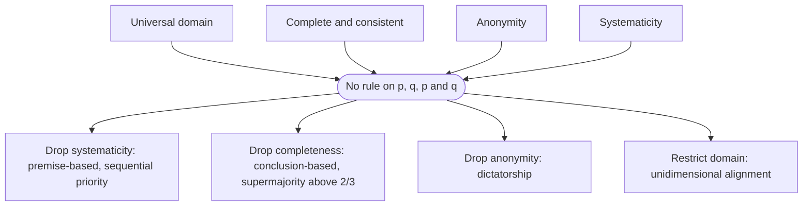

# Social Choice · Lesson 4.4: The List–Pettit impossibility

> ⏱ ~15 min · Module 4: Rights and reasons · Builds on: [4.3 The doctrinal paradox and the discursive dilemma](04-03-the-doctrinal-paradox-and-the-discursive-dilemma.md), [1.2 May's theorem](01-02-mays-theorem.md), [1.3 Arrow as a map](01-03-arrow-as-a-map.md) · Unlocks: [5.1 The Condorcet jury theorem](05-01-the-condorcet-jury-theorem.md), [5.3 Epistemic readings of aggregation](05-03-epistemic-readings-of-aggregation.md)

## Why this matters

[4.3](04-03-the-doctrinal-paradox-and-the-discursive-dilemma.md) showed that proposition-wise majority voting can hand a panel an inconsistent set of judgments. That could be a defect of majority rule. Christian List and Philip Pettit (2002, "Aggregating Sets of Judgments: An Impossibility Result," *Economics and Philosophy*) showed it is not: any rule that treats voters equally and decides every proposition the same way, by its own votes, breaks on the smallest interesting agenda. This is the judgment-aggregation counterpart of Arrow, and like Arrow it is most useful as a map of what you must give up.

## The idea

Two demands sound like plain fairness. Treat the members alike (anonymity). Treat the propositions alike: whether the group accepts a proposition should depend only on who accepts it, by the same test for every proposition (systematicity). Together they leave a rule only one thing to look at: **how many** members accept a proposition. Then [May's](01-02-mays-theorem.md) logic kicks in. A count rule that must always accept exactly one of $\varphi$ and "not $\varphi$" is pushed to majority, and [4.3](04-03-the-doctrinal-paradox-and-the-discursive-dilemma.md) already showed majority goes inconsistent. So the impossibility is May plus the discursive dilemma: fairness forces majority, and majority fails.

## The theorem

**Setting.** Voters $N = \{1, \dots, n\}$ with $n \ge 2$. The **agenda** is

$$X = \{p, \neg p, \ q, \neg q, \ p \wedge q, \ \neg(p \wedge q)\},$$

with $p$, $q$ logically independent atoms. A **judgment set** $J \subseteq X$ is *complete* if it contains $\varphi$ or $\neg\varphi$ for each pair, and *consistent* if some assignment of truth values makes all its members true. A complete consistent set is one of four:

$$\{p, q, p\wedge q\},\ \{p, \neg q, \neg(p\wedge q)\},\ \{\neg p, q, \neg(p\wedge q)\},\ \{\neg p, \neg q, \neg(p\wedge q)\}.$$

Write these as types $pq$, $p\bar q$, $\bar p q$, $\bar p \bar q$. A profile is $\mathbf J = (J_1, \dots, J_n)$, and an [aggregation function](../reference.md#judgment-aggregation) $F$ maps profiles to collective sets. For $\varphi \in X$, $N_\varphi(\mathbf J) = \{i : \varphi \in J_i\}$ is the set of its supporters.

**Conditions.**

- **Universal domain (UD):** $F$ is defined on every profile of complete consistent individual sets.
- **Collective rationality (CR):** $F(\mathbf J)$ is complete and consistent.
- **Anonymity (A):** permuting the voters does not change $F(\mathbf J)$.
- **[Systematicity](../reference.md#systematicity) (S):** for all $\varphi, \psi \in X$ and all profiles $\mathbf J, \mathbf J^*$,

$$N_\varphi(\mathbf J) = N_\psi(\mathbf J^*) \implies \big(\varphi \in F(\mathbf J) \iff \psi \in F(\mathbf J^*)\big).$$

*In words:* the verdict on a proposition depends only on who supports it, through one test applied to every proposition. With $\varphi = \psi$ forced, this is **independence**, the analogue of Arrow's [IIA](../reference.md#independence-of-irrelevant-alternatives); systematicity adds **neutrality** across propositions on top.

**[Theorem (List and Pettit 2002)](../reference.md#list-pettit-impossibility).** No aggregation function on $X$ satisfies UD, CR, A and S. The same holds with $p \vee q$ or $p \to q$ in place of $p \wedge q$.

*In words:* on any agenda with two premises and a conclusion built from them, equal treatment of voters plus equal treatment of propositions makes collective consistency impossible.

**Proof.** (A reconstruction. Each profile below is checked by script for $n \le 9$, and steps 2–5 by brute force over all $2^{n+1}$ count functions for $n \le 7$.) Suppose $F$ satisfies all four.

1. *There is a count function.* Claim: there is $g : \{0, \dots, n\} \to \{0, 1\}$ with $\varphi \in F(\mathbf J) \iff g(|N_\varphi(\mathbf J)|) = 1$. Take $\varphi$ in $\mathbf J$ and $\psi$ in $\mathbf J^*$ with supporter sets $T$, $T^*$ of equal size. Let $\pi$ be a permutation of $N$ with $\pi(T^*) = T$, and $\pi\mathbf J^*$ the profile in which voter $\pi(i)$ holds $J^*_i$. By A, $F(\pi\mathbf J^*) = F(\mathbf J^*)$; in $\pi\mathbf J^*$ the supporters of $\psi$ are exactly $T$. By S applied to $\varphi$ in $\mathbf J$ and $\psi$ in $\pi\mathbf J^*$, the verdicts agree. So the verdict depends only on the count.
2. *Complementarity.* Each voter holds exactly one of $\varphi, \neg\varphi$, so $|N_{\neg\varphi}| = n - |N_\varphi|$. By CR the group accepts exactly one of them. Every count $k$ occurs for $p$ on some profile, so $g(n-k) = 1 - g(k)$ for all $k$.
3. *Even $n$.* Put $k = n/2$ in step 2: $g(n/2) = 1 - g(n/2)$, impossible.
4. *Odd $n$: only majority survives.* Let $k \le (n-1)/2$. Build the profile with $k$ voters of type $pq$, $n - 2k$ of type $p\bar q$, and $k$ of type $\bar p\bar q$. Then $\neg p$ and $p \wedge q$ each have exactly $k$ supporters. If $g(k) = 1$ the group accepts both, which is inconsistent; by CR, $g(k) = 0$. By step 2, $g(k) = 1$ for every $k \ge (n+1)/2$: $F$ is proposition-wise majority.
5. *Majority fails.* Let $k = (n+1)/2$ and take $(n-1)/2$ voters $pq$, one $p\bar q$, one $\bar p q$, and $(n-3)/2$ voters $\bar p\bar q$ (all counts $\ge 0$ since $n \ge 3$). Then $p$, $q$ and $\neg(p\wedge q)$ each have $k$ supporters, so all three are accepted: inconsistent, contradicting CR. ∎

At $n = 3$ step 5 is exactly [4.3](04-03-the-doctrinal-paradox-and-the-discursive-dilemma.md)'s [discursive dilemma](../reference.md#discursive-dilemma). The step-4 profile is the new move: it uses the two-proposition contradiction $\{\neg p, p\wedge q\}$ to rule out every count rule except majority.

**Where the argument is weakest.** Systematicity, specifically its neutrality half. Why should a conclusion be decided by the same test as a premise? Weaken S to independence alone and, on this small agenda, the impossibility disappears: P3 below builds a rule that passes UD, CR, A and independence. But the reprieve is local. Dietrich and List (2007, "Arrow's theorem in judgment aggregation," *Social Choice and Welfare*) and Dokow and Holzman (2010), building on Nehring and Puppe, show that on agendas with enough logical interconnection (path-connected, non-simple, pair-negatable), UD, CR, independence and unanimity preservation force a dictatorship. On the *preference agenda*, whose propositions are "$x$ is ranked above $y$" with transitivity as the logical constraint, that result *is* [Arrow's theorem](../reference.md#arrows-theorem) for strict orderings. A critic who wants proposition-by-proposition aggregation has to attack independence itself, not just neutrality.

## Picture

Four premises, one impossibility, four escapes. Each escape keeps three conditions and pays for it differently.

## Worked examples

**Example 1 (clean): one profile, five procedures.** Five members: 2 $pq$, 1 $p\bar q$, 1 $\bar p q$, 1 $\bar p\bar q$. Counts: $p$ 3, $q$ 3, $p\wedge q$ 2.

- *Proposition-wise majority:* $\{p, q, \neg(p\wedge q)\}$: inconsistent.
- *[Premise-based](../reference.md#premise-based-procedure):* majority on $p$ (3) and $q$ (3), then derive $p \wedge q$. Complete, consistent, anonymous.
- *Conclusion-based:* majority on $p\wedge q$ alone, 2–3, so $\neg(p\wedge q)$; silent on $p$ and $q$. Consistent, incomplete.
- *Supermajority:* accept a proposition only with more than $2n/3$ supporters, here 4 or more. Nothing reaches 4, so the output is empty. In general, three propositions each held by more than $2n/3$ of $n$ voters must share a supporter, who would then hold an inconsistent set; so the rule is always consistent. By script, more than $2n/3$ is exactly the smallest threshold that works for $n = 2, \dots, 12$.
- *Sequential priority:* decide propositions in a fixed order, each by majority unless earlier collective judgments already settle it. Order $p, q, p\wedge q$: accept $p$, $q$, then $p \wedge q$ is forced. Order $p\wedge q, p, q$: reject $p\wedge q$ (2–3), accept $p$, then $\neg q$ is forced. Order $p\wedge q, q, p$: $\{\neg p, q, \neg(p\wedge q)\}$. Three orders, three different consistent outcomes: [agenda control](../reference.md#agenda-control) again, as with the top cycle in [1.4](01-04-how-often-do-cycles-happen.md).

**Example 2 (the hypothesis bites): which condition does premise-based voting drop?** It keeps UD, CR and A, so by the theorem it must violate S. Exhibit it. Profile $\mathbf A$ is Example 1's, voters numbered in the order listed; profile $\mathbf B$ is 2 $pq$ and 3 $\bar p\bar q$. In both, $p\wedge q$ is supported by exactly voters $\{1, 2\}$. Premise-based gives $p \wedge q$ under $\mathbf A$ (3–2 on each premise) and $\neg(p\wedge q)$ under $\mathbf B$. Same supporters, different verdicts: **independence fails** on the conclusion, so systematicity does. That is not a bug in the procedure; it is its whole design. The verdict on the conclusion is *supposed* to depend on the premises.

Domain restriction works the way single-crossing did in [3.4](03-04-single-crossing-and-value-restriction.md). Call a profile **unidimensionally aligned** (List 2003, *Mathematical Social Sciences*) if voters can be ordered so that, for each proposition, its supporters all sit on one side of its opponents. Then the median voter's set is the majority outcome, so majority is consistent. Example 1's profile cannot be so ordered (checked over all orderings); 1 $\bar p\bar q$, 1 $p\bar q$, 3 $pq$ can, and majority returns the median's $\{p, q, p\wedge q\}$.

## Watch out

- **You might think systematicity is just IIA for judgments.** IIA's analogue is *independence*. Systematicity adds neutrality across propositions, and on the conjunctive agenda that extra is what does the damage: without it there is an escape (P3).
- **You might think the theorem needs many voters or a contrived agenda.** It holds for every $n \ge 2$ on the smallest agenda with a compound proposition. The hypothesis not to drop is that $p$ and $q$ are logically independent: if $p$ entails $q$, then $p\wedge q$ says no more than $p$, and majority over an odd electorate is consistent.
- **You might think the theorem shows group judgments are incoherent.** It shows no rule meets all four conditions on *every* profile. Each escape gives consistent group judgments; the question is which condition you will pay.

## One-liner

> Treat members alike and propositions alike and you are forced to majority, which the discursive dilemma breaks; every working procedure gives up one of anonymity, systematicity, completeness or the full domain.

## Problems

**P1 (🟢) *(Formal.)*** Let $D_1$ be the rule $D_1(\mathbf J) = J_1$ on the conjunctive agenda.

(a) Show that $D_1$ satisfies UD, CR and systematicity.
(b) Using the three-voter profile $(pq, \bar p\bar q, \bar p\bar q)$ and one permutation of the voters, show that $D_1$ violates anonymity.

**P2 (🟡) *(Formal.)*** Replace $p\wedge q$ by $p \vee q$. Take $n = 7$ and suppose $F$ satisfies UD, CR, A and S, so step 1 gives a count function $g$.

(a) For each $k = 0, 1, 2, 3$, give a seven-voter profile in which $p$ and $\neg(p\vee q)$ each have exactly $k$ supporters, and conclude that $g(k) = 1$ for every $k \ge 4$.
(b) Give a seven-voter profile on which this $g$ produces an inconsistent collective set, naming the inconsistent propositions.

**P3 (🔴, optional) *(Formal (a) · Exegetical (b).)*** Rule $F_U$ on the conjunctive agenda: accept $p$ only if every voter accepts $p$, otherwise accept $\neg p$; the same for $q$ and for $p\wedge q$.

(a) Show $F_U$ satisfies UD, CR, anonymity and independence, and exhibit a two-voter profile on which it violates systematicity.
(b) In 100 words or fewer: what does systematicity demand beyond independence, and what does (a) show about which half of it the List–Pettit proof uses?

Solutions

**P1** *(Formal (a)–(b).)*

(a) UD: $D_1$ is defined on every profile. CR: $J_1$ is complete and consistent by assumption on individual sets. S: $\varphi \in D_1(\mathbf J) \iff 1 \in N_\varphi(\mathbf J)$. If $N_\varphi(\mathbf J) = N_\psi(\mathbf J^*)$, then $1 \in N_\varphi(\mathbf J) \iff 1 \in N_\psi(\mathbf J^*)$, so $\varphi \in D_1(\mathbf J) \iff \psi \in D_1(\mathbf J^*)$.

(b) $D_1(pq, \bar p\bar q, \bar p\bar q) = \{p, q, p\wedge q\}$. Swap voters 1 and 2: $D_1(\bar p\bar q, pq, \bar p\bar q) = \{\neg p, \neg q, \neg(p\wedge q)\}$. A permutation changed the output, so A fails. Since $D_1$ keeps UD, CR and S, the theorem says this is the only condition it can fail.

**Wrong turns:** checking S only for $\varphi = \psi$ (that is independence). Calling $D_1$ inconsistent: the dictator's own set is always consistent.

---

**P2** *(Formal (a)–(b).)*

**Accept:** any profiles with the stated counts; one verified answer follows.

(a) Types: $pq$, $p\bar q$, $\bar p q$ all accept $p \vee q$; $\bar p\bar q$ accepts $\neg(p \vee q)$. Take $k$ voters $pq$, $7 - 2k$ voters $\bar p q$, $k$ voters $\bar p\bar q$. Then $|N_p| = k$ and $|N_{\neg(p\vee q)}| = k$:

| $k$ | $pq$ | $\bar p q$ | $\bar p\bar q$ |
|---|---|---|---|
| 0 | 0 | 7 | 0 |
| 1 | 1 | 5 | 1 |
| 2 | 2 | 3 | 2 |
| 3 | 3 | 1 | 3 |

$\{p, \neg(p\vee q)\}$ is inconsistent, so CR forces $g(k) = 0$ for $k \le 3$. Complementarity, $g(7-k) = 1 - g(k)$, gives $g(k) = 1$ for $k \ge 4$: majority.

(b) Two $pq$, one $p\bar q$, one $\bar p q$, three $\bar p\bar q$. Supporters: $\neg p$ has $1 + 3 = 4$, $\neg q$ has $1 + 3 = 4$, $p\vee q$ has $2 + 1 + 1 = 4$. All three are accepted, and $\{\neg p, \neg q, p\vee q\}$ is inconsistent.

**Wrong turns:** reusing the conjunctive profile; with $\vee$, the inconsistent triple is $\{\neg p, \neg q, p \vee q\}$, so the counts needed are on the negated premises. In (a), forgetting $k = 0$, which needs every voter of one type that accepts neither $p$ nor $\neg(p\vee q)$.

---

**P3** *(Formal (a) · Exegetical (b), strict.)*

(a) UD and A: $F_U$ is defined everywhere and looks only at whether *all* voters accept a proposition. Independence: the verdict on $p$, $q$ or $p\wedge q$ depends only on its own supporter set (is it $N$?); the verdict on a negation is fixed by the verdict on the positive proposition. CR: complete by construction. Consistent: if $p\wedge q$ is unanimous then so are $p$ and $q$, giving $\{p, q, p\wedge q\}$; otherwise $\neg(p\wedge q)$ is accepted alongside any mix of $p$, $\neg p$, $q$, $\neg q$, and all four mixes are consistent except $\{p, q, \neg(p\wedge q)\}$, which cannot occur because unanimous $p$ and unanimous $q$ make $p\wedge q$ unanimous. (Script check: complete and consistent on all profiles, $n = 2, \dots, 5$.)

Violation of S: profile $(p\bar q, \bar p q)$. $p$ is supported by $\{1\}$ and $\neg q$ by $\{1\}$. $p$ is not unanimous, so $\neg p$ is accepted and $p$ rejected; $q$ is not unanimous, so $\neg q$ is accepted. Same supporter set, opposite verdicts.

**Must hit, strict (b):**

- Independence fixes one test per proposition; systematicity requires the *same* test for every proposition, including a proposition and its negation (neutrality).
- $F_U$ uses one test for $p$ (unanimity) and another for $\neg p$ (any dissent), so it keeps independence and drops neutrality, and it escapes. The proof's step 1, and so steps 2–5, need neutrality.

**Wrong turns:** claiming $F_U$ violates CR because it often rejects a proposition nobody rejects unanimously: rejecting $p$ means accepting $\neg p$, which keeps the set complete.

**Model answer (b):** Independence lets each proposition have its own test, as long as the test reads only that proposition's supporters. Systematicity also requires one test for all propositions, including treating $\varphi$ and $\neg\varphi$ alike. $F_U$ applies unanimity to $p$ and "anyone dissents" to $\neg p$: independent, not neutral, and consistent. So the proof's force comes from neutrality; on this agenda, independence alone permits a rule.

## Flashback

**From Lesson [4.2](04-02-answers-to-sen.md) (Answers to Sen):** *(Formal (a)–(b).)* Theo and Uma each decide whether to keep chickens in their own yard (C) or not (N); Theo's choice is written first. Theo: NN ≻ CC ≻ CN ≻ NC. Uma: NC ≻ NN ≻ CC ≻ CN.

(a) Whose preference over his or her own feature is conditional? Under the libertarian claim alone, write the four rights verdicts and find the unbeaten state. In one sentence, say why a single unconditional person is enough to block a rights-only cycle in a two-person, two-value world.
(b) Add weak Pareto. Exhibit a cycle and show every state is beaten. In one sentence, does this contradict Theorem 3 of Lesson 4.2?

Solution

(a) Theo prefers N when Uma has none (NN ≻ CN) but C when she has chickens (CC ≻ NC): conditional, a conformist. Uma prefers C whatever Theo does (NC ≻ NN and CC ≻ CN): unconditional.

Rights verdicts. Theo's (pairs differing only in the first letter): NN ≻ CN and CC ≻ NC. Uma's (only the second letter): NC ≻ NN and CC ≻ CN. Chained: CC ≻ NC ≻ NN ≻ CN, plus CC ≻ CN. **CC is unbeaten**, so there is no Gibbard cycle.

Why: rights verdicts join only states differing in one letter, so a rights cycle must run around all four states and cross Uma's two pairs in opposite directions, once favouring C and once favouring N for her, which is exactly a conditional preference.

(b) Weak Pareto: both rank NN above CC, NN above CN, and CC above CN. Cycle: NN ≻ CC (Pareto) ≻ NC (Theo's right) ≻ NN (Uma's right). CN is beaten by NN, so every state is beaten.

No contradiction: Theorem 3 assumes *both* preferences unconditional and Theo's is not, so the theorem is silent here. The cycle still needs Pareto (rights alone left CC unbeaten), and Pareto's NN ≻ CC comes from Uma's meddling: she would give up her own chickens to keep Theo from having his.

**Wrong turns:** calling Uma conditional because she cares about Theo's yard. Conditionality asks whether her ranking of her *own* feature changes with his; caring about his feature is meddling, a different property. Using Theorem 3 to predict no cycle: its states $a^*$ and $\bar a$ are not even defined when Theo has no fixed "own way".

## Connections

- **Backward:** [4.3](04-03-the-doctrinal-paradox-and-the-discursive-dilemma.md) supplied the dilemma that step 5 generalizes. Step 4 is [May's theorem](01-02-mays-theorem.md)'s logic in judgment form: anonymity plus neutrality leave only a count, and a count rule that must decide every question is majority. [1.3](01-03-arrow-as-a-map.md)'s map of escape routes reappears with judgments in place of rankings, and sequential priority's path-dependence is [1.4](01-04-how-often-do-cycles-happen.md)'s agenda control.
- **Forward:** [5.1](05-01-the-condorcet-jury-theorem.md) asks when majority on a single proposition tracks the truth; [5.3](05-03-epistemic-readings-of-aggregation.md) asks whether the premise-based procedure tracks it better than the conclusion-based one. List and Pettit's *Group Agency* (2011) reads the theorem as showing that a group able to hold consistent views cannot fix each view by a member vote on that proposition alone, so its attitudes must be partly autonomous from its members' (paraphrased).
- **Sideways:** a Condorcet cycle is a discursive dilemma on the preference agenda, and Arrow's proof (decisive coalitions) is [`grad-game-theory` 5.1](../../grad-game-theory/lessons/05-01-social-choice-impossibility.md). Whether a body should deliberate to agreement or aggregate premises is [`political-philosophy` 5.3](../../political-philosophy/lessons/05-03-deliberative-vs-aggregative-democracy.md)'s question; individual coherence under disagreement is [`epistemology` 5.5](../../epistemology/lessons/05-05-bayesian-disagreement-and-higher-order-evidence.md)'s.
