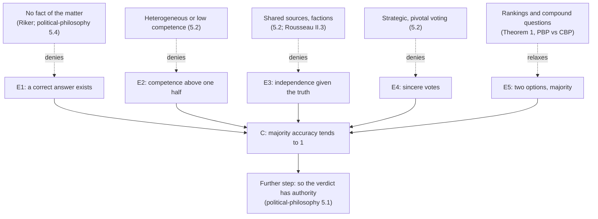

# Social Choice · Lesson 5.3: Epistemic readings of aggregation

> ⏱ ~15 min · Module 5: Truth-tracking · Builds on: [5.1 The Condorcet jury theorem](05-01-the-condorcet-jury-theorem.md), [5.2 When the jury theorem fails](05-02-when-the-jury-theorem-fails.md), [2.3 Condorcet methods and Kemeny](02-03-condorcet-methods-and-kemeny.md), [4.3 The doctrinal paradox](04-03-the-doctrinal-paradox-and-the-discursive-dilemma.md) · Unlocks: [6.1 Approval voting](06-01-approval-voting.md)

## Why this matters

Modules 1–4 treated ballots as preferences to be combined fairly. Condorcet also treated them as *evidence*: each ballot is a noisy report about a fact, and a voting rule is an estimator. Read that way, Kemeny's rule is a maximum-likelihood estimate, Rousseau's outvoted citizen is a Bayesian who has just seen data, and premise-based versus conclusion-based voting is a question of which errs less. This lesson says exactly what each result shows. The step from "accurate" to "authoritative" leaves mathematics; [`political-philosophy` 5.1](../../political-philosophy/lessons/05-01-why-democracy.md) owns it.

## The idea

Ten thermometers in one room each read the temperature with some noise. Average them and you beat any single one, and nobody calls the average "the will of the thermometers". The epistemic reading says some votes are like that: a juror's "guilty" is a report of what she thinks happened, not a preference. The question about a rule becomes "how often is it right, and about what?"

Two lessons follow. Every truth-tracking claim is conditional on a **noise model** (how voters err, and whether independently), and is only as good as the model. And "about what" matters: the most likely ranking, the most likely winner and the most likely verdict can come apart.

## The argument

**The jury theorem as an argument form.** [5.1](05-01-the-condorcet-jury-theorem.md)'s theorem is the engine of an argument with five premises:

- **E1 (Truth).** A correct answer exists, fixed independently of the vote.
- **E2 ([Competence](../reference.md#competence)).** Each voter is right with probability $p > 1/2$.
- **E3 (Independence).** Votes are independent given the truth.
- **E4 (Sincerity).** Each voter votes her judgment.
- **E5 (Binary).** Two options, decided by simple majority.
- ∴ **C.** The probability $P_n$ that the majority is right tends to 1 as $n$ grows ([Condorcet jury theorem](../reference.md#condorcet-jury-theorem)).

*In words:* the theorem asserts only that E1–E5 imply C. Whether accuracy gives a verdict authority is a further, normative premise that [`political-philosophy` 5.1](../../political-philosophy/lessons/05-01-why-democracy.md) examines (Estlund's authority tenet); nothing here supplies it. [5.2](05-02-when-the-jury-theorem-fails.md) attacked E2–E4. This lesson relaxes E5 and looks at what the argument has been used to read.

**Condorcet's noise model and Kemeny.** Let $A$ be the set of alternatives, $|A| = m$, with an unknown true ranking $R^*$. In **[Condorcet's noise model](../reference.md#condorcet-noise-model)**, every voter orders every pair $\{x, y\}$ the way $R^*$ does with probability $p \in (\tfrac12, 1)$, independently across voters and pairs. For a candidate ranking $R$, its **agreement score** is

$$a(R) = \sum_{x \text{ above } y \text{ in } R} n(x, y),$$

where $n(x,y)$ is the number of voters ranking $x$ above $y$. The [Kemeny rule](../reference.md#kemeny-rule) ([2.3](02-03-condorcet-methods-and-kemeny.md)) picks the ranking that maximizes $a(R)$.

**Theorem 1** (Young, "Condorcet's Theory of Voting," *APSR*, 1988, reconstructing Condorcet). Under Condorcet's noise model the maximum-likelihood estimate of $R^*$ is the Kemeny ranking, for every $p \in (\tfrac12, 1)$. With a uniform prior over the $m!$ rankings, the posterior is $\Pr(R \mid \mathbf{P}) \propto \varphi^{a(R)}$, where $\varphi = p/(1-p)$ and $\mathbf{P}$ is the profile.

*In words:* if voters are independent, equally reliable judges of each comparison, the ranking that agrees with the most judgments is the likeliest truth, and each extra agreement multiplies its odds by $\varphi$.

*Proof.*

1. There are $N = n\binom{m}{2}$ voter-pair judgments. Given $R^* = R$, each agrees with $R$ with probability $p$, independently (the model).
2. So the likelihood is $L(R) = p^{a(R)}(1-p)^{N - a(R)} = (1-p)^N \varphi^{a(R)}$.
3. $(1-p)^N$ does not depend on $R$, and $\varphi > 1$ because $p > 1/2$, so $L$ is strictly increasing in $a(R)$. Its maximizers are exactly the Kemeny rankings.
4. By Bayes' rule with a uniform prior ([`prob-stat-refresher` 1.2](../../prob-stat-refresher/lessons/01-02-conditional-probability-bayes.md)), $\Pr(R \mid \mathbf{P}) = L(R)/\sum_{R'} L(R') \propto \varphi^{a(R)}$. ∎

One worry: real ballots are transitive, so a voter's pairwise judgments are not independent. Conditioning on transitivity gives Mallows's (1957) model, $\Pr(\succ_i \mid R) \propto \varphi^{-d(\succ_i, R)}$ with $d$ the Kendall tau distance. Its normalizing constant is the same for every $R$, by relabelling alternatives, so Theorem 1 survives unchanged.

**Rousseau through the jury theorem.** Grofman and Feld ("Rousseau's General Will: A Condorcetian Perspective," *APSR*, 1988) read *Social Contract* II.3 and IV.2 (the text is [`history-of-political-thought` 4.4](../../history-of-political-thought/lessons/04-04-rousseau-the-social-contract.md)'s) as an informal jury theorem. The assembly is asked whether a law conforms to the general will (E1, E5), citizens judge without communicating (E3), and the outvoted citizen learns he was mistaken. Two pieces formalize.

*Factions are correlation.* II.3 says that once partial associations form, there are only as many votes as associations. Model each bloc as following one leader who is right with probability $p$. With 99 independent citizens at $p = 0.65$, $P_{99} \approx 0.9989$. Put the same citizens in three blocs of 33 and accuracy is $P_3(0.65) = 0.71825$. One bloc holding a majority gives 0.65, a single person's competence: Rousseau's "particular opinion." His no-factions condition is E3 ([correlated voters](../reference.md#correlated-voters)).

*The outvoted citizen.* **Lemma 2.** Under E1–E4, with prior $\tfrac12$ on each answer, if $k$ of $n$ voters choose an answer, the posterior probability that it is correct is

$$\frac{\varphi^{d}}{1 + \varphi^{d}}, \qquad d = 2k - n.$$

*In words:* only the margin matters, not the turnout, and the answer is very sensitive to $p$.

*Proof.* (1) If the $k$-side is right, the split has probability $\binom{n}{k}p^k(1-p)^{n-k}$; if wrong, $\binom{n}{k}p^{n-k}(1-p)^k$. (2) With equal priors, Bayes gives $p^k(1-p)^{n-k}$ divided by the sum of the two terms. (3) Divide through by $p^{n-k}(1-p)^k$. ∎

A 55–45 vote gives 0.599 if $p = 0.51$ and 0.882 if $p = 0.55$. IV.2's "I was mistaken" is a Bayesian update under E1–E4, with a strength fixed by a competence nobody observes. Whether to defer to peers who disagree is [`epistemology` 5.5](../../epistemology/lessons/05-05-bayesian-disagreement-and-higher-order-evidence.md)'s question.

**The premise-based procedure as truth-tracking.** Take [4.3](04-03-the-doctrinal-paradox-and-the-discursive-dilemma.md)'s conjunctive case: liability iff premises $\pi_1$ and $\pi_2$ both hold. Three judges are each right on each premise with probability $r$, independently. The [premise-based procedure](../reference.md#premise-based-procedure) (PBP) takes a majority on each premise and infers; the conclusion-based procedure (CBP) takes a majority of the judges' own conclusions. Let $Q = P_3(r)$.

- Both premises true: PBP needs both majorities right, $Q^2$. A judge's conclusion is right only if she gets both, so CBP $= P_3(r^2)$.
- Both false: PBP errs only if both majorities err, $1 - (1-Q)^2$. CBP $= P_3\big(1 - (1-r)^2\big)$.
- One true: PBP $= 1 - Q(1-Q)$; CBP $= P_3\big(1 - r(1-r)\big)$.

At $r = 0.7$, $Q = 0.784$. Both true: PBP 0.615, CBP 0.485. Both false: PBP 0.953, CBP 0.977. Under a uniform prior on the four states, PBP 0.8073 and CBP 0.8087. Neither dominates. Bovens and Rabinowicz ("Democratic Answers to Complex Questions," *Synthese*, 2006) show PBP is superior if the target is the truth *for the right reasons* (premises correct too); for the bare verdict, CBP is sometimes more reliable.

**[Diversity trumps ability](../reference.md#diversity-trumps-ability).** Lu Hong and Scott Page (*PNAS*, 2004) model problem solving, not voting: each agent is a search heuristic on a fixed landscape, and a group works in relay, each member improving on where the last stopped. Their theorem says, roughly: if the problem is hard for every individual, the pool is large and varied enough that some agent can improve on any non-optimal point, and the best agent is unique, then with probability approaching one a randomly drawn group outperforms a same-size group of the individually best agents. The best agents are near-copies and stall at the same points. Hélène Landemore (*Democratic Reason*, 2013) uses it in an argument for [epistemic democracy](../reference.md#epistemic-democracy). Abigail Thompson (*Notices of the AMS*, 2014) argued that, stripped down, the theorem restates its hypotheses, does not apply to real groups, and that randomness rather than diversity drives the simulations. Page replied (2015), and later simulations found the effect sensitive to the landscape.

**Where the argument is weakest.** E1 and the noise model behind it. Every result above conditions on a fact and on voters who are independent, equally reliable sensors of it. Critics in Riker's tradition ([`political-philosophy` 5.4](../../political-philosophy/lessons/05-04-does-social-choice-wound-democracy.md)), and anyone who doubts that "the best tax policy" has a truth value, deny E1. Without it Theorem 1 falls back on Kemeny's axiomatic case (Young–Levenglick, [2.3](02-03-condorcet-methods-and-kemeny.md)), Lemma 2 has nothing to be a posterior *of*, and Rousseau's dissenter has nothing to be mistaken about. Defenders weaken premises instead: with partial correlation or unequal competence ([5.2](05-02-when-the-jury-theorem-fails.md)) the conclusion shrinks from "near-certain" to a bounded, model-dependent gain.

## Argument map

Solid edges are the jury theorem; the step to authority is a separate premise. Each dashed edge removes one premise.

## Worked examples

**Example 1 (clean): the likeliest ranking behind a cycle.** Nine voters: 4: A ≻ C ≻ B, 3: C ≻ B ≻ A, 2: B ≻ A ≻ C. Pairwise: A beats C 6–3, C beats B 7–2, B beats A 5–4, a Condorcet cycle.

Agreement scores: $a(ACB) = 6 + 4 + 7 = 17$, then $CBA = 15$, $CAB = 14$, $BAC = 13$, $ABC = 12$, $BCA = 10$. Kemeny, so the maximum-likelihood ranking, is A ≻ C ≻ B: it reverses only the weakest majority, B over A.

At $p = 2/3$, $\varphi = 2$. Posterior weights relative to the lowest score are $2^7, 2^5, 2^4, 2^3, 2^2, 2^0$, summing to 189. So $\Pr(A \succ C \succ B) = 128/189 \approx 0.677$, and A is first in $128/189 + 4/189 = 44/63 \approx 0.698$ of the posterior.

**Example 2 (hard): the likeliest ranking is not the likeliest winner.** Seven voters: 4: A ≻ B ≻ C, 3: B ≻ C ≻ A. A beats B and C 4–3; B beats C 7–0. A is the Condorcet winner and Kemeny's ranking is A ≻ B ≻ C, with $a = 15$.

At $p = 0.6$, $\varphi = 3/2$. The posterior gives A ≻ B ≻ C 0.447, B ≻ A ≻ C 0.298, B ≻ C ≻ A 0.199, and the other three 0.055 together. The single likeliest ranking puts A first, yet

$$\Pr(\text{A best}) = \tfrac{9}{19} \approx 0.474 < \Pr(\text{B best}) \approx 0.497.$$

B is the more probable best alternative. At $p = 2/3$ it is A again ($4/7 \approx 0.571$); the crossover is near $p = 0.611$.

Why: $\Pr(x \text{ best})$ sums $\varphi^{a(R)}$ over rankings with $x$ first. As $p \to \tfrac12$, $\varphi^{a} \approx 1 + (\varphi - 1)a$. Pairs not involving $x$ contribute equally for every $x$, since half the rankings put each one way, so the leading term ranks $x$ by $\sum_y n(x, y)$: its Borda score. Here B has 10, A 8. The hypothesis that bites is the *target*. Theorem 1 is about a ranking. If you want the best alternative, the maximum-likelihood rule depends on $p$, can reject a Condorcet winner, and approaches Borda as voters approach coin flips.

## Watch out

- **You might think "Kemeny is the maximum-likelihood rule" is unconditional, but it needs Condorcet's model exactly:** one competence for every voter and every pair, independence, and a uniform prior. Make $p$ depend on the pair and you get a weighted Kemeny rule. Add a non-uniform prior and the posterior mode can move.
- **You might think Lemma 2 shows the minority must defer, but it gives a reason to *believe*, conditional on E1–E4, with a strength set by an unobserved $p$.** At $p = 0.51$ a 10-vote margin leaves the majority wrong 40 percent of the time. Belief is not obedience; that gap is [`political-philosophy` 5.1](../../political-philosophy/lessons/05-01-why-democracy.md)'s.
- **You might think Hong–Page is a jury theorem for diverse voters, but its agents relay a search; nobody votes.** Its hypotheses (individual failure, a pool rich enough to improve on any stuck point) are where the dispute with Thompson lives.

## One-liner

> Read votes as evidence and Kemeny is a maximum-likelihood ranking, Rousseau's dissenter is a Bayesian, and premise-based voting is a better estimator only for some targets: every conclusion is exactly as strong as its noise model.

## Problems

**P1 (🟢) *(Formal (a)–(b).)*** Eleven voters: 5: B ≻ A ≻ C, 4: C ≻ B ≻ A, 2: A ≻ C ≻ B.

(a) Give the three pairwise counts and the agreement score of all six rankings, and name the maximum-likelihood ranking under Condorcet's model.
(b) With $p = 3/4$ and a uniform prior, find the posterior odds of that ranking against the runner-up, and its posterior probability.

**P2 (🟡) *(Formal (a) · Evaluative (b).)*** A three-judge panel finds liability iff both premises hold; each judge is right on each premise with probability $r = 0.8$, independently.

(a) Compute the accuracy on the conclusion of the premise-based and the conclusion-based procedure when both premises are true, and when exactly one is true.
(b) An invented reform memo says: "The mathematics shows premise-based voting is the more accurate procedure, so appellate courts should adopt it." Respond in 100 words or fewer, any verdict.

**P3 (🔴, optional) *(Formal (a) · Exegetical (b).)*** An invented assembly of 101 votes 61–40 for a law.

(a) Under E1–E4 with prior $\tfrac12$, find the posterior probability that the majority is right if $p = 0.52$, and if $p = 0.6$.
(b) An invented speech: "Sixty-one of us said yes. Rousseau proved the forty were simply mistaken, and the jury theorem makes it a mathematical certainty." Name what the inference needs and two things it gets wrong. 120 words or fewer.

Solutions

**P1** *(Formal (a)–(b), strict.)*

(a) $n(B,A) = 5 + 4 = 9$ against 2; $n(A,C) = 5 + 2 = 7$ against 4; $n(C,B) = 4 + 2 = 6$ against 5. A cycle: B over A, A over C, C over B.

Agreement scores (sum $n(x,y)$ over the three pairs each ranking asserts):

- B ≻ A ≻ C: $9 + 5 + 7 = 21$
- C ≻ B ≻ A: $6 + 4 + 9 = 19$
- B ≻ C ≻ A: $5 + 9 + 4 = 18$
- A ≻ C ≻ B: $7 + 2 + 6 = 15$
- A ≻ B ≻ C: $2 + 7 + 5 = 14$
- C ≻ A ≻ B: $4 + 6 + 2 = 12$

The maximum-likelihood ranking is Kemeny's, B ≻ A ≻ C, which reverses only the weakest majority (C over B, 6–5).

(b) $\varphi = (3/4)/(1/4) = 3$. Odds against C ≻ B ≻ A: $3^{21-19} = 9$. Weights relative to the lowest score: $3^9, 3^7, 3^6, 3^3, 3^2, 3^0 = 19683, 2187, 729, 27, 9, 1$, summing to 22636. Posterior $19683/22636 \approx 0.870$.

**Wrong turns:** scoring a ranking by its first place only (that is plurality, not agreement). Using $p$ in place of $\varphi$ as the odds factor: each extra agreement multiplies the likelihood by $p/(1-p)$.

---

**P2** *(Formal (a), strict · Evaluative (b), any verdict.)*

(a) $Q = P_3(0.8) = 0.8^3 + 3(0.8)^2(0.2) = 0.896$.

Both true: PBP $= Q^2 = 0.8028$. A judge is right on the conclusion with probability $0.8^2 = 0.64$, so CBP $= P_3(0.64) = 0.64^3 + 3(0.64)^2(0.36) = 0.7045$. PBP is better.

One true: PBP is wrong only if the true premise's majority is right and the false one's is wrong, so PBP $= 1 - 0.896 \times 0.104 = 0.9068$. A judge errs only by getting the true premise right and the false one wrong, so she is right with probability $1 - 0.8 \times 0.2 = 0.84$, and CBP $= P_3(0.84) = 0.9314$. CBP is better.

**Wrong turns:** computing PBP as $P_3(r)$, as if one premise decided the case. In the one-true state, counting a judge as wrong whenever she misjudges either premise; she still concludes "not liable", correctly, if she misjudges only the true one.

**Must hit, any verdict (b):**

- State what the result is: Bovens and Rabinowicz show PBP is superior for truth *for the right reasons*; for the bare verdict, which procedure is more accurate depends on competence and on the state, and (a) has CBP ahead when one premise is false.
- So "more accurate" needs a prior over states, or a target (verdict vs reasons) specified; the memo supplies neither.
- Accuracy is one criterion; a court may also weigh consistency of reasons or deference to each judge's conclusion ([4.3](04-03-the-doctrinal-paradox-and-the-discursive-dilemma.md)–[4.4](04-04-the-list-pettit-impossibility.md)).

**Model answer (b), one of several:** The memo overstates. PBP is better at getting the verdict right for the right reasons, which Bovens and Rabinowicz prove. For the verdict alone, it depends on the case: at $r = 0.8$ PBP wins when both premises hold (0.80 vs 0.70) but loses when one fails (0.91 vs 0.93). A court that mostly sees weak claims could do better on bare verdicts with CBP. Whether to adopt PBP turns on whether the court owes litigants correct reasons as well as correct outcomes, which the mathematics does not decide.

---

**P3** *(Formal (a), strict · Exegetical (b), strict.)*

(a) $d = 61 - 40 = 21$. At $p = 0.52$, $\varphi = 13/12$ and $\varphi^{21}/(1 + \varphi^{21}) \approx 0.843$. At $p = 0.6$, $\varphi = 1.5$ and the posterior is $\approx 0.9998$.

**Wrong turns:** using $P_{101}(p)$, the prior accuracy of a 101-member majority, instead of the posterior given this split. Using $d = 61$ or $d = 21/101$.

**Must hit, strict (b):**

- It needs E1–E4: a correct answer about the common good, competence above a half on *this* question, independence (Rousseau's own condition of no partial associations, II.3), and sincere votes on the common good, not on interest.
- Wrong 1: no certainty. The posterior is below 1 for every $p$ and ranges from 0.84 to near 1 as $p$ moves from 0.52 to 0.6, and nobody observes $p$.
- Wrong 2: Rousseau's claim is conditional. IV.2 presupposes the general will still resides in the majority, and II.3 withdraws it where factions dominate.
- (Credit as an alternative second error) "mistaken" is a claim about belief, not a ground of obedience.

**Wrong turns:** answering that the forty might have been right "because majorities can be wrong" without naming which premise would fail.

**Model answer (b):** The inference needs a correct answer about the common good, each citizen better than chance on it, independent judgments (no partial associations, II.3) and sincere votes. It gets two things wrong. Even granting all that, a 61–40 split gives posterior 0.84 if competence is 0.52 and 0.9998 at 0.6, never certainty, and competence is unobserved. And Rousseau's claim is conditional: IV.2 presupposes the general will still lives in the majority, which a bloc vote would defeat.

## Flashback

**From Lesson [5.1](05-01-the-condorcet-jury-theorem.md) (The Condorcet jury theorem):** *(Formal (a)–(b).)* A four-member customs panel decides whether a shipment is counterfeit: one senior examiner with competence $0.95$ and three juniors with competence $0.75$ each. The two answers are equally likely a priori, and each member's correctness is independent given the truth.

(a) Give the Nitzan–Paroush weights, state the most accurate decision rule in one sentence, and compute its accuracy exactly. Compare it with the examiner deciding alone, and with simple majority, 2–2 ties broken by a fair coin, whose accuracy is $9/10$.

(b) Find the junior competence $a$ above which three juniors who all disagree with the examiner should overrule her.

Solution

**Worked answer:**

(a) Weights: examiner $\ln 19 \approx 2.944$; each junior $\ln 3 \approx 1.099$. Two juniors weigh $2.197 < 2.944$; three weigh $3.296 > 2.944$. Rule: follow the examiner unless all three juniors vote against her.

Accuracy: the examiner is right and not all three juniors are wrong, or she is wrong and all three are right:

$$\tfrac{19}{20}\Big(1 - \tfrac{1}{64}\Big) + \tfrac{1}{20}\cdot\tfrac{27}{64} = \tfrac{1197 + 27}{1280} = \tfrac{153}{160} = 0.95625.$$

The examiner alone scores $0.95$ and simple majority $0.9$. A brute-force search over every decision rule on four votes confirms $153/160$ is the maximum. The juniors raise accuracy under the right weights and lower it under equal weights.

(b) Three unanimous juniors outweigh her iff $3\ln\frac{a}{1-a} > \ln 19$, that is $\frac{a}{1-a} > 19^{1/3} \approx 2.668$, that is $a > 0.727$. At or below that, the most accurate rule ignores the juniors and scores $0.95$.

**Wrong turns:** flipping a coin on a 2–2 split under the log-odds rule: the examiner's side weighs $2.944 + 1.099$ against $2.197$, so the weighted rule never ties and the examiner's side wins. Concluding that juniors less competent than the examiner can only dilute her: that is true of simple majority here, not of the log-odds rule. Leaving out the case where the examiner errs and all three juniors are right.

## Connections

- **Backward:** [5.1](05-01-the-condorcet-jury-theorem.md) supplied the theorem and [5.2](05-02-when-the-jury-theorem-fails.md) its failures; this lesson adds the premises the argument form needs. [2.3](02-03-condorcet-methods-and-kemeny.md)'s Kemeny rule gets its statistical reading here, and [4.3](04-03-the-doctrinal-paradox-and-the-discursive-dilemma.md)'s two procedures get an accuracy comparison.
- **Forward:** [6.1](06-01-approval-voting.md)–[6.3](06-03-utilities-in-possibility-out.md) return to ballots as preferences and ask what richer inputs (approvals, grades, utilities) buy.
- **Sideways:** the justification debate is [`political-philosophy` 5.1](../../political-philosophy/lessons/05-01-why-democracy.md); Rousseau's text and its rival readings are [`history-of-political-thought` 4.4](../../history-of-political-thought/lessons/04-04-rousseau-the-social-contract.md); deferring to a disagreeing majority is the peer-disagreement problem of [`epistemology` 5.5](../../epistemology/lessons/05-05-bayesian-disagreement-and-higher-order-evidence.md). Theorem 1 is the same move as [`prob-stat-refresher` 4.1](../../prob-stat-refresher/lessons/04-01-estimation-and-mle.md)'s maximum-likelihood estimation, with rankings as the parameter.
