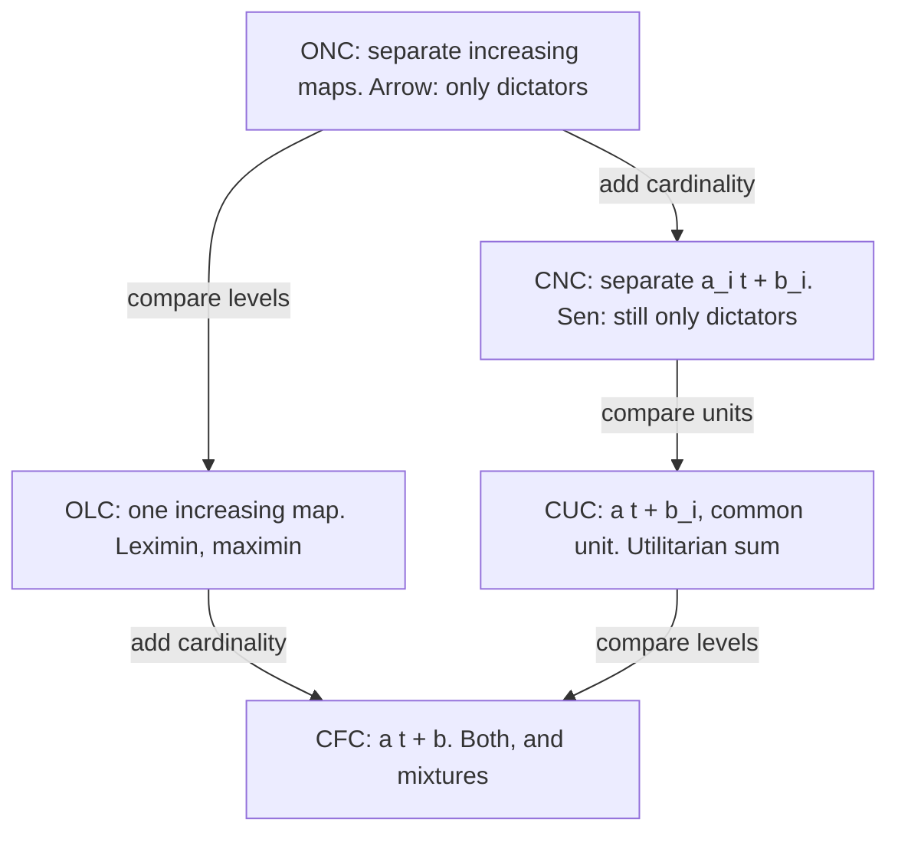

# Social Choice · Lesson 6.3: Utilities in, possibility out

> ⏱ ~15 min · Module 6: Richer inputs: approvals, grades and utilities · Builds on: [1.3 Arrow as a map](01-03-arrow-as-a-map.md), [6.2 Grading ballots: range voting and majority judgment](06-02-range-voting-and-majority-judgment.md), [`decision-theory` 5.2](../../decision-theory/lessons/05-02-interpersonal-comparison-and-social-welfare-functions.md) · Unlocks: [7.1 Quotas, Hamilton, and the paradoxes](07-01-quotas-hamilton-and-the-paradoxes.md)

## Why this matters

Arrow's rule saw only rankings. [6.1](06-01-approval-voting.md) and [6.2](06-02-range-voting-and-majority-judgment.md) added approvals and grades. Now give the rule everything: a number for each person at each alternative. Does that escape Arrow? Amartya Sen's answer is exact. Cardinal numbers alone do not. Numbers that can be **compared across people** do, and which comparisons you allow decides which rule you get. [`decision-theory` 5.2](../../decision-theory/lessons/05-02-interpersonal-comparison-and-social-welfare-functions.md) owns the comparability concepts and Diamond's objection. This lesson proves the social-choice half: why non-comparable utilities still force a dictator, and why comparable ones do not.

## The idea

A number carries information only if the rule is allowed to use it. Suppose your 7 and my 7 are on unrelated scales, and either of us could stretch or shift our own scale without changing any fact. Then a rule that respects those facts can use, on any pair $x, y$, only which way each of us leans. That is a ranking, and Arrow's theorem is about rankings. So the extra numbers buy nothing.

Once some cross-person statement becomes meaningful, Arrow's proof loses its grip. "You are worse off at $x$ than I am" is a level comparison. "Your gain from $y$ to $x$ is bigger than my loss" is a unit comparison. The first supports leximin, the second the utilitarian sum.

## The theorem

**Setup.** Voters $N = \{1, \dots, n\}$, $n \ge 2$; alternatives $A$, $|A| = m$. A **utility profile** $\mathbf u = (u_1, \dots, u_n)$ assigns each person a function $u_i : A \to \mathbb R$. A **[social welfare functional](../reference.md#social-welfare-functional)** (SWFL) $F$ maps each utility profile to a weak order $\succsim_{\mathbf u}$ on $A$ (Sen 1970, *Collective Choice and Social Welfare*). *In words:* a [social welfare function](../reference.md#social-welfare-function) whose ballots are numbers.

Arrow's conditions, restated for numbers (the form in List's SEP entry "Social Choice Theory"):

- **U:** $F$ is defined on every utility profile.
- **WP:** if $u_i(x) > u_i(y)$ for all $i$, then $x \succ_{\mathbf u} y$.
- **IIA:** if $u_i(x) = v_i(x)$ and $u_i(y) = v_i(y)$ for all $i$, then $\succsim_{\mathbf u}$ and $\succsim_{\mathbf v}$ rank $x$ against $y$ the same way. *In words:* the verdict on a pair depends only on the numbers at that pair.
- **ND:** no $d$ has $u_d(x) > u_d(y) \Rightarrow x \succ_{\mathbf u} y$ for every $\mathbf u$, $x$, $y$.

This IIA is *weaker* than [Arrow's](../reference.md#independence-of-irrelevant-alternatives): it holds the numbers fixed, not just the orders.

**[Invariance classes](../reference.md#invariance-classes).** An information assumption is a set $\Phi$ of transformations $\varphi = (\varphi_1, \dots, \varphi_n)$, and $F$ respects it if $F(\varphi \circ \mathbf u) = F(\mathbf u)$ for every $\varphi \in \Phi$. The five standard classes (Sen 1970 and 1977; full table in [`decision-theory` 5.2](../../decision-theory/lessons/05-02-interpersonal-comparison-and-social-welfare-functions.md)):

| Class | $\varphi_i(t)$ | Meaningful across people |
|---|---|---|
| ONC | any increasing $\varphi_i$, chosen separately | nothing |
| CNC | $a_i t + b_i$, each $a_i > 0$ separately | nothing |
| OLC | one increasing $\varphi$ for all | levels |
| CUC | $a t + b_i$, one $a > 0$ | units (gains and losses) |
| CFC | $a t + b$, one $a$, one $b$ | levels and units |

*In words:* the bigger the set of permitted transformations, the less information survives, and the stronger the demand that $F$ ignore it.

**Theorem 1 (Sen 1970).** If $m \ge 3$ and $F$ satisfies U, WP, IIA and CNC invariance, $F$ is dictatorial. Since CNC $\subseteq$ ONC, the same holds under ONC.

*In words:* making each person's utility cardinal (vNM, say) does not escape Arrow; only comparing people does.

**Lemma (two-point matching).** If $u_i(x) > u_i(y)$ and $v_i(x) > v_i(y)$, then $a = \frac{v_i(x) - v_i(y)}{u_i(x) - u_i(y)} > 0$ and $b = v_i(x) - a\,u_i(x)$ send $u_i(x) \mapsto v_i(x)$ and $u_i(y) \mapsto v_i(y)$. If $u_i(x) = u_i(y)$ and $v_i(x) = v_i(y)$, take $a = 1$, $b = v_i(x) - u_i(x)$.

*Proof of Theorem 1.*

1. *Only the orders on a pair matter.* Let $\mathbf u$, $\mathbf v$ give every person the same order on $\{x, y\}$. The lemma gives, person by person, $\varphi \in$ CNC with $\varphi_i(u_i(x)) = v_i(x)$ and $\varphi_i(u_i(y)) = v_i(y)$. Put $\mathbf w = \varphi \circ \mathbf u$. Invariance: $F(\mathbf w) = F(\mathbf u)$. IIA: $\mathbf w$ and $\mathbf v$ agree at $x$ and $y$, so $F(\mathbf w)$ and $F(\mathbf v)$ agree on $\{x, y\}$. Hence $F(\mathbf u)$ and $F(\mathbf v)$ agree on $\{x, y\}$.
2. *Build an Arrovian rule.* For a profile $\mathbf R$ of weak orders, let $\mathbf u^{\mathbf R}$ be any representation (e.g. $u_i(x)$ = number of alternatives $i$ ranks strictly below $x$) and set $G(\mathbf R) = F(\mathbf u^{\mathbf R})$. Two representations induce the same orders on every pair, so by step 1 they get the same social order on every pair: $G$ is well defined.
3. *$G$ meets Arrow's conditions.* U from U; WP from WP. IIA: if $\mathbf R$, $\mathbf R'$ agree on $\{x, y\}$, their representations induce the same orders there, so step 1 applies.
4. *Arrow.* With $m \ge 3$, [Arrow's theorem](../reference.md#arrows-theorem) ([1.3](01-03-arrow-as-a-map.md); weak-order ballots are Arrow's own setting) gives a dictator $d$ for $G$.
5. *Lift back.* If $u_d(x) > u_d(y)$, then $d$ strictly prefers $x$ in the profile $\mathbf R$ of orders induced by $\mathbf u$, so $x \succ_{G(\mathbf R)} y$, and $G(\mathbf R) = F(\mathbf u)$ by step 1. So $d$ dictates $F$. $\blacksquare$

CNC is used once, in step 1, and only through the fact that each $a_i$ is chosen separately.

**Theorem 2 (possibilities).** Both rules below satisfy U, WP, IIA and anonymity, hence ND.

- The **[utilitarian rule](../reference.md#utilitarian-rule)**, $x \succsim y \iff \sum_i u_i(x) \ge \sum_i u_i(y)$, respects CUC.
- **[Leximin](../reference.md#leximin)**, which compares the smallest utilities, then the second smallest if those tie, and so on, respects OLC.

*Proof.* Under CUC, $\sum_i (a u_i + b_i)(x) - \sum_i (a u_i + b_i)(y) = a\big(\sum_i u_i(x) - \sum_i u_i(y)\big)$, same sign since $a > 0$. A common increasing $\varphi$ commutes with sorting, $\text{sort}(\varphi(\mathbf v)) = \varphi(\text{sort}(\mathbf v))$, and preserves every comparison between $k$-th smallest values, so leximin's verdict is unchanged. IIA: both rules read only the numbers at $x$ and $y$. WP: if everyone gains, the sum rises and so does the $k$-th smallest value for each $k$. ND: give any person $d$ the values $(1, 0)$ at $(x, y)$, another person $(0, 2)$, everyone else $(0, 0)$. Both rules pick $y$ although $d$ prefers $x$, so no $d$ dictates. $\blacksquare$

The converses are characterizations, stated not proved: under CUC, adding anonymity and strong Pareto leaves only the sum (d'Aspremont and Gevers 1977); under OLC, an equity axiom yields leximin (Hammond 1976; d'Aspremont and Gevers 1977).

**Harsanyi as the bridge.** [`decision-theory` 5.1](../../decision-theory/lessons/05-01-harsanyis-aggregation-theorem.md) derives a weighted sum $\sum_i a_i u_i$ from Pareto indifference plus vNM rationality for each person and for society, with no IIA or invariance condition. It does not contradict Theorem 1. Each weight is tied to one representation of $u_i$: rescale $u_i$ by $c$ and the same social ranking needs weight $a_i / c$. Fixing the weights is a unit comparison. Harsanyi fixes the form (a weighted sum) once society is vNM-rational; Theorem 1 explains why fixed weights already embody a comparison between people.

**Where the argument is weakest.** In the invariance premise. CNC is not a fairness axiom about the rule; it is a claim that cross-person comparisons are *meaningless*. Deny it and Theorem 1 says nothing, as Theorem 2 shows; but then you owe a source for the comparisons ([`decision-theory` 5.2](../../decision-theory/lessons/05-02-interpersonal-comparison-and-social-welfare-functions.md)'s "Where the argument is weakest": extended preferences or a theory of well-being). Keep CNC and the remaining target is IIA. A rule that manufactures comparisons by normalizing each person's scale keeps CNC and drops IIA (Example 2).

## Picture

Moving down adds information and shrinks the set of permitted transformations. Every rule allowed at a node is allowed below it. The sum and leximin first coexist at CFC.

## Worked examples

**Example 1 (clean): numbers on top of a cycle.** Three people, three alternatives, $(u_1, u_2, u_3)$:

| | $u_1$ | $u_2$ | $u_3$ | sum | sorted |
|---|---|---|---|---|---|
| $x$ | 2 | 8 | 11 | 21 | (2, 8, 11) |
| $y$ | 5 | 6 | 7 | 18 | (5, 6, 7) |
| $z$ | 3 | 4 | 15 | 22 | (3, 4, 15) |

The induced orders are 1: y ≻ z ≻ x, 2: x ≻ y ≻ z, 3: z ≻ x ≻ y. Pairwise majorities: $x$ beats $y$, $y$ beats $z$, $z$ beats $x$, each 2–1: a [Condorcet cycle](../reference.md#condorcet-cycle). The numbers break it. Utilitarian: $z \succ x \succ y$ (22, 21, 18). Leximin: minima $y = 5$, $z = 3$, $x = 2$, so $y \succ z \succ x$.

Which verdict means anything depends on the class. Add 4 to person 1 (CUC): sums ($x$, $y$, $z$) 25, 22, 26 keep $z \succ x \succ y$, but the minima become 6, 6, 4, and the tie at 6 goes to $x$ on second-smallest values 8 against 7: leximin flips to $x \succ y \succ z$. Replace every number by its log (OLC): sums of logs compare products 176, 210, 180, so the sum flips to $y \succ z \succ x$, while leximin is unchanged. Each rule survives the transformation from its own class and fails the other's.

**Example 2 (hypothesis bites): normalizing each scale.** A tempting way to get comparability for free: rescale each person so her worst alternative scores 0 and her best 1, then add. This is the core of *relative utilitarianism* (Dhillon and Mertens 1999). It is also a range ballot ([6.2](06-02-range-voting-and-majority-judgment.md)) on which each voter gives her favorite the top grade, her least favorite the bottom, and the rest grades proportional to utility. Normalization undoes any $a_i t + b_i$, so the rule respects CNC. It is anonymous, so ND holds, and it satisfies WP. Theorem 1 then says it must break IIA. It does.

Two people. Profile $\mathbf u$: $x = (6, 0)$, $y = (2, 3)$, $z = (0, 6)$. Normalized: person 1 gives $x, y, z$ the values $1, \tfrac13, 0$; person 2 gives $0, \tfrac12, 1$. Sums: $x = 1$, $y = \tfrac56$, $z = 1$, so $x \succ y$ (with $z$ tied with $x$).

Profile $\mathbf v$: change only $z$ to $(12, 6)$. Person 1's range is now 2 to 12, so her values become $\tfrac25, 0, 1$; person 2's are unchanged. Sums: $x = \tfrac25$, $y = \tfrac12$, $z = 2$, so $y \succ x$.

Nobody's numbers at $x$ or $y$ moved, yet the verdict on $\{x, y\}$ flipped: IIA fails. The mechanism is visible. Person 1's normalized stake in $x$ over $y$ shrank from $\tfrac23$ to $\tfrac25$ because a dazzling $z$ stretched her scale, while person 2's stake in $y$ stayed $\tfrac12$. Normalization is a comparability convention, and it imports the feasible set into every pairwise verdict.

## Watch out

- **You might think cardinal utility escapes Arrow.** Under CNC the theorem survives intact (Theorem 1). Comparability, not cardinality, is the escape.
- **You might think the possibility results drop no hypothesis.** They drop one: invariance under CNC. A sum of raw numbers looks assumption-free until you notice that it changes verdicts when one person's unit is rescaled. Using it *asserts* unit comparability.
- **You might think the information class picks the rule.** It only says which rules are meaningful. Under CFC both the sum and leximin are, and choosing between them takes further axioms (Deschamps and Gevers 1978 characterize the pair; SEP).

## One-liner

> Numbers alone do not beat Arrow; comparisons do, and the comparison you grant (levels or units) decides whether you get leximin or the sum.

## Problems

**P1 (🟢) *(Formal (a)–(b).)*** Three people, utilities $(u_1, u_2, u_3)$: $x = (12, 2, 6)$, $y = (4, 9, 5)$, $z = (7, 6, 3)$.

(a) Find the utilitarian and the leximin rankings.

(b) Replace person 2's utilities by $a u_2 + b$ with $a > 0$, leaving the others alone. For exactly which $a$ is $y$ the strict utilitarian winner? Name the narrowest class in the table that contains all these transformations, and explain why no CUC transformation of the whole profile can make $y$ win.

**P2 (🟡) *(Formal (a) · Exegetical (b).)*** Same profile.

(a) Add a constant $c$ to person 2's utilities only. Find every $c$ for which $x$ is the strict leximin winner, and check what happens to the utilitarian ranking.

(b) For each rule (dictatorship of person 1, utilitarian sum, leximin), list the classes among ONC, CNC, OLC, CUC, CFC it respects, with a one-line reason per rule. Which row is Theorem 1 about?

**P3 (🔴, optional) *(Exegetical (diagnose).)*** An invented agency memo: "We rank projects by total willingness to pay in dollars. Dollars are cardinal and every resident's dollar counts the same, so our ranking satisfies Arrow's conditions with no dictator. Arrow's theorem simply does not bind cost-benefit analysis." In 120 words or fewer, say what the memo gets right, which phrase is doing the work, and what Theorem 1 says about the other phrase.

Solutions

**P1** *(Formal (a)–(b).)*

(a) Sums: $x = 20$, $y = 18$, $z = 16$, so utilitarian $x \succ y \succ z$. Sorted vectors: $x = (2, 6, 12)$, $y = (4, 5, 9)$, $z = (3, 6, 7)$. Minima 2, 4, 3, so leximin $y \succ z \succ x$.

(b) The $b$ adds to every sum and cancels. The sums are $x = 18 + 2a$, $y = 9 + 9a$, $z = 10 + 6a$.

$$\begin{aligned}
y - x &= 7a - 9 > 0 \iff a > \tfrac97,\\
y - z &= 3a - 1 > 0 \iff a > \tfrac13.
\end{aligned}$$

So $y$ is the strict winner exactly when $a > \tfrac97$. Example: $a = 2$, $b = 0$ gives sums 22, 27, 22. The narrowest class containing these transformations is CNC: one person is rescaled and shifted separately (they lie in ONC too, but not in OLC, CUC or CFC). No CUC transformation can make $y$ win, because by Theorem 2 the utilitarian ranking is invariant under CUC. Within this family, CUC allows only $a = 1$, and then the winner stays $x$.

**Wrong turns:** letting $b$ matter (it shifts all three sums equally). Checking only $y$ against $x$; here $y$ against $z$ is slack, but it must be checked.

---

**P2** *(Formal (a) · Exegetical (b), strict.)*

(a) The utilities become $x = (12, 2 + c, 6)$, $y = (4, 9 + c, 5)$, $z = (7, 6 + c, 3)$.

- If $c < 2$: $x$'s minimum is $2 + c$, and $y$'s minimum $\min(4, 9 + c)$ is strictly larger, so $y \succ x$ and $x$ does not win.
- If $c = 2$: sorted $x = (4, 6, 12)$, $y = (4, 5, 11)$, $z = (3, 7, 8)$. $x$ and $y$ tie at 4; $x$ wins on the second value, 6 against 5; $z$ is last. Leximin $x \succ y \succ z$.
- If $c > 2$: $x$'s minimum $\min(2 + c, 6)$ exceeds 4, $y$'s minimum is 4 and $z$'s is 3, so $x$ wins.

Answer: $c \ge 2$. The sums all shift by $c$, so the utilitarian ranking stays $x \succ y \succ z$.

**Must hit, strict (b):**

- Dictatorship of person 1: all five classes. It reads only person 1's own order, which every increasing $\varphi_1$ preserves.
- Utilitarian: CUC and CFC only. Separate units (ONC, CNC) or a nonlinear common $\varphi$ (OLC) can change the sign of a difference of sums (P1(b); Example 1's logs).
- Leximin: OLC and CFC only. Separate transformations can reorder levels across people (P2(a) is a CUC shift that flips it).
- Theorem 1 is about the first row: under CNC (or ONC) with U, WP and IIA, a dictatorship is the only option.

**Wrong turns:** answering $c > 2$ in (a): at $c = 2$ the tie at the minimum is broken by the second value, in $x$'s favor. Putting leximin in CUC because "it ignores magnitudes": it needs levels, and separate shifts move levels. Saying the dictator respects only ONC; a rule that respects a bigger class respects every smaller one.

---

**P3** *(Exegetical, strict.)*

**Must hit, strict:**

- Right: a sum over a common unit is a possibility under CUC (Theorem 2); Arrow's hypotheses are about ordinal, non-comparable inputs.
- The work is done by "every resident's dollar counts the same": that is a unit comparison, an assumption that a dollar measures the same welfare change for each person.
- "Dollars are cardinal" does nothing alone: Theorem 1 says cardinal but non-comparable data (CNC) still force a dictator.
- The theorem is not refuted; its invariance hypothesis is dropped, and the dropped premise is substantive.

**Wrong turns:** saying the memo violates IIA (a sum of numbers at $x$ and $y$ does not). Saying Arrow forbids cost-benefit analysis.

**Model answer:** The memo is right that adding a common unit escapes Arrow: the utilitarian sum satisfies U, WP, IIA and is not dictatorial once units are comparable. But cardinality is not what does it; Sen's theorem shows cardinal, non-comparable utilities still leave only dictatorship. The work is done by "every resident's dollar counts the same," which asserts that a dollar is the same welfare unit for a rich and a poor resident. That is unit comparability, a substantive premise the memo states as a bookkeeping fact. Arrow's theorem still binds anyone who rejects it.

## Flashback

**From Lesson [6.1](06-01-approval-voting.md) (Approval voting):** *(Formal (a)–(b).)* Seven voters rank A, B, C: 2: A ≻ B ≻ C, 4: B ≻ C ≻ A, 1: B ≻ A ≻ C. Every approval ballot is sincere and non-empty (a top segment of its voter's ranking).

(a) Find the Condorcet winner and the Condorcet loser. Give sincere ballots under which the Condorcet loser is the unique approval winner, with the scores.
(b) C beats the Condorcet loser head to head. Prove, in three sentences or fewer, that no profile of sincere ballots makes C the unique winner. Then say in one sentence which candidates sincere approval voting can elect uniquely, on any profile.

Solution

**Accept (a):** any sincere ballots that give A a strictly higher score than B and C; the model answer uses 6.1's Proposition 3 construction.

(a) $n(B, A) = 5$ against 2 and $n(B, C) = 7$ against 0, so **B is the Condorcet winner** (and the first choice of 5 of 7). $n(C, A) = 4$ against 3, so A loses both contests: **A is the Condorcet loser**.

No candidate is ranked above A by every voter (the two A-first voters rank A above both rivals), so 6.1's Proposition 3 applies. Approve everything at or above A: the A ≻ B ≻ C voters approve {A}, the B ≻ C ≻ A voters {A, B, C}, the B ≻ A ≻ C voter {A, B}. Scores: **A 7**, B 5, C 4. A wins alone, with every ballot sincere.

(b) Every voter ranks B above C. A sincere ballot containing C contains everything its voter ranks above C, so it contains B. Hence $s(B) \ge s(C)$ in every sincere profile, and C is at best tied with B. ∎

Together with 6.1's Proposition 3: on any profile of strict rankings, a candidate is the unique winner of some sincere ballot profile **if and only if no rival is ranked above it by every voter**. Head-to-head strength plays no role: the Condorcet loser A can win, while C, which beats A, can only tie (for instance when everyone approves everything).

**Wrong turns:** concluding that A cannot win because it loses every pairwise contest; sincerity constrains only where each voter's line falls, not the totals. Arguing that C cannot win because it is nobody's first choice: a candidate first for nobody can still win sincerely if no rival is above it on every ballot. The reason is the Pareto domination by B.

## Connections

- **Backward:** [1.3](01-03-arrow-as-a-map.md) placed "richer input" on the map of escape routes; Theorem 1 shows that cardinal input alone lands back on Arrow, and [2.1](02-01-scoring-rules.md)'s Borda count read intensity from positions the way the sum reads it from numbers. Example 2 is [6.2](06-02-range-voting-and-majority-judgment.md)'s range voting seen as an information convention.
- **Forward:** [7.1](07-01-quotas-hamilton-and-the-paradoxes.md) leaves preference aggregation for seat allocation, where the numbers (populations) are comparable by construction and the trouble is rounding.
- **Sideways:** [`decision-theory` 5.1](../../decision-theory/lessons/05-01-harsanyis-aggregation-theorem.md) and [5.2](../../decision-theory/lessons/05-02-interpersonal-comparison-and-social-welfare-functions.md) own Harsanyi and the comparability classes; [`grad-micro` 6.5](../../grad-micro/lessons/06-05-social-choice-welfare.md) and [`public-economics` 5.1](../../public-economics/lessons/05-01-the-linear-income-tax.md) use the sum and maximin as optimization objects; [`political-philosophy` 2.3](../../political-philosophy/lessons/02-03-rawls-the-two-principles-and-maximin.md) argues over maximin as justice; [`philosophy-of-economics` 3.2](../../philosophy-of-economics/lessons/03-02-the-limits-of-pareto-and-the-compensation-tests.md) shows that summed willingness to pay counts every dollar equally, the premise P3 diagnoses.
