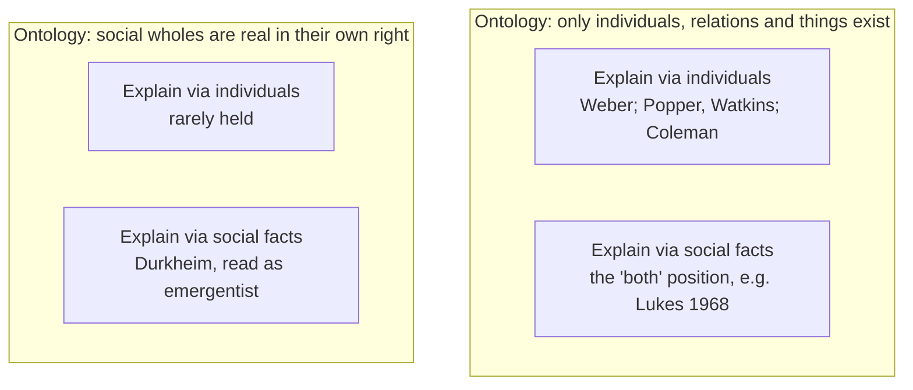

# Social Theory · Lesson 1.1: Individuals and social facts

> ⏱ ~15 min · Module 1: What a social explanation is · Builds on: [`philosophical-method` 4.3 Finding the crux](../../philosophical-method/lessons/04-03-finding-the-crux.md) · Unlocks: [1.2 Functional explanation and its critics](01-02-functional-explanation-and-its-critics.md), [1.3 Understanding: Weber's interpretive method](01-03-understanding-webers-interpretive-method.md)

## Why this matters

On 9 March 2023, depositors pulled over 40 billion dollars out of Silicon Valley Bank, and regulators closed it the next day. Why? One answer: each depositor withdrew because they expected the others to. Another: the bank's structure made it fragile, so it was a run waiting to happen. These two answers locate the cause in different places. Every theorist in this course makes that same bet, Marx and Durkheim on wholes and Weber and Coleman on individuals. This lesson gives you the vocabulary for spotting the bet. Its main point is that "individualism vs holism" packs two separate questions into one phrase.

## The idea

Start with Durkheim's own examples (*Les règles de la méthode sociologique*, 1895, ch. 1). When I speak French, pay in legal money, or keep a contract, I am using things I did not make. They existed before me and will outlast me. That is **externality**. Nothing obliges me to speak French to my compatriots, Durkheim says, but if I try not to, the attempt fails miserably. That is **constraint**. Usually I don't feel it, because I go along willingly; it shows itself when I resist. Durkheim calls such ways of acting, thinking and feeling **[social facts](../reference.md#social-facts)**, and he claims them as sociology's own subject matter, belonging neither to biology nor to psychology.

His sharpest examples are rates. A society's marriage, birth or suicide rate pools every individual case, so the private circumstances cancel out. What remains, he says, expresses a state of the group. Lesson [3.2](03-02-suicide.md) puts that claim to work.

Against him stands **[methodological individualism](../reference.md#methodological-individualism)**. Its classic statement is Weber's, in *Wirtschaft und Gesellschaft* (1922), ch. 1, §1. Lawyers may treat a state or a company as a person, but for interpretive sociology such formations are

> merely processes and connections of the specific action of individual persons, since these alone are for us intelligible bearers of meaningfully oriented action. (my translation)

For sociology there is no "acting" collective personality, Weber adds. Schumpeter coined the label in 1908. In the mid-twentieth century Karl Popper and his student J. W. N. Watkins defended the doctrine, and Watkins demanded that every explanation reach a "rock-bottom" of individuals' dispositions and beliefs. **[Holism](../reference.md#holism)** denies that: social wholes have properties and powers of their own, and an explanation may run from one social fact to another.

Here is the key move. "Is society more than individuals?" is really **two questions** ([ontological and explanatory individualism](../reference.md#ontological-and-explanatory-individualism)):

- **Ontological:** *what exists?* The ontological individualist says society contains nothing beyond people, their relations, and the material stuff they use. There is no group mind.
- **Explanatory:** *what must a good explanation cite?* The explanatory individualist says every adequate explanation of a social fact bottoms out in facts about individuals. The explanatory holist says some good explanations cite social facts that cannot be eliminated.

Steven Lukes, in "Methodological Individualism Reconsidered" (*British Journal of Sociology*, 1968), argued that the doctrine is either a truism or too strong. It is a truism if it means only that society consists of people. It is too strong if it means explanations may use only individual-level predicates, because explaining what individuals do constantly requires social predicates like *cashier*, *voter* and *debtor*. That leaves room for a "both" position: individualist about what exists, holist about what explains.

A physics analogy shows the position is coherent. A gas is nothing but molecules, yet the gas laws explain with temperature and pressure, and countless molecular arrangements realize the same macrostate. Whether societies resemble gases in this respect is the general question of reduction and emergence, owned by [`philosophy-of-science`](../../philosophy-of-science/syllabus.md) 4.5.

## Source

Durkheim closes *Rules* ch. 1 with his definition (7th ed., 1919, which reprints the revised second edition):

> A social fact is every way of acting, fixed or not, capable of exerting an external constraint on the individual; or again, every way of acting which is general throughout a given society while having an existence of its own, independent of its individual manifestations. (my translation)

Four phrases do the work:

- **"fixed or not"** admits unorganized currents, such as a crowd's sudden indignation or a fashion, alongside codified law.
- **"capable of"** makes constraint a disposition. It need not be felt, only felt on resistance.
- **"or again"** offers a second test, generality plus independent existence. Durkheim explains why the generality is not the defining mark: a social fact is in each part because it is in the whole, not in the whole because it is in the parts.
- **"independent of its individual manifestations"** is where holism enters. The French language is not the sum of anyone's utterances.

Note what the definition does *not* say. It does not say society is a substance apart from people. The preface to the second edition insists that social facts are "things" in the sense that they must be known from outside, like physical things, not in the sense that they are material.

## The argument

Durkheim's case for explanatory holism (*Rules* chs. 1 and 5), reconstructed. This is an **exegetical** reconstruction.

1. **Social facts exist.** Law, language, money, moral rules and rates are external to each individual and constrain him. *In words:* there is a class of facts that no one person makes and that everyone runs into.
2. **They are neither organic nor psychological.** They consist of representations and actions, so they are not biology. They exist outside any single consciousness, so they are not individual psychology.
3. **They arise from association.** Nothing collective happens without individual minds, but individual minds are a necessary condition, not a sufficient one. The minds must be combined in a certain way, and the combination has properties its elements lack. *In words:* the parts are individuals, but what matters is how they are put together.
4. **An explanation must cite what produces the thing explained.**
5. **∴** Hence Durkheim's rule in ch. 5:

> The determining cause of a social fact must be sought among antecedent social facts, and not among the states of individual consciousness. (my translation)

**What kind of explanation is this?** It is explanatory holism. Ontologically it is closer to emergentism than to a belief in a group soul. In a footnote to ch. 5, Durkheim says there is no need to hypostasize the collective conscience. Whether he consistently keeps to that is a live interpretive question.

**The individualist reply.** Weber concedes the causal power that Durkheim points to, but he relocates it. The modern state exists largely because real people orient their action to the idea that it exists and ought to. Constraint becomes each person's expectations about everyone else. Coleman's macro-to-micro-to-macro "boat" ([6.2](06-02-rational-choice-sociology.md)) is the modern form of this reply.

**Where the argument is weakest.** The step from 3 to 5. A critic grants that social facts arise from combination and denies that the combination must be cited *as a social fact*. A model of interacting individuals explains the combination, so on this view the causes are individuals after all. The holist's rejoinder is Lukes's: the individualist's models quietly take social facts as given. A coordination model of language assumes the speakers already have the concept "French"; a bank-run model assumes a deposit contract. So the crux is whether the individualist's explanans can ever be stated without social predicates.

## Map of positions

The two rows answer *what exists*. The two columns answer *what explains*. Durkheim sits on the border between the rows, because he denies a group mind but calls society a reality of its own kind (*sui generis*). The map is the course's **[kinds of social explanation](../reference.md#kinds-of-social-explanation)** grid in its first form. 1.2 and 1.3 add functional and interpretive explanation.

## Worked examples

**Example 1 (Durkheim's own case: money).** Take legal tender in 1890s France and run the two tests.

- **Externality.** The franc's value and legal status were fixed by law, and in use, long before most of its users were born. No individual's use of the franc makes it money.
- **Constraint.** Nothing obliged you to pay in francs, as Durkheim says. But try paying a creditor in shells and the payment simply fails. This is the *indirect* constraint Durkheim distinguishes from legal sanction.
- **Second test.** Coins were in general use across France, and the monetary system had an existence of its own, independent of any one payment.

Both kinds of explanation can now get to work. An individualist explains why each person accepts francs: each expects others to accept them. A holist explains the monetary order by prior social facts, such as the state's legal and fiscal institutions. Neither explanation needs a group mind.

**Example 2 (hard case: the Silicon Valley Bank run).** The Federal Reserve's review (April 2023) reports over 40 billion dollars of outflows on 9 March 2023. Management expected over 100 billion more the next day, together roughly 85 percent of deposits. About 94 percent of deposits had been uninsured at the end of 2022. The review blames correlated withdrawals by a concentrated network of venture investors and technology firms, "fueled by social media."

- **Individualist explanation.** In Diamond and Dybvig's model (*Journal of Political Economy*, 1983), a run is an equilibrium of individual choices. If I expect others to withdraw, withdrawing first is my best response. The run is depositors' beliefs, coordinated.
- **Holist explanation.** The run's likelihood was a property of the bank's structure. An uninsured, concentrated deposit base and losses on its securities belong to no single depositor, and the same structure would have produced a run with different people in the seats.

Where it strains: **the dispute is not ontological**. Nobody thinks SVB had a mind. It is explanatory, and it turns on Lukes's point. The individualist model's parameters include the deposit contract, the insurance limit and the network's density, and those are social facts. Whether that makes the model "really" holist is the crux, and it is exegetical before it is evaluative. The evidence side, meaning what comparison of banks would tell the two explanations apart, is [1.4](01-04-testing-a-social-explanation.md)'s job.

## Watch out

- **You might think** holism means believing in a group mind. **But actually** explanatory holism is compatible with ontological individualism, and Durkheim himself refuses to hypostasize the collective conscience. Check which question a claim answers before you label it.
- **You might think** an explanation is holist because it talks about many people, or individualist because it mentions persons. **But actually** what counts is what the explanans cites. A rate pooling ten thousand acts, explained by group integration, is holist. A single bank run explained by depositors' beliefs is individualist.
- **You might think** "methodological individualism" is a political creed, and that "constraint" is a complaint. **But actually** both are claims about explanation. Durkheim notes that social constraint does not necessarily exclude individual personality, so saying a norm constrains is an exegetical or explanatory claim. Whether it *should* constrain is evaluative, and that question belongs to [`political-philosophy`](../../political-philosophy/syllabus.md). Tocqueville's "individualism", a calm withdrawal into private life ([`history-of-political-thought` 6.2](../../history-of-political-thought/lessons/06-02-tocqueville-equality-of-conditions.md)), is a third thing again.

## One-liner

> "Is society more than individuals?" splits in two: what exists, and what explains. You can say "only people" to the first and still need social facts for the second.

## Problems

**P1 (🟢) *(Exegetical.)*** From an invented column in a regional paper, on why a valley town's volunteer fire brigade has shrunk:

> "(i) Each young resident, weighing an unpaid night on call against a paid shift, sensibly takes the shift. (ii) But volunteering here was never anyone's decision: it was a duty you inherited, enforced by the looks you got at church if you skipped drills, and that duty has dissolved. (iii) Let's be clear, there is no such thing as 'the community', only the people who live here. (iv) Towns that lose their factory lose their brigade, whatever any one person decides."

(a) For each sentence, say whether it is an ontological or an explanatory claim, and whether it is individualist or holist. (b) The columnist thinks (iii) contradicts (ii). Does it? Two sentences or fewer for (b).

**P2 (🟡) *(Exegetical (a) · Evaluative (b).)*** At 05:00 on 3 September 1967 ("Dagen H"), Sweden switched from left-hand to right-hand traffic. In a 1955 referendum, 83 percent of voters had chosen to keep driving on the left. Parliament decided on the switch anyway in 1963. The reasons were that Sweden's neighbours already drove on the right and most Swedish cars were left-hand-drive. Two analysts explain why Swedes have driven on the right ever since.

> **A:** Each driver expects every other driver to keep right, and given that expectation, keeping right is each driver's best response. The 1967 law mattered only because it shifted expectations all at once. The explanation bottoms out in individuals' beliefs and preferences.
>
> **B:** I agree there is nothing here but drivers, cars, roads and officials. But the explanation is the traffic rule, a social fact imposed against what most voters had said they wanted and backed by sanctions, together with the antecedent social facts that prompted it.

(a) A and B agree about one of the two questions in this lesson. Which one? Then name their crux, and state it as a conditional that each would sign. (b) A critic says the referendum refutes A, because most Swedes preferred the left. Does it? Any verdict. 100 words or fewer.

Solutions

**P1** *(Exegetical, strict.)*

(a)

**Accept:** for (ii), "holist" or "holist explanans with an individual-level enforcement mechanism". The explanans must be identified as the duty, not the looks.

**Must hit, strict (a):**

- (i) explanatory, individualist. It explains by individual choices given incentives.
- (ii) explanatory, holist. It explains by an inherited duty that no one decided on and that was external and constraining, a social fact in Durkheim's sense. Sanctions running through individuals are how the constraint works, not what does the explaining.
- (iii) ontological, individualist. It says what exists and explains nothing.
- (iv) explanatory, holist. One social fact (losing the factory) explains another (losing the brigade), "whatever any one person decides", which is Durkheim's rule.

**Must hit, strict (b):** No. Ontological individualism is compatible with explanatory holism, the "both" position. The duty in (ii) can be a pattern among people that still does explanatory work. (iii) would contradict (ii) only if (ii) posited a group mind, and it does not.

**Wrong turns:** calling (i) holist because it is about "each young resident", meaning many people. Calling (iii) explanatory. Saying (iii) refutes (ii), which collapses the two questions.

**Model answer:** (a) (i) explanatory, individualist. (ii) explanatory, holist: an inherited, constraining duty is the cause. (iii) ontological, individualist. (iv) explanatory, holist: social fact to social fact. (b) No. (iii) is about what exists and (ii) about what explains, and a duty can be nothing over and above people's expectations and sanctions while still being what explains the decline.

---

**P2** *(Exegetical (a) · Evaluative (b).)*

**Must hit, strict (a):**

- They agree on **ontology**: both are ontological individualists (B says so explicitly). The dispute is **explanatory**.
- **Crux:** whether A's explanans can be stated without social predicates. Can the drivers' expectations, and the law's power to shift them, be specified as facts about individuals alone? Or must they cite the traffic rule as a rule, with authority and sanctions, which is a social fact?
- **Conditional:** "If the expectations and the law's effect can be fully specified in individual terms (beliefs about what others will do, officials' dispositions to fine), the explanation is individualist and B should concede. If specifying them requires citing the rule as a social fact, A should concede that a social fact does explanatory work."

**Must hit, any verdict (b):**

- Separate **preferences over rules** from **best responses given others' behaviour**. Preferring the left is consistent with keeping right once everyone else does.
- Say what the referendum does bear on: why the switch needed a collective decision, not why compliance followed.
- Reach a verdict on whether it refutes A.

**Wrong turns:** in (a), naming the crux as "whether society exists", which they already agree on. Treating "the law caused it" as automatically holist: A's point is that the law works through expectations. In (b), reading the 83 percent as drivers' behaviour rather than voters' stated preference.

**Model answer (a):** They agree on what exists, so the dispute is explanatory. Crux: can "every driver expects others to keep right because the law now says so" be cashed out entirely in facts about individuals, or does "the law says so" cite a rule whose authority is a social fact? If the expectations reduce to beliefs about individuals' behaviour and officials' dispositions, B should accept A's explanation as complete. If they cannot be stated without the rule, A should grant that a social fact explains.

**Model answer (b), one of several:** It does not refute A. A explains compliance as a best response *given* others' behaviour, and a driver who preferred the left in 1955 still does best keeping right when everyone else does. That is exactly the gap between preferences over conventions and choices within one. The referendum is better evidence for a narrower point that suits B: the switch could not have come from individual choices alone, because no driver gains by switching first. It took a collective decision, a social fact, to move everyone at once. Whether that decision reduces to legislators' individual votes reopens the crux.

## Connections

- **Backward:** Finding the crux and stating it as a conditional is [`philosophical-method` 4.3](../../philosophical-method/lessons/04-03-finding-the-crux.md). Telling a substantive dispute from a merely verbal one, which "individualism vs holism" often half is, is [3.2](../../philosophical-method/lessons/03-02-distinctions-and-verbal-disputes.md) there.
- **Forward:** [1.2](01-02-functional-explanation-and-its-critics.md) takes up the other half of Durkheim's ch. 5, the rule that a social fact's *function* must also be sought in social ends. [1.3](01-03-understanding-webers-interpretive-method.md) develops Weber's interpretive individualism. [1.4](01-04-testing-a-social-explanation.md) asks what evidence separates rival explanations, including the trap of inferring individual acts from group rates. [3.2](03-02-suicide.md) is Durkheim's rates put to work, and [6.2](06-02-rational-choice-sociology.md) is the individualist program at full strength.
- **Sideways:** A run and a common currency are coordination games with several equilibria, which is the individualist's formal tool ([`game-theory-refresher` 1.2](../../game-theory-refresher/lessons/01-02-nash-equilibrium.md)). Reduction, multiple realizability and emergence in general are [`philosophy-of-science`](../../philosophy-of-science/syllabus.md) 4.5, which cites this lesson for the social case.
