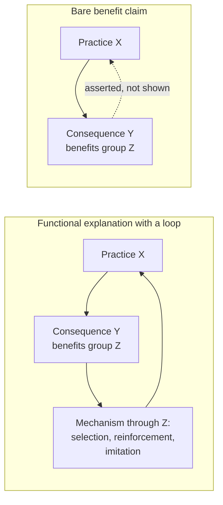

# Social Theory · Lesson 1.2: Functional explanation and its critics

> ⏱ ~15 min · Module 1: What a social explanation is · Builds on: [1.1 Individuals and social facts](01-01-individuals-and-social-facts.md) · Unlocks: [1.3 Understanding: Weber's interpretive method](01-03-understanding-webers-interpretive-method.md), [1.4 Testing a social explanation](01-04-testing-a-social-explanation.md)

## Why this matters

"It exists because it serves a purpose" is the most tempting sentence in social science. Rituals hold groups together, inequality draws talent to hard jobs, the state keeps capitalism running, crime keeps morality flexible. Each names a benefit, real or plausible. Few say how the benefit loops back to explain why the practice exists in the first place. This lesson gives you the test that tells a [functional explanation](../reference.md#functional-explanation) from a benefit claim dressed up as one. You will run it on Marx (2.1), on Durkheim (Module 3) and on social capital (Module 6). Economists know the legitimate version as the selection argument for profit maximization; biologists know it as natural selection.

## The idea

**Cause versus function.** A causal explanation runs forward: conditions before X produce X. A functional explanation runs the other way and explains X by what X *does*, its consequence Y for some group. That looks backward, since Y comes after X. Biology shows how it can work. "The heart is there to pump blood" is a good explanation because there is a loop: ancestors whose hearts pumped well left more descendants, so the consequence (circulation) explains why hearts like that persist. Take the loop away and you have only noticed that hearts are useful.

**Merton's tools.** Robert K. Merton (*Social Theory and Social Structure*, 1949; revised 1957 and 1968) gave sociology its working vocabulary, here paraphrased:

- **[Manifest and latent functions](../reference.md#manifest-and-latent-functions).** Manifest functions are consequences the participants intend and recognize; latent functions are neither intended nor recognized. His example is the Hopi rain ceremony. Its manifest function is to bring rain, which it does not do. Its latent function is to reinforce group identity by giving scattered members a regular occasion to gather and act together. Latent functions are meant to explain why practices whose stated purpose fails keep going.
- **Dysfunctions and "for whom".** A practice can serve one group and harm another, so "X is functional" is incomplete until you say for whom.
- **[Functional equivalents](../reference.md#functional-equivalents).** Merton rejected the assumption that every surviving practice is indispensable. Other arrangements could often meet the same need. If they could, the need alone cannot explain why *this* practice exists rather than one of its rivals.

**Durkheim's two claims.** In *The Rules of Sociological Method* (1895), Durkheim argued that crime is *normal*: found in every society of every type, and impossible to abolish, because people never share the collective sentiments with perfect uniformity. He went further and called it *useful*. A society whose moral sentiments were strong enough to stamp out all crime would also be too rigid to change. Socrates was a criminal under Athenian law, yet his independence of thought helped prepare the morality Athens came to need (ch. 3, paraphrased). Two chapters later Durkheim gives punishment a function as well: punishment is caused by the intensity of the sentiments a crime offends, and it in turn keeps those sentiments at full strength (ch. 5).

**Four answers to "why does X exist?"**

| Answer | Shape | Example |
|---|---|---|
| Causal | earlier conditions produce X | a famine produces migration |
| Intentional | people adopt X because they *expect* Y | a firm adopts piece rates to raise output |
| Functional | unintended Y keeps X going through a loop | firms that fail to maximize profit shrink and exit, so the survivors behave as if they maximize |
| Bare benefit claim | Y is good for group Z, *therefore* X | "the ritual survives because it unites the village" |

The last row is the disguised one. It sounds like the third but never shows the loop.

## Source

Durkheim, *Les règles de la méthode sociologique*, ch. 5 (7th ed., 1919; my translation):

> When, then, one undertakes to explain a social phenomenon, one must seek separately the efficient cause that produces it and the function it fulfils. We use the word function in preference to end or purpose precisely because social phenomena do not generally exist for the sake of the useful results they produce. What must be determined is whether there is a correspondence between the fact under consideration and the general needs of the social organism, and in what this correspondence consists, without asking whether it was intentional or not. […] If the usefulness of the fact is not what makes it exist, it must generally be useful in order to maintain itself.

Read it in three moves (exegetical):

1. **Two questions, kept apart.** Cause and function are separate inquiries, and in the same chapter Durkheim says to find the cause first. So the founder of functional analysis denies that function explains origin.
2. **"Function", not "end".** The word is chosen to strip out purpose: social facts do not exist *for the sake of* their results. Intention is set aside as too subjective to study.
3. **The persistence claim.** The last sentence brings function back into the explanation by another door. Usefulness doesn't create a practice, he says, but it keeps it alive. His grounds, a page later: a useless practice costs without returning anything, and if most social facts were like that "the budget of the organism" would be in deficit. That is an analogy with an organism, not a mechanism. Nothing yet says *what* removes a costly practice from a society.

## The argument

Jon Elster's critique (pressed against Marxist functionalism in "Marxism, Functionalism, and Game Theory", *Theory and Society*, 1982), reconstructed and paraphrased.

1. A functional explanation explains a practice X by a consequence Y of X that benefits a group Z.
2. Y occurs after X. A later event can explain an earlier one only if Y causally contributes to X's continuing or recurring: a **[feedback mechanism](../reference.md#feedback-mechanism)** running through Z.
3. If members of Z keep X going *because they foresee* Y, the explanation is intentional, not functional: their beliefs and desires do the explaining.
   *In words:* a benefit someone aims at explains through that person's aim, and the aim is what you have to show.
4. So a functional explanation proper needs Y to be unintended and unrecognized (Merton's latent function) and a loop that runs through no one's foresight: selection of organisms, firms or groups, unintended reinforcement, or imitation of whoever happens to succeed.
5. Such loops are well established in biology and sometimes in markets (competition weeding out firms that fail to maximize profit). Most sociological functional explanations establish the benefit in P1 but not the loop in P2.
6. ∴ Those explanations are incomplete. Either repair them by naming and testing the loop, or reject them.

Elster's conditions in summary: Y is an effect of X; Y benefits Z; Y is unintended by those who produce X; Y, or at least the link from X to Y, goes unrecognized by Z; and Y maintains X through a causal loop passing through Z.

**What kind of argument this is.** In 1.1's terms, Elster is an *explanatory* individualist ([methodological individualism](../reference.md#methodological-individualism)): the loop must run through what individuals do. Durkheim's and Merton's analyses are holist: their beneficiary is "the social organism" or the system. The dispute is about explanation, not about what exists. Elster need not deny that societies have needs; he denies that naming a need explains anything. His critique is a *methodological* claim. Whether a particular loop actually operates is an *empirical* question for 1.4.

G. A. Cohen defended functional explanation in Marx (*Karl Marx's Theory of History: A Defence*, 1978) without requiring the mechanism in advance; [2.1](02-01-historical-materialism.md) teaches his version.

**Where the argument is weakest.** The step from P5 to C. Cohen's reply is that a functional explanation can be well confirmed before anyone knows the loop. If we find a *consequence law* (whenever X would benefit Z, X tends to appear), we have reason to believe some loop exists, just as a naturalist could know that a useful trait is there because it is useful while still unsure whether the mechanism is Darwinian or Lamarckian. On this view a missing mechanism makes an explanation unfinished, not illegitimate. Elster replies that real consequence laws are rare in social science and easy to fake by citing only the cases that fit. That turns the dispute into a question about evidence: what comparison would show the law holds ([1.4](01-04-testing-a-social-explanation.md))?

## The explanation

The two panels share their first arrow; every benefit claim has it. What makes the left panel an explanation is the return path, and that path is an empirical hypothesis you can test.

## Worked examples

**Example 1: Durkheim on punishment, a loop named.** The causal arrow comes first: a crime offends strong collective sentiments, and the offended sentiments produce punishment. Then the function: punishment keeps those sentiments from weakening, since offenses left unpunished would sap them (*Rules* ch. 5). Check the loop. Sentiments produce punishment, punishment sustains sentiments, sustained sentiments produce the next punishment. That is a closed return path, so the account has the shape the left panel asks for. What it still owes is evidence. Do moral sentiments in fact weaken where offenses go unpunished? And is the return path unintended? Judges and legislators often *say* they punish to uphold shared norms. If they do it for that reason, the account becomes partly intentional. Verdict on the form, not the facts: legitimate in shape, open to test.

**Example 2: Merton's political machine, where the label strains.** Merton asked why the American urban machine survived decades of reformers' attacks. His answer, paraphrased: it met needs that legitimate structures left unmet. It gave the poor personal help (jobs, intercession, relief without humiliation), gave business predictable access to government, gave immigrant groups shut out of conventional careers a ladder of mobility, and shielded illegal businesses. His practical moral was that abolishing a machine without supplying functional equivalents invites something like it to return.

Run Elster's conditions. The benefits are effects (1) and they serve groups (2). But (3) and (4) fail for most of them. Voters knew they were trading votes for help, and businessmen knew what they were buying. The loop runs through *recognized* exchange, which makes this an intentional, rational-choice explanation (6.2's kind), not a latent-function one. The functions were latent mainly *to the reformers*. That doesn't damage Merton's empirical analysis; it relabels it. His equivalence thesis yields a testable prediction: where public welfare and a merit civil service take over the machine's services, machines should weaken. Testing that is a comparison across cities, not a matter of definition.

## Watch out

- **You might think** that showing a practice benefits a group explains why it exists, **but actually** the benefit comes afterward and explains nothing until you show the return path. "If it didn't pay its way it would have died out" assumes a selection mechanism rather than demonstrating one.
- **You might think** a latent function is a hidden purpose that some insider pursues, **but actually** it is neither intended nor recognized. Once someone pursues the benefit, you have an intentional explanation, which is good but different and has to be checked against what people actually aimed at.
- **You might think** calling crime "normal" or "useful" endorses it, **but actually** Durkheim says in a footnote that it does not follow that crime should not be hated, any more than pain, which is also normal and useful. Saying a practice has a function is an explanatory claim, not an evaluative one. Whether the practice is *good* is a separate question with its own owners.

## One-liner

> A benefit explains nothing until you can show how it keeps the practice alive; find that loop, or you have only praised the practice.

## Problems

**P1 (🟢) *(Exegetical (a)-(b).)*** Close reading. Durkheim, *Les règles de la méthode sociologique*, ch. 3 (7th ed., 1919; my translation):

> In the first place, crime is normal because a society exempt from it is entirely impossible. […] Thus, since there cannot be a society in which individuals do not diverge more or less from the collective type, it is also inevitable that among these divergences some present a criminal character. For what confers this character on them is not their intrinsic importance but the importance the common conscience lends them. […] Crime is therefore necessary; it is bound up with the fundamental conditions of all social life, but for that very reason it is useful; for the conditions with which it is bound up are themselves indispensable to the normal evolution of morality and law.

(a) According to the passage, what explains the fact that every society has crime: its usefulness, or something else? Name the words that decide it. Two sentences. (b) Does the passage need Elster's feedback condition to be met? Answer in two sentences, using the Source rule from ch. 5.

**P2 (🟡) *(Exegetical (a)-(b).)*** Diagnose. An **invented** memo from the personnel office of a regional hospital network, not the words of any real person or organization:

> (i) "Our seniority-based pay scale has lasted forty years. (ii) It survives because it keeps experienced nurses from leaving; a practice that didn't pay its way would have been dropped long ago. (iii) Its real function, which nobody designed, is to reward loyalty. (iv) So there is no need to review it."

(a) Which sentence offers a functional explanation, and which of Elster's conditions does it assume rather than show? Which sentence slides from explanation to evaluation? One line each. (b) Name two different mechanisms that could make (ii) true. For each, say whether it would make the explanation functional or intentional, what it implies for (iii), and one piece of evidence that would tell. 100 words or fewer.

**P3 (🔴, optional) *(Exegetical (a) · Evaluative (b).)*** Repair or reject. Kingsley Davis and Wilbert Moore ("Some Principles of Stratification", *American Sociological Review*, 1945) argued, paraphrased, that unequal rewards are found in every society because a society must induce its most qualified members to fill its most important positions, and that inequality is a device societies evolved for this without anyone designing it. (a) Which of Elster's conditions does their claim assert, and which does it not establish? One or two sentences. (b) Repair the explanation by supplying a feedback mechanism and saying what evidence would test it, or reject it and say why no loop is available. 150 words or fewer. Any verdict passes.

Solutions

**P1** *(Exegetical (a)-(b), strict)*

**Must hit, strict (a):**

- What explains crime's existence is its *necessity*: individuals inevitably diverge from the collective type, and the common conscience labels some divergences criminal. That is a causal explanation from the conditions of social life.
- The deciding words are "Crime is therefore necessary … but for that very reason it is useful". Usefulness is derived *from* necessity; it is not offered as the reason crime exists.

**Must hit, strict (b):**

- No. The passage does not explain crime by its usefulness, so there is no functional explanation of crime's existence that would need a loop. It answers ch. 5's two separate questions: a cause (inevitable divergence plus the conscience's labeling) and, separately, a function (keeping morality plastic).
- Elster's condition bites only if usefulness is made to explain persistence, as in ch. 5's last sentence. This passage doesn't do that.

**Wrong turns:** reading "useful" as the explanation of crime, which reverses "for that very reason"; calling the passage an apology for crime, which is an evaluative reading Durkheim explicitly disowns.

---

**P2** *(Exegetical (a)-(b), strict)*

**Must hit, strict (a):**

- (ii) is the functional explanation. It assumes the feedback condition: "would have been dropped long ago" presupposes a mechanism that eliminates practices that don't pay, without naming or showing it.
- (iv) slides from explanation to evaluation: even if the scale survives *because* it retains nurses, it does not follow that it is the best option. Functional equivalents might do the same job more cheaply, and the scale may be dysfunctional for someone, such as able junior staff.

**Must hit, strict (b):**

- **Intentional:** managers review the scale and keep it because they believe it retains staff. That makes the explanation intentional, and (iii)'s "nobody designed" is then false. Evidence: review records and managers' stated reasons.
- **Functional (selection or imitation):** networks without seniority pay lost experienced nurses, did worse, and closed, were taken over, or copied the survivors. That gives a loop no one intends, consistent with (iii). Evidence: comparing retention and survival across networks with and without the scale.
- **Accept also:** a non-functional rival such as a union contract or plain inertia locking the scale in, if it is labeled as defeating (ii) rather than repairing it.

**Wrong turns:** treating forty years of survival as evidence of benefit (survival is what needs explaining); naming only the intentional mechanism and calling it functional.

---

**P3** *(Exegetical (a) · Evaluative (b))*

**Must hit, strict (a):**

- They assert an effect (important positions filled by the qualified), a benefit to society, and that it is unintended ("without anyone designing it").
- They do not establish the feedback condition: no loop by which the benefit keeps inequality in place.

**Accept (b):** either verdict, if a specific loop is proposed or a specific reason no loop is available is given, and if the answer names evidence.

**Must hit, any verdict (b):**

- *If repairing:* name a concrete loop. For example, labor-market competition, in which employers bid up pay for scarce skills in important jobs. Note that this is an individualist and largely intentional mechanism explaining pay differentials in market societies, not stratification everywhere. Or between-society selection, in which societies with incentive structures outcompete those without. Note the timescale and the thin evidence.
- *If rejecting:* give a ground. Inequality is also maintained by inheritance and power, which can block talent through unequal access to training (Melvin Tumin's 1953 reply in the same journal). Or "functional importance" cannot be measured independently of reward, so the claim is circular. Or functional equivalents such as prestige and intrinsic reward could motivate without large material inequality.
- Either way, name a test: does reward track scarcity of talent and importance of the position, and does inequality persist where it visibly impedes recruitment?

**Wrong turns:** answering whether inequality is just, which is evaluative in the wrong sense and belongs to [`political-philosophy`](../../political-philosophy/syllabus.md); treating the universality of inequality as evidence for the function, when universality is what the explanation must account for.

**Model answer (b), one of several:** Reject as a functional explanation, but keep a narrower intentional cousin. Davis and Moore give no loop through which the social benefit sustains inequality. Societies are not visibly selected for their reward schedules, and much inequality is reproduced by inheritance, which works against recruiting the most able. What survives is a market mechanism. Employers competing for scarce skills bid up pay in jobs where skill matters, which is intentional and individualist and applies only where labor markets exist. Test it: across occupations, does pay track the scarcity of qualified candidates and the cost of error better than it tracks family background? Where background predicts better, the functional story fails.

## Connections

- **Backward:** [1.1](01-01-individuals-and-social-facts.md) separated explanatory from ontological individualism; Elster's demand for a loop through individuals is the explanatory kind, and Durkheim's "needs of the social organism" is holist explanation in its purest form.
- **Forward:** [1.3](01-03-understanding-webers-interpretive-method.md) takes up intentional explanation properly, through meaning. [1.4](01-04-testing-a-social-explanation.md) supplies the comparisons that would confirm a consequence law. [2.1](02-01-historical-materialism.md) reads Marx's base and superstructure as a functional explanation, following Cohen. [3.1](03-01-the-division-of-labor-and-social-solidarity.md) and [3.3](03-03-religion-as-social-the-elementary-forms.md) are Durkheim's functional analyses at full length. [6.2](06-02-rational-choice-sociology.md) is Elster's preferred alternative: explaining norms through individual choices.
- **Sideways:** the market-selection loop is Alchian's argument behind Friedman's "as if" in [`philosophy-of-economics` 6.2](../../philosophy-of-economics/lessons/06-02-friedmans-as-if-and-its-critics.md). The biological model is [`general-biology` 4.1](../../general-biology/lessons/04-01-natural-selection.md). Cohen's functional reading as political theory is in [`history-of-political-thought` 6.5](../../history-of-political-thought/lessons/06-05-marx-from-hegel-to-historical-materialism.md). Functional explanation in general, including in biology, belongs to [`philosophy-of-science`](../../philosophy-of-science/syllabus.md).
