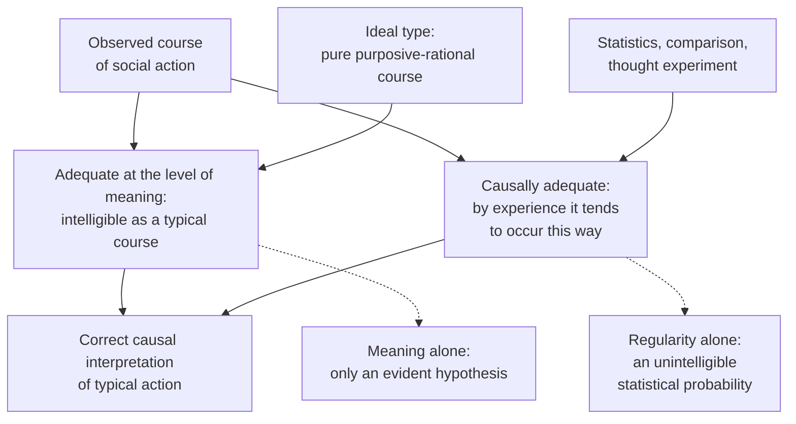

# Social Theory · Lesson 1.3: Understanding: Weber's interpretive method

> ⏱ ~15 min · Module 1: What a social explanation is · Builds on: [1.1 Individuals and social facts](01-01-individuals-and-social-facts.md), [1.2 Functional explanation and its critics](01-02-functional-explanation-and-its-critics.md) · Unlocks: [1.4 Testing a social explanation](01-04-testing-a-social-explanation.md), [4.1 The Protestant ethic and the spirit of capitalism](04-01-the-protestant-ethic-and-the-spirit-of-capitalism.md)

## Why this matters

A physicist explaining a falling rock never asks what the fall means to the rock. A social scientist explaining why people hoard coins, return lost wallets or vote can ask what the act means to the person doing it, and Max Weber argued that she must. He also argued that this is not enough: an act made intelligible is still only a guess about its cause until the evidence says it actually runs that way. That double demand, the module's third kind of explanation, governs Weber's sociology (Module 4) and rational choice (6.2).

## The idea

Watch a man chopping wood. Weber, in the opening section of *Economy and Society* (written in his last years, published 1922), distinguishes two levels of understanding.

- **Direct understanding** (*aktuelles Verstehen*): you see *what* he is doing. Chopping wood, not flailing; aiming a gun, not waving it.
- **Explanatory understanding** (*erklärendes Verstehen*): you see *why*, by placing the act in a wider context of meaning. He chops for a wage, for his own fuel, for exercise, or to work off his anger; the man with the gun is executing someone under orders, fighting an enemy, or taking revenge.

For Weber, the second is already a kind of explanation: grasping the context of meaning into which an act fits. He calls the whole capacity ***Verstehen***, interpretive understanding ([Verstehen](../reference.md#verstehen)). It needs no empathy or shared biography. He quotes the saying that you need not be Caesar to understand Caesar: rational action, above all the fit of means to ends, can be understood without reliving it.

Not every act is sociology's business, only **social action** ([social action](../reference.md#social-action)): behaviour to which the actor attaches a meaning, oriented to what *others* do. The others need not be present or known: accepting money is social action, Weber says, because you take it expecting countless unknown people to take it from you later.

Then the twist that makes Weber more than an interpreter. A meaning can be perfectly clear and still not be what moved the actor. People misreport their motives, even to themselves; the same outward act can rest on opposite meanings; and motives conflict, so only the outcome shows which one won. So he requires two things of a correct explanation of typical action, both present at least to some degree:

1. **Adequacy at the level of meaning** ([adequacy at the level of meaning](../reference.md#adequacy-at-the-level-of-meaning)): the sequence hangs together as a typical, intelligible course by our ordinary habits of thought and feeling.
2. **Causal adequacy** ([causal adequacy](../reference.md#causal-adequacy)): by rules of experience, there is a real probability that the sequence actually occurs that way.

## Source

*Economy and Society*, Part I, ch. 1, §1. The English translations are under copyright, so this is my translation from the 1922 German first edition:

> Sociology … shall mean: a science that seeks to understand social action interpretively and thereby to explain it causally in its course and its effects. … "Social" action shall mean action which, by the meaning its agent or agents intend, is related to the behaviour of others and is oriented to it in its course.

Read the joint: *understand* … *and thereby* … *explain causally*. Understanding is not an alternative to causal explanation; it is the route to it. And "intend" (*gemeint*) matters: the meaning is the one the actor holds, not an objectively "correct" one, as the next paragraph insists.

## The argument

**Weber's method (exegetical: §1, notes 5–9), reconstructed.**

- **P1.** Sociology studies social action: behaviour carrying an intended meaning and oriented to others.
- **P2.** Intended meaning can be grasped by interpretation, directly (what is done) and explanatorily (in what context of meaning it belongs).
- **P3.** An interpretation's being evident does not make it true. *In words:* stated motives can mask real ones, one act can carry different meanings, and competing motives can each be intelligible. In his words (my translation):

  > an interpretation, however evident in its meaning, cannot as such, and because it is evident, claim also to be the causally valid interpretation. In itself it is always only a particularly evident causal hypothesis.

- **P4.** So interpretation must be checked against the outcome: by experiment (rarely possible), by statistics, by comparing cases alike except in the motive in question, or failing all of these, by a thought experiment.
- **P5.** Conversely, a regularity no one can understand as meaningful is, however precise, only an unintelligible statistical probability, not a sociological rule.
- **P6.** Only individual persons are bearers of meaningfully oriented action; for sociology, "the state" or "a firm" names courses of action of individuals.
- **∴ C.** A sociological explanation of typical action shows the action to be both adequate at the level of meaning and causally adequate, and it runs through individuals.

**What kind of explanation.** Interpretive *and* causal, and individualist in the explanatory sense of [1.1](01-01-individuals-and-social-facts.md) ([methodological individualism](../reference.md#methodological-individualism)): note 9 says sociology may use collective concepts but must cash them out in individuals' action. On 1.2's subject, Weber calls functional analysis from the whole useful *preliminary work*: it tells you which actions matter; then the real question begins: what motives produce them?

**Ideal types.** How do you state a "typical" meaning? With an **ideal type** ([ideal types](../reference.md#ideal-types)), worked out in Weber's 1904 essay on objectivity: a construct that deliberately exaggerates one or a few aspects of reality into a consistent pure case found nowhere in reality. It is neither an average nor a moral ideal. It is a yardstick: you ask how far real action approaches it and why it departs. §1's own example: the "laws" of pure economic theory are ideal types, describing how action would run if it were strictly purposive-rational, undisturbed by error or emotion, and aimed at a single economic end. Real action runs as constructed only in rare cases, such as the stock exchange, and even then only approximately. To explain a stock-market panic, he advises, first construct how people would have acted without irrational emotion, then enter the emotions as "disturbances." This "rationalist" procedure, he insists, is a method, not a belief that rational motives dominate life.

**Value freedom and value relevance** ([value freedom and value relevance](../reference.md#value-freedom-and-value-relevance)). Which phenomena are worth studying, and which features of them count, is fixed by their relation to values (*Wertbezogenheit*, a notion §1 credits to Heinrich Rickert): you must first know what a king or an entrepreneur does that makes him worth analyzing, before the analysis can start. Value freedom (his 1917 essay) governs what follows: a finding about what people do and why must not be passed off as a finding about what is good. Note 9's sharpest case: an "individualistic" method does not imply individualistic values, and a socialist economy would have to be understood individualistically too.

**Where the argument is weakest.** P3–P4: that a meaning-interpretation is a causal hypothesis like any other, so the two adequacies are halves of one causal account. Critics attack from both sides. Peter Winch (*The Idea of a Social Science*, 1958) argues that understanding an action is grasping the rules that make it the act it is (a vote, a purchase); that relation is conceptual, not causal, so statistics cannot confirm it, and Weber's second adequacy misdescribes the first. Theodore Abel ("The Operation Called Verstehen", *American Journal of Sociology*, 1948) argues from the other side that understanding only *suggests* hypotheses and verifies nothing, so it is not part of explanation at all. Weber's defenders reply that reasons can be causes (Donald Davidson's 1963 argument is the classic modern defence), which is exactly what P3 needs. The dispute is live; this course uses Weber's two-part test as a working standard, not a settled truth.

## The explanation

## Worked examples

**Example 1: Gresham's law (Weber's own case, §1 note 6).** When two coins pass at the same face value but one is worth more as metal, people spend the other and keep it, so the "good" coin leaves circulation. Weber calls this a rationally evident interpretation resting on the ideal-typical assumption of purposive-rational action, and notes that observation came first, interpretation later.

A real instance: the United States took silver out of its dimes and quarters by the Coinage Act of 1965. For a time the old silver and new copper-nickel clad coins circulated side by side. When the Treasury stopped holding down the price of silver in 1967, the silver coins were hoarded and soon vanished from circulation. Run the two tests:

- **Meaning:** a 1964 quarter and a 1966 quarter buy the same things; once the older one's silver is worth more than 25 cents, *spend the new, keep the old* is the obvious means-end inference.
- **Causal adequacy:** the timing is a comparison of the kind P4 asks for: same coins, same people, before and after the one condition that gives the motive its point. Disappearance followed the condition. Evidence strength: a well-documented episode, and one instance of a pattern Weber calls very widely confirmed.

Both adequacies are present, which is why Weber treats Gresham's law as a model sociological "law": a typical chance of action, confirmed by observation and intelligible from typical motives.

**Example 2 (hard case): returning lost wallets.** Alain Cohn and colleagues ("Civic honesty around the globe", *Science*, 2019) handed in more than 17,000 "lost" wallets at public and private institutions in 355 cities across 40 countries, varying the cash inside, and recorded whether recipients contacted the owner. Take the purely self-interested finder as the ideal type: more cash, more temptation, fewer returns. The result ran the other way. In virtually all countries, wallets with more money were *more* likely to be returned, and neither nonexperts nor professional economists predicted it.

Weber's method handles this as designed. The ideal type is a yardstick, not a forecast, so a large deviation is information. Next, interpret the deviation: not reporting a wallet with no cash feels like mere negligence; keeping one full of cash feels like theft. The authors' additional data suggest a mix of concern for the owner and an aversion to seeing oneself as a thief, both growing with the sum at stake. That is adequacy at the level of meaning; the field result supplies the causal side. Evidence strength: one very large field experiment.

Where it strains: the meaning story came *after* the result. Had returns fallen with cash, "temptation" would have been just as evident. Meaning-adequacy can be manufactured for almost any outcome, so the explanation's force rests on the extra data, which is Weber's own P3 turned against easy interpretation. And measuring against pure self-interest makes honesty look like a "deviation": a methodological choice, implying nothing about whether people are basically selfish.

## Watch out

- **You might think *Verstehen* is empathy, a soft alternative to causal explanation. But actually** Weber defines it as the first half of causal explanation, and rational understanding needs no reliving at all.
- **You might think an ideal type is an ideal or an average. But actually** it is a deliberately one-sided pure case. Calling the purposive-rational type the yardstick is not a claim that people are rational, nor praise of rationality: that would confuse a method with a description, and a description with an evaluation.
- **You might think value freedom means the researcher has no values. But actually** values select the question (value relevance); value freedom forbids passing off a verdict on whether an act is good or wise as a finding about why it occurs. Explaining why people return wallets neither praises nor debunks their honesty.

## One-liner

> Weber explains social action twice over: what it meant to the actor (often measured against an ideal type), and evidence that it really runs that way; an intelligible motive alone is a hypothesis, an unintelligible regularity alone a statistic.

## Problems

**P1 (🟢) *(Exegetical.)*** Close reading. From *Economy and Society*, Part I, ch. 1, §1, II.3–4 (my translation from the 1922 German):

> Not every kind of contact between people is of a social character, but only one's own behaviour meaningfully oriented to the behaviour of the other. A collision of two cyclists, for example, is a mere event, like a natural occurrence. But their attempt to avoid each other, and the abuse, brawl or peaceful discussion following the collision, would be social action. Social action is identical neither (a) with the uniform action of several people nor (b) with every action influenced by the behaviour of others. (a) If, at the start of a rain shower, a crowd of people on the street open their umbrellas at the same time, then (normally) one person's action is not oriented to another's, but the action of all is uniformly oriented to the need for protection against the wet.

Using the passage, say whether each is social action, naming the words that decide it. One sentence each. (i) On a hot afternoon, everyone in a park drifts into the shade of the trees. (ii) Two cyclists each swerve to avoid the other and collide anyway. (iii) A shopper accepts an unfamiliar banknote in change because she expects other shops to accept it from her tomorrow.

**P2 (🟡) *(Exegetical (a) · Evaluative (b).)*** In March 2020, as COVID-19 lockdowns began, supermarket shelves of toilet paper emptied in several countries. (a) Following Weber's advice for a stock-market panic, construct in three or four numbered features the ideal type of a purely purposive-rational shopper in that situation: end, beliefs, resulting action. (b) Name one feature of the real episode you would then enter as a "disturbance" from your type, and one piece of evidence that would show the disturbance was causally real, not just intelligible. 150 words or fewer in total.

**P3 (🔴, optional) *(Exegetical (a)–(b).)*** Millions vote in national elections, although the chance that any one vote decides the result is tiny. Two explanations:

- **A (meaning only):** voters understand voting as a citizen's duty. Once you grasp that sense, turnout is explained; no statistics are needed.
- **B (causes only):** turnout is predicted by age, education and length of residence. A model that predicts who votes explains voting; what voting "means" to voters adds nothing.

(a) In the terms of §1, which adequacy does each explanation offer, and what would Weber say each one, on its own, amounts to? (b) Name the crux between A and B: the single premise one must affirm and the other deny. 120 words or fewer in total.

Solutions

**P1** *(Exegetical — strict)*

**Must hit, strict:**

- (i) Not social action: like the umbrellas, it is "the uniform action of several people," each "uniformly oriented to" the heat, not to one another. It is meaningful action, just not social.
- (ii) The swerves are social action ("their attempt to avoid each other"); the collision itself is "a mere event." Orientation to the other, not success, decides it.
- (iii) Social action: her behaviour is "meaningfully oriented to the behaviour of the other," here the expected future behaviour of other shopkeepers. (Weber's own money example, §1 II.1, says the others may be unknown and indefinitely many.)

**Wrong turns:** calling (i) social because many people do it together (the passage's point (a) rules this out); calling (ii) not social because it ends in a collision; calling (iii) individual because no particular other person is present.

**Model answer:** (i) Not social: it is uniform action, each person oriented to the heat as the crowd is oriented to the rain. (ii) The swerves are social, an "attempt to avoid each other"; only the collision is a mere event. (iii) Social: she acts oriented to the expected behaviour of others, unknown though they are.

---

**P2** *(Exegetical (a) — strict on form · Evaluative (b))*

**Accept:** any type that (1) fixes a single end, (2) assumes accurate information and no emotion, (3) derives the action from means-end reasoning *including expectations about other shoppers*, and (4) is offered as a yardstick to measure the episode against, not a description of shoppers.

**Must hit, strict (a):**

- The four features above.
- The rational type itself predicts *some* stocking up: if you expect others to buy ahead, an empty shelf later is a real risk. Rational action here is social action.

**Must hit, any verdict (b):**

- A specific disturbance (fear, imitation of crowds, buying set off by images of empty shelves) beyond what the type predicts.
- Evidence that discriminates: something that varies the disturbance while holding the rational motive fixed, or the reverse.

**Wrong turns:** building the type as "a rational shopper does not stock up at all" (it ignores the orientation to others); treating the type as a claim that shoppers *were* rational; offering a story for (b) with no evidence that could check it.

**Model answer, one of several:** (a) 1. End: keep the household supplied at least cost. 2. Beliefs: home use rises during lockdown; the product is cheap, bulky and keeps; shops restock on a schedule; other shoppers may buy ahead. 3. So buy a few weeks' supply now, before the shelf empties. 4. Stop once restocking is visible; never buy months' worth, which costs storage and guards against no real shortage. (b) Disturbance: purchases far beyond weeks of need, from fear spread by photographs of empty shelves. Evidence: compare purchase sizes in towns whose shops never ran out with towns whose shops did. If panic buying spread as images circulated, even where local stock was fine, the emotion was doing causal work.

---

**P3** *(Exegetical — strict)*

**Must hit, strict (a):**

- A offers adequacy at the level of meaning only; for Weber it is, alone, "only a particularly evident causal hypothesis" that needs checking against the actual course of action (P3–P4).
- B offers causal adequacy (a probability by rules of experience) only; alone, it is an unintelligible statistical probability, not a sociological rule (P5).

**Must hit, strict (b):**

- The crux: whether the meaning an action has for its actor is among its causes, so that an explanation of action must identify it. A affirms it; B denies it.

**Wrong turns:** naming as the crux "whether voting is rational" (an evaluative question neither explanation raises); saying Weber sides with A because he is an interpretivist (he rejects both as incomplete); making the crux "whether turnout can be predicted" (A need not deny that).

**Model answer:** (a) A is adequate at the level of meaning, but Weber would call it only an evident hypothesis until the duty motive is shown to drive actual turnout. B is causally adequate, but without a meaning it is only a statistical probability: it says who votes, not what they are doing. (b) The crux is whether the actor's meaning is a cause of the action. A affirms it (and, by Weber's lights, wrongly treats grasping it as enough); B denies that meaning does any explanatory work.

## Flashback

**From Lesson [1.1](01-01-individuals-and-social-facts.md) (Individuals and social facts):** *(Exegetical (a) · Evaluative (b).)* In the traditional East Asian calendar, 1966 was a *hinoeuma* ("fire horse") year. A Japanese folk belief, centuries old, holds that a woman born in such a year is too headstrong and brings misfortune on her husband; women born in the previous fire-horse year, 1906, met that prejudice when they reached marrying age in the 1920s. Japan's vital statistics show births falling 25 percent from 1965 to 1966, then rising 42 percent in 1967. A government report of 1967 found that 98 percent of married women under 40 knew of the belief, and 30 percent said they had not wanted to give birth that year. (Figures as summarized by the economist Hideo Akabayashi, 2007.)

(a) Name two social facts in this case, and run Durkheim's two tests on the folk belief. Which phrase of his definition admits a belief that no law ever enforced? Three sentences or fewer.

(b) An analyst writes: "Most of these couples probably didn't believe it. Each simply expected *other* families to believe it when a daughter came to marry, so avoiding a fire-horse daughter was sensible. There was no collective belief at work, only millions of individual expectations." Which of 1.1's two questions does the last sentence answer? And does the analyst's mechanism, if true, take the social fact out of the explanation? Any verdict; 100 words or fewer.

Solution

**Must hit, strict (a):**

- Two social facts: the folk belief (a way of thinking) and the 1966 birth rate, a rate that pools every couple's decision so that private circumstances cancel out. The 1967 rebound counts too.
- **Externality:** the belief is older than every couple deciding in 1966; none of them made it, and it was already written into the calendar and into the 1906 cohort's experience. Its near-universal currency (98 percent knew of it) is the generality of the second test.
- **Constraint** shows on resistance: a family that ignored the belief risked a daughter's marriage prospects, as the 1906 cohort found. Durkheim's "capable of" means constraint need not be felt by those who conform.
- **"Fixed or not"** admits an uncodified belief alongside law.

**Must hit, any verdict (b):**

- The last sentence answers the **ontological** question (what exists). A holist can grant it (the "both" position), so on its own it settles nothing about what explains.
- The mechanism is individualist in form: expectations and best responses.
- But what each couple expects is that the belief is *general* in the marriage market. So the explanans still cites a fact about the group, external to each couple, that constrains even couples who reject the belief. That is Durkheim's externality, and Lukes's point that the individualist's explanans uses social predicates ("marriage market", "fire-horse year").
- A verdict with a reason: either the mechanism is the channel through which the social fact constrains (a holist explanans working through individuals), or the expectations, fully specified, reduce the social fact away.

**Wrong turns:** in (a), denying the belief is a social fact because no law enforced it, or because it is false; the first is what "fixed or not" answers, and the second is beside the point (whether a belief is true is not what makes it a social fact). In (b), reading the analyst's last sentence as a refutation of holism, which collapses the two questions. Or thinking that a belief few people hold cannot explain much: binding those who do not hold it is exactly what externality means.

**Model answer (a):** The folk belief and the 1966 birth rate are both social facts. The belief is external, older than any couple deciding in 1966, and it constrained on resistance, as the 1906 cohort's marriage prospects showed; "fixed or not" lets in a way of thinking that no law codified.

**Model answer (b), one of several:** The last sentence answers the ontological question, and a holist can grant it. The mechanism is individualist in form, but what each couple expects is that the belief is general in the marriage market: a fact about the group that no couple controls and that binds even those who reject it. That is Durkheim's externality, and the expectation cannot be stated without it. So the mechanism shows how the social fact constrains; it does not remove it. Whether that makes the explanation "really" holist is 1.1's open crux.

## Connections

- **Backward:** Weber's insistence that collective concepts name individuals' action is the methodological individualism of [1.1](01-01-individuals-and-social-facts.md); his treatment of functional analysis as preliminary work is a classical verdict on [1.2](01-02-functional-explanation-and-its-critics.md)'s question.
- **Forward:** P4's "cases alike except in the motive" is the comparison [1.4](01-04-testing-a-social-explanation.md) turns into an evidence standard. [4.1](04-01-the-protestant-ethic-and-the-spirit-of-capitalism.md) is the method at full scale: the meaning of the calling, then causal comparison. The three types of authority in [4.3](04-03-domination-and-the-three-types-of-authority.md) and bureaucracy in [4.4](04-04-bureaucracy-rationalization-and-disenchantment.md) are ideal types. [6.2](06-02-rational-choice-sociology.md) makes the purely purposive-rational type its default.
- **Sideways:** Weber's reading of economic theory's "laws" as ideal types is a cousin of Mill's isolated economic man in [`philosophy-of-economics` 6.1](../../philosophy-of-economics/lessons/06-01-idealization-and-isolation.md), with a difference: Mill claims a real tendency, Weber a yardstick. Whether reasons can be causes, the fault line under P3, belongs to [`philosophy-of-science`](../../philosophy-of-science/syllabus.md).
