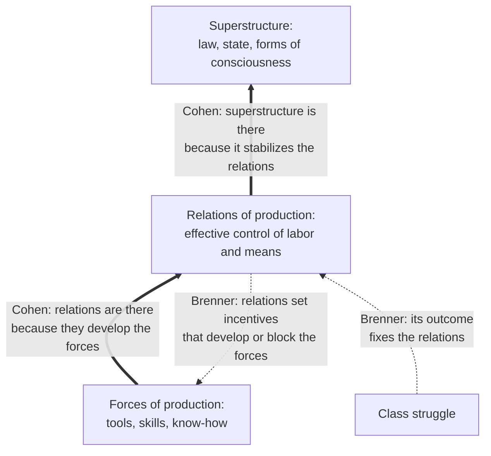

# Social Theory · Lesson 2.1: Historical materialism

> ⏱ ~15 min · Module 2: Marx as social theorist · Builds on: [1.1 Individuals and social facts](01-01-individuals-and-social-facts.md), [1.2 Functional explanation and its critics](01-02-functional-explanation-and-its-critics.md), [1.4 Testing a social explanation](01-04-testing-a-social-explanation.md) · Unlocks: [2.2 Class, class consciousness, and ideology](02-02-class-class-consciousness-and-ideology.md), [2.3 Capitalism and the test of history](02-03-capitalism-and-the-test-of-history.md)

## Why this matters

`history-of-political-thought` read Marx's 1859 Preface as a claim about the state ([HPT 6.5](../../history-of-political-thought/lessons/06-05-marx-from-hegel-to-historical-materialism.md)). This lesson asks the social scientist's question: what *kind* of explanation is historical materialism, and what would show it false? It is the most ambitious program in the course, using one variable (how a society produces) to explain law, politics and ideas across all of history. It is also the cleanest large-scale test of the functional explanation of [1.2](01-02-functional-explanation-and-its-critics.md). If you can say what a functional explanation of property relations has to deliver, you can say what any "X exists because it serves Y" claim in sociology or economics has to deliver.

## The idea

**[Historical materialism](../reference.md#historical-materialism)** stacks three layers. The **[forces of production](../reference.md#forces-and-relations-of-production)** are what a society can do with nature: tools, machines, skills, know-how and labor power. The **relations of production** are who has effective control over those forces and over labor: lord and serf, master and slave, owner and wage-worker. The **[superstructure](../reference.md#base-and-superstructure)** is law, the state and the forms of consciousness that rise on the relations. HPT 6.5 reconstructs the Preface's own statement of this; take it as given here.

The puzzle starts at once. The theory calls the forces fundamental, yet relations plainly shape forces: capitalism built the railways and feudalism did not. It calls law determined, yet law plainly shapes property. If everything affects everything, what can "primacy" mean?

G. A. Cohen's answer (*Karl Marx's Theory of History: A Defence*, 1978) is that the primacy is *explanatory*, and that the explanation is **functional**. Relations of production are as they are *because* they suit the development of the forces at that level. When they stop suiting it, they go. The superstructure is as it is because it stabilizes those relations. On this **[functional reading](../reference.md#functional-reading-of-historical-materialism)**, the effects that looked like counterexamples are the content of the theory. A finch's beak shapes what it can eat, and we explain the beak *by* that effect. Law shapes property in the same way, and that is exactly why it is explained by the property relations it serves.

**[Relations-first readings](../reference.md#relations-first-readings)** put the weight the other way. Robert Brenner ("Agrarian Class Structure and Economic Development in Pre-Industrial Europe", *Past and Present*, 1976) argued that property relations, fixed by the outcome of class conflict, decide whether the forces develop at all. Peasants who hold their land securely, and lords who live on rents, are under no systematic pressure to raise productivity. Only producers who must compete in a market to keep their land are. On this view the arrival of capitalist relations was an unintended result of class struggle, not a selection for productive promise. E. P. Thompson (*The Making of the English Working Class*, 1963) made a kindred point about class itself: it is made in experience and struggle, not read off a structure.

## Source

Marx, *Capital* vol. 1, Preface to the first German edition (1867), Moore–Aveling translation (1887):

> It is a question of these laws themselves, of these tendencies working with iron necessity towards inevitable results. The country that is more developed industrially only shows, to the less developed, the image of its own future. … even when a society has got upon the right track for the discovery of the natural laws of its movement … it can neither clear by bold leaps, nor remove by legal enactments, the obstacles offered by the successive phases of its normal development. But it can shorten and lessen the birth-pangs. … here individuals are dealt with only in so far as they are the personifications of economic categories, embodiments of particular class-relations and class-interests.

Read it for kinds of explanation (exegetical).

- **"Laws … iron necessity … inevitable"** is the language of law-like explanation. But the laws are "tendencies": Marx hedges inside his boast.
- **"The image of its own future"** is a *comparative prediction*: the less developed country will retrace the developed one's path. Comparison ([1.4](01-04-testing-a-social-explanation.md)) can test that. Alexander Gerschenkron (*Economic Backwardness in Historical Perspective*, 1962) argued that late industrializers took different routes, leaning on banks and the state. Whether that refutes Marx or only amends him is contested.
- **"Legal enactments … birth-pangs"** gives the superstructure a bounded role: law changes the speed and cost of development, not its direction. A functional reading needs exactly this. A superstructure with no effects could not be explained by its effects.
- **"Personifications of economic categories"** is *explanatory* holism ([1.1](01-01-individuals-and-social-facts.md)): individuals enter the explanation as occupants of class positions. It is not ontological holism. No class exists apart from its members.

## The argument

Cohen's reconstruction, stated at the strength he gave it (exegetical: this is Cohen's Marx):

- **P1 (development thesis).** The forces of production tend to develop over history. Cohen grounds this in three facts: people are somewhat rational, they live under scarcity, and they have the intelligence to improve their tools.
- **P2 (primacy thesis).** The nature of a society's relations of production is explained by the level its forces have reached.
- **P3 (the form of P2).** The explanation is functional. Relations obtain *because* they are suitable for developing the forces at that level.
- **P4.** When relations come to fetter the forces, they are replaced by relations that suit them.
- **P5.** The superstructure is explained functionally too, by its stabilizing the relations.
- **∴ C.** The succession of epochs is explained by the growth of the forces, with relations and superstructures selected for their fit.

*In words:* technology is not the engine that pushes institutions. It is the test that institutions are selected by.

**What kind of explanation?** It is functional ([1.2](01-02-functional-explanation-and-its-critics.md)), and it is holist in the explanatory sense: its variables are structures, not choices. Its weak point is the one 1.2 trains you to find: the **[feedback mechanism](../reference.md#feedback-mechanism)**. Cohen granted that a functional explanation calls for an "elaboration" of how the fit produces the thing. He argued, though, that it can be confirmed by a well-attested regularity before the mechanism is known, as Darwin's theory was before genetics. Jon Elster ("Marxism, Functionalism, and Game Theory", *Theory and Society*, 1982, with Cohen's reply in the same issue) answered that without a mechanism you have only pointed to a benefit. The candidate mechanisms are three: rulers choosing on purpose, competition between states, and class struggle won by whichever class's rule would develop the forces.

**What would test it?** Comparison (1.4). Strict primacy fails if similar forces sit under persistently different relations, or if relations change before the forces have outgrown them.

**Where the argument is weakest.** At P1 joined to P3. A critic grants that individuals want more productive tools, and denies that this gives any class the *power* or the *reason* to install the relations that suit the forces. Rational peasants and rational lords pursue their own reproduction, not society's productivity. Brenner's comparison adds evidence: the same demographic shock, in regions with broadly similar technique, produced opposite relations. If so, the forces did not select the relations; class power did.

## The explanation

*Thick arrows: Cohen's lines of explanation, each of the form "this is there because of its effect on that". Dashed arrows: the relations-first reading. Both readings agree that relations causally affect forces. They disagree about why the relations are there.*

## Worked examples

**Example 1 (the theory at work: the English Factory Acts).** Marx explains the Factory Acts, laws limiting the working day, in *Capital* vol. 1, ch. X. His claim is functional. Capital as a whole needs the workforce to keep reproducing itself, but each capitalist profits by draining his own workers. Marx (Moore–Aveling) writes that "the limiting of factory labour was dictated by the same necessity which spread guano over the English fields". Law (superstructure) preserves labor power (a force) under capitalist relations. That is P5 in miniature.

The test from 1.2 is whether Marx names a mechanism, and he does, several. Factory hands had made the Ten Hours' Bill their economic election-cry since 1838. Manufacturers who obeyed the Act of 1833 petitioned against competitors who broke it. Manufacturers fighting the Corn Laws needed workers' support. Tories, threatened over their rents, attacked the manufacturers. Near the chapter's end Marx calls the normal working day the product of a long, partly hidden civil war between the classes. *Kind:* a functional explanation with a feedback mechanism, where the mechanism is class struggle plus rivalries within the ruling classes. *Strength:* this is one author's reading of one legislative history, and rival accounts give the humanitarian and Tory-paternalist reformers more independent weight. It shows the theory can be given mechanisms. It does not show the mechanisms reliably track function.

**Example 2 (the hard case: Europe after the Black Death).** After the population collapse of the fourteenth century, labor was scarce across Europe. One demographic shock hit societies with broadly similar agricultural technique. Serfdom declined in the West. East of the Elbe, lords imposed a "second serfdom". The Malthusian historians Brenner was answering (M. M. Postan, Emmanuel Le Roy Ladurie) could not explain the divergence from population alone. The same divergence embarrasses a forces-first account. In Brenner's reading, what differed was class structure: how organized the peasant communities were, and how lords could combine against them. *Kind:* a relations-first explanation tested by comparison, with similar inputs and divergent outcomes. A Cohen defender has two replies. One is that the primacy thesis explains only the long-run *range* of viable relations, so regional variation within that range is noise. The other is that the Western outcome won over centuries because it developed the forces: the selection runs through competition, not through the moment of divergence. The price of each reply is that the theory now predicts less.

## Watch out

- **You might think historical materialism is technological determinism, "the machine decides".** Actually, Cohen's reading gives the superstructure real effects and needs it to have them, since a functional explanation explains a thing by its effects. A theory where law changes nothing could not explain law functionally.
- **You might think "functional" means "good for society".** Actually, relations function *for the development of the forces*, not for the people living under them. Calling serfdom or wage labor functional is an explanatory claim, not an evaluative one. Whether capitalism is just belongs to [political philosophy](../../political-philosophy/syllabus.md).
- **You might treat Cohen's reconstruction as what Marx said.** Keep three claims apart. Whether Marx held the primacy thesis is *exegetical*, and the texts pull both ways (P2 below). Whether it is true of history is *explanatory*. Whether the transitions it explains were progress is *evaluative*, and nothing in this lesson settles it.

## One-liner

> On Cohen's reading, history's institutions are selected by how well they develop the forces of production; relations-first readers reply that class power did the selecting, and comparison is how you tell.

## Problems

**P1 (🟢)** *(Exegetical.)* Diagnose. An invented op-ed in a business weekly, not the words of any real person or publication:

> "Ride-hailing apps did not wait for permission. Once a phone could match a driver to a rider in seconds, the old licensed-taxi system was finished, and the lawmakers now writing rules for 'platform workers' are only catching up with what the technology had already decided. Regulation follows the machine, never the other way round."

(a) Which explanatory picture does the op-ed assume, and why is it *not* Cohen's functional reading? (b) Name one kind of fact a relations-first reader would point to against it. Two sentences per part.

**P2 (🟡)** *(Exegetical (a) · Evaluative (b).)* The *Manifesto* (Moore, 1888 text; NY Labor News reprint, 1908), sec. I:

> "The bourgeoisie cannot exist without constantly revolutionizing the instruments of production, and thereby the relations of production, and with them the whole relations of society. Conservation of the old modes of production in unaltered forms, was, on the contrary, the first condition of existence for all earlier industrial classes. … We see then: the means of production and of exchange on whose foundation the bourgeoisie built itself up, were generated in feudal society. At a certain stage in the development of these means of production and of exchange, … the feudal relations of property, became no longer compatible with the already developed productive forces; they became so many fetters. They had to be burst asunder."

(a) In the first sentence, which way do the causal arrows run between relations and instruments? In the last two sentences, which way? (b) The second sentence makes trouble for Cohen's development thesis. Say what the trouble is, give the best reply a Cohen defender has, and say whether it works. 120 words or fewer for (b).

**P3 (🔴)** *(Exegetical (a) · Evaluative (b).)* Find the crux. US slavery ended in 1865 through civil war and constitutional amendment. A Cohen-style reader says slave relations had come to fetter the South's productive forces (little incentive to build skill, slow mechanization, a thin home market), so they gave way to free labor. A relations-first reader notes that most economic historians now accept that slavery was profitable for slaveholders on the eve of the war, following Conrad and Meyer (*Journal of Political Economy*, 1958). Fogel and Engerman (*Time on the Cross*, 1974) went further and called it efficient, a claim that remains contested. On this reading the relations were ended by a political and military conflict, not by their misfit with the forces. (a) Name the single premise the two readers disagree about. (b) Say what evidence would discriminate between them, and whether the Cohen reader can absorb the case without making the theory unfalsifiable. 150 words or fewer for (b).

Solutions

**P1** *(Exegetical.)*

**Must hit, strict (a):**

- The op-ed assumes direct technological determinism: the forces (the matching app) *cause* the new relations (the end of licensed taxis, platform work), and law merely follows.
- It is not Cohen's reading for two reasons. Cohen's primacy is *functional*: relations are there because they suit the development of the forces, not because a technology pushes them into being. And "never the other way round" denies law any effect on the base, while a functional explanation of law requires law to have effects, since it explains law by its stabilizing them.

**Must hit, strict (b):**

- A comparison with similar forces and different relations. The same app operates under different legal and employment arrangements in different jurisdictions, as courts and legislatures have classified drivers differently. Or relations being fixed by political conflict (licensing fights, union campaigns) rather than by the technology.

**Wrong turns:** calling the op-ed "Marxist" without saying which reading; answering (b) with an evaluative objection ("gig work is exploitative"), which is not evidence about what explains what.

**Model answer:** (a) The op-ed is plain technological determinism: the technology pushes new work relations into being and law trails behind with no effect of its own. Cohen's reading differs because it explains relations by their *fit* with the forces' development, and explains law by its stabilizing effect on relations, so "never the other way round" would leave it nothing to explain. (b) A relations-first reader would point out that the same app runs under different employment arrangements in different jurisdictions, depending on how courts, legislatures and labor conflicts went. Same forces, different relations.

---

**P2** *(Exegetical (a) · Evaluative (b).)*

**Must hit, strict (a):**

- First sentence: both directions. A class defined by capitalist relations (the bourgeoisie) must revolutionize the instruments, so relations drive forces, "and thereby" the changed instruments change the relations and the whole of society, so forces drive relations.
- Last two sentences: forces to relations. The means of production grew *inside* feudal society, outgrew feudal property relations, and those relations became fetters to be burst.

**Must hit, any verdict (b):**

- The trouble: if conserving old modes of production was "the first condition of existence" for every earlier ruling class, then pre-capitalist relations did not tend to develop the forces. That undercuts P1 for all of history before capitalism, and with it the claim that relations were selected for developing them.
- A reply, such as: the development thesis claims only a slow, long-run tendency, which is compatible with ruling classes trying to conserve; forces crept forward despite them, through peasants' and artisans' improvements, trade and diffusion, and the passage itself says the means "were generated in feudal society".
- A verdict on whether the reply survives, for instance whether "despite the relations" can still be squared with P3's "because they suit the forces".

**Wrong turns:** reading "and thereby" as merely temporal; treating the passage as Cohen's text (it is 1848, and Cohen reconstructs it); answering (b) with whether capitalism is good.

**Model answer (b), one of several:** If every earlier ruling class lived by *conserving* its mode of production, then pre-capitalist relations did not tend to develop the forces. P1 then holds at best for capitalism, and P3's selection story has nothing to select on before it. Cohen's best reply is that P1 asserts only a weak, long-run tendency: forces crept forward through peasants, artisans and trade even while lords conserved, and the passage itself says the new means "were generated in feudal society". I think the reply saves P1 but costs P3. If the forces grew *despite* feudal relations, those relations were not there *because* they developed the forces. The functional reading then fits capitalism far better than the epochs before it.

---

**P3** *(Exegetical (a) · Evaluative (b).)*

**Accept:** any single premise equivalent to the one below; for (b), any verdict if the discriminating evidence and the falsifiability question are both addressed.

**Must hit, strict (a):**

- The crux: *whether slave relations ended because they had come to fetter the development of the productive forces* (the primacy thesis applied to this transition). Both readers can accept that slavery was profitable and that it ended through war. They disagree about why the relations changed.

**Must hit, any verdict (b):**

- Discriminating evidence, by comparison: whether slave economies that were still expanding and profitable ended *only* when forced from outside, or also where slavery had stopped paying; whether the Southern economy was falling behind in productivity before 1860; whether the North's productive advantage decided the war. Brazil, which abolished slavery in 1888 without civil war, is a useful comparison.
- The falsifiability move: the Cohen reader can say the free-labor North's greater productive power won the war, so selection ran through military competition. Say whether that is a real mechanism with checkable implications, or a story that fits any outcome.
- A verdict either way.

**Wrong turns:** treating profitability as settling the question (relations can be profitable for owners and still fetter society-wide development, which is Cohen's point); naming two cruxes; arguing whether slavery was unjust, which no one disputes and which is not the explanatory question.

**Model answer (b), one of several:** Compare slave economies at their end. If profitable, expanding slave systems ended only through outside force, while slavery where it no longer paid simply withered, then relations followed the fit and the Cohen reader gains. If profitable systems were ended by politics regardless of their productive record, the relations-first reader gains. Brazil, which abolished slavery in 1888 without war, is one such comparison. The Cohen reader can absorb the US case by saying the North's superior forces won the war. That is testable only if one can show the war was decided by productive capacity rather than by politics, generalship or contingency, and that such contests reliably favor the more productive side. Without that, "whichever side won must have had the better forces" fits every outcome, and the theory stops predicting.

## Flashback

**From Lesson [1.3](01-03-understanding-webers-interpretive-method.md) (Understanding: Weber's interpretive method):** *(Exegetical.)* In a field experiment (Gneezy and Rustichini, "A Fine Is a Price", *Journal of Legal Studies*, 2000), ten private day-care centres in Haifa were observed for 20 weeks. From week 5, six centres chosen at random fined parents 10 shekels per child for arriving more than 10 minutes late to collect them. The other four centres, with no fine, showed no significant change. In the fined centres, late pickups rose and within two or three weeks had roughly doubled. The fine was removed at week 17, and lateness stayed at its new, higher level. The authors offer two readings:

- **R:** The parents' contract never said what lateness would cost, so parents had guarded against some unspecified and possibly severe response. The fine told them that a small charge was the worst that could happen.
- **N:** Parents had seen a teacher staying late as a favour, not to be abused. The fine turned it into a service with a price, to be bought as needed.

(a) Which reading keeps Weber's purely purposive-rational ideal type, and which enters a change in the meaning parents attached to the act? Is each adequate at the level of meaning? (b) What does the comparison with the four unfined centres make causally adequate, and why can it not decide between R and N? Name one comparison that could. Three sentences or fewer per part.

Solution

**Accept (b):** any comparison that varies what parents learn about sanctions while holding the price framing fixed, or varies the price framing while holding information fixed.

**Must hit, strict (a):**

- **R** keeps the purposive-rational type: self-interested parents choose a means to their end and update their *beliefs* about consequences. Nothing is entered as a disturbance. What failed was the naive prediction that a penalty always deters, not the ideal type.
- **N** changes the intended meaning of the act, from imposing on a teacher's goodwill to buying extra care.
- Both are adequate at the level of meaning: each makes the rise intelligible as a typical course. By 1.3's premise P3, each alone is only an evident causal hypothesis.

**Must hit, strict (b):**

- The control centres make causally adequate the claim that the **fine** raised lateness, not the season, the passage of time or growing familiarity with the centre. This is the comparison of cases alike except in one condition that 1.3's premise P4 calls for.
- Both readings predict the same observed course, both the rise and the persistence after removal. Under R, parents still had no reason to expect anything worse than a fine. So the comparison establishes the cause but not the motive.
- A discriminating comparison, e.g. post a notice, with no fine, saying that lateness will never bring more than a reminder. R predicts lateness rises, because the information alone lowers the expected sanction. N predicts no rise, because nothing has been priced.

**Wrong turns:** calling R "not rational" because lateness rose under a penalty; R is the rational reading, with beliefs updated. Treating the persistence after removal as evidence for N: R predicts it too, and the authors themselves note that N needs an extra norm, added after the fact, to fit it. That is Weber's warning that meaning-adequacy is easy to manufacture.

**Model answer:** (a) R keeps the purposive-rational type: parents pursue their own convenience and revise their beliefs about the worst sanction, so no disturbance is needed. N changes what the act means, from abusing a favour to buying a service. Both are intelligible courses of action, so both are adequate at the level of meaning, and each alone is only an evident hypothesis. (b) The unfined centres show that the fine caused the rise, not time or season, which gives causal adequacy to "fine → more lateness". But R and N predict the same rise and the same persistence, so the comparison cannot tell the motives apart. A notice, with no fine, announcing that lateness will never bring more than a reminder would: R predicts more lateness, N none.

## Connections

- **Backward:** [1.2](01-02-functional-explanation-and-its-critics.md) supplies the test this lesson runs, namely whether a functional explanation names its feedback mechanism. [1.1](01-01-individuals-and-social-facts.md) supplies the explanatory/ontological holism distinction behind "personifications". The Preface's text and its political reading are [HPT 6.5](../../history-of-political-thought/lessons/06-05-marx-from-hegel-to-historical-materialism.md); what the state does on this theory is [HPT 6.6](../../history-of-political-thought/lessons/06-06-marx-the-state-revolution-and-after.md).
- **Forward:** [2.2](02-02-class-class-consciousness-and-ideology.md) asks when the classes of the relations-first story actually act as one. [2.3](02-03-capitalism-and-the-test-of-history.md) tests the theory's predictions about capitalism. Weber's *Protestant Ethic* ([4.1](04-01-the-protestant-ethic-and-the-spirit-of-capitalism.md)) is the classic rival account of the same transition, one that runs through ideas. Polanyi ([5.3](05-03-polanyis-great-transformation.md)) tells the rise of market society as a political project.
- **Sideways:** functional explanation and reduction in general belong to [philosophy-of-science](../../philosophy-of-science/syllabus.md). Locating the single disputed premise, as in P3, is the method of [philosophical-method 4.3](../../philosophical-method/lessons/04-03-finding-the-crux.md). Institutional accounts of why some societies' relations promote growth (North; Acemoglu and Robinson) are [institutions-and-development](../../institutions-and-development/syllabus.md).
