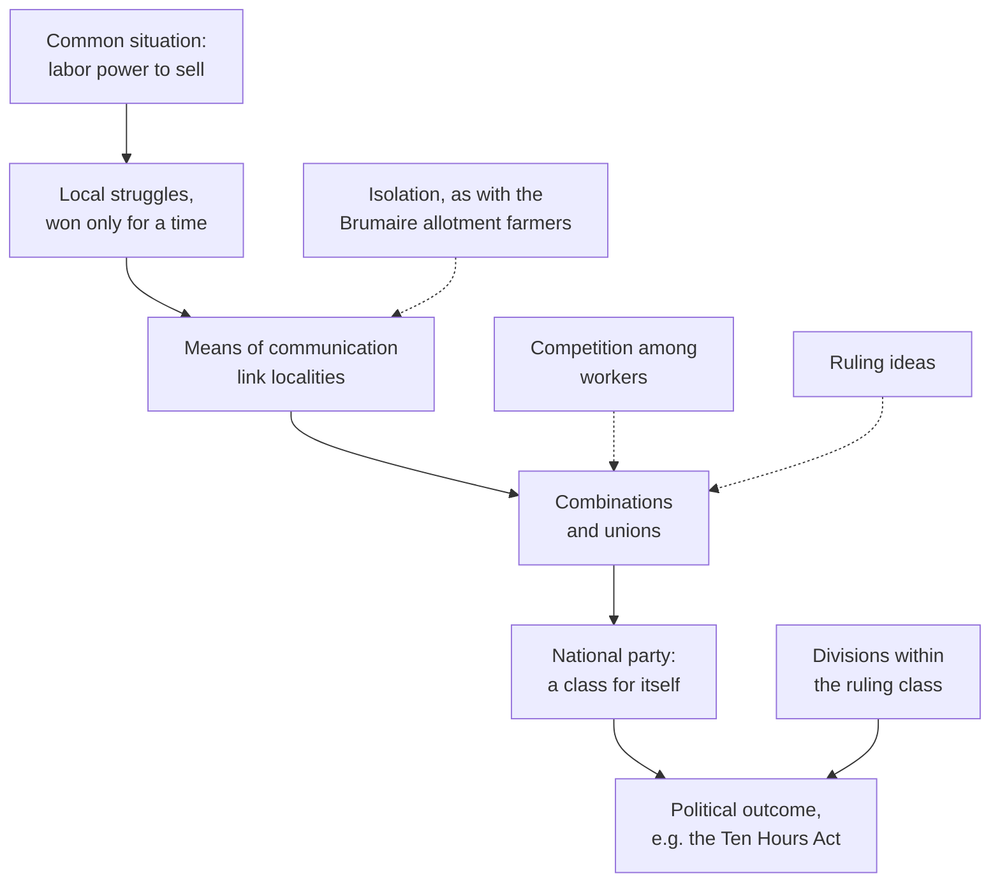

# Social Theory · Lesson 2.2: Class, class consciousness, and ideology

> ⏱ ~15 min · Module 2: Marx as social theorist · Builds on: [2.1 Historical materialism](02-01-historical-materialism.md), [1.2 Functional explanation](01-02-functional-explanation-and-its-critics.md) · Unlocks: [2.3 Capitalism and the test of history](02-03-capitalism-and-the-test-of-history.md)

## Why this matters

Millions of people can share an economic position for generations and never act together. A few hundred thousand who share one can win a law, or bring down a government. Marx's class analysis tries to say what makes the difference: when a category of people becomes an actor. It also tries to explain why people so often accept ideas that justify their own position. Both are **explanatory** claims. This lesson asks what kind of explanation each one is and what would test it. Whether class society is unjust is a different question, and it belongs to [`political-philosophy`](../../political-philosophy/syllabus.md).

## The idea

**Class is a relation, not a bracket.** For Marx your class is fixed by your [relation to the means of production](../reference.md#class): whether you own the factories, land and tools, or have only your capacity to work to sell. Income, schooling and lifestyle do not define it. A well-paid engineer on a salary and a cleaner are both wage-workers. A struggling shopkeeper who owns his shop is not. Classes are defined against each other, the way "creditor" needs "debtor". The many positions that fit neither pole are a problem the tradition takes up in [2.3](02-03-capitalism-and-the-test-of-history.md).

**A class by position is not yet a class in action.** In *The Poverty of Philosophy* (1847; H. Quelch's translation, Kerr printing of 1913), Marx says economic conditions have created a mass with a common situation and common interests:

> "this mass is already a class, as opposed to capital, but not yet for itself. In the struggle … this mass unites, it is constituted as a class for itself."

The usual textbook pair, a [class "in itself" and a class "for itself"](../reference.md#class-in-itself-and-for-itself), half-quotes this passage. "For itself" is Marx's phrase. "In itself" is a later Hegelian gloss; Marx's own words are "as opposed to capital". In the *Eighteenth Brumaire* (1852), the French allotment farmers are the negative case. They are a class insofar as their conditions set them against other classes. They are not one insofar as they have only local ties and no organization, so others must represent them. [History of political thought 6.6](../../history-of-political-thought/lessons/06-06-marx-the-state-revolution-and-after.md) reads that passage and what it did to the French state.

**Ideology explains why the move often fails.** The *Manifesto* (1848; Samuel Moore's translation, 1888), Part II:

> "The ruling ideas of each age have ever been the ideas of its ruling class."

Readers find three mechanisms for [ideology](../reference.md#ideology) in Marx. (1) *Control*: the class that owns material production also owns the means of producing and spreading ideas: presses, universities, pulpits. This is the *German Ideology* (written 1845–46, published in full 1932), paraphrased. (2) *Appearance*: the market itself makes a wage look like a fair exchange. That is commodity fetishism, taught in 2.3. (3) *Function*: ideas persist because they stabilize the relations of production. The phrase ["false consciousness"](../reference.md#false-consciousness) is not Marx's. It is Engels's, in a letter to Franz Mehring of 14 July 1893.

## Source

*Manifesto of the Communist Party*, Part I (Moore, 1888), on the proletariat's development:

> The real fruit of their battles lies not in the immediate result but in the ever improved means of communication that are created in modern industry and that place the workers of different localities in contact with one another. It was just this contact that was needed to centralize the numerous local struggles, all of the same character, into one national struggle between classes. But every class struggle is a political struggle. […] This organization of the proletarians into a class and consequently into a political party, is continually being upset again by the competition between the workers themselves. But it ever rises up again; stronger, firmer, mightier. It compels legislative recognition of particular interests of the workers, by taking advantage of the divisions among the bourgeoisie itself. Thus the ten-hours' bill in England was carried.

Read it as a recipe. Shared conditions produce only "numerous local struggles, all of the same character": the same fight fought separately. **Contact** is the missing ingredient. "Consequently" welds class and party: becoming a class *for itself* means organizing, not just feeling something. Two forces push the other way. One is internal, the "competition between the workers themselves". The other helps from outside: "divisions among the bourgeoisie". The passage ends on a real outcome, which Example 1 takes apart.

## The argument

**Marx's account of class formation** (*Poverty of Philosophy* ch. II §5; *Manifesto* I).

1. **Capitalist production creates a mass of wage-workers with a common situation and common interests opposed to capital.** *In words:* position fixes interest.
2. **A shared interest does not by itself produce joint action.** Workers compete for jobs, and isolated groups fight only local battles.
3. **Modern industry concentrates workers, equalizes their conditions and connects localities** through new means of communication.
4. **Repeated struggle builds combinations, which come to matter more to members than any single wage gain.** *Poverty of Philosophy* notes economists' surprise that workers sacrifice wages to keep their associations alive.
5. **Linked local struggles become a national struggle, and a national class struggle is political.**
6. **∴ A class becomes an actor when common situation is joined by contact and organization.** Without them it stays a class in the first sense only, and is represented by others. *In words:* position is necessary, organization is decisive.

**The ideology rider.** 7. The ruling class's control of material production gives its ideas dominance, and those ideas present its interest as everyone's. 8. Insofar as the dominated accept them, steps 4–5 slow down.

**What kind of explanation is this?** It is mixed, and each part needs its own test.

- **Holist vocabulary, individualist mechanism.** Classes are the actors in the conclusion, but the route runs through individuals meeting, talking and joining. Steps 2–5 are a [mechanism](../reference.md#mechanisms) an explanatory individualist can accept ([1.1](01-01-individuals-and-social-facts.md)). The testable prediction: organization should be stronger where workers are concentrated and connected (big plants, mining towns, rail hubs) and weaker where they are scattered or divided. Checking it means the comparisons of [1.4](01-04-testing-a-social-explanation.md), holding ethnicity, religion and electoral rules fixed.
- **Interests read off position.** Step 1 assigns interests by position, not by what people say they want. Class *consciousness* is then a matter of shared meanings, which is the interpretive ground of [1.3](01-03-understanding-webers-interpretive-method.md).
- **Ideology as function.** Steps 7–8 explain ideas by what they do for a class: a [functional explanation](../reference.md#functional-explanation). The question from [1.2](01-02-functional-explanation-and-its-critics.md) applies: what is the [feedback mechanism](../reference.md#feedback-mechanism)? Ownership of presses is an intentional one. Funding and survival of congenial ideas is a selection one. Jon Elster (*Making Sense of Marx*, 1985) argued that much Marxist functional explanation names a benefit and never a mechanism.

**Where the argument is weakest.** Steps 1–2 lead to 6: from common interest to common action. Mancur Olson (*The Logic of Collective Action*, 1965) argued that in a large group each member gets the benefit of a victory whether or not she helps win it, so rational individuals hold back. Contact alone does not cure that; selective incentives do ([`political-economy` 3.2](../../political-economy/lessons/03-02-olsons-logic-of-collective-action.md) owns the model, and the [free-rider problem](../reference.md#free-rider-problem) is on the card). A defender answers from step 4: combinations become valued for themselves, which builds the solidarity norms that beat free riding (more in [6.2](06-02-rational-choice-sociology.md)). A second line of attack goes after step 1: nation, religion and ethnicity may be as real a basis of interest as class.

## The explanation

Solid arrows are Marx's route from position to action. Dashed arrows are the obstacles he names.

## Worked examples

**Example 1 (the theory explaining a real outcome: the Ten Hours Act, 1847).** Marx tells this story in *Capital* vol. 1, ch. X §6 (Moore and Aveling). Especially from 1838, the factory hands made the Ten Hours' Bill their economic cry, as the Charter was their political one: organized and nationally linked (steps 3–5). The manufacturers were campaigning to repeal the Corn Laws, the tariffs on imported grain, and needed the workers, so their leaders promised the bill. Repeal came in 1846. The landed interest, whose rents repeal threatened, turned on the manufacturers: "They found allies in the Tories panting for revenge." Against free traders led by Bright and Cobden, the Act of 8 June 1847 limited young persons (13 to 18) and women to 11 hours from 1 July 1847 and 10 hours from 1 May 1848.

That is the Source's recipe exactly: an organized class plus a split ruling class. Marx then records how fragile the win was. Employers evaded the act with relay shifts. On 8 February 1850 the Court of Exchequer read the law so as to empty it. A compromise act of 5 August 1850 set 10½ hours on weekdays and 7½ on Saturday, and ended the relays. **Kind of explanation:** legislation as the result of class interests and coalitions. **The rival:** reformers such as Lord Ashley and Richard Oastler, moved by evangelical conscience and Tory paternalism. That is an interpretive explanation by meaning, not interest. The two can be told apart by asking whose votes moved in 1847, and why. Marx gives his answer; this lesson does not settle it.

**Example 2 (where it strains: August 1914).** By Marx's own criteria, the German Social Democratic Party was the most complete class for itself in Europe. In 1912 it became the largest party in the Reichstag (110 of 397 seats), with mass unions behind it. On 4 August 1914 its deputies voted as a bloc for war credits. A caucus minority, co-chair Hugo Haase among them, had opposed the vote but bowed to party discipline. Karl Liebknecht first voted no on 2 December. Two readings:

- **Class-analytic repair.** Lenin ("Imperialism and the Split in Socialism", 1916): imperial profits bought off an upper stratum of workers and the party and union officials. The class interest was unchanged; its leadership betrayed it.
- **Rival.** National identity was as real a bond as class. Workers who had won votes, unions and social insurance had a stake in their nation-state. The organization that made them a class for itself also tied them to the nation.

What would discriminate: did the rank and file diverge from the leaders in August 1914? The evidence is **contested**. Jeffrey Verhey (*The Spirit of 1914*, 2000) argued that the famous war enthusiasm was overstated, especially among workers. The method lesson cuts deepest here. If every failure of class action is put down to betrayal or ideology, no outcome could count against the theory ([1.4](01-04-testing-a-social-explanation.md)).

## Watch out

- **You might think class means income, but actually it means relation to the means of production.** A rich salaried manager sells labor power. A poor shopkeeper owns the means of production he works with.
- **You might think "class in itself / class for itself" and "false consciousness" are Marx's phrases, but actually** he wrote "as opposed to capital" and "for itself". "False consciousness" is Engels's, from 1893.
- **You might think calling a belief "ideology" shows it is false, but actually** the ideology claim explains why a belief is *widespread*. A belief can serve a class and still be true. Whether an idea's origin in class interest bears on its truth is an evaluative question, and nothing here settles it.

## One-liner

> Position makes a class; contact and organization make it act; ideology is Marx's account of why that often fails, and like every functional claim it owes a mechanism.

## Problems

**P1 (🟢) *(Exegetical.)*** *Manifesto*, Part II (Moore):

> What else does the history of ideas prove, than that intellectual production changes its character in proportion as material production is changed? The ruling ideas of each age have ever been the ideas of its ruling class. When people speak of ideas that revolutionize society they do but express the fact that within the old society the elements of a new one have been created, and that the dissolution of the old ideas keeps even pace with the dissolution of the old conditions of existence.

(a) Which reading does the passage support? **A:** the ruling class deliberately manufactures the ideas people hold. **B:** the dominant ideas of a period change with its material production, and new ideas spread as new conditions form inside the old ones. **C:** every idea in a society is the ruling class's, so oppositional ideas cannot arise. Name the words that decide it, and the words that rule out each rival. (b) "In proportion as" asserts a covariation. Using [1.2](01-02-functional-explanation-and-its-critics.md), say in one sentence what the passage leaves unstated. 100 words or fewer in total.

**P2 (🟡) *(Exegetical (a) · Evaluative (b).)*** An invented op-ed in a regional paper:

> "Last week the warehouse workers at the Hollinsford distribution centre voted two to one against joining a union. The company spent months on compulsory meetings and glossy leaflets, and it worked. These workers voted against their own interests because they have been sold the bosses' view of the world. It is false consciousness, pure and simple."

(a) Name the framework the op-ed silently assumes. State its two load-bearing premises in this lesson's terms, and say what kind of mechanism it offers for the ideology claim. (b) Give one rival explanation of the same vote that needs no ideology, say what evidence would discriminate between them, and say whether "against their own interests" is warranted on what the op-ed reports. Any verdict. 150 words or fewer for (b).

**P3 (🔴, optional) *(Exegetical (a) · Evaluative (b).)*** In 1906 Werner Sombart asked why the United States had no socialist party of European strength. Two well-known answers: **(i)** ethnic, racial and religious divisions kept American workers from cohering; **(ii)** plurality elections and a two-party system blocked a workers' party even where unions were strong. (a) Using the chain in "The explanation", say at which link each answer puts the break. (b) Name one comparison that could discriminate between them, and what result would favor each. 120 words or fewer in total.

Solutions

**P1** *(Exegetical, strict.)*

(a) Reading **B**.

**Must hit, strict (a):**

- B is supported by "intellectual production changes its character in proportion as material production is changed": ideas track material change. "the elements of a new one have been created" within the old society, and the dissolution of old ideas "keeps even pace" with the old conditions: new ideas grow from new conditions.
- A is ruled out because the passage names no agent who manufactures ideas. The driver is change in material production, not a campaign.
- C is ruled out by "ideas that revolutionize society": the passage itself admits ideas opposed to the old order, and says where they come from. "Ruling" ideas implies non-ruling ones.

**Must hit, strict (b):** the mechanism. The passage says ideas vary with production but not *how* production selects or shapes them: who spreads them, or why ideas that serve the ruling class survive. Without that it is covariation, or at most a functional claim with no feedback mechanism.

**Wrong turns:** choosing A because "ruling ideas" sounds like propaganda. The passage never says the ideas are imposed, and that reading imports the *German Ideology*'s control mechanism. Choosing C on the strength of "ever".

**Model answer:** (a) B. Ideas change "in proportion as material production is changed", and revolutionary ideas express "elements of a new one" inside the old society. No manufacturer of ideas appears (against A), and revolutionary ideas exist (against C). (b) It names no mechanism linking production to ideas, so it states a correlation, not yet an explanation.

---

**P2** *(Exegetical (a) · Evaluative (b).)*

**Must hit, strict (a):**

- The framework: Marxian ideology analysis, the "false consciousness" version.
- Premise 1: workers' interests are read off their position (step 1); unionizing is assumed to be in their interest, whatever they say.
- Premise 2: a gap between position and choice is explained by the dominant class's ideas (steps 7–8).
- Mechanism: intentional *control*, the employer's meetings and leaflets. This is not a bare functional claim, because a channel is named.

**Must hit, any verdict (b):**

- A rival that predicts the same vote: for example, workers' own cost-benefit judgment (dues, risk of retaliation or closure, doubt that a union would win much); or free riding, where each worker expects to share the gains without bearing the risks.
- Discriminating evidence: for example, what workers say about their reasons in confidential surveys; a comparison with similar sites without a campaign; whether the margin moves with fear of retaliation rather than with exposure to the company's message.
- A judgment on "against their own interests": it needs an independent account of their interests. Their position alone, or the vote itself, cannot supply it.

**Wrong turns:** treating (a) as asking whether unions are good; that is evaluation, not diagnosis. In (b), calling the op-ed refuted because workers "chose freely": choice is compatible with the ideology claim, so the move needs evidence, not assertion.

**Model answer (b), one of several:** A rival: workers judged that dues and the risk of retaliation outweighed the likely gains. Some may also have expected a union's wins to reach them whether or not they voted for it. Confidential interviews could discriminate. If workers report fear or cost, with accurate beliefs about wages and the company, the rival gains. If they repeat the leaflets' claims and those claims are false, the ideology reading gains. A comparison with similar centres that held no meetings would help too. On what the op-ed reports, "against their interests" is not warranted. It infers interest from position and reads the vote as proof of ideology, which assumes what it set out to show.

---

**P3** *(Exegetical (a) · Evaluative (b).)*

**Accept:** any comparison that varies one factor while roughly holding the other, with predictions stated for both answers.

**Must hit, strict (a):** (i) breaks the chain early. Common situation never becomes common contact and combination across ethnic, racial and religious lines: the class does not cohere. (ii) breaks it late. Combinations and unions form, but the step from organized class to national party, and from party to political outcome, is blocked by electoral rules.

**Must hit, any verdict (b):** name a comparison; say what (i) predicts and what (ii) predicts; note one confound.

**Wrong turns:** treating the two as rivals about whether American workers had unions (both grant that they did); offering prosperity as the comparison without placing it on the chain.

**Model answer:** (a) (i) at contact and combination, (ii) at party and outcome. (b) Canada: a settler society of immigrants with plurality elections, where the social-democratic CCF formed and won Saskatchewan's provincial government in 1944. If plurality rules alone blocked labor parties, Canada should have none, so the CCF tells against (ii). Confound: its Saskatchewan base was largely farmers (Lipset, *Agrarian Socialism*, 1950), and plurality rules reward regionally concentrated parties ([`political-institutions` 2.3](../../political-institutions/lessons/02-03-duvergers-law-observed.md)). Also acceptable: a comparison within the US. Here (i) predicts socialist strength where a workforce was ethnically cohesive, and Milwaukee, with its large German community, elected socialist mayors under the same national electoral rules.

## Flashback

**From Lesson [1.4](01-04-testing-a-social-explanation.md) (Testing a social explanation):** *(Formal (a)-(b) · Exegetical (c).)* Invented numbers. A survey of 2,000 workers in one region records union membership by industry and plant size:

| Industry | Plant size | Workers | Union members |
|---|---|---|---|
| Mining | large | 800 | 70% |
| Mining | small | 200 | 75% |
| Textiles | large | 200 | 20% |
| Textiles | small | 800 | 25% |

(a) Pooling both industries, compute the membership rate in large plants and in small plants. (b) Compute the large-minus-small gap within each industry. (c) In three sentences: name the evidence standard that (a)'s comparison runs into, and say what (b) does and does not show about this lesson's prediction that organization is stronger where workers are concentrated and connected.

Solution

(a) Large plants: $0.70 \times 800 + 0.20 \times 200 = 560 + 40 = 600$ members of $1{,}000$, so $60\%$. Small plants: $0.75 \times 200 + 0.25 \times 800 = 150 + 200 = 350$ of $1{,}000$, so $35\%$. Pooled, large plants look 25 points more unionized.

(b) Mining: $70 - 75 = -5$ points. Textiles: $20 - 25 = -5$ points. Within each industry, large-plant workers join *less*.

**Must hit, strict (c):**

- The standard is confounding: industry drives both plant size (80% of miners are in large plants, against 20% of textile workers) and membership (71% of miners belong, 24% of textile workers), so the pooled gap reflects industry, not plant size.
- What (b) shows: in these data, plant size does not account for higher membership once industry is held fixed, so the plant-size version of the prediction fails this test.
- What (b) does not show: that concentration is irrelevant. Plant size is only one measure of it, and if miners join because they live and work concentrated in mining communities, industry carries part of the mechanism; holding it fixed then removes the very variation the prediction is about. Whether industry is a confounder or part of the mechanism needs a mechanism-level check, for example miners in isolated mining towns against miners in mixed cities.

**Wrong turns:** calling it the ecological fallacy; the rates here are about individual workers in each cell, and no group-level pattern is read onto individuals. Concluding from (b) that Marx's concentration claim is refuted, when only one measure of it has been tested. Treating either computation as false: both are correct, and they answer different questions.

**Model answer (c):** Pooling invites confounding, because industry shapes both plant size and membership. Within each industry, large plants are 5 points *less* unionized, so plant size does not explain the pooled gap. That does not dispose of concentration, since miners' membership may itself come from concentration in mining communities; whether industry is a confounder or part of the mechanism is the next thing to test.

## Connections

- **Backward:** [2.1](02-01-historical-materialism.md) put classes in the base. This lesson asks when they act. The functional worry about ideology is [1.2](01-02-functional-explanation-and-its-critics.md)'s feedback-mechanism test. The individualist reading of class formation is [1.1](01-01-individuals-and-social-facts.md). The allotment farmers, Bonapartism and the "committee" sentence, along with Miliband against Poulantzas on the state, belong to [history-of-political-thought 6.6](../../history-of-political-thought/lessons/06-06-marx-the-state-revolution-and-after.md). Base and superstructure as political theory are in [6.5](../../history-of-political-thought/lessons/06-05-marx-from-hegel-to-historical-materialism.md).
- **Forward:** [2.3](02-03-capitalism-and-the-test-of-history.md) tests whether classes polarized as Marx predicted. It also takes up Gramsci's hegemony, the most developed answer to *how* ruling ideas win consent, and Wright's middle positions. [6.2](06-02-rational-choice-sociology.md) asks how norms solve the free-rider problem raised above.
- **Sideways:** Olson's group-size logic is [`political-economy` 3.2](../../political-economy/lessons/03-02-olsons-logic-of-collective-action.md), and the Olson objection here is its sociological shadow. P3's electoral-system answer runs through [`political-institutions` 2.3](../../political-institutions/lessons/02-03-duvergers-law-observed.md) on Duverger's law.
