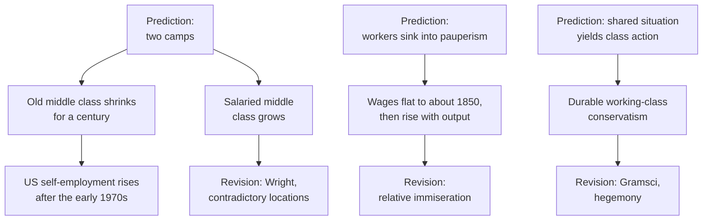

# Social Theory · Lesson 2.3: Capitalism and the test of history

> ⏱ ~15 min · Module 2: Marx as social theorist · Builds on: [2.1](02-01-historical-materialism.md), [2.2](02-02-class-class-consciousness-and-ideology.md), [1.4](01-04-testing-a-social-explanation.md) · Unlocks: [4.1](04-01-the-protestant-ethic-and-the-spirit-of-capitalism.md), [5.3](05-03-polanyis-great-transformation.md)

## Why this matters

Most social theories describe. Marx's also forecast: in 1848 the *Manifesto* said capitalist society was splitting into two camps, that the small owners in between would sink into the working class, and that the worker would sink into pauperism. They have met more than a century and a half of record. This lesson runs the test, then asks the harder question: when a prediction fails, does the tradition's revision add something checkable, or does it only protect the core?

## The idea

Marx says capitalism does four things to the people inside it. Only the last is a forecast.

**It commodifies.** [Commodification](../reference.md#commodification) is the spread of buying and selling into areas once run by custom, kinship or obligation, above all the sale of labour-power for a wage. The *Manifesto* says the bourgeoisie left no tie between people except cash payment. As an *empirical* claim, the drift of work from farms and workshops into wage employment is among the best-documented trends of the last two centuries. Whether commodifying a good corrupts it is an *evaluative* question that [`philosophy-of-economics` 5.1](../../philosophy-of-economics/lessons/05-01-commodification.md) owns, and Polanyi's sociological version is [5.3](05-03-polanyis-great-transformation.md).

**It alienates.** The 1844 Manuscripts' four [alienations](../reference.md#alienation) (from product, activity, species-being and other people) are taught in [`history-of-political-thought` 6.5](../../history-of-political-thought/lessons/06-05-marx-from-hegel-to-historical-materialism.md). Note only the kind of claim: it concerns the *structure* of the work, not the size of the wage, so no wage series can confirm or refute it.

**It mystifies.** [Commodity fetishism](../reference.md#commodity-fetishism) is from *Capital* vol. 1, ch. I §4 (Moore and Aveling). When producers meet only through their products, the value of a commodity looks like a property of the thing, as weight is. Marx calls it

> a definite social relation between men, that assumes, in their eyes, the fantastic form of a relation between things.

A rise in the price of coffee looks like a fact about coffee; for Marx it is a fact about growers, roasters and buyers linked in a division of labour none of them sees whole. In [1.3](01-03-understanding-webers-interpretive-method.md)'s terms this is an interpretive claim (how the relation appears to the actors) with a structural cause attached (production for exchange). It carries a comparative prediction too: in the same section Marx says the medieval serf knew that his work for his lord was a definite quantity of his own labour, so the mystification should vanish where dependence is personal.

**It polarizes and impoverishes:** the [polarization and immiseration](../reference.md#polarization-and-immiseration) predictions, the subject of the rest of the lesson.

## Source

*Manifesto of the Communist Party*, section I, "Bourgeois and Proletarians" (Moore translation, 1888):

> Our epoch, the epoch of the bourgeois, possesses, however, this distinctive feature: it has simplified the class antagonisms. Society as a whole is more and more splitting up into two great hostile camps, into two great classes directly facing each other: Bourgeoisie and Proletariat.
>
> The lower strata of the middle class--the small trades-people, shopkeepers, and retired tradesmen generally, the handicraftsmen and peasants--all these sink gradually into the proletariat, partly because their diminutive capital does not suffice for the scale on which modern industry is carried on, and is swamped in the competition with the large capitalists, partly because their specialized skill is rendered worthless by new methods of production.

"More and more splitting up" states a *trend*, not a finished state. "Lower strata" names a particular middle class: owners of a little capital or a craft skill, the **old middle class**. The passage gives two mechanisms, scale (small capital loses the competition) and technique (new methods make the skill worthless). And notice what it never mentions: salaried managers, clerks, engineers, teachers. What happened to *them* tests the two-camps sentence, not the lower-strata one.

## The argument

The forecast reconstructed from the *Manifesto* and *Capital* vol. 1, ch. XXV (*exegetical*):

1. **Capitalists compete, and one who does not cut costs is undersold and ruined.**
2. **Costs fall with scale and machinery,** so each capitalist must keep accumulating and mechanizing.
3. **∴ Capital concentrates,** and owners of small capital or craft skill cannot keep up. *In words:* the lower strata sink into wage labour.
4. **Machinery displaces workers faster than accumulation re-employs them,** creating a reserve army of the unemployed.
5. **The reserve army holds wages near subsistence.** *In words:* however much the economy grows, the worker's share is pinned down by the queue at the gate.
6. **∴ Immiseration and polarization:** a growing mass of propertyless workers, in worsening conditions, faces a shrinking class of owners. With a shared situation and the communication of 2.2, class action follows.

What kind of explanation is this? Not a bare benefit story of the kind [1.2](01-02-functional-explanation-and-its-critics.md) warned against. Premises 1–2 are an **individualist mechanism**: each capitalist acts under competitive pressure, and nobody intends concentration. The outcome, a class structure, is a **holist explanandum** produced by that mechanism. Because it names the [mechanism](../reference.md#mechanisms), it tells you where to look when the outcome fails to appear.

Marx also hedged. In *Capital* ch. XXV §4, after stating that the reserve army and official pauperism grow with accumulation, he adds:

> This is the absolute general law of capitalist accumulation. Like all other laws it is modified in its working by many circumstances, the analysis of which does not concern us here.

A few pages on he says the labourer's lot must worsen as capital accumulates, whatever his pay. That phrase is the root of the later **relative** reading of immiseration: a falling *share* or a worsening *position* rather than a falling standard of living.

**Where the argument is weakest.** At premises 4–5. A critic says the reserve army is a transitional state: displaced workers are re-employed once capital accumulation catches up with new techniques, and rising productivity then raises the demand for labour and with it the wage. A second critic attacks premise 6's silent assumption that the jobs large-scale capitalism creates will all be workers' jobs: managers, technicians and professionals earn wages but supervise or command scarce skills, and fit neither camp.

## The test

*Each prediction (top of a column), what the record showed, and the revision it provoked.*

**The evidence, with its strength** (*empirical*):

- **Immiseration.** Robert Allen's "Engels' pause" (*Explorations in Economic History*, 2009) finds that in Britain during roughly the first half of the nineteenth century the real wage stagnated while output per worker rose, the profit rate doubled and the profit share of national income grew. After mid-century wages rose with productivity. The *Manifesto* was written at the end of that pause. The long rise in real wages since, across every industrial country, is about as robust as economic history gets. Absolute immiseration, as a long-run forecast, failed.
- **The old middle class.** Its long decline is robust: farm and craft self-employment shrank for a century and more. But George Steinmetz and Erik Olin Wright ("The Fall and Rise of the Petty Bourgeoisie", *American Journal of Sociology*, 1989) found that US self-employment, after falling almost steadily from the nineteenth century to the early 1970s, then rose every year. The reversal held across definitions and was not a mere response to unemployment. That is one country, and a reversal at the margin.
- **The new middle class.** The growth of salaried managerial, professional and technical work through the twentieth century is robust. Wright (*Politics & Society*, 1984) called it the "embarrassment" of the middle class for Marxist theory.

**The revisions.** Eduard Bernstein (*Evolutionary Socialism*, German original 1899) accepted the data and dropped the forecast of collapse. Others reinterpreted it:

- **Relative immiseration** reads Marx as predicting a falling share, which Allen's first period shows and the later one mostly does not.
- **[Hegemony](../reference.md#hegemony).** Antonio Gramsci, writing in prison between 1929 and 1935 (English selections, 1971), argued that in the West the ruling class governs largely by *consent*, organized through civil society (churches, schools, press, parties), and kept up by real concessions to subordinate groups' economic interests that never touch the core of the system. Workers who accept capitalism are then not simply deceived; they are led. Overturning it takes a long "war of position" in civil society, not one assault on the state.
- **[Contradictory class locations](../reference.md#contradictory-class-locations).** Wright introduced the idea in 1976 (*New Left Review*) and rebuilt it in *Classes* (1985) around exploitation. There are three productive assets: means of production, organization (control of how work is coordinated) and skills or credentials. A manager is exploited as a wage-earner and exploits through organization assets, so he sits in two classes at once.

Which revisions earn their keep? Imre Lakatos (1970) called a research programme **progressive** when its revisions predict new facts and **degenerating** when they only absorb old failures; Karl Popper (*Conjectures and Refutations*, 1963) charged that Marxists had reinterpreted theory and evidence until nothing could refute them. Both views are [`philosophy-of-science`](../../philosophy-of-science/syllabus.md)'s to assess. Wright's revision passes Lakatos's test: it predicts that income and pro-capitalist attitudes rise step by step with assets, and he took that prediction to survey data. Hegemony is harder to test, because consent can be invoked to explain whatever workers do. The question to ask of it is what pattern of working-class politics it *forbids*.

## Worked examples

**Example 1 (the mechanism run on Britain).** Run premises 1–5 on 1800–1850. Mechanization in textiles displaces hand-loom weavers; output per worker rises; wages stay flat; profits swell. Every premise fits, which is why the *Manifesto* could read the forecast off the evidence in front of it. Then run it on 1850–1900. Premise 4 fails: on Allen's account accumulated capital caught up with the new techniques, labour demand rose, and wages climbed with productivity. Because the theory names its mechanism, the test locates the break: not at competition (premises 1–3 held), but at the claim that displacement outruns re-employment *permanently*.

**Example 2 (hard case: similar economies, different politics).** Wright's survey data (1984) compared the United States and Sweden, two rich capitalist countries at similar levels of development, with class locations defined the same way in both. He sorted class categories by whether their members' attitudes lined up with workers' or with capitalists'. In the United States about 58 per cent of the labour force fell in the working-class coalition and about 30 per cent in the bourgeois one. In Sweden the working-class coalition ran from 73 to 80 per cent, depending on where semi-credentialed managers were placed, and the bourgeois coalition was only about 10 per cent. Similar economies, then, but very different class formation. Gramsci's reading absorbs this easily: decades of social-democratic organization built a different consent. But it strains historical materialism's claim that the base explains consciousness ([2.1](02-01-historical-materialism.md)). If the same base yields such different politics, organization and ideology are doing the explaining, and the economic base only sets limits. Readers divide on whether that is a refinement or a retreat.

## Watch out

- **You might think the rise of the middle class refutes the whole *Manifesto*, but actually it refutes one sentence of it.** The lower-strata prediction concerned the *old* middle class, which did shrink for a century; the two-camps prediction is what the salaried middle class tells against. Keep them apart when you test.
- **You might think fetishism and alienation failed the test along with immiseration, but actually they are different kinds of claim.** Fetishism is interpretive and alienation structural; neither predicts a wage series. Whether they are *true* is a separate question from whether rising wages answer them, and whether commodified life is *bad* is evaluative and belongs to [`philosophy-of-economics`](../../philosophy-of-economics/lessons/05-01-commodification.md).
- **You might think a revision is honest or ad hoc by its content, but actually the test is what it predicts next.** "Workers consent because they are led" is progressive only if it forbids something.

## One-liner

> Marx bet that competition would empty the middle and impoverish the bottom; the old middle did empty and wages stalled for a time, but the new middle grew and wages rose, and the tradition's revisions are worth exactly as much as the new facts they predict.

## Problems

**P1 (🟢) *(Exegetical.)*** Diagnose. From an invented market report in a regional business paper, not the words of any real person or outlet:

> "Copper had a cruel year. The metal turned on the mining towns, punished the smelters and rewarded the speculators. Prices simply follow the laws of supply and demand, and no one can argue with a law of nature."

Name the two places where the report shows what Marx calls commodity fetishism, and say what the relation behind each one is on Marx's account. Three sentences or fewer.

**P2 (🟡) *(Exegetical (a) · Evaluative (b).)*** Evaluate against evidence. Steinmetz and Wright (1989) found that US self-employment fell almost steadily from the nineteenth century to the early 1970s and then rose every year, that the rise held across definitions and was not just a response to unemployment, and that it came partly from the growth of service sectors where self-employment is common and partly from more self-employment *within* traditional industrial sectors.

(a) Which prediction in the lesson's **Source** passage does this bear on directly, and why does it leave the main challenge to the other prediction untouched? Two sentences.

(b) Does the reversal count against the *Manifesto*'s forecast? Give the strongest defence a Marxist could make, say what evidence would test that defence, and give your verdict. 120 words or fewer.

**P3 (🔴) *(Exegetical (a)-(b).)*** Find the crux. In the 1950s and 1960s a large minority of British manual workers voted Conservative. Robert McKenzie and Allan Silver (*Angels in Marble*, 1968) interviewed working-class voters in English cities and distinguished "deferentials", who preferred leaders of high social standing and saw the Conservatives as the natural party of government, from "seculars", who backed the party for its record and competence. (Their "secular" is not Module 7's sense.)

(a) State an orthodox reading and a Gramscian reading of these voters, and name the single premise one side must affirm and the other deny. 100 words or fewer.

(b) Say what evidence would move the dispute, and why the "seculars" fit neither reading well. 80 words or fewer.

Solutions

**P1** *(Exegetical.)*

**Must hit, strict:**

- **Copper as an agent.** The metal "turned on", "punished" and "rewarded" people. A relation among people (miners, smelters, buyers, speculators, linked through exchange) appears as the action of a thing.
- **Prices as natural law.** "Laws of supply and demand" likened to "a law of nature". A social relation of production for exchange, which has a history and could be organized otherwise, appears as a natural property of things.

**Wrong turns:** treating the speculators' gains as the fetish (that is a distributional complaint, not the inversion of relation into thing); saying Marx denies that supply and demand move prices. His claim is about what such movements *are*, not that they do not happen.

**Model answer:** The report makes copper the actor that punished towns and rewarded speculators, when the price movement is the outcome of relations among producers, processors and buyers who meet only through the metal. It also calls price movements a law of nature, presenting a social arrangement, production for exchange, as if it were a physical property of things. Both are what Marx means by a social relation taking the "fantastic form of a relation between things".

---

**P2** *(Exegetical (a) · Evaluative (b).)*

**Must hit, strict (a):**

- It bears directly on the **lower-strata** prediction: small owners "sink gradually into the proletariat". Self-employment is the measure of that old middle class.
- The main challenge to the **two-camps** sentence is the salaried new middle class, and salaried employees are not self-employed, so the study is silent on them (and on immiseration).

**Must hit, any verdict (b):**

- State that the fall up to the 1970s fits the forecast and the reversal is a robust departure from it, in one country.
- Give the strongest defence. Either the new self-employed are disguised wage labour (dependent contractors who own no real means of production, which Wright would call a contradictory location), or the reversal is a temporary eddy in a long trend.
- Name evidence that would test the defence: whether the new self-employed employ others, own their equipment and control their work, or depend on a single client; and whether the reversal persisted.
- Give a verdict that follows from those moves.

**Wrong turns:** reading the reversal as refuting the two-camps prediction (that is the salaried middle class's job); offering the "unemployment pushes people into self-employment" defence, which the study's own finding that the rise was not merely countercyclical already weakens.

**Model answer (b), one of several:** The century-long fall fits the *Manifesto*; the reversal is robust across definitions but is one country and modest. The best defence is that much new self-employment is wage labour by another name: contractors who own little, employ no one and depend on one client. If most of the new self-employed own their means of work, hire others or serve many clients, the defence fails; if most are dependent contractors, the forecast survives in substance. Verdict: the defence is plausible for service work but weak where self-employment grew inside traditional industries, so the forecast is at best partly saved.

---

**P3** *(Exegetical (a)-(b).)*

**Accept:** any crux that turns on whether the economic situation by itself eventually fixes workers' politics, with the two readings stated as below.

**Must hit, strict (a):**

- **Orthodox reading:** the deferentials have absorbed the ruling ideas of the ruling class (2.2). Their conservatism is consciousness lagging behind their situation, and polarization and worsening conditions will strip it away.
- **Gramscian reading:** their consent is actively organized through civil society (deference to social leaders, church, schooling, press, the party itself) and sustained by real concessions. It will not dissolve on its own; it has to be contested.
- **Crux:** whether the material situation, unaided, eventually determines political consciousness. The orthodox reader affirms it; the Gramscian denies it and makes consent an independent, organized achievement.

**Must hit, strict (b):**

- **Evidence that would move it:** whether working-class Conservative voting falls as workers' economic conditions worsen or converge (orthodox), or tracks institutional ties and deference attitudes even when economic position is held constant (Gramscian). A comparison across places or periods with different civil-society institutions but similar economic positions would help most.
- **Why the seculars fit neither:** they back the party on its performance. That is an interest-based judgement, so not deference produced by hegemony, but it is not class-based either, so not false consciousness waiting to dissolve. It points to a third rival: retrospective voting on competence.

**Wrong turns:** making the crux whether these workers were "really" acting against their interests (an evaluative question neither part asks, and both readings can be stated without settling it); treating hegemony as a synonym for false consciousness, which erases the concessions and the active organizing that make it Gramsci's idea.

**Model answer (a):** The orthodox reader sees deferential Tories as having absorbed the ruling class's ideas, a lag that worsening conditions and polarization will erase. The Gramscian sees a consent built and maintained through the institutions of civil society and paid for with real concessions, which lasts until it is contested. The crux: does economic situation, unaided, eventually fix political consciousness? The orthodox reader must say yes, the Gramscian no.

**Model answer (b):** Check whether working-class Conservative voting moves with economic hardship or with institutional ties and deference attitudes, holding economic position fixed. The seculars support the party for competence: neither led into consent nor misled about class, they suggest plain retrospective voting.

## Flashback

**From Lesson [2.1](02-01-historical-materialism.md) (Historical materialism):** *(Exegetical (a) · Evaluative (b).)* Apply to a hard case. In 1853–54 American warships under Commodore Matthew Perry pressed Tokugawa Japan into opening its ports. In January 1868 rule was restored to the emperor, and the new government, led by officials most of whom were samurai by birth, took up the slogan *fukoku kyōhei*, "rich nation, strong army". Within a few years it took the feudal order apart. In 1871 it turned the 261 surviving domains into prefectures under central control. In 1873 it introduced conscription, cutting military service loose from hereditary warrior status, and replaced the tax paid in rice with a cash tax on the value of land, issuing private land titles. Through the 1870s it ended the samurai's hereditary stipends. It also built factories itself, such as the Tomioka silk mill (1872, French equipment), which it sold to Mitsui in 1893.

(a) Lesson 2.1 names three candidate mechanisms that could connect a set of relations' fit with the forces to the relations' being there. Which does this case instance, and which does it not? Two sentences.

(b) Does the case support Cohen's primacy thesis or strain it? Name the premise at stake, the best reply a Cohen defender has, and what that reply costs. 120 words or fewer.

Solution

**Must hit, strict (a):**

- It instances **competition between states**, working through **rulers choosing on purpose**: officials remade property, tax and military relations with the stated aim of a rich nation and a strong army, under the pressure of Western military and industrial power.
- It does not instance **class struggle won by a rising class**. No bourgeoisie or peasantry won power and installed the new relations; they were imposed from above by men of samurai birth, at the expense of their own order's domains, stipends and monopoly of arms.

**Must hit, any verdict (b):**

- The premise at stake is P2 (with P4): a society's relations are explained by the level *its* forces have reached, and they go when they fetter those forces. Here Japan's feudal relations were dismantled before its own forces had outgrown them. The factories came after the reforms, built by the state, and the forces that set the standard were foreign.
- The best reply moves selection to the system of states: relations are selected for developing the forces against the standard set by rival powers, and this case shows the mechanism Elster asked for in plain view. 2.1's note on Gerschenkron's late industrializers, leaning on the state, fits the state-built mills.
- The cost: primacy no longer explains a society's relations by its own forces, so it predicts less about any one society, and selection now runs through elites' foresight, a step that depends on what rulers believed. Name a test, for instance whether states under similar pressure whose rulers did not reform were overtaken or dominated.
- A verdict that follows from those moves.

**Wrong turns:** treating the case as a refutation of "the machine decides" (Cohen's reading never claimed technology pushes relations into being; see 2.1's Watch out); calling it class struggle because the samurai were a class, when they acted against their own class's privileges; reading "rich nation, strong army" as an evaluative claim the problem asks you to judge.

**Model answer (b), one of several:** It strains P2. Japan's feudal relations were scrapped before Japan's own forces had outgrown them; the mills followed the reforms, and the forces that set the bar were foreign warships and industry. The best reply moves selection to the system of states: relations are selected for developing the forces against rival powers' standard, and here the mechanism is visible, rulers reforming on purpose under military threat. The cost is that primacy stops explaining a society's relations by its own forces, and selection now runs through what elites foresaw. The reply earns its keep only if states under similar pressure that did not reform were overtaken. It survives, but as a theory of the world system, not of societies.

## Connections

- **Backward:** The forecast is historical materialism ([2.1](02-01-historical-materialism.md)) applied to one mode of production; class action from a shared situation is [2.2](02-02-class-class-consciousness-and-ideology.md)'s account. Mechanisms, comparison and confounding are [1.4](01-04-testing-a-social-explanation.md)'s tools, and fetishism's interpretive half is [1.3](01-03-understanding-webers-interpretive-method.md)'s adequacy at the level of meaning. Finding the crux is [`philosophical-method` 4.3](../../philosophical-method/lessons/04-03-finding-the-crux.md).
- **Forward:** Weber's rival account of capitalism's origins is [4.1](04-01-the-protestant-ethic-and-the-spirit-of-capitalism.md), and his salaried bureaucrat, the new middle class seen from the other side, is [4.4](04-04-bureaucracy-rationalization-and-disenchantment.md). Labour as a fictitious commodity and the backlash against commodification are Polanyi's double movement in [5.3](05-03-polanyis-great-transformation.md). Module 2's boss problem returns to the 1859 Preface.
- **Sideways:** Alienation and the political Marx are [`history-of-political-thought` 6.5](../../history-of-political-thought/lessons/06-05-marx-from-hegel-to-historical-materialism.md) and 6.6; whether markets corrupt what they price is [`philosophy-of-economics` 5.1](../../philosophy-of-economics/lessons/05-01-commodification.md); progressive vs degenerating research programmes belong to [`philosophy-of-science`](../../philosophy-of-science/syllabus.md).
