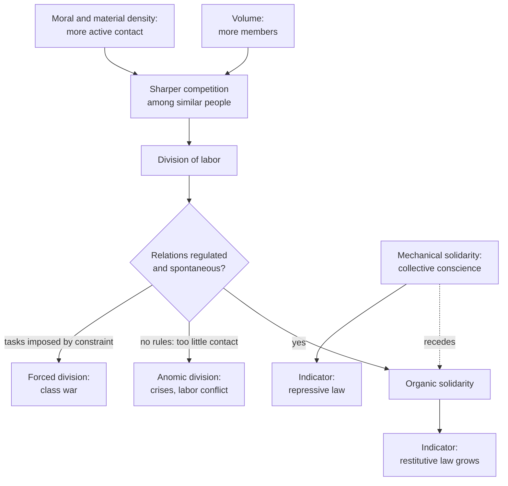

# Social Theory · Lesson 3.1: The division of labor and social solidarity

> ⏱ ~15 min · Module 3: Durkheim · Builds on: [1.1 Individuals and social facts](01-01-individuals-and-social-facts.md), [1.2 Functional explanation](01-02-functional-explanation-and-its-critics.md), [1.4 Testing a social explanation](01-04-testing-a-social-explanation.md) · Unlocks: [3.2 Suicide](03-02-suicide.md), [3.3 Religion as social](03-03-religion-as-social-the-elementary-forms.md)

## Why this matters

You hand your child's prescription to a pharmacist you will never see again, who shares almost none of your beliefs, and you trust her completely. A modern society is millions of such strangers, agreeing on far less than any village ever did, and it holds together anyway. Durkheim's first book, *De la division du travail social* (1893), asks what holds it, answers that difference itself can bind, and then does what turns a sermon into social science: it proposes a way to *measure* the bond, through the law. Its terms (collective conscience, anomie) run through the rest of Module 3.

## The idea

A group can hang together in two ways.

- **By likeness.** Everyone believes, works and worships alike. Offend the shared beliefs and you offend everyone, and everyone wants you punished. Durkheim calls this **mechanical solidarity**, by analogy with an inert body whose molecules move together only because none moves on its own (Book I, ch. 3).
- **By interdependence.** People differ, specialize, and need each other, like the organs of a body: each has its own character, yet the organism's unity grows *with* the individuation of its parts. This is **organic solidarity**.

The glue of the first is the [collective conscience](../reference.md#collective-conscience): the beliefs and sentiments common to the average member of a society, forming a system with its own life. It outlasts the individuals and is the same across regions and trades, though it exists only in individuals (Book I, ch. 2, paraphrased). (French *conscience* means both "consciousness" and "conscience"; translators differ.) The two bonds pull against each other: the more of each person the collective conscience fills, the less room there is for the individuality that organic solidarity needs.

Durkheim's story is that as societies grow in **volume** (members) and **density** (how many people are in active contact), mechanical solidarity loses ground and organic solidarity becomes preponderant. But solidarity is invisible. How do you tell which kind a society has? Look at its law. Durkheim classifies legal rules by their **sanction**:

- **Repressive** sanctions inflict a *pain* on the offender. This is penal law.
- **Restitutive** sanctions need not make anyone suffer. They *restore* things to their normal state by forcing performance, ordering damages, or annulling an act. Civil, commercial, procedural, administrative and constitutional law all count, minus any penal rules they contain.

Crime is defined *relationally*: an act is criminal when it offends strong, defined states of the collective conscience. "We do not condemn it because it is a crime; it is a crime because we condemn it" (Book I, ch. 2, my translation). So repressive law tracks mechanical solidarity, and the law of contract, property and commerce, which coordinates people who differ, tracks organic solidarity. Compare the two bodies of law and you have compared the two bonds. This is the [repressive and restitutive law](../reference.md#repressive-and-restitutive-law) index.

Book III adds that the division of labor binds only in its normal form. In the **anomic** form, specialized functions have no rules adjusting them to each other: commercial crises, bankruptcies, conflict between labor and capital. Such rules grow out of sustained contact, so they fail to form when organs are not in close enough or long enough contact, as when a producer serves a vast market he cannot see. In the **forced** form, people are assigned to tasks by external constraint rather than aptitude, and class war follows. Solidarity needs spontaneity, which requires equality in the external conditions of competition. The preface to the second edition proposes a remedy for [anomie](../reference.md#anomie): occupational groups that supply the missing regulation.

## Source

Book I, ch. 1 (1893), my translation:

> But social solidarity is a wholly moral phenomenon which, by itself, lends itself neither to exact observation nor, above all, to measurement. To carry out this classification and this comparison, we must therefore substitute for the internal fact that escapes us an external fact that symbolizes it, and study the first through the second. This visible symbol is law. […] the number of these relations is necessarily proportional to the number of legal rules that determine them.

Three things to notice. "Substitute … an external fact" is a measurement strategy, and a page later Durkheim compares it to studying heat through the expansion of bodies. "Necessarily proportional" is the bridge premise, and it is very strong. And he raises the obvious objection himself: some relations are regulated only by custom (*mœurs*), so law reflects only part of social life. His reply is that custom is normally the *base* of law, not its rival. They diverge only in rare, pathological cases where outdated law survives by habit, and any bonds that custom alone expresses are secondary.

## The argument

Durkheim keeps two questions apart. Book I asks the division of labor's *function*, which he defines as the need it corresponds to. Book II asks its *causes*, and its first chapter rejects explaining it by the happiness it brings. In [1.2](01-02-functional-explanation-and-its-critics.md)'s terms, he does not explain the division of labor by its benefits: he gives a causal explanation, plus a separate claim about what it does.

**A. The index (Book I).**

1. Social solidarity is a moral fact that cannot be observed or measured directly.
2. Every lasting social relation takes organized form, and law is that organization at its most stable. So law varies with the relations it regulates. *In words:* whatever bonds exist will show up in law.
3. Repressive sanctions answer offenses against strong, defined collective sentiments. Restitutive sanctions restore relations between parties who differ.
4. Custom that diverges from law is rare and pathological, and bonds that only custom expresses are secondary.
5. ∴ The relative extent of repressive and restitutive law measures the relative weight of mechanical and organic solidarity.
6. In the oldest written codes almost all law is repressive; in modern codes, restitutive law dominates.
7. ∴ Organic solidarity has progressively displaced mechanical solidarity.

**B. The cause (Book II).**

8. As societies grow in volume and in material and "moral" density, more similar people compete for the same things.
9. Competition is fiercest among the most similar (he cites Darwin), and specializing lets them coexist.
10. ∴ "The division of labor varies in direct ratio to the volume and density of societies" (Book II, ch. 2, my translation). *In words:* crowding drives specialization, not anyone's plan for prosperity.

**What kind of explanation.** It is holist in the explanatory sense of [1.1](01-01-individuals-and-social-facts.md): both what explains (volume, density) and what is explained are [social facts](../reference.md#social-facts). Yet the mechanism in step 9 runs through individuals competing, and the ontology is modest: the collective conscience is realized only in individuals, and Durkheim declines to say whether it is a consciousness like an individual's. The evidence is [concomitant variation](../reference.md#comparison-and-concomitant-variation) across historical cases, with law as the measuring instrument.

**Where the argument is weakest.** Steps 2 and 4, the bridge from solidarity to law. A critic says law tracks other things: who holds power, how the state is organized, which societies wrote things down. On this view the "nearly all repressive" early codes reflect what survived, not how people were bound. The defender can say the index compares proportions *within* each society, and that divergent cases are the pathological ones step 4 sets aside. But that reply has a cost. If every awkward case can be called pathological, the index can no longer fail.

## The explanation

## Worked examples

**Example 1 (Durkheim's own test: the Pentateuch).** Book I, ch. 4 takes the oldest written code available to him, the last four books of the Pentateuch, and counts. Of four or five thousand verses, only a relatively tiny number state rules that could pass as non-repressive: property, family, loans and wages, quasi-delicts, public offices. Then he goes further. Because these rules are framed as divine commands whose breach must be expiated, he treats even the damages owed for killing an animal, set beside "eye for eye," as close to the talion. Set this against modern law, where on his account restitutive law has come to dominate, and step 6 is in hand. These are exegetical claims about Durkheim's coding. His ranking of societies as inferior and superior belongs to his period, and nothing here assesses the Hebrew law itself.

Watch the second move. Damages are the textbook restitutive sanction, yet Durkheim codes these as penal because of what they are *for*. That can be defended: a sanction's kind depends on its point, not its form. It is also exactly where a critic sees the index bending to fit.

**Example 2 (hard case: damages in small-scale societies).** Schwartz and Miller ("Legal Evolution and Societal Complexity," *American Journal of Sociology*, 1964) coded ethnographies of a cross-cultural sample for legal institutions. Mediation, police and counsel appeared in a cumulative sequence (mediation first, then police, then counsel) that tracked societal complexity. Damages, meaning property paid in lieu of other sanctions, were a necessary condition for mediation. So a restitutive device turns up early, in societies with little specialization, and a specialized enforcement organ only later. The authors voiced doubts about Durkheim's generalization. Upendra Baxi (*Law & Society Review*, 1974) argued that the findings did not definitively invalidate it, and Schwartz replied in the same issue.

- **Critic:** the index fails its central prediction. Simple societies' law is not overwhelmingly repressive.
- **Defender:** the study measured legal *institutions*, not the *proportion of rules* by sanction type. And a payment for an offense that also affronts the gods may be expiation, as Durkheim read the Pentateuch.

Evidence strength: one influential cross-cultural study and a published exchange over what it shows. The question is contested, not settled. Notice what is being tested: the index (steps 2–4), not the thesis that solidarity changes kind. If the index fails, the thesis loses its evidence, not necessarily its truth.

## Watch out

- **You might think** [organic solidarity](../reference.md#mechanical-and-organic-solidarity) means a society of contracts with nothing in common. **In fact,** Book I, ch. 7 argues against Spencer that non-contractual relations grow alongside contractual ones. The Conclusion holds that some common conscience always remains, at least the cult of the person and of individual dignity.
- **You might think** "the division of labor produces solidarity" explains why it exists. **In fact,** that is a claim about function. Durkheim's explanation is causal (density and competition). Running the two together is the benefit-claim error of [functional explanation](../reference.md#functional-explanation).
- **You might think** the anomic and forced forms are Durkheim's verdict that specialization is bad, or that the book shows modern society is fine. **In fact,** both are explanatory claims about the conditions under which the division of labor binds. Whether a differentiated society is a good one is evaluative, and this lesson does not argue it.

## One-liner

> Likeness binds simple societies and difference binds complex ones, and Durkheim says you can tell which bond you are looking at by asking whether the law punishes or repairs, provided the law is a faithful mirror, which is exactly what his critics doubt.

## Problems

**P1 (🟢) *(Exegetical.)*** Apply to a hard case. Classify each real legal change by Durkheim's sanction test (repressive, restitutive, or the removal of one), and say in one sentence what his index would read into it. (i) England and Wales's Coroners and Justice Act 2009 abolished the common-law offense of defamatory libel; defamation remains actionable in the civil courts for damages. (ii) The Criminal Justice and Immigration Act 2008 abolished the common-law offenses of blasphemy and blasphemous libel in England and Wales. (iii) Under the Powers of Criminal Courts Act 1973, a court convicting someone of an offense may order him to pay compensation for any personal injury, loss or damage resulting from it. Two sentences per item.

**P2 (🟡) *(Exegetical (a) · Evaluative (b).)*** Evaluate against evidence. (a) State, from the Source and Example 1, the two premises that license reading solidarity off the law, and say which one Durkheim himself defends against an objection. Two sentences. (b) In Example 1 Durkheim codes the Pentateuch's damages as expiation. Does that move make the index unfalsifiable, or is there a principled test that could tell expiation from restitution in a given case? Say what evidence about a particular society would apply that test. 120 words or fewer.

**P3 (🔴, optional) *(Exegetical.)*** Diagnose. From an invented op-ed in a regional paper, not the words of any real person or outlet:

> "Look at the warehouse strikes, the freelancers suing platforms, the courts drowning in contract disputes. Specialization is tearing us apart. When people did the same work and shared the same faith, there was harmony. The cure is a year of national service, so that everyone again thinks and lives alike."

(a) Which kind of solidarity does the author assume is the only kind, and what does Durkheim say about recovering it in a large, dense society? (b) Name the abnormal form or forms Durkheim would see in the strikes and the platform disputes, and the remedy he points to instead. (c) On Durkheim's index, what does a rise in contract litigation indicate? 120 words or fewer in total.

Solutions

**P1** *(Exegetical — strict.)*

**Must hit, strict:**

- (i) A repressive sanction is removed, and the restitutive one (civil damages) stays. The index reads a further shift of the same relation from mechanical toward organic solidarity: defamation is now treated as a wrong between parties, to be repaired, not an offense against collective sentiment to be punished.
- (ii) A repressive sanction is removed, with no restitutive replacement. The index reads a shrinking of the strong, defined states of the collective conscience. Durkheim himself traces the steadily shortening list of religious crimes in Book I. This is a claim about which sentiments are collective and how intensely; it is silent on the truth or worth of any religion.
- (iii) Restitutive, though imposed by a criminal court. The order is measured by the victim's loss and repairs it, and Durkheim classifies by sanction, not by which body of law a rule sits in. The index reads restitutive principles entering penal procedure.

**Wrong turns:** calling (iii) repressive because a criminal court imposes it (the test is the sanction's character, not the forum); reading (ii) as Durkheim's verdict on religion's truth, or as evidence for one; treating (i) as neutral because "defamation is still illegal" (the sanction's kind changed).

**Model answer:** (i) The repressive sanction is gone and the restitutive one remains, so the index reads a move toward organic solidarity. (ii) A repressive rule is abolished with nothing restitutive in its place, which the index reads as a weaker, less defined collective conscience on this point, just as Durkheim read the shrinking list of religious crimes. (iii) The compensation order is restitutive because it is measured by and repairs the loss, even though a criminal court imposes it, so restitutive law is growing inside penal procedure.

---

**P2** *(Exegetical (a) · Evaluative (b))*

**Must hit, strict (a):**

- Premise one: law varies with, and is "necessarily proportional" to, the social relations it regulates (step 2).
- Premise two: custom does not normally diverge from law, and bonds expressed only in custom are secondary (step 4).
- Durkheim defends the second against the objection he raises himself, that custom regulates relations the law leaves out.

**Must hit, any verdict (b):**

- State the worry precisely: if form is overridden by purpose whenever the count goes wrong, the coding can be adjusted to fit the prediction.
- Propose or reject a test independent of the prediction: for example, whether the payment is scaled to the victim's loss or to the offender's guilt; whether it goes to the victim or to a temple, chief or community; whether it is paired with ritual purification.
- Say whether such evidence is available for the case and how the verdict depends on it.

**Wrong turns:** answering whether Hebrew law was "really" religious (not the question); concluding the index is refuted by the move alone without asking whether an independent test exists.

**Model answer (b), one of several:** The move is not unfalsifiable in principle, because "expiation" and "restitution" make different observable predictions. A restitutive payment is scaled to the loss, goes to the injured party, and closes the matter once paid. An expiatory one is scaled to the offense's gravity, may go to a sacred or collective recipient, and comes with rites of purification. For a given society, ethnographic or textual evidence on who receives the payment and how it is measured would apply the test. The danger is practical: Durkheim did not state such a test in advance, so his coding of the Pentateuch looks fitted after the fact. The repair is to fix the criteria before counting.

---

**P3** *(Exegetical — strict.)*

**Must hit, strict:**

- (a) Mechanical solidarity, solidarity by likeness. On Durkheim's account it cannot again be the main bond of a large, dense society: rising volume and density drive specialization, he holds that societies grow steadily denser, and he calls the retreat of mechanical solidarity a law of history. The op-ed wants likeness back without reversing its cause.
- (b) Strikes: the anomic form (functions whose relations are not regulated), or the forced form if workers hold their tasks by constraint rather than aptitude, through unequal external conditions. Either answer passes if tied to its condition. Remedy: regulation through occupational groups (the second-edition preface), and for the forced form, equality in the external conditions of competition. Not restored likeness.
- (c) Restitutive law at work. On the index, more contract disputes means more relations regulated by restitutive law, a sign of organic solidarity, not of its collapse.

**Wrong turns:** saying Durkheim agrees that specialization destroys solidarity (Book III makes the failures conditional, not inherent); reading litigation as social breakdown on Durkheim's terms; treating the op-ed's preference for national service as the thing to grade (the task is to name the framework).

**Model answer:** (a) The author assumes mechanical solidarity, solidarity by likeness, is the only kind. On his account the volume and density that drive specialization keep growing, so likeness cannot again be a large society's main bond. (b) The strikes and platform disputes look like the anomic division of labor, functions without rules adjusting them, or the forced division if people are held in their tasks by unequal conditions. His remedy is regulation through occupational groups and fairer external conditions. (c) Growing contract litigation is restitutive law expanding, which on his index signals organic solidarity.

## Flashback

**From Lesson [2.2](02-02-class-class-consciousness-and-ideology.md) (Class, class consciousness, and ideology):** *(Exegetical (a) · Evaluative (b).)* Britain's miners' strike against pit closures ran from 6 March 1984 to 3 March 1985. On Lesson 2.2's account miners are the easy case: concentrated in pit villages and linked by one national union, the National Union of Mineworkers. Yet the union held no national ballot and let each area decide. In Nottinghamshire's March 1984 area ballot only about a quarter voted to strike. More than a fifth of mineworkers nationally kept working, Nottinghamshire's above all, and Yorkshire strikers sent pickets into the county.

(a) Place the Nottinghamshire split on 2.2's chain from common situation to class action. Which links were present, which failed, and which obstacle named in that lesson's diagram does the case illustrate? Two sentences.

(b) Consider two rival explanations of why Nottinghamshire worked. **(i)** Step 1 fails: miners whose pits faced little threat of closure had different interests from miners whose pits faced a lot, so position did not fix one interest. **(ii)** The chain held but its procedure did not: many Nottinghamshire miners judged a strike called without a national ballot illegitimate. Say what observation would favour each, and whether the case counts against 2.2's prediction that concentrated, connected workers organize more. 100 words or fewer; any verdict. You are not asked whether the strike was justified.

Solution

**Must hit, strict (a):**

- Present: the common situation (wage-workers facing the same closures) and the conditions for contact and organization (concentration, one national union).
- Failed: the step from combinations to a single national struggle (steps 4–5). The union could not weld its areas into one national action.
- Obstacle: division among the workers themselves, the "Competition among workers" arrow into "Combinations and unions". "Ruling ideas" is not the answer the facts supply; choosing it needs evidence the case does not give.

**Must hit, any verdict (b):**

- (i) predicts that striking tracks each pit's exposure to closure, including inside Nottinghamshire: threatened Nottinghamshire pits should have struck more than safe ones.
- (ii) predicts that striking tracks views on the ballot whatever the closure risk: Nottinghamshire miners in threatened pits should have worked too, and miners' own stated reasons should cite the missing ballot. That is meaning-level evidence in the sense of Lesson 1.3.
- On the prediction: it is comparative, concentrated and connected workers against scattered ones. Nottinghamshire's miners were concentrated too, so the case holds concentration roughly fixed and shows something else deciding. It tells against concentration being *sufficient*, not against the comparison.

**Wrong turns:** explaining the working miners by ideology or "false consciousness" with no evidence independent of the vote. Lesson 2.2's August 1914 warning applies: if every failure is renamed betrayal or ideology, nothing can count against the theory. Treating (ii) as outside Marx's chain, when a dispute over how the union decides sits inside steps 4–5. Arguing whether the strike was right.

**Model answer:** (a) Common situation and the means of organization were there: concentrated workers and one national union. What failed was the step from combinations to a single national struggle, through division among the workers themselves. (b) If (i) is right, participation should follow each pit's closure risk, so threatened Nottinghamshire pits should have struck more than safe ones. If (ii) is right, Nottinghamshire miners should have worked whatever their pit's risk, and named the ballot as their reason. The case does not refute the concentration prediction, which compares concentrated with scattered workers. It shows concentration is not enough.

## Connections

- **Backward:** The collective conscience is [1.1](01-01-individuals-and-social-facts.md)'s social fact at its fullest: external to individuals, constraining, yet realized only in them. Book I's function and Book II's causes are kept apart exactly as [1.2](01-02-functional-explanation-and-its-critics.md) asks. The law index is a case of [1.4](01-04-testing-a-social-explanation.md)'s problem of measuring an unobservable through an indicator. The forced division of labor is Durkheim's rival to [2.2](02-02-class-class-consciousness-and-ideology.md): for Marx class conflict is built into capitalist relations of production; for Durkheim it is an abnormal form, removable by equalizing external conditions.
- **Forward:** Anomie becomes a type of suicide in [3.2](03-02-suicide.md), where regulation is one of the two axes. The collective conscience and its sacred objects return in [3.3](03-03-religion-as-social-the-elementary-forms.md). The occupational groups proposed against anomie sit beside Tocqueville's associations in [6.1](06-01-tocqueville-on-associations.md).
- **Sideways:** Rousseau argued that division of labour turns small natural inequalities into large conventional ones ([`history-of-political-thought` 4.3](../../history-of-political-thought/lessons/04-03-rousseau-discourse-on-inequality.md)). Durkheim's spontaneous division claims the reverse: where external conditions are equal, tasks follow aptitude. Smith's natural propensity to truck and barter, the explanation [`history-of-debt` 1.1](../../history-of-debt/lessons/01-01-credit-before-coins.md) examines, is the kind of individual-benefit account Book II sets aside. Whether a legal order *should* punish or repair belongs to [`philosophy-of-law`](../../philosophy-of-law/syllabus.md).
