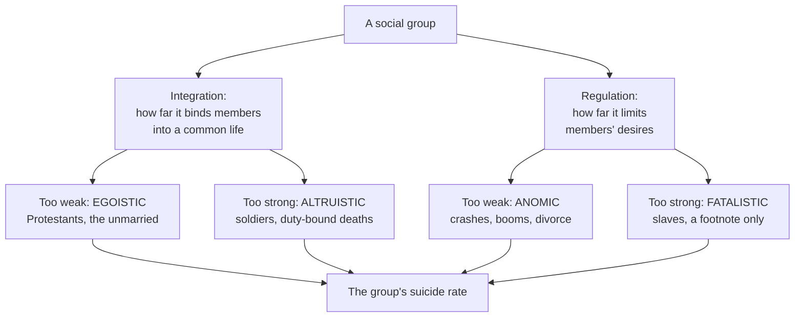

# Social Theory · Lesson 3.2: Suicide

> ⏱ ~15 min · Module 3: Durkheim · Builds on: [1.1 Individuals and social facts](01-01-individuals-and-social-facts.md), [1.4 Testing a social explanation](01-04-testing-a-social-explanation.md), [3.1 The division of labor and social solidarity](03-01-the-division-of-labor-and-social-solidarity.md) · Unlocks: [3.3 Religion as social: *The Elementary Forms*](03-03-religion-as-social-the-elementary-forms.md)

## Why this matters

If any act looks purely individual, it is suicide: one person, one decision, private reasons. Durkheim chose it for exactly that reason. *Le suicide* (1897) set out to show that even here a **rate** has social causes that no list of individual motives can supply. The book is still the standard demonstration of the holist method, and still the standard case study of what goes wrong when you infer individual behaviour from group statistics. You need both halves.

## The idea

Durkheim defines his object first (my translation from the French):

> We call suicide every case of death that results directly or indirectly from a positive or negative act, carried out by the victim himself, which he knew would produce this result.

The definition turns on knowledge, not intention, so a soldier who goes to certain death for his unit counts. That choice matters later.

**Rates, not cases.** Durkheim's move is to stop looking at single deaths and look at the yearly total for a society. He observes (Book I, Introduction) that this number is nearly constant from year to year within a society, while it differs a great deal between societies and between groups. A stable, group-specific rate is a **[social fact](../reference.md#social-facts)** in the sense of [1.1](01-01-individuals-and-social-facts.md): it belongs to the collective, not to any member. So it should be explained by other social facts.

**Two things a group does to its members.** Book II, chapters 2–5, rests on two dimensions:

- **Integration**: how far the group draws its members into a common life, with shared beliefs, practices and attention to common ends.
- **Regulation**: how far the group sets limits on its members' desires and expectations.

Each can fail in two directions, which gives the **[four types of suicide](../reference.md#four-types-of-suicide)**. Too little integration produces *egoistic* suicide: the individual's own ends become the only ones, and life loses its hold. Too much produces *altruistic* suicide: the self counts for so little that the group's demands override it. Too little regulation produces *anomic* suicide: desires lose their limits after a sudden change, in a crash or a boom. Too much produces *fatalistic* suicide, which Durkheim mentions only in a footnote to the anomie chapter, describing those "whose future is pitilessly walled in, whose passions are violently choked by an oppressive discipline" (my translation).

**Keep three kinds of claim apart.** *Exegetical:* what Durkheim argued, read from the 1897 French text. *Explanatory:* whether integration and regulation really explain the rates; the evidence strength is stated as we go. *Evaluative:* whether modern societies should be more integrated, or whether religious belief is true, is not argued here.

## Source

Book II, ch. 3, §VI, after Durkheim has examined religious, family and political groups (my translation):

> It is not to the special nature of religious feeling that religion owes its effect, since domestic and political societies produce the same effects when they are strongly integrated. … Conversely, it is not what is specific to the domestic or political bond that explains the immunity they confer, since religious society has the same privilege. The cause can only lie in a property that all these social groups possess, though perhaps in different degrees. Now the only one that meets this condition is that they are all strongly integrated social groups. We thus reach this general conclusion: suicide varies inversely with the degree of integration of the social groups of which the individual is a part.

Read it slowly. The form is Mill's **method of agreement**: three different causes, one shared effect, so the effect follows their one shared property. Two words carry the weight. "Only" claims that integration is the *sole* common property, which a critic can contest by naming another, such as how deaths were recorded. And "integration" has not been measured independently of the rates it explains, a point the argument has to answer.

## The argument

**The integration argument (Book II, chs. 2–3), in Durkheim's terms.**

1. **Suicide rates are social facts.** They are stable within a society and differ systematically between groups. *In words:* a pattern belongs to the collective, so look for collective causes.
2. **Religious society protects in proportion to its cohesion.** Protestants have higher rates than Catholics, though both forbid suicide with equal severity. The difference lies in what Durkheim calls *libre examen*, free inquiry: the Protestant is more the author of his own belief, so fewer beliefs and practices are held in common. He treats Jews, a tightly knit minority, as the least prone of all.
3. **Family society protects in proportion to its density.** Married people, above all those with children, have lower rates than the unmarried of the same age.
4. **Political society protects when crisis draws it together.** In France the rate fell during the revolutions of 1830 and 1848, and in France and Germany during the war of 1870–71.
5. **The three share no content, only a property.** Doctrine, family affection and patriotism differ; what the groups share is integration: many shared beliefs and practices, held strongly.
6. **∴ Suicide varies inversely with the integration of the groups an individual belongs to** (the Source). *In words:* the weaker the common life you are part of, the more exposed you are.
7. **Mechanism.** A weakly integrated group has less hold to restrain its members, and leaves them with only their own ends, which Durkheim thinks too narrow to give a life meaning. *In words:* the cause works by thinning the reasons a person has to live.
8. **Regulation is a second, independent axis** (ch. 5). Economic crises raise the rate, and so do sudden booms: Italy's rate rose from 29 to 40.6 per million between 1864–70 and 1877, as industry took off. Durkheim concludes that poverty itself is no cause and may even protect.

**What kind of explanation is this?** Durkheim's explanation is holist in the *explanatory* sense of [1.1](01-01-individuals-and-social-facts.md): a property of the group explains a property of the group. It is not functional (premise 7 names a causal path, not a benefit). But step 7 is a claim about individuals, and the whole argument needs it.

**Where the argument is weakest.** At the step from group rates to individual mechanism, and at the data. Many of Durkheim's comparisons are between *areas*: provinces, cantons, countries. A province with more Protestants and more suicides does not show that the Protestants are the ones dying. That is the **[ecological fallacy](../reference.md#ecological-fallacy)** of [1.4](01-04-testing-a-social-explanation.md), named by W. S. Robinson (*American Sociological Review*, 1950). Second, the rates come from officials. Jack Douglas (*The Social Meanings of Suicide*, 1967) argued that whether a death is recorded as suicide depends on coroners, doctors and families, and that tightly knit communities are better placed to keep a death off the books. If so, integration lowers the *recorded* rate, a [recording-bias](../reference.md#recording-bias) rival that Durkheim's tables cannot rule out. Frans van Poppel and Lincoln Day (*American Sociological Review*, 1996), using Dutch individual death records, argued that much of the religious gap reflects how deaths were classified, with more Catholic deaths filed as sudden or of ill-defined cause. Miles Simpson (same journal, 1998) disputed their comparison. The question is **contested**. Third, integration is never measured on its own, which leaves the theory free to read any high rate as too little integration, or too much.

## The explanation

*Each axis is U-shaped: the rate is lowest at a middle level of [integration and regulation](../reference.md#integration-and-regulation) and rises toward either extreme.*

## Worked examples

**Example 1 (the theory at work): Protestants and Catholics in Bavaria.** Durkheim distrusts comparisons between countries (Spain or Portugal and Germany differ in too many ways), so he compares regions *within* one state. In Bavaria in 1867–75 he sorts provinces by Catholic share. His averages, per million inhabitants, converted to per 100,000:

| Provinces | Per million | Per 100,000 |
|---|---|---|
| under 50% Catholic | 192 | 19.2 |
| 50–90% Catholic | 135 | 13.5 |
| over 90% Catholic | 75 | 7.5 |

The ordering is clean: every province in the first group exceeds every province in the second, and every one in the second exceeds every one in the third. Where he has rates by confession, the gap is large: in Prussia in 1849–55, 159.9 Protestants per million against 49.6 Catholics, a ratio of $159.9/49.6 \approx 3.2$. This is **[comparison and concomitant variation](../reference.md#comparison-and-concomitant-variation)**: hold the state fixed, let the religious mix vary, watch the rate follow. *Explanatory status:* in the nineteenth-century Central European statistics he used, the association is consistent. Whether integration produces it is contested, for the reasons in the weak-point paragraph.

Notice what Durkheim does *not* claim. The protective effect, he says, does not come from a doctrine forbidding suicide, since both churches forbid it, but from the fact that a church is a society. That is an explanatory claim about effects. Whether a social account of religion bears on the *truth* of religious belief (the genetic-fallacy question) is not settled here; [3.3](03-03-religion-as-social-the-elementary-forms.md) flags it and [philosophy-of-religion](../../philosophy-of-religion/syllabus.md) owns it. Religious and secular readers can accept or reject the integration claim on the same evidence.

**Example 2 (where the theory strains): the army.** If integration protects, soldiers, who live a dense common life, should have *low* rates. Durkheim's Table XXIII shows the opposite: in Austria in 1876–90, 1,253 per million soldiers against 122 per million civilians of the same age, a ratio of about 10.3. In France the ratio was about 1.26. He rules out marriage status by comparing French soldiers in 1888–91 (380 per million) with unmarried men aged 20–25 (237), still a ratio of about 1.6. He then argues that military life trains a habit of impersonality: a soldier must set little value on his own person. His label: *altruistic* suicide, integration in excess.

This is where the U-shape stops being a strength. Protestants have high rates because they are integrated too little; soldiers because they are integrated too much. Without an independent measure of integration, taken before the rates are seen, the theory can fit a high rate in either direction. A rival also needs ruling out: soldiers carry weapons and live under a harsh discipline, so access to means and a [fatalistic](../reference.md#four-types-of-suicide) regime both predict the same excess. The test the theory needs is a group whose integration is rated in advance, with a prediction written down before the rate is checked.

## Watch out

- **You might think Durkheim explains why particular people die by suicide, but actually he explains rates.** He sets aside the motives recorded in official statistics as only the apparent causes, the weak points through which a social current reaches a person. Reading him as a theory of individual cases is the ecological fallacy of [1.4](01-04-testing-a-social-explanation.md).
- **You might think "integration protects" is a value judgment in favour of religion or traditional families, but actually it is an explanatory claim.** Durkheim himself holds that the old beliefs cannot be restored artificially and looks instead to occupational groups as a source of new integration. Whether more integration would be *good* is evaluative and not argued here.
- **You might think [anomie](../reference.md#anomie) means poverty or hardship, but actually it means a lack of regulation.** Durkheim's evidence is that booms raise the rate as crashes do; a theory of hardship would predict booms lower it.

## One-liner

> A suicide rate is a social fact: it rises when the groups a person belongs to hold them too loosely or too tightly, or regulate their desires too little or too much. The weakest step is going from area statistics to individual lives.

## Problems

**P1 (🟢) *(Formal (a) · Evaluative (b).)*** Evaluate against evidence. Durkheim reports French suicide rates per million, urban and rural:

| | Urban | Rural |
|---|---|---|
| 1866–69 | 202 | 104 |
| 1870–72 | 161 | 110 |

He reads the urban fall as greater integration during the war of 1870–71, felt most in the cities. A critic says wartime administrative disruption simply left suicides unrecorded. Durkheim replies that recording was *harder* in the countryside, so under-recording should have shown up there. (a) Convert all four rates to per 100,000 and give each group's percentage change. In one sentence, say why rates are the right measure here rather than France's yearly totals, given that France lost Alsace and most of Lorraine in 1871. (b) Does the urban–rural pattern defeat the recording-bias rival? 100 words or fewer, any verdict.

**P2 (🟡) *(Formal (a) · Exegetical (b)–(c).)*** Find the crux. Married men in France had far lower rates than unmarried men of the same age. Durkheim's explanation is family integration. The rival is **selection**: men who marry were already less at risk. Durkheim's Table XXI (France, 1889–91, men, per million of each age and marital status):

| Age | Unmarried | Married |
|---|---|---|
| 20–25 | 237 | 97 |
| 25–30 | 394 | 122 |
| 30–40 | 627 | 226 |

At ages 20–25 there were about 148,000 married men and 1,430,000 unmarried. (a) Give each rate per 100,000, and the **[coefficient of preservation](../reference.md#coefficient-of-preservation)** (unmarried rate ÷ married rate) for each age group. (b) Durkheim argues that if selection were the cause, the coefficient would start small and rise to a peak at 30–40, when sorting into marriage is complete. Say why he expects that and whether the numbers fit. (c) Name the premise about *how* selection works that Durkheim's test assumes and a defender of selection must deny, and say what evidence would settle it. 120 words or fewer for (b) and (c) together.

**P3 (🔴, optional) *(Exegetical (a) · Evaluative (b).)*** Apply to a hard case. Jane Pirkis and colleagues (*The Lancet Psychiatry*, 2021) compared observed suicides in April–July 2020 with the numbers expected from pre-pandemic trends, using official data from 21 countries (16 high-income, 5 upper-middle-income; whole countries in 10, areas within countries in 11). They found no evidence of a significant increase anywhere, and a decrease relative to expected in 12 countries or areas. (a) Using only integration and regulation, give one Durkheimian mechanism that predicts the early-pandemic rate would *fall* and two that predict it would *rise*. (b) Does the finding support Durkheim? State how strong the evidence is and one comparison that would separate the mechanisms. 120 words or fewer for (b).

Solutions

**P1** *(Formal (a) · Evaluative (b))*

(a) Divide by 10. Urban: 20.2 → 16.1 per 100,000, a change of $(161 - 202)/202 = -20.3\%$. Rural: 10.4 → 11.0 per 100,000, a change of $(110 - 104)/104 = +5.8\%$. Rates are the right measure because yearly totals fall when territory and population are lost, and France lost Alsace and most of Lorraine in 1871. A rate per million divides by the population actually at risk.

**Must hit, any verdict (b):**

- State what each rival predicts: recording bias predicts the larger fall wherever recording was most disrupted; integration predicts the larger fall wherever the war was most felt.
- Question Durkheim's premise that disruption was worse in the countryside. For example, in 1870–71 Paris was besieged and then governed by the Commune, so its administration in particular was disrupted.
- Give a verdict that follows from those points.

**Wrong turns:** treating the rural rise as refuting recording bias outright (it refutes only a recording failure spread evenly or concentrated in the countryside); computing changes from yearly totals, which the loss of territory distorts.

**Model answer (b), one of several:** Only partly. If recording failed most where officials were weakest, the countryside should show the larger drop. It shows a rise, which counts against a *uniform* recording failure. But the pattern also fits a disruption concentrated in cities: Paris lived through a siege and the Commune. To separate the two, take provincial cities far from the fighting. If their rates also fell, recording breakdown is a weak explanation. If they did not, integration loses its best evidence.

---

**P2** *(Formal (a) · Exegetical (b)–(c))*

(a)

| Age | Unmarried per 100,000 | Married per 100,000 | Coefficient |
|---|---|---|---|
| 20–25 | 23.7 | 9.7 | $237/97 = 2.44$ |
| 25–30 | 39.4 | 12.2 | $394/122 = 3.23$ |
| 30–40 | 62.7 | 22.6 | $627/226 = 2.77$ |

(Durkheim prints 2.40, 3.20 and 2.77; the small gaps from the computed ratios are in his printed figures, and the pattern is the same.) At 20–25 only $148{,}000/1{,}578{,}000 \approx 9\%$ of men were married.

**Must hit, strict (b):**

- The reasoning: selection works by gradually moving the less vulnerable men into marriage. At 20–25 most of the future husbands are still counted among the unmarried and lower that group's rate, so the gap should be small. It should widen as sorting proceeds and peak once it is complete, around 30–40.
- The fit: no. The coefficient is already 2.44 when about 9% are married, peaks at 25–30 (3.23), and *falls* at 30–40 (2.77).

**Must hit, strict (c):**

- The premise: selection is a gradual sorting of the *whole* range of men, so early husbands are only a slight improvement on the rest. The defender denies this: selection may mainly exclude a small, very high-risk group at every age. Then the gap appears at once and need not peak late. (Durkheim grants that only men with marked insanity are kept from marriage and calls that exclusion too small to matter; the defender's reply is that a small group at very high risk can still move a rate.)
- Evidence that settles it: follow individuals over time and compare the same men's risk before and after marriage, or compare men who marry with otherwise similar men who do not. Durkheim's cross-sections cannot do either.

**Wrong turns:** saying the falling coefficient proves family integration (it rules out only Durkheim's model of selection); reading the coefficient as a difference rather than a ratio.

**Model answer (b)–(c):** If marriage only sorted out the less vulnerable, the gap would be small at 20–25, when nine in ten men are still single, and would grow to a peak by 30–40. Instead it is 2.44 at once, peaks at 25–30 and drops to 2.77. That defeats *gradual* sorting. A defender replies that selection mainly shuts out a small, very high-risk tail at every age, which produces an immediate gap. Settling it takes individual histories: does the same man's risk fall when he marries?

---

**P3** *(Exegetical (a) · Evaluative (b))*

**Accept:** any mechanisms correctly tied to an axis and a direction.

**Must hit, strict (a):**

- Fall: a shared danger draws people together and raises integration, as Durkheim argued for 1870–71 and the revolutions.
- Rise, any two of: lockdown isolation weakens day-to-day integration (egoistic); the economic shock removes the usual limits and expectations (anomic); severe restrictions with no visible end raise regulation to an oppressive level (fatalistic, which Durkheim thought rare).

**Must hit, any verdict (b):**

- Evidence strength in words: one multi-country study, with preliminary data, four months, observational, mostly high-income countries. Suggestive, not decisive.
- Name the identification problem: the result fits the integration mechanism, but also income support, closer contact with household members, or delayed registration of deaths in preliminary data (recording again). Because Durkheim's concepts predict both directions, a null-or-fall result supports him only if integration was measured independently.
- One comparison that would separate the mechanisms: places with similar lockdowns but different income support (anomie against the alternatives), or survey measures of felt solidarity tracked against later months' rates.

**Wrong turns:** citing the study as proof that the pandemic raised integration; ignoring that the theory, used loosely, predicts any outcome.

**Model answer (b), one of several:** Weakly at most. The finding (no significant rise anywhere, falls in 12 places, April–July 2020) fits a rally-together effect like the one Durkheim found in 1870. But it comes from one study using preliminary data, mostly from rich countries, over four months, and Durkheim's concepts predict rises too. Income support or slow registration of deaths would produce the same numbers. A sharper test: compare places with similar lockdowns but different income support, and follow a survey measure of felt solidarity alongside later rates.

## Flashback

**From Lesson [2.3](02-03-capitalism-and-the-test-of-history.md) (Capitalism and the test of history):** *(Formal (a) · Exegetical (b) · Evaluative (c).)* Evaluate against evidence, using invented figures for an invented economy over twenty years. Output per worker rises from an index of 100 to 160, and the real wage from an index of 100 to 128. Labour's share of national income is 65 per cent in year 0. Take labour's share to move in proportion to the real wage divided by output per worker.

(a) Give the percentage change in the real wage, labour's share in year 20, and the profit share in years 0 and 20.

(b) Which reading of Marx's immiseration prediction does this economy confirm, which does it refute, and which premise of 2.3's six-step reconstruction does the wage figure contradict? Two sentences.

(c) A critic calls the relative reading an ad hoc rescue invented after wages rose. Say what Marx's own *Capital* ch. XXV contributes to that charge, and what, on Lakatos's test, would make the revision progressive. 80 words or fewer, any verdict.

Solution

(a) Real wage: $(128 - 100)/100 = +28\%$. Labour's share in year 20:

$$65\% \times \frac{128/100}{160/100} = 65\% \times 0.8 = 52\%$$

Profit share: $100\% - 65\% = 35\%$ in year 0 and $100\% - 52\% = 48\%$ in year 20.

**Must hit, strict (b):**

- It confirms **relative** immiseration (labour's share falls from 65 to 52 per cent) and refutes **absolute** immiseration (the real wage rises 28 per cent).
- It contradicts premise 5, that the reserve army holds wages near subsistence. Premise 4 cannot be checked: there are no unemployment figures.

**Must hit, any verdict (c):**

- The exegetical point: the relative reading has a root in Marx himself, who says in ch. XXV that the labourer's lot must worsen as capital accumulates, whatever his pay. It is not purely a later invention.
- The Lakatos point: a textual root does not make a revision progressive. It is progressive if it predicts or forbids something checkable, for example a lasting rise in labour's share while accumulation continues; degenerating if it only absorbs the wage record.
- A verdict, ideally using 2.3's evidence: the falling share fits Britain before about 1850, and mostly not after.

**Wrong turns:** subtracting percentage points, $65 - (60 - 28) = 33\%$, instead of scaling the share by $1.28/1.60$; reading a falling share as workers getting poorer; settling (c) by the text alone, as if a reading's having a source in Marx made it progressive.

**Model answer (c), one of several:** On the text the charge half fails: in ch. XXV Marx already says the labourer's lot worsens with accumulation, whatever his pay. But a textual root does not make a revision progressive. The relative reading earns that only if it forbids something, such as a lasting rise in labour's share during accumulation. On 2.3's British evidence the share fell before about 1850 and mostly not after, so the reading passes for one period and fails for the other.

## Connections

- **Backward:** Rates as social facts and explanatory holism come from [1.1](01-01-individuals-and-social-facts.md). Comparison, confounding, selection and the ecological fallacy are the tools of [1.4](01-04-testing-a-social-explanation.md), used here on the case they were built for. Anomie first appears in [3.1](03-01-the-division-of-labor-and-social-solidarity.md) as the anomic division of labour; *Suicide* turns it into a cause of a rate.
- **Forward:** [3.3](03-03-religion-as-social-the-elementary-forms.md) asks what religion *is*, if it protects by being a society. Weber's Protestants in [4.1](04-01-the-protestant-ethic-and-the-spirit-of-capitalism.md) are the same population read for its economic ethic rather than its cohesion. Integration returns as social capital in [6.3](06-03-social-capital-coleman-and-putnam.md), and Durkheim's link between religious decline and weaker common life is one root of the classical secularization theory in [7.1](07-01-classical-secularization-theory.md).
- **Sideways:** Durkheim's selection test is a cross-sectional ancestor of the problem [`econometrics` 3.2](../../econometrics/lessons/03-02-selection-on-observables-propensity-score.md) formalizes. The method of agreement in the Source is one of the explanatory inferences weighed in [`philosophical-method` 2.1](../../philosophical-method/lessons/02-01-inference-to-the-best-explanation.md), and P2's crux uses the move of [`philosophical-method` 4.3](../../philosophical-method/lessons/04-03-finding-the-crux.md).
