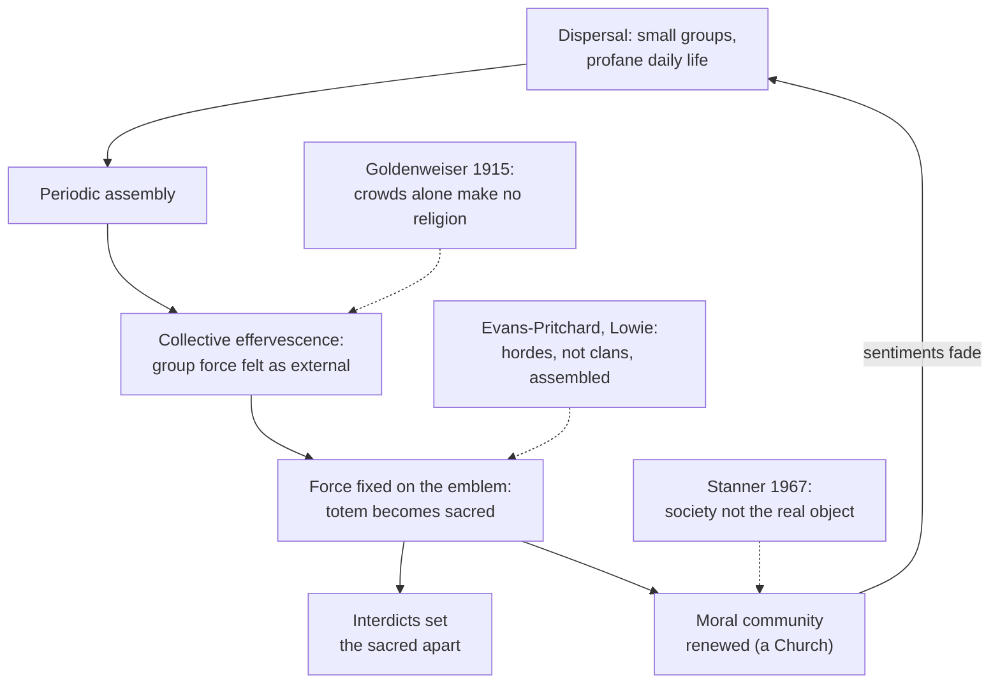

# Social Theory · Lesson 3.3: Religion as social: *The Elementary Forms*

> ⏱ ~15 min · Module 3: Durkheim · Builds on: [3.1 The division of labor and social solidarity](03-01-the-division-of-labor-and-social-solidarity.md), [1.2 Functional explanation and its critics](01-02-functional-explanation-and-its-critics.md) · Unlocks: [4.1 The Protestant ethic and the spirit of capitalism](04-01-the-protestant-ethic-and-the-spirit-of-capitalism.md), [7.1 Classical secularization theory](07-01-classical-secularization-theory.md)

## Why this matters

In *Les formes élémentaires de la vie religieuse* (1912; J. W. Swain's translation, *The Elementary Forms of the Religious Life*, 1915) Durkheim made two claims that still shape how people talk about flags, anthems and national days of mourning. The first is that what worshippers really worship is their own society. The second is that no society can do without something that works like worship. As the most famous social explanation of religion, it is where to learn the course's hardest separation: *how* a belief arises socially is one question; whether it is true is another, which this course does not answer.

## The idea

**Start with a definition that works without gods.** Durkheim notes that some religions, Buddhism above all, get along without a god, so "belief in God" cannot be the definition. What every religion has instead is a division of the world into [sacred and profane](../reference.md#sacred-and-profane). He does not mean higher versus lower: slaves are inferior to masters and nobody calls that religious, and to say a miser makes a religion of his gold is only a metaphor. The mark of the sacred is *absolute heterogeneity*, two worlds with nothing in common, kept apart by interdicts. Hence his [definition of religion](../reference.md#durkheims-definition-of-religion) (Book I, ch. 1):

> a unified system of beliefs and practices relative to sacred things, that is to say, things set apart and forbidden ... which unite into one single moral community called a Church, all those who adhere to them.

"Church" means any moral community of the faithful, not a Christian institution. It separates religion from magic: a magician has clients, and magic, Durkheim says, has no Church.

**Then find the simplest case.** Durkheim assumed the simplest society would show religion's elementary forms with the least later growth over them, and chose Central Australia. His evidence was Baldwin Spencer and F. J. Gillen's *Native Tribes of Central Australia* (1899) and *Northern Tribes of Central Australia* (1904), checked against the missionary Carl Strehlow's reports on the Arunta (Aranda). The religion is [totemism](../reference.md#totemism): each clan bears the name of an animal or plant, its totem. The most sacred objects are not the animals but the *churinga*, wood or stone objects engraved with the totem's design. Women and young men not yet initiated may not touch or even see them, and they are kept hidden in a cave. Hence a striking conclusion: the images of the totem are more sacred than the totem itself.

**So what is the emblem an emblem of?** It is the god's sign and it is also the clan's flag, the mark that tells one clan from another. Durkheim's inference is that the two are one: the god of the clan is the clan itself, personified and imagined in the form of the totem.

**And how does a clan come to feel itself as a god?** Australian life alternates between two phases. For long stretches small groups disperse to hunt and gather, and life is profane. Then the clan or tribe concentrates for ceremonies that run for days or weeks. In the assembly, individuals feel lifted by a force that is real but comes from the group, though it feels as if it came from outside. This is [collective effervescence](../reference.md#collective-effervescence). The force gets attached to what is in front of everyone: the emblem. When the group disperses, the shared sentiments weaken, and the next assembly restores them.

## Source

Book II, ch. 7, §3 (Swain), after Spencer and Gillen's account of a Warramunga fire ceremony:

> And as at the same time all his companions feel themselves transformed in the same way and express this sentiment by their cries, their gestures and their general attitude, everything is just as though he really were transported into a special world, entirely different from the one where he ordinarily lives, and into an environment filled with exceptionally intense forces that take hold of him and metamorphose him. How could such experiences as these, especially when they are repeated every day for weeks, fail to leave in him the conviction that there really exist two heterogeneous and mutually incomparable worlds? One is that where his daily life drags wearily along; but he cannot penetrate into the other without at once entering into relations with extraordinary powers that excite him to the point of frenzy. The first is the profane world, the second, that of sacred things.

Read it closely. "*All his companions*" places the cause in the group, not the individual. "*Just as though*" marks it as Durkheim's explanation, not the participant's report. "*Repeated every day for weeks*" makes the conviction depend on repetition. And the last sentence answers the puzzle from Book I: if nothing in the natural world suggests two absolutely different worlds, the experience of assembly does.

## The argument

**Durkheim's explanation of religion (exegetical reconstruction).**

1. **The sacred is absolutely set apart from the profane, and nothing in ordinary sense experience suggests so radical a split.** *In words:* nature cannot be the source of the idea.
2. **Periodic assemblies produce, in each participant, an intensity of feeling that is caused by the group but felt as an external, superior force.**
3. **Repeated, and contrasted with the flat life of dispersal, this experience produces the conviction that two worlds exist.**
4. **The felt force is fixed on the nearest concrete symbol of the group, its totemic emblem.** *In words:* people need a thing to think a force, and the flag is right there.
5. **The emblem stands at once for the totemic principle and for the clan.**
6. **∴ The sacred power is the clan itself, personified and represented under the totem's form.** Religious representations are collective representations of society.
7. **∴ (functional conclusion) Rites persist because they periodically re-create the shared sentiments on which the group's unity depends.** Those sentiments, Durkheim says, would weaken if left to themselves.

**What kind of explanation this is.** It is *explanatorily holist* in the sense of [1.1](01-01-individuals-and-social-facts.md): a social fact, the assembled group, explains a representation. It is also *functional*, and it passes [1.2](01-02-functional-explanation-and-its-critics.md)'s test better than most functional claims, because it names a [feedback mechanism](../reference.md#feedback-mechanism): each rite directly restores the sentiment that dispersal wears down, with no story about selection needed. It is pointedly *not interpretive* in [1.3](01-03-understanding-webers-interpretive-method.md)'s sense. Durkheim says the reasons believers give are generally mistaken, while the true reasons are for science to find.

**Two objections that get run together.** The [reductionism objection](../reference.md#reductionism-objection) is *explanatory*: society cannot account for all of religion, including the content of doctrines, the solitary mystic, or universal faiths that break with the believer's group. Durkheim's Conclusion replies that individual and universalist religion reflect the individual and the international groups of later societies. The second question is *about truth*: if the explanation is correct, does it give any reason to doubt religious belief? Durkheim himself says the believer is not deceived about a moral power on which he depends, but misidentifies it. Whether a correct social explanation of a belief bears on that belief's truth is the [genetic-fallacy question](../reference.md#genetic-fallacy-question). This course flags it and does not settle it. A theist can accept the mechanism as the route by which belief arises, as neural causes of seeing a tree do not exclude the tree. A naturalist can argue that an explanation which never mentions God leaves belief in God without evidential support. Both arguments, and when debunking works at all, belong to [philosophy-of-religion 3.4](../../philosophy-of-religion/lessons/03-04-the-argument-from-religious-experience.md) and [philosophical-method 3.4](../../philosophical-method/lessons/03-04-intuitions-and-reflective-equilibrium.md).

**Where the argument is weakest.** The critics attack the case first, then the mechanism. Arnold van Gennep (a 1913 review, then a 1920 survey of totemism) denied that Australian societies are simple, and found peoples with simpler technology but no totems, and clans without totems. E. E. Evans-Pritchard (*Theories of Primitive Religion*, 1965), following Robert Lowie, noted that the groups that actually acted together were hordes and tribes, not the scattered clans, so effervescence should have sacralized *them* (against P4–P5). W. E. H. Stanner (1967), working among the Murinbata, concluded that their religion was not totemism and that society was not its real source or object. Alexander Goldenweiser's 1915 review attacked P2–P3: crowd excitement alone does not produce religious feeling (secular dances never turn into rites), so the difference lies in religious associations that already exist, and effervescence presupposes the sacred instead of creating it. **Evidence strength:** the origin claim about Australian totemism is widely judged unsupported by later fieldwork. The narrower mechanism, that co-present ritual raises felt solidarity, lives on in Randall Collins's interaction-ritual theory and has some laboratory support: Wiltermuth and Heath (*Psychological Science*, 2009) found that people who had acted in synchrony then cooperated more in economic games. That is one set of lab studies; whether it scales to a society is contested.

## The explanation

## Worked examples

**Example 1 (the theory run on its author's modern case: the French Revolution).** Durkheim's own test case comes from the first years of the Revolution (Book II, ch. 7, §2). Under the general enthusiasm, he writes, things secular by nature became sacred: the Fatherland, Liberty, Reason. A religion began to form, with dogmas, symbols, altars and feasts. Run the steps:

- **Assembly and effervescence (P2):** the mass gatherings and festivals of the revolutionary years.
- **Fixation on symbols (P4):** the abstractions acquire emblems and altars.
- **Set apart (P1):** they are placed beyond discussion, as the sacred always is.
- **Community (C6):** the object of the cult is the nation itself, worshipped directly, without a totem standing in for it.

For Durkheim this is society worshipped with no disguise at all.

**Example 2 (where it strains: the same cult's collapse).** The official cults of Reason and of the Supreme Being were short-lived. Robespierre presided over the Festival of the Supreme Being in June 1794 and fell the following month. Durkheim's explanation is that the patriotic enthusiasm relaxed: "The cause being gone, the effect could not remain." Now apply [1.4](01-04-testing-a-social-explanation.md). If a cult that thrives shows that effervescence was present, and a cult that fails shows it was absent, the theory cannot lose unless effervescence is measured *independently* of whether the cult survived. There is also a rival reading. The festivals were designed from above by a political faction, so they may have failed because the faction failed, whatever the crowds felt. To tell them apart, compare festivals by how spontaneous they were and whether their sponsors survived. Neither reading bears on any religion's truth; both explain why a cult lived or died.

## Watch out

- **You might think "sacred" means "very valuable," but actually** Durkheim's test is absolute separation enforced by interdicts. He calls it metaphorical to say someone makes a religion of gold or power. A thing can be prized without being sacred.
- **You might think Durkheim argues that religion is false (or true), but actually** he says every religion is true in its own way and that believers misidentify a real force. Treating that as a verdict on God's existence confuses an explanation with an evaluation. The evaluation is philosophy-of-religion's question, not his and not this course's.
- **You might think the theory is individualist because its mechanism is psychological, but actually** the explanation runs from how the group is arranged (dispersal, then assembly) to what people believe: holism in the explanatory sense, with a mechanism at the level of individuals. Critics from Malinowski's 1913 review onward have asked whether crowd psychology sits comfortably with the *Rules*' demand that social facts be explained by social facts. That is a consistency question, not proof of individualism.

## One-liner

> For Durkheim, the sacred is a group's own force, felt in assembly and fixed on a symbol: religion is society worshipping itself, renewed at every rite. Whether that bears on any religion's truth is a separate question this course does not settle.

## Problems

**P1 (🟢) *(Exegetical (a)-(b).)*** Close reading. Book II, ch. 7, §4 (Swain):

> we can say that the believer is not deceived when he believes in the existence of a moral power upon which he depends and from which he receives all that is best in himself: this power exists, it is society. When the Australian is carried outside himself and feels a new life flowing within him whose intensity surprises him, he is not the dupe of an illusion; this exaltation is real and is really the effect of forces outside of and superior to the individual. It is true that he is wrong in thinking that this increase of vitality is the work of a power in the form of some animal or plant. But this error is merely in regard to the letter of the symbol

(a) Which reading do the words support? **(A)** Religious belief is an illusion with no real object. **(B)** Religious belief is true as the believer states it. **(C)** The believer experiences a real force but describes it wrongly. Name the words that rule out each of the other two. (b) An invented blog post says: "Durkheim proved that God is just society, so theism is false." Name the bridge premise needed to get from this passage to that conclusion, and say which course owns the question of whether that premise holds. Two sentences for (b); you are not asked whether theism is true.

**P2 (🟡) *(Exegetical (a) · Evaluative (b).)*** Since 11 November 1919, at King George V's request, Britain has kept a two-minute silence at 11 a.m., the hour the 1918 armistice took effect. Traffic and work stop wherever people are. On Remembrance Sunday the monarch and party leaders lay wreaths at the Cenotaph in Whitehall (unveiled 1920; the name means "empty tomb"), the Bishop of London leads a short service, and veterans march past. (a) Map the ceremony onto Durkheim's account: what is sacred, what interdict sets it apart, what moral community is renewed, and which kind of rite from *The Elementary Forms* it most resembles. (b) Name the strongest strain in applying the theory here, and say whether Durkheim's own resources absorb it. Then say what evidence would test the claim that the ritual *renews* solidarity, naming one trap that evidence must avoid. 150 words or fewer for (b).

**P3 (🔴, optional) *(Exegetical (a) · Evaluative (b).)*** Find the crux. Goldenweiser (1915) argued that crowd excitement does not by itself produce religious feeling: secular dances do not become rites, and the difference lies in religious associations that already exist. (a) Which numbered premise of the lesson's reconstruction does he deny? One sentence. (b) Does the French Revolution case from Example 2 discriminate between Durkheim and Goldenweiser? Say what each predicts and what in the case muddies the test. 100 words or fewer.

Solutions

**P1** *(Exegetical (a)-(b), strict)*

**Must hit, strict (a):**

- Reading (C). "This power exists, it is society" and "this exaltation is real and is really the effect of forces outside of and superior to the individual" put the object in the world.
- "Not deceived" and "not the dupe of an illusion" rule out (A).
- "He is wrong in thinking that this increase of vitality is the work of a power in the form of some animal or plant" rules out (B): the believer's own description is false.
- "Merely in regard to the letter of the symbol" places the error in the description, not in the existence of what is described.

**Must hit, strict (b):**

- A bridge premise is needed, something like: *if the best explanation of how a belief arises never requires its object to exist as described, then the belief is false* (or, more weakly, *unwarranted*). Either wording passes if it links origin to truth or warrant.
- Whether that premise holds is the genetic-fallacy / debunking question, owned by philosophy-of-religion (3.4; philosophical-method 3.4 for the general conditions). This course does not grade a verdict on it.

**Wrong turns:** choosing (A) because Durkheim explains religion naturalistically. The passage insists the believer is *not* deceived about the force. In (b), arguing for or against theism instead of naming the missing premise. Treating "false" and "unwarranted" as the same claim; a strong answer notices they come apart.

**Model answer:** (a) (C). "Not deceived" and "not the dupe of an illusion" rule out (A). "He is wrong in thinking that this increase of vitality is the work of a power in the form of some animal or plant" rules out (B). "Merely in regard to the letter of the symbol" says the error lies in the description, not the existence, of the force. (b) The post needs the premise that a belief whose origin is fully explained without its object existing as described is false, or at least unwarranted. Whether that holds is the genetic-fallacy question, which belongs to philosophy-of-religion, not to this course.

---

**P2** *(Exegetical (a), strict · Evaluative (b), any verdict)*

**Accept (a):** any mapping that names a sacred thing with its interdict, a community, and a rite type, and is defensible from the text.

**Must hit, strict (a):**

- **Sacred:** the dead and the Cenotaph (an empty tomb that stands for them). The two minutes themselves are a sacred time.
- **Interdict:** the silence: speech, traffic and work are forbidden. Respect for the memorial, and outrage if it is defaced, mark separation, not just value.
- **Community:** the nation, with the Commonwealth beside it. The monarch, the leaders and the veterans visibly represent it.
- **Rite type:** a commemorative and **piacular** (mourning) rite. Durkheim argues that mourning rites, too, are collective, imposed as a duty by the group, and produce their own effervescence, with sorrow amplified. His Conclusion asks what essential difference separates religious feasts from citizens commemorating a great event in the national life.

**Must hit, any verdict (b):**

- Name a real strain: (i) a dispersed, silent observance against a theory built on co-present crowd excitement; (ii) a Christian service sits inside the ceremony, so it is unclear whether the civic or the religious frame does the sacralizing; or (iii) whether the nation is sacred in the strict sense or only metaphorically.
- Say whether Durkheim absorbs it: piacular rites for (i), "no essential difference" for (ii), the interdicts for (iii). Or say why the absorption fails.
- Evidence for renewal: compare measured solidarity or national identification before and after the day, or between participants and non-participants. Name a trap, such as **selection** (the already attached are the ones who take part) or a confound (coverage of current wars).

**Wrong turns:** calling it sacred because it is important to people, which is the metaphorical sense Durkheim rejects. Calling the ceremony purely secular and ignoring the service. Treating the theory's fit as evidence about the truth of the Christian prayers in the service, or as evidence against it.

**Model answer (b), one of several:** The strongest strain is that most Britons keep the silence alone, at desks or in shops, with no crowd and no excitement. That is far from a Warramunga fire ceremony. Durkheim partly absorbs it. Mourning rites, he argues, produce effervescence of sorrow rather than of joy, and a silence kept at the same second across a country is a form of synchrony. But the absorption weakens the theory's distinctive claim about intensity in co-presence. A test would compare national identification among people surveyed just before and just after 11 November with people surveyed at other times of year. Comparing participants with non-participants would fail through selection, since the attached choose to take part.

---

**P3** *(Exegetical (a), strict · Evaluative (b), any verdict)*

**Must hit, strict (a):** P2–P3, in the form that assembly excitement *by itself* produces the sense of a sacred force. Goldenweiser makes prior sacredness a precondition of religious effervescence, not its product. Naming P2 or P3 alone passes if the "by itself" is stated.

**Must hit, any verdict (b):**

- Durkheim predicts that intense enthusiasm with no inherited religious frame can make things sacred. The early Revolution, which sacralized secular things, looks like that.
- Goldenweiser predicts that sacralization follows prior religious associations. The revolutionary cult borrowed the forms of an existing religion (altars, feasts, dogmas, on Durkheim's own description), so the case is confounded.
- The case alone does not discriminate cleanly. A verdict in either direction passes if the confound is named.

**Wrong turns:** citing the cult's collapse as decisive for Goldenweiser. Collapse bears on persistence, not on whether effervescence created the sacred in the first place. Answering (a) with P4 (the choice of emblem), which Goldenweiser does not contest here.

**Model answer (b), one of several:** Durkheim's view predicts that intense collective enthusiasm, without any inherited religious frame, can make things sacred. The first years of the Revolution, when Liberty and the Fatherland became untouchable, fit that. Goldenweiser's view predicts that sacralization rides on religious associations people already have. The revolutionaries built altars and feasts modelled on an existing religion, so the inherited forms were present after all. The case is confounded and does not decide between them. A cleaner test would need a gathering with no borrowed sacred forms.

## Flashback

**From Lesson [3.1](03-01-the-division-of-labor-and-social-solidarity.md) (The division of labor and social solidarity):** *(Exegetical (a) · Evaluative (b).)* In England and Wales, speeding, watching live television without a TV licence and selling alcohol without a licence are all criminal offences; speeding is often dealt with by a fixed fine and points on the driving licence. A critic of Durkheim says such offences offend no strong collective sentiment, yet they are penal, and modern states keep adding them. Durkheim saw a version of this coming. In Book I, ch. 2 he notes that the smallest breach of street-traffic rules is fined, while repeated breach of contract owes only reparation. His answer, paraphrased: a governing power's first function is to defend the collective conscience, so it comes to embody it and borrows its authority. It can then make crimes of acts that offend the government without offending collective sentiments to the same degree. How far it can do this, both in the number of crimes and in how they are classed, depends on its force, and that force, like the collective conscience, is greatest in the simplest societies. A footnote adds that where a fixed fine is the whole penalty, the act lies on the border between penal and restitutive law.

(a) Durkheim's repressive law has two marks: the kind of sanction and the kind of sentiment offended. Say which mark a speeding fine meets and which it fails, and why a growing number of such offences does not by itself count against the index. Three sentences or fewer.

(b) Does the modern growth of regulatory offences fit the prediction built into Durkheim's own reply, and does the footnote rescue him? Say what evidence would decide. 100 words or fewer; any verdict.

Solution

**Must hit, strict (a):**

- Sanction: met. The fine is a penalty scaled to the offence and paid to the state; it repairs no one's loss, so on the sanction test it is not restitutive. "Met, but borderline under Durkheim's footnote" also passes.
- Sentiment: failed, on the critic's premise. No strong, defined state of the collective conscience is offended.
- Count: the index measures the *relative* extent of repressive and restitutive law (step 5). More penal regulation counts against the trend (step 7) only if it outgrows contract, commercial and administrative law. What the case really strains is step 3, the assumption that the two marks go together.

**Must hit, any verdict (b):**

- State the reply's prediction: the governing power's crime-making, in number and gravity, should be greatest where the collective conscience is strongest, so it should shrink as societies grow more complex.
- Confront it: many minor state-made offences in modern societies looks like the opposite. A defender can say the force shows in gravity, and these penalties are light; the critic can answer that Durkheim tied the reply to number as well.
- Weigh the footnote: moving fixed fines to the border lowers the repressive count, but it rescues the index only if the rule is fixed in advance and applied to every period alike, not just to awkward modern cases.
- Evidence: one legal system's rules coded by sanction over time, with fixed-fine offences reported separately; and whether penalties for offences against the state itself grew lighter as regulation grew.

**Wrong turns:** calling the fine restitutive because it is money. The test is whether it repairs a loss, as with the compensation order in Lesson 3.1's problems. Arguing whether speed limits are good law, which is evaluative and not asked. Treating a rise in the absolute number of offences as a fall in the restitutive share.

**Model answer (b), one of several:** Taken at its word, the reply predicts that a governing power makes the most crimes where the collective conscience is strongest, so modern states should make fewer. The modern spread of minor regulatory offences looks like the opposite. A defender can say force shows in gravity, and these are light fines. The footnote then helps: fixed fines sit on the border and barely move the index. That rescue is principled only if the border rule is applied to every period alike. The test: code one legal system's rules over a century by sanction, report fixed-fine offences separately, and see whether the restitutive share still rises.

## Connections

- **Backward:** [3.1](03-01-the-division-of-labor-and-social-solidarity.md) described the collective conscience of mechanical solidarity. This lesson says where such shared sentiments get their force and how they are kept alive. [3.2](03-02-suicide.md) used religious affiliation as a variable; here religion itself is the thing to be explained. The functional conclusion (C7) is the kind of claim [1.2](01-02-functional-explanation-and-its-critics.md) taught you to check for a mechanism, and Example 2 is [1.4](01-04-testing-a-social-explanation.md)'s testability problem.
- **Forward:** [4.1](04-01-the-protestant-ethic-and-the-spirit-of-capitalism.md) runs the arrow the other way. For Weber, religious ideas are causes of economic conduct; for Durkheim, religious ideas are effects of social form. The Conclusion's prophecy that the old gods are dying and new ones are not yet born is one root of the classical secularization theory in [7.1](07-01-classical-secularization-theory.md), and [7.3](07-03-taylors-a-secular-age.md) asks whether belief can be described from the outside like this at all.
- **Sideways:** Feuerbach's projection theory, which philosophy-of-religion weighs as the naturalist rival to the argument from religious experience in [3.4](../../philosophy-of-religion/lessons/03-04-the-argument-from-religious-experience.md), is Durkheim's nearest philosophical cousin. The difference is that Durkheim's projected object, society, is real. When a debunking explanation has force is [philosophical-method 3.4](../../philosophical-method/lessons/03-04-intuitions-and-reflective-equilibrium.md). Machiavelli told founders to *use* religion to bind citizens ([history-of-political-thought 3.2](../../history-of-political-thought/lessons/03-02-machiavelli-the-discourses.md)); Durkheim tries to *explain* why it binds them.
