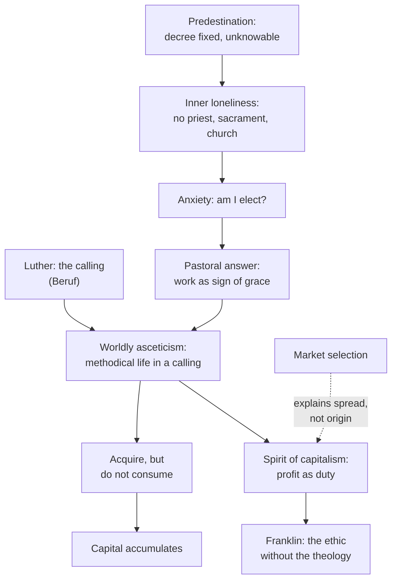

# Social Theory · Lesson 4.1: The Protestant ethic and the spirit of capitalism

> ⏱ ~15 min · Module 4: Weber · Builds on: [1.3 Understanding: Weber's interpretive method](01-03-understanding-webers-interpretive-method.md), [3.2 Suicide](03-02-suicide.md) · Unlocks: [4.2 The Protestant ethic on trial](04-02-the-protestant-ethic-on-trial.md)

## Why this matters

*The Protestant Ethic and the Spirit of Capitalism* (essays of 1904–05, revised 1920, translated by Talcott Parsons in 1930) is the most famous argument in sociology that ideas, and not only interests, can steer economic history. It is also the most misquoted. "Protestantism caused capitalism" is a thesis Weber himself calls foolish. This lesson states what he did claim, at the strength he claimed it. [4.2](04-02-the-protestant-ethic-on-trial.md) puts that claim on trial.

## The idea

Weber opens with a statistic. In the German state of Baden, Protestants held more capital and filled more business and technical posts than Catholics. His footnote, drawn from his student Martin Offenbacher's 1901 study, gives taxable capital in 1895 of 954,000 marks per 1,000 Protestants against 589,000 per 1,000 Catholics, about 1.6 times as much. Whether such figures hold up is a question for 4.2. Weber's point is that the gap is a clue, not the thing to be explained.

The thing to be explained is an **attitude**. People have always wanted money: the greedy merchant, the adventurer, the usurer are found in every age and civilization. Weber means something odder by the [spirit of capitalism](../reference.md#spirit-of-capitalism). It treats increasing one's capital as a *duty*, an end in itself. It pursues that end methodically, and it combines it with a strict refusal to enjoy the proceeds. Weber's specimen is Benjamin Franklin, and he contrasts Franklin with Jacob Fugger, the great Augsburg banker, who said he wanted to make money as long as he could. Fugger's attitude, Weber says, was commercial daring, a personal inclination that is morally neutral. Franklin's is an ethically coloured maxim for the conduct of life. Seen from the standpoint of the individual's happiness, that maxim is irrational: you work to accumulate and do not consume.

Where did a duty like that come from? Weber's answer runs through four links.

1. **The [calling](../reference.md#the-calling).** On Weber's account, Luther's Bible translation gave the German *Beruf* its modern sense: an occupation as a task set by God. Doing one's worldly duty became the highest form of moral activity. Monastic withdrawal was no longer superior to ordinary work. Luther's own version was traditionalist, though: stay in the station God gave you.
2. **Predestination.** Calvinism added a decree that cannot be changed and that no one can know. The Westminster Confession, as Weber quotes it, says this: "By the decree of God, for the manifestation of His glory, some men and angels are predestinated unto everlasting life, and others foreordained to everlasting death." No priest, sacrament or church can change that decree. Weber calls the result an unprecedented inner loneliness. This is [the anxiety of proof](../reference.md#predestination-and-the-anxiety-of-proof).
3. **The pastoral answer.** Ordinary believers needed to know whether they were among the elect. Ministers gave them two pieces of advice. First, it is a duty to consider yourself chosen, since doubt is a temptation. Second, intense worldly activity is the best way to drive doubt out. Good works cannot earn salvation, but they can show it: "They are the technical means, not of purchasing salvation, but of getting rid of the fear of damnation."
4. **[Worldly asceticism](../reference.md#worldly-asceticism).** A sign of grace had to be a whole life under control, not a series of good deeds offset by confession. Weber draws on Richard Baxter's *Christian Directory*, the Puritan pastoral handbook. Wasting time is the deadliest sin. Even the rich must work. Wealth is dangerous only as a temptation to idleness and enjoyment, and profit earned in a calling counts as a sign of God's blessing. When people may acquire but may not consume, capital accumulates.

Franklin, a deist, shows the end of the process: the ethic without the theology.

## Source

The spirit, in Parsons's translation (ch. II). Franklin first:

> Remember, that time is money.

Weber then comments:

> The peculiarity of this philosophy of avarice appears to be the ideal of the honest man of recognized credit, and above all the idea of a duty of the individual toward the increase of his capital, which is assumed as an end in itself. Truly what is here preached is not simply a means of making one's way in the world, but a peculiar ethic. The infraction of its rules is treated not as foolishness but as forgetfulness of duty. That is the essence of the matter. It is not mere business astuteness, that sort of thing is common enough, it is an ethos.

The deciding contrast is **foolishness versus forgetfulness of duty**. A prudential rule, broken, makes you a fool. An ethic, broken, makes you guilty. Weber defines his explanandum by that difference, which is why "business astuteness" (common enough) is set aside. Note "philosophy of avarice": he is describing an attitude, not praising it.

## The argument

**Weber's explanation, reconstructed (exegetical).**

1. **P1.** Modern Western capitalism has a distinctive spirit: acquisition as a duty and an end in itself, pursued methodically, with enjoyment refused. Earlier capitalism lacked it.
2. **P2.** Luther's *Beruf* made fulfilling duty in a worldly occupation the highest moral activity.
3. **P3.** Calvinist predestination left each believer facing an unknowable, unchangeable verdict with no means of influencing it, which produced intense anxiety about election.
4. **P4.** Pastoral practice answered that anxiety by treating tireless, systematic work in a calling as the sign, not the cause, of election. *In words:* this gave believers a strong psychological incentive to live methodically, an incentive Weber's word for is a "psychological sanction."
5. **P5.** That sanction produced worldly asceticism: a whole life rationalized around work, with consumption restrained.
6. **P6.** Acquisition released plus consumption restrained yields saving and reinvestment, and it gives profit-seeking a good conscience.
7. **∴ C.** Ascetic Protestantism was *one* of the causes behind the formation and spread of the spirit of capitalism. It was neither the only cause nor a cause of capitalism as an economic system.

**The strength claimed.** C is narrow on purpose. In ch. III Weber rejects "such a foolish and doctrinaire thesis … as that the spirit of capitalism … could only have arisen as the result of certain effects of the Reformation, or even that capitalism as an economic system is a creation of the Reformation." He notes that important capitalist business forms are older than the Reformation. He asks only whether, and to what extent, religious forces took part in forming the spirit. In the German original Weber letter-spaces the *mit* of *mit beteiligt* (took part *along with* other forces) for emphasis. Parsons does not mark the emphasis. Weber also describes his method as looking for *Wahlverwandtschaften* between forms of religious belief and the ethic of the calling. This is the [elective affinity](../reference.md#elective-affinity) of later English usage: a fit between ideas and conduct, each drawn to the other, rather than a law. Parsons renders it flatly as "certain correlations". That is the [Protestant ethic thesis](../reference.md#protestant-ethic-thesis) at full strength. It is a claim of causal *contribution*.

**What kind of explanation it is.** It is *interpretive* first. P3–P4 reconstruct what predestination would mean to someone who believed it. That is adequacy at the level of meaning ([1.3](01-03-understanding-webers-interpretive-method.md)). It is *individualist in the explanatory sense*: the explanation runs from doctrine, through believers' motives, to their conduct, and only then to a group's way of life. It is **not functional**. Weber grants that mature capitalism selects the people it needs, through an economic survival of the fittest. But he says selection cannot explain *origin*: a way of life must already exist, among whole groups, before it can be selected. That is the [feedback-mechanism](../reference.md#feedback-mechanism) point of [1.2](01-02-functional-explanation-and-its-critics.md), made by Weber himself. [Causal adequacy](../reference.md#causal-adequacy) needs comparison ([1.4](01-04-testing-a-social-explanation.md)), and that is what 4.2 supplies.

**Where the argument is weakest.** P4. The link from doctrine to anxiety to conduct is reconstructed from prescriptive sources, Baxter's handbook and other pastoral writings. Weber says he wants the psychological sanctions that actually moved conduct, not what the ethical manuals officially taught, yet his evidence for those sanctions is largely what pastors urged. A critic says sermons show what ministers wanted people to feel, not what merchants felt. The critic adds that showing a meaning to be plausible is not showing it to be effective. The defender replies that the pastoral literature was written in answer to real parishioners' questions, so it registers their anxieties.

## The explanation

Solid arrows are the causal chain Weber proposes. The dashed arrow is the functional mechanism he accepts only for capitalism once it is established.

## Worked examples

**Example 1: New England and the South (the theory at work).** Weber argues that in Massachusetts the spirit came *before* the capitalist order. He cites complaints about a peculiarly calculating profit-seeking in New England as early as 1632. The southern colonies, he says, were founded by large capitalists for business motives, while New England was founded by preachers and others for religious reasons. Yet capitalism stayed less developed in the South. Run the chain. Calvinist settlers bring P3–P5, so the methodical ethic appears without much capitalism around it. Capitalist founders bring the motive of profit without the ethic, and they get less of the spirit. The pattern is the reverse of what a "material conditions first" account predicts.

*What kind of evidence this is (1.4):* a two-case comparison. It shows that the spirit does not simply track material conditions. It cannot by itself isolate religion as the cause, because the colonies also differed in climate, crops, labor systems (slavery above all) and the settlers' origins. Weber's case is suggestive, not decisive, and he treats it as illustration.

**Example 2: Calvin against the Calvinists (where it strains).** Weber concedes something awkward. Calvin himself rejected the idea that one could tell from conduct who was chosen. To him that was an unjustifiable attempt to force God's secrets, and he counselled that one should be content to trust in Christ. The "proof" mechanism appears in Weber's account only with Calvin's followers, from Beza onward, and in pastoral practice. So the causal variable is not the doctrine as defined in confessions. It is the doctrine *as lived* under pressure from ordinary believers' anxiety.

Two readings follow. A defender says this is just Weber's method: ideal types present religious ideas in their most consistent form, which history seldom shows (ch. IV), plus the claim that the sanctions working in practice are what matter. A critic says it loosens the thesis. If the confessional label alone does not fix the cause, then Protestant against Catholic is the wrong comparison, and the right one is harder to observe. Both readings are live, and 4.2 shows how the evidence has been pressed.

## Watch out

- **You might think Weber said Protestantism caused capitalism, but actually** he calls that thesis foolish and doctrinaire. His claim is that ascetic Protestantism was one contributor to a *spirit*. The economic system had other causes and older forms.
- **You might think "interpretive" means untestable, but actually** Weber's chain makes two distinct claims. Meaning-adequacy: this is how a believer would understand predestination. Causal adequacy: that understanding changed conduct, which only comparison can show ([1.3](01-03-understanding-webers-interpretive-method.md), [1.4](01-04-testing-a-social-explanation.md)). A brilliant reconstruction of meaning is not yet evidence of cause.
- **You might think the thesis praises or indicts Calvinism, but actually** Weber says no attempt is made to evaluate the ideas of the Reformation, in either their social or their religious worth. Exegesis of the thesis, its explanatory truth, and any verdict on Puritan religion are three separate questions. That a belief had economic consequences says nothing about whether it is true. That question belongs to [philosophy-of-religion](../../philosophy-of-religion/syllabus.md).

## One-liner

> Weber did not say Protestants invented capitalism. He said a doctrine nobody could act on, predestination, drove believers to prove their election through methodical work, and that this unintended ethic helped give capitalism its spirit of profit as duty.

## Problems

**P1 (🟢) *(Exegetical (a) · Evaluative (b).)*** Weber, ch. IV (Parsons), on what Calvinist good works accomplish:

> In practice this means that God helps those who help themselves. Thus the Calvinist, as it is sometimes put, himself creates his own salvation, or, as would be more correct, the conviction of it. But this creation cannot, as in Catholicism, consist in a gradual accumulation of individual good works to one's credit, but rather in a systematic self-control which at every moment stands before the inexorable alternative, chosen or damned.

(a) Which reading do the words support, and which words decide it? **A:** Weber holds that Calvinists, in practice, earned salvation by good works. **B:** Conduct produces the believer's *conviction* of election, and it can do so only as an unbroken system of self-control, not as a sum of separate deeds. **C:** Weber holds that Calvinism taught that worldly success causes election. (b) Say which link of Weber's chain this passage supplies, and what it cannot by itself show. Any verdict on how much it shows. Three sentences or fewer per part.

**P2 (🟡) *(Exegetical.)*** From an invented op-ed in a regional paper:

> "Max Weber proved a century ago that Protestantism created capitalism: wherever Calvin's preachers went, factories followed. The lesson for our valley is obvious. Our growth has stalled because the churches stopped preaching the work ethic, and a capitalist economy cannot run without people who believe hard work is a religious duty. Bring back the Protestant ethic and prosperity will follow."

(a) Name three ways the op-ed misstates Weber's thesis, and say for each what the text claims instead. (b) The third sentence silently assumes a kind of explanation. Name it, and say what Weber says about whether present-day capitalism needs the ethic. 150 words or fewer in total.

**P3 (🔴, optional) *(Evaluative.)*** A critic: "Weber's evidence for the anxiety-to-work link (P4) is what Puritan pastors told people to do. Prescriptions are not behavior, so P4 is unsupported." Steelman this objection in its strongest form, then give the best reply on Weber's behalf. Say whether the reply succeeds. Do not design a study. 150 words or fewer.

Solutions

**P1** *(Exegetical (a) · Evaluative (b))*

**Must hit, strict (a):**

- Reading **B**.
- "or, as would be more correct, the conviction of it": Weber corrects his own phrase. The decree is fixed, so what the believer "creates" is assurance of salvation, not salvation. That rules out A.
- "cannot … consist in a gradual accumulation of individual good works to one's credit, but rather in a systematic self-control which at every moment …": the sign has to be a whole life under control, with no deed that does not count. That is the second half of B.
- C is ruled out because nothing in the passage mentions success or wealth, and conduct is a sign that yields conviction, not a cause of election. "God helps those who help themselves" is introduced "in practice" and "as it is sometimes put", a popular formula that Weber at once corrects.

**Must hit, any verdict (b):**

- The link: P4 to P5, from the pastoral answer to worldly asceticism. Because only an unbroken system can serve as the sign, the anxiety of proof yields a methodically rationalized life rather than occasional good deeds, which is what P5 and P6 need.
- What it cannot show: this is a reconstruction of what the doctrine meant to a believer, adequacy at the level of meaning ([1.3](01-03-understanding-webers-interpretive-method.md)). It does not show that real Calvinists lived more methodically than real Catholics. That is causal adequacy and needs comparison of conduct ([1.4](01-04-testing-a-social-explanation.md)). Also acceptable: the Catholic side is an ideal type of a practice built around absolution, not a measured description of lay conduct.

**Wrong turns:** Choosing A because Weber reports the Lutheran charge that Calvinism reverted to salvation by works. That charge concerns practical effect on conduct, and the passage itself says conviction, not salvation. Reading the Catholic contrast as a theological verdict on either church: it is a contrast between two ideal-typed ways of organizing conduct, and whether either doctrine is true is not this course's question.

**Model answer:** (a) B. Weber amends "creates his own salvation" to "the conviction of it", so conduct proves election and does not earn it, which rules out A. The contrast "not … a gradual accumulation of individual good works" but "a systematic self-control which at every moment" makes the sign a whole life, and since the passage never mentions success, C has no footing. (b) The passage supplies the step from P4 to P5: a sign that must be an unbroken system turns anxiety about election into a methodical life, the worldly asceticism the chain needs. It is meaning-adequacy only, showing how a believer would understand the demand, not that Calvinists actually lived differently from Catholics. That needs a comparison of conduct, which is 4.2's job, so the passage makes the mechanism intelligible without showing that it operated.

**P2** *(Exegetical, strict)*

**Must hit, strict (a), any three of:**

- **"Created capitalism."** Weber calls this a foolish and doctrinaire thesis and notes that capitalist business forms are older than the Reformation. His claim concerns the *spirit*, and religion as one contributor to it.
- **"Proved."** Weber asks *whether and to what extent* religious forces took part, and he works by elective affinities (Parsons: "certain correlations"), not demonstrated laws.
- **"Wherever Calvin's preachers went, factories followed."** This is a sufficiency claim that Weber never makes. His chain needs particular psychological sanctions (predestination anxiety answered by pastoral practice), not merely the presence of preachers.
- **"The work ethic."** Weber's mechanism is not generic exhortation to work hard. It is the search for proof of election, worldly asceticism, and *restrained consumption*. The op-ed drops the ascetic half.

**Must hit, strict (b):**

- The sentence gives a *functional* explanation: the ethic is required for capitalism to keep operating, so its decline explains stagnation.
- Weber denies the premise. He says conscious acceptance of these maxims by entrepreneurs or workers is *not* a condition of present-day capitalism's continued existence. The established system forces conformity and selects the people it needs through competition.
- The ethic mattered to the system's *origin*, not to its running now.

**Wrong turns:** Arguing about whether religion actually helps growth. That evaluates the op-ed's policy instead of diagnosing its reading of Weber. Calling the op-ed "materialist": it runs from ideas to economics, as Weber does, but it misreads both the scope of his claim and its tense.

**Model answer:** (a) First, Weber explicitly rejects "Protestantism created capitalism": capitalist forms predate the Reformation, and his claim concerns the *spirit*, to which religion contributed among other causes. Second, "proved" overstates a study that asks whether and how far religious forces took part, by tracing elective affinities. Third, Weber's mechanism is not preaching "the work ethic". It is anxiety about predestination, answered by methodical work *and* restrained consumption. (b) The third sentence is functional: capitalism needs the ethic in order to run, so the ethic's absence explains stalling. Weber says the opposite about mature capitalism. It no longer needs anyone to accept the maxims consciously, because the system itself forces conformity and selects for it. The ethic explains how the spirit arose, not how a running economy is kept going.

---

**P3** *(Evaluative)*

**Accept:** any verdict, provided the objection is stated at full strength (meaning-adequacy is not causal adequacy, and what is prescribed is not what is done) and the reply engages that point rather than restating Weber.

**Must hit, any verdict:**

- **Steelman:** a pastoral handbook records the conduct ministers wanted. If the ideal was urged *because* people fell short of it, the literature could even point the wrong way. Plausible meaning is not evidence of effect (1.3).
- **Reply:** the best available move. Possibilities: casuistry was written in answer to parishioners' actual cases of conscience, so it records their anxieties. Admission to Communion turned on ascertaining a person's state of grace, which made the sanction socially enforced and not merely preached. Weber's claim is about the direction conduct was pushed, and the comparative evidence (4.2) carries the causal load.
- **Verdict** tied to the reply: say what the reply secures (that the anxiety was real) and what it leaves open (how much conduct it moved).

**Wrong turns:** Replying that Weber was a great scholar, which is authority, not argument. Designing a study, which is not asked. Treating the objection as refuting the whole thesis rather than one premise.

**Model answer, one of several:** Steelman: Baxter tells us what a pastor wanted. Moral literature often urges a virtue precisely because it is lacking, so P4 rests on meaning-adequacy alone. Reply: much Puritan pastoral writing was casuistry, answers to real parishioners' cases of conscience. Its obsession with assurance therefore records lay anxiety, not just clerical hope. Weber also notes that admission to Communion depended on ascertaining a person's state of grace, so the pressure to show grace in conduct was socially enforced. Verdict: the reply secures that the anxiety and the social pressure were real. It does not show how far merchants' conduct actually changed. That needs comparison, so P4 stands as plausible, and the causal weight passes to the evidence in 4.2.

## Flashback

**From Lesson [3.2](03-02-suicide.md) (Suicide):** *(Formal (a) · Exegetical (b)–(c).)* Invented, labelled numbers for an invented mining region (yearly averages):

| Period | Population | Recorded suicides |
|---|---|---|
| Stable years | 200,000 | 24 |
| Sudden boom (new mine, wages rise) | 250,000 | 40 |
| Bust (mine closes) | 225,000 | 45 |

(a) Give each period's rate per 100,000 and its percentage change from the stable years. (b) One reader takes anomie to mean economic hardship; Durkheim means a lack of regulation. Which period discriminates between the two readings, and which does it favour? Two sentences. (c) The boom drew many workers from outside the region, mostly unmarried men. Name one rival that could produce the boom-period rise with no change in anyone's regulation, and the one breakdown of the figures that would check it. Two sentences.

Solution

**Worked arithmetic (a):**

- Stable: $24/200{,}000 \times 100{,}000 = 12.0$ per 100,000.
- Boom: $40/250{,}000 \times 100{,}000 = 16.0$ per 100,000, a change of $(16.0 - 12.0)/12.0 = +33.3\%$.
- Bust: $45/225{,}000 \times 100{,}000 = 20.0$ per 100,000, a change of $(20.0 - 12.0)/12.0 = +66.7\%$.

**Must hit, strict (b):**

- Both readings predict a rise in the bust, so the bust cannot tell them apart.
- The boom discriminates: hardship predicts a fall or no change as wages rise, while Durkheim's anomie predicts a rise, because a sudden change of fortune loosens the limits on desires either way. The rate rose by a third, which favours Durkheim's reading.

**Accept (c):** any rival that raises the regional rate without loosening regulation, paired with a breakdown that would expose it.

**Must hit, strict (c):**

- **Composition:** Durkheim's own tables show unmarried men with far higher rates than married men of the same age, so adding many unmarried men raises the regional rate even if no group's own rate changes. Check: rates by sex, age and marital status (or for long-term residents only) in each period. If those group rates stay flat, composition explains the rise.
- Also acceptable: a **denominator** error (transient workers missing from the population estimate inflate the rate; check against payroll or housing counts), or a **recording** change (new medical or coroner services classify more deaths as suicide; check the share of deaths filed as of undetermined cause before and after).

**Wrong turns:** comparing yearly counts, which rose two-thirds in the boom, instead of rates, which rose one-third. Citing the bust as support for anomie over hardship, when both predict it. Treating the boom-period rise as proof of anomie: it fits Durkheim's reading, but (c) shows it does not yet rule out the rivals.

**Model answer:** (a) 12.0, 16.0 and 20.0 per 100,000; the boom is up 33.3% and the bust 66.7% on the stable years. (b) The bust fits both readings, so only the boom discriminates, and its one-third rise is what lack of regulation predicts and hardship does not. (c) The newcomers are mostly unmarried men, a group with higher rates in Durkheim's own tables, so the regional rate can rise with no group's rate changing. Rates by sex, age and marital status in each period would show whether the rise is within groups (anomie remains in play) or only in the mix.

## Connections

- **Backward:** Weber's interpretive method and ideal types are [1.3](01-03-understanding-webers-interpretive-method.md). Here they are applied at full scale: an ideal-typed Calvinism, read for its meaning to believers. The refusal of selection as an account of origin is the feedback-mechanism test of [1.2](01-02-functional-explanation-and-its-critics.md). Durkheim reached the same Protestant–Catholic contrast in [3.2](03-02-suicide.md) by a holist route: weaker integration raises suicide. Weber reaches it by an individualist route: anxious believers work. Same comparison, opposite explanatory architecture. Weber's jab at reading ideas as a reflection of material conditions targets the base-and-superstructure model of [2.1](02-01-historical-materialism.md). Marx's own version, as a political theorist, is [`history-of-political-thought` 6.5](../../history-of-political-thought/lessons/06-05-marx-from-hegel-to-historical-materialism.md).
- **Forward:** [4.2](04-02-the-protestant-ethic-on-trial.md) tests the thesis against Tawney, pre-Reformation Catholic commerce, and the modern quantitative studies. [4.4](04-04-bureaucracy-rationalization-and-disenchantment.md) follows the ascetic ethic into rationalization and disenchantment. Weber's chain (doctrine → believers' motives → conduct → a group's economic ethic) is the standard example of the macro-to-micro-to-macro shape that [6.2](06-02-rational-choice-sociology.md) draws as Coleman's boat.
- **Sideways:** Calvin's Geneva and the spread of the Reformed churches, as church history, are [`church-history` 6.2](../../church-history/lessons/06-02-reformations-beyond-wittenberg.md). Predestination as Augustine argued it, the doctrine's distant root, is in [`patristics` 4.5](../../patristics/lessons/04-05-augustine-against-the-pelagians.md). Whether religious belief is true is [`philosophy-of-religion`](../../philosophy-of-religion/syllabus.md)'s question, never this lesson's.
