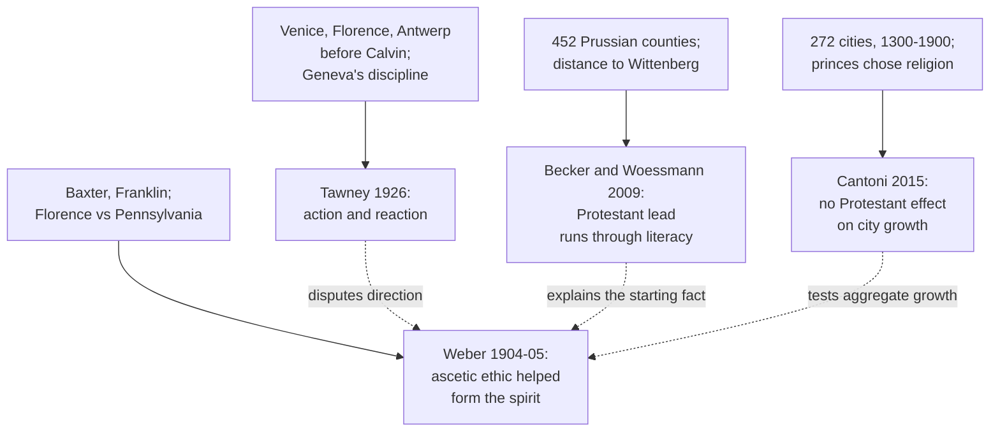

# Social Theory · Lesson 4.2: The Protestant ethic on trial

> ⏱ ~15 min · Module 4: Weber · Builds on: [4.1 The Protestant ethic and the spirit of capitalism](04-01-the-protestant-ethic-and-the-spirit-of-capitalism.md), [1.3 Understanding](01-03-understanding-webers-interpretive-method.md), [1.4 Testing a social explanation](01-04-testing-a-social-explanation.md) · Unlocks: [4.3 Domination and the three types of authority](04-03-domination-and-the-three-types-of-authority.md)

## Why this matters

Few explanations in social science have been refuted as often as Weber's and survived. Historians of the 1920s said capitalism was older than Calvin and that commerce reshaped Puritanism. Economists of the 2000s ran the thesis through county and city data and found a different channel, then no effect at all. Each verdict lands on a slightly different claim. This lesson trains the skill the whole course rests on: pin down what an explanation predicts before asking whether the evidence sank it.

## The idea

Three claims travel under the name "the Weber thesis". Keep them apart.

- **The thesis proper (exegetical).** Ascetic Protestantism (Calvinism, and the Pietist, Methodist and Baptist movements) attached a psychological sanction to methodical work and acquisition and made them a duty. That ethos, the [spirit of capitalism](../reference.md#spirit-of-capitalism), was *one* cause of modern capitalism's spread. Weber gives Lutheranism a minor role. He expressly denies that capitalism as an economic system was a creation of the Reformation (ch. III). This is the [thesis](../reference.md#protestant-ethic-thesis) as [4.1](04-01-the-protestant-ethic-and-the-spirit-of-capitalism.md) stated it.
- **The starting fact (empirical).** Chapter I opens with a pattern Weber's German readers already argued about: in religiously mixed regions, owners of capital, managers and the upper ranks of skilled labour were overwhelmingly Protestant. The thesis was offered as part of the explanation of this fact.
- **The folk version.** Protestant places get richer because Protestants work harder. Weber never states this, but it is what most people mean by "Weber was wrong".

Now sort the critics by what they target.

| Critic | Target | Claim | Evidence |
|---|---|---|---|
| Tawney, *Religion and the Rise of Capitalism* (1926) | the thesis proper | commerce shaped Puritanism as much as the reverse | commerce before Calvin; Calvin's Geneva; the late date of Weber's Puritan sources |
| Becker and Woessmann (2009) | the starting fact | the Protestant lead ran through literacy | 452 Prussian counties, 1870s |
| Cantoni (2015) | near the folk version | Protestant cities grew no faster | 272 German cities, 1300 to 1900 |

Recall the two-part test from [1.3](01-03-understanding-webers-interpretive-method.md). An interpretive explanation needs **adequacy at the level of meaning** (the motive makes sense of the conduct) and [causal adequacy](../reference.md#causal-adequacy) (comparison shows the conduct follows the motive more often than it otherwise would). Weber's sources (Baxter's pastoral writing, Franklin's maxims) are strong on the first. Almost every critic attacks the second.

## Source

Weber anticipated the commonest objection. From ch. II (Parsons translation):

> The fact to be explained historically is that in the most highly capitalistic centre of that time, in Florence of the fourteenth and fifteenth centuries, the money and capital market of all the great political Powers, this attitude was considered ethically unjustifiable, or at best to be tolerated. But in the backwoods small bourgeois circumstances of Pennsylvania in the eighteenth century, where business threatened for simple lack of money to fall back into barter, where there was hardly a sign of large enterprise, where only the earliest beginnings of banking were to be found, the same thing was considered the essence of moral conduct, even commanded in the name of duty. To speak here of a reflection of material conditions in the ideal superstructure would be patent nonsense.

Read three things.

1. **The concession.** Weber calls Florence the most capitalistic centre of its time, so pre-Reformation Catholic commerce is not news to him. What Florence lacked, he says, is an *attitude*: there acquisition was tolerated; in Pennsylvania it was commanded.
2. **The comparison.** Florence had rich material conditions and a weak ethic; Pennsylvania had poor conditions and a strong one. If the ethic merely reflected the economy, the pattern should run the other way. The last sentence borrows the base-and-superstructure vocabulary of [2.1](02-01-historical-materialism.md) in order to reject it.
3. **The limit.** These are two chosen cases, three centuries apart. They show the ethic is not a simple function of local commerce. They cannot show where the ethic came from.

## The argument

Tawney's critique, reconstructed from his 1926 book and from his foreword to Parsons's 1930 translation:

- **P1.** Capitalist enterprise, and a recognizable capitalist spirit, flourished in fourteenth-century Venice and Florence and fifteenth-century Antwerp, before Calvin.
- **P2.** Calvin's own order at Geneva put economic life under strict religious discipline. Early Calvinism was collectivist, not individualist.
- **P3.** Weber's portrait of the pious businessman comes mostly from English Puritans of the later seventeenth century, three generations after Calvin. By then Puritanism had made its peace with prosperity and resisted interference in business by both state and clergy.
- **P4.** Between those dates came commercial expansion, monetary upheaval and the rise of commercial classes within Puritanism. Similar shifts in economic ethics appeared among Catholic writers too.
- **∴ C.** The Puritan economic ethic was moulded by economic change as much as it moulded it, and Weber put too exclusive a weight on religious ideas.

*In words:* part of what Weber treats as a cause is also an effect.

**What kind of explanation.** Tawney is not offering mirror-image materialism. In the foreword he says that deriving the religious changes purely from economic movements would be just as one-sided. His model is "action and reaction": arrows run both ways, and only the economic side Weber set aside can fix their relative weight. He grants the association; he even cites a pamphleteer of 1671 who already contrasted Catholic inaptness for business with Reformed industry. He grants Weber's reconstruction of meaning. What he attacks is causal adequacy and the direction of the arrow: [Tawney's reversal](../reference.md#tawneys-reversal).

**Where the argument is weakest.** The step from P4 to C. Weber's defenders say that coincidence in time is not causation: commerce grew and the ethic shifted together, which shows only that both moved. Pennsylvania even shows the ethic without the commerce. A second attack goes at P1, which they say equivocates on "capitalist spirit". Florentine bankers had acquisitiveness and skill, but Weber's spirit is acquisition *as an ethical duty*. Tawney has a counter ready in the foreword: Weber narrows "capitalism" to suit his argument. That leaves the dispute partly definitional, and that cuts against Weber too. If the explanandum is defined as what the Puritans had, the thesis risks winning by definition.

## The evidence

**Becker and Woessmann, "Was Weber Wrong?" (*Quarterly Journal of Economics*, 2009).** Their [literacy explanation](../reference.md#literacy-explanation) runs like this. Protestantism asked every believer to read the Bible, so Protestant regions built schools and produced literate populations. Literacy is human capital, and human capital raises productivity. On this account prosperity is a by-product of reading, not of an ethic.

They test it on all 452 counties of Prussia, Weber's own state. Literacy comes from the 1871 census, the first to count it for the whole population. The outcomes, from the 1870s and 1880s, are income tax per head, teachers' incomes and the share of workers outside agriculture. The starting fact holds: income-tax revenue per head was 9.1% higher in mostly-Protestant counties than in mostly-Catholic ones. To get from correlation to cause, they use distance to Wittenberg as an instrument. The Reformation spread outward from Luther's town in rough rings, so distance predicts Protestantism for reasons unrelated to later income. They find that Protestantism raised literacy, and that the literacy lead is large enough to account for practically the whole Protestant economic lead.

How strong is this, in words? The Protestant–prosperity association in Prussia is well documented. The claim that literacy accounts for it rests on one influential study and on its exclusion restriction, which no statistic can prove ([econometrics 3.6](../../econometrics/lessons/03-06-instrumental-variables.md)): distance must affect 1870s outcomes only through religion. The authors support it by showing that distance is unrelated to schools, universities, monasteries and urbanization before 1517. Two further cautions:

- The data are county aggregates, so 1.4's [ecological fallacy](../reference.md#ecological-fallacy) applies to any claim about individual Protestants.
- By the authors' own count, about 94% of Prussia's Protestants were Lutheran just before the 1817 church union.

**Cantoni, "The Economic Effects of the Protestant Reformation: Testing the Weber Hypothesis in the German Lands" (*Journal of the European Economic Association*, 2015).** After the Peace of Augsburg (1555), the ruler of each territory in the Holy Roman Empire chose its religion (*cuius regio, eius religio*). Whole cities therefore became Protestant or stayed Catholic by a prince's decision, not by self-selection of the enterprising, which guards against [selection](../reference.md#selection).

Cantoni tracks the populations of 272 cities from 1300 to 1900, using [city size](../reference.md#cantoni-city-size-test) as the standard proxy for pre-industrial prosperity: in a Malthusian economy, gains in productivity show up as more people. The result is that Protestant and Catholic cities grew alike. The estimate is precise enough to rule out sizeable effects, and it survives an instrumental-variables version. It also holds when only the 21 Reformed (Calvinist) cities count as Protestant; the dataset has 163 Lutheran ones. In words: a single careful study, with a precise null on one outcome.

This quantitative work has left many economists doubtful of a work-ethic channel; Weber's defenders reply that it tests the starting fact and the folk version, not the thesis proper. There is no consensus.

## Worked examples

**Example 1: the theory classifies a Catholic financier.** In ch. II Weber takes up Jacob Fugger, the Augsburg banker of the early sixteenth century. A retired associate urged Fugger to stop, since he had made enough. Fugger replied that he wanted to make money as long as he could. Weber's verdict is that this is commercial daring and a morally neutral personal inclination, while Franklin's maxims are an ethically coloured rule for the conduct of a whole life. So the thesis is untouched by a rich Catholic capitalist: Fugger is capitalism without the spirit.

The price: the classification rests on Weber's reading of one remark, adequacy at the level of meaning only. Unless the ethos has independently checkable markers (reinvestment rather than display, distrust of rest), any counterexample can be reclassified.

**Example 2: the Lutheran problem.** Weber's starting fact comes from Germany, where most Protestants were Lutheran. But his mechanism belongs to Calvinism and the sects, and of Luther he writes that "the mere idea of the calling in the Lutheran sense is at best of questionable importance for the problems in which we are interested" (ch. III). That leaves two routes, and both cost something.

- **The thesis explains the German gap.** Then the ascetic ethic must have spread into Lutheran Germany. Weber leaves room for this: Pietism, which he says began in the Calvinist movement, was absorbed into the Lutheran Church in the late seventeenth century.
- **The thesis does not explain it.** Then chapter I's starting fact needs some other channel.

Either route is a checkable claim, and the second is the opening the econometric critics use.

## Watch out

- **You might think pre-Reformation capitalism refutes Weber.** In fact he concedes it (ch. III), and his explanandum is an ethos. The concession has a price, though: the thesis is only as testable as the ethos is measurable.
- **You might think the economists showed that Protestantism did not matter.** Becker and Woessmann find that it *did* raise prosperity in Prussia, through a different channel. Cantoni finds no effect on one outcome. These are explanatory findings. They say nothing about whether Protestant theology is true or whether a work ethic is admirable; those are evaluative questions, and they belong elsewhere.
- **You might think Tawney simply reversed Weber.** He called the pure economic reading equally one-sided. "Tawney's reversal" is shorthand for adding the reverse arrow.

## One-liner

> Weber's critics each convicted a different defendant: Tawney the direction of the arrow, Becker and Woessmann the channel behind a nineteenth-century gap, Cantoni the folk claim that Protestant towns grew faster; the thesis proper, an ethos as one cause among others, is still awaiting a test that can see an ethos.

## Problems

**P1 (🟢)** *(Exegetical.)* From ch. III (Parsons):

> we have no intention whatever of maintaining such a foolish and doctrinaire thesis as that the spirit of capitalism (in the provisional sense of the term explained above) could only have arisen as the result of certain effects of the Reformation, or even that capitalism as an economic system is a creation of the Reformation. In itself, the fact that certain important forms of capitalistic business organization are known to be considerably older than the Reformation is a sufficient refutation of such a claim. On the contrary, we only wish to ascertain whether and to what extent religious forces have taken part in the qualitative formation and the quantitative expansion of that spirit over the world.

(a) Which reading does the passage support? **(i)** Without the Reformation there would have been no spirit of capitalism. **(ii)** Religious forces were one contributor to the formation and spread of an ethos, and how large a contributor is an open question. **(iii)** Protestant regions should show faster economic growth than Catholic ones. Name the words that rule out each reading you reject. (b) Name one finding about fourteenth- or fifteenth-century Florence that *would* count against the thesis as this passage states it. Three sentences or fewer per part.

**P2 (🟡)** *(Exegetical (a) · Evaluative (b).)* Weber and Tawney agree that seventeenth-century observers linked Calvinist zeal with commercial enterprise. (a) Find the crux: name the single premise Weber needs that Tawney denies. (b) Say what historical evidence would move that premise either way, and how far Weber's Florence–Pennsylvania comparison (the Source) bears on it. Any verdict. 150 words or fewer in total.

**P3 (🔴)** *(Exegetical (a) · Evaluative (b).)* (a) State what Cantoni's design compares, and the assumption that lets city size stand in for prosperity. (b) A commentator says Cantoni "settles the Weber debate against Weber." Say what the precise null can show about Weber's thesis and what it cannot, and say how far the Reformed-cities result answers the most obvious Weberian reply. Any verdict. 150 words or fewer for (b).

Solutions

**P1** *(Exegetical.)*

**Must hit, strict (a):**

- Reading (ii). The deciding words are "only wish to ascertain whether and to what extent religious forces have taken part in", which make religion one contributor whose size is to be measured.
- "Could only have arisen as the result of certain effects of the Reformation" is the claim Weber calls foolish, which rules out (i).
- (iii) is ruled out because the passage's object is "that spirit", its "qualitative formation and the quantitative expansion". That means the spread of an ethos, not output or growth. Capitalism as an economic system is explicitly set aside.

**Must hit, strict (b):**

**Accept:** any finding showing that the *ethos* (acquisition as an ethical duty, methodical work as a calling) was widespread and morally approved in pre-Reformation Florence, independently of Protestant influence. Example: merchants' and moralists' writings that treat relentless acquisition as a positive duty rather than something tolerated.

**Wrong turns:** citing the Medici bank or double-entry bookkeeping. The passage concedes that business forms are older than the Reformation, so they count for nothing against it. Choosing (iii) because Weber's chapter I starts from an economic gap: this passage defines the thesis's object as the spirit.

**Model answer:** (a) Reading (ii). Weber calls the claim that the spirit "could only have arisen" from the Reformation "foolish and doctrinaire", which rules out (i). He sets aside "capitalism as an economic system" and studies only how far religious forces shaped "that spirit", its formation and spread, which rules out (iii). (b) Evidence that Florentine merchants and their confessors treated ceaseless acquisition as a moral duty, the Franklin attitude, would count against it. The Source says Florence had the opposite attitude.

---

**P2** *(Exegetical (a) · Evaluative (b).)*

**Must hit, strict (a):**

- The crux is the direction or source of the Puritan economic ethic. Weber needs the premise that the methodical-calling ethic he documents derives from religious ideas (predestination, the need for proof, the calling) independently of the economic interests of the people who held it. Tawney denies this for his period: the later Puritan ethic was partly an accommodation to commercial change and commercial adherents.
- Not the crux: whether capitalism predates the Reformation, or whether the association existed. Both men accept both.

**Must hit, any verdict (b):**

- Name discriminating evidence:
  - timing: did the calling ethic appear in pastoral teaching before commercial strata came to dominate Puritan congregations, or after?
  - variation: did Calvinist communities with little commerce develop it? Did Catholic writers in commercial settings develop the same ethic, which would erode Weber's distinctiveness?
- Weigh the Source. It tells against a crude reflection theory, since it shows a strong ethic with weak commerce. But Franklin's Pennsylvania inherited a ready-formed ethic. Tawney's claim is about how that ethic was formed in seventeenth-century England, so the comparison bears on it only weakly.

**Wrong turns:** stating Tawney's view as "economics caused religion", which he called equally one-sided. Treating the 1671 pamphlet as evidence for Weber's direction, when both men accept the association it reports.

**Model answer (b), one of several:** Timing would move it. If ascetic teaching on the calling is fully present in Puritan pastoral literature before merchants dominate the congregations, Weber's direction gains. If the teaching softens toward business only as merchants join, Tawney's does. The Florence–Pennsylvania pair helps Weber only against a crude version. It shows the ethic need not track local commerce, but Pennsylvania imported the ethic ready-made, and the dispute is about where it was made.

---

**P3** *(Exegetical (a) · Evaluative (b).)*

**Must hit, strict (a):**

- The design compares the population growth of 272 cities in the Holy Roman Empire, 1300–1900, before and after the Reformation, Protestant against Catholic. A city's religion was set by its ruler after 1555.
- The proxy rests on a Malthusian assumption: productivity gains show up as larger city populations. This needs a comparable demographic response, and migration along confessional lines, in both groups.

**Must hit, any verdict (b):**

- Can show: no sizeable Protestant advantage in urban growth in the German lands. That tells against the folk version, and against any version of the thesis that implies faster aggregate growth there.
- Cannot show:
  - anything about the ethos or about who did business (the outcome is population, not conduct);
  - anything about English or Dutch Puritanism, where Weber's evidence lies;
  - anything if the spirit diffused across confessions, which would mute the gap.
- The Reformed-cities result answers the Lutheran objection in part. But it rests on 21 cities, and a Calvinism imposed by a prince on a whole territory may not be the zealous believers' Calvinism the mechanism needs.

**Wrong turns:** concluding that Weber is refuted, or that the study is irrelevant, without saying which claim it tests. Forgetting that the Reformed check exists.

**Model answer (b), one of several:** It does not settle the debate; it settles one claim. A precise null on city growth makes it hard to hold that Protestantism made German towns grow faster, and the Reformed-only check removes the easy answer that Lutherans were the wrong Protestants. It cannot reach Weber's explanandum, a methodical ethos among believers, which could change how and by whom business was done without enlarging cities. Nor does it test the English and Dutch Puritans Weber actually used. Twenty-one cities converted by princely decree are thin evidence about zealous Calvinist minorities.

## Flashback

**From Lesson [3.3](03-03-religion-as-social-the-elementary-forms.md) (Religion as social: *The Elementary Forms*):** *(Exegetical (a) · Evaluative (b).)* From an invented weekend newspaper column, not the words of any real person or outlet:

> "Durkheim showed that the sacred is a group's own force, felt in assembly. Look at any cup final: eighty thousand people singing as one, scarves held high, grown men in tears. That is religion in his sense, full stop. It has simply moved from the pew to the stand, and a club's supporters are a Church. It also explains the empty pews: people who get their effervescence on Saturday no longer need it on Sunday."

(a) Name the part of Durkheim's definition of religion that the column's test, intense collective feeling, leaves out, and say what a supporters' club would have to show to meet it. Two sentences.

(b) The last two sentences explain falling church attendance. Say what kind of explanation this is in Module 1's terms, and name one comparison that could test it and one trap that comparison must avoid. 100 words or fewer; any verdict. You are not asked whether any religion is true.

Solution

**Accept (a):** any answer naming the set-apart, interdict-guarded character of the sacred (with or without the system of beliefs and practices around it), plus a concrete marker a club could show.

**Must hit, strict (a):**

- Left out: sacred things are *set apart and forbidden*, absolutely heterogeneous from the profane and guarded by interdicts. Being intensely valued is not enough; Durkheim calls a miser's "religion" of gold a metaphor. Effervescence is how, on his account, the sacred arises; it is not the definition.
- To meet it: things set apart by interdicts whose breach brings sanction or outrage, with beliefs and practices about them that bind adherents into a moral community. The intensity of a match day shows none of this by itself.

**Must hit, any verdict (b):**

- Kind: a functional-equivalents claim ([1.2](01-02-functional-explanation-and-its-critics.md)). The match is said to supply the renewal of sentiment that worship supplied, so demand for worship falls; it stretches Durkheim's functional conclusion (C7). It also carries an interpretive premise ([1.3](01-03-understanding-webers-interpretive-method.md)): that people attended church *for* the effervescence.
- A comparison: for example, follow similar individuals over years and ask whether those who take up regular match-going cut church attendance more than those who do not; or compare places where match attendance rose with otherwise similar places where it did not.
- A trap ([1.4](01-04-testing-a-social-explanation.md)): the ecological fallacy, if aggregate trends (stands fill as pews empty) are read as facts about individuals; or confounding by a common cause that moves both, such as generational change; or selection, if those already drifting from church are the ones who take up the match.

**Wrong turns:** treating the substitution claim as following from Durkheim's definition; it is a separate causal claim that needs its own evidence. Rejecting (a) because football has no god, when Durkheim's definition deliberately needs none. Turning (b) into a verdict on whether faith is "just" team spirit, which is the genetic-fallacy question this course flags and does not settle.

**Model answer:** (a) The column leaves out that the sacred is *set apart and forbidden*, guarded by interdicts, not merely felt intensely. A supporters' club would need things its members treat as untouchable, with beliefs and practices about them that bind the members into a moral community. (b) It is a functional-equivalents claim: the match supplies the renewal worship supplied, so worship loses its function. It also assumes people went to church for the effervescence. Test it on individuals: follow similar people over years and ask whether those who start going to matches cut church attendance more than those who do not. The trap is reading it off aggregate trends, which is the ecological fallacy and leaves anything that moves both, such as generational change, uncontrolled.

## Connections

- **Backward:** The thesis on trial is [4.1](04-01-the-protestant-ethic-and-the-spirit-of-capitalism.md). The two-part test (meaning and causal adequacy) is [1.3](01-03-understanding-webers-interpretive-method.md). Confounding, selection and the ecological fallacy, which every study here must handle, are [1.4](01-04-testing-a-social-explanation.md). Weber's "ideal superstructure" jab borrows the vocabulary of [2.1](02-01-historical-materialism.md).
- **Forward:** Module 4's boss problem reads the closing pages of *The Protestant Ethic* against these critics. [4.4](04-04-bureaucracy-rationalization-and-disenchantment.md) follows the ethic after its religious root, into rationalization and disenchantment. [7.1](07-01-classical-secularization-theory.md) inherits Weber's account of religion's retreat from economic life.
- **Sideways:** Becker and Woessmann's identification stands or falls with an exclusion restriction, the subject of [econometrics 3.6](../../econometrics/lessons/03-06-instrumental-variables.md). Pre-Reformation Italian and Flemish credit, the background to Tawney's P1, is [history-of-debt 2.1](../../history-of-debt/lessons/02-01-commerce-around-the-prohibition.md).
