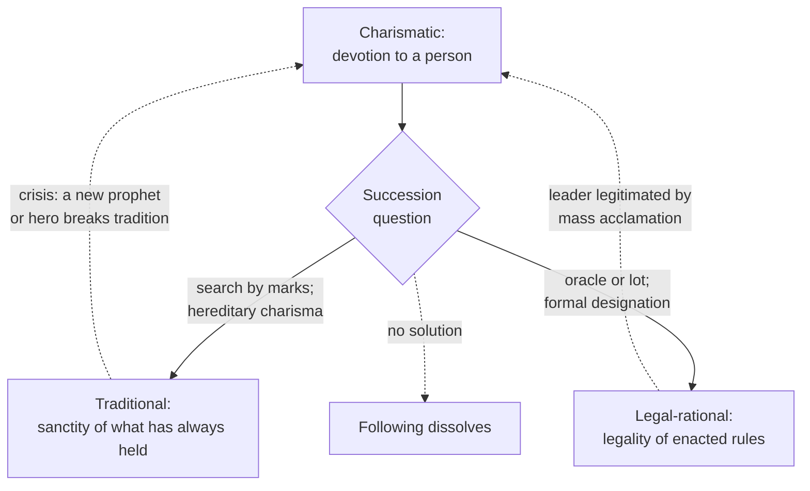

# Social Theory · Lesson 4.3: Domination and the three types of authority

> ⏱ ~15 min · Module 4: Weber · Builds on: [1.3 Understanding: Weber's interpretive method](01-03-understanding-webers-interpretive-method.md), [4.2 The Protestant ethic on trial](04-02-the-protestant-ethic-on-trial.md) · Unlocks: [4.4 Bureaucracy, rationalization, and disenchantment](04-04-bureaucracy-rationalization-and-disenchantment.md)

## Why this matters

A prophet dies, a crown passes to an infant, a president's term ends: in each case thousands of people go on obeying someone they did not obey yesterday, or they stop. Why? [`political-philosophy` 1.1](../../political-philosophy/lessons/01-01-the-problem-of-political-authority.md) asks the normative question, whether anyone *ought* to obey. Weber asks the sociological one: what makes obedience reliable, and what happens to it when its source changes? His three types of legitimate authority, and the routinization of the most unstable one, are still the first map reached for when a movement outlives its founder.

## The idea

Start with two words Weber keeps apart in *Economy and Society* (*Wirtschaft und Gesellschaft*, published 1922). **Power** (*Macht*) is any chance of carrying through your will against resistance, whatever it rests on: a mugger has it. **Domination** (*Herrschaft*, also rendered "authority") is narrower. In my translation of Kap. I, § 16, it is:

> the chance of finding obedience for a command of specific content among specifiable persons

So domination is a standing relationship of command and obedience. See [power and domination](../reference.md#power-and-domination).

Why do people obey? Out of habit, out of interest (the paycheck), out of affection, out of conviction. Weber's point (Kap. III, § 1) is that none of these alone is a *reliable* foundation; bonds of pure interest, he says, are relatively unstable. Normally something else is added: the **belief in legitimacy**, the belief that this command is rightful and so obeying it is a duty. Every domination, he says, seeks to awaken and cultivate that belief. This is **descriptive**: legitimacy here is a fact about what a population believes, "a belief that stabilizes domination", not a verdict that the rulers deserve obedience. See [legitimacy as belief](../reference.md#legitimacy-as-belief).

Sort dominations by the *kind* of legitimacy they claim and you get three pure types, all [ideal types](../reference.md#ideal-types) in the sense of [1.3](01-03-understanding-webers-interpretive-method.md): one-sided accentuations that no real case matches exactly.

| Type | Belief | Obeyed | Staff |
|---|---|---|---|
| Legal-rational | enacted rules are legal | the impersonal order and whoever it appoints | officials (4.4's bureaucracy) |
| Traditional | what has always held is sacred | the person tradition calls, within tradition's bounds | personal retainers, kin, favourites |
| Charismatic | this person is extraordinary | the leader as such | disciples, a following |

Charisma is the odd one out. It is personal, and it must keep being **proved** (*Bewährung*): if the leader's power fails and his rule brings his followers no well-being, his authority is likely to vanish. It also cannot survive its bearer unchanged. When the movement wants to last, it must become *everyday*: Weber's word for routinization, *Veralltäglichung*, literally means "making everyday".

## Source

Weber, *Wirtschaft und Gesellschaft* (1922), Kap. III, § 2. My translation from the German original:

> There are three pure types of legitimate domination. The validity of their legitimacy can, namely, be primarily of:
> 1. rational character: resting on the belief in the legality of enacted orders and in the right of those called by them to exercise domination to issue directives (legal domination) — or
> 2. traditional character: resting on the everyday belief in the sanctity of traditions valid from of old and in the legitimacy of those called by them to authority (traditional domination) — or finally
> 3. charismatic character: resting on extraordinary devotion to the sanctity or the heroic power or the exemplary character of a person and of the orders revealed or created by that person (charismatic domination).

Three things to notice. **"Primarily"** (*primär*): types are classified by their dominant ground, so mixtures are expected. **"Belief"** appears in 1 and 2, **"devotion"** in 3: every type rests on what the dominated hold, not on what is true of the rulers. And the hinge of the whole lesson sits in two adjectives: tradition rests on an **everyday** (*Alltags-*) belief, charisma on an **extraordinary** (*außeralltäglich*) devotion. Routinization is the passage from the second adjective to the first.

## The argument

**Why legitimacy, and why three types (Kap. III, §§ 1–2).**

1. Domination is the chance that commands find obedience among specifiable people; every genuine case involves some minimum will to obey.
2. Custom, material interest, affect and value commitment can each motivate obedience, but none alone gives a reliable foundation.
3. Normally a belief in legitimacy is added, and every domination seeks to awaken and cultivate it. *In words:* rulers do not settle for compliance; they work at being believed rightful.
4. The kind of legitimacy claimed fixes the kind of obedience, of administrative staff and of rule, and so their effects.
5. ∴ Dominations are best classified by their typical claim to legitimacy: legal, traditional, charismatic.

**Why charisma routinizes (§§ 10–11).**

6. Charismatic authority rests on the followers' recognition of a personal gift, which must keep being proved.
7. If the relationship is to last, the followers, and still more the staff, have ideal and material interests in putting it, and their own positions, on a durable everyday footing.
8. These interests become acute when the bearer dies and the succession question opens.
9. ∴ Lasting charisma must change character: in my translation of § 11, it "becomes traditionalized or rationalized (legalized) or both in various respects", and how the succession is solved largely fixes what the community becomes.

**What kind of explanation.** Steps 1–5 are a classification by [ideal types](01-03-understanding-webers-interpretive-method.md), not yet an explanation. The explanatory claims sit in step 3 (belief stabilizes domination) and step 9 (succession forces routinization). Both run through actors' motives, so they are individualist in the explanatory sense of [1.1](01-01-individuals-and-social-facts.md) and interpretive: obedience is explained by what it means to the one who obeys. Step 3 sounds functional ("stabilizes"), but it names a mechanism, rulers deliberately cultivating belief, so it is not the bare benefit claim [1.2](01-02-functional-explanation-and-its-critics.md) warned against. Step 7 is an interest mechanism: the disciples need salaries and the faithful need a church.

Weber lists six ways the succession question gets solved (§ 11): **(a)** a search for a new bearer by marks (his example: the search for a new Dalai Lama), which traditionalizes; **(b)** revelation by oracle or lot, where legitimacy derives from the technique (legalization); **(c)** designation by the leader, recognized by the community; **(d)** designation by the charismatically qualified staff, recognized by the community, which he insists is not a majority election but the duty to identify the right one; **(e)** hereditary charisma, the gift as a quality of blood; **(f)** office charisma, the gift transferable by ritual (anointing, ordination) to whoever holds the office.

**Where the argument is weakest.** Premise 3. A critic says compliance is mostly explained without any belief in rightfulness: by fear, by habit, by having no visible alternative. Michael Mann ("The Social Cohesion of Liberal Democracy", *American Sociological Review*, 1970) argued from survey evidence that subordinate classes in liberal democracies largely accept the order pragmatically rather than out of normative commitment. David Beetham (*The Legitimation of Power*, 1991) presses a conceptual version: if legitimacy just *is* belief in legitimacy, a regime that manufactures belief becomes legitimate by definition, and Weber loses the difference between being believed justified and being justifiable by the subjects' own standards. There is also a testing problem: if belief is inferred from compliance, it cannot explain compliance. How much work belief does is **contested**. The routinization claim fares better, as a regularity across many religious and political movements, but its evidence is historical case material, open to [selection](../reference.md#selection) ([1.4](01-04-testing-a-social-explanation.md)): movements that never routinized mostly vanished from the record.

## The explanation

Solid arrows are routinization. The dashed return arrows mark Weber's other claims: charisma is the great revolutionary force in tradition-bound epochs, and plebiscitary leadership is, in his words, a kind of charismatic domination hiding under a legitimacy derived from the will of the dominated.

## Worked examples

**Example 1 (the theory explaining a real case: the Latter Day Saints, 1844).** Joseph Smith, founder of the movement, was killed at Carthage, Illinois, on June 27, 1844, with no settled rule of succession. Weber's § 10 itself names the founder of the Mormons as an instance of charisma, and insists that value-free sociology treats his charisma exactly like that of the most revered prophets: in my translation, how the quality would be judged "objectively" from any ethical standpoint is "conceptually wholly indifferent"; what matters is how the followers judge it. Run the claimants through § 11:

- **Sidney Rigdon**, the only surviving member of the First Presidency, offered himself as "guardian": a claim from standing office.
- **James Strang** produced a letter of appointment said to be from Smith, plus a claimed angelic ordination: solution (c), designation by the leader, backed by fresh revelation.
- **Brigham Young** argued that Smith had conferred the authority to lead on the Quorum of the Twelve Apostles: solution (d), designation through the charismatically qualified staff. At a Nauvoo meeting on August 8, 1844, the congregation sustained the Twelve by common consent, and opponents were later excommunicated. That fits Weber's description of (d) closely: not a majority vote among options but recognition of the rightful bearers, with persistence in error treated as a fault.
- **Joseph Smith III**, eleven at his father's death, was the hereditary claim (e); in 1860 he became prophet-president of what became the Reorganized Church (now Community of Christ).

Weber's account fits what followed, in outline: competing solutions found competing communities, and the largest, led by the Twelve, in time settled into rules of apostolic seniority: traditionalized and legalized. Reports that Smith's "mantle" fell visibly on Young during the August speech add a charismatic legitimation on top of the staff solution; the earliest dated reference is from November 1844, and historians dispute how far the accounts are contemporary. Note the claim types: whether Smith was a prophet is not something this classification, or sociology, settles; that question belongs to [`philosophy-of-religion`](../../philosophy-of-religion/syllabus.md).

**Example 2 (a hard case: the British crown).** A hereditary monarchy is Weber's own example of hereditary charisma turned traditional: belief attaches not to the person's gifts but to legitimate acquisition by the order of inheritance. But the Succession to the Crown Act 2013, in force from March 26, 2015 alongside the other realms that share the monarch, ended male preference for anyone born after October 28, 2011. If Parliament can rewrite the order of inheritance, is the crown's authority traditional or legal?

One reading: legal-rational is primary. Title has rested on statute since the Act of Settlement of 1701, and the monarch acts on ministerial advice. The other: traditional is primary. People revere the line and its rituals (coronation anointing is Weber's own example of royal office charisma); the statute adjusted a detail inside a frame no one voted on. Weber's "primarily" says the answer lies in the believers' grounds, which makes it empirical. A discriminating test: if the office were filled by parliamentary appointment instead of birth, would the loyalty transfer? The typology tells you where to look, not what you will find.

## Watch out

- **You might think "legitimate domination" means justified rule, but actually it means believed-rightful rule.** Weber's claim is descriptive and empirical; whether any of the three grounds *should* command obedience is an evaluative question owned by [`political-philosophy` 1.1](../../political-philosophy/lessons/01-01-the-problem-of-political-authority.md). Confusing the two turns exegesis into a verdict.
- **You might think charisma is charm or popularity, but actually it is a recognized extraordinary gift that grounds a duty to follow.** A well-liked mayor obeyed because she holds office is legal-rational; a leader followed in defiance of the rules is charismatic, however unattractive he is.
- **You might think the three types are boxes every case fits in, but actually they are ideal types.** Real authority mixes them; classify by the primary ground and say what the secondary ones contribute.

## One-liner

> Obedience lasts when it is believed rightful, by law, by tradition, or by devotion to an extraordinary person, and the last kind survives its bearer only by becoming one of the other two.

## Problems

**P1 (🟢) *(Exegetical.)*** Using Kap. III, § 2 (the Source), classify each case as primarily legal-rational, traditional or charismatic, and name the word or phrase of § 2 that decides it. One or two sentences each.

(i) In 1860 about a thousand volunteers sailed with Giuseppe Garibaldi to Sicily, holding no commission from any state, because they would follow him.

(ii) A US Social Security claims examiner denies a disability claim, citing a federal regulation; the claimant, who thinks the decision wrong, files an appeal by the procedure the letter describes.

(iii) Franklin Roosevelt won four presidential elections; the Twenty-second Amendment (ratified 1951) now bars anyone from being elected president more than twice. What type of authority does the office have, and what danger to it, in Weber's terms, does the amendment guard against?

**P2 (🟡) *(Exegetical (a) · Evaluative (b).)*** Weber's own example of solution (a) is the search for a new Dalai Lama. In 1995 the Fourteenth Dalai Lama, in exile, recognized Gedhun Choekyi Nyima as the reincarnated Panchen Lama; the Chinese authorities instead named Gyaincain Norbu, whose name was drawn from a Golden Urn, a lottery procedure dating from a Qing imperial decree of the 1790s. In July 2025 the Dalai Lama affirmed that his institution will continue and that only his Gaden Phodrang Trust may recognize his successor; the Chinese government holds that reincarnations require central-government approval and the Golden Urn.

(a) Place each rival procedure on Weber's § 11 list of succession solutions, and say where each derives its legitimacy. Two sentences per procedure.

(b) What does Weber's account predict about whom Tibetan Buddhists will recognize after the next succession, and what observation would count against that prediction? 120 words or fewer. Do not judge which candidate is the true reincarnation.

**P3 (🔴, optional) *(Exegetical.)*** From an invented op-ed in a regional paper:

> "A new poll finds that 78 percent of Mirellanders trust President Osk. As Max Weber showed, legitimacy is simply a matter of belief, so the regime is legitimate and its critics are simply wrong. And since that trust is in Osk himself, the regime is secure for a generation."

Name the two places the author misuses Weber, pointing to this lesson's concepts for each. 100 words or fewer.

Solutions

**P1** *(Exegetical — strict.)*

**Must hit, strict:**

- (i) Charismatic: no enacted order and no tradition calls Garibaldi to command; the volunteers follow the person. Deciding words: "devotion to … the heroic power … of a person".
- (ii) Legal-rational: obedience goes to the "legality of enacted orders" and to the examiner as one "called by them" to issue directives; the appeal confirms it, since the dissatisfied claimant contests the decision inside the same rules rather than against them.
- (iii) Legal-rational: the president commands by an enacted constitution. The danger is drift toward personal, charismatic authority: plebiscitary leadership, which Weber calls charismatic domination hiding under a legitimacy derived from the voters. The amendment ties the office to a rule and not to any one person's continuing appeal.

**Wrong turns:** calling (ii) traditional because bureaucratic routine is habitual (habit is a motive; the ground of legitimacy is legality); saying in (iii) that FDR's authority was charismatic and therefore the office is (the office's ground is enacted; the worry is about a person's following coming to outweigh it).

**Model answer:** (i) Charismatic: the volunteers followed Garibaldi as such, the "heroic power … of a person", with no enacted or traditional title. (ii) Legal-rational: the examiner is obeyed as one "called by" "enacted orders", and the appeal goes through the same rules. (iii) The presidency is legal-rational, resting on "enacted orders". The amendment guards against its ground shifting from the rule to one leader's personal following, a plebiscitary, in Weber's terms charismatic, authority dressed in elected form.

---

**P2** *(Exegetical (a) · Evaluative (b).)*

**Accept:** any prediction that derives recognition from belief in the procedure and names an observation that could falsify it.

**Must hit, strict (a):**

- Recognition by the Dalai Lama and his Trust: solution (a), search for the bearer by marks, which traditionalizes; legitimacy rests on belief in the established signs and in the recognizers' authority (there is an element of designation, (c), since the predecessor names who may recognize).
- The Golden Urn: solution (b), selection by lot, whose legitimacy is derived from belief in the technique (legalization); joined to the state's approval, a legal-rational claim by an outside authority.

**Must hit, any verdict (b):**

- Legitimacy follows the believers' recognition of the procedure, not the procedure's formal authority; so each candidate commands obedience among those who accept that procedure's ground.
- A prediction: a split succession (as in 1995), with recognition tracking each population's beliefs, and compliance with the state's candidate where it rests on state power rather than belief would be, in Weber's terms, less stable.
- A disconfirming observation: for instance, devotion to a state-selected candidate spreading among those who rejected the procedure, without coercion, or belief transferring with the office whatever the procedure.

**Wrong turns:** ruling on which candidate is authentic (a religious question this course does not settle); treating the state's procedure as automatically illegitimate (Weber's question is what is believed, not what is rightful).

**Model answer (b), one of several:** Weber predicts that each candidate will be obeyed as far as believers accept the ground on which he was chosen. Those who accept the Dalai Lama's recognition as the valid procedure will recognize his Trust's candidate; the state's candidate will command formal compliance where state power reaches, but that compliance, resting on coercion and interest more than belief, should prove the less stable. The prediction fails if, over time, devotion to a state-selected candidate grows among the very people who rejected the Golden Urn, without pressure.

---

**P3** *(Exegetical — strict.)*

**Must hit, strict:**

- Descriptive vs normative: Weberian legitimacy is a belief that stabilizes domination; it does not make the regime legitimate in the normative sense, and so cannot show critics "wrong" ([`political-philosophy` 1.1](../../political-philosophy/lessons/01-01-the-problem-of-political-authority.md)). (Trust in a person is also not yet belief in a ground of legitimacy.)
- Charisma and succession: trust in Osk himself is personal authority, the type that does not transfer; Weber predicts a succession problem, so personal trust is evidence of fragility past Osk's tenure, not security for a generation.

**Wrong turns:** objecting only that polls are unreliable (true, but not a misuse of Weber).

**Model answer:** First, the op-ed treats Weber's descriptive legitimacy, a belief that stabilizes domination, as a normative verdict; a widely believed regime can still be unjust, so belief cannot prove the critics wrong. Second, trust "in Osk himself" is personal, charismatic-style authority, which Weber says cannot outlast its bearer without routinization; it predicts a succession crisis, not a secure generation.

## Flashback

**From Lesson [4.1](04-01-the-protestant-ethic-and-the-spirit-of-capitalism.md) (The Protestant ethic and the spirit of capitalism):** *(Formal (a) · Exegetical (b).)* In ch. II (Parsons), Weber reports a difficulty employers met with surprising frequency at harvest time. A mower paid 1 mark per acre mowed 2½ acres a day. When the piece rate was raised to 1.25 marks per acre, he could easily have mowed 3 acres, but he mowed only 2. Weber's gloss:

> A man does not "by nature" wish to earn more and more money, but simply to live as he is accustomed to live and to earn as much as is necessary for that purpose.

(a) Compute the mower's daily earnings before the raise, and after it at 2 acres and at 3 acres. How many acres at the new rate keep his earnings exactly where they were, and what does that tell you he was aiming at? (b) Using 4.1's definition of the spirit of capitalism, say which element of it the mower lacks, and why a case like this shows that the spirit needs a historical explanation rather than being the natural response to a chance of profit. Two sentences for (b).

Solution

**Worked arithmetic (a):**

- Before the raise: $1 \times 2.5 = 2.5$ marks a day.
- After it: $1.25 \times 2 = 2.5$ marks at 2 acres; $1.25 \times 3 = 3.75$ marks at 3 acres.
- Acres that hold earnings at 2.5 marks: $2.5 / 1.25 = 2$, exactly what he mowed. The rate rose 25 percent and his acres fell 20 percent, and $1.25 \times 0.8 = 1$, so his pay did not move.
- He was holding a fixed customary income and took the raise as less work, forgoing $3.75 - 2.5 = 1.25$ marks a day.

**Must hit, strict (b):**

- The missing element is acquisition as a duty and an end in itself. For the mower, earning is a means to a fixed, customary standard of living; past that point he prefers leisure to money.
- Why a historical explanation: if unlimited acquisitiveness were natural, a higher rate would call it out. Instead the appeal to interest met traditionalism and failed. So the spirit, which 4.1 notes is irrational from the standpoint of the individual's happiness, is a historically peculiar attitude whose origin needs a cause. That is the explanandum Weber's religious chain addresses.
- (Credit, not required:) incentives and market selection work on the attitude once it exists; they do not create it, which is 4.1's point that selection explains spread, not origin.

**Wrong turns:** Calling the mower lazy or irrational: given his aim he responds consistently, buying leisure with the raise; on Weber's account it is the spirit, not the mower, that is odd. Saying he lacks the *ascetic* element: he is not spending lavishly; what he lacks is acquisition as an end. Treating the case as evidence that Protestantism produced the spirit: it fixes what must be explained, not what explains it, which is [4.2](04-02-the-protestant-ethic-on-trial.md)'s question. In (a), reporting 3.75 marks as his new pay.

**Model answer:** (a) 2.5 marks before; after the raise, 2.5 marks at 2 acres and 3.75 at 3. Keeping pay at 2.5 marks takes $2.5 / 1.25 = 2$ acres, exactly his choice, so he was targeting his customary income and spent the raise on working less. (b) The mower lacks the core of the spirit, the idea that increasing one's earnings is a duty and an end in itself: money is a means to a customary standard of living, and beyond it he prefers leisure. Since a plain appeal to his interest left that traditionalism intact, acquisition without limit cannot be taken as human nature; it is a historically peculiar attitude that needs a cause, which is what Weber's religious chain sets out to supply.

## Connections

- **Backward:** Ideal types and interpretive explanation come from [1.3](01-03-understanding-webers-interpretive-method.md); the explanatory individualism of Weber's mechanisms from [1.1](01-01-individuals-and-social-facts.md); the test a stabilizing-belief claim must pass to escape the functionalist charge from [1.2](01-02-functional-explanation-and-its-critics.md). The selection worry about routinization evidence is [1.4](01-04-testing-a-social-explanation.md). The calling of [4.1](04-01-the-protestant-ethic-and-the-spirit-of-capitalism.md) is another case of an extraordinary religious motive becoming everyday conduct.
- **Forward:** [4.4](04-04-bureaucracy-rationalization-and-disenchantment.md) takes the legal-rational type's staff, bureaucracy, as an ideal type of its own, and asks what the spread of legal-rational rule does to the world.
- **Sideways:** The normative question, whether anyone ought to obey, is [`political-philosophy` 1.1](../../political-philosophy/lessons/01-01-the-problem-of-political-authority.md). Weber's definition of the state, a monopoly of legitimate physical coercion (Kap. I, § 17), belongs to [`comparative-politics`](../../comparative-politics/syllabus.md). Whether a social account of a prophet's authority bears on the truth of his claims is the genetic-fallacy question, owned by [`philosophy-of-religion`](../../philosophy-of-religion/syllabus.md).
