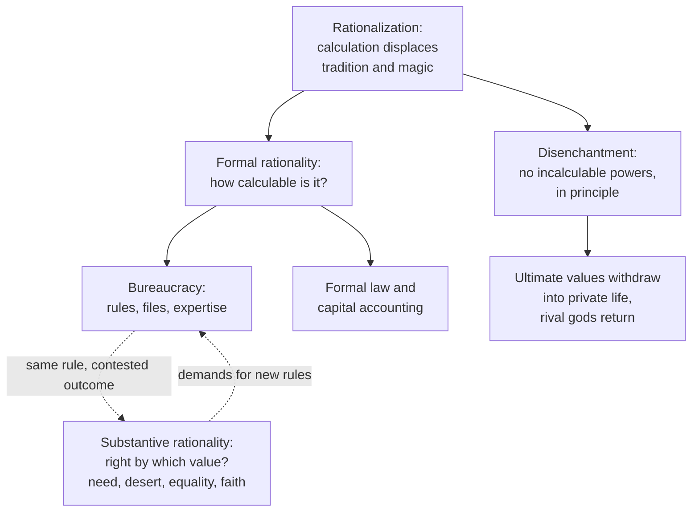

# Social Theory · Lesson 4.4: Bureaucracy, rationalization, and disenchantment

> ⏱ ~15 min · Module 4: Weber · Builds on: [4.3 Domination and the three types of authority](04-03-domination-and-the-three-types-of-authority.md), [1.3 Understanding: Weber's interpretive method](01-03-understanding-webers-interpretive-method.md), [1.2 Functional explanation and its critics](01-02-functional-explanation-and-its-critics.md) · Unlocks: [5.1 Simmel: sociation and the forms of social life](05-01-simmel-sociation-and-the-forms-of-social-life.md), [7.1 Classical secularization theory](07-01-classical-secularization-theory.md)

## Why this matters

"The system won't let me." Whoever has heard a clerk say that has met what Weber analysed in his last decade: an organization run on written rules, files and certified expertise, treating each case without regard to the person. He thought this form would spread wherever administration works at scale, as one face of a larger process, **rationalization**, whose cultural face he called the **disenchantment of the world**. This lesson builds his ideal type of bureaucracy, the distinction explaining why bureaucracies can do the calculable thing and the wrong thing at once, and what disenchantment claims.

## The idea

**Rationalization** is Weber's name for the long Western process in which calculation displaces tradition, personal discretion and magic: bookkeeping, codified law, the bureau, experimental science. In *The Protestant Ethic* it already reaches religion: the Puritans completed what Parsons renders "the elimination of magic from the world" ([4.1](04-01-the-protestant-ethic-and-the-spirit-of-capitalism.md)).

**The [ideal type of bureaucracy](../reference.md#ideal-type-of-bureaucracy).** *Economy and Society* (published posthumously, 1922), Part I ch. III §§3–5, describes the purest form of legal authority ([4.3](04-03-domination-and-the-three-types-of-authority.md)): rule through a bureaucratic staff. Its features, grouped:

1. **Rules and competences.** Officials obey only impersonal duties of office, within fixed jurisdictions, applying technical rules or legal norms.
2. **Hierarchy.** A fixed order of offices, with appeal upward and uniform discipline.
3. **Office as vocation.** Officials are appointed, not elected, on certified specialist qualification, ideally by examination. They are paid a fixed money salary graded by rank, treat the office as their main occupation, and expect a career, promoted by seniority or performance as superiors judge.
4. **Separation.** Officials own neither the means of administration nor their post. Office property is kept apart from private property, the bureau from the home.
5. **Files.** Proposals and decisions are fixed in writing. Files plus continuous work by officials make "the bureau", the core of every modern organization.

The ideal official conducts the office (§5, my translation):

> sine ira et studio, without hatred and passion, and therefore without "love" and "enthusiasm", under the pressure of plain concepts of duty; "without regard to the person", formally equal for "everyone"

This is an **[ideal type](../reference.md#ideal-types)**: a one-sided accentuation for measuring real organizations ([1.3](01-03-understanding-webers-interpretive-method.md)), not a portrait or a recommendation. And the top is never purely bureaucratic: ministers are officials only formally, since no qualification is required of them. That non-bureaucratic element is where [political-institutions 6.1](../../political-institutions/lessons/06-01-bureaucracy-merit-and-patronage.md)'s political layer sits.

**[Formal and substantive rationality](../reference.md#formal-and-substantive-rationality).** In ch. II §9 Weber defines the *formal* rationality of economic action as the degree of calculation technically possible and actually applied. *Substantive* (*materiale*) rationality is the degree to which outcomes satisfy some value postulate: ethical, political, egalitarian, status-based, or any other. Formal rationality is relatively unambiguous; substantive rationality is plural, one for each value standard. The two can come apart, an antinomy Weber says sociology meets again and again. Bureaucracy carries it inside: those who want their life chances secured demand formalism, since the alternative is arbitrariness, while officials lean toward a substantive, utilitarian handling of cases for the governed's welfare, which usually ends in demands for new rules.

**[Disenchantment](../reference.md#disenchantment)** is rationalization seen from inside a culture. Its classic statement is the lecture "Science as a Vocation" (Munich, 7 November 1917; published 1919).

## Source

From *Wissenschaft als Beruf* (1919), my translation:

> The increasing intellectualization and rationalization does not, then, mean an increasing general knowledge of the conditions of life under which one stands. It means something else: the knowledge or the belief that, if one only wanted to, one could find out at any time; that there are therefore in principle no mysterious, incalculable powers at play, but that one can, in principle, master all things by calculation. That, however, means: the disenchantment of the world. One need no longer, like the savage for whom such powers existed, reach for magical means in order to master or entreat the spirits. Technical means and calculation do that.

Read it closely. Just before, Weber notes that a tram passenger has no idea how the tram moves and needs none: he can "count on" it. So disenchantment is **not more knowledge**; the passenger knows less about his tools than the "savage" (Weber's period word) knew about his. It is a **belief about knowability**: "knowledge *or* belief", and "in principle" twice. Its test is practical: what you reach for when you want something done. Nothing here says that religion declines or is false. Later in the lecture the most sublime values withdraw from public life into mystical experience or personal relations, and the old gods, disenchanted into impersonal powers, rise from their graves to resume their quarrel: rival values that science cannot rank.

## The argument

The **exegetical** core is Weber's case (§5) for why bureaucracy spreads:

1. Purely bureaucratic, file-based administration is, "by all experience", the most precise, stable, disciplined and reliable form, and so the most *calculable* for rulers and for those it deals with. *In words:* it is the formally most rational way to exercise domination.
2. Mass administration (of citizens, soldiers, party members, customers) requires that calculability. Capitalism above all created the need; a socialism wanting the same output would need more bureaucracy, not less.
3. Organizations compete (states, firms, parties), and the less calculable lose. Weber's chapter on bureaucracy in Part III puts it as technical superiority, like a machine's over hand production. *In words:* the only choice is between "bureaucratization" and "dilettantization" of administration.
4. The source of the advantage is expertise: bureaucracy is domination by virtue of knowledge, reinforced by knowledge gained in service and guarded as official secrets. So the apparatus is indispensable: it normally keeps working for a revolution or an occupier, and opponents can fight it only with a counter-organization that bureaucratizes in turn.
5. ∴ Bureaucratization advances inescapably wherever administration is on a mass scale. The open question is only who controls the apparatus.

**What kind of explanation is this?** Premises 2–3 make it a functional explanation **with** a [feedback mechanism](../reference.md#feedback-mechanism) ([1.2](01-02-functional-explanation-and-its-critics.md)): bureaucracy spreads not because it benefits someone but because competition selects against the alternatives. Premise 4 adds an interest mechanism. The account stays explanatorily individualist ([1.1](01-01-individuals-and-social-facts.md)): "the bureau" is shorthand for the chance that officials orient their action to rules, which is where belief in legality enters ([4.3](04-03-domination-and-the-three-types-of-authority.md)). Disenchantment is a different kind of claim: **interpretive**, about the background assumptions that make action meaningful to the actor.

**Where the argument is weakest.** Premise 1, and with it 3. "Technically superior" is Weber's own generalization, and critics say it holds only for routine tasks in stable conditions. Robert K. Merton ("Bureaucratic Structure and Personality", *Social Forces*, 1940) argued that the discipline making officials reliable teaches them to treat rules as ends in themselves, a "displacement of goals", so the trained official fails exactly when the case is new. And premise 3's selection is weak for states: an inefficient ministry does not go bankrupt, so patronage can last for generations. Weber's defender replies that both restate his antinomy: rigidity is the price of calculability, and he never called it cheap. **Evidence:** "Weberian" recruitment and careers go with less corruption and faster growth across countries, a robust correlation with a contested causal direction ([political-institutions 6.1](../../political-institutions/lessons/06-01-bureaucracy-merit-and-patronage.md)).

**The "[iron cage](../reference.md#iron-cage)".** The phrase is Talcott Parsons's 1930 rendering of *stahlhartes Gehäuse* in the closing pages of *The Protestant Ethic*. Peter Baehr (*History and Theory*, 2001) proposes "shell as hard as steel": steel is a human product, and a shell, unlike a cage, suggests an order that remakes the creature inside rather than merely confining it. Cite "iron cage" as Parsons's phrase, not Weber's words.

## The explanation

*Solid arrows: rationalization's two faces. Dashed: the tension between the calculable and the right.*

## Worked examples

**Example 1 (the type explains an organization): the Post Office and Horizon.** Between 1999 and 2015 more than 900 subpostmasters, who run Britain's branch post offices under contract, were convicted of theft, fraud or false accounting, about 700 prosecuted by the Post Office itself. The evidence was shortfalls recorded by Horizon, a branch accounting system built by Fujitsu. In 2019 the High Court found that Horizon "contained bugs, errors and defects"; courts began quashing convictions in December 2020, and in 2024 Westminster and Holyrood passed laws quashing convictions in bulk.

Why trust records over hundreds of long-serving people? Run the type:

- **Files.** The record was the ground of decision: a recorded shortfall was a debt the contract made the subpostmaster liable for.
- **Impersonality.** Each case was an instance of the rule, "without regard to the person", so years of honest service counted for nothing. One subpostmaster, Jo Hamilton, was told she was the only one having problems: case-by-case processing hid the pattern that would have exposed the system.
- **Domination by knowledge.** The organization held the technical knowledge, and, as the Court of Appeal found in *Hamilton* (2021), failed to disclose what it knew of faults: Weber's official secret at its most damaging.

The process was formally rational; by the standard of individual justice it was substantively disastrous. **Evidence strength:** judicial findings and a public inquiry about one case. They show the type's features *can* produce such an outcome, not how often. A rival reading blames interest (managers protecting a reputation and a contract) rather than impersonality; Weber's type absorbs it, since on his account secrecy *is* the apparatus's power interest.

**Example 2 (hard case for disenchantment): the Lourdes Medical Bureau.** Since 1883 physicians at the shrine of Lourdes have examined claimed cures. A claim now passes the Medical Bureau, then an international committee of about twenty specialists of differing beliefs. The diagnosis must be verified and the condition incurable by current means; the cure must be immediate, complete and permanent, with at least five years' follow-up; two-thirds of the committee must agree. The committee may say only "medically inexplicable". Whether it is a miracle is for the bishop of the healed person's diocese.

*Reading A: it confirms disenchantment.* Even the shrine routes the extraordinary through calculation and certified expertise, and "inexplicable" is defined against current medical knowledge. *Reading B: it strains.* Physicians, a bishop and many pilgrims act on the premise that an incalculable power can be at play, which a disenchanted world denies. The defender separates **means** from **meaning**: the criteria take ordinary treatment for granted, so magic has not displaced technique as a means. The cost: if a great healing pilgrimage does not count against disenchantment, the claim owes us what would.

Neither reading settles whether any cure is a miracle. That is not a social fact: [philosophy-of-religion 3.5](../../philosophy-of-religion/lessons/03-05-miracles.md) owns it. Whether a social account of a belief bears on its truth is the [genetic-fallacy question](../reference.md#genetic-fallacy-question), flagged here and left to [philosophy-of-religion](../../philosophy-of-religion/syllabus.md).

## Watch out

- **You might think the ideal type describes how bureaucracies behave, or recommends it, but actually it is a measuring rod.** Officials bending rules are what it helps you see, not refutations. "Formally most rational" reports a technical claim, not a verdict that bureaucracy is good.
- **You might think formal rationality means "efficient" or "sensible", but actually it means calculable.** Whether a calculable rule is substantively rational depends on which value standard you bring, and there are many.
- **You might think disenchantment says modern people know more, or have stopped believing in God, but actually** the Source denies the first and does not assert the second. It concerns what is believed calculable in principle, and what people reach for to get things done. Its link to secularization is [7.1](07-01-classical-secularization-theory.md)'s question.

## One-liner

> Bureaucracy is rationalization in an office: rules, files and expertise make administration calculable and therefore indispensable, at the price of a standing gap between the calculable and the right; disenchantment is the same process in a worldview, not the end of belief but the belief that nothing is in principle beyond calculation.

## Problems

**P1 (🟢) *(Exegetical (a)-(b).)*** Apply the ideal type to a real organization. In a note to §4, Weber applies it to the Catholic Church (my translation; *Kaplanokratie* means literally "rule by chaplains"):

> The modern so-called "Kaplanokratie": the expropriation of the old church benefices, which had largely been appropriated, but also the universal episcopate (as a formal universal "competence") and infallibility (as a substantive universal "competence", functioning only "ex cathedra", in office, and so under the typical separation of "office" and "private" activity) are typically bureaucratic phenomena.

(a) Which feature of the ideal type does each of these instantiate: the expropriation of benefices; infallibility functioning "only ex cathedra, in office"? One line each. (b) In 2007 Benedict XVI prefaced his book on Jesus by saying it was in no way an exercise of the magisterium but the expression of his personal search, and that readers were free to contradict him. Which element of the note does this conduct fit, and why is it what the type predicts rather than an anomaly? Two sentences.

**P2 (🟡) *(Exegetical (a) · Evaluative (b).)*** Find the crux. In March 2020 England cancelled its school exams. The education secretary directed the regulator, Ofqual, to ensure as far as possible that grades followed a similar distribution to previous years. Ofqual's model took the teachers' rank order of students and fitted each school's results in each subject to that school's own recent record; only in small classes did the teachers' assessed grades count, wholly or partly. On 13 August more than a third of A-level grades came out below the teachers' assessments. Critics said able students at historically weak schools were marked down while small, often private, schools gained. On 17 August the model's grades were withdrawn and the teachers' grades issued; the share of top grades rose by more than ten percentage points on 2019.

(a) In Weber's terms, what made the model formally rational, and what substantive standard did its critics apply? Then name the crux: the single premise defenders and critics disagree about. Three sentences. (b) Defenders argued the model was substantively justified too: fair to students in other years, and giving grades universities could trust. Did the reversal show substantive rationality defeating formal rationality, or one substantive standard defeating another? 100 words or fewer; any verdict.

**P3 (🔴, optional) *(Exegetical (a) · Evaluative (b).)*** Diagnose. An invented op-ed in a regional paper:

> "A century ago Max Weber prophesied the 'disenchantment of the world': science would explain everything, and modern people, knowing how the world works, would stop believing in anything beyond it. He could not have been more wrong. Ask anyone how their phone works and you get a blank stare. Horoscope apps have millions of users, and shrines report record crowds of pilgrims."

(a) Name the two claims the op-ed attributes to Weber and say, from the Source, whether he made each. Two sentences. (b) Which of its three pieces of evidence could bear on disenchantment as Weber defined it, and what would you need to know before it did? 80 words or fewer; any verdict.

Solutions

**P1** *(Exegetical (a)-(b), strict)*

**Must hit, strict (a):**

- Expropriating benefices: no appropriation of the post by its holder, and separation of the official from the means of administration (feature group 4). A benefice (*Pfründe*) is Weber's own term for income from an office that its holder has appropriated.
- Infallibility only in office: the separation of office and private activity (group 4), attached to a fixed competence (group 1); Weber calls it a "competence".

**Must hit, strict (b):**

- The conduct fits "the typical separation of 'office' and 'private' activity": the book is the man's, not the office's, so it claims no official authority.
- That is what the type predicts: an official's authority attaches to the competence of the office, so the same person acting privately carries none. An office-holder marking the line is the type working, not an exception to it.

**Wrong turns:** reading the note as saying the Church is "nothing but" a bureaucracy, or that its doctrine is a bureaucratic invention. Weber classifies organizational features and says nothing about whether the doctrine is true; its conditions are [fundamental-theology 4.2](../../fundamental-theology/lessons/04-02-infallibility-and-its-conditions.md)'s. Treating infallibility as a personal gift of the individual pope: "in office" excludes that. (Linking it to charisma routinized into an office, [4.3](04-03-domination-and-the-three-types-of-authority.md)'s routinization, is a fair extra, provided the office/person line is kept.)

**Model answer:** (a) The expropriation of benefices removes the holder's appropriation of his post and its income, separating the official from the means of administration. Infallibility "only ex cathedra, in office" is the separation of office and private activity, tied to a fixed competence. (b) Benedict's preface marks the book as a private act, outside the competence of the office, which is exactly Weber's separation of "office" and "private" activity. The type predicts it, because authority in a bureaucracy belongs to the office, so the same person writing in his own name has none to claim.

---

**P2** *(Exegetical (a), strict · Evaluative (b), any verdict)*

**Must hit, strict (a):**

- Formal rationality: one calculable procedure applied to every candidate "without regard to the person", outputs predictable from inputs, and a national distribution held steady.
- The critics' substantive standard: individual desert (a grade should reflect what this student would have achieved), with equal treatment across social groups.
- Crux: whether a student's grade may be inferred from the past record of the student's school, group-level information, or must rest on evidence about that student. (Naming this as an ecological inference, [1.4](01-04-testing-a-social-explanation.md), is a strong answer.)

**Must hit, any verdict (b):**

- See that the defenders' reasons (fairness across cohorts, grades that keep their meaning) are value postulates, so substantive, not formal: calculability never justifies itself.
- See that teachers' grades are less calculable (standards vary by school), so the reversal also gave up formal rationality.
- Say what each standard lost: grade inflation and pressure on university places on one side, students marked down for their school's past on the other.

**Wrong turns:** calling the model "irrational" because its results were unpopular; it was highly formally rational. Treating anti-inflation as a purely technical goal rather than a value. Arguing which grades were "right" instead of naming the premise in dispute.

**Model answer (a):** The model was formally rational because one calculable rule, applied to every candidate regardless of person, produced predictable grades and kept the national distribution steady. Its critics applied a standard of individual desert: a grade should measure what this student would have achieved, whatever their school's history. The crux is whether a school's past results are legitimate evidence about an individual student.

**Model answer (b), one of several:** One substantive standard defeated another, and formal rationality was the casualty. The model's defence was never calculability alone: it rested on fairness to other years and on grades universities could trust, both value postulates. Teachers' grades served a rival postulate, individual desert, and were less calculable, varying by school. The reversal traded comparability across cohorts for fairness within one, paid for in grade inflation and crowded universities.

---

**P3** *(Exegetical (a), strict · Evaluative (b), any verdict)*

**Must hit, strict (a):**

- "Modern people know how the world works": Weber denies it outright. Rationalization does not mean increasing general knowledge of the conditions of life; the phone example is his tram example and confirms him.
- "People would stop believing in anything beyond it": not in the Source. Disenchantment is the belief that no incalculable powers are in principle at play and that technical means replace magical ones; elsewhere in the lecture ultimate values withdraw into private and mystical life rather than vanish.

**Must hit, any verdict (b):**

- Pick the horoscopes or the pilgrims, and apply the **means** test: they bear on disenchantment only if people use them to get things done in place of technical means.
- Say what you would need: what users actually do (entertainment or decisions; pilgrimage beside medicine or instead of it), and a comparison over time with denominators, since "record crowds" is not a rate ([1.4](01-04-testing-a-social-explanation.md)).

**Wrong turns:** accepting the op-ed's summary of Weber and arguing only about the evidence. Treating the phone example as evidence against him.

**Model answer (a):** The op-ed says Weber held that modern people would know how the world works, which the Source denies outright: rationalization does not mean more general knowledge of one's conditions of life, and the blank stare at the phone is his tram passenger. It also says he predicted people would stop believing in anything beyond the world, which the Source does not claim: disenchantment is the belief that nothing incalculable is in principle at play, and that technique, not magic, gets things done.

**Model answer (b), one of several:** The horoscope apps bear most directly, because consulting one could be using a magical means to steer a decision. But I would need to know whether users act on them, say in hiring or medicine, rather than reading them for fun, and whether that use is growing as a share of people. Pilgrims who travel alongside medical treatment fit Weber's means-versus-meaning distinction.

## Flashback

**From Lesson [4.2](04-02-the-protestant-ethic-on-trial.md) (The Protestant ethic on trial):** *(Exegetical (a)–(b).)* Weber anticipated a rival to his own starting fact. In ch. I (Parsons) he grants that the Protestant lead in owning capital and managing enterprises may in part be explained by

> historical circumstances which extend far back into the past, and in which religious affiliation is not a cause of the economic conditions, but to a certain extent appears to be a result of them.

His gloss: such positions usually require inherited capital, an expensive education or both, and a majority of the wealthy towns of the old Empire went over to Protestantism in the sixteenth century. He then cites facts he says inherited wealth cannot explain. In Baden, Bavaria and Hungary, Catholic graduates, compared with Protestant ones, came disproportionately from the classical Gymnasium rather than from the schools preparing for technical, industrial and commercial careers. And Catholic journeymen more often stayed in their crafts to become masters, while Protestant journeymen moved into the factories.

(a) Which of 4.2's three claims does the concession bear on? Is it Tawney's reversal? Say what each puts on the effect side. Two sentences. (b) Why do the school and journeyman facts escape the wealth explanation, in [1.4](01-04-testing-a-social-explanation.md)'s terms? Name one rival they leave open, and say what they could at most show about the thesis proper. Three sentences.

Solution

**Accept (b):** any rival other than inherited wealth that differs between the confessions and could steer schooling or occupation: town versus country residence, where the factories and technical schools were located, regional economic structure, nationality, or discrimination by employers.

**Must hit, strict (a):**

- The concession bears on the **starting fact**: Protestant over-representation among owners and managers in mixed regions. Weber grants that it is partly an effect, since wealth came first, wealthy towns chose Protestantism, and inheritance carried the lead forward.
- It is not Tawney's reversal. Tawney puts the Puritan economic *ethic* partly on the effect side, moulded by commerce, which targets the thesis proper. Weber puts only the *confessional distribution of wealth* there and leaves the ethic's origin untouched.

**Must hit, strict (b):**

- The comparisons hold wealth roughly fixed: Catholic and Protestant graduates have all afforded higher education, and journeymen of both confessions belong to one class. Comparing within a stratum is how Weber guards against confounding by inherited wealth.
- One rival left open (see Accept).
- At most they show that confession, or the religious milieu of the home, shaped occupational choice in late nineteenth-century Germany. That bears on the channel behind the starting fact, among mostly Lutheran Protestants. It does not show that ascetic Protestantism helped form the spirit of capitalism centuries earlier (4.2's Lutheran problem).

**Wrong turns:** calling the concession Tawney's reversal because both "reverse the arrow"; the two arrows run between different things. Treating the school facts as evidence for the thesis proper: they are evidence about a gap in Weber's own day, and the mentality behind them need not be the Calvinist ethic.

**Model answer:** (a) The concession bears on the starting fact: Protestants' lead in capital and management is partly a result of wealth, because rich towns turned Protestant and inherited capital kept them ahead. That is not Tawney's reversal, which puts the Puritan ethic itself on the effect side; Weber puts only the confessional distribution of wealth there and leaves the ethic's origin alone. (b) The school and journeyman comparisons are made within groups that are already alike in wealth, so inherited wealth cannot explain the remaining gap; they are a guard against confounding. But Catholics may have lived further from the factories and technical schools, which would steer choices with no difference in mentality. At most the facts show that confession shaped career choice among nineteenth-century Germans, mostly Lutherans, which says little about whether Calvinist asceticism helped form the capitalist spirit.

## Connections

- **Backward:** legal-rational authority ([4.3](04-03-domination-and-the-three-types-of-authority.md)) finds its purest form in the bureaucratic staff built here. The ideal type is [1.3](01-03-understanding-webers-interpretive-method.md)'s method applied, and premise 3 is [1.2](01-02-functional-explanation-and-its-critics.md)'s feedback mechanism. The Puritan "elimination of magic" ([4.1](04-01-the-protestant-ethic-and-the-spirit-of-capitalism.md)) is disenchantment's religious root.
- **Forward:** Simmel's money as abstraction and calculability ([5.2](05-02-simmels-philosophy-of-money.md)) is formal rationality in exchange. Disenchantment and differentiation become the classical secularization thesis in [7.1](07-01-classical-secularization-theory.md), and Taylor's attack on subtraction stories ([7.3](07-03-taylors-a-secular-age.md)) takes aim at readings of it. Boss problem 4 joins the closing pages of *The Protestant Ethic* to this lesson.
- **Sideways:** merit versus patronage as institutional design is [political-institutions 6.1](../../political-institutions/lessons/06-01-bureaucracy-merit-and-patronage.md); the official's discretion as a principal–agent problem is [grad-micro 5.4](../../grad-micro/lessons/05-04-moral-hazard-principal-agent.md); Weber's definition of the state is [`comparative-politics`](../../comparative-politics/syllabus.md) 2.1's. Tocqueville's fear of administrative centralization ([history-of-political-thought 6.3](../../history-of-political-thought/lessons/06-03-tocqueville-tyranny-of-the-majority-and-soft-despotism.md)) and Mill's warning that bureaucracy without a popular element decays into routine ([6.4](../../history-of-political-thought/lessons/06-04-mill-representative-government.md)) are the political theorists' versions of the same worry.
