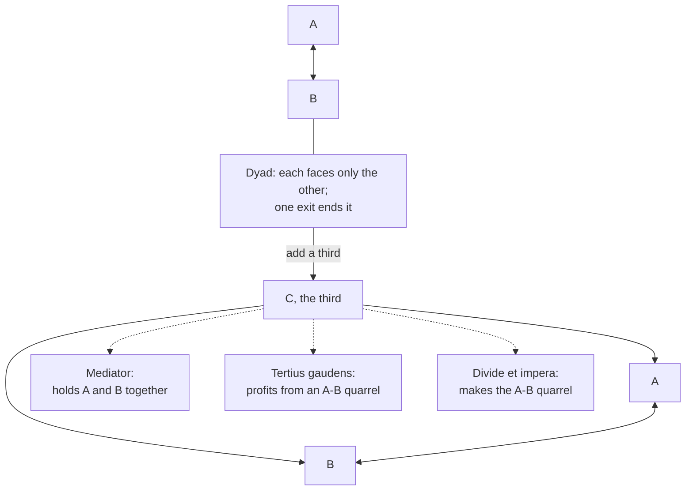

# Social Theory · Lesson 5.1: Simmel: sociation and the forms of social life

> ⏱ ~15 min · Module 5: Money, markets, and embeddedness · Builds on: [1.1 Individuals and social facts](01-01-individuals-and-social-facts.md), [1.4 Testing a social explanation](01-04-testing-a-social-explanation.md) · Unlocks: [5.2 Simmel's *Philosophy of Money*](05-02-simmels-philosophy-of-money.md)

## Why this matters

Add a third person to a couple and something changes that has nothing to do with who the third person is. A majority becomes possible, so does a referee, and so does someone who profits from the other two quarrelling. Georg Simmel (1858–1918), Weber's contemporary, who taught for decades in Berlin, built a sociology on that observation: some social facts are explained by the **shape** of a relationship, whatever its purpose. It is the course's first purely relational explanation, and it runs straight into modern coalition theory and network sociology. Module 5 needs it because money, in 5.2, is Simmel's great example of a form that reshapes every relation it enters.

## The idea

**Form and content.** Every social situation has a *content*: the hunger, love, profit, faith or curiosity that brings people together. It also has a *form*: the pattern of their interaction, such as superiority and subordination, competition, a party structure, an insider and an outsider. Simmel's claim (exegetical) is that the two vary independently. A church, a guild, a gang and a family can share the form "one leader, many followers"; the single interest "make money" can take the form of competition or of a cartel. Sociology, he says, should study the forms, as geometry studies spatial shapes whatever they are made of. See [form and content](../reference.md#form-and-content).

**Sociation.** Simmel's word for the process is *Vergesellschaftung*, literally "society-making". Albion Small's 1909 translation in the *American Journal of Sociology* renders it "socialization"; later English usually says "sociation", to avoid the child-rearing sense. The point is that society is not a thing over and above people. It is the reciprocal influence among them, more or less intense, from a group out walking together to a medieval guild. See [sociation](../reference.md#sociation).

Simmel insists the separation is an abstraction: no real form exists without content. And he states, in effect, the test that would justify it:

> it must be found that similar forms of socialization occur with quite dissimilar content, for wholly dissimilar purposes; and per contra that interests similar in content clothe themselves in quite unlike forms of socialization

(Small's translation, AJS 15, 1909, p. 299.) That is a comparison design in [1.4](01-04-testing-a-social-explanation.md)'s sense: hold the form fixed and vary the content, and the pattern should persist. See [comparison and concomitant variation](../reference.md#comparison-and-concomitant-variation).

**Number is a form.** The cleanest case is group size. In "The Number of Members as Determining the Sociological Form of the Group" (AJS 8, 1902, Small's translation), Simmel argues that a group of two, a group of three and a large group differ in kind, not just in degree. His large-group example: near-communistic arrangements have worked only in small circles, where each member can see what the others put in and take out. The lesson's own arithmetic shows why size is structural: a group of $n$ has $\binom{n}{2} = n(n-1)/2$ pairs, so 1 pair for two people, 3 for three, 45 for ten, 4,950 for a hundred. Mutual monitoring that is easy at 3 is impossible at 4,950.

## Source

From Small's translation (AJS 8, July 1902, pp. 40 and 45), on the dyad and the triad:

> However it may appear to third parties as an independent, superindividual unity, yet, as a rule, that is not the case for its participants, but each regards himself in antithesis only with the other, but not with a collectivity extending beyond him. The social structure rests immediately upon the one and the other. The departure of each single individual would destroy the whole […]; whereas, even in the case of an association of only three, if one individual departs, a group may still continue to exist. […] This peculiar intimacy appears most simply in the contrast between it and combinations of three. In such a case each individual element operates as a court of appeal between the two others, and exhibits the double function of such an organ. It operates both in combining and separating.

Three things to notice. "As a rule" makes this a typical tendency, not a law. The decisive fact about the dyad is **exit**: one departure ends it, so neither member can hide behind "the group". And "both in combining and separating" is the key to the triad: the third can reconcile the other two, or come between them.

## The argument

**The number thesis, reconstructed** (exegetical):

1. **P1.** Some features of a relationship depend only on how many parties it has and how they are positioned, not on why they are together. *In words:* form can be separated from content for purposes of explanation.
2. **P2.** In a dyad each party faces only the other, and either's exit ends the relationship. *In words:* there is no third to appeal to and no "we" bigger than the two of you.
3. **P3.** So the dyad has no majority, no arbiter and no anonymous collective responsibility; it tends to intimacy and to all-or-nothing stakes (Simmel even calls it the chief seat of jealousy).
4. **P4.** Adding a third creates indirect ties between each pair, which can bind them or split them.
5. **P5.** Three typical roles for the third become possible, none of them possible with two and none changed in kind by adding a fourth: the **non-partisan or mediator**, who holds the two together; the ***tertius gaudens***, the "rejoicing third" who profits from a quarrel he did not start; and ***divide et impera***, the third who starts or keeps up the quarrel to rule both.
6. **∴ C.** Some outcomes (who holds the balance, whether a group survives a defection, how intimate it is) are explained by group number and position, whatever the motives of the people involved.

**What kind of explanation is it?** Not holist in Durkheim's sense: Simmel denies that society is anything but reciprocal influence among individuals, so his ontology is individualist ([1.1](01-01-individuals-and-social-facts.md)). Yet the explanatory work is done by the *configuration*, not by anyone's beliefs or desires: the third gains leverage in a quarrel whether he is a peasant, a prince or a parliamentary party. Whether that counts as individualist explanation depends on whether relations among individuals may appear in the explanans, which is exactly the explanatory dispute 1.1 separated from the ontological one. See [ontological and explanatory individualism](../reference.md#ontological-and-explanatory-individualism). It is also not functional: Simmel never says mediators exist *because* groups need them ([1.2](01-02-functional-explanation-and-its-critics.md)). He says what a position makes possible.

**The stranger.** The 1908 *Soziologie* adds a famous excursus on a position defined by distance. The stranger is not the wanderer who comes and goes, but, in Simmel's phrase, "the one who comes today and stays tomorrow" (my translation). He is a member of the group, but one who did not belong to it from the start: near in space, far in origin. Simmel derives three features from that position alone (exegetical): historically the stranger appears as the **trader**, since the local positions on the land are already taken; he is credited with **objectivity**, not because he is uninvolved but because no kinship or faction binds him; and people **confide** in him what they hide from neighbours. See [the stranger](../reference.md#the-stranger).

**Where the argument is weakest.** P1. Simmel's own examples show content overriding form: the woman courted by two rivals is in the *tertius gaudens* position but, he concedes, cannot exploit it, because her choice follows feeling rather than will; and a marriage, though a dyad, can acquire a superpersonal life. A critic says that "form" claims therefore hold only when unstated content conditions hold, and any failure can be blamed on content, so the thesis risks being unfalsifiable. The defender's reply is to write the scope conditions in (the third must be free to choose sides; the two others' forces must be roughly balanced) and test them, which is what later coalition research did: Caplow (1956) built a theory of which two-against-one coalitions form in triads, and Vinacke and Arkoff (1957) tested it in the laboratory. The evidence is experimental and small-group; how far it carries to states and parties is open.

## The explanation

## Worked examples

**Example 1: the stranger as judge.** Simmel's own case (exegetical): Italian cities called in their judges from outside, because no native was free of family interests and factions. The best-known instance is the medieval **podestà**: communes torn by family feuds made it a custom to hire a man from another city as chief magistrate, typically for about a year, and kept him apart from the local families.

Run the form analysis (explanatory):

- **Position:** inside the city's government, outside its kin networks. Near and far at once.
- **Prediction from form:** impartiality comes from the position, not the person's virtue. So it should wear off as the outsider puts down roots.
- **Fit:** short terms and enforced separation from local families are exactly what you would design if you believed that prediction.

The explanation never mentions the judge's character, the content of the disputes or the city's faith. That is form doing the work. Evidence strength: a suggestive fit with an institutional design, not a test; a test would compare cities that rotated outsiders with cities that did not.

**Example 2: the stranger as trader, and its rival.** Simmel's classic illustration of the stranger-trader is the history of European Jews. His explanation is formal: an outsider settling in a community whose land and crafts are already allocated finds his opening in trade and money-dealing. Bonacich's "A Theory of Middleman Minorities" (*American Sociological Review*, 1973) generalizes the position-based reading across many trading minorities.

The rival is a content explanation. Botticini and Eckstein, *The Chosen Few* (2012), argue that a religious norm requiring men to read the Torah made Jewish communities literate, and that literacy paid off in commerce and crafts as cities grew under the Muslim caliphates from roughly the eighth century. On their account the move into urban occupations was pulled by opportunity, not pushed by exclusion.

**The crux** (exegetical): is the specialization explained by the *position* (any group in that position would show it, whatever its culture) or by a *content* specific to the group (an educational norm)? **What would discriminate** (explanatory): comparisons. If unrelated trading minorities with no literacy norm show the same pattern, the form gains; if the timing of the occupational shift tracks the spread of the literacy norm and precedes exclusion, the content gains. Both sides cite comparative and historical evidence; this is a live debate, not a settled one.

## Watch out

- **You might think formal sociology ignores what people want, but actually** Simmel holds form and content inseparable in reality. The abstraction is methodological, like studying a triangle without asking whether it is wood or brass.
- **You might think "the stranger" is a verdict on outsiders, but actually** it names a position, and Simmel's claims about it are explanatory. Whether trading minorities were treated justly, or whether a community should prefer outside judges, is evaluative and not argued here.
- **You might think the triad roles are functional explanations, but actually** Simmel says what the third's position *allows*, not that mediators exist because groups need them. Turning "the triad permits a mediator" into "mediators exist to keep groups together" adds a functional claim with no feedback mechanism ([1.2](01-02-functional-explanation-and-its-critics.md)).

## One-liner

> Simmel explains social life by its shapes: two people, three people, a near-and-far stranger behave in typical ways whatever brought them together, and the test is whether the pattern survives a change of content.

## Problems

**P1 (🟢) *(Exegetical.)*** From Simmel's 1902 essay, Part II (Small's translation, AJS 8, Sept. 1902, p. 178), on the third party who gains from a conflict between two others:

> In order to produce this advantageous situation for the third party, the energy which he is called upon to bring to bear by no means need possess a considerable quantity in proportion to that of either party. On the contrary, the necessary amount of the energy which he must have for the purpose is determined exclusively by the relationship which the energies of the parties exhibit toward each other. […] When, therefore, the quantities of force are practically equal, a minimum of addition often suffices in order to give a final decision to one of the sides. Hence the frequent influence of small parliamentary parties, an influence which they could never win by their proper significance, but only through the fact that they are able to turn the scale between the great parties.

(a) Reading A: the third's leverage grows with its own strength. Reading B: the third's leverage depends on the balance between the other two, so a weak third can decide the outcome. Reading C: the third gains because it is impartial between the two. Which reading do the words support, and which words rule out each of the others? (b) In one sentence, say what kind of explanation this is, in the terms of this lesson. 120 words or fewer in total.

**P2 (🟡) *(Exegetical (a) · Evaluative (b).)*** After the UK general election of June 2017 the Conservatives held 317 of 650 Commons seats, 9 short of the 326 needed for a majority. The Democratic Unionist Party, with 10 seats, signed a confidence-and-supply agreement on 26 June 2017, and Northern Ireland received an extra 1 billion pounds of public funding. (a) Which of Simmel's triad forms does this fit, and what does that form predict about the relation between the DUP's seat share and its leverage? Name the comparison of shares. (b) Treat it as given that the DUP would not have put a Labour government in office. Does that strain the form analysis, given that Simmel's third gains by being able to side "to the one or to the other"? Any verdict. 150 words or fewer for (b).

**P3 (🔴, optional) *(Exegetical (a) · Evaluative (b).)*** From an invented consultancy memo to the board of a start-up with three founders:

> "The founders' disputes are a personality problem. Two of them are combative and the third avoids conflict, so every disagreement ends with two ganging up on one, or with the quiet one playing the others off for his own projects. Replace one combative founder with a calmer person and the dynamic disappears."

(a) What kind of explanation does the memo silently assume, and what would Simmel's form analysis say instead about "two ganging up on one" and "playing the others off"? (b) Describe one comparison that would discriminate the memo's explanation from Simmel's. 150 words or fewer in total.

Solutions

**P1** *(Exegetical, strict.)*

**Must hit, strict (a):**

- Reading B. "Determined exclusively by the relationship which the energies of the parties exhibit toward each other" and "a minimum of addition often suffices" when forces are "practically equal" locate leverage in the balance between the others.
- A is ruled out by "by no means need possess a considerable quantity in proportion to that of either party" and by small parties winning influence they "could never win by their proper significance".
- C is ruled out because the passage is about the third's "advantageous situation" and its power to "turn the scale", i.e. to take a side. Impartiality is the mediator's role, a different form in Simmel's first section.

**Must hit, strict (b):**

- A formal or relational explanation: the third's influence is explained by its position in a configuration, not by its program, motives or the content of the dispute.

**Wrong turns:** choosing C because the third begins as "nonpartisan"; the passage is about cashing that position in, not keeping it. Calling (b) functional: nothing is explained by a benefit to the group.

**Model answer:** (a) B. Leverage is "determined exclusively by the relationship" between the two parties' forces, so when they are "practically equal" a "minimum of addition" decides. That rules out A (the third "by no means" needs force proportional to either side, and small parties win influence they "could never win by their proper significance") and C (the third gains by turning the scale, i.e. taking a side; impartiality belongs to the mediator). (b) A formal, relational explanation: influence comes from position in the configuration, whatever the party stands for.

---

**P2** *(Exegetical (a) · Evaluative (b).)*

**Must hit, strict (a):**

- The *tertius gaudens*, in the form of the small parliamentary party that can "turn the scale" (P1's passage).
- Prediction: leverage out of proportion to size, set by how close the large party is to a majority, not by the small party's own weight.
- The comparison: 10 of 650 seats is about 1.5 percent of the House, yet those seats covered the whole 9-seat shortfall (317 + 10 = 327, at least 326).

**Must hit, any verdict (b):**

- State the condition in Simmel's account: the third's advantage comes from being able to give or withhold its adhesion, and he says the advantage holds even with mere tension and the mere possibility of siding.
- Say what the DUP's alternative actually was if it could not switch sides (withholding support, risking the government's fall and a new election).
- Judge whether that alternative keeps the case triadic (the rival still matters as a threat) or turns it into two-party bargaining where content (the party's commitments) limits the third's demands.

**Wrong turns:** treating (b) as a question about whether the deal was good for Northern Ireland or the UK (evaluative in another sense, not asked). Saying form analysis fails simply because the DUP had an ideology: every party has content; the question is whether content removed the *structural* option.

**Model answer (b), one of several:** It strains the analysis without breaking it. Simmel's purest *tertius* can sell to either side, and the DUP could not; its content closed one door. But its leverage did not require switching. Withholding support threatened the government with defeat and an election, and Labour still mattered as the party that might win that election. That is close to Simmel's case of gaining from "the mere possibility" amid "latent antagonism". What the content did was cap the price: a third that cannot defect can demand money for its region but not a change of partner. So the form explains the leverage and the content explains its limits, which is what Simmel's inseparability of form and content predicts.

---

**P3** *(Exegetical (a) · Evaluative (b).)*

**Accept:** any (b) that holds one factor fixed and varies the other, and says which result favours which explanation.

**Must hit, strict (a):**

- The memo assumes an individualist explanation from personal traits: the content of the people explains the pattern.
- Simmel: two-against-one and one-playing-off-two are forms the triad makes possible whoever fills it (the coalition of two; the *tertius gaudens* or *divide et impera*). Swapping a founder changes the content but keeps the form, so the pattern may survive.

**Must hit, any verdict (b):**

- A comparison holding form fixed while varying personalities (three-founder teams with different temperament mixes), or holding personalities fixed while varying number (similar founders in pairs vs threes).
- What each result would mean: the pattern persisting across temperaments favours form; the pattern tracking the combative trait favours the memo.

**Wrong turns:** treating Simmel as saying personality is irrelevant (the forms are tendencies, and content can override them). Recommending an action for the board instead of a comparison.

**Model answer, one of several:** (a) The memo explains by individual traits: two combative people, one avoider. Simmel would say "two ganging up on one" and "playing the others off" are forms that any triad makes available, coalition and *tertius gaudens*, so replacing one founder alters the content and leaves the form, and the pattern may well continue. (b) Compare many three-founder start-ups with different temperament mixes. If two-against-one coalitions and a broker-founder appear across mixes, the form explanation gains; if they appear mainly where combative founders are present, the memo's explanation gains. Two-founder firms with the same temperaments give a second check: the form says those coalitions are impossible there.

## Flashback

**From Lesson [4.3](04-03-domination-and-the-three-types-of-authority.md) (Domination and the three types of authority):** *(Exegetical (a) · Evaluative (b).)* Menachem Mendel Schneerson, the seventh Rebbe of the Chabad-Lubavitch Hasidic movement, died in New York on June 12, 1994, childless and without naming a successor. No new Rebbe has been appointed since. The movement is run through its central organizations; its network of emissary couples (*shluchim*) running local centres has kept growing, by more than two thousand couples since 1994; many followers still revere him as the movement's leader and study his teachings; and some hold that he is the Messiah.

(a) Which of Weber's six § 11 succession solutions do these facts close off or leave unused, and what does the lesson's diagram predict when no solution is found? Two sentences.

(b) Is the case a counterexample to Weber's routinization argument (premises 6–9), or a case it covers? Name the premise at stake and one observation that would favour each answer. 120 words or fewer. Do not judge whether the messianic belief is true.

Solution

**Must hit, strict (a):**

- Designation by the leader (c) is closed: he named no one. Hereditary charisma (e) is closed: he had no children. Designation by the staff (d) and office charisma (f) went unused: no one was installed as Rebbe. (Search by marks (a) and oracle or lot (b) were never in play.) So there is no new bearer at all.
- The diagram's "no solution" branch predicts that the following dissolves.

**Must hit, any verdict (b):**

- Separate the two claims: the succession branch (no new bearer, so dissolution) and the conclusion of premise 9 (lasting charisma must become traditionalized, rationalized, or both). The case strains the first; whether it strains the second is the real question.
- Say where authority now sits: in central organizations and appointed emissaries (rationalized, with the staff interests in a durable footing that premise 7 names) and in the founder's teachings treated as an everyday standard (traditionalized); or argue that it is still devotion to a person, which would be charisma surviving its bearer unchanged, the counterexample.
- Name a discriminating observation for each side, e.g. whether local followers obey an emissary because of his appointment and the teachings he transmits, or because of personal devotion to Schneerson as a present leader; and how cohesion holds among cohorts who never knew him.

**Wrong turns:** ruling on the messianic claim or on whether he was a true spiritual leader (that is not a sociological question; it belongs to [`philosophy-of-religion`](../../philosophy-of-religion/syllabus.md)). Reading "no successor" as "no routinization": routinization is a change in the *character* of authority, not necessarily the arrival of a new person. Treating growth alone as refuting Weber without asking what the growing organization's authority rests on.

**Model answer (b), one of several:** Mostly a case the theory covers, with one real strain. The strain is the succession branch: § 11's solutions all find a new bearer, the diagram predicts dissolution when none is found, and Chabad found none and grew. But premise 9 concerns the character of authority, not a successor. The following now obeys central organizations and appointed emissaries, whose posts give the staff the durable footing premise 7 predicts, and treats the founder's teachings as an everyday standard: rationalized and traditionalized. It would be a counterexample if local authority rested on devotion to Schneerson as a present personal leader rather than on appointment and teaching; the messianist strand is where to look. And one surviving movement is a selected case.

## Connections

- **Backward:** The individualist-or-holist question and its ontological/explanatory split come from [1.1](01-01-individuals-and-social-facts.md); the comparison that would justify the form/content separation is [1.4](01-04-testing-a-social-explanation.md)'s concomitant variation; the warning against reading the triad roles functionally is [1.2](01-02-functional-explanation-and-its-critics.md). Simmel's 1896 essay on superiority and subordination (also translated by Small) argues that even domination is reciprocal, with some spontaneity on the subordinate's side, a neighbour of Weber's legitimacy as belief in [4.3](04-03-domination-and-the-three-types-of-authority.md).
- **Forward:** [5.2](05-02-simmels-philosophy-of-money.md) follows the stranger-as-trader into money as the form that makes relations impersonal and calculable. [6.2](06-02-rational-choice-sociology.md) rebuilds group-level patterns from individual choices, and [6.3](06-03-social-capital-coleman-and-putnam.md)'s closure is a claim about the shape of a network, in Simmel's spirit.
- **Sideways:** The small party that turns the scale is the voting-power point of [`political-institutions` 3.2](../../political-institutions/lessons/03-02-forming-governments-coalitions-and-minorities.md) ("seats are not power") and the Shapley–Shubik index of [`grad-game-theory` 6.2](../../grad-game-theory/lessons/06-02-shapley-value.md): a party's power is set by which majorities it completes. Simmel stated the idea in prose in 1902.
