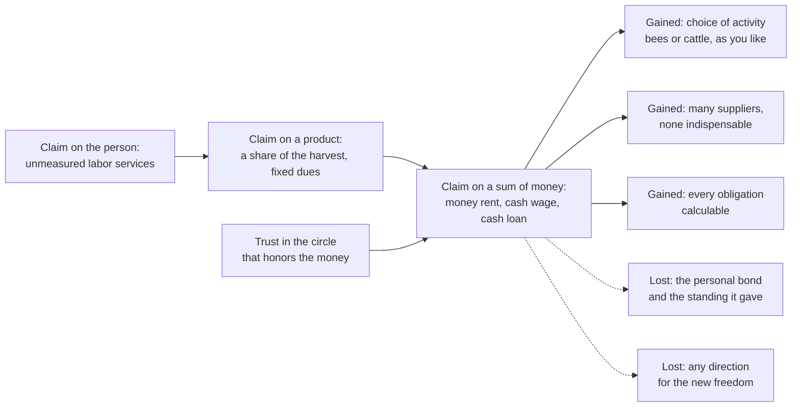

# Social Theory · Lesson 5.2: Simmel's *Philosophy of Money*

> ⏱ ~15 min · Module 5: Money, markets, and embeddedness · Builds on: [5.1 Simmel: sociation and the forms of social life](05-01-simmel-sociation-and-the-forms-of-social-life.md), [1.1 Individuals and social facts](01-01-individuals-and-social-facts.md) · Unlocks: [5.3 Polanyi's *Great Transformation*](05-03-polanyis-great-transformation.md)

## Why this matters

When a lord takes rent in coin instead of in honey, or an employer pays in cash instead of in goods from his own shop, or a neighbor's loan is replaced by a pawn ticket, something changes in the relationship as well as in the payment. Georg Simmel's *Philosophie des Geldes* (Leipzig: Duncker & Humblot, 1900; revised 1907) is the classic attempt to say what changes. Its answer is two-sided. Money frees people from particular persons and empties relations of their personal content, by one and the same movement. Later arguments about cash transfers and credit draw on it, usually on one side only.

## The idea

[5.1](05-01-simmel-sociation-and-the-forms-of-social-life.md) taught Simmel's method: explain a situation by the [form](../reference.md#form-and-content) of the relation, whatever its content. The *Philosophy of Money* applies that method to the most content-free thing there is. Its five claims:

1. **Money as pure means.** A spade is good for digging; money has no use of its own except conversion into other things. Simmel (ch. 3, p. 191 of the 1900 edition) calls it the purest tool:

   > Money is the purest form of the tool […]: a social institution into which the individual pours his doing or having, to reach through this point of passage ends inaccessible to his effort aimed at them directly. (my translation)

   See [money as pure means](../reference.md#money-as-pure-means).

2. **Abstraction and calculability.** Because every good now has a price, qualitative differences become differences of more and less. Simmel (ch. 6, pp. 472–473) calls the modern mind a *calculating* one, weighing and measuring even the value of life, and ties it to the money economy. This is a cousin of Weber's formal rationality ([4.4](04-04-bureaucracy-rationalization-and-disenchantment.md)).

3. **Money and personal freedom.** Chapter 4 ranks obligations by how far the claim reaches into the person who owes. A claim can cover his labor itself (the serf's unmeasured services), or a specific product (a tenth sheaf, a fixed quantity of honey), or only a sum of money. At each step the claimant's grip loosens. The lord who demands honey decides what the peasant produces; once the rent is in coin, the peasant may keep bees, cattle or whatever he likes (pp. 279–283). See [money and freedom](../reference.md#money-and-freedom).

4. **Objectification of relations.** Money lets each person depend on far more people, but on no one in particular (p. 294):

   > On how many "suppliers" alone, by contrast, does the person of the money economy depend! But of any single, particular one of them he is incomparably more independent, and changes him easily and as often as he likes. (my translation)

   Each relation shrinks to the impersonal performance it delivers, and the person behind it becomes interchangeable. This is why money was long the business of [strangers](../reference.md#the-stranger), people outside the circle of personal ties (pp. 207–210). See [objectification of relations](../reference.md#objectification-of-relations).

5. **Money rests on trust in the social order.** Even a full-weight coin works only because its holder trusts the wider circle to honor it (the Source below).

The bill comes in chapter 5. An Oldenburg cottager who worked set days for a farmer in exchange for cheap housing and land felt himself the farmer's equal; paid plain wages, he was declassed, though freer with his earnings. Threshers paid by a share of the harvest had cared about the estate's prosperity; the money wage that came with the threshing machine gave them more income and less self-respect (pp. 419–420). Freedom by itself is an empty form (p. 421); selling a farm for money yields freedom in an almost purely negative sense, since money gives no direction for what comes next (p. 422).

## Source

Chapter 2, section III (1900 ed., pp. 148–150), after Simmel dismisses the economists' quarrel over whether convertible paper is "really" money (my translation):

> This whole way of posing the question does not reach down to the sociological facts. For these there is no doubt that metal money, too, is a promise, and that it differs from a cheque only in the size of the circle that guarantees its redemption. The common relation of buyer and seller to a social circle (the claim of the former to a performance to be rendered within this circle, and the trust of the latter that this claim will be honored) is the sociological constellation in which money exchange, as opposed to exchange in kind, takes place. […] The feeling of personal security that the possession of money gives is perhaps the most concentrated and pointed form and expression of trust in the organization and order of state and society.

Notice two things. **"Metal money, too, is a promise"**: "real" coin and "mere" credit money differ in degree, set by **"the size of the circle"**. And barter needs no third party, while money exchange always has three terms: buyer, seller and the circle behind the token. Between these sentences Simmel cites the Maltese coin inscription *non aes sed fides* ("not bronze but trust"). He adds that credit contains, beyond inductive expectation, an element of belief in someone akin to religious faith. That is an analogy about the form of trust; it implies nothing about whether faith is warranted ([philosophy-of-religion](../../philosophy-of-religion/syllabus.md) owns that question). See [money rests on trust](../reference.md#money-rests-on-trust).

## The argument

**Simmel's synthetic thesis (chs. 4–6), reconstructed.**

- **P1.** Money is a pure means: it has no content of its own and converts into any end.
- **P2.** A claim payable in money reaches only a sum. It does not fix how the debtor earns it, what he produces, or who he must be.
- **P3.** Money's divisibility lets each person depend on very many others, each for a performance that someone else could also supply.
- **P4.** So each economic relation narrows to its objective performance, and the person behind it becomes indifferent and replaceable.
- **P5.** Money works only so long as holders trust the wider circle, ultimately the political and social order, to honor it.
- **∴ C1.** In a money economy individuals depend more on society as a whole and less on any particular person: personal freedom grows as personal bonds thin.
- **∴ C2.** The freedom gained is largely negative, and the style of life grows calculating and impersonal.

*In words:* money widens and depersonalizes dependence. It moves it from a few persons you cannot replace to an order you have to trust.

**What kind of explanation is this?** On the grid of [kinds of social explanation](../reference.md#kinds-of-social-explanation): ontologically Simmel is close to the individualist: society is nothing over and above individuals in reciprocal interaction (*Wechselwirkung*). Explanatorily the work is done by a **form of relation**, neither by individual preferences nor by a social whole acting on individuals, and the claim is about the **consequences** of that form. It is *not* functional ([1.2](01-02-functional-explanation-and-its-critics.md)). Simmel does not explain why money exists by the freedom it brings; the preface sets aside the question of money's origin as history's business, not philosophy's (p. viii). Interpretive elements ([1.3](01-03-understanding-webers-interpretive-method.md)) enter where he describes what money *feels like*: security, indifference, freedom. Against Marx ([2.1](02-01-historical-materialism.md)), the preface aims to build a storey beneath historical materialism (p. x): economic forms are traced to deeper valuations, and those to economic underpinnings again, in endless alternation.

**The evidence.** Simmel offers illustrations, not tests: commuted manorial dues, Oldenburg cottagers. In [1.4](01-04-testing-a-social-explanation.md)'s terms, no comparison is controlled and cases are chosen to fit. Yet the thesis is testable: when an obligation is converted to money, monitoring of the debtor should fall and switching between partners should rise.

**Where the argument is weakest.** P4, the claim that the money *form* removes the personal element. Viviana Zelizer (*The Social Meaning of Money*, 1994) attacks it. Working from American households, charities and courts around the turn of the twentieth century, she argues that people constantly earmark money: a wife's pin money, a child's allowance, a gift of cash, poor relief each come with rules about who may spend them and on what. On this view social relations shape money as much as money flattens them. Impersonality belongs to certain institutions, such as anonymous markets, not to money as such. A defender replies that earmarking happens *inside* households and gifts, while Simmel's claim concerns money obligations replacing personal bonds elsewhere.

## The explanation

Solid arrows: the three-step scale and what its last step gives. Dashed: the costs (ch. 5). Trust is the condition the whole scale rests on.

## Worked examples

**Example 1 (the theory at work: pawn credit at a Monte di Pietà).** In 1462 a civic fund at Perugia, promoted by Observant Franciscan preachers, began lending small sums to the poor against pledges. The institutional story is [`history-of-debt` 2.2](../../history-of-debt/lessons/02-02-jewish-lenders-and-the-monti-di-pieta.md), and the doctrinal fight over its fees is [`theology-of-debt` 5.1](../../theology-of-debt/lessons/05-01-the-monti-di-pieta-and-lateran-v.md). Simmel reads its form.

- **The claim moves off the person.** A pawn loan secures repayment with an object, not with the borrower's character, service or loyalty. The monte need not know you, and you owe it no deference (P2).
- **Freedom from a particular creditor.** Compared with a loan from a landlord or patron, which binds the borrower to one man's goodwill, the pledge loan is one supplier among possible others (P3).
- **Trust relocates.** The monte trusts the pledge's resale value, and so the money economy behind it, more than the borrower. The borrower trusts a public institution rather than a patron (P5).
- **The test it needs:** whether dependence on patrons fell where monti opened, compared with similar towns without one.

**Example 2 (hard case: the rotating savings and credit association).** In a ROSCA, members meet regularly and each pays a fixed sum into a pot that one member takes home; the turn rotates until all have received once. It is money credit with wholly personal enforcement: a member who takes an early pot and stops paying faces neighbors and kin, not a court.

Clifford Geertz ("The Rotating Credit Association: A 'Middle Rung' in Development", 1962) read the ROSCA in Simmel's direction. On his reading it is a transitional institution between an economy of personal ties and a commercial one, which should fade as the commercial circle widens. Mary Kay Gugerty ("You Can't Save Alone", 2007) points the other way. Her study of 70 ROSCAs and 1,066 members in western Kenya argues that people join because the group's social pressure helps them save, a self-control device they cannot supply alone. If so, the personal element is the thing being bought, not a stopgap for absent banks. Evidence strength: one careful study in one region, not a cross-country test. The crux is whether personal enforcement is a *substitute* for trust in the wider circle (Simmel and Geertz: it should decline as banks spread) or a *complement* chosen for its personal quality (Gugerty: it can persist).

## Watch out

- **You might think Simmel is a critic of money, but actually he argues both sides.** Chapter 4 mainly presents money as the vehicle of individual freedom; the costs come in chapters 5–6. Reporting one side is an exegetical error. Whether the trade is worth it is evaluative, owned by [`philosophy-of-economics` 5.1](../../philosophy-of-economics/lessons/05-01-commodification.md).
- **You might think "money rests on trust" sets credit money against sound metal, but actually Simmel denies the contrast.** Coin is a promise too, and only the size of the guaranteeing circle differs.
- **You might think C1 says money makes people less dependent, but actually it says they become *more* dependent overall and less dependent on any particular person.** Nor is it functional: "money spread *because* it frees people" is not Simmel's claim.

## One-liner

> Money moves your dependence from a few people you cannot replace to an order you must trust, so you are freer of every person and more bound to all of them.

## Problems

**P1 (🟢) *(Exegetical.)*** Under the truck system, some early nineteenth-century British employers paid wages partly in goods, or in tokens or credit good only at a shop the employer owned, at prices the employer set. The Truck Act 1831 prohibited paying wages in the trades it listed in goods, or otherwise than in the current coin of the realm. (a) Using the Source passage, what distinguishes a shop token from a coin in Simmel's terms, and what does that do to the worker's trust? (b) Using chapter 4's scale and the "suppliers" passage, what freedom does coin payment give the worker that truck denies, and what dependence remains? Two sentences per part.

**P2 (🟡) *(Exegetical.)*** From an invented op-ed in a regional paper:

> "For thirty years volunteers in our town delivered holiday hampers to struggling families. This year the council replaced them with prepaid cash cards. Cash is cold: a hamper says *we know you and thought about you*; a card says *here is your number*. Money dissolves the bonds that hold a community together, and a town that pays its poor instead of knowing them will soon be a town of strangers. Bring back the hampers."

(a) Which of Simmel's claims does the author borrow, and which part of Simmel's account has been dropped? (b) What kind of explanation does the second-to-last sentence assume, in Module 1's terms, and what does it lack? (c) Name the step the op-ed takes that Simmel's thesis, as an explanation, does not license. 150 words or fewer.

**P3 (🔴) *(Exegetical (a) · Evaluative (b).)*** Jack and Suri ("Risk Sharing and Transactions Costs: Evidence from Kenya's Mobile Money Revolution", *American Economic Review*, 2014) studied M-Pesa, which lets Kenyans send money by phone. In their panel, adoption rose from 43 to 70 percent of households. Shocks cut consumption by about 7 percent for non-users and left users' consumption unaffected. The mechanism was more remittances received, from a more diverse set of senders. (a) Which of Simmel's claims does "a more diverse set of senders" fit, and which of his claims does money flowing along kin ties strain? (b) Is this evidence for Simmel's thesis, against it, or beside it? Say what comparison would test his impersonality claim directly. Any verdict; 150 words or fewer for (b).

Solutions

**P1** *(Exegetical)*

(a)

**Must hit, strict (a):**

- Both token and coin are promises; they differ in the size of the circle that guarantees redemption. The token's circle has shrunk to one shop, that is, one person.
- So the worker's trust must rest on a particular person (the employer as shopkeeper and price-setter), not on the wider economic and political order.

(b)

**Must hit, strict (b):**

- Freedom: coin is a claim on a sum only, so it no longer fixes where or on what the wage is spent. The worker can buy from any supplier and drop any one of them (the "suppliers" passage); the employer's claim stops at the labor contracted.
- Remaining dependence: on wage employment and on the market as a whole. Simmel's freedom is from particular persons, not from dependence as such.

**Wrong turns:** saying tokens are not money because they are not metal (Simmel says coin is a promise too); concluding that cash wages make the worker independent full stop, which is the misreading of C1 flagged in Watch out.

**Model answer:** (a) A token, like a coin, is a promise; what differs is the circle that guarantees it, which for the token has shrunk to the employer's own shop. The worker's trust is thereby tied to one man, who also sets the prices, instead of to the order behind the coin of the realm. (b) Paid in coin, the worker gives the employer labor and gets a sum, and the employer's reach stops there: his spending is no longer bound to one supplier, and he can change suppliers as often as he likes. He still depends on getting a wage and on the market at large, but no longer on this particular person for his bread.

---

**P2** *(Exegetical)*

**Must hit, strict (a):**

- Borrowed: the objectification of relations; money strips the personal element out of a transfer (claims 4 and 1).
- Dropped: the freedom side. A transfer in kind fixes what the recipient gets; money lets her choose her own ends and frees her from depending on one giver's judgment of her needs (ch. 4).

**Must hit, strict (b):**

- A holist claim with a functional shape: the hampers' benefit (cohesion) is credited with holding the community together, and their loss is predicted to dissolve it.
- No mechanism is named ([1.2](01-02-functional-explanation-and-its-critics.md)), and there is no comparison with towns that give cash ([1.4](01-04-testing-a-social-explanation.md)).

**Must hit, strict (c):**

- The move from "money changes the relation" to "therefore restore the hampers" is evaluative. Simmel's thesis says what money does, not that the change is bad, and he counts the freedom as a gain.

**Wrong turns:** answering whether cash or hampers are better policy, which grades the op-ed instead of diagnosing it; calling the op-ed "Simmelian" without noticing that half of Simmel is missing.

**Model answer:** (a) The author borrows Simmel's objectification of relations, the claim that money strips the personal element from a transfer. He drops the other half: a transfer in kind decides for the recipient what she gets, while money frees her to pursue her own ends and from depending on one giver's view of her needs. (b) The last-but-one sentence is a holist claim with a functional shape. It credits hampers with holding the community together and predicts dissolution without them, but names no mechanism and offers no comparison with towns that give cash. (c) "Bring back the hampers" is an evaluative conclusion. Simmel's account explains what money does to a relation. It does not rank the result, and he counted the freedom as a gain.

---

**P3** *(Exegetical (a) · Evaluative (b))*

(a)

**Must hit, strict (a):**

- More diverse senders fits P3 and C1: money's easy divisibility and transfer let a household depend on many people, each less critical, instead of a few.
- Money moving along kin and friendship ties, as help in a crisis, strains P4: the transfer is personal and obligating, not reduced to an impersonal performance.

(b)

**Accept:** any verdict that separates what the study measures from what Simmel claims and names a direct test.

**Must hit, any verdict (b):**

- State what the study measures (consumption after shocks, remittance flows and senders) and what it does not (the quality of the relations: obligation, reciprocity, closeness).
- Say which Simmel claim it bears on, and how far. It is evidence about the multiplicity of dependence and only indirect evidence about impersonality.
- Name a direct comparison: for example, whether expectations of reciprocity, visits or felt obligation between senders and receivers change with access to the service. The study's own source of variation, the rollout of agents, could supply the comparison.
- State the evidence strength: one well-identified study in one country.

**Wrong turns:** treating money flowing through families as a refutation, when Simmel predicts thinner dependence on *particular* persons, not the end of ties; treating it as confirmation just because money helped households, which is not Simmel's claim.

**Model answer (b), one of several:** Mostly beside the impersonality claim, though it supports the multiplicity claim. Jack and Suri measure consumption and remittance flows, not what the relations between senders and receivers are like. Households that could draw small sums from many relatives were less exposed to any one of them, exactly as Simmel's "suppliers" passage predicts. Whether those ties became thinner or more calculating is not measured. Indeed, kin using money to insure one another suggests Zelizer's point that money can serve personal bonds. A direct test would compare, across areas where agents arrived earlier or later, whether felt obligations and reciprocity among kin weakened as transfers became cheaper. Until then: one strong study, on a neighboring question.

## Flashback

**From Lesson [4.4](04-04-bureaucracy-rationalization-and-disenchantment.md) (Bureaucracy, rationalization, and disenchantment):** *(Exegetical (a) · Evaluative (b).)* Counterexample. From the sixteenth century the French crown sold judicial, financial and administrative offices to raise money. From 1604 an annual fee, the *paulette* (named for the financier Charles Paulet, who proposed it), of one-sixtieth of an office's value let its holder transfer the office at will, to an heir or a buyer. Louis XIV multiplied venal offices to replenish the treasury; they were abolished, and their holders reimbursed, only in 1789. Alongside them the crown used *intendants*: royal commissioners appointed by commission, not purchase, and removable by the king. The intendancy became a permanent institution when France entered the Thirty Years' War in 1635. During the Fronde of 1648 the crown suppressed it, except in border provinces threatened by Spanish or Imperial attack, and it was reinstated when the Fronde ended.

(a) Name three features of 4.4's ideal type that a venal office violates, and the feature groups the intendancy restores. One line each. (b) A critic says: "A leading military power ran on bought, heritable offices from 1604 to 1789, so competition between states does not select for bureaucracy (premise 3)." Give the strongest reply the case offers a defender of Weber, and say what that reply concedes. 100 words or fewer; any verdict.

Solution

**Accept (a):** any three of the violations listed, each tied to the right feature group.

**Must hit, strict (a):**

- The holder owns his post and can sell or bequeath it, against the separation of the official from the post and the means of administration (group 4).
- Entry is by purchase or inheritance, not appointment on certified qualification (group 3).
- No career in which superiors promote by seniority or performance; a higher post is bought (group 3).
- A holder who owns his post cannot simply be dismissed by a superior (abolition required buying the offices back), which weakens hierarchy and uniform discipline (group 2).
- The intendancy restores group 4 (a commission is not property, so there is no appropriation of the post) and group 2 (removable by the king, so subject to discipline from above). These facts show no examination-certified qualification, so group 3 is not shown to be restored.

**Must hit, any verdict (b):**

- State the reply from the case: competition did bite. Rather than buy back the offices it had sold for cash, the crown built a non-venal apparatus beside them. It made that apparatus permanent on entering a major war, and kept it in the border provinces even while conceding to the Fronde, where military pressure was greatest.
- Say what kind of mechanism this is. It is rulers adopting calculable administration on purpose in anticipation of war, which is an intentional mechanism, not the elimination of losers that premise 3's selection suggests ([1.2](01-02-functional-explanation-and-its-critics.md)).
- State the concession: the pressure works slowly and partially. For 185 years the fiscal gain from selling offices outweighed calculability, and venality ended by revolution, not by defeat. "Inescapable" becomes a long-run tendency with no predicted rate, which is close to the lesson's own admission that selection is weak for states.

**Wrong turns:** treating venality as plain corruption or irrationality: the ideal type is a measuring rod, and for a crown short of cash, selling offices was a calculated way to raise money. Treating the intendants as proof that Weber was right while ignoring that the venal offices survived until 1789.

**Model answer (b), one of several:** The case shows selection working where it bit hardest. Rather than buy back the offices it had sold, the crown governed around them with removable commissioners. It made them permanent on entering the Thirty Years' War and kept them on the threatened borders even during the Fronde. But this is deliberate adoption by rulers anticipating war, not the elimination of less calculable states. And it concedes a great deal: fiscal need kept venal offices for 185 years, and revolution, not defeat, ended them. Premise 3 survives only as a slow tendency with no predicted rate.

## Connections

- **Backward:** Simmel's method of explaining by form and his account of the stranger come from [5.1](05-01-simmel-sociation-and-the-forms-of-social-life.md). The calculating style of life is a cousin of formal rationality in [4.4](04-04-bureaucracy-rationalization-and-disenchantment.md). The preface's storey beneath historical materialism answers [2.1](02-01-historical-materialism.md). Testing a consequence claim uses [1.4](01-04-testing-a-social-explanation.md).
- **Forward:** [5.3](05-03-polanyis-great-transformation.md) treats money as one of Polanyi's fictitious commodities and asks whether markets can stand free of society at all. Module 5's boss problem sets Simmel and Polanyi against each other on a credit case. Trust as a social resource returns in [6.3](06-03-social-capital-coleman-and-putnam.md).
- **Sideways:** [`philosophy-of-debt` 1.1](../../philosophy-of-debt/lessons/01-01-the-grammar-of-owing.md) cites this lesson for credit as trust. Why lenders demand pledges is modelled in [`economics-of-debt` 1.3](../../economics-of-debt/lessons/01-03-pledgeable-income-collateral-and-monitors.md), and what may morally be pledged is [`philosophy-of-debt` 3.3](../../philosophy-of-debt/lessons/03-03-what-may-be-pledged.md). Whether cash corrupts what it touches is [`philosophy-of-economics` 5.1](../../philosophy-of-economics/lessons/05-01-commodification.md).
