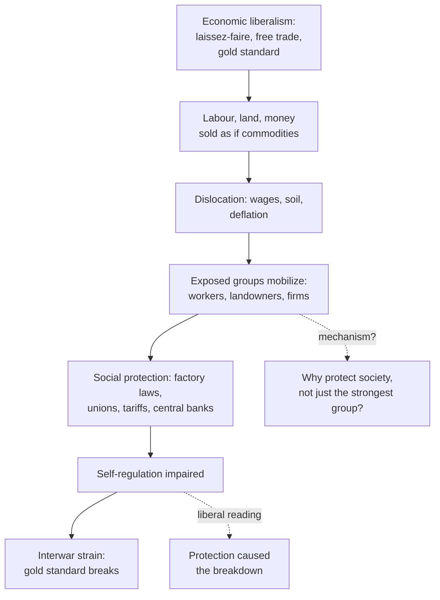

# Social Theory · Lesson 5.3: Polanyi's *Great Transformation*

> ⏱ ~15 min · Module 5: Money, markets, and embeddedness · Builds on: [1.2 Functional explanation and its critics](01-02-functional-explanation-and-its-critics.md), [1.4 Testing a social explanation](01-04-testing-a-social-explanation.md), [5.2 Simmel's *Philosophy of Money*](05-02-simmels-philosophy-of-money.md) · Unlocks: [6.1 Tocqueville on associations](06-01-tocqueville-on-associations.md), [6.2 Rational-choice sociology](06-02-rational-choice-sociology.md)

## Why this matters

Economists often picture the market as what is left once nothing interferes with it. Karl Polanyi's *The Great Transformation* (1944) reverses that picture: nineteenth-century market society was built by the state, and the protective laws that followed were society defending itself against it. The book gave social science three terms it still uses: embeddedness, fictitious commodities and the "double movement". Its history can be checked, and on its most famous episode, Speenhamland, the checking has gone against him. This lesson states the theory, classifies the explanation, and sets it beside Granovetter's rival "embeddedness".

## The idea

**Embeddedness.** In chs. 4–5 Polanyi argues that for most of history the economy was not a separate sphere of life. Goods moved by *reciprocity* (gifts and return gifts among kin and neighbours), by *redistribution* (a chief, temple or lord collects and hands out) and by *householding* (a group producing for itself). Markets existed as adjuncts, hedged by custom and law. Production was [embedded](../reference.md#embeddedness) in kinship, religion and politics: people worked and shared because of who they were to one another, not because a price told them to.

**The self-regulating market.** The nineteenth century's novelty was not markets but a *system* of markets in which prices alone organize production, including the prices of its inputs. Ch. 5 states the reversal: instead of the economy being embedded in social relations, social relations become embedded in the economy, and society must be rearranged so the market can run by its own laws. See [self-regulating market](../reference.md#self-regulating-market).

**Fictitious commodities.** Ch. 6 does the conceptual work. Define a commodity empirically, as something produced for sale. A self-regulating system needs markets for every element of industry, including labour, land and money. None of the three is produced for sale:

- **labour** is human activity, which comes with life itself and cannot be detached from the person;
- **land** is nature;
- **money** is a token of purchasing power, created by banking or state finance.

Treating them as commodities is therefore a [fiction](../reference.md#fictitious-commodities), and yet real markets are organized on it. Left unchecked, Polanyi argues, the fiction would let the market dispose of people, landscapes and firms the way it disposes of cloth.

**The double movement.** The end of ch. 6 and then ch. 11 state the thesis. Nineteenth-century social history was a [double movement](../reference.md#double-movement). Markets in genuine commodities spread across the globe. At the same time, a web of laws and organizations restricted the market in the fictitious ones:

- factory acts and trade unions for labour;
- land laws and agrarian tariffs for land;
- central banking for money.

Two organizing principles faced each other:

- **economic liberalism**, backed by the trading classes and working through laissez-faire and free trade;
- **social protection**, backed by whoever was most exposed (chiefly, but not only, the working and landed classes) and working through protective legislation and associations.

The sharpest point in the book is an asymmetry, which ch. 12 compresses into a slogan: laissez-faire was planned, and planning was not. The market system needed deliberate statecraft. Polanyi treats three acts as one coherent package: the Poor Law Amendment Act of 1834, Peel's Bank Act of 1844 and the repeal of the Corn Laws in 1846. The protective reaction, by contrast, arose piecemeal, in many places, and without a shared ideology.

**Granovetter's re-embedding.** Mark Granovetter's "Economic Action and Social Structure: The Problem of Embeddedness" (*American Journal of Sociology*, 1985) took over the word and changed its meaning. For him, economic action is embedded in ongoing networks of personal relations, which generate trust and deter cheating; he set this against both the "undersocialized" atomized actor of economics and an "oversocialized" actor who merely follows norms. Against Polanyi's school, he argued that embeddedness was lower in nonmarket societies than it claimed and changed less with modernization; against the economists, that it remains substantial in modern markets.

## The argument

Polanyi's explanation of the countermovement (chs. 1, 6, 11–13), reconstructed:

- **P1.** A self-regulating market requires that labour, land and money be bought and sold as if they had been produced for sale.
- **P2.** Left wholly to the market, these fictitious commodities would destroy their own substance: people, nature, and productive organization. *In words:* you cannot let the price of a person's time fall to whatever clears the market without wrecking the person.
- **P3.** The groups most exposed to that damage press for protection. Coalitions succeed when they win support beyond their own members, and they win it by serving interests wider than their own (ch. 13).
- **P4.** So protective measures arose wherever the market system advanced, under whatever ideology was locally to hand.
- **P5.** Each protective measure impaired the market's self-regulation.
- **∴ C.** Market society generated its own countermovement. After 1918 the strain between the two broke the system: the gold standard collapsed, and fascism was one exit (chs. 2, 20).

**What kind of explanation (exegetical).** It is holist and [functional](../reference.md#functional-explanation). "Society protected itself" makes society the subject of the sentence. Ch. 11 says each class's part was cut out for it by functions arising from the situation of society as a whole. Ch. 13 adds that the fate of classes is set by the needs of society more often than the reverse.

In [1.2](01-02-functional-explanation-and-its-critics.md)'s terms, the question is whether Polanyi names a [feedback mechanism](../reference.md#feedback-mechanism). His best answer is P3. Harm triggers mobilization, and coalitions win by protecting more than their own members: a kind of political selection, more than a bare benefit claim. It is still thin: why should selection favour measures that protect "society" rather than whichever group is best organized?

**What would test it.** Polanyi names the test himself (ch. 12): comparative history as a quasi-experiment. If protection were the work of particular interests or a "collectivist" ideology, its content should vary with local ideology; if it answered the market's threat, similar measures should appear under very different politics at a similar stage of industrialization. He reports that pattern: factory laws were passed by Conservative and Liberal cabinets in England, by Catholics and Social Democrats in Germany, by the Church and its supporters in Austria and by anticlericals in France. This is [comparison and concomitant variation](../reference.md#comparison-and-concomitant-variation) from [1.4](01-04-testing-a-social-explanation.md).

**Explanatory status.** That industrializing countries passed broadly similar labour and social legislation in the late nineteenth century is well documented. Whether this shows a spontaneous protective reaction, rather than something else, is contested.

**Where the argument is weakest.** The weak point is P4's evidence. A critic would press three points.

- **Not independent cases.** The countries copied one another, so a law can spread by imitation rather than as a parallel response.
- **Confounding.** They widened the suffrage as they industrialized, so protection is confounded with democratization.
- **No failure condition.** "Protection" (factory laws, tariffs, cartels, central banks) is loose enough that almost any intervention counts.

Ch. 12 also states the liberal rival fairly: Spencer, Sumner, Mises and Lippmann accept that a countermovement happened and read it as shortsighted protectionism that wrecked a market which would have righted itself. Polanyi says the facts settle it; they cannot alone, because the sides disagree about a counterfactual, what an unprotected market would have done.

## The explanation

*Solid arrows: Polanyi's account. Dashed: the liberal rival reading and the mechanism gap.*

## Worked examples

**Example 1 (the theory at work): money and the gold standard.** Under the gold standard, a country losing gold had to tighten credit and let prices and wages fall. For Polanyi this is the third fictitious commodity at work: purchasing power left to an automatic mechanism, with deflation falling on firms and jobs. The protective response was central banking (ch. 16), which blunted the gold standard's automatism to cushion production.

In the interwar years the two principles collided head-on. In Polanyi's account (ch. 19), Britain's Labour government of 1931 could neither cut social spending nor let the pound fall, and was pushed out. Its successors scrapped unconditional unemployment benefit, introduced a means test, and then left gold anyway on 21 September 1931. The United States followed in 1933 (ch. 16).

Kind check: Polanyi does not deny that ministers and bankers chose; his holist claim is that the clash of principles set their menu. The same squeeze on wages appears in [`history-of-debt` 5.2](../../history-of-debt/lessons/05-02-could-germany-pay.md) (Weimar Germany) and in Keynes's complaint, in [5.3](../../history-of-debt/lessons/05-03-bretton-woods-and-the-lending-boom.md), that the gold standard put the whole burden of adjustment on debtors.

**Example 2 (where it strains): [Speenhamland](../reference.md#speenhamland).** Chs. 7–8 set out the case.

- **The scale.** On 6 May 1795, Berkshire magistrates meeting at Speenhamland, near Newbury, set a scale tied to the price of bread. When the gallon loaf cost a shilling, a poor man was to have 3 shillings a week, from his wages or the parish rates. Each dependant was to have 1 shilling 6 pence. For every penny the loaf rose above a shilling, he got 3 pence more and each dependant 1 penny more.
- **Polanyi's reading.** Never enacted, the scale spread over much of the countryside. He read it as a "right to live" that blocked a labour market until 1834. Employers could pay less, knowing the parish would top wages up; workers lost any reason to work hard; productivity and self-respect collapsed. The New Poor Law ended it in 1834 and built a competitive labour market at savage cost.

His evidence leaned heavily on the 1834 Royal Commission's report. Mark Blaug ("The Myth of the Old Poor Law and the Making of the New", *Journal of Economic History*, 1963) attacked the near-unanimous indictment that historians had built on that report. Fred Block and Margaret Somers ("In the Shadow of Speenhamland", *Politics & Society*, 2003) are both sympathetic to Polanyi's larger project. They drew on four decades of later research and concluded that the Speenhamland policies could not have had the consequences attributed to them. They also traced how the story shaped the American debate before the 1996 welfare reform. On this episode the weight of later research runs against Polanyi.

The episode cuts two ways:

- **What it costs Polanyi.** He loses his showcase for the claim that a "right to live" without a labour market is unworkable, which was his explanation of why 1834 had to come.
- **What it gives back.** If the 1834 report was doctrine more than evidence, then the abolition was a policy choice driven by liberal theory, and that fits ch. 12's "laissez-faire was planned" better than ch. 7 does.

The empirical chapters and the central thesis can come apart; test each separately.

## Watch out

- **You might think "fictitious" means labour, land and money are not really bought and sold**, but actually they are traded every day. The fiction is that they were *produced for sale*. Nor is this Marx's commodity fetishism ([2.3](02-03-capitalism-and-the-test-of-history.md)): a footnote in Polanyi's ch. 6 says the two ideas have nothing in common.
- **You might think "society protected itself" reports a collective decision**, but actually it is a holist, functional explanation, and whether it names a mechanism is exactly the question 1.2 teaches you to ask. Keep the claims apart:
  - the **explanatory** claim is that protection arose *because* the market threatened society's substance;
  - the **evaluative** claim is that protection was right and the self-regulating market a utopia not worth attempting.

  Polanyi makes both. This lesson assesses only the first. Whether marketing labour or land corrupts them is [`philosophy-of-economics` 5.1](../../philosophy-of-economics/lessons/05-01-commodification.md)'s question.
- **You might think Polanyi says the economy was ever fully disembedded**, but actually ch. 1 calls the self-adjusting market a "stark utopia" that could not exist for long without annihilating society. Disembedding was a project never finished, which narrows the distance between him and Granovetter.

## One-liner

> The nineteenth century tried to embed society in the market by selling labour, land and money as commodities; society's protective pull back is the double movement, a functional explanation still in need of its mechanism.

## Problems

**P1 (🟢) *(Exegetical (a) · Evaluative (b).)*** A rival reading of a case you have met. Lesson [2.2](02-02-class-class-consciousness-and-ideology.md) explained the Ten Hours Act of 1847, which limited the working day of women and young people in British textile mills, through class conflict: an organized working class plus a ruling class split by the repeal of the Corn Laws. Polanyi (ch. 14) credits the same Act not to the workers but to Tory landowners and churchmen such as Richard Oastler and Lord Shaftesbury (2.2's Lord Ashley). On his account they acted from humanitarian conviction, mixed with the fear that mill-owners' dominance would bring cheap food and lower rents and tithes.

(a) What does the double-movement reading claim about the Act that the class reading does not? Say what it protects, against what, and who the protective side includes.

(b) Name the crux between the two readings, and one piece of historical evidence that would favour one over the other, saying which way each result would point. Either reading may come out ahead.

Two sentences per part.

**P2 (🟡) *(Exegetical (a) · Evaluative (b).)*** Find the crux.

(a) Name the single premise about embeddedness that Polanyi must affirm and Granovetter deny, and say whether they use "embedded" in the same sense. 80 words or fewer.

(b) Stewart Macaulay ("Non-Contractual Relations in Business", *American Sociological Review*, 1963) interviewed businessmen and lawyers. He found that firms often planned their exchanges loosely and seldom used contract law or legal sanctions to settle disputes, relying instead on continuing relationships. Does this finding discriminate between Polanyi and Granovetter? If not, what evidence would bear on Polanyi's side of the crux? Any verdict. 100 words or fewer.

**P3 (🔴, optional) *(Exegetical (a)–(b).)*** Diagnose. From an invented op-ed in a regional paper, not the words of any real person or outlet:

> "Every time a government frees a market, society fights back. Our province deregulated taxi licences, and within three years drivers had won a legal minimum fare. We scrapped rent controls, and tenant unions sprang up on every estate. The backlash is the proof: unrestrained markets threaten the social fabric, and society always protects itself."

(a) Which framework from this lesson does the op-ed assume, and is its explanation individualist or holist?

(b) Name two things it would need by the standards of 1.2 and 1.4 that it does not supply.

120 words or fewer.

Solutions

**P1** *(Exegetical (a) · Evaluative (b))*

**Must hit, strict (a):**

- What it protects: labour, a fictitious commodity, meaning the persons who supply it, not one class's share of the product.
- Against what: the self-regulating market (economic liberalism, whose package included the repeal of the Corn Laws), not a ruling class as such. The Act is social protection by protective legislation.
- Who: the protective side reaches beyond the threatened class. Tory landowners and churchmen carry it, and Polanyi says the labouring people were hardly a factor in that movement. He grants their motives were partly interested (ch. 14: interest as well as inclination) but explains the Act by the function it serves for society, which is why the same kind of law can pass under very different carriers.

**Accept (b):** any crux the two readings genuinely disagree on, and any evidence for which they predict different results, with both directions stated. No verdict is required.

**Must hit, any verdict (b):**

- The crux: was the Act won by organized class interest working through a coalition (factory hands plus a ruling class split over the Corn Laws), or was it one case of a society-wide protective reaction whose carriers were incidental and in which the workers were hardly a factor? Equivalent forms: were the workers' organization and agitation a necessary cause; is the explanation a contingent coalition of interests or a protective function?
- Evidence that discriminates, with both results read. Either within Britain, 2.2's own test of whose votes moved in 1847 and why: votes that moved in response to the factory hands' organized pressure favour the class reading, votes that moved without it favour Polanyi. Or comparatively, Polanyi's own test: similar factory laws where there was no organized working class and no ruling class split by free trade favour the double movement; such laws only where both were present favour the class reading.

**Wrong turns:** treating the readings as the same because both put the Tories in the story (in the class reading they are a ruling-class fraction joining for revenge over the Corn Laws; in Polanyi's they carry a protection that serves society); offering evidence both readings predict, such as that Tories voted for the bill or that the Act limited hours.

**Model answer (a):** The double-movement reading says the Act protected labour, a fictitious commodity, against the self-regulating market whose programme included the repeal of the Corn Laws, rather than one class's interest against another's. Its protective side is wider than the threatened class: Tory landowners and churchmen carried it with the workers hardly a factor, and Polanyi explains the Act by what it did for society, not by its carriers' partly interested motives.

**Model answer (b), one of several:** The crux is whether the factory hands' organized agitation was a necessary cause of the Act, as the class reading holds, or whether the Act was one case of a protective reaction that any carriers could have brought about, as Polanyi holds. A comparison bears on it: if similar factory laws passed where there was no organized working class and no ruling class split by free trade, that favours the double movement, and if they appeared only where both were present, that favours the class reading.

---

**P2** *(Exegetical (a) · Evaluative (b))*

**Accept (a):** any statement of the discontinuity premise. Answers that call the dispute partly verbal pass only if they still name the substantive premise.

**Must hit, strict (a):**

- The crux is whether market society was a change *in kind* in how far economic life is embedded. Polanyi affirms it: the self-regulating market reverses the relation, so that society comes to be embedded in the economy. Granovetter denies it: embeddedness was lower before and remains substantial after, so the change is one of degree.
- The senses differ. Polanyi's is institutional: is production governed by kinship, religion and politics, or by a price system? Granovetter's is relational: does a transaction run through concrete personal networks?

**Must hit, any verdict (b):**

- See that Macaulay's finding is evidence of *relational* embeddedness inside a modern market, which supports Granovetter against the undersocialized view.
- See that it does not touch Polanyi's institutional claim. Firms can know their partners personally while wages, rents and credit are still set by the price system.
- Name evidence that would bear on Polanyi's claim: how labour, land and money are actually priced and allocated, for instance the share of wages set by markets rather than by law or collective agreement across periods, or whether attempts to free those markets are reliably followed by protective responses.

**Wrong turns:** treating Macaulay as a refutation of Polanyi; making the crux something both accept, such as "markets exist" or "people trust their partners".

**Model answer (b), one of several:** Not decisively. Macaulay shows that modern business runs on relationships more than on contracts, which is embeddedness in Granovetter's relational sense and counts against the atomized actor of economics. Polanyi need not deny it: his claim is that labour, land and money became subject to a price system, whatever the personal ties among traders. Evidence on his side would track those three markets directly, for example how far wages over time were set by supply and demand rather than by statute or bargaining, and whether moves to free those markets reliably drew protective reactions.

---

**P3** *(Exegetical (a)–(b))*

**Must hit, strict (a):** Polanyi's double movement. The explanation is holist ("society" is the agent that protects itself) and functional (the backlash is explained by what it protects).

**Must hit, strict (b), any two of:**

- **No mechanism (1.2).** It does not say who mobilized or why the measure that won protects "society" rather than a well-organized group. Licence-holders and drivers defending their incomes are a sectional, interest-group alternative.
- **Circular evidence.** It infers the threat from the backlash that the threat is supposed to explain, so no outcome could count against it.
- **No comparison (1.4).** It needs cases of deregulation with no backlash, and backlash with no deregulation, and it must rule out confounders such as other changes in those years.
- **Scope.** Polanyi's double movement concerns fictitious commodities. Taxi licences are not obviously one, so the op-ed stretches the thesis beyond its own terms.

**Wrong turns:** calling the op-ed individualist because unions and drivers are individuals (its explanatory subject is "society"); arguing over whether rent control is good policy, which grades the op-ed's evaluation rather than its explanation.

**Model answer:** (a) Polanyi's double movement, used as a holist, functional explanation: the protective reaction is explained by the threat it answers. (b) First, it names no mechanism. Drivers seeking a minimum fare may simply be defending their incomes, and nothing shows the measure protects society rather than a well-organized group. Second, its evidence is circular and lacks comparison: the backlash is taken as proof of the threat, so it needs cases of deregulation without backlash, and of backlash without deregulation, before the pattern can test anything.

## Flashback

**From Lesson [5.1](05-01-simmel-sociation-and-the-forms-of-social-life.md) (Simmel: sociation and the forms of social life):** *(Formal (a) · Exegetical (b)–(c).)* The Hutterites are an Anabaptist people living in 544 colonies (2024 count), mostly on the Canadian prairies and the northern US plains. They practise a near-total community of goods: the colony owns all property, members draw no pay, and families are provided for from common resources. Colonies have historically held about 75 to 150 people. When a colony nears its upper limit, its leaders buy land and build a daughter colony, and the members divide between the two (in one branch, by lot).

(a) Using the lesson's pair count, how many pairs of members does a colony of 150 contain, and how many does each daughter colony of 75 contain?

(b) Which claim from Simmel's 1902 essay on number does this practice fit, and which feature of the colony's *content* does that claim depend on? Two sentences.

(c) A reader concludes: "So Simmel explains why Hutterite colonies split: splitting keeps them small enough for their communism to work." What has the reader added to Simmel's claim, and what are two ways that addition could be made good? Two sentences.

Solution

**Worked arithmetic (a):**

$$\binom{150}{2} = \frac{150 \cdot 149}{2} = 11{,}175$$

$$\binom{75}{2} = \frac{75 \cdot 74}{2} = 2{,}775$$

Each daughter colony has about a quarter as many pairs as the parent ($11{,}175 / 2{,}775 \approx 4.03$). The two daughters together have 5,550, about half the parent's total. Each member's own ties fall from 149 to 74.

**Must hit, strict (b):**

- The claim is that communistic or near-communistic formations have been possible only in relatively small circles. Only there can members observe and control whether effort and reward are fairly matched, because what each gives and receives is close at hand. In a large group, differentiation of persons and functions makes that comparison very difficult.
- The content condition is the community of goods itself, a group whose aim is a fair sharing of effort and enjoyment. Number matters here *because of* what the group shares. Simmel says the forms "never spring from these latter conditions alone, but are produced from them only through the accompanying numerical factor" (Small's translation, AJS 8, July 1902, p. 2).

**Must hit, strict (c):**

- Simmel's claim says what a size *permits*: communism works at small sizes and fails at large ones. The reader explains the *practice* of splitting by its effect, and that is a functional explanation of the kind [1.2](01-02-functional-explanation-and-its-critics.md) warns about, the same slide as "mediators exist because groups need them".
- Two ways to make it good, each a mechanism. **Intentional:** leaders split *because* they see sharing come under strain above some size; test this by what leaders say and whether splits track a size threshold. **Selection:** colonies that grew without splitting lost their community of goods or broke up, so the colonies that survive are the ones that split; test this by the fate of colonies that did not split.

**Wrong turns:** answering (b) with the dyad or triad claims, which concern two or three members, not the large group. Treating number as working without content: Simmel's reason gives a group of 150 that holds private property no comparable strain. Ruling on the Hutterites' religious reasons for holding goods in common: this problem assesses a social explanation, not the faith. Taking "leaders decide" as settling (c): a deliberate split is one possible mechanism, but whether leaders split for the reason the reader gives still has to be shown.

**Model answer:** (a) 11,175 pairs for 150 members, and 2,775 for each colony of 75, about a quarter as many. (b) It fits Simmel's claim that near-communistic groups work only in small circles, where each member can see what the others put in and take out, and that claim depends on the content: a community of goods whose fairness has to be checked by its members. (c) The reader turns "communism is feasible only at small size" into "colonies split *in order to* stay small", a functional explanation that needs a mechanism. That mechanism could be intentional (leaders split because they see the strain) or selective (colonies that did not split lost their communism), and each can be tested.

## Connections

- **Backward:** The double movement is the course's clearest test case for [1.2](01-02-functional-explanation-and-its-critics.md)'s demand for a feedback mechanism. Polanyi's quasi-experimental comparison is [1.4](01-04-testing-a-social-explanation.md)'s method, with its confounding problem. Marx's commodification ([2.3](02-03-capitalism-and-the-test-of-history.md)) is the nearest earlier theory, and Polanyi separates himself from Marx's fetishism. [5.2](05-02-simmels-philosophy-of-money.md) read money as pure means; here money is a fictitious commodity that society has to manage.
- **Forward:** Coleman's macro–micro–macro diagram in [6.2](06-02-rational-choice-sociology.md) asks for exactly the mechanism P3 of the argument only sketches. Granovetter's networks lead into social capital in [6.3](06-03-social-capital-coleman-and-putnam.md). Module 5's boss problem brings Simmel and Polanyi to a single credit case.
- **Sideways:** [`philosophy-of-economics` 5.1](../../philosophy-of-economics/lessons/05-01-commodification.md) cites this lesson for fictitious commodities and owns the question of whether commodification corrupts a good. Graeber's "human economies" in [`philosophy-of-debt` 4.3](../../philosophy-of-debt/lessons/04-03-graebers-thesis-examined.md) are a cousin of embeddedness. The gold standard's squeeze on debtors runs through [`history-of-debt` 5.2–5.3](../../history-of-debt/lessons/05-03-bretton-woods-and-the-lending-boom.md). [`international-relations`](../../international-relations/syllabus.md) 5.3 takes Polanyi into Ruggie's "embedded liberalism". Interest-group explanations of protective law, the rival to the double movement, are modelled in [`political-economy`](../../political-economy/syllabus.md) Module 4.
