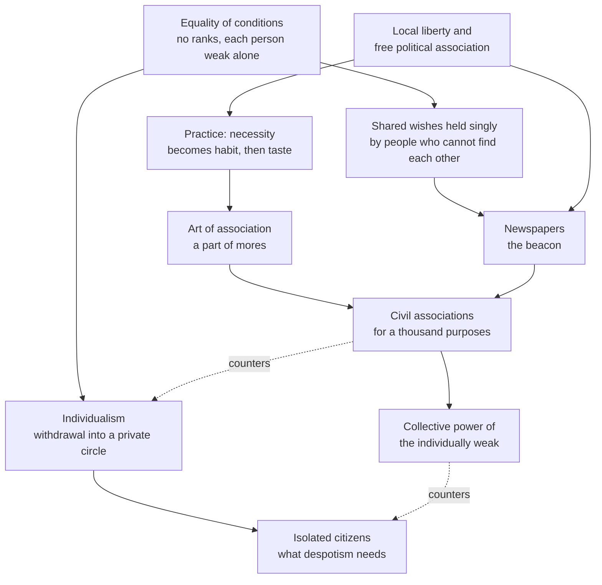

# Social Theory · Lesson 6.1: Tocqueville on associations

> ⏱ ~15 min · Module 6: Civil society, rational choice, and social capital · Builds on: [1.2 Functional explanation](01-02-functional-explanation-and-its-critics.md), [1.4 Testing a social explanation](01-04-testing-a-social-explanation.md), [HPT 6.2 Tocqueville I](../../history-of-political-thought/lessons/06-02-tocqueville-equality-of-conditions.md) · Unlocks: [6.2 Rational-choice sociology](06-02-rational-choice-sociology.md), [6.3 Social capital](06-03-social-capital-coleman-and-putnam.md)

## Why this matters

Every modern claim that clubs, congregations and civic groups make democracy work runs back to a few chapters of *Democracy in America* (1835, 1840). [`history-of-political-thought`](../../history-of-political-thought/lessons/06-02-tocqueville-equality-of-conditions.md) reads Tocqueville as a political theorist. This lesson reads him as a **sociologist**, with a causal account of how associations form among equals, what they do to their members, and why one country has many and another few, plus his own attempt to test it. The social-capital tradition of [6.3](06-03-social-capital-coleman-and-putnam.md) inherits both the account and its evidence problems.

## The idea

Two points reload from HPT. **[Equality of conditions](../reference.md#equality-of-conditions)** is a social state with no hereditary ranks, in which families rise and fall and people regard one another as the same kind of person. **[Individualism](../reference.md#individualism-as-withdrawal)** is the calm withdrawal into a small private circle that equality encourages. It is a misjudgment of one's own situation, not greed ([HPT 6.2](../../history-of-political-thought/lessons/06-02-tocqueville-equality-of-conditions.md)).

Now the sociological puzzle. In an aristocracy each lord heads a standing, compulsory association of his dependants; when he moves, a multitude moves with him. Equality abolishes these ready-made collectives. Everyone is independent, everyone is weak, and no one can order anyone else to help. So, Tocqueville argues (Vol. 2, Part II, ch. 5, paraphrased), democratic peoples either learn to combine voluntarily or fall into collective incapacity.

Learning is the operative word. The **[art of association](../reference.md#art-of-association)** is a skill and a taste: knowing how to propose a common object, keep order among many and subordinate your exertions to a common plan, and wanting to. It belongs to what Tocqueville calls **[mores](../reference.md#mores)**. Reeve renders the word as "manners" but glosses it with the ancients' *mores*: not etiquette, but "the whole moral and intellectual condition of a people" (Vol. 1, ch. 17, Reeve). Skills like this come from practice, not from interest.

Practice needs occasions. Tocqueville separates two kinds of association. **[Civil associations](../reference.md#civil-and-political-associations)** pursue private or social ends: companies, schools, churches, charities. **Political associations** aim at the state: parties, conventions, campaigns. His striking claim (Vol. 2, Part II, ch. 7, paraphrased) is that the two are causally linked in both directions. Civil associations teach the habit that politics uses. Political associations are the better school: joining one risks no money, and their size shows the individually weak what combination can do. Hence his prediction: where political association is forbidden, civil associations will be few, feeble and badly run, whatever the law allows them.

A third ingredient is easy to miss: **newspapers**, which chapter 6 makes the infrastructure of association.

**What kind of explanation is this?** In the [Module 1](01-01-individuals-and-social-facts.md) vocabulary, it starts and ends at the macro level (a social state; a society free or despotic) and runs in between through individuals' weakness and learning. But its key variable, mores, is a collective habit that no individual chooses. That is why both the rational-choice program ([6.2](06-02-rational-choice-sociology.md)) and the more holist social-capital tradition ([6.3](06-03-social-capital-coleman-and-putnam.md)) claim him. It is **not** a functional explanation in the suspect sense of [1.2](01-02-functional-explanation-and-its-critics.md). Tocqueville never says associations exist *because* democracy needs them. They exist because people pursue particular ends, are legally free to combine and know how to. What they do for democracy is a by-product: a **[latent function](../reference.md#manifest-and-latent-functions)**. A fire company's manifest function is putting out fires. Its latent function is teaching its members to run a meeting.

## Source

From Vol. 2, Part II, ch. 6, "Of the Relation Between Public Associations and Newspapers" (Reeve):

> The principal citizens who inhabit an aristocratic country discern each other from afar; and if they wish to unite their forces, they move towards each other, drawing a multitude of men after them. It frequently happens, on the contrary, in democratic countries, that a great number of men who wish or who want to combine cannot accomplish it, because as they are very insignificant and lost amidst the crowd, they cannot see, and know not where to find, one another. A newspaper then takes up the notion or the feeling which had occurred simultaneously, but singly, to each of them. All are then immediately guided towards this beacon; and these wandering minds, which had long sought each other in darkness, at length meet and unite.

Read closely. "Who wish or who want to combine" places the motive before the newspaper arrives. What they lack is location: they "cannot see, and know not where to find, one another." The newspaper creates no interest; it takes up a feeling that had occurred "simultaneously, but singly," and makes it shared and visible. The aristocratic contrast fixes the variable: a few great men can see each other; many small ones cannot. The obstacle is **group size and visibility**, not apathy. In modern terms (a gloss, not his vocabulary) it is a coordination problem, and the newspaper is a public signal.

## The argument

The explanation, in Tocqueville's terms (Vol. 2, Part II, chs. 4–7):

1. **Equality of conditions leaves most people independent and individually weak.** (Macro starting point; reloaded from HPT.)
2. **Equality disposes each person to withdraw into a private circle.** *In words:* the democratic citizen is absent, not hostile.
3. **Under equality, public ends can be reached only by many people combining.** No one is strong enough to act alone or to command others' help (ch. 5).
4. **A shared interest does not by itself produce combination.** Scattered people cannot find one another (ch. 6), and novices fear the losses of joint ventures (ch. 7). *In words:* collective action has costs that interest alone doesn't pay.
5. **Combining is a learned skill and taste, part of mores, acquired by practice.**
6. **Local self-government and political associations supply cheap, compulsory practice, and what is first done by necessity becomes habit, then taste (chs. 4, 7).** Local powers also multiply the newspapers that let people find each other (ch. 6).
7. **The skill transfers between political and civil life in both directions, so suppressing political association stunts civil association too (ch. 7).**

∴ **Where local liberty and free political association exist, equal citizens build a dense web of associations that counteracts individualism and gives them collective power. Where these are suppressed, equality produces the isolated mass that despotism needs.**

*In words:* equals get associations not from their interests but from habits, and habits from practice that only freedom supplies.

**Kinds of claim.** That this is Tocqueville's argument is *exegetical*; whether associations really school their members is *explanatory/empirical*. Whether a dense associational life is good is *evaluative*, and not argued here. Tocqueville himself thought unlimited political association brings a nation to the verge of anarchy; the normative question belongs to [`political-philosophy`](../../political-philosophy/syllabus.md).

**Where the argument is weakest.** At premises 6–7, the schooling and transfer claims, and at the evidence behind them. A critic presses two points. First, **[selection](../reference.md#selection)**: if people already disposed to cooperate are the ones who join associations, a correlation between membership and civic habit shows nothing about schooling. That is the problem [6.4](06-04-social-capital-on-trial.md) takes up. Second, Tocqueville's evidence is a comparison of a handful of cases, America, France, England and Spanish America. In it, mores are identified by elimination: whatever the controlled causes fail to explain is credited to them. A residual category absorbs whatever the comparison failed to measure.

## The explanation

Solid arrows are causal claims, each of which could fail; dashed arrows are counterweights.

## Worked examples

**Example 1 (the theory explaining a real case): why democracy held in the United States and not in Mexico.** In Vol. 1, ch. 17 Tocqueville ranked three causes of American democratic stability (physical circumstances, laws and mores) by a sequence of comparisons:

- **Spanish South America** had land, rivers and isolation as favorable as North America's, yet could not sustain democratic government. So physical causes are not decisive.
- **Mexico** had adopted the federal laws of the United States and still could not accustom itself to democracy. So laws are not sufficient.
- **East versus West within the Union**: the same descent, language, religion, physical causes and laws, yet the eastern states governed with regularity and the newer western ones by fits. Only mores are left to differ.

Circumstances, he concludes, count less than laws, and laws far less than mores. As method, this is the [method of difference](../reference.md#comparison-and-concomitant-variation) from [1.4](01-04-testing-a-social-explanation.md): hold some causes constant and see whether the outcome still varies. He is candid about its limit. Asked whether American laws and mores would work in a country without America's natural advantages, he admits there is no case to compare: "No standard of comparison therefore exists, and we can only hazard an opinion upon this subject" (Vol. 1, ch. 17, Reeve).

Now audit the comparisons. The Mexico case holds the *written* constitution constant, but not the social state: Tocqueville asserts that every American nation had a democratic social state, a contestable premise about colonies built on large estates and legal caste. The East–West case holds laws constant, but not the age of settlement, population turnover or density. Tocqueville folds those into mores (habits accumulate with time), which is exactly the residual problem. Later economic historians explain the divergence of the Americas by initial inequalities of land and power; that rival belongs to [`institutions-and-development`](../../institutions-and-development/syllabus.md). As evidence, the ranking is a reasoned small-N comparison: suggestive, but unable to exclude rivals that vary along with mores.

**Example 2 (where it strains): Solidarity, Poland 1980–81.** Communist Poland forbade independent political association. Chapter 7 predicts few, feeble civil associations. Yet the strike wave of summer 1980, centred on the Gdańsk shipyard, forced the government to accept an independent self-governing trade union, and Solidarity enrolled about ten million members within a year before martial law crushed it in December 1981. That is association on a scale no Tocquevillian school seems to have prepared. Readings divide.

- **The theory strains.** Grievance plus a focal event can produce mass association in weeks, so the art of association may be learned far faster than Tocqueville's slow habit-formation implies.
- **The theory absorbs it.** Chapter 7 itself allows some association under prohibition. The schools existed, just not where the law looked. The Catholic Church was the one large institution outside party control, and from 1976 the dissident Workers' Defence Committee organized aid to prosecuted strikers. The shipyard itself solved the chapter 6 problem: thousands of workers who could see one another needed no beacon.

An exegetical wrinkle: the civil/political line presupposes a state separate from the economy, and under state socialism the employer *was* the state, so a trade union was political by construction. What would discriminate between the readings is a within-country comparison: did Solidarity organize faster where parish life or prior dissident networks were denser, holding industry and city size fixed? How much of 1980 to credit to the Church is argued in [`church-history` 9.3](../../church-history/lessons/09-03-after-the-council.md).

## Watch out

- **You might think Tocqueville explains associations functionally (they exist because democracy needs them), but actually he explains them by interests, legal freedom and learned skill.** The service to democracy is a latent function; reading it as the cause commits [1.2](01-02-functional-explanation-and-its-critics.md)'s error, not his.
- **You might think Tocqueville's civil associations work best kept apart from politics, but actually chapter 7 argues the reverse.** Governments that tolerate clubs and ban parties, he says, deprive themselves of the schooling that makes clubs work.
- **You might think that showing Tocqueville's argument is coherent shows that associations make democracy work, but actually that confuses exegesis with explanation.** Whether the schooling effect exists is an empirical question with a selection problem attached. Whether dense association is *good* is a third, evaluative question, and Weimar Germany ([6.4](06-04-social-capital-on-trial.md)) is the case that keeps it open.

## One-liner

> Equality leaves everyone free and weak; Tocqueville's associations are how the weak become strong, and he holds that only practice in freedom, political freedom above all, teaches them to combine.

## Problems

**P1 (🟢) *(Exegetical (a)–(b).)*** Close reading. From Vol. 2, Part II, ch. 6 (Reeve):

> The extraordinary subdivision of administrative power has much more to do with the enormous number of American newspapers than the great political freedom of the country and the absolute liberty of the press. If all the inhabitants of the Union had the suffrage--but a suffrage which should only extend to the choice of their legislators in Congress--they would require but few newspapers, because they would only have to act together on a few very important but very rare occasions. […] There is a prevailing opinion in France and England that the circulation of newspapers would be indefinitely increased by removing the taxes which have been laid upon the press. […] Newspapers increase in numbers, not according to their cheapness, but according to the more or less frequent want which a great number of men may feel for intercommunication and combination.

(a) Which cause of America's many newspapers does Tocqueville rank first, which rival causes does he demote, and which words decide it? (b) The same chapter says "A newspaper can only subsist on the condition of publishing sentiments or principles common to a large number of men." Is Tocqueville's explanation of newspaper numbers functional in the sense of [1.2](01-02-functional-explanation-and-its-critics.md), and if so, does it name a feedback mechanism? Two sentences per part.

**P2 (🟡) *(Exegetical (a) · Evaluative (b).)*** Apply to a real modern case. After the police killing of Khaled Said in Alexandria in June 2010, a Facebook page in his memory ("We Are All Khaled Said") drew a large following, and its administrator publicized the call to protest on 25 January 2011, the start of the uprising that ended Mubarak's rule. Zeynep Tufekci (*Twitter and Tear Gas*, 2017) argues that digital tools let movements scale up quickly without the slow organizational work that once preceded mass action, and that such movements often then struggle to decide, negotiate and adapt. (a) Which of Tocqueville's mechanisms does the page supply (the chapter 6 beacon or the chapter 7 school), and which does it not? Two sentences. (b) Does Tufekci's argument support or weaken Tocqueville's chapter 7 claim? Say what evidence would discriminate, and state in words how strong the current evidence is. 150 words or fewer.

**P3 (🔴, optional) *(Exegetical.)*** Diagnose. From an invented op-ed in a provincial paper:

> "Brennholm's choirs, rowing clubs and parish councils are thriving because a healthy democracy needs schools of citizenship, and a society produces what it needs. That is why the government can safely keep its ban on political clubs: the choirs will do the civic schooling."

(a) What kind of explanation does the first sentence assume, and what is missing from it? (b) Which claim of Tocqueville's does the second sentence contradict? Two sentences per part.

Solutions

**P1** *(Exegetical (a)–(b).)*

**Must hit, strict (a):**

- First: the **subdivision of administrative power**, meaning many local powers that compel citizens to act together often.
- Demoted: political freedom and liberty of the press ("much more to do with … than"), and cheapness, meaning the removal of press taxes ("not according to their cheapness").
- The deciding words are "much more to do with … than" and "not according to … but according to the more or less frequent want … for intercommunication and combination." The suffrage counterfactual makes the variable *frequency of joint action*: a national vote alone means rare joint action and therefore few papers.

**Must hit, strict (b):**

- Yes, it is functional in form: newspapers exist in proportion to the need they meet.
- It names a feedback mechanism: a paper "can only subsist" if it speaks for a body of readers, so papers that meet no want fail and those that meet one survive. That is market selection, which is the repair 1.2 asks for. The benefit explains the numbers through survival, not by fiat.

**Wrong turns:** answering "liberty of the press" in (a), which is the cause he explicitly demotes. In (b), calling it the disguised benefit claim of 1.2: the "subsist" sentence supplies exactly the selection loop such claims lack.

**Model answer:** (a) He ranks first the subdivision of administrative power, the many local bodies that make Americans act together daily, and demotes political freedom, liberty of the press and cheapness. "Much more to do with … than" and "not according to their cheapness, but according to the … want … for intercommunication and combination" decide it. (b) It is functional, explaining the number of papers by the want they serve, but it is the legitimate kind: a paper "can only subsist" if a body of readers shares its views, so unread papers die. That survival filter is the feedback mechanism.

---

**P2** *(Exegetical (a) · Evaluative (b).)*

**Must hit, strict (a):**

- The page is a chapter 6 **beacon**. It took up a grievance felt singly by many scattered people and let them find one another and a date.
- It does not supply the chapter 7 **school**: the slow practice of keeping order among many, subordinating one's will to a common plan, and meeting again afterwards.

**Must hit, any verdict (b):**

- State Tufekci's claim precisely: speed of mobilization is decoupled from organizational capacity.
- Connect it to chapter 7. If capacity comes from practice and the beacon now arrives before the practice, Tocqueville predicts movements that gather fast and act clumsily. That is consistent with Tufekci; alternatively, argue that it weakens his claim, because mass association no longer needs prior schooling to *form*.
- Name discriminating evidence, e.g. compare digitally mobilized movements with and without prior organizational networks (unions, religious or professional bodies) on durability and bargaining success, holding the regime and the size of the grievance fixed.
- State evidence strength in words: largely case studies and contested, with no settled cross-national finding.

**Wrong turns:** treating the page as a Tocquevillian association in the full sense (it is a signal, not a body that meets and governs itself). Asserting a settled finding about social media and protest.

**Model answer (b), one of several:** Tufekci mostly supports Tocqueville, read carefully. Chapter 6 and chapter 7 describe separate mechanisms: the beacon lets people find one another, and the school teaches them to act together once found. Tocqueville's America had both, accumulated over decades of township and party practice. Tufekci's movements have the beacon without the school, and she reports what chapter 7 predicts: fast gathering, weak capacity to decide and negotiate afterwards. The one point against him is that mass association can now *form* without prior schooling. To discriminate, compare digitally called movements that had prior organizational networks (unions, religious bodies) with ones that had none, on how long they lasted and what they won, in similar regimes. The current evidence is mostly case studies and contested; it suggests the pattern but does not establish it.

---

**P3** *(Exegetical.)*

**Must hit, strict (a):**

- A **functional** explanation: the associations are explained by the need they meet ("a society produces what it needs").
- **No feedback mechanism** is named: nothing says how a democracy's need causes choirs to thrive, or why they would fail without it. This is 1.2's disguised benefit claim.
- Tocqueville's own explanation, by interests, freedom and skill, is the repair.

**Must hit, strict (b):**

- Chapter 7: political association is the better school of association, and where it is banned civil associations will be few, feeble and badly run. On his account the choirs cannot substitute for political clubs; the ban undermines them.

**Wrong turns:** calling the first sentence "holist" and stopping there (holism is not the defect; the missing mechanism is). Answering (b) with tyranny of the majority, which belongs to [HPT 6.3](../../history-of-political-thought/lessons/06-03-tocqueville-tyranny-of-the-majority-and-soft-despotism.md), not ch. 7.

**Model answer:** (a) The first sentence is functionalist: it explains the clubs by the democratic need they serve, without saying how that need brings clubs into being or keeps them alive. That makes it a benefit claim dressed as a cause. (b) It contradicts chapter 7, where political associations are the great schools of association and banning them leaves civil associations few and unskillfully managed. On Tocqueville's account the ban starves the choirs it relies on.

## Flashback

**From Lesson [5.2](05-02-simmels-philosophy-of-money.md) (Simmel's *Philosophy of Money*):** *(Exegetical.)* The Highways Act 1555 required the householders of each English parish to give four days' labor a year on the parish roads, under two surveyors elected by the parish; anyone who held a ploughland or kept a draught team also had to send a cart equipped for the work. Over the following centuries this statute labor was gradually replaced by money, and the Highway Act 1835 let parish surveyors recover the cost of the roads through rates levied on occupiers of land. (a) Where do the 1555 duty and the rate sit on chapter 4's scale of claims, and what does the householder gain in Simmel's terms? (b) What does Simmel say is lost, and where does the householder's dependence and trust now go? (c) Name one observable change, and the comparison, that would test the claim that money depersonalizes the relation. Two sentences each for (a) and (b), one for (c).

Solution

**Accept:** in (a), placing the duty at the claim-on-the-person end with the cart as a claim in kind; the fixed four days make it milder than the serf's unmeasured services, but it is still a claim on the person. In (c), any observable about monitoring of the obligated person or switching between partners, with a before/after or across-parish comparison.

**Must hit, strict (a):**

- The 1555 duty is a claim on the person: his own labor on set days, directed by the surveyor (the cart is a claim in kind). The rate is a claim on a sum only.
- Gain: the claim no longer fixes what he does or when. He earns the sum however he likes and spends his four days on his own ends, and the surveyor's command over his time ends.

**Must hit, strict (b):**

- Lost (ch. 5): the personal content of the obligation, neighbors working the road together under a neighbor, reduced to a payment. The freedom gained is largely negative.
- Dependence moves from particular neighbors turning up to an impersonal system. Hired labor that anyone could supply does the work, and the ratepayer must trust the parish to turn his money into road, and ultimately the order that makes rates collectable and wages spendable (P3–P5).

**Must hit, strict (c):**

- An observable about monitoring or switching: for example, surveyors' accounts listing wages paid to a changing set of hired men instead of named householders' attendance, and fines for absentees disappearing. Compared before and after commutation, or between parishes that commuted early and late.

**Wrong turns:** saying the rate makes the householder independent full stop, when C1 says he is more dependent on the whole and less on any particular person. Explaining the change functionally ("roads went to money because money frees people"): Simmel's thesis is about what the money form does, not why commutation happened. Reporting only the gain, which drops chapters 5–6.

**Model answer:** (a) The 1555 duty claims the householder's own labor, and his cart and team, on days the surveyor sets, while the rate claims only a sum. Paid in money, the obligation stops at the amount: how he earns it and what he does with his four days are now his own business. (b) What goes is the personal side of the duty, working the road beside his neighbors under a surveyor who was one of them; what he gets in return is a mostly negative freedom. He no longer depends on particular neighbors turning up but on hired men any of whom could be replaced, and he has to trust the parish, and behind it the wider order, to turn his rate into a road. (c) Comparing parishes that commuted early with those that commuted late, Simmel predicts that surveyors' books would shift from attendance lists of named householders and fines for absentees to wages paid to a changing set of hired men.

## Connections

- **Backward:** Equality of conditions and individualism are [HPT 6.2](../../history-of-political-thought/lessons/06-02-tocqueville-equality-of-conditions.md); associations as a counterweight to majority power and administrative despotism are [HPT 6.3](../../history-of-political-thought/lessons/06-03-tocqueville-tyranny-of-the-majority-and-soft-despotism.md). Latent functions and the feedback test are [1.2](01-02-functional-explanation-and-its-critics.md). Tocqueville's ranking of causes is the comparison logic of [1.4](01-04-testing-a-social-explanation.md). Polanyi's society protecting itself ([5.3](05-03-polanyis-great-transformation.md)) is another account of how individuals come to act together against an impersonal force.
- **Forward:** Coleman's boat ([6.2](06-02-rational-choice-sociology.md)) formalizes the macro-to-micro-to-macro shape of premises 1–7. Coleman's closure and Putnam's civic networks ([6.3](06-03-social-capital-coleman-and-putnam.md)) are the modern heirs of the chapter 7 school, and the Module 6 boss problem asks whether Putnam's mechanism is Tocqueville's. [6.4](06-04-social-capital-on-trial.md) brings the selection objection, Skocpol's account of the decline of membership federations, and associations in Weimar Germany.
- **Sideways:** The newspaper as beacon is a coordination device: a public signal that picks one outcome among many possible ones, the selection problem [`game-theory-refresher` 2.3](../../game-theory-refresher/lessons/02-03-repeated-games-folk-theorem.md) notes focal points can help solve. The Church's role in Poland in 1979–80 is weighed in [`church-history` 9.3](../../church-history/lessons/09-03-after-the-council.md). Subsidiarity, a different doctrine often read beside Tocqueville, belongs to [`catholic-social-teaching`](../../catholic-social-teaching/syllabus.md).
