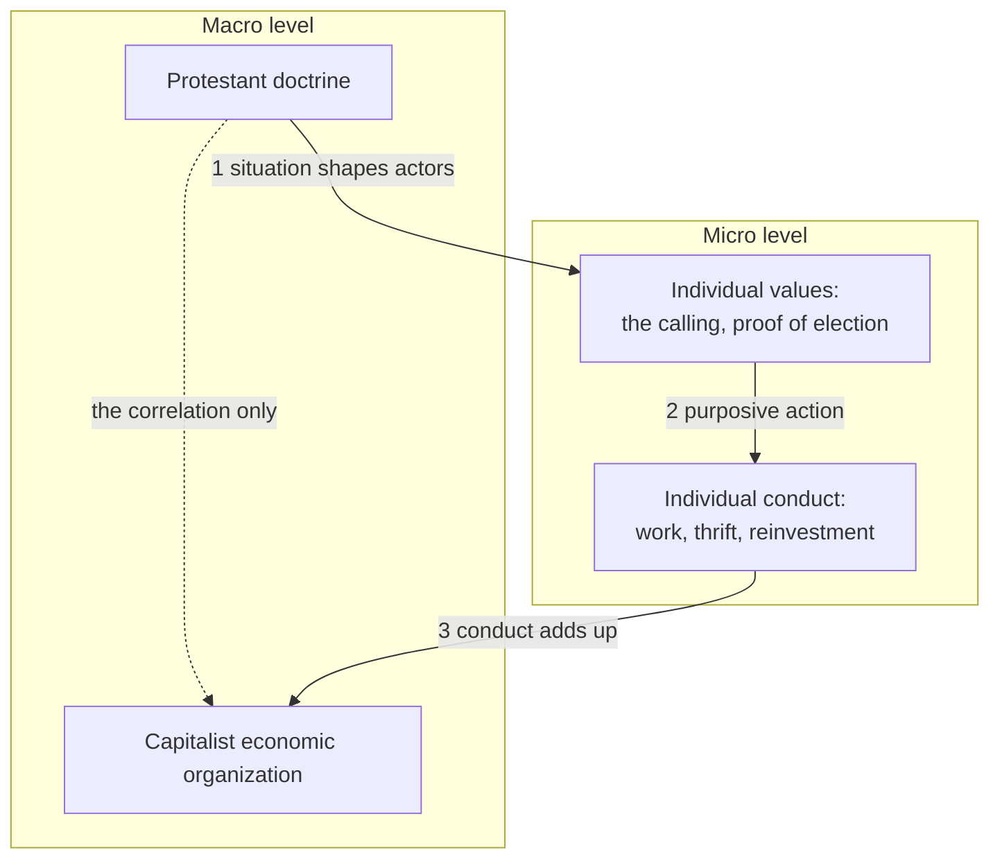

# Social Theory · Lesson 6.2: Rational-choice sociology

> ⏱ ~15 min · Module 6: Civil society, rational choice, and social capital · Builds on: [1.1 Individuals and social facts](01-01-individuals-and-social-facts.md), [1.2 Functional explanation and its critics](01-02-functional-explanation-and-its-critics.md), [6.1 Tocqueville on associations](06-01-tocqueville-on-associations.md) · Unlocks: [6.3 Social capital: Coleman and Putnam](06-03-social-capital-coleman-and-putnam.md), [6.4 Social capital on trial](06-04-social-capital-on-trial.md)

## Why this matters

Tocqueville ([6.1](06-01-tocqueville-on-associations.md)) said associations teach people to cooperate; Durkheim treated norms as social facts that press on individuals from outside ([1.1](01-01-individuals-and-social-facts.md)). Neither says how a norm gets built out of the people it binds. Rational-choice sociology tries to. Its most systematic statement is James Coleman's *Foundations of Social Theory* (1990): explain every macro pattern, norms and trust included, as the result of individuals pursuing goals in situations that other people's choices have shaped. The payoff is a demand for mechanisms ([1.4](01-04-testing-a-social-explanation.md)). The price shows up in two places: norms that serve no one, and acts like voting that seem to defy the calculus.

## The idea

Start with what kind of explanation this is. Rational-choice sociology is **explanatory individualism** ([1.1](01-01-individuals-and-social-facts.md); card: [ontological and explanatory individualism](../reference.md#ontological-and-explanatory-individualism)): the explaining is done by individual action. It need not be ontological individualism. Coleman happily treats firms, unions and states as "corporate actors" with interests of their own; what he refuses is an explanation that runs from one macro fact straight to another.

His device for saying so is the macro-micro-macro diagram, usually called **[Coleman's boat](../reference.md#colemans-boat)** for its shape. A macro-level claim ("Protestant regions became capitalist") is a correlation between two system states. To explain it you need three arrows the correlation hides:

1. **Macro to micro.** How does the social situation shape what individuals believe, want and can do?
2. **Micro to micro.** Given that, what does each individual choose, and why?
3. **Micro to macro.** How do those choices combine into the system-level outcome?

Peter Hedström and Richard Swedberg (*Social Mechanisms*, 1998) later named these situational, action-formation and transformational mechanisms. Coleman's own showcase is Weber ([4.1](04-01-the-protestant-ethic-and-the-spirit-of-capitalism.md)): Protestant doctrine shapes individual values (arrow 1), those values produce disciplined economic conduct (arrow 2), and that conduct adds up to capitalist economic organization (arrow 3). That is Coleman's compression; Weber's own causal claim is narrower ([4.1](04-01-the-protestant-ethic-and-the-spirit-of-capitalism.md)). Coleman's complaint about most social theory is that arrow 3 is the hardest to supply and the one most often skipped.

Weber, on this point, would have agreed. Arguing against an explanation of the capitalist spirit by market selection alone, he wrote that such a way of life "had to originate somewhere, and not in isolated individuals alone, but as a way of life common to whole groups of men. This origin is what really needs explanation" (*The Protestant Ethic*, ch. 2, Parsons translation). Selection is a macro-to-micro story; Weber wanted the bottom of the boat.

Coleman then applies the boat to norms. **[Norms as solutions to externalities](../reference.md#norms-as-solutions-to-externalities)**: when my action imposes costs on others who cannot buy the right to control it, those others have an interest in controlling it, which Coleman calls the demand for a norm. A norm exists when that right is held socially and backed by sanctions. Demand is not supply, though. Punishing a violator costs the punisher and benefits everyone, so sanctioning is itself a public good, and the free-rider problem reappears one level up (the free rider at the first level is [`public-economics` 1.2](../../public-economics/lessons/01-02-voluntary-provision-and-crowding-out.md)'s). Coleman's answer is **[closure](../reference.md#closure)**: in a network where the people I deal with also deal with each other, news of my violation travels, sanctions can be coordinated, and they are cheap. Behind closure sits repeated-game enforcement: people who expect to keep meeting can make cooperation pay.

## The argument

Coleman's explanation of a social norm, reconstructed:

1. **(Explanatory individualism)** A macro pattern is explained only when its macro-to-micro, micro-to-micro and micro-to-macro links are supplied.
2. **(Purposive action)** Individuals choose the action that best serves their goals, given their beliefs and options.
3. **(Externality)** Where an action imposes costs on others who cannot transact over it, those others want control over it: a demand for a norm.
4. **(Enforcement)** A norm exists when that control is held socially and backed by sanctions; sanctions are supplied when relations are ongoing and closed, so that cooperating now is rewarded later and violators are known.
5. **(Repeated game)** In an ongoing relation, the threat to stop cooperating after a defection makes cooperation self-enforcing if people weigh the future enough (below).

∴ **C.** Norms, and the trust they support, are equilibria among purposive people who expect to keep dealing with each other.

*In words:* a norm is what self-interested neighbours settle into when the future is long and everyone is watching.

**What kind of explanation.** Intentional at the micro level (premise 2), causal in aggregation (premises 4 and 5). It looks functional, since the norm exists "because" it solves an externality, but it names its feedback mechanism ([1.2](01-02-functional-explanation-and-its-critics.md); card: [feedback mechanism](../reference.md#feedback-mechanism)): the people harmed demand the norm and the people watching enforce it.

**Premise 5, made exact.** Two people play a prisoner's dilemma every period: $T$ is the temptation payoff (defect while the other cooperates), $R$ the reward for mutual cooperation, $P$ the punishment for mutual defection, $S$ the sucker's payoff, with $T > R > P > S$. Each discounts next period by $\delta \in (0,1)$. **[Grim trigger](../reference.md#grim-trigger)**: cooperate until the other defects, then defect forever. Cooperating forever is worth $R/(1-\delta)$; defecting now is worth $T$ today and $P$ every period after. Cooperation holds when

$$\frac{R}{1-\delta} \ge T + \frac{\delta P}{1-\delta} \iff R \ge (1-\delta)T + \delta P$$

$$\iff \delta \ge \delta^* = \frac{T-R}{T-P}.$$

*In words:* the one-time gain $T-R$ must be outweighed by the permanent loss $R-P$, weighted by patience. The derivation and the folk theorem are in [`game-theory-refresher` 2.3](../../game-theory-refresher/lessons/02-03-repeated-games-folk-theorem.md).

**Thin and thick.** Premise 2 can mean two things. Jon Elster (*Sour Grapes*, 1983) distinguishes a **thin** theory of rationality, which asks only that beliefs and desires be consistent and that action fit them, from what he calls a **broad** theory, often called thick, which also asks that beliefs be well grounded and desires autonomous ([thin and thick rationality](../reference.md#thin-and-thick-rationality)). Thin rationality is not selfishness: the goals may be altruistic. But the thinner the theory, the more behaviour it can absorb, and the less it risks.

**Where the argument is weakest.** Premises 3 and 4, the step from "someone would benefit from a norm" to "a norm exists and is enforced." Elster (*The Cement of Society*, 1989) presses two points. Many norms serve no one's interest, or harm everyone, codes of revenge being his standing example, so the demand for a norm does not track the norms we find. And norms seem to work through emotions such as shame and guilt rather than calculated sanctions, which puts a non-instrumental motive at the core of the explanation. A Colemanian replies that in closed networks sanctions are nearly free (gossip, a cold shoulder), so the second-order problem is small, and that a norm which outlived its usefulness is a fact about transition costs, not a refutation.

## The explanation

*Coleman's boat on his own example. The dotted top arrow is what a macro correlation shows; the explanation travels along the bottom. Arrow 3 is the one Coleman charged most theories, Weber's included, with leaving thinnest.*

## Worked examples

**Example 1 (the theory explaining a real case): cattle trespass in Shasta County.** Robert Ellickson (*Order without Law*, 1991) studied ranchers and rural neighbours in Shasta County, California. He found that disputes over straying cattle were settled not by the formal trespass law, which many residents did not know, but by informal norms of neighbourliness: owners are responsible for their animals, small losses are absorbed, and running debts are kept in loose mental accounts. Violators are punished first by gossip and only rarely in court.

Run the boat. *Arrow 1:* a close-knit rural community of long-term neighbours who deal with each other on many matters, a high-closure network. *Arrow 2:* each rancher, expecting years of dealings and knowing that a reputation travels, keeps his cattle in and tolerates a neighbour's occasional stray. *Arrow 3:* individually small acts of restraint add up to an order that diverges from the law. Premise 5 in invented numbers: let a neighbour who lets cattle roam while the other fences gain $T = 8$, mutual care give $R = 5$, mutual neglect $P = 2$, and the fenced-against $S = 0$. Then

$$\delta^* = \frac{8-5}{8-2} = \frac{1}{2}.$$

A rancher who values next season at least half as much as this one keeps cooperating. Check at $\delta = 1/2$: $(1-\tfrac12)\cdot 8 + \tfrac12 \cdot 2 = 5 = R$, exactly indifferent.

Ellickson's own generalizing hypothesis is that close-knit groups develop norms that maximize their members' joint welfare. Note the kind of claim: that is close to a functional claim, and the evidence is one county studied in depth. It is rich ethnography, not a cross-group comparison.

**Example 2 (where it strains): why anyone votes.** Anthony Downs (*An Economic Theory of Democracy*, 1957) saw that voting costs time while the chance of casting the deciding vote in a large electorate is tiny, so a thin calculus predicts that almost no one votes. Many do. William Riker and Peter Ordeshook (*American Political Science Review*, 1968) added a term for the satisfaction of doing one's civic duty, and the prediction recovers. The pivot arithmetic is [`political-economy`](../../political-economy/syllabus.md) 1.2's; the sociological question is what the duty term is.

The fork is thin versus thick. Read thinly, duty is one more preference, and the explanation risks circularity: people vote because they like voting. Coleman's machinery offers something better: duty is a norm, held in place by others who notice who votes, which makes a testable claim about observation and sanctions. Read thickly, duty is an internalized commitment that works without any expected sanction, and then the core of the explanation is not rational choice at all. Here the approach strains: either it supplies the sanction mechanism and stakes everything on evidence that people vote because they are watched, or it lets duty in as a primitive and gives up its distinctive claim.

## Watch out

- **You might think rational-choice sociology assumes that only individuals exist, but actually its claim is explanatory.** Coleman admits corporate actors and macro states; he insists only that explanations pass through action ([1.1](01-01-individuals-and-social-facts.md)).
- **You might think "the norm exists because it benefits the group" is Coleman's explanation, but actually that is the disguised benefit claim of [1.2](01-02-functional-explanation-and-its-critics.md).** His explanation needs the feedback: those harmed demand control, and someone actually pays to sanction. Without the second step, it is functionalism.
- **You might think explaining a norm by self-interest debunks or endorses it, but actually that is an evaluative question this course does not argue.** Showing that Shasta's neighbourliness is an equilibrium says nothing about whether it is admirable, and thin rationality does not even say people are selfish.

## One-liner

> Rational-choice sociology explains a macro pattern by running it through individuals and back up (Coleman's boat), and explains norms as equilibria of people who expect to keep meeting and can watch each other; it strains on norms that serve no one and acts that no sanction seems to drive.

## Problems

**P1 (🟢) *(Formal (a)-(c).)*** Invented numbers. Two fishing crews share a bay. Each season each crew either keeps to its quota (cooperate) or overfishes (defect). Stage payoffs: $T = 9$, $R = 6$, $P = 1$, $S = 0$. Both use grim trigger.

(a) Compute $\delta^*$, and say whether cooperation holds at $\delta = 0.3$ and at $\delta = 0.6$.
(b) Suppose each skipper has internalized a norm against overfishing: overfishing while the other crew keeps its quota now carries a guilt cost $g = 2$, lowering that payoff to $T - g$. No other payoff changes. Recompute $\delta^*$ and the verdict at $\delta = 0.3$.
(c) How large must $g$ be for cooperation to hold at every $\delta$? In one sentence, say what this shows about the thin and thick readings of a norm.

**P2 (🟡) *(Exegetical (a) · Evaluative (b).)*** Diagnose. An **invented** memo from the agriculture ministry of the invented province of Lornmoor, not the words of any real person or body:

> "Of our 40 dairy districts, the 15 with a farmers' cooperative creamery report milk yields per farm 20 percent above the rest. The ministry will therefore found a cooperative in each of the other 25 districts, and yields there will rise by a similar amount."

(a) In Coleman's terms, which arrow is the memo's evidence, and which arrows does its prediction skip? Two sentences. (b) Supply one plausible mechanism for each skipped arrow, and name one way the micro-to-macro step could fail in a newly founded cooperative. 100 words or fewer.

**P3 (🔴, optional) *(Exegetical (a) · Evaluative (b).)*** Evaluate against evidence. Alan Gerber, Donald Green and Christopher Larimer ("Social Pressure and Voter Turnout", *American Political Science Review*, 2008) randomly assigned about 180,000 Michigan households, before the August 2006 primary, to a control group or to one of four mailings: *Civic Duty* (a reminder that voting is a duty), *Hawthorne* (told they were being studied), *Self* (showing the household's own past turnout and promising an update after the election), or *Neighbors* (also showing neighbours' turnout). Their abstract reports substantially higher turnout among those promised publicity to their household or their neighbours.

(a) Using Example 2, say what a Colemanian reading of the voting norm predicts about the *Civic Duty* and *Neighbors* mailings. Two sentences. (b) Elster holds that norms work through shame. Does the result discriminate between the Colemanian reading and Elster's? Say what further evidence would. 120 words or fewer.

Solutions

**P1** *(Formal (a)-(c))*

(a) $\delta^* = \dfrac{T-R}{T-P} = \dfrac{9-6}{9-1} = \dfrac{3}{8} = 0.375.$

At $\delta = 0.3 < 0.375$: cooperating is worth $6/0.7 \approx 8.57$; defecting is worth $9 + 0.3 \cdot 1/0.7 \approx 9.43$. **Cooperation fails.**

At $\delta = 0.6 > 0.375$: cooperating is worth $6/0.4 = 15$; defecting is worth $9 + 0.6 \cdot 1 / 0.4 = 10.5$. **Cooperation holds.**

(b) The temptation payoff becomes $T - g = 7$:

$$\delta^* = \frac{7-6}{7-1} = \frac{1}{6} \approx 0.167.$$

At $\delta = 0.3$: cooperating $\approx 8.57$; defecting $7 + 0.3/0.7 \approx 7.43$. **Cooperation now holds** at a patience level where it failed in (a).

(c) Cooperation holds at every $\delta$ once $T - g \le R$, that is $g \ge T - R = 3$; then $\delta^* = 0$ and the temptation is gone. On the thin reading, the norm works only through the shadow of the future; an internalized (thick) norm does the work by itself, with no repetition or sanctions needed.

**Wrong turns:** using $T - S$ or $R - P$ as the numerator; lowering $R$ or $P$ by $g$ in (b) (the guilt attaches only to defecting against a cooperator); answering (c) with "$g > 0$".

---

**P2** *(Exegetical (a) — strict · Evaluative (b) — any mechanism that fits the arrow)*

**Must hit, strict (a):**

- The evidence is the top, macro-to-macro arrow: a correlation across districts between having a cooperative and higher yields.
- The prediction skips all three explanatory arrows: how a cooperative changes farmers' situation (1), what farmers then do differently (2), and how that conduct adds up to district yields (3).

**Accept (b):** any mechanism that fits its arrow, plus any coherent failure of aggregation. A selection point (districts that founded cooperatives may differ, [1.4](01-04-testing-a-social-explanation.md)) earns credit as a bonus, not as a substitute for the mechanisms.

**Must hit, any verdict (b):**

- Arrow 1: the cooperative changes incentives or information (e.g. it pays a premium for quality, or spreads advice and veterinary services).
- Arrow 2: farmers respond (e.g. invest in feed and hygiene).
- Arrow 3, and how it can fail: pooled milk makes each farmer's quality partly a public good, so farmers can shirk on quality while others carry it; in a new cooperative without closure or a history of sanctions, nothing stops this.

**Wrong turns:** treating (a) as an ecological-fallacy point only (it is first a missing-mechanism point); giving a mechanism for arrow 3 that is really arrow 2 ("farmers work harder").

**Model answer (b), one of several:** A cooperative pays a premium for clean, high-fat milk (arrow 1); farmers respond by investing in feed and hygiene (arrow 2); their higher output sums to higher district yields (arrow 3). But pooled milk makes quality a shared good: one farmer's dirty milk spoils the batch, and each can free ride on others' care. Old cooperatives may have closed networks and norms that police this; a ministry-founded one may not, so the macro correlation need not transfer.

---

**P3** *(Exegetical (a) — strict · Evaluative (b) — any verdict)*

**Must hit, strict (a):**

- The Colemanian reading treats duty as a norm held in place by others' observation and sanctions, so it predicts that a bare duty reminder (*Civic Duty*) should do little.
- It predicts that making turnout visible to neighbours (*Neighbors*) should raise turnout most, since it creates exactly the observation that enforcement needs.

**Must hit, any verdict (b):**

- The result fits both readings: shame is also triggered by being seen, so publicity raises turnout on Elster's account too. The crux is whether the publicity effect runs through expected future sanctions (instrumental) or through the emotion of being seen (non-instrumental).
- Name discriminating evidence: e.g. whether the effect depends on whether the watchers can later sanction (close neighbours one deals with vs strangers who will never meet the voter), or whether it persists when exposure carries no possible future cost.

**Wrong turns:** reading the result as decisive for Coleman because "pressure worked"; treating the *Civic Duty* arm as a test of thin rationality rather than of an internalized norm; claiming effect sizes the problem does not give.

**Model answer (b), one of several:** Not decisively. Publicity raises turnout if voters fear their neighbours' disapproval as a sanction (Coleman), but also if being seen to shirk simply triggers shame (Elster), and shame is exactly what exposure produces. The two diverge on whether the effect needs a future: an instrumental reading predicts it should be larger where the watchers are people one will keep dealing with and can be punished by, and should vanish when exposure is to strangers with no way to act on it; a shame reading predicts a substantial effect even then. A design varying who sees the record would discriminate.

## Flashback

**From Lesson [5.3](05-03-polanyis-great-transformation.md) (Polanyi's *Great Transformation*):** *(Exegetical (a) · Evaluative (b).)* Polanyi treats three British measures as one coherent package that built market society: the Poor Law Amendment Act of 1834, Peel's Bank Act of 1844, and the repeal in 1846 of the Corn Laws, Britain's tariffs on imported grain.

(a) For each measure, name the fictitious commodity it helped put on the market. Then say in one sentence what Polanyi infers from the contrast between how this package came about and how the protective reaction came about.

(b) A liberal critic replies: "Granted, the state had to clear the ground, since markets need property law and sound money. That says nothing about whether the market, once built, regulates itself." Does Polanyi's point that laissez-faire was planned answer this reply? Name the premise of his argument (as the lesson reconstructs it) where the dispute actually lies, and one kind of evidence that would bear on it. Any verdict. 100 words or fewer.

Solution

**Accept (a):** for 1846, "land", or "free trade in grain, which exposed land". "Grain" or "food" alone fails: grain is produced for sale, so it is a genuine commodity.

**Must hit, strict (a):**

- 1834: labour. Polanyi reads the Act as creating a competitive labour market.
- 1844: money. The Act put the issue of money under the gold standard's automatic mechanism.
- 1846: land. Repeal removed an agrarian tariff, which is one of the lesson's methods for protecting land, and so exposed farmland and its rents to world grain prices.
- The inference: the market system needed deliberate, coherent statecraft (laissez-faire was planned), while protection arose piecemeal, in many places and without a shared ideology (planning was not). So the market is not simply what is left when interference stops, and protection was not a collectivist plan.

**Must hit, any verdict (b):**

- Separate origin from operation. "Planned" is a claim about how market society came into being. The critic's reply is about how it behaves once it is in place, so granting the first does not concede the second.
- Locate the dispute at **P2**: whether labour, land and money left wholly to the market destroy their own substance. That decides whether protection was a necessary response or shortsighted interference, and it is a counterfactual about an unprotected market, which the lesson says facts alone cannot settle.
- Name one kind of evidence. For example: what happened to wages, health, soil or firms where those markets ran with the least protection; or whether deflation under the gold standard corrected itself or produced the breakdowns.

**Wrong turns:** reading "laissez-faire was planned" as a refutation of self-regulation, which confuses how a market began with how it works. Turning (b) into the evaluative question of whether markets in labour are good, which the lesson leaves to its owner. Mapping the 1846 repeal to grain as a fictitious commodity.

**Model answer (b), one of several:** Only in part. The planned origin defeats the picture of a natural market that the state merely interrupts, and the piecemeal pattern of protection tells against a collectivist plan. But the critic has already granted that the state built the market. The live question is P2: would labour, land and money, left to prices, have been destroyed, or would the market have righted itself? That is a counterfactual. The best evidence is how wages, health and firms fared where those markets ran least protected, and whether gold-standard deflation corrected itself or caused the breakdowns.

## Connections

- **Backward:** [1.1](01-01-individuals-and-social-facts.md)'s explanatory individualism is the method; [1.2](01-02-functional-explanation-and-its-critics.md)'s feedback requirement is what separates Coleman's norm explanation from a benefit claim; [4.1](04-01-the-protestant-ethic-and-the-spirit-of-capitalism.md)'s thesis is the boat's showcase; [6.1](06-01-tocqueville-on-associations.md)'s associations are where closure lives.
- **Forward:** [6.3](06-03-social-capital-coleman-and-putnam.md) turns closure and obligations into Coleman's "social capital"; [6.4](06-04-social-capital-on-trial.md) asks whether the arrows run the way the theory says.
- **Sideways:** the threshold is [`game-theory-refresher` 2.3](../../game-theory-refresher/lessons/02-03-repeated-games-folk-theorem.md), with the general theory in [`grad-game-theory` 3.3](../../grad-game-theory/lessons/03-03-repeated-games-finite-infinite.md); first-order free riding is [`public-economics` 1.2](../../public-economics/lessons/01-02-voluntary-provision-and-crowding-out.md); turnout, Olson and Ostrom's commons are [`political-economy`](../../political-economy/syllabus.md) 1.2 and Module 3; the consistency axioms behind thin rationality are [`decision-theory` 1.3](../../decision-theory/lessons/01-03-the-vnm-theorem-and-how-utility-is-built.md).
