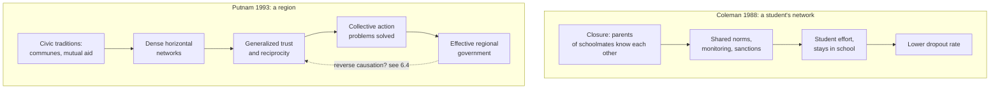

# Social Theory · Lesson 6.3: Social capital: Coleman and Putnam

> ⏱ ~15 min · Module 6: Civil society, rational choice, and social capital · Builds on: [6.1 Tocqueville on associations](06-01-tocqueville-on-associations.md), [6.2 Rational-choice sociology](06-02-rational-choice-sociology.md), [1.4 Testing a social explanation](01-04-testing-a-social-explanation.md) · Unlocks: [6.4 Social capital on trial](06-04-social-capital-on-trial.md)

## Why this matters

Tocqueville said associations teach democratic citizens to act together ([6.1](06-01-tocqueville-on-associations.md)). In the late twentieth century two very different scholars gave that intuition a name borrowed from economics, **social capital**, and made it one of the most-cited ideas in social science. James Coleman used it to explain why some teenagers finish high school; Robert Putnam used it to explain why some Italian regional governments work and others do not, and then to warn that Americans were bowling alone. The two used the same word for two different explanations. This lesson pulls them apart.

## The idea

Physical capital is a tool; human capital is a skill. Both can be pointed at and owned by someone. **[Social capital](../reference.md#social-capital)** is neither: it lives in the *relations between* people. Coleman's example from his 1988 paper: wholesale diamond merchants in New York hand each other bags of stones worth fortunes to examine in private, with no insurance and no contract. What makes that possible is not any merchant's honesty taken alone but the web around them: family, community and a shared synagogue life mean that a merchant who cheated would lose every one of those ties at once.

**Coleman's version** ("Social Capital in the Creation of Human Capital", *American Journal of Sociology* 94 supplement, 1988). He defines social capital *by what it does*: various features of social structure that make certain actions possible for the people inside it. He names three **[forms of social capital](../reference.md#forms-of-social-capital)**:

- **Obligations and expectations.** If I do you a favour, I hold a kind of credit slip, worth something only if the structure makes you trustworthy.
- **Information channels.** Relations carry information that would be costly to acquire alone.
- **Norms with effective sanctions.** A norm that others will enforce lets everyone act on it.

What makes the first and third work is **[closure](../reference.md#closure)**: the people I am tied to are also tied to one another, so they can compare notes and sanction together. His key case is *intergenerational* closure: the parents of children who are friends know each other, so they can agree on rules and watch each other's children. Coleman adds two warnings. Social capital is not fully fungible: a structure that helps one kind of action may be useless or harmful for another. And it is largely a **public good**: whoever builds it captures only part of its benefit, so people underinvest in it, and much of it exists as a by-product of activities pursued for other reasons.

**Putnam's version** (*Making Democracy Work*, 1993, with Robert Leonardi and Raffaella Nanetti). Social capital is features of social organization (trust, norms of reciprocity, networks of civic engagement) that make coordinated action easier for a whole society. His unit is not a student's family but a region; his outcome is not one person's schooling but how well a government works. In *Bowling Alone* (2000) he turned the idea on the United States and argued that Americans' civic, social and political ties had thinned since roughly the 1960s, with more people bowling but fewer in leagues.

*Bowling Alone* also made a distinction now standard: **[bonding and bridging](../reference.md#bonding-and-bridging)** social capital. Bonding ties link people who are alike (an ethnic fraternal society, a tight congregation) and reinforce exclusive identities; bridging ties link people across social divides (a civil-rights coalition, an interfaith service group). Putnam credits the labels to earlier writers and treats them as dimensions, not boxes: one group can bond on class and bridge on religion. Bonding, in a phrase Putnam borrows, helps people get by; bridging helps them get ahead.

## The argument

**Coleman's closure argument**, for the dropout case.

1. **P1.** A child's progress through school depends not only on her own and her parents' resources but on whether adults attend to her: they set expectations, notice slippage and act on it. *(Exegetical: Coleman's starting point.)*
2. **P2.** Parents' human capital helps a child only if it is connected to her through the family's relations; a highly educated parent who is absent, or present but inattentive, transmits little. *In words:* skills sitting in a parent do nothing until a relation carries them.
3. **P3.** Where the parents of schoolmates know one another (intergenerational closure), they can share information about the children, agree on norms, and back one another's sanctions.
4. **P4.** Norms backed by several adults are enforced more reliably than any one parent's rules.
5. **∴ C.** Other things equal, students embedded in structures with closure drop out less: social capital helps create human capital.

**What kind of explanation it is.** Individualist in the explanatory sense: a structural fact (who knows whom) works only through individual choices (a parent's monitoring, a student's effort) and is summed back into a rate. It is a textbook trip around **[Coleman's boat](../reference.md#colemans-boat)** from [6.2](06-02-rational-choice-sociology.md). Defining social capital by its function is *not* a **[functional explanation](../reference.md#functional-explanation)** in [1.2](01-02-functional-explanation-and-its-critics.md)'s sense: Coleman insists the benefit does *not* explain why the structure exists, since those who build it do not capture the payoff.

**Putnam's argument, in brief.** The 1970 reform gave Italy's regions new governments with the same legal powers. Over two decades, the ones in the north and centre performed far better than those in the south. Performance tracked a region's civic community (associations, newspaper reading, voting on referenda rather than for patrons) better than it tracked wealth. Civic community in turn tracked civic traditions running back through nineteenth-century mutual-aid societies and cooperatives to the medieval communal republics. The mechanism Putnam borrows from game theory: dense horizontal networks make reputations visible and reciprocity expected, so collective-action problems get solved; vertical patron-client networks cannot do this. Regions settle into a cooperative or a distrustful equilibrium and stay there. The full reconstruction is this module's boss problem.

**What kind of explanation it is.** The explanandum is a macro fact (a region's government performance) and the explanans is a macro fact (a region's civic traditions), linked by a correlation across Italy's regions, with a micro mechanism supplied afterwards and a historical path-dependence claim behind it. The evidence is regional, so any reading of it as a claim about individuals faces the **[ecological fallacy](../reference.md#ecological-fallacy)** of [1.4](01-04-testing-a-social-explanation.md).

**Where the argument is weakest.** For Coleman, P3 to C: the comparisons that show closure "working" compare whole kinds of families or schools, and the families who end up in close-knit communities differ in other ways (**[selection](../reference.md#selection)**). For Putnam, the direction and the age of the arrow: a critic says effective government and prosperity breed trust and associations, not the reverse, and that a chain of causation running eight centuries is a story fitted to a correlation. A deeper critic says both definitions risk circularity: if social capital is *whatever* facilitates action, then finding that it facilitates action is not a discovery. [6.4](06-04-social-capital-on-trial.md) puts these objections on trial.

## The explanation

*Coleman's path runs down to individuals and back up to a rate; Putnam's runs region to region, with the micro mechanism inside the middle boxes. The dashed arrow is the rival reading of 6.4.*

## Worked examples

**Example 1 (the theory on its home case): Putnam's Italy.** Run the explanation step by step on the comparison Putnam made famous: Emilia-Romagna at the top of his performance ranking, Calabria at the bottom.

- **The control.** Both received regional governments under the same 1970 law, with the same formal powers. The institutional design is held constant, which is what makes the comparison informative *(empirical: a real natural comparison, unusual in political science)*.
- **The outcome.** Measured on a dozen indicators (cabinet stability, prompt budgets, legislative innovation, how many day-care centres and family clinics were actually built, how fast offices answered a citizen's query), the northern government outperformed the southern one.
- **The explanans.** Emilia-Romagna scored high on civic community (choirs, sports clubs, cooperatives, newspaper readers); Calabria low, with politics run through personal patronage.
- **The mechanism.** Where associations are dense, a councillor or official who breaks faith is known to many, and cooperation is the expected move; where trust is low, everyone defects first.

**Evidence strength, in words.** The regional correlation is strong. Its causal reading is contested: it rests on comparisons across a modest number of regions in one country, and the historical-persistence claim is the most disputed part *(explanatory/empirical)*.

**Example 2 (the rival reading): Coleman's Catholic schools.** Coleman's data came from the High School and Beyond survey, which first surveyed American sophomores in 1980 and followed them up. He reported that students in Catholic high schools dropped out between sophomore and senior year much less often than public-school students of similar background, and that students in other private schools showed much less of the advantage. His explanation: a Catholic school sits inside a religious community whose parents meet one another through the parish, so it has intergenerational closure that a fee-paying independent school drawing families from across a city lacks. The advantage belongs to the network, not the school *(exegetical)*.

Now the rival. Derek Neal's review of the later literature (*FRBNY Economic Policy Review*, 1998) reports that studies correcting for selection (Evans and Schwab 1995, Neal 1997, Sander 1997) still found Catholic schooling raising graduation rates, but very unevenly: about 26 percentage points for Black and Hispanic students in cities, small and statistically insignificant effects in rural areas. Neal's reading is that the benefit is concentrated where the *public* alternative is weakest, in big-city school systems.

That pattern is the evidence to look at. The effect itself is a fairly robust finding across several studies. The **mechanism** is not settled by it. Closure predicts an advantage wherever the parish community supplies closure and the public school's community does not. A school-quality account predicts an advantage wherever the public alternative is poor. The rural null result is weak evidence either way: small-town public schools have closure too, so closure would also predict a small gap there. A discriminating test would hold the public alternative fixed and vary closure, for example by comparing Catholic schools whose families do and do not share a parish. Nothing here bears on whether Catholic teaching is true, or on whether public money should follow students to such schools. Those are evaluative questions this course does not argue.

## Watch out

- **You might think social capital is an asset a person owns, like a degree, but actually Coleman locates it in the structure of relations.** A family that moves town keeps its human capital and loses its social capital. That is why he treats residential mobility as a cost to children.
- **You might think Coleman and Putnam give one explanation at two scales, but actually they give two kinds.** Coleman's runs through individuals in a specific network to an individual outcome; Putnam's links a regional trait to a regional outcome, and its individual-level story is a separate claim the regional data cannot establish.
- **You might think "bonding is bad, bridging is good", but actually Putnam treats both as useful and the distinction as one of degree.** Whether a given bonding group is good for a town is an evaluative question; that bonding ties can enforce exclusion as well as cooperation is the empirical point [6.4](06-04-social-capital-on-trial.md) presses.

## One-liner

> Coleman found social capital in closure, parents who know each other's children, and used it to explain one student's schooling; Putnam found it in a region's associations and used it to explain whether a government works, and the arrow from networks to outcomes is the claim that remains on trial.

## Problems

**P1 (🟢) *(Exegetical (a) · Evaluative (b).)*** Apply Coleman to a real institution. A **rotating savings and credit association** (a *tanda* in Mexico, a *susu* in West Africa and the Caribbean, a *hui* in Chinese communities) is a group whose members each pay the same sum at every meeting; at each meeting one member takes the whole pot, in turn, until everyone has had it once. The member who takes the first pot has received everything she will get and still owes every later payment. (a) Using Coleman's forms of social capital and his idea of closure, explain why she keeps paying, and why organizers usually recruit people who already know one another. (b) What does Coleman's account predict for associations whose members know only the organizer, not each other? Name one comparison that would test the prediction and one confounder it must handle. 100 words or fewer per part.

**P2 (🟡) *(Exegetical (a) · Evaluative (b).)*** Rotary International (founded in Chicago in 1905) organizes local clubs of business and professional people. Its classification rule caps how many members a club may draw from any one business or profession. Clubs admitted only men until a 1987 US Supreme Court decision (*Board of Directors of Rotary International v. Rotary Club of Duarte*) opened them to women. (a) Using Putnam's distinction, name one dimension on which a Rotary club bridges and one on which it bonds, and say what the classification rule is designed to do. Two sentences. (b) A critic says Rotary is simply bonding capital for local elites. Steelman the critic, then reply, in 120 words or fewer.

**P3 (🔴, optional) *(Exegetical.)*** Diagnose. An **invented** memo to the school board of the invented town of Penmarrow, not the words of any real person or body:

> "The research settled this decades ago. Coleman showed that Catholic-school students drop out less because their families have social capital, and Putnam showed that regions with more choirs and football clubs get better government. Social capital is social capital. So we will spend the enrichment budget on adult bowling and choir leagues open to every resident: more memberships mean more social capital, and more social capital means fewer dropouts."

(a) Name the assumption about social capital that Coleman explicitly denies. (b) Name the part of Coleman's mechanism the memo drops, and say whether open-to-all adult leagues supply it. (c) Name the inferential mistake in the memo's use of Putnam. Two sentences per part.

Solutions

**P1** *(Exegetical (a) · Evaluative (b))*

**Must hit, strict (a):**

- Her later payments are obligations the others hold like credit slips; they are worth something only if the structure makes her trustworthy (obligations and expectations).
- A norm of paying up, backed by sanctions, is the second form at work.
- Closure: when members all know one another and share a wider community (kin, village, congregation, workplace), a default becomes known to everyone and all can sanction it, including outside the association. So the cost of defaulting is the loss of many ties, not one.
- Recruiting people who already know each other is recruiting closure.

**Must hit, any verdict (b):**

- Prediction: weaker enforcement, so more default by early recipients, or substitutes for closure (screening by the organizer, putting unknown members late in the rotation, deposits or guarantees), or associations that stay small or fail to form.
- A comparison: default rates in associations recruited from dense networks against those recruited openly.
- A confounder: members of dense networks may also be longer-settled or steadier earners, so lower default could come from income stability, not closure. Or organizers who can recruit from dense networks may also be better at screening.

**Wrong turns:** explaining her payment by a legal contract (there usually is none, which is the point); calling her trustworthiness a personal trait rather than a property of the structure; treating any repeated dealing as closure. Closure is about the *others* being tied to each other.

**Model answer (b), one of several:** Without closure only the organizer can identify a defaulter, and the other members cannot jointly cut her off, so Coleman predicts more defaults by early takers unless something substitutes for closure, such as the organizer placing strangers last in the order. Test: compare default rates of associations recruited from one village or congregation with openly recruited ones. Confounder: network members may simply have steadier incomes.

---

**P2** *(Exegetical (a) · Evaluative (b))*

**Must hit, strict (a):**

- Bridging across occupations: the classification rule is designed to mix trades and professions in one club, so it builds ties among people who would not meet through work.
- Bonding along class or status (business owners and professionals), locality, and, before 1987, sex.
- Credit for noting that Putnam treats the two as dimensions of one group, not exclusive types.

**Must hit, any verdict (b):**

- Steelman: membership is selected by status, so the ties link those who already have resources and may help them get ahead together. Bridging across occupations within one stratum is bonding at the level of class, and the men-only rule until 1987 shows exclusion was built in.
- Reply that engages the dimension point: say on which dimensions it bridges and whether those matter for the outcome at issue (local civic projects, business information), *or* concede the critic's point for some outcomes and say which.
- State what evidence would settle it (who joins, and who benefits from the club's projects).

**Wrong turns:** answering with a verdict on whether Rotary is good for a town, which is the evaluative question the distinction does not settle; treating bonding as simply bad.

**Model answer (b), one of several:** The critic: a club whose members are the town's proprietors and professionals links people who already have resources, and pooling their information and contacts helps them get ahead together. Mixing occupations within one class is bonding at the level of class, and the men-only rule shows exclusion was designed in. Reply: Putnam's distinction is dimensional, so the question is *which* divide matters for *which* outcome. For local civic projects, ties between the banker, the doctor and the builder are exactly the cross-sector bridges that let a town act. The critic is right about class, and the evidence that would decide the matter is who benefits from the clubs' projects.

---

**P3** *(Exegetical)*

**Must hit, strict (a):** fungibility. "Social capital is social capital" treats it as a generic stock that helps any outcome. Coleman says a given form helps some actions and may be useless or harmful for others.

**Must hit, strict (b):** intergenerational closure, meaning ties among the *parents of the same students*. Open adult leagues recruit residents regardless of whose children attend which school, so they may add bridging ties but need not connect schoolmates' parents. They do not obviously supply the mechanism.

**Must hit, strict (c):** Putnam's evidence is a correlation across regions with a different outcome (government performance). Using it to predict individual students' dropout is an ecological inference, and it swaps outcomes too. Also acceptable: the memo treats a contested causal reading as settled.

**Wrong turns:** objecting that bowling leagues are frivolous (not a diagnosis); saying the memo is wrong because Catholic-school effects are only selection (the memo's error is in the mechanism, whatever the size of the effect).

**Model answer:** (a) It assumes social capital is fungible, one stock good for everything, while Coleman says each form serves particular actions. (b) It drops intergenerational closure, parents of schoolmates knowing one another; leagues open to all residents may create ties, but not necessarily among those parents. (c) It reads a region-level correlation with government performance as a prediction about individual students' dropout, an ecological inference across a changed outcome.

## Flashback

**From Lesson [6.1](06-01-tocqueville-on-associations.md) (Tocqueville on associations):** *(Exegetical (a)–(b).)* In Vol. 2, Part II, ch. 4 (Reeve), Tocqueville says America's legislators did not think national representation alone would ward off the isolating tendency of equality, so they chose to "infuse political life into each portion of the territory, in order to multiply to an infinite extent opportunities of acting in concert for all the members of the community." He adds: "The plan was a wise one." (a) Lesson 6.1 treats the civic schooling that associations supply as a latent function. Does this passage explain local self-government the same way? Name the deciding words and the kind of explanation, in two sentences. (b) Classify each claim as exegetical, explanatory/empirical or evaluative, one line each, and for the explanatory one name the evidence that would test it. (i) Tocqueville says the legislators created local political life to make citizens act together. (ii) American local self-government was in fact created to counter individualism. (iii) The plan was a wise one.

Solution

**Must hit, strict (a):**

- No. "In order to" makes the effect, more occasions of acting in concert, the legislators' aim. That is an **intentional** explanation, people adopting X because they expect Y ([1.2](01-02-functional-explanation-and-its-critics.md)), not a latent function, which by definition is neither intended nor recognized.
- An intentional explanation needs no feedback loop: the designers' foresight links the benefit to the institution.
- No contradiction with 6.1: the explanandum differs. Associations are explained by their members' own ends; local institutions, in this passage, by their designers' aim. For the citizens who turn out to settle a local affair, the schooling is still a by-product.

**Must hit, strict (b):**

- (i) Exegetical: graded against the text, which supports it.
- (ii) Explanatory/empirical: a historical claim about why the institutions exist. Test it against the records of those who set up or extended local governments: their stated reasons, and whether the institutions came before anyone held the aim. The rival, that local government grew from practical needs and its schooling effect is a by-product Tocqueville read back as design, predicts practical reasons only and institutions that predate the aim.
- (iii) Evaluative, though it presupposes the empirical claim that the plan worked.

**Wrong turns:** answering (a) "latent, as in 6.1" by carrying over 6.1's point that associations are not explained by democracy's need; that point concerns associations, not the institutions this passage explains. Calling (a) a functional explanation missing its feedback mechanism: once the benefit is foreseen and aimed at, the explanation is intentional. In (b), merging (i) and (ii): a correct reading of Tocqueville does not establish his history.

**Model answer:** (a) No: "in order to" makes multiplying occasions of acting in concert the legislators' purpose, so local self-government gets an intentional explanation, in which foresight rather than a feedback loop connects benefit and institution. The latent-function point of 6.1 concerns associations, which members form for their own ends. (b) (i) Exegetical, and the passage supports it. (ii) Explanatory: test it against the stated reasons and timing in the records of those who set up local governments, against a rival in which local government grew from practical needs and the schooling was an unplanned by-product. (iii) Evaluative, resting on the empirical claim that the plan worked.

## Connections

- **Backward:** Tocqueville's associations as a school of cooperation ([6.1](06-01-tocqueville-on-associations.md)) are Putnam's acknowledged ancestor; equality and individualism as political theory are [`history-of-political-thought` 6.2](../../history-of-political-thought/lessons/06-02-tocqueville-equality-of-conditions.md). Coleman's mechanism is [6.2](06-02-rational-choice-sociology.md)'s boat with closure doing the enforcing, and the repeated-game logic behind it is [`game-theory-refresher` 2.3](../../game-theory-refresher/lessons/02-03-repeated-games-folk-theorem.md). The function-versus-cause distinction is [1.2](01-02-functional-explanation-and-its-critics.md); selection and ecological inference are [1.4](01-04-testing-a-social-explanation.md).
- **Forward:** [6.4](06-04-social-capital-on-trial.md) tries the thesis: how trust and membership are measured, reverse causation, Skocpol's account of American associational change, Weimar Germany's dense associations, and the dark side of bonding.
- **Sideways:** Coleman's public-good point (builders of social capital capture little of its benefit) is the underprovision logic of [`public-economics` 1.2](../../public-economics/lessons/01-02-voluntary-provision-and-crowding-out.md); formal collective-action models belong to [`political-economy`](../../political-economy/syllabus.md). Whether Coleman's background controls could rule out selection into Catholic schools is the question [`econometrics` 3.2](../../econometrics/lessons/03-02-selection-on-observables-propensity-score.md) formalizes as selection on observables. Putnam's long-run persistence claim is a cousin of the institutional-persistence arguments in [`institutions-and-development`](../../institutions-and-development/syllabus.md).
