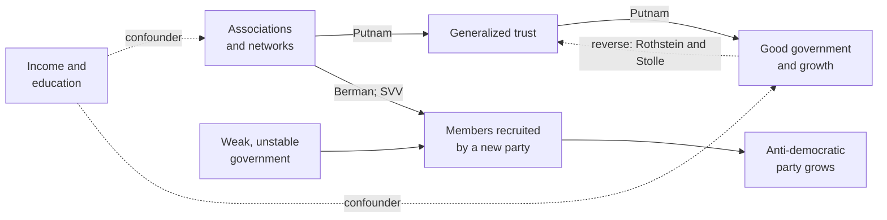

# Social Theory · Lesson 6.4: Social capital on trial

> ⏱ ~15 min · Module 6: Civil society, rational choice, and social capital · Builds on: [6.3 Social capital: Coleman and Putnam](06-03-social-capital-coleman-and-putnam.md), [1.4 Testing a social explanation](01-04-testing-a-social-explanation.md), [6.1 Tocqueville on associations](06-01-tocqueville-on-associations.md) · Unlocks: [7.1 Classical secularization theory](07-01-classical-secularization-theory.md)

## Why this matters

[6.3](06-03-social-capital-coleman-and-putnam.md) ended with a causal chain: networks of civic engagement breed norms and trust, and trust makes collective action, good government and growth easier. Policy took the chain at its word: if trust is low, build clubs. This lesson puts the chain on trial on four charges, each aimed at a different link. The proxies may not measure the cause. The arrow may run backwards. The American decline may have another cause. And networks may carry harm as readily as good. Putnam's Italian regions stay out of the dock; they are this module's boss problem.

## The idea

**The thesis at full strength.** **[Social capital](../reference.md#social-capital)** in Putnam's sense is networks, norms of reciprocity and *generalized* trust, the trust you extend to people you do not know. The claim is not that clubs are pleasant. It is that repeated contact in horizontal networks makes reputations visible and reciprocity expected ([closure](../reference.md#closure), from [6.2](06-02-rational-choice-sociology.md)), that the trust learned there spreads to strangers, and that a society with more of it solves collective-action problems more cheaply. Its defenders can point to many positive correlations: between trust and growth, membership and health, civic density and government performance.

**Charge 1: measurement.** Two proxies carry most of the literature: a survey question asking whether most people can be trusted or one can't be too careful, and counts of memberships in organizations ([measuring social capital](../reference.md#measuring-social-capital)). Edward Glaeser, David Laibson, José Scheinkman and Christine Soutter ("Measuring Trust", *Quarterly Journal of Economics*, 2000) ran trust experiments alongside the survey. The standard question predicted how *trustworthy* subjects were much better than how *trusting* they were; trusting behaviour was predicted by past trusting behaviour. That is a single study of Harvard undergraduates, but it shows the question may not measure what it is named for. The two proxies also come apart. Stephen Knack and Philip Keefer (*QJE*, 1997), across 29 market economies, found that trust and civic norms went with economic performance, while memberships in formal groups, Putnam's measure, went with neither trust nor performance.

**Charge 2: direction.** A correlation between trust and good outcomes is what the thesis predicts. It is also what **[reverse causation](../reference.md#reverse-causation)** predicts: honest officials and rising incomes may teach people that strangers can be trusted. Knack and Keefer found trust higher in richer, more equal and better-educated nations, and in those whose institutions restrain predatory executives. Bo Rothstein and Dietlind Stolle (*Comparative Politics*, 2008) make this a rival theory: generalized trust grows from effective, impartial and fair street-level bureaucracies, because how officials treat you tells you how far others can be trusted. On their account the state makes trust, not the other way round.

**Charge 3: the cause of decline.** Putnam's *Bowling Alone* (2000) explains the American fall in joining from the bottom up. His own rough accounting gives about half of it to generational replacement, as civic cohorts born early in the century die and less civic ones replace them, and perhaps a quarter to television, with suburban sprawl and pressures of time and money behind. Theda Skocpol (*Diminished Democracy: From Membership to Management in American Civic Life*, 2003) explains it from the top down: **[membership to management](../reference.md#membership-to-management)**. From the late nineteenth century to the mid-twentieth, American civic life was dominated by cross-class membership federations (the Masons, the Odd Fellows, the PTA) with local chapters and a ladder from chapter officer to national office. From the 1960s, educated elites moved their energy into professionally managed advocacy groups that want donors' cheques, not members' meetings.

**Charge 4: the sign.** Alejandro Portes ("Social Capital: Its Origins and Applications in Modern Sociology", *Annual Review of Sociology*, 1998) listed four negative consequences of the same mechanisms: exclusion of outsiders, excess claims on group members, restrictions on individual freedoms, and downward leveling norms ([dark side of social capital](../reference.md#dark-side-of-social-capital)). His examples of exclusion include the New York diamond trade, the very closure Coleman admired in 6.3. The political version of the charge is Weimar Germany (Example 2).

## Source

Tocqueville anticipated the fourth charge. From Vol. 1, ch. 12, "Political Associations in the United States" (Reeve):

> The greater part of Europeans look upon an association as a weapon which is to be hastily fashioned, and immediately tried in the conflict. A society is formed for discussion, but the idea of impending action prevails in the minds of those who constitute it: it is, in fact, an army [...] In Europe there are numerous parties so diametrically opposed to the majority that they can never hope to acquire its support, and at the same time they think that they are sufficiently strong in themselves to struggle and to defend their cause. When a party of this kind forms an association, its object is, not to conquer, but to fight. [...] The exercise of the right of association becomes dangerous in proportion to the impossibility which excludes great parties from acquiring the majority.

Read closely. The danger is not in association as such: the right that is safe in America makes "an army" in Europe. The variable is a relation between an association and the political system, namely whether its members can hope to win a majority by persuasion, and "in proportion to" makes it a matter of degree. This is a **conditional** claim, and it concerns *political* associations. [6.1](06-01-tocqueville-on-associations.md) showed that Tocqueville thought habits pass between political and civil association; Example 2 asks whether the same condition governs choirs and gymnastics clubs.

## The argument

Putnam's thesis in general form (paraphrasing *Making Democracy Work* and *Bowling Alone*):

1. **(Networks)** Associations bring people into repeated, horizontal contact.
2. **(Norms)** Repeated contact under closure builds norms of reciprocity and reliable reputations inside the network.
3. **(Generalization)** Trust learned inside networks extends to people at large.
4. **(Collective action)** Generalized trust lowers the cost of cooperating, and of watching and pressing government.
5. **(Outcome)** So places with denser networks get better government and economic performance.

∴ **C.** Social capital causes good collective outcomes, and its decline threatens them.

*In words:* clubs make trusting citizens, and trusting citizens make institutions work.

**What kind of explanation.** Causal, with a stated mechanism (premises 2 to 4), so not a bare benefit claim of the kind [1.2](01-02-functional-explanation-and-its-critics.md) rejects. But its variables are usually measured for whole places, so it is tested on aggregates, and reading a regional correlation as a claim about joiners risks the **[ecological fallacy](../reference.md#ecological-fallacy)** of [1.4](01-04-testing-a-social-explanation.md).

**What each charge attacks.** Measurement attacks the evidence for premises 1 and 3. Reverse causation denies that premise 5's correlation comes from premises 1 to 4. Skocpol leaves most of the chain alone and disputes why premise 1's networks shrank. The dark side attacks premises 3 and 4: in-group trust need not generalize, and cooperation can serve any end.

**Where the argument is weakest.** Premise 3. Everything downstream needs trust in strangers, but premise 2's mechanism produces trust in *known* people with reputations at stake. A critic (Rothstein and Stolle press this) says the step is never explained: networks can be held together by distrust of outsiders, and generalized trust comes from elsewhere, from the fairness of institutions. A defender replies with **[bonding and bridging](../reference.md#bonding-and-bridging)**: bridging networks, which cross social lines, are the ones that should generalize, so the thesis itself predicts dark-side cases where bonding dominates. Whether that reply refines the thesis or shields it depends on whether bridging can be measured before the outcome is known.

## The evidence

*Solid arrows are the thesis and its Weimar variant; dashed arrows are rivals that would produce the same correlations. SVV is Satyanath, Voigtländer and Voth. The same networks can feed good government or a party's growth, and the arrow from weak government is the condition the Source names.*

## Worked examples

**Example 1 (the theory explaining a real case): trust and growth.** Knack and Keefer's high-trust countries performed better economically. Run the thesis: trust lowers the cost of contracting and monitoring (premise 4), so trusting societies invest and grow. Reverse causation predicts the same cross-country pattern, with growth and good institutions producing trust. What breaks the tie is a measure of trust fixed before the outcome and not shaped by it.

Yann Algan and Pierre Cahuc ("Inherited Trust and Growth", *American Economic Review*, 2010) built one. The trust of descendants of US immigrants varies with their forebears' country of origin and with when those forebears arrived. A descendant's trust, formed in the United States, cannot be raised by later growth in the old country, so it serves as a time-varying measure of the trust each country passed on. With fixed effects for each country, they found a sizeable effect of inherited trust on growth during the twentieth century.

*Evidence strength:* one well-designed, widely cited study. It closes the reverse path but not **[confounding](../reference.md#confounding)**: whatever else descendants inherit along with trust, attitudes to work or to the state, rides along. Note also what it leaves untouched. It tests premises 4 and 5, from trust to growth. It says nothing on premises 1 to 3, whether associations make trust.

**Example 2 (where it strains): Weimar Germany.** An older "mass society" reading held that the Nazis recruited isolated, uprooted people. Sheri Berman ("Civil Society and the Collapse of the Weimar Republic", *World Politics*, 1997) argued the opposite: a robust civil society helped scuttle Weimar democracy, and under some political conditions associationism and democratic stability can be inversely related. Her evidence is historical narrative, which cannot rule out the reverse counterfactual, that without its clubs Weimar would have fallen sooner.

Shanker Satyanath, Nico Voigtländer and Hans-Joachim Voth ("Bowling for Fascism", *Journal of Political Economy*, 2017) collected association counts for 229 German towns. Towns with one standard deviation higher association density saw at least 15 percent faster entry into the Nazi Party, and every kind of club predicted it, from veterans' associations to animal breeders and choirs. In federal states with more stable governments, density was not associated with faster entry. *Evidence strength:* one quantitative study, consistent with Berman's narrative.

Run the thesis. Premises 1 and 2 held: club ties let the party's message travel and let members vouch for it. Premises 3 and 4 failed. The cooperation clubs made possible was put to an anti-democratic end. The bonding defence strains, since every kind of club predicted entry. What fits Berman, the stable-state result and the Source is a conditional thesis: networks amplify whatever the political system channels into them. Whether that refines Putnam or refutes him is the open question.

## Watch out

- **You might think a trust-and-growth correlation shows that trust causes growth, but actually reverse causation predicts the same correlation.** What discriminates is a measure fixed before the outcome (Example 1).
- **You might think Skocpol denies that social capital matters, but actually she disputes where its decline came from.** She offers a different *kind* of explanation of the same trend, running through organizations rather than individuals' dispositions, and leaves premises 2 to 5 largely alone.
- **You might think Weimar shows that associations are bad for democracy, but actually "club networks sped a party's growth" is an explanatory claim, and a conditional one.** Whether a dense associational life is good is evaluative, not argued here ([`political-philosophy`](../../political-philosophy/syllabus.md)).

## One-liner

> The social-capital thesis faces one charge per link: its proxies may measure the wrong thing, its correlations can run backwards, the American decline may come from organizations rather than individuals, and its networks can carry a party to power as readily as they make democracy work.

## Problems

**P1 (🟡) *(Exegetical (a) · Evaluative (b).)*** Evaluate against evidence. Satyanath, Voigtländer and Voth (Example 2) counted associations in 229 towns from surviving city directories of the 1920s, taking the directory closest to 1925 and leaving out political and religious associations. The outcome is entry into the Nazi Party between 1925, when the party's ban was lifted, and January 1933, from a sample of party membership records. As a further check, they used each town's association density in the 1860s, which they trace to how restrictions on associations were dismantled locally after the 1848 revolution, as an instrument for 1920s density.

(a) State the reverse-causation worry for this study, and name the design feature that most directly answers it. Two sentences.

(b) Name one threat the design leaves open. Then say whether the study answers the counterfactual that Berman's narrative could not rule out (without its clubs, Weimar would have fallen sooner). 120 words or fewer.

**P2 (🟡) *(Exegetical (a) · Evaluative (b).)*** Find the crux. Putnam and Skocpol agree that Americans joined far fewer chapter-based organizations after the 1960s.

(a) Name the single premise about where the decline originated that one affirms and the other denies, and say what kind of explanation each offers in Module 1's terms. Two sentences.

(b) Suppose two findings held: (i) informal socializing that no organization arranges, such as having friends to dinner, fell as steeply as federation membership; (ii) within the same birth cohort, joining fell after the 1960s mainly in organizations that turned from chapter-based federations into staff-led advocacy groups. Say which account each finding favors and why, and whether either would be decisive. 100 words or fewer.

**P3 (🔴, optional) *(Exegetical (a)-(b).)*** Diagnose. An **invented** op-ed in a regional paper about the invented town of Haverlea, not the words of any real person or body:

> "Haverlea ranks near the bottom of the county on the trust survey, and near the top for complaints the town hall never answers. The cure is obvious. The council should fund new clubs, since towns with more clubs trust more and are governed better. Any club will do: a choir builds trust as surely as a civic league."

(a) Name two causal assumptions the op-ed makes without arguing for them, using this lesson's charges. One sentence each.

(b) The op-ed's own facts suggest a rival reading of Haverlea. State it in one sentence and name whose theory it is.

Solutions

**P1** *(Exegetical (a) — strict · Evaluative (b) — any verdict)*

**Must hit, strict (a):**

- The worry: the party's rise produced the clubs, rather than the clubs speeding the party's rise, for example Nazi activists founding or filling associations, so that high density would be an effect of the movement.
- The answer: timing. Association density is measured around 1925, before nearly all of the party entry that forms the outcome, and a later outcome cannot cause an earlier count. Credit the 1860s instrument as a second answer, since that density was fixed generations before the party existed.

**Must hit, any verdict (b):**

- One open threat, correctly named. **Confounding:** a town trait that raised both club life and Nazi entry, such as a large Protestant middle class or a strong nationalist milieu. **Exclusion restriction:** 1860s association life might affect 1920s Nazi entry through some channel other than 1920s club density, such as a persisting local political culture. **Measurement:** clubs counted, not members. **Sample:** only towns whose directories survived.
- On the counterfactual: the study compares towns within one national crisis, so it shows that clubs sped the party's *local* growth. Whether Weimar as a whole would have lasted longer with fewer clubs is a national counterfactual that a town-level comparison does not settle, because fewer clubs might also have weakened the forces defending the republic. Accept "it answers it" if the answer argues that faster local recruitment is what national collapse was made of.

**Wrong turns:** calling a confounder "reverse causation"; treating the instrument as removing all bias without stating what it must assume; concluding that associations are bad for democracy (evaluative, and the stable-state result makes the finding conditional).

**Model answer (b), one of several:** Confounding remains. A town's Protestant middle-class milieu could have filled its directory with clubs *and* made it receptive to the party, and the 1860s instrument helps only if 1860s associational life affected Nazi entry solely through 1920s clubs. A persisting local political culture would break that. On Berman's counterfactual the study helps but does not settle it. It shows that clubs were channels of recruitment, since density sped entry town by town. But a national counterfactual is not a town comparison: with fewer clubs the republic's defenders might also have been weaker. The study answers "did networks help the party?", not "did networks shorten the republic's life?"

---

**P2** *(Exegetical (a) — strict · Evaluative (b) — any verdict)*

**Accept (a):** any classification of Skocpol that locates her cause in the organizations on offer and the choices of elites who build them, whether called institutional, organizational, holist in the explanatory sense, or individualist about elites.

**Must hit, strict (a):**

- The crux is whether the decline originated in ordinary Americans' declining disposition to join (Putnam: demand, changing cohort by cohort) or in the changed supply of organizations asking them to join (Skocpol: elites stopped building membership federations).
- Putnam's is explanatory individualist in shape: a macro trend as the sum of individual dispositions, changed by cohort replacement and television. Skocpol's runs through organizational forms and elite strategy, top-down.

**Must hit, any verdict (b):**

- (i) favors Putnam. A fall in sociability that no organization supplies is hard for a supply-side account to explain and fits a change in dispositions.
- (ii) favors Skocpol. A fall *within* a cohort, concentrated where the organization changed, is not generational replacement, and it tracks supply.
- Neither is decisive. (i) could share a common cause with the fall in membership without that cause being dispositional, or federations may themselves have sustained informal sociability. (ii) could be selection, if the groups that converted were the ones already losing members.

**Wrong turns:** stating the crux as "whether social capital matters", which both accept; treating TV as Skocpol's cause; reading (ii) as favoring Putnam because joining fell.

**Model answer (b), one of several:** Finding (i) favors Putnam: if dinners with friends fell as steeply as lodge membership, the cause looks like a change in people, not in organizations, since no federation organized those dinners. Finding (ii) favors Skocpol: a fall within one cohort cannot be generational replacement, and its concentration where federations turned into staff-led groups tracks supply. Neither decides it. Federations may have anchored informal sociability, so their decline could explain (i). And groups that converted may have been those already losing members, making (ii) a selection effect.

---

**P3** *(Exegetical (a)-(b) — strict)*

**Accept (a):** any two of the three assumptions below, each tied to its charge.

**Must hit, strict (a):**

- **Direction:** it assumes clubs cause trust and good government, ignoring reverse causation, in which poor government causes low trust (charge 2).
- **Sign, or generalization:** it assumes any association builds generalized trust, ignoring bonding versus bridging and the dark side; networks can build in-group trust only, or serve exclusionary ends (charge 4, premise 3).
- Also creditable, **measurement:** it treats the survey answer as measuring trust, which Glaeser and colleagues question (charge 1).

**Must hit, strict (b):**

- Rothstein and Stolle's institutional theory: unanswered complaints are a failing street-level administration, and citizens treated badly by officials learn that others cannot be trusted. So the low trust may be an *effect* of the town hall, and the remedy would be fixing the administration, not funding choirs.

**Wrong turns:** answering (a) with a verdict ("clubs don't work") instead of naming assumptions; citing Skocpol in (b) (hers is an account of national decline, not of a town's low trust).

**Model answer (b):** On Rothstein and Stolle's institutional theory, Haverlea's unanswered complaints may be why its residents distrust others, so the arrow runs from the town hall to trust, not from missing clubs.

## Flashback

**From Lesson [6.2](06-02-rational-choice-sociology.md) (Rational-choice sociology):** *(Formal (a) · Exegetical (b).)* Invented numbers. Two households on the same street swap evening childcare: each week each household either takes its turn minding the other's children (cooperate) or skips it (defect). Stage payoffs: $T = 10$, $R = 7$, $P = 3$, $S = 0$. Both use grim trigger, and both discount next week by $\delta = 0.5$.

(a) Compute $\delta^*$ and say whether cooperation holds. Then a paid babysitting service opens nearby, so after a breakdown each household can buy care: the mutual-defection payoff rises to $P = 5$, and no other payoff changes. Recompute $\delta^*$ and the verdict, and say in one sentence why a better fallback makes cooperation harder.

(b) In Coleman's boat, which arrow does the opening of the service belong to, and which arrow does this two-household model leave out if the thing to be explained is the street's childcare-swapping norm dying out? Two sentences.

Solution

**Worked arithmetic (a):**

Before the service:

$$\delta^* = \frac{T-R}{T-P} = \frac{10-7}{10-3} = \frac{3}{7} \approx 0.43.$$

At $\delta = 0.5$: cooperating is worth $7/0.5 = 14$; defecting is worth $10 + 0.5 \cdot 3/0.5 = 13$. **Cooperation holds.**

After the service:

$$\delta^* = \frac{10-7}{10-5} = \frac{3}{5} = 0.6.$$

At $\delta = 0.5$: cooperating is still worth 14; defecting is now worth $10 + 0.5 \cdot 5/0.5 = 15$. **Cooperation fails.**

Why: the one-time gain $T - R = 3$ is unchanged, but the permanent loss that punishes it, $R - P$, shrinks from 4 to 2, so the threat to stop cooperating is worth less and only more patient households are deterred.

**Must hit, strict (b):**

- The service's opening is arrow 1, macro to micro: a change in the households' situation alters their options, here the payoff after a breakdown.
- The model supplies only arrow 2, one pair's choice. Arrow 3, micro to macro, is missing: how many pairs' choices add up to the street-level norm ending (households differ in patience, so some pairs may keep swapping while others stop, and whether the shared expectation survives is a further question).

**Wrong turns:** changing $R$ or $T$ along with $P$; placing the service under arrow 2 because households "choose" to use it (the choice is arrow 2; the new option is arrow 1); reading (a) as showing that markets destroy social capital, when it shows one mechanism under invented numbers, and whether it operates is an empirical question of the kind this lesson puts on trial.

**Model answer:** (a) $\delta^* = 3/7$, so at $\delta = 0.5$ cooperation holds (14 against 13); with $P = 5$, $\delta^* = 3/5$ and it fails (14 against 15), because a better fallback shrinks the loss that punishes defection. (b) The service enters through arrow 1, changing each household's situation; the two-player model is arrow 2 only and says nothing about arrow 3, how pairwise breakdowns add up to the end of a street's norm.

## Connections

- **Backward:** the thesis on trial is [6.3](06-03-social-capital-coleman-and-putnam.md)'s; premise 2's mechanism is [6.2](06-02-rational-choice-sociology.md)'s closure and repeated-game enforcement; the Source extends [6.1](06-01-tocqueville-on-associations.md)'s Tocqueville to the dangers of association; comparison, confounding and the ecological fallacy are [1.4](01-04-testing-a-social-explanation.md)'s; the individualist reading of Putnam's decline is [1.1](01-01-individuals-and-social-facts.md)'s vocabulary.
- **Forward:** Module 7 asks the same questions about religion, starting with [7.1](07-01-classical-secularization-theory.md). Does attendance measure belief, and which way do the arrows between religion and modernity run? [7.2](07-02-critics-and-rival-models.md)'s believing without belonging is a measurement charge against attendance counts, much as charge 1 is against membership counts.
- **Sideways:** reverse causation is the simultaneity of [`econometrics` 3.5](../../econometrics/lessons/03-05-measurement-error-and-simultaneity.md), and the exclusion restriction behind the 1860s instrument is [`econometrics` 3.6](../../econometrics/lessons/03-06-instrumental-variables.md). Weimar's party system as polarized pluralism is [`political-institutions` 4.4](../../political-institutions/lessons/04-04-party-systems.md), and democratic breakdown more broadly belongs to [`comparative-politics`](../../comparative-politics/syllabus.md). Associations as a check on the majority, Tocqueville the political theorist's question, are [`history-of-political-thought` 6.3](../../history-of-political-thought/lessons/06-03-tocqueville-tyranny-of-the-majority-and-soft-despotism.md)'s.
