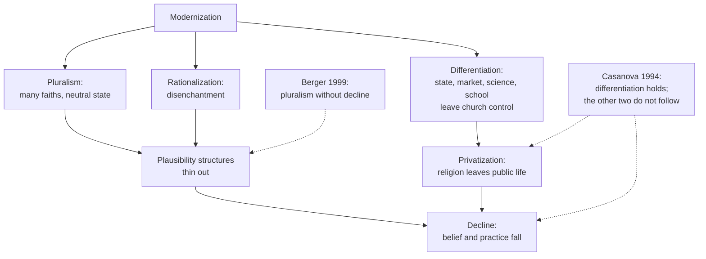

# Social Theory · Lesson 7.1: Classical secularization theory

> ⏱ ~15 min · Module 7: The secularization debate · Builds on: [4.4 Bureaucracy, rationalization, and disenchantment](04-04-bureaucracy-rationalization-and-disenchantment.md), [3.3 Religion as social: *The Elementary Forms*](03-03-religion-as-social-the-elementary-forms.md), [1.4 Testing a social explanation](01-04-testing-a-social-explanation.md) · Unlocks: [7.2 Critics and rival models](07-02-critics-and-rival-models.md), [7.3 Taylor's *A Secular Age*](07-03-taylors-a-secular-age.md)

## Why this matters

For much of the twentieth century, "modern societies become less religious" was a background assumption of social science, until Peter Berger, who had given it its most widely read theoretical form, publicly withdrew it. Before asking whether the theory failed ([7.2](07-02-critics-and-rival-models.md)), you need to know what it claimed. "Secularization" packs three claims that can come apart, and separating them is this module's most useful tool.

## The idea

Picture an early-modern European parish that registers births, marriages and deaths, teaches the catechism, distributes poor relief, and sets the calendar by its feasts. Three centuries later the state registers, the public school teaches and the welfare office pays. Three quite different things may have happened:

1. **Differentiation.** Tasks the church once performed have moved to specialized secular institutions (state, market, science, school), each run by its own rules.
2. **Decline.** Fewer people believe, pray or attend.
3. **Privatization.** Religion survives, but withdraws from public life into the home and the conscience.

The classical [secularization thesis](../reference.md#secularization-thesis) held that modernization produces all three, and that they hang together. José Casanova (*Public Religions in the Modern World*, 1994) argued that they are logically separate claims, to be tested separately: [Casanova's three claims](../reference.md#casanovas-three-claims). Now the theorists.

**Weber supplied two roots.** The first is [disenchantment](../reference.md#disenchantment) ([4.4](04-04-bureaucracy-rationalization-and-disenchantment.md)): the belief that no mysterious, incalculable powers are in principle at work, so everything can be mastered by calculation. The second is differentiation. In the "Intermediate Reflection" (*Zwischenbetrachtung*, 1915, revised for his collected essays in the sociology of religion, 1920), Weber argued that the economy, politics, art, erotic love and science each develop their own internal laws (*Eigengesetzlichkeit*). Each clashes with a religious ethic of brotherliness that would govern them all: the [value spheres](../reference.md#value-spheres). Durkheim added a third root, the sense that the old gods are dying and new ones are not yet born ([3.3](03-03-religion-as-social-the-elementary-forms.md)).

**Berger: plausibility.** In *The Sacred Canopy* (1967) Berger argued that every society builds a meaningful order, and religion legitimates it by grounding it in a sacred cosmos: a canopy over the whole society. A world of meaning stays real only while a community keeps confirming it, by sharing it, talking in its terms and acting it out. That confirming community is a [plausibility structure](../reference.md#plausibility-structures). Secularization, for Berger, is the removal of sectors of society and culture from the domination of religious institutions and symbols, both in institutions and in consciousness. His key mechanism is **pluralism**. When many faiths coexist under a state that favours none, no faith has the whole society behind it. Each becomes one option in a market, and belief loses its taken-for-granted status.

**Wilson and Bruce: social significance.** Bryan Wilson (*Religion in Secular Society*, 1966) defined secularization as religious thinking, practice and institutions *losing social significance*. That is a claim about the social system, compatible with private belief. Steve Bruce (*God Is Dead: Secularization in the West*, 2002) assembled the mechanisms into what he calls the secularization paradigm and drew its strongest prediction: in the West, religion ends not in militant atheism but in indifference, as each generation is a little less committed than its parents. He limits the claim to the West, and he names conditions under which religion keeps a public role in modern societies: [cultural defence and cultural transition](../reference.md#cultural-defence-and-cultural-transition). In cultural defence, religion carries a group's identity against an outside power. In cultural transition, it helps migrants through a new society.

**Casanova: unbundling.** Casanova kept differentiation as the defensible core and denied that decline or privatization follow from it. His evidence was the [deprivatization](../reference.md#deprivatization) of religion in the 1980s: five cases in four countries (Spain, Poland, Brazil, and the United States, evangelical and Catholic) where religion re-entered public life in a differentiated world.

Two cases from church history get a sentence each. The confessionalization thesis of Wolfgang Reinhard and Heinz Schilling ([church-history 6.2](../../church-history/lessons/06-02-reformations-beyond-wittenberg.md)) has early-modern churches and rulers jointly catechizing and disciplining subjects, a stage toward the absolutist and eventually the welfare state. That makes confessional discipline a candidate *precondition* of differentiation, since the machinery that later took over the church's tasks was first built with the churches. The French Revolution ([church-history 8.1](../../church-history/lessons/08-01-enlightenment-revolution-and-napoleon.md)) is the best case for separating Casanova's claims: it differentiated hard (church property nationalized in 1789), tried to force decline (dechristianization, 1793–94), and never privatized, because it staged public civic cults and the Concordat of 1801 restored public Catholic worship.

## Source

Weber, "Science as a Vocation" (*Wissenschaft als Beruf*, lecture of 1917, published 1919), near its end. My translation from the 1919 German text:

> It is the fate of our time, with its own rationalization and intellectualization and above all the disenchantment of the world, that precisely the ultimate and most sublime values have withdrawn from public life, either into the otherworldly realm of mystical life or into the brotherliness of direct relations between individuals. It is no accident that our greatest art is intimate and not monumental, nor that today only within the smallest circles of community, from person to person, in pianissimo, something pulses that corresponds to what once swept through the great congregations like a storm of fire as prophetic pneuma and welded them together.

Read it closely:

- "**Withdrawn from public life**" (*zurückgetreten aus der Öffentlichkeit*) says *where* the highest values live: privatization, not extinction.
- **Both destinations are still religious or near it**, and "**something pulses**" there: quieter and narrower, not gone.
- "**The fate of our time**" ties the retreat to rationalization, which links privatization to the disenchantment of [4.4](04-04-bureaucracy-rationalization-and-disenchantment.md).

Whether Weber also predicts decline is P1.

## The argument

**The classical theory (exegetical reconstruction, synthesizing Wilson, Berger 1967 and Bruce).**

1. **P1 Differentiation.** Modernization moves education, welfare, law, health care and record-keeping from religious to specialized secular institutions, each run on its own criteria. *In words:* religion loses its jobs.
2. **P2 Societalization.** Life comes to be organized in large, impersonal systems, not in local communities whose shared rites expressed and reinforced shared belief. (Wilson's term, which Bruce adopts.)
3. **P3 Rationalization.** Science and technique reduce the occasions on which people turn to supernatural means to get things done.
4. **P4 Pluralism.** When several faiths coexist under a state that favours none, no faith has the whole society's backing, and each loses its taken-for-granted status.
5. **P5 Plausibility.** Beliefs whose plausibility structure has thinned become choices. They are held with less certainty and passed on less reliably to children.
6. **∴ C1** Religion loses social significance: public institutions run without it (Wilson's sense; privatization).
7. **∴ C2** Over generations, belief and practice decline, ending in the West in indifference (Bruce).

**What kind of explanation this is.** The causes are structural and the outcome is an aggregate rate, so it is explanatorily holist ([1.1](01-01-individuals-and-social-facts.md)). Its best versions, though, run through individuals: structure changes the conditions of belief (P4), individuals hold and transmit belief differently (P5), and the rate falls. That is the macro-micro-macro shape of [Coleman's boat](../reference.md#colemans-boat) ([6.2](06-02-rational-choice-sociology.md)). P1 is functional in [1.2](01-02-functional-explanation-and-its-critics.md)'s sense: once secular [functional equivalents](../reference.md#functional-equivalents) do religion's tasks, practice loses a support. P5 is interpretive ([1.3](01-03-understanding-webers-interpretive-method.md)), because it explains belief by how secure its meaning feels to the believer. The test ([1.4](01-04-testing-a-social-explanation.md)) is comparison: more differentiated and pluralist societies, and later cohorts within them, should be less religious.

**The truth question, flagged.** If belief depends on a plausibility structure, does that count against it? The premise is symmetric: secular convictions need a social base too (Berger 1999 points to Western universities as one). Whether *how* a belief is held bears on whether it is *true* is the [genetic-fallacy question](../reference.md#genetic-fallacy-question). It has the same shape as the birthplace argument in [philosophy-of-religion 5.5](../../philosophy-of-religion/lessons/05-05-religious-diversity.md), and [philosophy-of-religion](../../philosophy-of-religion/syllabus.md) owns it. This course does not settle it.

**Where the argument is weakest.** Critics attack P4–P5 and the step from C1 to C2. The religious-economies school ([7.2](07-02-critics-and-rival-models.md)) argues that pluralism *raises* religiosity, since competing churches work harder for members, and points to the modern, pluralist, highly religious United States. Casanova attacks the step itself: differentiation does not entail decline or privatization. And in *The Desecularization of the World* (1999) Berger withdrew the general prediction. With the exceptions of Western and Central Europe and an international elite educated in Western universities, he judged the world as religious as it had ever been, and in places more so: modernization had provoked counter-secularization as well as secularization. **Evidence strength:** the decline of church attendance and belief across most of Western Europe over the twentieth century is well documented and not in dispute. Whether modernization causes it, and whether the pattern generalizes beyond Europe, is contested; that is 7.2.

## The explanation

## Worked examples

**Example 1 (the clean case: Quebec's Quiet Revolution).** Until 1960 the Catholic Church ran most of Quebec's schools, hospitals and welfare institutions. The province had even abolished its Ministry of Public Instruction in 1875 under Church pressure. After Jean Lesage's Liberals won in June 1960, the province brought in hospital insurance (1961), set up the Parent Commission on education (1961) and created a Ministry of Education (1964). Run the premises:

- **P1:** textbook differentiation, inside a decade. Many nuns left their orders and did the same jobs for the state as lay employees.
- **P2, P4:** French-Canadian identity, long carried by the Church, was recast as a Québécois nationalism carried by the provincial state. Religious practice fell steeply, and Quebec went from the highest provincial birth rate in 1960 to the lowest in 1970.
- **Bruce's exception explains the timing:** while the Church carried the nation's identity against an English-speaking majority (cultural defence), it kept its public role. Once the state took that job, the defence function went, and practice followed.
- **Sequence:** differentiation first, decline after, as the theory predicts.

Caveat: one case, and the Second Vatican Council (1962–65) landed in the same years, a confound ([1.4](01-04-testing-a-social-explanation.md)).

**Example 2 (where it strains: Poland, 1978–89).** Communist Poland urbanized and industrialized fast, and the state imposed differentiation by force, taking schooling, welfare and public life away from the Church. The classical theory predicts decline and privatization. Instead the Church became *more* public: the archbishop of Kraków was elected Pope John Paul II in October 1978 and made a pilgrimage home in June 1979, and the Solidarity movement emerged in 1980 with the Church beside it. There are two readings:

- **Classical (Bruce):** cultural defence. Religion carried national identity against a regime seen as imposed from outside. This reading predicts that the public role fades once the threat is gone.
- **Casanova:** deprivatization. Poland is one of his five cases. Religion entered the public sphere of a differentiated society, which shows that privatization was never entailed.

**The crux:** does the Church's public role depend on the external threat? The test is what happened after 1989, but any later change coincides with EU accession, emigration and generational turnover: confounding again.

## Watch out

- **You might think secularization theory predicts that religion will disappear, but actually** its classical versions claim less, and they differ. Weber describes relocation (the Source). Wilson describes loss of social significance, which is compatible with private belief. Bruce predicts indifference, and only for the West.
- **You might think evidence of differentiation is evidence of decline, but actually** they are separate claims, each needing its own evidence: legal and institutional records for differentiation, surveys and attendance counts for decline, and the conduct of public life for privatization. A law closing monasteries tells you about the state, not about belief.
- **You might think that if the theory is true it shows religion false (or its failure shows religion true), but actually** it explains the social conditions of belief. Moving from there to truth confuses an explanatory claim with an evaluative one.

## One-liner

> "Secularization" bundles three claims (religion loses its jobs, loses believers, loses its public voice). The classical theory said modernization brings all three; the debate since is over whether the second and third really follow from the first.

## Problems

**P1 (🟢) *(Exegetical (a)–(b).)*** Close reading. Weber continues straight after the Source (my translation):

> Whoever cannot bear this fate of the age like a man must be told: let him rather return, silently, without the usual public advertisement of the renegade, but plainly and simply, into the arms of the old churches, opened wide and mercifully. They do not make it hard for him. Somehow, in doing so, he must (this is unavoidable) make the "sacrifice of the intellect", one way or another. We shall not reproach him for it if he really can do it.

(a) Read with the Source: which of Casanova's three claims does Weber assert, and does he predict that religion will disappear? Name the words that decide it. Two sentences. (b) "He must make the sacrifice of the intellect": as Weber makes it, is this an exegetical, explanatory or evaluative claim in this course's sense, and which course owns the question of whether it is correct? Two sentences.

**P2 (🟡) *(Exegetical (a) · Evaluative (b).)*** Turkey, 1924–1937. In 1924 the Grand National Assembly abolished the caliphate and set up a Directorate of Religious Affairs (the Diyanet), which supervises all mosques, trains imams, employs them as civil servants and approves the content of religious services. The Sufi lodges were closed in 1925. In 1928 the constitutional clause naming Islam as the state's religion was removed, and in 1937 laicism (*laiklik*) was written into the constitution. (a) For each of Casanova's three claims, say what in this record is evidence for it. Then say what the Diyanet does to a simple reading of "differentiation". (b) An observer concludes: "By 1937 the Turks had become a secular people." Say what evidence that claim would need that the record does not contain, and name one trap in getting it. 120 words or fewer for (b).

**P3 (🔴, optional) *(Exegetical (a) · Evaluative (b).)*** Find the crux. Berger in 1967 and Berger in 1999 agree that modernization differentiates and pluralizes. (a) Which premise of the lesson's reconstruction does Berger 1999 deny, and what does he keep? Two sentences. (b) Say what each Berger predicts for a society that rapidly becomes more religiously plural. Then name one comparison that would discriminate between them, and one confound it must handle. 120 words or fewer.

Solutions

**P1** *(Exegetical (a)–(b), strict)*

**Must hit, strict (a):**

- **Privatization.** The values have "withdrawn from public life" into mysticism and private brotherliness, as a consequence of disenchantment.
- **No prediction of disappearance.** The old churches still stand "opened wide" and take back those who return, and "they do not make it hard for him."
- Partial credit for a reading of decline confined to the intellectual stratum Weber addresses ("whoever cannot bear"), if it notes that he says nothing about the churches emptying.

**Must hit, strict (b):**

- Evaluative. It is Weber's judgment about what religious belief costs an intellectually honest modern person, not a sociological finding about a rate or an institution.
- This course reports it exegetically. Whether belief requires such a sacrifice belongs to philosophy-of-religion (evidentialism in 5.1, fideism in 5.4).

**Wrong turns:** reading "withdrawn" as "died out". Treating "sacrifice of the intellect" as an explanatory claim that Weber tested, or arguing for or against it instead of classifying it.

**Model answer:** (a) Weber asserts privatization: the highest values have "withdrawn from public life" into mysticism and personal brotherliness, as the fate of a disenchanted age. He does not predict disappearance, since the old churches stand "opened wide" and "do not make it hard" for those who return. (b) As he makes it, it is evaluative: a judgment of what belief costs a modern intellectual, not a finding about society. Whether it is correct is philosophy-of-religion's question, not this course's.

---

**P2** *(Exegetical (a), strict · Evaluative (b), any verdict)*

**Must hit, strict (a):**

- **Differentiation:** the state's legitimacy and law stop resting on religion. The caliphate is abolished, the state-religion clause is removed, and laicism is entered in the constitution.
- **The Diyanet complication:** this is not the separation of autonomous spheres. The state *absorbs* religion into its own bureaucracy, so religion loses its autonomy over the state without the state withdrawing from religion. Differentiation can mean state *control* of religion, not mutual independence.
- **Privatization:** closing the lodges and removing Islam from the constitution push independent religion out of public life. Official Islam, though, stays public and state-run, so this is the privatization of *unofficial* religion, not of religion as such.
- **Decline:** the record contains *no* evidence on belief or practice. Every item is a legal act from above.

**Must hit, any verdict (b):**

- The claim is about **decline** (belief and practice), so it needs evidence on belief and practice: attendance, observance (fasting, prayer), stated belief, ideally broken down by region and class (urban elite versus rural majority), with a pre-1924 baseline.
- Name a trap: **measurement under pressure** (people understate religiosity under a regime that penalizes its public expression); **selection** (sources come from cities and officials); or the **ecological fallacy** (inferring individuals' belief from national policy).

**Wrong turns:** counting the reforms as evidence of decline. Calling the Diyanet "separation of church and state". In (b), arguing that Turks were or were not secular instead of saying what evidence would decide it.

**Model answer (b), one of several:** "Secular people" is a claim about decline, and the record holds only acts of state. It would need evidence on what people believed and did: mosque attendance, fasting in Ramadan, stated belief, broken down by city and countryside and by class, and compared with a baseline from before 1924. The trap is measurement under pressure. Where public religion is policed, people report less piety than they practise, so official sources and surveys from the period would overstate decline.

---

**P3** *(Exegetical (a), strict · Evaluative (b), any verdict)*

**Must hit, strict (a):**

- Berger 1999 denies **P5**, as a general law: that the loss of taken-for-grantedness lowers belief and practice. With it he denies the step to **C2**.
- He keeps **P1** (differentiation) and **P4** (pluralism removes taken-for-grantedness). Modernization changes *how* faith is held, by choice rather than as given, and it provokes counter-secularization as well as secularization. Either "P5" or "the step from P4 to C2" passes.

**Must hit, any verdict (b):**

- **1967 prediction:** belief and practice fall, especially in younger cohorts.
- **1999 prediction:** the level holds, or rises in places, while the mode changes: more switching, more chosen and intense commitment, with some strict or militant movements.
- **Comparison:** regions or countries at similar development that pluralized at different times (through disestablishment or immigration), tracked by cohort, measuring both the level and the mode of belief.
- **Confound:** pluralism tends to arrive with urbanization, immigration and rising incomes, so economic security (7.2) could drive any decline. Reverse causation (a weakening state church lets pluralism in) also passes.

**Wrong turns:** saying Berger 1999 abandoned differentiation. Treating the crux as being about God's existence. Predicting that 1999 means "no change at all", which ignores the change in mode.

**Model answer (b), one of several:** Berger 1967 predicts that as faiths multiply, belief and attendance fall, cohort by cohort. Berger 1999 predicts that the level holds while its mode shifts toward choice, switching and intense commitment. To discriminate, compare regions at similar levels of income that became plural at different dates, for example through disestablishment, following cohorts and measuring both attendance and switching rates. The confound is that pluralism usually arrives with urban growth and rising security, either of which could lower religiosity on its own. The design has to hold them roughly constant.

## Flashback

**From Lesson [6.3](06-03-social-capital-coleman-and-putnam.md) (Social capital: Coleman and Putnam):** *(Exegetical (a) · Evaluative (b).)* Find the crux. In "The Strength of Weak Ties" (*American Journal of Sociology*, 1973), Mark Granovetter reported on professional, technical and managerial workers in Newton, Massachusetts, who had recently changed jobs. Of the 54 who found their new job through a personal contact, 9 saw that contact often, 30 occasionally and 15 rarely (once a year or less). His explanation: your close friends tend to know one another and move in your circles, so they mostly know what you already know, while acquaintances link you to other circles and carry news you would not otherwise hear. A reader concludes: "Granovetter refutes Coleman. Close-knit networks are a handicap, not capital." (a) Using Coleman's forms of social capital and his warning about fungibility, say why the two findings need not conflict, and give Putnam's name for the kind of tie Granovetter praises. Two sentences. (b) Suppose someone reads the 9/30/15 split as showing that weak ties cause better job-finding. Name two things the numbers cannot show, and why. 80 words or fewer.

Solution

**Must hit, strict (a):**

- Closure does its work through obligations and expectations and through norms with effective sanctions: it makes trust and enforcement possible. Granovetter's acquaintances serve a different form, information channels.
- Fungibility: Coleman says a structure that helps one kind of action can be useless for another. A closed circle enforces norms well but mostly recycles news its members already share. The crux is which mechanism the outcome needs, enforcement or new information.
- Putnam's term: **bridging** (ties across social circles), with close-knit circles as bonding. Credit for noting that he treats these as dimensions, not boxes.

**Must hit, any verdict (b):**

- Any two of: **base rate** (people have many more acquaintances than close friends, so most contact-found jobs could come through weak ties even if each weak tie were less useful than a strong one); **no comparison group** (only people who changed jobs, and found them through a contact, are counted, so nothing compares people with many weak ties to people with few); **no outcome measure** (where the job came from is not how good it was); **confounding** (people with many acquaintances may differ in occupation, mobility or seniority).
- For each, say why the table cannot rule it out.

**Wrong turns:** treating weak ties as "low social capital", when Coleman's information form is exactly what they supply; reading the counts as an effect size; declaring Coleman or Granovetter the winner, when the point of (a) is that they explain different outcomes.

**Model answer:** (a) Coleman's closure supplies trust and enforceable norms, while Granovetter's acquaintances supply a different form, information channels, and Coleman warns that a structure good for one action can be useless for another: a closed circle enforces well but repeats what its members already know. In Putnam's terms Granovetter praises bridging ties, and close-knit circles are bonding. (b) First, base rate: most people have far more acquaintances than close friends, so weak ties could deliver most jobs while each one is less useful. Second, there is no comparison: only successful contact-users are counted, so nothing shows that people with more weak ties found jobs more often or found better ones.

## Connections

- **Backward:** P3 is the disenchantment of [4.4](04-04-bureaucracy-rationalization-and-disenchantment.md), and the Source shows Weber drawing privatization from it. Durkheim's dying gods and his functional account of rites ([3.3](03-03-religion-as-social-the-elementary-forms.md)) stand behind P1–P2. The theory's shape is [6.2](06-02-rational-choice-sociology.md)'s macro-micro-macro boat, and its test is [1.4](01-04-testing-a-social-explanation.md)'s comparison.
- **Forward:** [7.2](07-02-critics-and-rival-models.md) puts P4–P5 on trial with religious economies, existential security, believing without belonging and cohort replacement. [7.3](07-03-taylors-a-secular-age.md) asks whether the whole theory is a "subtraction story" that framed the question wrongly.
- **Sideways:** confessionalization is [church-history 6.2](../../church-history/lessons/06-02-reformations-beyond-wittenberg.md), and the Revolution's assault on the Church is [church-history 8.1](../../church-history/lessons/08-01-enlightenment-revolution-and-napoleon.md). Berger's plausibility structures are the sociologist's version of the birthplace argument in [philosophy-of-religion 5.5](../../philosophy-of-religion/lessons/05-05-religious-diversity.md), and whether either one debunks belief is that course's question. Secularism as a theological and church-state question belongs to [catholic-social-teaching](../../catholic-social-teaching/syllabus.md).
