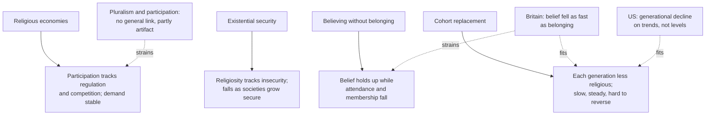

# Social Theory · Lesson 7.2: Critics and rival models

> ⏱ ~15 min · Module 7: The secularization debate · Builds on: [7.1 Classical secularization theory](07-01-classical-secularization-theory.md), [6.2 Rational-choice sociology](06-02-rational-choice-sociology.md), [1.4 Testing a social explanation](01-04-testing-a-social-explanation.md) · Unlocks: [7.3 Taylor's *A Secular Age*](07-03-taylors-a-secular-age.md)

## Why this matters

The classical theory of [7.1](07-01-classical-secularization-theory.md) holds that modernization erodes religion. Its standing embarrassment is the United States, which is rich, modern and far more churchgoing than western Europe. Tocqueville saw it in 1835 (Vol. 1, ch. 17, Reeve): "The philosophers of the eighteenth century explained the gradual decay of religious faith in a very simple manner. … Unfortunately, facts are by no means in accordance with their theory." Since the 1980s four rival models have answered him. This lesson states each at full strength and matches it to the evidence it predicts.

## The idea

**Religious economies: the supply side.** Rodney Stark, Roger Finke and Laurence Iannaccone suppose that the demand for religion is roughly constant across societies. Then differences in religiosity must come from **supply**: how many religious organizations exist and how hard they work. A state church that is subsidized and shielded from rivals is a lazy monopoly whose clergy are paid whether anyone comes or not. A deregulated market forces many firms to court members and specialize. Stark and Iannaccone ("A Supply-Side Reinterpretation of the 'Secularization' of Europe", 1994) read Europe's low participation as a weakness of supply, not a loss of demand, and proposed dropping the concept of secularization for lack of cases. In Iannaccone's "Why Strict Churches Are Strong" (1994), costly rules screen out free riders and raise the participation of those who stay, the collective-goods logic of [6.2](06-02-rational-choice-sociology.md). Card: [religious economies](../reference.md#religious-economies).

**Existential security: the demand side.** Pippa Norris and Ronald Inglehart (*Sacred and Secular*, 2004) make demand the variable. People exposed to poverty, disease and violence without a safety net seek the reassurance religion gives. As societies become secure, that need weakens. On this view the United States is religious for a rich country because it is unusually unequal and its welfare state is thinner than western Europe's. Their twist: secure, secular societies have few children and insecure, religious ones many, so the world can grow more religious even while each rich country secularizes. Card: [existential security](../reference.md#existential-security).

**Believing without belonging: the measure.** Grace Davie ("Believing without Belonging", 1990; *Religion in Britain since 1945*, 1994) argued that in Britain churchgoing and membership had fallen much further than belief. If so, attendance overstates decline: in terms of [Casanova's three claims](../reference.md#casanovas-three-claims), decline of practice need not mean decline of belief. Card: [believing without belonging](../reference.md#believing-without-belonging).

**Cohort replacement: the unit of time.** A population average can move in three ways ([age, period and cohort effects](../reference.md#age-period-and-cohort-effects)). An **age effect** is change over a life, as when people grow more devout as they get older. A **period effect** hits every age group at once, as a war or a scandal would. A **cohort effect** is a difference between generations that each one carries through life. David Voas and Alasdair Crockett ("Religion in Britain: Neither Believing nor Belonging", *Sociology*, 2005) conclude that British decline is generational. Each cohort starts less religious than the last, and the average falls as older cohorts die. Voas and Mark Chaves (2016) apply the same lens to America. They find that its religiosity has been declining for decades by the same generational pattern, so on trends rather than levels the US is no counterexample. Card: [cohort replacement](../reference.md#cohort-replacement).

**What kind of explanation is each?** The religious-economies model is explanatory individualism of the rational-choice kind. Regulation (a macro fact) shapes clergy incentives and believers' options (micro), and their choices add up to a participation rate (macro): Coleman's boat from [6.2](06-02-rational-choice-sociology.md) again. It needs only thin rationality. Existential security is a macro correlation between security and religiosity across countries, backed by an individual-level psychological mechanism. So it faces the [ecological-inference](../reference.md#ecological-fallacy) warning of [1.4](01-04-testing-a-social-explanation.md): secure, secular countries need not contain individuals who are secular *because* they are secure. Believing without belonging is a claim about measurement. Cohort replacement is a demographic mechanism: it says how an aggregate falls, not why each generation passes on less.

## Source

Supply-siders often cite Tocqueville as an ancestor. Here is his own explanation, from Vol. 1, ch. 17, "Principal Causes Which Render Religion Powerful in America" (Reeve):

> Religions, intimately united to the governments of the earth, have been known to exercise a sovereign authority derived from the twofold source of terror and of faith; but when a religion contracts an alliance of this nature, I do not hesitate to affirm that it commits the same error as a man who should sacrifice his future to his present welfare; and in obtaining a power to which it has no claim, it risks that authority which is rightfully its own. […] The Church cannot share the temporal power of the State without being the object of a portion of that animosity which the latter excites. […] They saw that they must renounce their religious influence, if they were to strive for political power; and they chose to give up the support of the State, rather than to share its vicissitudes.

Read it against the supply-side model. Tocqueville shares its variable: the tie between church and state. He nearly shares its premise about demand, too, since a page earlier he writes that "faith is the only permanent state of mankind." His **mechanism**, though, is different. The word that carries it is "animosity": an established church inherits the hostility its government provokes, and "share its vicissitudes" adds that in a democracy, where governments and parties keep changing, a church tied to them shares their instability. Nothing in the passage concerns competition among churches or the effort of subsidized clergy. His American clergy renounce political power; they do not out-market anyone.

So the accounts come apart on a near-monopoly church that stands apart from the government, or against it: Tocqueville predicts strength, the bare supply-side model torpor. Supply-siders can claim his variable, not his mechanism. That is exegesis; whether he was right about faith's permanence is not argued here.

## The argument

The supply-side model, following Stark and Iannaccone (1994) and Finke and Stark (*The Churching of America, 1776–1990*, 1992), paraphrased:

1. **Demand for religion is roughly stable across modern societies.**
2. **Religious organizations behave like firms.** How hard their clergy work depends on whether their income depends on members.
3. **Regulation protects one church.** Where the state funds an established church and burdens its rivals, that church's clergy are paid regardless, and competitors are few.
4. **Monopolies underperform; markets specialize.** A subsidized monopoly works little and serves one slice of tastes, while competing firms work hard and serve many niches. *In words:* pluralism plus competition yields more effort and more variety.
5. **Participation rises with the effort and variety of supply.**

∴ **Religious participation varies with how regulated the religious economy is: it is low where one church is subsidized and protected, and high where many compete. Europe's "secularization" is a failure of supply, not a loss of demand.**

**Kinds of claim.** That this is the model is *exegetical*. Whether participation actually tracks regulation is *explanatory/empirical*, and on the model's key link the evidence is weak. Mark Chaves and Philip Gorski's review ("Religious Pluralism and Religious Participation", 2001) concluded that the evidence does not support a general positive association between pluralism and participation. Voas, Olson and Crockett (2002) showed that many published correlations, positive and negative alike, arise mechanically from how the pluralism index and participation rates are calculated. Whether a free religious market is good is *evaluative*; whether any religion is true is another question, on which explaining churchgoing by supply or insecurity shows nothing. That is the [genetic-fallacy question](../reference.md#genetic-fallacy-question), which belongs to [`philosophy-of-religion`](../../philosophy-of-religion/syllabus.md).

**Where the argument is weakest.** At premise 1. If demand varies, supply loses its monopoly as an explanation, and the critics say it does vary. Norris and Inglehart tie demand to security. Voas and Crockett find British religiosity falling by generation under an unchanged church settlement. The supply-sider's best reply is that supply shapes demand over time: a population long starved of active churches stops wanting them. That reply may be true, but it has a cost. If supply explains participation and also explains demand, the model can absorb almost any outcome, unless it says in advance how long the lag is and how supply is measured independently of the participation it is meant to explain.

## What each model predicts

Solid arrows: predictions. Dashed: evidence from this lesson. Testing existential security against religious economies across countries is the boss problem's job.

## Worked examples

**Example 1 (the model explaining a real case): the churching of America.** Finke and Stark estimate that about 17 percent of Americans were church adherents in 1776 and about 34 percent by 1850. Most of the growth went to two upstart sects, the Methodists and the Baptists, while the colonial establishments, the Congregationalists and Episcopalians, lost ground. The supply-side reading: disestablishment (Massachusetts, the last holdout, ended its establishment in 1833) opened the market, and the upstarts had the bigger sales force, with cheap, numerous, often lay preachers who followed settlers to the frontier.

Audit it with [1.4](01-04-testing-a-social-explanation.md). The figures are reconstructed from membership records, and membership is not attendance: a church that admitted only the converted could be full on Sunday and small on paper. The rival reading is interpretive: the upstarts' plain preaching, lay leadership and emotional conversion fit the egalitarian meanings of the new republic, Tocqueville's equality of conditions ([6.1](06-01-tocqueville-on-associations.md)). The crux is whether the decisive difference lay in the clergy's incentives or in what the message meant to hearers.

**Example 2 (where a model strains): Britain, believing and belonging.** Davie's thesis predicts that belief should hold up while attendance and membership fall. Voas and Crockett tested it on the British Household Panel Survey and British Social Attitudes data. Belief had eroded at the same rate as affiliation and attendance, and it stood *below* nominal belonging: more Britons belonged without believing than the reverse. On transmission, only about half of parents' religiosity passed to their children, while the absence of religion almost always passed on, and believing was transmitted no better than belonging. On these measures belief is not the resilient core. Davie's defender can reply that diffuse spirituality persists where survey questions miss it. That reply stays open only if it names a measure that could show it.

Cohort replacement predicts this. A crude illustration with invented numbers: if 60 percent of one generation is religious and each generation keeps half, the next starts near 30 percent and the one after near 15. No event is needed to explain the decline. But the mechanism leaves the cause open. Why does only half pass on? Weakening plausibility structures ([7.1](07-01-classical-secularization-theory.md)), rising security and weak suppliers each offer an answer. Cohort replacement tells you where to look, at childhood and transmission, not what you will find there.

## Watch out

- **You might think cohort replacement is a fourth cause of secularization, but actually it is a mechanism of aggregation.** It is compatible with several causes of weak transmission. Its real rival is a period account, in which some event moves every age group at once.
- **You might think high American religiosity refutes secularization theory, but actually that depends on levels versus trends and on which claim is meant.** Voas and Chaves argue that the American trend matches Europe's, a generation later. In Casanova's terms, American religion can be vigorous while remaining differentiated from the state.
- **You might think that explaining churchgoing by markets or by insecurity shows religion to be a product or a crutch, but actually both models explain a social rate, and that confuses explanation with evaluation.** Neither says whether what is believed is true, and believer and sceptic can accept either model on equal terms.

## One-liner

> Each rival to classical secularization theory changes one thing: the supply side changes the cause, existential security the mechanism, believing without belonging the measure, and cohort replacement the unit of time. Match each to the pattern it predicts before asking which is true.

## Problems

**P1 (🟢) *(Exegetical (a)–(b).)*** Diagnose. From an invented column in a regional paper about the invented country of Rosvald:

> "(1) Since Rosvald's state church lost its subsidy in 2001, its old parishes have emptied while independent congregations with demanding rules have grown: a sleepy monopoly has finally met competition. (2) Don't mistake empty pews for lost faith; surveys show most Rosvalders still pray and believe in God, though few belong anywhere. (3) And don't expect the young to drift back as they age: each generation here is less religious than the last, and stays that way."

(a) Name the model each numbered sentence assumes. One sentence each. (b) Suppose Rosvald's surveys showed the pattern Voas and Crockett found in Britain. Which two sentences would be in tension, and why? Two sentences.

**P2 (🟡) *(Exegetical (a) · Evaluative (b).)*** Find the crux. The share of Americans reporting no religious preference doubled from 7 to 14 percent in the 1990s. Michael Hout and Claude Fischer ("Why More Americans Have No Religious Preference: Politics and Generations", *American Sociological Review*, 2002) found that the rise was confined to political moderates and liberals, while conservatives' preferences did not change. They read this political part as a symbolic statement against the Religious Right, and found that most of the new "nones" still held conventional beliefs. Voas and Chaves (*American Journal of Sociology*, 2016) argue that American religiosity has been declining for decades because each successive cohort is less religious than the one before. (a) Read as explanations of the 1990s jump, what does each account claim about *who* changed, and what must each deny? Two sentences. (b) What evidence would discriminate between them, and what does the evidence so far support? 150 words or fewer.

**P3 (🔴, optional) *(Exegetical (a) · Evaluative (b).)*** Evaluate against evidence. The territory that became East Germany had been a Lutheran and United Protestant stronghold. From 1955 the East German state promoted the *Jugendweihe*, a socialist coming-of-age ceremony set up as a rival to confirmation, and young people who stayed away faced serious disadvantages. After reunification in 1990 the churches were free, and they came under West Germany's church–state arrangements, including the state-collected church tax. Today every eastern state has a non-religious majority, and the region is among the least religious in the world. (a) What does the religious-economies model predict for religious participation in the east after 1990, and what does cohort replacement predict? Two sentences each. (b) Froese and Pfaff ("Explaining a Religious Anomaly", *Journal for the Scientific Study of Religion*, 2005) grant that eastern Germany's demand for religion has fallen. They argue that interventions in the supply of religion over two centuries caused the fall, not modernization. Does this rescue the supply-side model, or give up its first premise? 150 words or fewer.

Solutions

**P1** *(Exegetical (a)–(b).)*

**Must hit, strict (a):**

- (1) **Religious economies**: deregulation exposes a subsidized monopoly to competition, and strict groups grow (Iannaccone's strictness).
- (2) **Believing without belonging**: belief persists while membership and attendance fall.
- (3) **Cohort replacement**: it denies an age effect ("drift back as they age") and asserts a cohort effect carried through life.

**Must hit, strict (b):**

- Sentences (2) and (3). Voas and Crockett found belief falling generation by generation at the same rate as belonging, and transmitted no better. If (3) holds the way it did in Britain, belief is no stable reservoir, and (2)'s reassurance fails.

**Wrong turns:** reading (1) as evidence for the supply-side model as it stands. The model predicts that *total* participation rises after deregulation, and the sentence reports only a shift of share from old parishes to new congregations. Picking (1) and (3) for (b): nothing in the British pattern bears on deregulation.

**Model answer:** (a) Sentence 1 is the religious-economies model, with Iannaccone's point about strict groups; sentence 2 is believing without belonging; sentence 3 is cohort replacement, rejecting an age effect. (b) Sentences 2 and 3 are in tension. Voas and Crockett found belief declining by generation as fast as belonging, so a generational decline like the one in sentence 3 would erode the belief that sentence 2 counts on.

---

**P2** *(Exegetical (a) · Evaluative (b).)*

**Must hit, strict (a):**

- **Period reading (Hout and Fischer's political part):** adults already in the population changed in the 1990s, in response to a political event, and the change was concentrated among moderates and liberals. It must deny that replacement of cohorts accounts for the jump.
- **Cohort reading (Voas and Chaves):** adults are roughly stable, and the aggregate rises as less religious cohorts replace more religious ones. It must deny that much within-cohort change happened in the 1990s.

**Must hit, any verdict (b):**

- Discriminating evidence: follow the **same birth cohorts** across survey years. Within-cohort disaffiliation in the 1990s, concentrated among liberals, favours a period effect. Flat within-cohort rates, with new cohorts entering higher, favour replacement.
- Name the **confound**: younger cohorts are also more liberal, so a partisan pattern can arise from cohort replacement alone.
- Say what the evidence supports, in words. Hout and Fischer themselves report a generational component (adults raised with no religion rose from 2 to 6 percent) alongside the political one. A period jump on top of a cohort trend fits both papers, and how to divide the 1990s rise between them is contested.

**Wrong turns:** treating the two accounts as contradictory over the long run (Voas and Chaves explain decades, Hout and Fischer one decade). Treating "most nones still believe" as evidence for either side: it bears on believing without belonging, not on period versus cohort.

**Model answer (b), one of several:** Track birth cohorts across survey years. If people born in, say, the 1950s became nones during the 1990s, and mainly the liberals among them, that is a period effect of politics. If each cohort's rate stayed flat and the rise came from new cohorts entering at higher rates, it is replacement. Two cautions. Younger cohorts are more liberal, so partisanship and cohort are confounded. And cohort equals survey year minus age, so linear age, period and cohort effects cannot all be separated without an extra assumption (the perfect-collinearity problem of [econometrics 1.3](../../econometrics/lessons/01-03-ols-algebra-geometry-projection.md)). On the evidence, both effects are reported. Hout and Fischer found a generational component as well as the political one, so I read the 1990s as a period jump on a cohort trend. The size of each share is contested.

---

**P3** *(Exegetical (a) · Evaluative (b).)*

**Accept (a):** any prediction that follows the model's own premises, provided the religious-economies answer notices that the post-1990 settlement is still regulated.

**Must hit, strict (a):**

- **Religious economies:** ending repression frees supply, so participation should recover *to the degree that competition was opened*. But the post-1990 arrangement gives two privileged churches tax-collected funding, which is the subsidized-establishment case of premise 3. So the model predicts at most a weak revival, with any growth concentrated in unsubsidized, strict competitors.
- **Cohort replacement:** the cohorts raised under the state's campaign pass on non-religion almost always, and adults change little. So expect no revival: levels stay low or keep falling as the last religiously raised cohorts die, and reunification, as a period event, leaves little trace.

**Must hit, any verdict (b):**

- Identify premise 1 (stable demand) and note that Froese and Pfaff concede demand fell.
- Say which way the argument goes. Either it is a *revision* that keeps supply as the ultimate cause, so that supply shapes demand over the long run, or it *abandons* premise 1, so that the model converges on a socialization or cohort story with supply as one cause of broken transmission.
- Name the cost and a test. A revision must specify the lag and measure supply independently of participation, or it cannot fail. Test: did post-1990 changes in supply, such as active free churches and new congregations, raise participation where they occurred?
- State the strength of the evidence: a single-case historical analysis.

**Wrong turns:** concluding that eastern Germany "refutes" the model without addressing the church-tax point. Treating the case as evidence about whether religious belief is true; it bears on rates, not on truth.

**Model answer (b), one of several:** It rescues the model's causal direction at the price of its distinctive premise. The 1994 model explained low European participation *without* any fall in demand; that was its challenge to classical theory. Froese and Pfaff keep supply as the root cause but let it work through demand: suppress supply for long enough and people stop wanting religion, then raise children who never did. That is a coherent revision, and it agrees with cohort replacement about how the effect persists. But it now predicts what a socialization account predicts: no quick revival when supply is freed. To stay distinct and testable, it must say how long the lag is and show that local differences in post-1990 supply move participation. As one historical case study, the paper shows the revision is possible, not that it is right.

## Flashback

**From Lesson [6.4](06-04-social-capital-on-trial.md) (Social capital on trial):** *(Exegetical (a) · Evaluative (b).)* Counterexample. Lesson 6.4 reconstructs Putnam's chain in five premises: (1) associations bring people into repeated, horizontal contact; (2) under closure, that contact builds norms of reciprocity and reputations inside the network; (3) trust learned inside extends to people at large; (4) generalized trust makes cooperating cheaper; (5) so denser networks give better government and economic performance. Two cases from Alejandro Portes's 1998 review, paraphrased. **(i)** Roger Waldinger (1995) described how descendants of Italian, Irish and Polish immigrants held tight control of New York's construction trades and its fire and police unions: the ties that made dealings among insiders easy also kept outsiders out. **(ii)** Clifford Geertz (*Peddlers and Princes*, 1963) found that successful Balinese entrepreneurs were besieged by relatives seeking jobs and loans, claims backed by strong norms of mutual help within the extended family and the community. Promising firms became relief stations for kin and stopped growing.

(a) Name the premise both cases satisfy, and the premise each one breaks. Two sentences.

(b) A defender replies that both are bonding networks, which the thesis never expected to produce trust in strangers. Does the reply cover both cases equally well, and what must it do to count as a refinement of the thesis rather than a shield for it? Any verdict; 100 words or fewer.

Solution

**Accept (a):** premise 4 or premise 5 for case (ii), provided the answer locates the harm in what the cooperation is used for, not in a failure to trust strangers.

**Must hit, strict (a):**

- Both satisfy premise 2: norms and enforcement inside the network are strong. That is what makes insiders' dealings easy in (i) and the relatives' claims hard to refuse in (ii).
- (i) breaks premise 3: trust and reciprocity stay inside the group and are used to bar outsiders (Portes's exclusion of outsiders).
- (ii) breaks the step through premise 4 to premise 5: the norm makes cooperation cheap, but the cooperation it enables is claims on the successful, so accumulation drains away and the group's own firms stop growing (Portes's excess claims on group members).

**Must hit, any verdict (b):**

- The reply fits (i) well: in-group trust that does not reach outsiders is exactly what bonding without bridging predicts.
- (ii) is harder: the relatives already trust each other, and the harm comes from premise 2's reciprocity norm itself, inside the network and to its own members. "It does not generalize" does not explain that, so covering it takes an added claim, that strong in-group norms can turn into free riding on the successful.
- Refinement versus shield: bonding and bridging must be classified from something measured before and apart from the outcome (for instance, whether membership crosses kin, ethnic or class lines), and the refined thesis must then predict which networks go wrong. Labelling a network bonding *because* its outcome was bad is the shield.

**Wrong turns:** calling (ii) a failure of premise 3, when trust in strangers would not stop kin from pressing their claims; calling (i) a failure of premise 2, when the insiders' norms work only too well; treating two cases from one review as showing that social capital is generally harmful. They show the chain can break, not how often, and whether dense networks are good is evaluative.

**Model answer (b), one of several:** Unequally. In New York, in-group trust used to exclude outsiders is what bonding without bridging predicts. Bali is harder. The relatives already trust one another; the damage comes from the reciprocity norm itself, which lets less diligent members ride on the successful. Closure, which solved free riding in 6.2, here enforces it. Covering Bali needs an added claim: bonding norms can depress a group's own performance. This is a refinement only if bonding is measured in advance, by whether a network crosses kin or ethnic lines, and predicts which networks fail. Applied after the fact, it shields.

## Connections

- **Backward:** Casanova's three claims, Berger's plausibility structures and the classical prediction are [7.1](07-01-classical-secularization-theory.md); disenchantment is [4.4](04-04-bureaucracy-rationalization-and-disenchantment.md). Coleman's boat, thin rationality and free riding, which carry the supply-side model and Iannaccone's strictness, are [6.2](06-02-rational-choice-sociology.md). Tocqueville's equality of conditions is [6.1](06-01-tocqueville-on-associations.md). Comparison, confounding and ecological inference are [1.4](01-04-testing-a-social-explanation.md).
- **Forward:** [7.3](07-03-taylors-a-secular-age.md) asks a different question. Taylor is concerned less with how many people believe than with what believing is like once unbelief is a live option. The Module 7 boss problem sets religious economies against existential security on the Europe–US gap.
- **Sideways:** The supply-side model has an ancestor in Adam Smith's *Wealth of Nations* (1776, Book V, ch. 1), which argues that clergy with secure endowments lose the zeal of those who depend on their hearers. Strict churches solving free riding is the voluntary-provision problem of [`public-economics` 1.2](../../public-economics/lessons/01-02-voluntary-provision-and-crowding-out.md). Whether any of these explanations bears on the truth of religious belief is for [`philosophy-of-religion`](../../philosophy-of-religion/syllabus.md).
