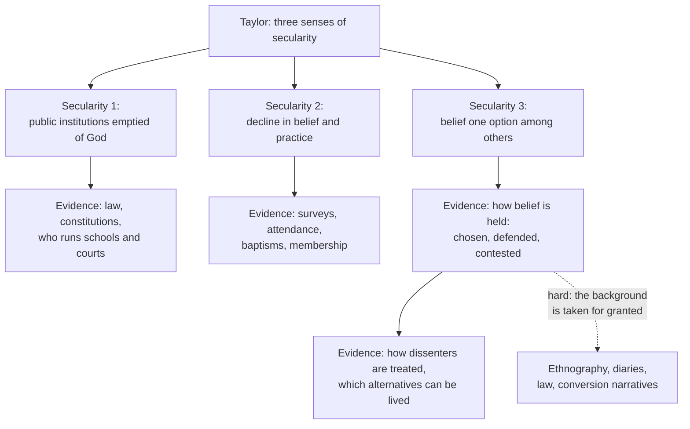

# Social Theory · Lesson 7.3: Taylor's *A Secular Age*

> ⏱ ~15 min · Module 7: The secularization debate · Builds on: [7.1 Classical secularization theory](07-01-classical-secularization-theory.md), [7.2 Critics and rival models](07-02-critics-and-rival-models.md), [1.3 Understanding: Weber's interpretive method](01-03-understanding-webers-interpretive-method.md), [4.4 Bureaucracy, rationalization, and disenchantment](04-04-bureaucracy-rationalization-and-disenchantment.md) · Unlocks: [philosophy-of-religion](../../philosophy-of-religion/syllabus.md), Boss problem 7

## Why this matters

Lessons 7.1 and 7.2 argued about a number: how many people believe and attend, and why that number falls in some places and not others. Charles Taylor's *A Secular Age* (Harvard, 2007, grown out of his Gifford Lectures in Edinburgh) says the number is not the main thing that changed. What changed is *how* anyone believes, believer and unbeliever alike. If he is right, the classical debate has been measuring the second-most-important fact about modern religion. This lesson states his claim, sorts what kind of explanation it is, and asks the course's last question: what evidence could ever bear on it?

## The idea

Start with the three senses of **[secularity](../reference.md#three-senses-of-secularity)**, defined exactly as [apologetics-foundations 8.3](../../apologetics-foundations/lessons/08-03-apologetics-in-a-secular-age.md) defines them. **Secularity 1:** public institutions emptied of reference to God. **Secularity 2:** a decline in belief and practice. **Secularity 3:** a change in the *conditions of belief*, from a society where belief in God was unchallenged to one where it is one option among others, and often not the easiest. Taylor's 1 and 2 roughly match Casanova's differentiation and decline ([7.1](07-01-classical-secularization-theory.md)). His book is about 3. His comparison is Latin Christendom around 1500 against the North Atlantic world around 2000; he does not claim the story travels elsewhere.

Four tools carry the argument (all Taylor's terms, paraphrased).

**[Subtraction stories](../reference.md#subtraction-stories).** The familiar account in which modern people shed illusions, and what remains is human nature as it always was underneath: rational, self-reliant, content with this world. Taylor rejects the *form*. Exclusive humanism, an outlook that recognizes no goal beyond human flourishing, was not uncovered. It was built, and for the first time in history it became a widely livable option.

**[The porous and the buffered self](../reference.md#porous-and-buffered-self).** In the enchanted world, meaning and power sat *in things*: a relic heals, a curse wounds, melancholy *is* black bile. The self was porous, open to spirits and forces it did not control. The modern self is buffered: a firm boundary runs between mind and world, meanings live in minds, and a person can disengage from what might once have possessed her. This is [disenchantment](../reference.md#disenchantment) from [4.4](04-04-bureaucracy-rationalization-and-disenchantment.md) described from inside a life rather than from the institutions. Buffered does not mean unbelieving. A modern Christian is buffered too.

**[The immanent frame](../reference.md#immanent-frame).** The shared background of modern life (natural science, a market economy, a self-governing polity, an impersonal moral order) makes the world intelligible in its own terms. The frame can be lived *open*, pointing beyond itself, or *closed*. Taylor's sharpest claim is that neither reading is forced by the frame. Each is a "take", and presenting either as the obvious one is "spin".

**[The nova effect](../reference.md#nova-effect).** Once exclusive humanism existed, positions multiplied between and beyond orthodoxy and unbelief: first among elites from the eighteenth century, then, after the 1960s, for whole populations (his "supernova"). Every position is now "fragilized" by the visible presence of decent people who hold another. Taylor periodizes this with Durkheim ([3.3](03-03-religion-as-social-the-elementary-forms.md)). In the *paleo-Durkheimian* order, the sacred was embodied in society itself. In the *neo-Durkheimian* "Age of Mobilization" (roughly 1800–1960), belonging to a church went with belonging to a nation or a class. In the *post-Durkheimian* "Age of Authenticity", spiritual life is a personal search detached from political identity.

## The argument

1. **P1.** Around 1500, belief in God was the default in Latin Christendom: nature testified to God, society was grounded in the sacred, and the self was porous. *(Exegetical: Taylor's starting point.)*
2. **P2.** Around 2000, belief is one option among others, lived within an immanent frame that can be read open or closed, and every option is fragilized (secularity 3).
3. **P3.** The passage from P1 to P2 was a series of constructions, not the removal of illusions. The buffered self, a disciplined society and an impersonal moral order were built, many of them by religious reformers ("Reform") trying to make *everyone* a fully committed Christian.
4. **P4.** Those constructions made exclusive humanism livable, and once it was, positions multiplied (the nova).
5. **∴ C.** Secularity is chiefly a change in the conditions of belief produced by that history, and subtraction stories misdescribe it.

*In words:* religion was not peeled away to reveal secular man; a new way of being human was assembled, partly by believers, and belief now has to be held against it.

**What kind of explanation it is.** First, **interpretive** in [1.3](01-03-understanding-webers-interpretive-method.md)'s sense: the explanandum is what it is like to believe, so the account aims at [adequacy at the level of meaning](../reference.md#adequacy-at-the-level-of-meaning). This answers the question [3.3](03-03-religion-as-social-the-elementary-forms.md) left open. Durkheim described belief from outside, by what it does for a group; Taylor insists that belief be described as it is lived, and his essay "Interpretation and the Sciences of Man" (reprinted in *Philosophy and the Human Sciences*, 1985) argues that social science cannot do without such description. Second, **explanatorily holist** ([1.1](01-01-individuals-and-social-facts.md)): the conditions of belief are a shared background, a "social imaginary", not a sum of individual opinions. Third, its causal story is a **genealogy of unintended consequences**, the same shape as Weber's Protestant ethic ([4.1](04-01-the-protestant-ethic-and-the-spirit-of-capitalism.md)): reformers seeking deeper devotion helped build the frame in which unbelief became possible. It is not functional ([1.2](01-02-functional-explanation-and-its-critics.md)): no benefit explains why the frame persists.

**What it does not claim.** That belief is false, or true. Taylor is himself a Catholic, and readers dispute whether the book tilts. But secularity 3 describes how belief is held, and a correct description of that leaves its truth exactly where it was. Whether a social explanation of belief bears on its truth is the [genetic-fallacy question](../reference.md#genetic-fallacy-question), flagged in 3.3 and owned by [philosophy-of-religion](../../philosophy-of-religion/syllabus.md).

**Where the argument is weakest.** P3's causal weight, and the evidence for P1. A critic from the social-scientific side says Taylor's history is told mostly through elite texts (theologians, philosophers, Deists), and the conditions of belief of ordinary people in 1500 or 1800 are inferred from them. That is a selection problem ([1.4](01-04-testing-a-social-explanation.md)): the sources are chosen by literacy and survival, not at random. The Reform narrative is adequate at the level of meaning, but no comparison tests its causal adequacy. Did reformers build the buffered self, or did differentiation (7.1) build it, with reformers riding along? A second critic, from the secular side, attacks the parity of "takes". Taylor holds that everyone seeks some "fullness" and that the closed reading is no more obvious than the open one. The critic says this assumes a universal orientation beyond the ordinary that an unbeliever need not grant.

## The explanation

*Each sense has its own evidence. The first two can be counted; the third must be read out of how people talk, write and treat each other, which is why it is hard to test and easy to assert.*

## Worked examples

**Example 1 (the theory on a real case): England's witchcraft statutes.** James I's statute of 1603–04 (1 Jas. 1 c. 12) made invoking or consulting evil spirits a capital felony. The Witchcraft Act of 1735 (9 Geo. 2 c. 5, in force from June 1736) repealed it and punished instead anyone who *pretended* to exercise witchcraft, with at most a year in prison *(exegetical: the statutes)*.

- **Taylor's reading.** The first law assumes a porous world: a person can be harmed through spirits, so the witch is dangerous. The second assumes a buffered one: no one has such power, so the harm is fraud on the credulous. The law moved from fearing the act to doubting the claim.
- **Against the subtraction story.** The crude story says science and technology made magic useless. Keith Thomas's *Religion and the Decline of Magic* (1971) concluded that in England belief in magic waned *before* the technical remedies that would replace it existed, and he traced the new self-reliance partly to Protestant theology *(explanatory: a major, influential synthesis of English sources, debated in parts)*. A change in outlook preceding a change in capacity, pushed partly by religious reform, is what P3 predicts.
- **The rival reading.** A classical theorist reads the 1736 Act as differentiation (secularity 1): law becoming a professional sphere with its own standards of proof. The two readings part on timing and reach. Differentiation predicts that the statute led and minds followed. Taylor predicts the elite outlook led, which Thomas's chronology suggests, and that villagers stayed porous longer.

**Example 2 (a hard case): charismatic renewal.** The Catholic Charismatic Renewal is usually dated to a weekend retreat of Duquesne University students and faculty near Pittsburgh in February 1967. It brought prayer meetings with speaking in tongues, healing prayer and prophecy into Catholic parishes, and grew into a worldwide movement. This is porous-looking religion flourishing at the very start of Taylor's Age of Authenticity. Does it refute the buffered self?

- **Taylor's reading.** No: it is post-Durkheimian. Participants sought the experience as individuals, outside the parish routine, and lived it knowing that neighbours and fellow Catholics read it differently. Re-enchantment *within* secularity 3 is one more option in the nova.
- **Where it strains.** If decline confirms the theory and revival confirms it too, what could count against it? This is the unfalsifiability worry of [1.4](01-04-testing-a-social-explanation.md). The answer is that secularity 3 does forbid something. It forbids a return to *unchallenged* porousness inside the modern West. If interviews and testimonies showed participants unaware of any sceptical alternative, holding their experience as the obvious way the world is, the theory would be in trouble for them. Whether the experiences are what participants take them to be is not a sociological question.

## Watch out

- **You might think secularity 3 means fewer believers, but actually that is secularity 2.** A society can be high on belief and attendance and fully inside secularity 3, if its believers know theirs is one option among several.
- **You might think rejecting subtraction stories is an argument for religion, but actually it is a claim about history** *(exegetical vs evaluative)*. It says exclusive humanism was constructed, not that it is false. The objection is to a form, so it applies equally to a believer's mirror-image story in which faith reappears once modern distractions are stripped away, as the natural default underneath.
- **You might think "buffered" means unbelieving, but actually it names the modern self of believers and unbelievers alike.** The contrast is with the porous self of 1500, not with faith.

## One-liner

> Taylor says the secular age is not belief subtracted but a new frame constructed, in which faith and unbelief are both options; that claim is interpretive and holist, and the evidence for it lies not in counts of believers but in how belief is held.

## Problems

**P1 (🟢) *(Exegetical.)*** Diagnose. An **invented** op-ed in a regional paper, not the words of any real person:

> "Why are the churches emptying? Because we finally know better. For most of history people believed in angels, demons and miracle cures because they had no microscopes and no hospitals. Take away the ignorance and what remains is simply the human being as she always was underneath: practical, rational, content with this life. Belief is not being replaced by anything. It is falling away, the way the scaffolding comes down once the building stands."

(a) Name the form of this story in Taylor's terms, and the two claims it needs. (b) Name two things Taylor says had to be built rather than uncovered, and the real evidence from this lesson that cuts against the op-ed's "microscopes and hospitals" mechanism. (c) Which sense of secularity is the op-ed's evidence about, and which is its conclusion about? (d) A reply letter says: "Strip away consumerism and screens, and every person's natural longing for God returns." Is that a subtraction story too? Two sentences per part, one for (d).

**P2 (🟡) *(Exegetical (a) · Evaluative (b).)*** In *Le problème de l'incroyance au XVIe siècle* (1942), the historian Lucien Febvre argued that in Rabelais's France unbelief in the modern sense was practically impossible: the culture lacked the mental equipment (concepts, vocabulary, a science independent of theology) to sustain it. David Wootton ("Unbelief in Early Modern Europe", *History Workshop Journal*, 1985; "Lucien Febvre and the Problem of Unbelief in the Early Modern Period", *Journal of Modern History*, 1988) replied that Febvre's conclusion outran his evidence, and that the sources do record sixteenth-century people who denied core Christian doctrines.

(a) Which of Taylor's senses is this dispute about, and why does finding *some* sixteenth-century unbelievers not by itself refute Taylor's P1? Two sentences. (b) Name two kinds of evidence that would bear on whether unbelief was a *livable option* around 1500. For each, say what Taylor's claim predicts and what finding would count against it. 150 words or fewer.

Solutions

**P1** *(Exegetical)*

**Must hit, strict (a):**

- A subtraction story.
- Claim 1: the modern secular outlook is what was there all along, human nature underneath.
- Claim 2: nothing new was constructed, so belief is removed and not replaced ("not being replaced by anything").

**Must hit, strict (b):**

- Any two of: the buffered self; the immanent frame; the impersonal modern moral order or disciplined society; exclusive humanism as a livable outlook.
- Thomas's finding that in England belief in magic waned before the technical remedies existed, so a change of outlook preceded a change of capacity.

**Must hit, strict (c):** the evidence (emptying churches) is secularity 2; the conclusion (what modern people are underneath, what belief is now held against) is a claim about secularity 3. The op-ed slides from a count to a claim about the conditions of belief.

**Accept (d):** "yes", with the reason that it treats faith as the default left when obstacles are removed. Also accept "yes in form", adding that Taylor would deny any return to an unchallenged default, since a recovered faith is still held as one option within the immanent frame.

**Wrong turns:** answering that the op-ed is wrong because religion is true, or right because it is false (evaluative, and not Taylor's objection); saying Taylor denies that churches empty (he grants decline in many places; it is not his subject); answering "no" to (d) because the letter favours belief. The objection is to the form, whoever tells it.

**Model answer:** (a) A subtraction story: it assumes the secular self was underneath all along, and that removing illusions leaves a vacuum rather than a new construction. (b) The buffered self and exclusive humanism had to be built; Thomas found that English belief in magic waned before the technical remedies that would replace it, so outlook changed before capacity. (c) Its evidence, empty pews, is about secularity 2; its conclusion, what modern people are by default, is about secularity 3, and nothing in the evidence reaches it. (d) Yes: it makes faith the residue that remains when obstacles are removed, the same form with the sign reversed.

---

**P2** *(Exegetical (a) · Evaluative (b))*

**Must hit, strict (a):**

- Secularity 3 (the conditions of belief: whether unbelief was available), not secularity 2 (how many believed).
- Taylor's P1 says unbelief was not a livable, socially available option. Isolated deniers, treated as monsters, madmen or heretics, are compatible with that. A default can have dissenters.

**Accept (b):** any two kinds of evidence, each with a prediction and a disconfirming finding.

**Must hit, any verdict (b):**

- Kinds of evidence aimed at availability, not at headcount. Examples: how contemporaries treated an unbeliever (as a recognized position, or as monstrous and unintelligible); whether a positive non-religious account of meaning and morality circulated beyond a few authors; whether unbelief could be transmitted, to children or to a circle, as a way of life; how doubters described their own doubt (doubt *within* faith, about God's goodness or the Church, versus doubt that God exists).
- For each, Taylor's prediction and a finding that would count against it.
- Any verdict on Febvre versus Wootton passes, provided the moves are made.

**Wrong turns:** counting unbelievers, which tests secularity 2; treating Wootton as refuting Taylor, or Febvre as confirming him, without asking what availability would look like; arguing about whether the unbelievers were right.

**Model answer (b), one of several:** First, how unbelief was treated. Taylor predicts that "atheist" functioned as an accusation hurled at enemies, a charge of monstrousness, rather than a position one could openly hold and defend. Evidence of open circles of unbelievers, argued with as rivals and not merely punished, would count against him. Second, transmission. Taylor predicts that unbelief, where it existed, died with the individual. A family or community that raised children in unbelief and sustained it for generations would show it was a livable option. Neither kind of evidence is a headcount. Both ask whether the background made unbelief something a person could *live*.

## Flashback

**From Lesson [7.1](07-01-classical-secularization-theory.md) (Classical secularization theory):** *(Exegetical (a) · Evaluative (b).)* Apply to a real case. Wisconsin required children to attend school until age 16. Old Order Amish parents, who end formal schooling after the eighth grade, refused to send their children on to high school: by their church's standards such schooling endangered the children's salvation, and it would take them out of the community and into a world whose values their faith rejects during the years in which they are formed. In *Wisconsin v. Yoder* (1972) the US Supreme Court ruled for the parents under the First Amendment's free exercise clause. Today almost all Amish children attend Amish-run schools, and by the usual estimate about 85 percent of Amish youth are baptized into the church as adults. (a) In Berger's 1967 terms, what were the parents protecting, and which premise of Lesson 7.1's reconstruction does their fear about high school express? Two sentences. (b) A reader says: "High Amish retention in a pluralist society like the United States refutes Berger's pluralism mechanism." Say what that mechanism, read carefully, predicts for the Amish, what finding would count against it, and one rival explanation of the same 85 percent. 120 words or fewer.

Solution

**Must hit, strict (a):**

- A **plausibility structure**: the community whose shared talk, practice and daily round keep the Amish world taken for granted.
- **P5**: belief whose plausibility structure has thinned becomes a choice, held less securely and passed on to children less reliably. High school would expose teenagers to many options at once (P4) during the years when the faith is handed on (P5). "P4–P5" passes; P5 alone passes if transmission to children is named.

**Must hit, any verdict (b):**

- The mechanism is conditional. Pluralism erodes belief *by* thinning the plausibility structure, so a group that keeps its own schools, language and daily life intact is predicted to keep its young. High retention is not by itself a counterexample, and *Yoder* shows the parents acting on the mechanism's own logic.
- A finding that would count against it, for example: among the Amish, retention does not fall where daily contact with outsiders is greater (families who work among outsiders, communities with less separation), or does not fall as contact grows over time.
- One rival: **exit cost** (leaving means losing much of the community one grew up in, so retention may measure the price of leaving more than secure belief); **strictness** (costly demands screen out the half-committed and make membership more valuable); or high retention as *belonging* without telling us about belief.
- Credit for noting the risk: if every surviving group is explained as an enclave after the fact, the mechanism cannot fail. The conditions of separation must be named in advance.

**Wrong turns:** arguing about whether Amish schooling is good for children or whether *Yoder* was rightly decided (evaluative, not the question). Reading 85 percent baptized as 85 percent believing. Treating the case as bearing on whether Amish belief is true: that a belief is sustained by a plausibility structure leaves its truth where it was, the genetic-fallacy question that philosophy-of-religion owns.

**Model answer (a):** The parents were protecting their plausibility structure, the community whose constant confirmation keeps their faith taken for granted. Their fear is P5: in high school the faith would become one option among many, and a faith held as a choice is passed on to children less reliably.

**Model answer (b), one of several:** Not by itself. Berger's mechanism says pluralism erodes belief by thinning the plausibility structure, and a group with its own schools, language and daily round has not had its structure thinned, so the mechanism predicts high retention; *Yoder* shows the parents reasoning exactly that way. It would count against the mechanism if, among the Amish, retention did not fall where contact with outsiders is greater, for instance in families whose work puts them among outsiders every day. A rival reading of the same 85 percent is exit cost: leaving means losing much of the community one grew up in, so retention may measure the price of leaving rather than the security of belief.

## Connections

- **Backward:** Disenchantment as a belief about the world, not more knowledge of it, is [4.4](04-04-bureaucracy-rationalization-and-disenchantment.md); Taylor gives it a lived interior. Casanova's three claims and Berger's plausibility structures are [7.1](07-01-classical-secularization-theory.md); Berger's point that pluralism weakens the taken-for-granted is a near relative of fragilization. The models of [7.2](07-02-critics-and-rival-models.md) explain variation in secularity 2. The interpretive method is [1.3](01-03-understanding-webers-interpretive-method.md), and the Durkheimian periods reuse [3.3](03-03-religion-as-social-the-elementary-forms.md)'s moral community.
- **Forward:** Boss problem 7 sets the three senses against the Europe–US evidence. Whether belief held as one option can be rational, and whether its social explanation bears on its truth, belong to [philosophy-of-religion](../../philosophy-of-religion/syllabus.md); see [its 5.5](../../philosophy-of-religion/lessons/05-05-religious-diversity.md) on religious diversity, the epistemic shadow of the nova.
- **Sideways:** [apologetics-foundations 8.3](../../apologetics-foundations/lessons/08-03-apologetics-in-a-secular-age.md) asks what secularity 3 does to argument; this lesson asks what evidence bears on it. Taylor's "Reform" is the long arc of [church-history 6.1](../../church-history/lessons/06-01-the-late-medieval-church-and-luthers-protest.md) to [6.4](../../church-history/lessons/06-04-trent-and-catholic-reform.md), Protestant and Catholic alike. Secularism as a church-state question belongs to [catholic-social-teaching](../../catholic-social-teaching/syllabus.md).

## Closing the course

Module 1 gave you three questions to put to any claim about society: does it run through individuals or wholes, does it explain by function, by meaning, or by cause, and what comparison would test it? Marx, Durkheim, Weber and Simmel each answered those questions differently, and each was then put on trial against the record. Polanyi, rational-choice sociology and social capital showed the classics' arguments still running, now with better data and sharper mechanisms. The secularization debate brought everything together in one question: is it a count, a mechanism, or a change in meaning? Taylor's answer is the last of these, and it shows why that third kind of claim is the hardest to test. No rubric asked you for a verdict, about Marx or about God. What carries forward is the habit: name the kind of explanation, then the evidence that could tell against it. Institutions and the state continue in [comparative-politics](../../comparative-politics/syllabus.md) and [institutions-and-development](../../institutions-and-development/syllabus.md). The truth of religious belief is the business of [philosophy-of-religion](../../philosophy-of-religion/syllabus.md). Explanation itself is examined in [philosophy-of-science](../../philosophy-of-science/syllabus.md).
