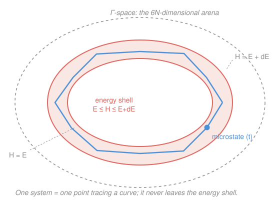

# Statistical Mechanics · Lesson 1.1: From mechanics to statistics

> ⏱ ~15 min · Module 1: Foundations and the microcanonical ensemble · Builds on: [analytical-mechanics 3.2 Phase space & Liouville](#/lesson/analytical-mechanics/03-02-phase-space-liouville.md), [probability-theory 4.2 Laws of large numbers](#/lesson/probability-theory/04-02-laws-of-large-numbers.md) · Unlocks: 1.2 microstates, macrostates & the fundamental postulate

## Why this matters

You already know how to evolve a mechanical system exactly: write the Hamiltonian, turn the crank on Hamilton's equations, and the future is determined. That machine works beautifully for a planet, a pendulum, three bodies if you're patient. Point it at a glass of water — about $10^{23}$ molecules — and it doesn't just get hard, it becomes *meaningless*. You could never write down the initial conditions, never solve the equations, and even if a demon handed you the exact trajectory you wouldn't know what to *ask* it. Yet the water has a temperature, a pressure, a heat capacity — a handful of numbers that behave lawfully and reproducibly. This lesson is the pivot of the whole course: we stop tracking particles and start asking **statistical** questions, and in doing so we will *derive* thermodynamics from mechanics plus probability. That is the single most important idea in the subject.

## The idea

Here is the mismatch that forces the whole reframing. A mole of gas has roughly $N \approx 6\times10^{23}$ particles, each with 3 position and 3 momentum numbers — about $3.6\times10^{24}$ coordinates. No detector measures them, no computer stores them, and crucially **no experiment depends on them**: two glasses of water at the same temperature and pressure are thermodynamically identical while being in wildly different microscopic states at every instant. The microscopic detail isn't just inaccessible — it's *irrelevant* to the macroscopic questions we actually ask.

So flip the question. Instead of "where is every particle?" ask "of all the microscopic states consistent with what I *do* control — the energy, the volume, the particle number — what does a typical one look like, and how much do the answers vary from one to the next?" That is a probability question. And here is the miracle that makes it pay off: when you average a quantity over $\sim 10^{23}$ near-independent contributions, the **law of large numbers** crushes the fluctuations. The average energy per particle, the pressure on a wall — these are sums over astronomically many terms, and their relative spread shrinks like $1/\sqrt{N}$. With $N\sim10^{23}$ that spread is about $10^{-12}$: utterly invisible. The macroscopic world looks *deterministic and law-governed* not because the microscopic world is simple, but because it is so enormous that statistics becomes razor-sharp.

The regime where this sharpening is exact is the **thermodynamic limit**: let $N\to\infty$ and $V\to\infty$ together with the density $N/V$ held fixed. Fluctuations vanish, and clean macroscopic laws — an equation of state, a definite entropy — emerge from the underlying probabilistic haze. Thermodynamics is what statistical mechanics looks like after the $1/\sqrt N$ noise has been sent to zero.

## The formal version

**Phase space ($\Gamma$-space).** A classical system of $N$ point particles is specified completely by all positions and momenta: a single point
$$\mathbf{x} = (q_1,\dots,q_{3N},\, p_1,\dots,p_{3N}) \in \Gamma \subseteq \mathbb{R}^{6N}.$$
*In words:* one point in this $6N$-dimensional space **is** the entire instantaneous state of the gas — every particle's position and velocity bundled into one dot. This point is called a **microstate**.

**The trajectory.** Time evolution is Hamilton's equations,
$$\dot q_i = \frac{\partial H}{\partial p_i}, \qquad \dot p_i = -\frac{\partial H}{\partial q_i},$$
so the microstate isn't frozen — it flows, tracing a curve through $\Gamma$. *In words:* the whole system, as one point, wanders along a path dictated by the Hamiltonian $H$. Because energy is conserved, that path is trapped on the surface $H(\mathbf{x}) = E$ — the **energy surface**, a $(6N-1)$-dimensional shell inside $\Gamma$.

**Liouville's theorem** (from [analytical-mechanics 3.2](#/lesson/analytical-mechanics/03-02-phase-space-liouville.md)). Let $\rho(\mathbf{x},t)$ be the density of a cloud of microstates in $\Gamma$. Under Hamiltonian flow,
$$\frac{d\rho}{dt} = \frac{\partial \rho}{\partial t} + \sum_i\left(\dot q_i\frac{\partial\rho}{\partial q_i} + \dot p_i\frac{\partial\rho}{\partial p_i}\right) = 0.$$
*In words:* the flow is incompressible — a blob of microstates can stretch and fold like taffy but its phase-space volume never changes, like a fluid that can't be squeezed. **Consequence we need:** a density that depends on $\mathbf{x}$ only through the conserved energy, $\rho = \rho(H(\mathbf{x}))$, is automatically stationary ($\partial\rho/\partial t = 0$). In particular a density that is *uniform on the energy surface* just sits there, unchanging — it is an equilibrium. This is the mechanical justification for the ensemble we build next lesson.

**The ergodic hypothesis** (a *motivated assumption*, not a theorem). For the observables we care about, the long-time average along one trajectory equals the average over the energy surface with the uniform (Liouville) weight:
$$\lim_{T\to\infty}\frac{1}{T}\int_0^T A(\mathbf{x}(t))\,dt \;=\; \frac{1}{\text{(surface measure)}}\int_{H=E} A(\mathbf{x})\,d\sigma \;\equiv\; \langle A\rangle_{\text{ensemble}}.$$
*In words:* what you'd get by watching one system for a long time equals what you'd get by photographing a huge collection of systems once and averaging. This lets us replace *time* (which we can't follow for $10^{23}$ particles) with *counting* (which we can do). Proving it for realistic systems is genuinely hard and largely open — we adopt it because it works, and flag it honestly as an assumption.

**Coarse-graining and the growth of entropy.** We can't resolve a single point, so partition $\Gamma$ into small cells and track only *which cell* the system is in — the coarse-grained description. Liouville keeps the *fine-grained* volume fixed, but the occupied blob filaments out — stretching into ever-thinner tendrils that thread through more and more cells (see the picture's wandering curve). The coarse-grained volume — cells *touched* — can only grow, and that monotone growth is the microscopic seed of the second law. *In words:* nothing is lost microscopically; information is smeared below the resolution we can access, and entropy measures that smearing.

## Picture

The whole $6N$-dimensional phase space is the dashed blob; conservation of energy pins the system to the thin red **shell** between $H=E$ and $H=E+dE$. A single system is *one blue point*, and as time runs it traces the wandering curve — visiting the shell so thoroughly that a long-time average over the curve matches a uniform average over the shell (the ergodic hypothesis). The real object lives in $\sim10^{24}$ dimensions; this is its honest cartoon.

## Worked examples

**Example 1 (mechanical — the size of the arena).** How many dimensions does the phase space of one mole of monatomic gas have, and what does that say?

Each atom carries 3 position + 3 momentum coordinates, so $\dim\Gamma = 6N$. With $N = N_A = 6.022\times10^{23}$,
$$\dim\Gamma = 6N_A \approx 3.6\times10^{24}.$$
A microstate is a single point in a space of $3.6\times10^{24}$ axes. Suppose you discretized each axis into a mere 10 bins and tried to list the cells: you'd need $10^{3.6\times10^{24}}$ of them — a number whose digit count alone dwarfs the number of atoms in the observable universe ($\sim10^{80}$). **The lesson isn't "do it faster," it's "never do it."** The state is not a thing to be tracked; it is a thing to be integrated over.

**Example 2 (why you'd care — sharpness from size).** Take a gas of $N$ molecules, each contributing an energy $\varepsilon_i$ that fluctuates as the molecules collide. The total is $E = \sum_{i=1}^N \varepsilon_i$. Treat the $\varepsilon_i$ as independent and identically distributed with mean $\mu$ and variance $\sigma^2$ (this is the physical content of "equilibrium at fixed temperature," made precise in Module 3). Then
$$\langle E\rangle = N\mu, \qquad \operatorname{Var}(E) = N\sigma^2,$$
because variances of independent quantities add. The *absolute* energy spread grows, $\sqrt{\operatorname{Var}(E)} = \sqrt{N}\,\sigma$ — but the **relative** spread shrinks:
$$\frac{\sqrt{\operatorname{Var}(E)}}{\langle E\rangle} = \frac{\sqrt{N}\,\sigma}{N\mu} = \frac{\sigma}{\mu}\cdot\frac{1}{\sqrt N}.$$
For $N = 10^{23}$ that factor is about $3\times10^{-12}$. The gas's total energy is, for all practical purposes, a *fixed number* — even though every molecule in it is jittering wildly. That $1/\sqrt N$ is precisely the [law of large numbers](#/lesson/probability-theory/04-02-laws-of-large-numbers.md) at work, and it is *why* the thermodynamic limit yields sharp macroscopic laws rather than fuzzy averages. Sharp thermodynamics is a large-$N$ statement, nothing more mysterious.

## Watch out

- You might think statistical mechanics is needed because we're *ignorant* of the microstate — a matter of practical bookkeeping. Partly, but the deeper point is that the microstate is **irrelevant**: overwhelmingly many microstates give the same macrostate, so the macroscopic answer is a property of the *count*, not of which particular state you're in. Ignorance is the excuse; the enormous multiplicity is the reason it works.
- You might think ergodicity is a proven theorem you can lean on. It is **not** — for realistic interacting systems it is essentially an unproven (and for some systems false) assumption. We use it as a well-motivated bridge from time averages to ensemble averages, and the course is honest about that; don't cite it as established fact.
- You might think Liouville's theorem, by keeping phase-space volume constant, *forbids* entropy from increasing. The resolution: the **fine-grained** volume is conserved, but entropy tracks the **coarse-grained** volume, which grows as the conserved blob filaments into thinner and thinner tendrils spread across more cells. No contradiction — two different volumes.

## One-liner

> With $10^{23}$ degrees of freedom, tracking is hopeless and pointless — so we count instead, and the law of large numbers ($1/\sqrt N$) makes the counting sharp enough to *become* thermodynamics.

## Problems

**P1 (🟢)** A sealed container holds exactly one mole of argon (treat each atom as a structureless point).
(a) What is the dimension of the system's phase space $\Gamma$?
(b) The instantaneous microstate is a single point in $\Gamma$. Briefly, in one or two sentences, why is the goal of statistical mechanics to *integrate over* this space rather than to locate the point?

**P2 (🟡)** You measure a macroscopic quantity by averaging $N$ independent, identically distributed microscopic contributions, $\bar A = \frac1N\sum_{i=1}^N A_i$, each with mean $\mu$ and standard deviation $\sigma$. Show that the *relative* fluctuation of $\bar A$ scales as $1/\sqrt N$, and evaluate it for $N = 10^{23}$ taking $\sigma/\mu \approx 1$. State in one line why this is exactly why the thermodynamic limit produces sharp laws.

**P3 (🔴, optional)** Let $\rho(\mathbf{x},t)$ be a phase-space density and suppose it depends on the microstate $\mathbf{x}$ only through the Hamiltonian: $\rho(\mathbf{x},t) = f\!\big(H(\mathbf{x})\big)$ for some fixed function $f$, with no explicit time dependence in $f$. Using Hamilton's equations, show that this $\rho$ is stationary, i.e. $\partial\rho/\partial t = 0$ so it does not change in time. (This is the Liouville-flavored reason a uniform density on the energy shell — $f=$ const there — is an equilibrium.)

Solutions

**P1** (a) Each of the $N=N_A=6.022\times10^{23}$ atoms has 3 position and 3 momentum coordinates, so
$$\dim\Gamma = 6N_A \approx 3.6\times10^{24}.$$
(b) Locating the point is impossible (you can't measure $\sim10^{24}$ numbers) and pointless (no macroscopic measurement depends on which of the astronomically many equivalent microstates you're in). Every macroscopic quantity is an *average* over the microstates consistent with the fixed macroscopic constraints — an integral over $\Gamma$ (or over the energy shell) — so counting/integrating, not locating, is the operation that yields physics.

**P2** By independence, variances add and constants pull out squared:
$$\operatorname{Var}(\bar A) = \frac{1}{N^2}\sum_{i=1}^N \operatorname{Var}(A_i) = \frac{1}{N^2}\,(N\sigma^2) = \frac{\sigma^2}{N}.$$
So the standard deviation of $\bar A$ is $\sigma/\sqrt N$, while its mean is $\langle\bar A\rangle = \mu$. The relative fluctuation is therefore
$$\frac{\text{std}(\bar A)}{\langle\bar A\rangle} = \frac{\sigma/\sqrt N}{\mu} = \frac{\sigma}{\mu}\cdot\frac{1}{\sqrt N}\;\propto\;\frac{1}{\sqrt N}.$$
For $N=10^{23}$ with $\sigma/\mu\approx1$: $1/\sqrt{10^{23}} = 10^{-11.5}\approx 3\times10^{-12}$. *Why it matters:* the macroscopic average is spread by only a few parts in $10^{12}$, so in the limit $N\to\infty$ the fluctuation vanishes and the quantity takes a single sharp value — exactly the deterministic-looking laws of thermodynamics, recovered as the $N\to\infty$ face of the law of large numbers.

**P3** Write out the total time derivative of $\rho(\mathbf{x},t)=f(H(\mathbf{x}))$. Since $f$ has no explicit $t$-dependence, $\partial\rho/\partial t = 0$ would be what we want to *confirm via the flow* — more carefully, use that $\rho$ is transported by the flow (Liouville: $d\rho/dt=0$), so the explicit time-change is the negative of the convective change:
$$\frac{\partial\rho}{\partial t} = -\sum_i\left(\dot q_i\frac{\partial\rho}{\partial q_i} + \dot p_i\frac{\partial\rho}{\partial p_i}\right).$$
Now compute the right side for $\rho = f(H)$ using the chain rule $\partial\rho/\partial q_i = f'(H)\,\partial H/\partial q_i$ and $\partial\rho/\partial p_i = f'(H)\,\partial H/\partial p_i$, together with Hamilton's equations $\dot q_i = \partial H/\partial p_i$, $\dot p_i = -\partial H/\partial q_i$:
$$\sum_i\left(\dot q_i\frac{\partial\rho}{\partial q_i} + \dot p_i\frac{\partial\rho}{\partial p_i}\right)
= f'(H)\sum_i\left(\frac{\partial H}{\partial p_i}\frac{\partial H}{\partial q_i} - \frac{\partial H}{\partial q_i}\frac{\partial H}{\partial p_i}\right) = f'(H)\cdot 0 = 0.$$
The two terms cancel identically — this is the Poisson bracket $\{H,H\}=0$ in disguise. Hence $\partial\rho/\partial t = -0 = 0$: the density is stationary. Taking $f=$ constant on the shell $H=E$ (and zero off it) gives the uniform microcanonical density, which is therefore an equilibrium — no direction of flow can change it because it looks the same at every point the flow can reach. $\blacksquare$

## Connections

- **Backward:** this rests entirely on [analytical-mechanics 3.2](#/lesson/analytical-mechanics/03-02-phase-space-liouville.md) — phase space, Hamiltonian flow, and Liouville's theorem are borrowed wholesale; here they become the *stage* for probability rather than a tool for solving orbits. The $1/\sqrt N$ sharpening is the [law of large numbers](#/lesson/probability-theory/04-02-laws-of-large-numbers.md) from probability-theory, cashed out physically.
- **Forward:** next lesson, [1.2](#/lesson/stat-mech/01-02-microstates-macrostates-postulate.md), makes "uniform on the energy shell" into the **fundamental postulate of equal a priori probabilities** and starts counting microstates; [1.3](#/lesson/stat-mech/01-03-entropy-microcanonical.md) turns that count into entropy $S=k_B\ln\Omega$. The coarse-graining story here is the arrow-of-time thread picked up much later in [6.2](#/lesson/stat-mech/06-02-entropy-information-arrow.md).
- **Sideways (probability):** the sharpening of averages is one law-of-large-numbers step short of the [central limit theorem](#/lesson/probability-theory/04-05-central-limit-theorem.md) — which will return in Module 3 to give the *Gaussian shape* of energy fluctuations, not just their $1/\sqrt N$ width.
