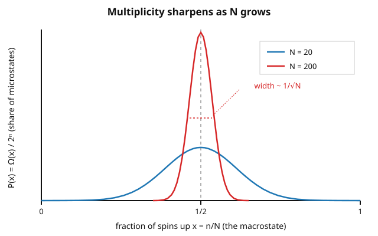

# Statistical Mechanics · Lesson 1.2: Microstates, macrostates, and the fundamental postulate

> ⏱ ~15 min · Module 1: Foundations and the microcanonical ensemble · Builds on: [1.1 From mechanics to statistics](#/lesson/stat-mech/01-01-mechanics-to-statistics.md) · Unlocks: 1.3 — entropy as $S=k_B\ln\Omega$ and the microcanonical ensemble

## Why this matters

Lesson 1.1 left us with a scandal: a gas of $10^{23}$ molecules is a deterministic Hamiltonian system, yet we describe it with a handful of numbers — energy, volume, particle count — and it reliably does the same thing every time. This lesson explains the sleight of hand. The macroscopic numbers name a *macrostate*; the full microscopic configuration is a *microstate*; and the bridge between them is a single act of **counting** — how many microstates wear the same macroscopic mask. That count, $\Omega$, is the most important object in the subject: entropy is its logarithm (next lesson), temperature is a derivative of that, and the second law is nothing but the observation that one macrostate is counted overwhelmingly more often than the rest. Everything downstream is bookkeeping on $\Omega$.

## The idea

Roll a pair of dice. The **macrostate** is the total, say $7$. The **microstate** is the actual pair, $(3,4)$ or $(6,1)$. You care about the total, but the dice care about the pair — and the total $7$ happens most because *six different pairs produce it*, versus one lonely pair for $2$. Nobody rigged the dice; $7$ wins purely because it has the most microscopic ways to happen.

A thermodynamic system is that game with $10^{23}$ dice. The macrostate is what a lab instrument reads — pressure, energy, volume. The microstate is the exact position and momentum of every particle. A single macrostate is compatible with an astronomical number of microstates, and — here is the whole trick — **they are not counted equally across macrostates**. One macrostate (gas spread evenly, energy shared democratically) sits on a mountain of microstates; its competitors (all gas in the left half, all energy on one molecule) sit on a molehill. When the number of microstates is $2^{10^{23}}$-ish, "a mountain versus a molehill" becomes "certainty versus never." The system looks like it *seeks* equilibrium; really it just wanders into the macrostate it can't help but land in, because that macrostate is almost all of the microstates there are.

## The formal version

**Microstate.** A complete specification of the system. Classically, a single point $(q_1,\dots,q_{3N},\,p_1,\dots,p_{3N})$ in $6N$-dimensional phase space — every coordinate and momentum. Quantum mechanically, a single energy eigenstate of the $N$-body system.

*In words:* the microstate is the full God's-eye description, far more information than you could ever measure.

**Macrostate.** A specification by a few macroscopic variables — for an isolated system, the triple $(E,V,N)$: energy, volume, particle number.

*In words:* the macrostate is everything an instrument actually reports, and nothing more.

**Statistical weight / multiplicity.** The number of microstates consistent with a given macrostate,
$$\Omega(E,V,N) = \#\{\text{microstates compatible with } (E,V,N)\}.$$
Quantum mechanically this is a literal integer count of eigenstates in the energy window. Classically, microstates form a continuum, so we count *phase-space volume in units of $h^{3N}$*:
$$\Omega(E,V,N) = \frac{1}{h^{3N}}\int_{E\le H(q,p)\le E+\delta E} d^{3N}q\,d^{3N}p .$$

*In words:* Planck's constant $h$ sets the size of one "cell" of phase space (position–momentum uncertainty makes finer distinctions meaningless), so dividing the accessible volume by $h^{3N}$ turns an area into a pure, dimensionless *number of states* — the same object the quantum count gives directly. (An indistinguishability factor $1/N!$ also belongs here; we defer it to [1.5](#/lesson/stat-mech/01-05-ideal-gas-sackur-tetrode.md), where it resolves the Gibbs paradox.)

**The fundamental postulate of statistical mechanics.**
> For an isolated system in equilibrium, every accessible microstate is equally probable.

This is *equal a priori probabilities*. If $\Omega$ microstates are accessible, each carries probability $1/\Omega$.

*In words:* with no information beyond $(E,V,N)$, we have no reason to favor one microscopic configuration over another, so we favor none. It is the least-biased guess consistent with what we know — and, motivated by ergodicity in 1.1, the time-average of a real trajectory reproduces this flat average over states.

**The consequence.** Group microstates by the macrostate they realize. The probability of observing a macrostate $M$ is its share of the microstates,
$$P(M) = \frac{\Omega(M)}{\Omega_{\text{total}}}.$$
Because $\Omega(M)$ varies by factors like $2^{10^{23}}$ between macrostates, $P(M)$ is essentially $1$ for the single macrostate of maximum multiplicity and essentially $0$ for all others.

*In words:* the equilibrium macrostate is the one that **maximizes $\Omega$** — not because anything pushes the system there, but because that macrostate simply *is* almost every microstate.

## Picture

A clean way to see all of this in one model is the **two-state paramagnet**: $N$ spins, each $\uparrow$ or $\downarrow$. A microstate is the full list of arrows ($2^N$ of them). The macrostate is just the count $n$ of up-spins (equivalently the fraction $x=n/N$, which fixes the magnetization). The multiplicity is a binomial coefficient,
$$\Omega(n) = \binom{N}{n},$$
sharply peaked at the even split $n=N/2$. Plotting the *share* of microstates $P(x)=\Omega/2^N$ against $x$, the peak sits at $x=\tfrac12$ and — crucially — **narrows as $N$ grows**, with width shrinking like $1/\sqrt N$.

That narrowing *is* the second law in miniature: at $N=20$ a lopsided split is merely unlikely, but as $N\to10^{23}$ the curve becomes a spike of zero width — any macrostate but the even split is not just improbable, it is never seen. The same figure describes $N$ gas particles partitioned between two halves of a box, with $n$ the number on the left.

## Worked examples

**Example 1 (mechanical — count and rank).** Take $N=10$ spins. The macrostate "$n$ up" has multiplicity $\Omega(n)=\binom{10}{n}$:
$$1,\ 10,\ 45,\ 120,\ 210,\ 252,\ 210,\ 120,\ 45,\ 10,\ 1,$$
for $n=0,1,\dots,10$, summing to $2^{10}=1024$ total microstates (every distinct arrow-list counted once). The most probable macrostate is $n=5$, with
$$P(n{=}5)=\frac{252}{1024}\approx 0.246,\qquad P(n{=}0)=\frac{1}{1024}\approx 0.001 .$$
"All up" is a perfectly legal microstate with the *same* probability $1/1024$ as any single other microstate — but as a *macrostate* it is $252\times$ rarer than the even split, because the even split is realized $252$ different ways and "all up" only one. Microstates are democratic; macrostates are not.

**Example 2 (why you'd care — the gas that never uncompresses).** Put $N$ gas molecules in a box and ask: what's the chance they all wander into the left half at once? That macrostate has one... well, $\Omega \sim 1$-ish share: each molecule independently has probability $\tfrac12$ to be left, so
$$P(\text{all left}) = 2^{-N}.$$
For a mere $N=100$ that's $10^{-30}$; for a real $N=10^{23}$ it is $2^{-10^{23}}$ — a number so small the age of the universe rounds to zero against it. This is why you never see a room's air spontaneously pile into one corner, even though *no law of mechanics forbids it*. The reverse (spreading out) happens because the spread-out macrostate owns essentially all the microstates. Equilibrium isn't a force; it's a landslide of counting. In [1.3](#/lesson/stat-mech/01-03-entropy-microcanonical.md) we take $\ln$ of these multiplicities and this landslide becomes $\Delta S \ge 0$.

## Watch out

- You might think the fundamental postulate says *macro*states are equally likely. It says **micro**states are. Macrostates inherit wildly unequal probabilities precisely *because* they are backed by wildly unequal numbers of equally-likely microstates. Confusing the two erases the entire subject.
- You might think a lopsided macrostate is forbidden. It isn't — "all spins up" is a genuine accessible microstate, fully allowed and exactly as probable as any single other microstate. It's rare *as a macrostate* only because it's realized so few ways. The second law is overwhelming probability, not prohibition.
- You might think dividing by $h^{3N}$ is a quantum correction bolted onto classical physics. Treat it instead as the unit conversion that makes "phase-space volume" into a dimensionless *count* — without it $\Omega$ carries units of $(\text{action})^{3N}$ and its logarithm (the entropy) would depend on whether you measure in joule-seconds or erg-seconds. The $h$ is what makes entropy absolute.

## One-liner

> A macrostate's probability is just its share of microstates, all microstates are counted equally, and equilibrium is simply the macrostate that hogs almost all of them.

## Problems

**P1 (🟢)** Four coins are flipped (equivalently, $N=4$ spins). List the multiplicity $\Omega(n)$ of each macrostate "$n$ heads," identify the most probable macrostate and its probability, and compare the probability of the macrostate "$2$ heads" to that of the single microstate HHHH.

**P2 (🟡)** Using Stirling's approximation $\ln m!\approx m\ln m-m$, show that $\Omega(n)=\binom{N}{n}$ peaks at $n=N/2$ and that near the peak
$$\Omega(n)\approx \Omega_{\max}\,\exp\!\Big[-\tfrac{2}{N}\big(n-\tfrac{N}{2}\big)^2\Big].$$
Read off the standard deviation of $n$ and hence the *relative* width of the peak, and confirm it scales like $1/\sqrt N$.

**P3 (🔴, optional)** Using the result of P2: (a) evaluate the ratio $\Omega(N/2)\big/\Omega\!\big(N/2+\sqrt N\big)$. (b) Explain why the approximation in P2 is exactly the statement that the fraction $x=n/N$ is Gaussian-distributed about $\tfrac12$ with width $\sim1/\sqrt N$, and name the probability theorem this is an instance of.

Solutions

**P1** With $N=4$, $\Omega(n)=\binom{4}{n}$:
$$\Omega(0)=1,\ \Omega(1)=4,\ \Omega(2)=6,\ \Omega(3)=4,\ \Omega(4)=1,$$
summing to $2^4=16$. Most probable macrostate: $n=2$ (two heads), with
$$P(n{=}2)=\frac{6}{16}=\frac{3}{8}=0.375 .$$
The single microstate HHHH has probability $1/16$. So the macrostate "$2$ heads" is $6\times$ more probable than the microstate HHHH — not because any microstate is favored (each of the $16$ has probability $1/16$), but because "$2$ heads" bundles six of them (HHTT, HTHT, HTTH, THHT, THTH, TTHH) while HHHH is one microstate that also happens to be its own macrostate.

**P2** Write $\ln\Omega(n)=\ln N!-\ln n!-\ln(N-n)!$. Treat $n$ as continuous and differentiate, using $\frac{d}{dn}\ln n! \approx \frac{d}{dn}(n\ln n - n)=\ln n$:
$$\frac{d\ln\Omega}{dn} = -\ln n + \ln(N-n) = \ln\!\frac{N-n}{n}.$$
This vanishes when $N-n=n$, i.e. $n=N/2$ — the peak. Differentiate again:
$$\frac{d^2\ln\Omega}{dn^2} = -\frac1n-\frac1{N-n}\ \Big|_{n=N/2} = -\frac{2}{N/2}-\dots = -\frac{4}{N}.$$
(Both terms equal $-2/N$ at $n=N/2$.) A Taylor expansion of $\ln\Omega$ about the maximum then gives
$$\ln\Omega(n)\approx \ln\Omega_{\max} + \tfrac12\Big(-\tfrac{4}{N}\Big)\big(n-\tfrac N2\big)^2 = \ln\Omega_{\max} - \tfrac{2}{N}\big(n-\tfrac N2\big)^2,$$
so $\Omega(n)\approx\Omega_{\max}\exp[-\tfrac2N(n-\tfrac N2)^2]$, as claimed. Matching to a Gaussian $\exp[-(n-\mu)^2/2\sigma^2]$ gives $\tfrac{1}{2\sigma^2}=\tfrac2N$, hence
$$\sigma = \frac{\sqrt N}{2}.$$
The peak is centered at $n=N/2$ with absolute width $\sigma=\sqrt N/2$, so the **relative** width is
$$\frac{\sigma}{N}=\frac{1}{2\sqrt N}\ \sim\ \frac{1}{\sqrt N}.$$
The peak's position scales like $N$ but its width only like $\sqrt N$; the fractional spread collapses as $N\to\infty$. (Sanity check against P1's exact $N=10$: $\sigma=\sqrt{10}/2\approx1.58$, and indeed $\Omega$ falls to about $\Omega_{\max}/\sqrt e$ one $\sigma$ from center, matching $210/252\approx0.83$ at $n=6$.)

**P3** (a) Set $n=N/2+\sqrt N$ in the Gaussian form. The exponent is
$$-\frac{2}{N}\big(\sqrt N\big)^2 = -\frac{2}{N}\cdot N = -2,$$
so $\Omega(N/2+\sqrt N)=\Omega_{\max}e^{-2}$ and
$$\frac{\Omega(N/2)}{\Omega(N/2+\sqrt N)} = e^{2}\approx 7.39 .$$
Moving just *one* $\sqrt N$-step off the even split already costs a factor of $\sim7.4$ in multiplicity — and this ratio is **independent of $N$**, which is the point: measured in units of the width $\sqrt N$, the peak has a fixed Gaussian shape, but that width is a vanishing fraction $1/\sqrt N$ of the whole axis. So in absolute terms of the fraction $x=n/N$, deviations of order $1/\sqrt N$ are all that survive, and everything else is crushed.

(b) Dividing $n=Nx$, the distribution of the fraction $x$ is $P(x)\propto\exp[-2N(x-\tfrac12)^2]$ — a Gaussian centered at $x=\tfrac12$ with standard deviation $\sigma_x=\sigma/N=1/(2\sqrt N)\to0$. Each spin is an independent $\pm$ coin; $n$ is their sum and $x$ their average. A properly-scaled sum of many i.i.d. random variables becoming Gaussian about its mean, with fluctuations shrinking like $1/\sqrt N$, is exactly the **Central Limit Theorem** (with the shrinking of the average itself being the **Law of Large Numbers**). The sharp-peak physics of equilibrium is CLT/LLN wearing a lab coat — see probability-theory's [Central Limit Theorem](#/lesson/probability-theory/04-05-central-limit-theorem.md) and [Laws of Large Numbers](#/lesson/probability-theory/04-02-laws-of-large-numbers.md).

## Connections

- **Backward:** the phase-space and coarse-graining picture of [1.1](#/lesson/stat-mech/01-01-mechanics-to-statistics.md) is what the $h^{3N}$-cell count formalizes; the continuum of Hamiltonian microstates becomes a countable $\Omega$. The phase-space measure comes from analytical mechanics — [phase space and Liouville's theorem](#/lesson/analytical-mechanics/03-02-phase-space-liouville.md) is why "uniform on the energy shell" is even a consistent thing to assume.
- **Forward:** [1.3](#/lesson/stat-mech/01-03-entropy-microcanonical.md) defines entropy $S=k_B\ln\Omega$, turning "maximize $\Omega$" into "maximize $S$" and multiplicative counting into additive entropy; [1.4](#/lesson/stat-mech/01-04-temperature-pressure-chemical-potential.md) reads temperature and pressure off derivatives of that $S$. Boss problem 1 (two systems sharing energy) is this lesson's peak-finding applied to $\Omega_1\Omega_2$.
- **Sideways (probability):** the entire lesson is the [Central Limit Theorem](#/lesson/probability-theory/04-05-central-limit-theorem.md) and [Law of Large Numbers](#/lesson/probability-theory/04-02-laws-of-large-numbers.md) read physically — the $1/\sqrt N$ sharpening of the multiplicity peak is why macroscopic variables have negligible relative fluctuations, and why thermodynamics is deterministic at all.
