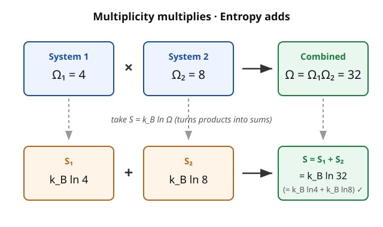

# Statistical Mechanics · Lesson 1.3: Entropy and the microcanonical ensemble

> ⏱ ~15 min · Module 1: Foundations and the microcanonical ensemble · Builds on: [1.1 From mechanics to statistics](#/lesson/stat-mech/01-01-mechanics-to-statistics.md), [1.2 Microstates, macrostates, and the fundamental postulate](#/lesson/stat-mech/01-02-microstates-macrostates-postulate.md) · Unlocks: 1.4 Temperature, pressure, and chemical potential

## Why this matters

You already know how to *count*: a macrostate is realized by $\Omega$ microstates, and the fundamental postulate says every accessible microstate is equally likely. That count is not just bookkeeping — take its logarithm and you get **entropy**, the single quantity that turns a pile of microscopic combinatorics into the thermodynamics of the real world. This lesson does two things: it defines entropy as $S = k_B \ln \Omega$ (Boltzmann's tombstone equation), and it recasts the second law of thermodynamics — the one law that has a direction in time — as nothing more mysterious than "the system is found where the microstates are." Everything downstream (temperature in 1.4, free energy in Module 3, the arrow of time in Module 6) is a consequence of this one move.

## The idea

Picture an isolated system: fixed energy $E$, fixed volume $V$, fixed particle number $N$, exchanging nothing with the outside. Left alone, it wanders blindly among all microstates consistent with those constraints — and by the postulate, it plays no favorites. So where do you *find* it? Overwhelmingly, in whatever macrostate owns the most microstates. Not because anything pushes it there, but because that macrostate is where almost all the tickets are. Flip 100 coins: nothing forbids all-heads, but you'll see near-50/50 every time, because near-50/50 is realized in astronomically more ways. Scale "100 coins" up to $10^{23}$ particles and "overwhelmingly likely" becomes "never observed otherwise" — that inevitability *is* the second law.

Now, why take a logarithm of the count? Because we want entropy to be **additive** — put two independent systems side by side and their entropies should add, the way energy and volume do. But their *multiplicities* multiply: if system 1 can be in any of $\Omega_1$ states and system 2 in any of $\Omega_2$, the pair has $\Omega_1 \Omega_2$ joint states (every state of one pairs with every state of the other). The logarithm is exactly the function that turns that product into a sum. That's the whole reason it's there.

## The formal version

**The microcanonical ensemble.** The statistical description of an **isolated** system with fixed $(E, V, N)$. Because no real measurement pins energy to a mathematical point, we allow it in a thin shell $[E, E+\delta E]$ and let

$$\Omega(E, V, N) = \#\{\text{microstates with energy in } [E, E+\delta E]\}$$

be the number of accessible microstates. The ensemble's defining assumption is the fundamental postulate: each of these $\Omega$ microstates carries equal probability $1/\Omega$, and every microstate outside the shell carries zero.

*In words:* an isolated system at fixed energy is equally likely to be in any microstate compatible with that energy, and $\Omega$ just counts them.

**The Boltzmann entropy.**

$$\boxed{\,S = k_B \ln \Omega\,}$$

where $k_B = 1.381 \times 10^{-23}\ \mathrm{J/K}$ is the Boltzmann constant (it only sets the units that connect counting to Kelvin and Joules).

*In words:* entropy is the logarithm of how many microscopic ways the current macrostate can be arranged — a measure of multiplicity, not of any single configuration.

**Additivity.** For two independent subsystems, $\Omega_{\text{tot}} = \Omega_1 \Omega_2$, so

$$S_{\text{tot}} = k_B \ln(\Omega_1 \Omega_2) = k_B \ln \Omega_1 + k_B \ln \Omega_2 = S_1 + S_2.$$

*In words:* multiplicity is multiplicative, and $\ln$ converts that into an additive (extensive) entropy — the property that makes $S$ behave thermodynamically.

**The second law, statistically.** Remove an internal constraint from an isolated system (open a valve, let two blocks touch). The system explores the newly accessible microstates and is found, with overwhelming probability, in the macrostate of **maximum $\Omega$**, hence **maximum $S$**. Equilibrium is the macrostate that maximizes $S$ subject to the remaining constraints.

*In words:* an isolated system relaxes to the most probable macrostate simply because it has the most microstates — the second law is a statement about counting, true not exactly but with probability $1 - 10^{-(\text{huge})}$.

**Why $\delta E$ and the additive constant don't matter.** Because $\Omega$ grows so violently with $N$ (typically $\Omega \sim c^N$), $\ln \Omega$ scales like $N$ — it is *extensive*. Whether you count microstates in the shell $\delta E$, or all states *below* $E$, or the states *on* the energy surface, the answers differ by at most a factor of order $E/\delta E$ or a power of $N$; taking $\ln$ turns those into $O(\ln N)$ corrections, utterly swamped by the $O(N)$ leading term. In the thermodynamic limit ($N \to \infty$ at fixed density) the shell dominates and the ambiguity is invisible in $S/N$.

## Picture

The top row multiplies ($\Omega_1 \Omega_2 = 32$); the bottom row, obtained by applying $k_B \ln$, adds ($k_B\ln 4 + k_B\ln 8 = k_B\ln 32$). The logarithm is the bridge between the two rows — that is its entire job.

## Worked examples

**Example 1 (mechanical — entropy is a count, and it adds).** A tiny system $A$ has $\Omega_A = 6$ accessible microstates; an independent system $B$ has $\Omega_B = 10$. Their entropies are

$$S_A = k_B \ln 6, \qquad S_B = k_B \ln 10.$$

Join them (still independent): the pair has $\Omega = 6 \times 10 = 60$ joint microstates, so

$$S = k_B \ln 60 = k_B \ln(6 \cdot 10) = k_B \ln 6 + k_B \ln 10 = S_A + S_B. \checkmark$$

No new physics — just the defining algebra of $\ln$. Note $S$ is attached to the *macrostate* "$A$ has 6 options, $B$ has 10," not to any particular one of the 60 configurations.

**Example 2 (why you'd care — gas expanding into vacuum).** $N$ molecules sit in the left half of a box; the right half is empty, separated by a partition. Position-wise, each molecule has some number of accessible cells $\propto V$, so the spatial multiplicity is $\Omega \propto V^N$. Remove the partition: each molecule now roams volume $2V$, so

$$\frac{\Omega_{\text{after}}}{\Omega_{\text{before}}} = \left(\frac{2V}{V}\right)^N = 2^N, \qquad \Delta S = k_B \ln 2^N = N k_B \ln 2 > 0.$$

The gas fills the box and never spontaneously re-crowds into one half — not because a force forbids it, but because the "all in the left half" macrostate is one part in $2^N$ of the microstates. For $N = 10^{23}$ that probability is $2^{-10^{23}}$: not *small*, effectively *zero*. This is the second law caught in the act, and it foreshadows the ideal-gas entropy of [1.5](#/lesson/stat-mech/01-05-ideal-gas-sackur-tetrode.md).

## Watch out

- You might think a single microstate has some entropy, but **entropy is a property of a macrostate** — it counts the microstates compatible with the macroscopic data $(E,V,N)$. Ask "what is the entropy of *this exact configuration*?" and the question is ill-posed: one microstate, $\Omega = 1$, $S = 0$, always. Entropy lives one level up, in the count.
- You might think the second law is an exact mechanical law like energy conservation. It isn't — microscopic dynamics is reversible, and a fluctuation *decreasing* $S$ is not forbidden, merely absurdly improbable. The law is exact only in the thermodynamic limit; "always increases" means "increases with probability indistinguishable from 1."
- You might worry that the arbitrary shell width $\delta E$ or an additive constant in $\ln \Omega$ poisons the definition. It doesn't: both shift $S$ by $O(\ln N)$ or $O(1)$, negligible against the extensive $O(N)$ bulk. Differences and *derivatives* of $S$ — which is all thermodynamics ever uses — are completely insensitive to them.

## One-liner

> Entropy is the log of the microstate count, $S = k_B\ln\Omega$; the log makes it add, and the second law is just "the system sits where almost all the microstates are."

## Problems

**P1 (🟢)** System $A$ has $\Omega_A = 8$ accessible microstates and independent system $B$ has $\Omega_B = 16$. (a) Compute $S_A$ and $S_B$ in units of $k_B$. (b) Compute the entropy $S$ of the combined system two ways — directly from the joint multiplicity, and as $S_A + S_B$ — and confirm they agree.

**P2 (🟡)** A two-state paramagnet has $N$ spins, each $\uparrow$ or $\downarrow$; a macrostate is fixed by the number $n$ pointing up, with multiplicity $\Omega(n) = \dbinom{N}{n} = \dfrac{N!}{n!\,(N-n)!}$. Using Stirling's approximation $\ln M! \approx M\ln M - M$, write $S(n)/k_B = \ln\Omega(n)$ and show it is maximized at $n = N/2$. What is the maximal entropy $S_{\max}$, and does its value make sense?

**P3 (🔴, optional)** An isolated system has fixed total energy $E$, internally partitioned into two parts that can exchange energy: $E_1 + E_2 = E$, with $E$ fixed. The multiplicities are $\Omega_1(E_1)$ and $\Omega_2(E_2)$, so the total is $\Omega_{\text{tot}}(E_1) = \Omega_1(E_1)\,\Omega_2(E - E_1)$. Using only the equal-probability postulate (the most probable split is the one maximizing $\Omega_{\text{tot}}$), show that at equilibrium

$$\frac{\partial S_1}{\partial E_1} = \frac{\partial S_2}{\partial E_2}.$$

Explain in one sentence why this makes $\partial S/\partial E$ the natural thing to call (an inverse) temperature — the definition 1.4 will make official.

Solutions

**P1** (a) $S_A = k_B\ln 8 = 3k_B\ln 2 \approx 2.079\,k_B$ and $S_B = k_B\ln 16 = 4k_B\ln 2 \approx 2.773\,k_B$.

(b) Direct: the joint multiplicity is $\Omega = \Omega_A\Omega_B = 8\times 16 = 128$, so $S = k_B\ln 128 = 7k_B\ln 2 \approx 4.852\,k_B$. As a sum: $S_A + S_B = 3k_B\ln 2 + 4k_B\ln 2 = 7k_B\ln 2$. Identical — the log turned the product $8\times 16 = 2^7$ into the sum $3+4 = 7$ of powers of two. $\checkmark$

**P2** Take the logarithm and apply Stirling to all three factorials:

$$\frac{S(n)}{k_B} = \ln N! - \ln n! - \ln(N-n)! \approx \big(N\ln N - N\big) - \big(n\ln n - n\big) - \big((N-n)\ln(N-n) - (N-n)\big).$$

The three $-N,\,+n,\,+(N-n)$ terms cancel ($-N + n + (N-n) = 0$), leaving

$$\frac{S(n)}{k_B} \approx N\ln N - n\ln n - (N-n)\ln(N-n).$$

Differentiate with respect to $n$ (treat $n$ as continuous; $\tfrac{d}{dn}[n\ln n] = \ln n + 1$):

$$\frac{1}{k_B}\frac{dS}{dn} \approx -(\ln n + 1) + \big(\ln(N-n) + 1\big) = \ln\!\frac{N-n}{n}.$$

Set to zero: $\ln\frac{N-n}{n} = 0 \Rightarrow N - n = n \Rightarrow n = N/2$. The second derivative is $\frac{1}{k_B}\frac{d^2S}{dn^2} = -\frac{1}{n} - \frac{1}{N-n} < 0$, so it is a maximum. $\checkmark$

Maximal entropy: at $n = N/2$,

$$\frac{S_{\max}}{k_B} \approx N\ln N - \tfrac{N}{2}\ln\tfrac{N}{2} - \tfrac{N}{2}\ln\tfrac{N}{2} = N\ln N - N\ln\tfrac{N}{2} = N\ln\frac{N}{N/2} = N\ln 2,$$

so $S_{\max} \approx N k_B\ln 2$. This makes sense: at the most disordered macrostate every spin is effectively free to be $\uparrow$ or $\downarrow$, giving $2^N$ configurations and $S = k_B\ln 2^N = Nk_B\ln 2$ — the maximum possible for $N$ two-state units. (This is exactly $\Delta S$ from Example 2, no coincidence: "spin up/down" and "left half/right half" are the same two-state count.)

**P3** By the postulate, all microstates of the whole isolated system are equally likely, so the observed split is the one with the most microstates: maximize $\Omega_{\text{tot}}(E_1) = \Omega_1(E_1)\Omega_2(E - E_1)$ over $E_1$. Maximizing $\Omega_{\text{tot}}$ is the same as maximizing its logarithm (log is increasing), and $\ln\Omega_{\text{tot}} = \ln\Omega_1 + \ln\Omega_2 = (S_1 + S_2)/k_B$. So maximize the total entropy:

$$\frac{d}{dE_1}\Big[S_1(E_1) + S_2(E - E_1)\Big] = 0.$$

By the chain rule, with $E_2 = E - E_1$ so that $dE_2/dE_1 = -1$:

$$\frac{\partial S_1}{\partial E_1} + \frac{\partial S_2}{\partial E_2}\cdot(-1) = 0 \;\Longrightarrow\; \frac{\partial S_1}{\partial E_1} = \frac{\partial S_2}{\partial E_2}. \checkmark$$

*Why temperature:* two bodies in thermal contact reach equilibrium precisely when $\partial S/\partial E$ matches across them — that is exactly the empirical role of temperature (equal temperatures = no net heat flow). So $\partial S/\partial E$ *is* the equilibrium-controlling variable, and 1.4 will define $1/T \equiv \partial S/\partial E$ so that "equal $\partial S/\partial E$" reads as the familiar "equal $T$."

## Flashback

**From Lesson 1.2 (Microstates, macrostates, and the fundamental postulate):** Four distinguishable gas molecules each sit independently in the left ($L$) or right ($R$) half of a box, all $2^4$ microstates equally likely. (a) What is the probability that all four are in the left half? (b) Which macrostate (specified by the number in the left half) is the most probable, and what is its probability?

Solution

Total microstates: each of 4 molecules has 2 choices, so $\Omega_{\text{tot}} = 2^4 = 16$, all equally likely by the postulate.

(a) "All four in $L$" is a single microstate ($LLLL$), so $\Omega = 1$ and $p = 1/16 \approx 0.063$.

(b) A macrostate "$n_L$ in the left half" has multiplicity $\binom{4}{n_L}$: the counts for $n_L = 0,1,2,3,4$ are $1, 4, 6, 4, 1$. The largest is $n_L = 2$ with $\binom{4}{2} = 6$, so the most probable macrostate is two-and-two, with probability $6/16 = 3/8 = 0.375$. This is the $N=4$ toy of Example 2's second law: the balanced macrostate wins because it owns the most microstates — and with $N = 10^{23}$ instead of $4$, "wins" becomes "is the only thing you ever see."

## Connections

- **Backward:** this is [1.2](#/lesson/stat-mech/01-02-microstates-macrostates-postulate.md)'s statistical weight $\Omega$ and equal-a-priori-probability postulate, promoted to a thermodynamic quantity by one logarithm — and the shell $[E, E+\delta E]$ is the coarse-grained energy surface from [1.1](#/lesson/stat-mech/01-01-mechanics-to-statistics.md).
- **Forward:** P3 is the exact setup for [1.4](#/lesson/stat-mech/01-04-temperature-pressure-chemical-potential.md), where $\partial S/\partial E$, $\partial S/\partial V$, $\partial S/\partial N$ become $1/T$, $p/T$, and $-\mu/T$; the additivity and maximization here are the engine behind every equilibrium condition in the course, and resurface as the Gibbs/Shannon entropy of information in [6.2](#/lesson/stat-mech/06-02-entropy-information-arrow.md).
- **Sideways (probability):** "most probable macrostate, overwhelmingly sharp peak" is the law of large numbers wearing a physicist's coat — the fractional width of the $\Omega$ peak shrinks like $N^{-1/2}$, exactly the [central limit theorem](#/lesson/probability-theory/04-05-central-limit-theorem.md) scaling that makes the thermodynamic limit deterministic.
