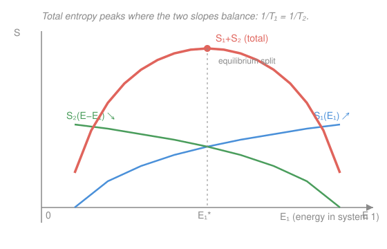

# Statistical Mechanics · Lesson 1.4: Temperature, pressure, and chemical potential

> ⏱ ~15 min · Module 1: Foundations and the microcanonical ensemble · Builds on: [1.3 Entropy and the microcanonical ensemble](#/lesson/stat-mech/01-03-entropy-microcanonical.md), [1.2 Microstates, macrostates, and the postulate](#/lesson/stat-mech/01-02-microstates-macrostates-postulate.md) · Unlocks: 1.5 (ideal gas & Sackur–Tetrode), then Module 2 (thermodynamics from these three variables)

## Why this matters

You already know entropy is $S = k_B \ln \Omega$ — a pure counting quantity. But nobody hands you a thermometer that reads "microstates." The everyday intensive variables — **temperature, pressure, chemical potential** — are not extra postulates. They fall out of a single question: when two systems can trade energy, volume, or particles, *how do they settle down?* The answer is always "maximize the total number of microstates," and each thing they can trade produces one intensive variable. This lesson is where the abstract counting of Module 1 turns into quantities you can actually measure — and where you learn the startling truth that **temperature is emergent and statistical, not fundamental**.

## The idea

Put a hot brick against a cold brick and wait. Energy flows until they match — but *match what?* Not energy (the big brick keeps more), not energy-per-atom exactly either. They match a subtler thing: the **rate at which each one's entropy grows per unit of energy added**.

Here's the whole intuition. The two bricks share a fixed pool of energy. The combined system explores all microstates equally (the fundamental postulate), so it overwhelmingly sits at the energy split that has the *most* microstates. Adding a joule to brick 1 buys some new microstates; the same joule taken from brick 2 costs some. At the most-probable split, the trade is a wash — the marginal entropy-per-joule is equal on both sides. **That common marginal rate is what temperature measures.** A system "hungry" for energy (steep $S$ vs. $E$) is cold; a system nearly sated (flat $S$ vs. $E$) is hot. Energy flows toward the hungry one.

Swap "energy" for "volume" and you get pressure; swap it for "particles" and you get chemical potential. Three trades, three intensive variables, one principle.

## The formal version

**Thermal equilibrium.** Two systems in thermal contact share energy $E = E_1 + E_2$ (fixed). Because they're independent, the combined microstate count is a product,
$$\Omega_{\text{tot}}(E_1) = \Omega_1(E_1)\,\Omega_2(E - E_1),$$
and the observed macrostate is the $E_1$ that maximizes it. Maximizing the product is maximizing its log (the entropy), so set $\frac{d}{dE_1}\big[\ln\Omega_1(E_1) + \ln\Omega_2(E-E_1)\big] = 0$:
$$\left.\frac{\partial \ln\Omega_1}{\partial E_1}\right|_{E_1^{*}} = \left.\frac{\partial \ln\Omega_2}{\partial E_2}\right|_{E_2^{*}}.$$
*In words:* at the equilibrium split $E_1^{*}$, both systems have the same "log-microstates gained per joule."

**Definition of $\beta$ and $T$.** Name that quantity:
$$\beta \equiv \frac{\partial \ln\Omega}{\partial E}\bigg|_{V,N}, \qquad \frac{1}{T} \equiv \frac{\partial S}{\partial E}\bigg|_{V,N} = k_B\,\beta.$$
*In words:* $1/T$ is the slope of entropy against energy at fixed volume and particle number; equivalently $\beta = 1/(k_B T)$. Thermal equilibrium is therefore exactly $T_1 = T_2$.

**Why energy flows hot → cold.** Move a sliver $\mathrm{d}E$ from system 1 to system 2. The total entropy changes by
$$\mathrm{d}S_{\text{tot}} = -\frac{1}{T_1}\mathrm{d}E + \frac{1}{T_2}\mathrm{d}E = \left(\frac{1}{T_2}-\frac{1}{T_1}\right)\mathrm{d}E.$$
The second law demands $\mathrm{d}S_{\text{tot}} \ge 0$, so energy flows out of system 1 ($\mathrm{d}E>0$) exactly when $T_1 > T_2$. *In words:* heat flows from hot to cold not because of a force, but because that's the direction that increases the total microstate count.

**Pressure and chemical potential.** Let the systems also trade volume (a movable piston) or particles (a permeable wall). Maximizing $\ln\Omega_{\text{tot}}$ over $V_1$ and $N_1$ too gives two more balance conditions, and two more definitions:
$$p \equiv T\,\frac{\partial S}{\partial V}\bigg|_{E,N}, \qquad \mu \equiv -\,T\,\frac{\partial S}{\partial N}\bigg|_{E,V}.$$
*In words:* pressure is (temperature times) the entropy gained per unit volume — a system's statistical "push" to expand; chemical potential is (minus temperature times) the entropy gained per particle added. Mechanical equilibrium is $p_1 = p_2$; diffusive equilibrium is $\mu_1 = \mu_2$. **The minus sign is a convention** that makes **particles flow from high $\mu$ to low $\mu$** (check: swapping $\mathrm{d}N$ from 1 to 2 gives $\mathrm{d}S_{\text{tot}} = (\mu_1-\mu_2)\,\mathrm{d}N/T \ge 0$, so $\mathrm{d}N>0$ needs $\mu_1 > \mu_2$).

**The thermodynamic identity.** All three definitions are the partial derivatives of one surface $S(E,V,N)$, so its total differential collects them:
$$\boxed{\;\mathrm{d}S = \frac{1}{T}\,\mathrm{d}E + \frac{p}{T}\,\mathrm{d}V - \frac{\mu}{T}\,\mathrm{d}N\;}$$
which rearranges to the more familiar
$$\mathrm{d}E = T\,\mathrm{d}S - p\,\mathrm{d}V + \mu\,\mathrm{d}N.$$
*In words:* every way of changing a system's entropy — heating it, expanding it, adding particles — is bookkept by one of the three intensive variables. This single line is the seed of all of thermodynamics (Module 2).

## Picture

As energy moves into system 1, its entropy $S_1$ rises while system 2's entropy $S_2$ falls. The **total** $S_1 + S_2$ is a hump: it climbs while system 1's slope beats system 2's, and falls once the balance tips. The peak at $E_1^{*}$ is where the slopes match, $\partial S_1/\partial E_1 = \partial S_2/\partial E_2$ — i.e. $T_1 = T_2$. In the thermodynamic limit this peak is astronomically sharp (that sharpness is Boss Problem 1), which is *why* equilibrium looks exact even though it's only overwhelmingly probable.

## Worked examples

**Example 1 (temperature of a power-law system — the definition in action).** Suppose a system's microstate count grows as $\Omega(E) = C\,E^{\,\alpha N}$ for constants $C, \alpha$ and particle number $N$ (this is the shape a gas of $N$ free particles actually has). Then
$$\ln\Omega = \ln C + \alpha N \ln E \;\Longrightarrow\; \beta = \frac{\partial \ln\Omega}{\partial E} = \frac{\alpha N}{E}.$$
So $\dfrac{1}{T} = k_B\beta = \dfrac{\alpha N k_B}{E}$, giving the **caloric equation of state**
$$E = \alpha N k_B T.$$
Energy is linear in temperature, with $\alpha N$ playing the role of "how many ways to store energy." For a monatomic ideal gas $\alpha = \tfrac{3}{2}$, recovering $E = \tfrac{3}{2}N k_B T$ — the equipartition result you'll re-derive properly in [3.4](#/lesson/stat-mech/03-04-equipartition-theorem.md), here falling straight out of counting.

**Example 2 (why the sign of $\mu$ matters — a concrete flow).** Two gas volumes are connected by a valve; volume $A$ is denser (more particles per unit volume) than $B$. Adding a particle to the crowded volume $A$ opens up relatively *few* new microstates (it's already busy), so $\partial S_A/\partial N$ is small; adding one to the sparse volume $B$ opens up many, so $\partial S_B/\partial N$ is large. Since $\mu = -T\,\partial S/\partial N$, the small $\partial S_A/\partial N$ makes $\mu_A$ the *less negative* — hence **higher** — chemical potential, while the large $\partial S_B/\partial N$ makes $\mu_B$ lower. Particles therefore flow $A \to B$, high $\mu$ to low $\mu$ — which is just diffusion from dense to dilute, exactly what you'd expect. The chemical potential is the statistical "particle pressure" that drives it, and it's the star of the grand canonical ensemble in [3.5](#/lesson/stat-mech/03-05-grand-canonical-ensemble.md).

## Watch out

- You might think temperature is a primitive, built-in property of a body. **It isn't** — $T$ is defined only through $\partial S/\partial E$, a derivative of a *counting* function. A single atom has no temperature; temperature is an emergent, statistical property of a large system, meaningful only because $\ln\Omega$ is smooth in the thermodynamic limit.
- You might think "hotter" always means "more energy." Not so: temperature is about the *slope* $\partial S/\partial E$, not the height of $E$. A small system can hold less energy than a big one yet be at a higher temperature. And with a bounded energy spectrum (Problem 2), $\partial S/\partial E$ can even go negative — a negative temperature that is *hotter* than any positive one.
- You might drop the minus sign in $\mu = -T\,\partial S/\partial N$. Keep it: it's the convention that makes particles flow **down** the $\mu$ gradient (high to low), paralleling energy flowing down the temperature gradient. Without it every chemical-potential inequality points the wrong way.

## One-liner

> Temperature, pressure, and chemical potential are just the three slopes of $S(E,V,N)$ — $\frac1T,\frac pT,\frac{\mu}{T}$ — and equilibrium is nothing but the total entropy sitting at its peak.

## Problems

**P1 (🟢)** A system has $\Omega(E) \propto E^{aN}$ for a positive constant $a$. (a) Compute $\beta(E)$ and $T(E)$. (b) Invert to get the caloric equation $E(T)$. (c) What is $a$ for a gas whose energy obeys $E = \tfrac{3}{2}Nk_BT$?

**P2 (🟡)** A two-state paramagnet has $N$ independent spins, each with energy $0$ (ground) or $\epsilon > 0$ (excited). If $n$ spins are excited, the energy is $E = n\epsilon$ and the microstate count is $\Omega = \binom{N}{n}$. Using Stirling's approximation $\ln m! \approx m\ln m - m$: (a) find $S(E)$; (b) compute $1/T = \partial S/\partial E$; (c) show that $T < 0$ when $E > N\epsilon/2$, and explain physically what a negative temperature means. (This connects to lasers — see below.)

**P3 (🔴, optional)** System 1 has $\Omega_1(E_1) = C_1 E_1^{N}$ and system 2 has $\Omega_2(E_2) = C_2 E_2^{\,2N}$. They start isolated, each holding energy $E/2$, then are placed in thermal contact with fixed total energy $E$. (a) Find the equilibrium split $(E_1^{*}, E_2^{*})$ by maximizing the total entropy, and verify $T_1 = T_2$ there. (b) Show the total entropy *increases* from the initial equal split to equilibrium, and compute $\Delta S$.

Solutions

**P1** (a) $\ln\Omega = aN\ln E + \text{const}$, so
$$\beta = \frac{\partial\ln\Omega}{\partial E} = \frac{aN}{E}, \qquad \frac{1}{T} = k_B\beta = \frac{aNk_B}{E} \;\Longrightarrow\; T = \frac{E}{aNk_B}.$$
(b) Invert: $E = aNk_BT$ — energy linear in $T$, slope $aNk_B$. (c) Matching $aNk_B = \tfrac{3}{2}Nk_B$ gives $a = \tfrac{3}{2}$. (The exponent counts the quadratic energy-storage modes: $3$ translational directions $\times \tfrac12$.)

**P2** (a) With $n = E/\epsilon$ excited spins,
$$\frac{S}{k_B} = \ln\binom{N}{n} \approx N\ln N - n\ln n - (N-n)\ln(N-n),$$
using $\ln N! \approx N\ln N - N$ (the $-N$ terms cancel: $-N + n + (N-n) = 0$). So
$$S(E) = k_B\Big[N\ln N - n\ln n - (N-n)\ln(N-n)\Big], \quad n = \tfrac{E}{\epsilon}.$$
(b) Since $E = n\epsilon$, $\dfrac{\partial}{\partial E} = \dfrac1\epsilon\dfrac{\partial}{\partial n}$. Differentiating (the $\ln N$ term is constant in $n$):
$$\frac{\partial S}{\partial n} = k_B\big[-\ln n - 1 + \ln(N-n) + 1\big] = k_B\ln\frac{N-n}{n},$$
$$\boxed{\;\frac{1}{T} = \frac{\partial S}{\partial E} = \frac{k_B}{\epsilon}\ln\frac{N-n}{n}\;} \quad\Longrightarrow\quad T = \frac{\epsilon}{k_B\ln\!\big(\tfrac{N-n}{n}\big)}.$$
(c) When $n < N/2$ (less than half excited, $E < N\epsilon/2$): $\frac{N-n}{n}>1$, the log is positive, $T>0$. At $n = N/2$ ($E = N\epsilon/2$): the log is $0$, so $1/T = 0$ and $T = \pm\infty$ — entropy is *maximal*, adding energy no longer buys microstates. For $n > N/2$ ($E > N\epsilon/2$): more than half the spins are excited (**population inversion**), $\frac{N-n}{n}<1$, the log is **negative**, so $T < 0$.

*Physical meaning:* negative temperature is only possible because the energy spectrum is **bounded above** ($E \le N\epsilon$) — you can't do this with a gas, whose energy has no ceiling. Past half-filling, adding energy *reduces* the number of microstates ($\partial S/\partial E < 0$), so the system is "more than full." A negative-$T$ system dumps energy into any positive-$T$ system it touches, making it **hotter than $T = +\infty$**: the ordering by hotness runs $+0 \to +\infty \equiv -\infty \to -0$. Population inversion is exactly the lasing condition — a laser's active medium is, briefly, at negative temperature.

**P3** (a) Maximize the total entropy over the split. With $E_2 = E - E_1$,
$$\frac{S_{\text{tot}}}{k_B} = \ln\Omega_1 + \ln\Omega_2 = \ln C_1 + N\ln E_1 + \ln C_2 + 2N\ln(E - E_1).$$
Set the $E_1$-derivative to zero:
$$\frac{N}{E_1} - \frac{2N}{E - E_1} = 0 \;\Longrightarrow\; E - E_1 = 2E_1 \;\Longrightarrow\; \boxed{E_1^{*} = \tfrac{E}{3},\quad E_2^{*} = \tfrac{2E}{3}.}$$
Check temperatures: $\frac{1}{k_BT_1} = \frac{\partial\ln\Omega_1}{\partial E_1} = \frac{N}{E_1^{*}} = \frac{3N}{E}$ and $\frac{1}{k_BT_2} = \frac{2N}{E_2^{*}} = \frac{2N}{2E/3} = \frac{3N}{E}$ — equal, so $T_1 = T_2$. ✓ (The system with twice the exponent — twice the "heat capacity" — grabs twice the energy at a common temperature: energy is partitioned in proportion to $\alpha N$.)

(b) Only the $E$-dependent pieces change; the constants $\ln C_1, \ln C_2$ cancel in $\Delta S$:
$$\frac{\Delta S}{k_B} = \Big[N\ln\tfrac{E}{3} + 2N\ln\tfrac{2E}{3}\Big] - \Big[N\ln\tfrac{E}{2} + 2N\ln\tfrac{E}{2}\Big] = N\ln\frac{\big(\tfrac{E}{3}\big)\big(\tfrac{2E}{3}\big)^2}{\big(\tfrac{E}{2}\big)^3}.$$
Compute the argument: numerator $= \tfrac{E}{3}\cdot\tfrac{4E^2}{9} = \tfrac{4E^3}{27}$; denominator $= \tfrac{E^3}{8}$; ratio $= \tfrac{4}{27}\cdot 8 = \tfrac{32}{27} \approx 1.185$. Hence
$$\Delta S = N k_B \ln\frac{32}{27} > 0.$$
Total entropy rose, as the second law requires — the equal-energy start was *not* equilibrium (it had $T_1 \ne T_2$), and letting energy flow to the common temperature increased the microstate count. ✓

## Flashback

**From Lesson 1.3 (Entropy and the microcanonical ensemble):** System $A$ has $\Omega_A = 10^{20}$ accessible microstates and system $B$ has $\Omega_B = 10^{30}$. They sit side by side but are *not* in contact (no exchange). Compute the entropy of each and of the combined system, and use the result to state in one sentence why entropy is defined with a logarithm.

Solution

Independent systems multiply their microstate counts: $\Omega_{AB} = \Omega_A\Omega_B = 10^{50}$. Then
$$S_A = k_B\ln 10^{20} = 20\,k_B\ln 10, \quad S_B = 30\,k_B\ln 10, \quad S_{AB} = k_B\ln 10^{50} = 50\,k_B\ln 10 = S_A + S_B.$$
The logarithm turns the *multiplicative* count $\Omega_{AB} = \Omega_A\Omega_B$ into an *additive* entropy $S_{AB} = S_A + S_B$ — which is exactly why entropy is **extensive** (scales with system size), the property this whole lesson leaned on when it wrote $\ln\Omega_{\text{tot}} = \ln\Omega_1 + \ln\Omega_2$.

## Connections

- **Backward:** this is [1.3](#/lesson/stat-mech/01-03-entropy-microcanonical.md)'s $S = k_B\ln\Omega$ put to work — additivity of $S$ (from multiplicativity of $\Omega$) is the only fact needed to derive all three intensive variables. The maximization of $\ln\Omega_1 + \ln\Omega_2$ at fixed total energy is a constrained optimization; the balance condition $\beta_1 = \beta_2$ is the same "equal marginal rates" logic as a Lagrange multiplier, which you'll meet again setting up the canonical ensemble.
- **Forward:** [1.5](#/lesson/stat-mech/01-05-ideal-gas-sackur-tetrode.md) plugs a real $\Omega(E,V,N)$ for the ideal gas into these three derivatives and gets $pV = Nk_BT$, the caloric law, and the Sackur–Tetrode entropy. The thermodynamic identity $\mathrm{d}E = T\mathrm{d}S - p\mathrm{d}V + \mu\mathrm{d}N$ is the launch point for all of [Module 2](#/course/stat-mech) — every thermodynamic potential is a Legendre transform of it. The chemical potential returns as the lead character in the grand canonical ensemble ([3.5](#/lesson/stat-mech/03-05-grand-canonical-ensemble.md)) and in every quantum gas of Module 4.
- **Sideways (quantum/optics):** the negative temperature of Problem 2 is the population inversion that makes a laser lase — a genuinely useful "impossible" temperature, available only to systems with a bounded energy spectrum like spins in a field.
