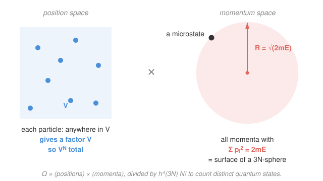

# Statistical Mechanics · Lesson 1.5: The ideal gas microcanonically

> ⏱ ~15 min · Module 1: Foundations and the microcanonical ensemble · Builds on: [1.3 Entropy and the microcanonical ensemble](#/lesson/stat-mech/01-03-entropy-microcanonical.md), [1.4 Temperature, pressure, and chemical potential](#/lesson/stat-mech/01-04-temperature-pressure-chemical-potential.md) · Unlocks: Boss Problem 1, then Module 2 (thermodynamic laws)

## Why this matters

Everything so far has been machinery: $S=k_B\ln\Omega$, and the intensive variables as its derivatives. Now we point it at a *real* system — a box of monatomic gas — and out falls the entire thermodynamics of an ideal gas: the equipartition energy $E=\tfrac32 Nk_BT$ and the ideal gas law $pV=Nk_BT$, both **derived, not assumed**. This is the first moment the program pays off: microscopic counting reproduces the macroscopic laws you learned in freshman chemistry. And it comes with a scandal — get the counting slightly wrong (forget that atoms are indistinguishable) and entropy stops being extensive, giving you the **Gibbs paradox**. The fix is a single factor of $N!$ that quietly smuggles quantum mechanics into a classical calculation.

## The idea

To get $\Omega$ we count the microstates of $N$ atoms with total energy $E$ in a box of volume $V$. A microstate is a full specification of every atom's position and momentum. So the counting splits cleanly into two independent questions:

- **Where can the atoms be?** Anywhere in the box. Each of the $N$ atoms contributes a factor of $V$, giving $V^N$. Positions don't care about energy at all.
- **What momenta are allowed?** Here's the only constraint. The energy is purely kinetic, $E=\sum_i \frac{\mathbf p_i^2}{2m}$, so $\sum_i \mathbf p_i^2 = 2mE$. Reading the $3N$ momentum components as coordinates in a $3N$-dimensional space, that equation is a **sphere of radius $R=\sqrt{2mE}$**. The allowed momenta form its surface.

So $\Omega$ is (volume of allowed positions) $\times$ (volume of the momentum shell) — a box times a high-dimensional sphere. Then two correction factors turn this classical volume into a *count* of distinct states: divide by $h^{3N}$ (each atom's $(x,p)$ pair occupies a Planck-sized cell $h$, so the phase space becomes dimensionless and countable), and divide by $N!$ (the atoms are identical — swapping two of them is the *same* microstate, not a new one). That $N!$ looks like bookkeeping. It is the whole ballgame.

## The formal version

The volume of an $n$-dimensional ball of radius $R$ is

$$V_n(R)=\frac{\pi^{n/2}}{\Gamma\!\left(\tfrac n2+1\right)}\,R^{\,n}.$$

In words: the familiar $\tfrac43\pi R^3$ ($n=3$) generalized — the radius still enters as $R^n$, only the prefactor changes with dimension.

Counting all states with energy up to $E$ (in the thermodynamic limit the "up to $E$" shell and the "exactly $E$" surface give the same entropy — almost all the volume is near the surface):

$$\Omega(E,V,N)=\frac{1}{N!}\,\frac{1}{h^{3N}}\;\underbrace{V^N}_{\text{positions}}\;\underbrace{\frac{\pi^{3N/2}}{\Gamma\!\left(\tfrac{3N}{2}+1\right)}(2mE)^{3N/2}}_{\text{momentum ball, }n=3N}.$$

Stripping the constants, the load-bearing dependence is

$$\boxed{\;\Omega(E,V,N)\ \propto\ \frac{V^N\,E^{3N/2}}{h^{3N}\,N!}\;}$$

In words: entropy will scale like $N\ln V$ (from positions) plus $\tfrac{3N}{2}\ln E$ (from the momentum sphere), all cut down by the indistinguishability factor $N!$.

**Take the log with Stirling.** Using $\ln N!\approx N\ln N-N$ and $\ln\Gamma(\tfrac{3N}{2}+1)\approx\tfrac{3N}{2}\ln\tfrac{3N}{2}-\tfrac{3N}{2}$, the algebra collapses to the **Sackur–Tetrode entropy**:

$$\boxed{\;S(E,V,N)=Nk_B\left[\ln\!\left(\frac{V}{N}\left(\frac{4\pi mE}{3Nh^2}\right)^{3/2}\right)+\frac52\right]\;}$$

In words: the entropy of an ideal gas, from pure counting. Note it depends on $V/N$ and $E/N$ — *intensive ratios* — so $S$ itself scales like $N$. It is **extensive**, exactly as a thermodynamic entropy must be. (That extensivity is precisely what the $N!$ bought; see Watch out.)

**Now turn the crank from 1.4.** Temperature is $1/T=\partial S/\partial E|_{V,N}$. Only the $\tfrac{3N}{2}\ln E$ piece depends on $E$:

$$\frac1T=\frac{\partial S}{\partial E}=Nk_B\cdot\frac32\cdot\frac1E=\frac{3Nk_B}{2E}\ \Longrightarrow\ \boxed{E=\tfrac32 Nk_BT.}$$

In words: each atom carries $\tfrac32 k_BT$ of kinetic energy — three translational directions, $\tfrac12 k_BT$ apiece. This is your first sighting of **equipartition** (proved in general in [3.4](#/lesson/stat-mech/03-04-equipartition-theorem.md)). Pressure is $p/T=\partial S/\partial V|_{E,N}$, and only the $N\ln V$ piece depends on $V$:

$$\frac pT=\frac{\partial S}{\partial V}=\frac{Nk_B}{V}\ \Longrightarrow\ \boxed{pV=Nk_BT.}$$

The ideal gas law, derived from counting spheres. Statistical mechanics reproduces thermodynamics.

## Picture

## Worked examples

**Example 1 (mechanical — where the $N!$ lives).** Redo the log *without* the indistinguishability factor to see what breaks. Dropping $1/N!$ multiplies $\Omega$ by $N!$, i.e. adds $\ln N!\approx N\ln N-N$ to $\ln\Omega$. Adding $k_B(N\ln N-N)$ to Sackur–Tetrode:

$$S_{\text{wrong}}=Nk_B\left[\ln\!\left(V\left(\frac{4\pi mE}{3Nh^2}\right)^{3/2}\right)+\frac32\right].$$

The $\ln(V/N)$ became $\ln V$. Now scale the system up by $\lambda$: $E\to\lambda E,\ V\to\lambda V,\ N\to\lambda N$. Physical entropy must scale by $\lambda$. But $S_{\text{wrong}}$ has a bare $Nk_B\ln V$ term, and $\lambda N\ln(\lambda V)=\lambda N\ln V+\lambda N\ln\lambda$ — an *extra* $\lambda N k_B\ln\lambda$ that shouldn't be there. $S_{\text{wrong}}$ is **not extensive**. The correct $S$, with $\ln(V/N)$, scales cleanly because $V/N$ and $E/N$ are unchanged by $\lambda$. One factorial is the difference between a valid thermodynamic entropy and a broken one.

**Example 2 (why you'd care — the number is right).** Sackur–Tetrode is not just structurally correct; it nails the *measured* entropy. Rewrite it using $E=\tfrac32Nk_BT$, which turns $\frac{4\pi mE}{3Nh^2}$ into $\frac{2\pi mk_BT}{h^2}=1/\lambda_{\text{th}}^2$, where

$$\lambda_{\text{th}}=\frac{h}{\sqrt{2\pi mk_BT}}$$

is the **thermal de Broglie wavelength** — the quantum "size" of an atom at temperature $T$. Then $S=Nk_B\big[\ln\!\big(\tfrac{V}{N\lambda_{\text{th}}^3}\big)+\tfrac52\big]$: entropy counts how many thermal-wavelength cells $V/(N\lambda_{\text{th}}^3)$ each atom has to roam in. Plug in a mole of helium at STP (Problem 3) and you get $\approx124$ J/(mol·K) against a measured $\approx126$ — a two-percent hit on an absolute entropy, from a classical box and a sphere. The $h$ and the $N!$ are what make that number, and both are quantum.

## Watch out

- You might think the $N!$ is a minor normalization. It is the entire resolution of the **Gibbs paradox**: without it, entropy is non-extensive (Example 1), and mixing a gas *with itself* appears to create entropy from nothing (Problem 2). The $N!$ encodes that identical atoms are genuinely indistinguishable — a fact classical mechanics cannot supply. It is a quantum input hand-carried into a classical formula, and it is why $\Omega$ is only ever *approximately* meaningful classically.
- You might think you should count the energy *surface* ($\sum p_i^2=2mE$ exactly), not the *ball* ($\le 2mE$). In $3N\sim10^{24}$ dimensions it makes no difference to $S$: the ratio of shell-of-thickness-$dE$ to full ball is a factor of order $N$, and $\ln(\text{order }N)$ is utterly negligible against $\ln\Omega\sim N$. Almost the entire volume of a high-dimensional ball hugs its skin.
- You might read $\lambda_{\text{th}}$ as a real physical wavelength. It is a *thermal* scale: classical statistical mechanics is trustworthy only when $V/N\gg\lambda_{\text{th}}^3$ (atoms far apart compared to their quantum fuzz). When that fails — cold, dense — you must use quantum statistics (Module 4). Sackur–Tetrode is the classical limit, and it even tells you where it dies (at $S<0$, i.e. $V/N\sim\lambda_{\text{th}}^3$).

## One-liner

> Count a box times a $3N$-sphere, divide by $h^{3N}N!$, take the log — and thermodynamics ($E=\tfrac32Nk_BT$, $pV=Nk_BT$, and a right-to-two-percent absolute entropy) falls out, with the humble $N!$ standing guard against the Gibbs paradox.

## Problems

**P1 (🟢)** Starting from the Sackur–Tetrode entropy
$$S=Nk_B\left[\ln\!\left(\frac{V}{N}\left(\frac{4\pi mE}{3Nh^2}\right)^{3/2}\right)+\frac52\right],$$
compute $\dfrac1T=\left(\dfrac{\partial S}{\partial E}\right)_{V,N}$ and $\dfrac pT=\left(\dfrac{\partial S}{\partial V}\right)_{E,N}$, and hence recover $E=\tfrac32Nk_BT$ and $pV=Nk_BT$. (You should never need to differentiate anything but $\ln E$ and $\ln V$.)

**P2 (🟡)** Two equal boxes, each volume $V$, temperature $T$, holding $N$ atoms, sit side by side; then the partition between them is removed.
(a) If the two gases are **different** species (say argon and neon), show the entropy increases by $\Delta S_{\text{mix}}=2Nk_B\ln2$, using $S\propto \ln(V/N)$ per species.
(b) If the two gases are the **same** species, show that the correct (with-$N!$) entropy gives $\Delta S=0$, whereas the without-$N!$ formula $S_{\text{wrong}}\propto\ln V$ gives a spurious $2Nk_B\ln2>0$. Explain in one sentence why $\Delta S=0$ is the physically required answer, and what the $N!$ did to enforce it.

**P3 (🔴, optional)** Evaluate Sackur–Tetrode numerically for **one mole of helium at STP** ($T=273.15$ K, $p=1$ atm $=1.013\times10^5$ Pa) and compare to the measured molar entropy $\approx126$ J/(mol·K). Data: $m_{\text{He}}=6.65\times10^{-27}$ kg, $k_B=1.381\times10^{-23}$ J/K, $h=6.626\times10^{-34}$ J·s, $R=8.314$ J/(mol·K). (Hint: use the $\lambda_{\text{th}}$ form; find $V/N$ from $pV=Nk_BT$.)

Solutions

**P1** Write $S=Nk_B\big[\ln(V/N)+\tfrac32\ln(\tfrac{4\pi m}{3Nh^2})+\tfrac32\ln E+\tfrac52\big]$; the only $E$-dependent term is $\tfrac32Nk_B\ln E$ and the only $V$-dependent term is $Nk_B\ln V$.

$$\frac1T=\frac{\partial S}{\partial E}=Nk_B\cdot\frac32\cdot\frac1E=\frac{3Nk_B}{2E}\ \Longrightarrow\ E=\frac32Nk_BT.$$
$$\frac pT=\frac{\partial S}{\partial V}=Nk_B\cdot\frac1V=\frac{Nk_B}{V}\ \Longrightarrow\ pV=Nk_BT.$$

Both intensive laws drop straight out of two elementary derivatives. ✓

**P2** Use $S=Nk_B[\ln(V/N)+c]$ per species, where $c=\tfrac32\ln(\tfrac{4\pi mE}{3Nh^2})+\tfrac52$ is fixed by $T$ (same before and after, since $T$ is unchanged and each species keeps its own $N$ and per-atom energy).

(a) **Different species.** Each gas expands from $V$ to $2V$ at fixed $N,T$, so each gains $Nk_B[\ln(2V/N)-\ln(V/N)]=Nk_B\ln2$. Two species:
$$\Delta S_{\text{mix}}=2Nk_B\ln2>0.$$
Real, irreversible mixing — you cannot un-stir argon from neon without doing work. ✓

(b) **Same species, correct formula.** Before: two subsystems, $S_i=2\,Nk_B[\ln(V/N)+c]$. After: one gas of $2N$ atoms in $2V$ at the same $T$, so $S_f=2Nk_B[\ln(2V/2N)+c]=2Nk_B[\ln(V/N)+c]=S_i$. Hence $\Delta S=0$. ✓
**Without $N!$** ($S_{\text{wrong}}\propto\ln V$, no $\ln N$): before $=2Nk_B[\ln V+c']$; after $=2Nk_B[\ln(2V)+c']=2Nk_B[\ln V+c']+2Nk_B\ln2$, a spurious $\Delta S=2Nk_B\ln2>0$ — the same value as mixing *distinct* gases.
The physically required answer is $0$ because removing a partition between two identical gases changes nothing measurable (and must be reversible — just slide the partition back). The $N!$ replaced $\ln V$ by $\ln(V/N)$, and under identical merging $V/N$ is invariant, so the entropy per atom — and the total — is untouched. That is the Gibbs paradox and its resolution. ✓

**P3** Molar volume from $pV=Nk_BT=RT$ (per mole): $V=RT/p=(8.314)(273.15)/(1.013\times10^5)=2.241\times10^{-2}$ m³. Per atom, $V/N=2.241\times10^{-2}/6.022\times10^{23}=3.72\times10^{-26}$ m³.

Thermal wavelength:
$$2\pi mk_BT=2\pi(6.65\times10^{-27})(1.381\times10^{-23})(273.15)=1.575\times10^{-46},$$
$$\lambda_{\text{th}}=\frac{h}{\sqrt{2\pi mk_BT}}=\frac{6.626\times10^{-34}}{1.255\times10^{-23}}=5.28\times10^{-11}\ \text{m},\qquad \lambda_{\text{th}}^3=1.47\times10^{-31}\ \text{m}^3.$$

Occupancy ratio: $\dfrac{V}{N\lambda_{\text{th}}^3}=\dfrac{3.72\times10^{-26}}{1.47\times10^{-31}}=2.53\times10^{5}$, so $\ln(\cdots)=\ln(2.53\times10^5)=12.44$.

$$S=Nk_B\!\left[\ln\frac{V}{N\lambda_{\text{th}}^3}+\frac52\right]=R\,(12.44+2.5)=8.314\times14.94\approx124\ \text{J/(mol·K)}.$$

Measured $\approx126$ J/(mol·K): agreement within $\sim2\%$. A first-principles absolute entropy, from a box, a sphere, and one factorial — and note $V/N\gg\lambda_{\text{th}}^3$ ($2.5\times10^5\gg1$), which is exactly the condition that made the classical count legitimate. ✓

## Flashback

**From Lesson 1.4 (Temperature from entropy):** A certain system's entropy, as a function of energy at fixed size, is $S(E)=A\sqrt{E}$ for a positive constant $A$. Find its temperature $T(E)$, invert to get $E(T)$, and find the heat capacity $C=dE/dT$. Is $C$ positive?

Solution

Temperature from $1/T=\partial S/\partial E$ (the defining relation of 1.4):
$$\frac1T=\frac{dS}{dE}=\frac{A}{2\sqrt E}\ \Longrightarrow\ T=\frac{2\sqrt E}{A}.$$
Invert: $\sqrt E=\tfrac12 AT$, so $E=\tfrac14A^2T^2$. Heat capacity:
$$C=\frac{dE}{dT}=\frac12A^2T>0.$$
Positive, and rising linearly with $T$ — a thermodynamically stable system (adding heat raises the temperature). Contrast the ideal gas, where $S\propto\ln E$ gives the constant $C=\tfrac32Nk_B$ of this lesson; the *shape* of $S(E)$ dictates the whole caloric behavior. ✓

## Connections

- **Backward:** this is [1.3](#/lesson/stat-mech/01-03-entropy-microcanonical.md)'s $S=k_B\ln\Omega$ and [1.4](#/lesson/stat-mech/01-04-temperature-pressure-chemical-potential.md)'s entropy-derivatives applied to a concrete $\Omega$ — the phase-space volume itself is the $\Gamma$-space picture from [1.1](#/lesson/stat-mech/01-01-mechanics-to-statistics.md), now actually integrated. The momentum sphere is the constant-energy surface of `analytical-mechanics`' [phase space](#/lesson/analytical-mechanics/03-02-phase-space-liouville.md).
- **Forward:** $E=\tfrac32Nk_BT$ is equipartition, generalized in [3.4](#/lesson/stat-mech/03-04-equipartition-theorem.md); the same gas redone with a heat bath gives the canonical partition function ([3.2](#/lesson/stat-mech/03-02-partition-function.md)), where the $N!$ and $h^{3N}$ reappear verbatim. **Boss Problem 1** puts two such gases in thermal contact and maximizes the total $\Omega$ — this lesson's $\Omega(E,V,N)$ is exactly the object you'll maximize.
- **Sideways (quantum):** the indistinguishability that forces the $N!$ is not a convention — it is the identical-particle principle of quantum mechanics ([identical particles](#/lesson/quantum-mechanics/05-01-identical-particles.md)). Module 4 replaces the crude $N!$ with the exact Bose/Fermi counting, and Sackur–Tetrode emerges as the dilute, high-temperature limit ($V/N\gg\lambda_{\text{th}}^3$).
